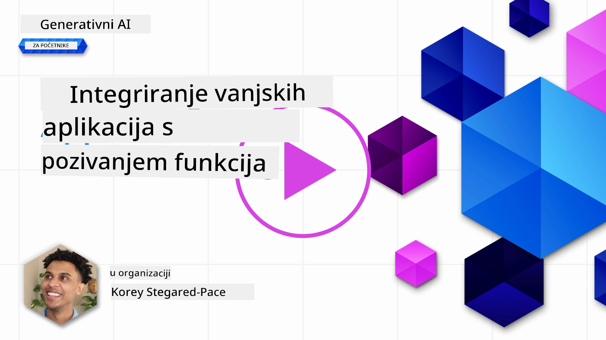
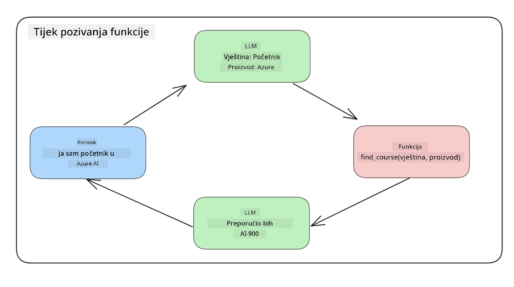
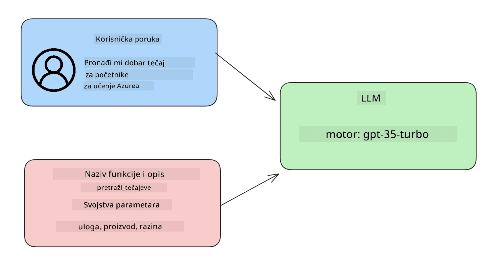

# Integracija s pozivanjem funkcija

[](https://youtu.be/DgUdCLX8qYQ?si=f1ouQU5HQx6F8Gl2)

Do sada ste naučili dosta u prethodnim lekcijama. Međutim, možemo se dodatno unaprijediti. Neke stvari koje možemo riješiti su kako dobiti konzistentniji format odgovora kako bi bilo lakše raditi s odgovorom u daljnjoj obradi. Također, možda ćemo htjeti dodati podatke iz drugih izvora kako bismo dodatno obogatili našu aplikaciju.

Gore spomenuti problemi su ono na što se ovaj poglavlje fokusira.

## Uvod

Ova lekcija će pokriti:

- Objasniti što je pozivanje funkcija i njihove primjene.
- Kreiranje poziva funkcije koristeći Azure OpenAI.
- Kako integrirati poziv funkcije u aplikaciju.

## Ciljevi učenja

Do kraja ove lekcije, moći ćete:

- Objasniti svrhu korištenja pozivanja funkcija.
- Postaviti poziv funkcije korištenjem Azure OpenAI servisa.
- Dizajnirati učinkovite pozive funkcija za slučaj uporabe vaše aplikacije.

## Scenarij: Poboljšanje našeg chatbota pomoću funkcija

Za ovu lekciju želimo izgraditi značajku za naš edukacijski startup koja korisnicima omogućuje korištenje chatbota za pronalaženje tehničkih tečajeva. Preporučivat ćemo tečajeve koji odgovaraju njihovoj razini znanja, trenutnoj ulozi i tehnologiji od interesa.

Za dovršetak ovog scenarija koristit ćemo kombinaciju:

- `Azure OpenAI` za stvaranje iskustva razgovora za korisnika.
- `Microsoft Learn Catalog API` koji pomaže korisnicima pronaći tečajeve temeljem zahtjeva korisnika.
- `Pozivanje funkcija` za preuzimanje upita korisnika i slanje funkciji da izvrši API zahtjev.

Za početak, pogledajmo zašto bismo uopće željeli koristiti pozivanje funkcija:

## Zašto pozivanje funkcija

Prije pozivanja funkcija, odgovori iz LLM-a bili su nestrukturirani i nekonzistentni. Programeri su morali pisati složene validacijske kodove kako bi osigurali rukovanje svake varijacije odgovora. Korisnici nisu mogli dobiti odgovore poput "Kakvo je trenutno vrijeme u Stockholmu?". To je zato što su modeli bili ograničeni na vrijeme kad su podaci bili trenirani.

Pozivanje funkcija je značajka Azure OpenAI servisa koja premošćuje sljedeća ograničenja:

- **Konzistentan format odgovora**. Ako možemo bolje kontrolirati format odgovora, možemo lakše integrirati odgovor u druge sustave.
- **Vanjski podaci**. Mogućnost korištenja podataka iz drugih izvora aplikacije u kontekstu razgovora.

## Ilustracija problema kroz scenarij

> Preporučujemo da koristite [priloženi notebook](./python/aoai-assignment.ipynb?WT.mc_id=academic-105485-koreyst) ako želite pokrenuti donji scenarij. Također možete samo čitati dok pokušavamo ilustrirati problem gdje funkcije mogu pomoći riješiti problem.

Pogledajmo primjer koji ilustrira problem formata odgovora:

Pretpostavimo da želimo stvoriti bazu podataka podataka o studentima kako bismo im mogli predložiti pravi tečaj. Ispod imamo dva opisa studenata koja su vrlo slična u podacima koje sadrže.

1. Stvorite vezu na naš Azure OpenAI resurs:

   ```python
   import os
   import json
   from openai import OpenAI
   from dotenv import load_dotenv
   load_dotenv()

   # API za odgovore se poslužuje s Azure OpenAI (Microsoft Foundry) v1 krajnje točke,
   # stoga usmjeravamo OpenAI klijent na <your-endpoint>/openai/v1/.
   endpoint = os.environ['AZURE_OPENAI_ENDPOINT']
   client = OpenAI(
   api_key=os.environ['AZURE_OPENAI_API_KEY'],
   base_url=f"{endpoint.rstrip('/')}/openai/v1/",
   )

   deployment=os.environ['AZURE_OPENAI_DEPLOYMENT']
   ```

   Ispod se nalazi Python kod za konfiguraciju naše veze s Azure OpenAI. Budući da koristimo v1 endpoint, potrebno je postaviti samo `api_key` i `base_url` (nije potrebna `api_version`).

1. Stvaranje dva opisa studenata pomoću varijabli `student_1_description` i `student_2_description`.

   ```python
   student_1_description="Emily Johnson is a sophomore majoring in computer science at Duke University. She has a 3.7 GPA. Emily is an active member of the university's Chess Club and Debate Team. She hopes to pursue a career in software engineering after graduating."

   student_2_description = "Michael Lee is a sophomore majoring in computer science at Stanford University. He has a 3.8 GPA. Michael is known for his programming skills and is an active member of the university's Robotics Club. He hopes to pursue a career in artificial intelligence after finishing his studies."
   ```

   Želimo poslati gornje opise studenata LLM-u kako bi se podaci parsirali. Ti podaci kasnije se mogu koristiti u našoj aplikaciji i poslati na API ili pohraniti u bazu podataka.

1. Stvorimo dva identična prompta u kojima uputimo LLM na koje informacije nas zanimaju:

   ```python
   prompt1 = f'''
   Please extract the following information from the given text and return it as a JSON object:

   name
   major
   school
   grades
   club

   This is the body of text to extract the information from:
   {student_1_description}
   '''

   prompt2 = f'''
   Please extract the following information from the given text and return it as a JSON object:

   name
   major
   school
   grades
   club

   This is the body of text to extract the information from:
   {student_2_description}
   '''
   ```

   Gornji prompti upute LLM da izvuče informacije i vrati odgovor u JSON formatu.

1. Nakon pripreme prompta i veze na Azure OpenAI, sada ćemo poslati prompt LLM-u koristeći `client.responses.create`. Pohranjujemo prompt u varijablu `input` i dodjeljujemo ulogu `user`. Ovo je da se oponaša poruka od korisnika napisana chatbotu.

   ```python
   # odgovor na upit jedan
   openai_response1 = client.responses.create(
   model=deployment,
   input = [{'role': 'user', 'content': prompt1}],
   store=False,
   )
   openai_response1.output_text

   # odgovor na upit dva
   openai_response2 = client.responses.create(
   model=deployment,
   input = [{'role': 'user', 'content': prompt2}],
   store=False,
   )
   openai_response2.output_text
   ```

Sada možemo poslati oba zahtjeva LLM-u i pregledati odgovor koji dobijemo pronalaženjem kao `openai_response1.output_text`.

1. Na kraju, možemo konvertirati odgovor u JSON format pozivom `json.loads`:

   ```python
   # Učitavanje odgovora kao JSON objekta
   json_response1 = json.loads(openai_response1.output_text)
   json_response1
   ```

   Odgovor 1:

   ```json
   {
     "name": "Emily Johnson",
     "major": "computer science",
     "school": "Duke University",
     "grades": "3.7",
     "club": "Chess Club"
   }
   ```

   Odgovor 2:

   ```json
   {
     "name": "Michael Lee",
     "major": "computer science",
     "school": "Stanford University",
     "grades": "3.8 GPA",
     "club": "Robotics Club"
   }
   ```

   Iako su prompti isti i opisi su slični, vidimo da su vrijednosti svojstva `Grades` formatirane različito, budući da ponekad dobijemo format `3.7` ili na primjer `3.7 GPA`.

   Ovaj rezultat je zato što LLM uzima nestrukturirane podatke u obliku napisanog prompta i također vraća nestrukturirane podatke. Trebamo imati strukturirani format kako bismo znali što očekivati pri pohrani ili korištenju tih podataka.

Pa kako onda riješiti problem formatiranja? Korištenjem pozivanja funkcija možemo osigurati da primimo strukturirane podatke natrag. Kod pozivanja funkcija LLM zapravo ne poziva ili ne izvršava nikakve funkcije. Umjesto toga, stvaramo strukturu koju LLM treba slijediti u svojim odgovorima. Zatim koristimo te strukturirane odgovore da znamo koju funkciju treba izvršiti u našim aplikacijama.



Tada možemo uzeti ono što funkcija vrati i poslati to natrag LLM-u. LLM će tada odgovoriti prirodnim jezikom na upit korisnika.

## Primjeri upotrebe pozivanja funkcija

Postoji mnogo različitih slučajeva gdje pozivi funkcija mogu poboljšati vašu aplikaciju, kao što su:

- **Pozivanje vanjskih alata**. Chatbotovi su odlični u pružanju odgovora na pitanja korisnika. Korištenjem pozivanja funkcija, chatbotovi mogu koristiti poruke korisnika za izvršenje određenih zadataka. Na primjer, student može tražiti od chatbota da "Pošalje e-mail mom predavaču da trebam dodatnu pomoć vezano uz ovaj predmet". To može biti funkcijski poziv `send_email(to: string, body: string)`

- **Kreiranje API ili baza podataka upita**. Korisnici mogu pronaći informacije korištenjem prirodnog jezika koje se zatim konvertiraju u formatirani upit ili API zahtjev. Primjer ovoga može biti učitelj koji traži "Koji su studenti završili zadnji zadatak" što može pozvati funkciju nazvanu `get_completed(student_name: string, assignment: int, current_status: string)`

- **Kreiranje strukturiranih podataka**. Korisnici mogu uzeti blok teksta ili CSV i koristiti LLM za izvlačenje važnih informacija iz njega. Primjerice, student može pretvoriti Wikipedia članak o mirovnim sporazumima u AI flash kartice. Ovo se može napraviti korištenjem funkcije `get_important_facts(agreement_name: string, date_signed: string, parties_involved: list)`

## Kreiranje vašeg prvog poziva funkcije

Proces kreiranja poziva funkcije uključuje 3 glavna koraka:

1. **Pozivanje** Responses API-ja s listom vaših funkcija (alata) i porukom korisnika.
2. **Čitanje** odgovora modela da bi se izvršila radnja, tj. izvršio poziv funkcije ili API poziv.
3. **Izvršavanje** još jednog poziva Responses API-ju s odgovorom iz vaše funkcije kako bi se ta informacija iskoristila za kreiranje odgovora korisniku.



### Korak 1 - kreiranje poruka

Prvi korak je kreirati poruku korisnika. Ovo može biti dinamički dodijeljeno uzimanjem vrijednosti iz tekstualnog input polja ili možete ovdje dodijeliti vrijednost. Ako radite prvi put s Responses API-jem, trebamo definirati `role` i `content` poruke.

`role` može biti `system` (kreiranje pravila), `assistant` (model) ili `user` (krajnji korisnik). Za pozivanje funkcija, dodijelit ćemo `user` i primjer pitanja.

```python
messages= [ {"role": "user", "content": "Find me a good course for a beginner student to learn Azure."} ]
```

Dodjeljivanjem različitih uloga, jasno je za LLM da li nešto kaže sustav ili korisnik, što pomaže u gradnji povijesti razgovora koju LLM može koristiti.

### Korak 2 - kreiranje funkcija

Zatim ćemo definirati funkciju i parametre te funkcije. Ovdje ćemo koristiti samo jednu funkciju nazvanu `search_courses` ali možete kreirati i više funkcija.

> **Važno** : Funkcije su uključene u sistemsku poruku LLM-u i ulaze u količinu dostupnih tokena koje imate.

Ispod stvaramo funkcije kao niz stavki. Svaka stavka je alat u formatu flat Responses API-ja, s svojstvima `type`, `name`, `description` i `parameters`:

```python
functions = [
   {
      "type":"function",
      "name":"search_courses",
      "description":"Retrieves courses from the search index based on the parameters provided",
      "parameters":{
         "type":"object",
         "properties":{
            "role":{
               "type":"string",
               "description":"The role of the learner (i.e. developer, data scientist, student, etc.)"
            },
            "product":{
               "type":"string",
               "description":"The product that the lesson is covering (i.e. Azure, Power BI, etc.)"
            },
            "level":{
               "type":"string",
               "description":"The level of experience the learner has prior to taking the course (i.e. beginner, intermediate, advanced)"
            }
         },
         "required":[
            "role"
         ]
      }
   }
]
```

Opisat ćemo detaljnije svaku instancu funkcije ispod:

- `name` - Ime funkcije koju želimo pozvati.
- `description` - Opis kako funkcija radi. Važno je biti specifičan i jasan.
- `parameters` - Lista vrijednosti i formata koje želite da model proizvede u svom odgovoru. Parametri se sastoje od stavki koje imaju sljedeća svojstva:
  1.  `type` - Tip podatka svojstava u kojoj će biti pohranjeni.
  1.  `properties` - Lista specifičnih vrijednosti koje će model koristiti za svoj odgovor
      1. `name` - Ključ je ime svojstva koje će model koristiti u svom formatiranom odgovoru, na primjer, `product`.
      1. `type` - Tip podatka ovog svojstva, na primjer, `string`.
      1. `description` - Opis specifičnog svojstva.

Postoji i opcionalno svojstvo `required` - zahtijevano svojstvo za dovršetak poziva funkcije.

### Korak 3 - Izvršavanje poziva funkcije

Nakon definiranja funkcije, sada je potrebno uključiti je u poziv Responses API-ja. To činimo dodavanjem `tools` u zahtjev. U ovom slučaju `tools=functions`.

Također postoji opcija postaviti `tool_choice` na `auto`. To znači da ćemo pustiti LLM da odluči koja će funkcija biti pozvana na osnovu poruke korisnika umjesto da je sami dodijelimo.

Ispod je kod u kojem pozivamo `client.responses.create`, primijetite kako postavljamo `tools=functions` i `tool_choice="auto"` dajući tako LLM-u slobodu kad će pozvati funkcije koje mu pružimo:

```python
response = client.responses.create(model=deployment,
                                        input=messages,
                                        tools=functions,
                                        tool_choice="auto",
                                        store=False)

print(response.output)
```

Odgovor koji dolazi sada uključuje stavku `function_call` u `response.output` koja izgleda ovako:

```json
{
  "type": "function_call",
  "name": "search_courses",
  "call_id": "call_abc123",
  "arguments": "{\n  \"role\": \"student\",\n  \"product\": \"Azure\",\n  \"level\": \"beginner\"\n}"
}
```

Ovdje možemo vidjeti kako je funkcija `search_courses` pozvana i s kojim argumentima, kako je navedeno u svojstvu `arguments` u JSON odgovoru.

Zaključak je da je LLM uspio pronaći podatke koji odgovaraju argumentima funkcije dok ih je izvlačio iz vrijednosti dodijeljene parametru `input` u pozivu Responses API-ja. Ispod podsjetnik na `messages` vrijednost:

```python
messages= [ {"role": "user", "content": "Find me a good course for a beginner student to learn Azure."} ]
```

Kao što vidite, `student`, `Azure` i `beginner` su izdvojeni iz `messages` i postavljeni kao ulaz u funkciju. Korištenje funkcija na ovaj način je izvrstan način izvlačenja informacija iz prompta, ali i za pružanje strukture LLM-u i imati ponovljivo funkcioniranje.

Sljedeće, trebamo vidjeti kako možemo ovo iskoristiti u našoj aplikaciji.

## Integracija poziva funkcija u aplikaciju

Nakon što smo testirali formatirani odgovor iz LLM-a, sada to možemo integrirati u aplikaciju.

### Upravljanje protokom

Za integraciju u našu aplikaciju, poduzmimo sljedeće korake:

1. Prvo, izvršimo poziv OpenAI servisa i izdvojimo stavke poziva funkcija iz odgovora `output`.

   ```python
   response_items = response.output
   tool_calls = [item for item in response_items if item.type == "function_call"]
   ```

1. Sada definirat ćemo funkciju koja će pozvati Microsoft Learn API da dobije listu tečajeva:

   ```python
   import requests

   def search_courses(role, product, level):
     url = "https://learn.microsoft.com/api/catalog/"
     params = {
        "role": role,
        "product": product,
        "level": level
     }
     response = requests.get(url, params=params)
     modules = response.json()["modules"]
     results = []
     for module in modules[:5]:
        title = module["title"]
        url = module["url"]
        results.append({"title": title, "url": url})
     return str(results)
   ```

   Primijetite kako sada stvaramo stvarnu Python funkciju koja mapira imena funkcija predstavljena u varijabli `functions`. Također vršimo stvarne vanjske API pozive da dohvatimo potrebne podatke. U ovom slučaju koristimo Microsoft Learn API za pretraživanje modula za obuku.

Dobro, stvorili smo varijablu `functions` i odgovarajuću Python funkciju, kako LLM-u reći kako povezati ta dva da bi naša Python funkcija bila pozvana?

1. Da bismo provjerili treba li pozvati Python funkciju, trebamo pogledati odgovor LLM-a i vidjeti sadrži li stavku `function_call` i zatim pozvati označenu funkciju. Evo kako to možete provjeriti ispod:

   ```python
   # Provjeri želi li model pozvati funkciju
   if tool_calls:
    for tool_call in tool_calls:
     print("Recommended Function call:")
     print(tool_call.name)
     print()

     # Pozovi funkciju.
     function_name = tool_call.name

     available_functions = {
             "search_courses": search_courses,
     }
     function_to_call = available_functions[function_name]

     function_args = json.loads(tool_call.arguments)
     function_response = function_to_call(**function_args)

     print("Output of function call:")
     print(function_response)
     print(type(function_response))

     # Dodaj poziv funkcije i njegov rezultat natrag u razgovor.
     # Stavka function_call modela mora biti dodana prije njegovog izlaza.
     messages.append(tool_call)  # stavka function_call asistenta
     messages.append( # rezultat funkcije
         {
             "type": "function_call_output",
             "call_id": tool_call.call_id,
             "output": function_response,
         }
     )
   ```

   Ove tri linije osiguravaju da izvučemo ime funkcije, argumente i izvršimo poziv:

   ```python
   function_to_call = available_functions[function_name]

   function_args = json.loads(tool_call.arguments)
   function_response = function_to_call(**function_args)
   ```

   Ispod je izlaz pri pokretanju našeg koda:

   **Izlaz**

   ```Recommended Function call:
   {
     "name": "search_courses",
     "arguments": "{\n  \"role\": \"student\",\n  \"product\": \"Azure\",\n  \"level\": \"beginner\"\n}"
   }

   Output of function call:
   [{'title': 'Describe concepts of cryptography', 'url': 'https://learn.microsoft.com/training/modules/describe-concepts-of-cryptography/?
   WT.mc_id=api_CatalogApi'}, {'title': 'Introduction to audio classification with TensorFlow', 'url': 'https://learn.microsoft.com/en-
   us/training/modules/intro-audio-classification-tensorflow/?WT.mc_id=api_CatalogApi'}, {'title': 'Design a Performant Data Model in Azure SQL
   Database with Azure Data Studio', 'url': 'https://learn.microsoft.com/training/modules/design-a-data-model-with-ads/?
   WT.mc_id=api_CatalogApi'}, {'title': 'Getting started with the Microsoft Cloud Adoption Framework for Azure', 'url':
   'https://learn.microsoft.com/training/modules/cloud-adoption-framework-getting-started/?WT.mc_id=api_CatalogApi'}, {'title': 'Set up the
   Rust development environment', 'url': 'https://learn.microsoft.com/training/modules/rust-set-up-environment/?WT.mc_id=api_CatalogApi'}]
   <class 'str'>
   ```

1. Sada ćemo poslati ažuriranu poruku, `messages` LLM-u kako bismo mogli dobiti odgovor na prirodnom jeziku umjesto JSON formata odgovora API-ja.

   ```python
   print("Messages in next request:")
   print(messages)
   print()

   second_response = client.responses.create(
      input=messages,
      model=deployment,
      tool_choice="auto",
      tools=functions,
      temperature=0,
      store=False,
         )  # dobiti novi odgovor od modela gdje može vidjeti odgovor funkcije


   print(second_response.output_text)
   ```

   **Izlaz**

   ```text
   I found some good courses for beginner students to learn Azure:

   1. [Describe concepts of cryptography](https://learn.microsoft.com/training/modules/describe-concepts-of-cryptography/?WT.mc_id=api_CatalogApi)
   2. [Introduction to audio classification with TensorFlow](https://learn.microsoft.com/training/modules/intro-audio-classification-tensorflow/?WT.mc_id=api_CatalogApi)
   3. [Design a Performant Data Model in Azure SQL Database with Azure Data Studio](https://learn.microsoft.com/training/modules/design-a-data-model-with-ads/?WT.mc_id=api_CatalogApi)
   4. [Getting started with the Microsoft Cloud Adoption Framework for Azure](https://learn.microsoft.com/training/modules/cloud-adoption-framework-getting-started/?WT.mc_id=api_CatalogApi)
   5. [Set up the Rust development environment](https://learn.microsoft.com/training/modules/rust-set-up-environment/?WT.mc_id=api_CatalogApi)

   You can click on the links to access the courses.
   ```

## Zadatak

Za nastavak učenja o Azure OpenAI Function Calling možete izgraditi:

- Više parametara funkcije koji bi mogli pomoći učenicima pronaći više tečajeva.

- Napravite još jedan poziv funkcije koji uzima više informacija od učenika, poput njihovog izvornog jezika
- Napravite rukovanje greškama kada poziv funkcije i/ili API poziv ne vrati prikladne tečajeve

Hint: Slijedite [Learn API referentnu dokumentaciju](https://learn.microsoft.com/training/support/catalog-api-developer-reference?WT.mc_id=academic-105485-koreyst) kako biste vidjeli kako i gdje su ti podaci dostupni.

## Sjajan posao! Nastavite svoje putovanje

Nakon što završite ovu lekciju, pogledajte našu [Generative AI Learning kolekciju](https://aka.ms/genai-collection?WT.mc_id=academic-105485-koreyst) kako biste nastavili podizati svoje znanje o Generativnoj AI!

Pređite na Lekciju 12, gdje ćemo pogledati kako [dizajnirati UX za AI aplikacije](../12-designing-ux-for-ai-applications/README.md?WT.mc_id=academic-105485-koreyst)!

---

<!-- CO-OP TRANSLATOR DISCLAIMER START -->
**Napomena**:
Ovaj dokument je preveden korištenjem AI prevoditeljskog servisa [Co-op Translator](https://github.com/Azure/co-op-translator). Iako težimo točnosti, imajte na umu da automatski prijevodi mogu sadržavati greške ili netočnosti. Izvorni dokument na izvornom jeziku treba smatrati autoritativnim izvorom. Za važne informacije preporuča se profesionalni ljudski prijevod. Nismo odgovorni za bilo kakva nesporazumevanja ili pogrešne interpretacije koje proizlaze iz korištenja ovog prijevoda.
<!-- CO-OP TRANSLATOR DISCLAIMER END -->