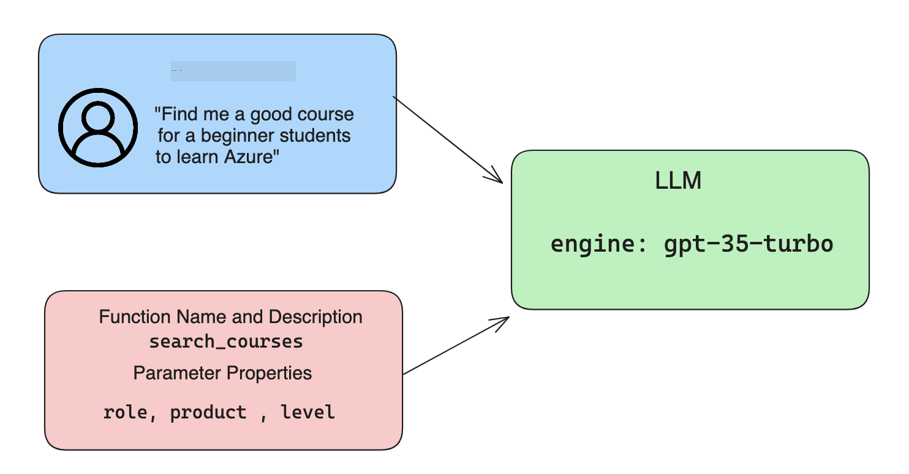

<!--
CO_OP_TRANSLATOR_METADATA:
{
  "original_hash": "77a48a201447be19aa7560706d6f93a0",
  "translation_date": "2025-07-09T14:44:53+00:00",
  "source_file": "11-integrating-with-function-calling/README.md",
  "language_code": "hr"
}
-->
# Integracija s pozivanjem funkcija

[](https://aka.ms/gen-ai-lesson11-gh?WT.mc_id=academic-105485-koreyst)

Do sada ste naučili dosta kroz prethodne lekcije. Međutim, možemo ići i korak dalje. Neke stvari koje možemo poboljšati su kako dobiti dosljedniji format odgovora kako bi bilo lakše raditi s odgovorom u daljnjoj obradi. Također, možda želimo dodati podatke iz drugih izvora kako bismo dodatno obogatili našu aplikaciju.

Problemi spomenuti gore su ono na što se ovaj poglavlje fokusira.

## Uvod

Ova lekcija će obuhvatiti:

- Objašnjenje što je pozivanje funkcija i u kojim se slučajevima koristi.
- Kreiranje poziva funkcije koristeći Azure OpenAI.
- Kako integrirati poziv funkcije u aplikaciju.

## Ciljevi učenja

Na kraju ove lekcije moći ćete:

- Objasniti svrhu korištenja pozivanja funkcija.
- Postaviti Function Call koristeći Azure OpenAI Service.
- Dizajnirati učinkovite pozive funkcija za potrebe vaše aplikacije.

## Scenarij: Poboljšanje našeg chatbota funkcijama

Za ovu lekciju želimo izgraditi značajku za naš startup u obrazovanju koja korisnicima omogućuje korištenje chatbota za pronalazak tehničkih tečajeva. Preporučivat ćemo tečajeve koji odgovaraju njihovoj razini znanja, trenutnoj ulozi i tehnologiji od interesa.

Za dovršetak ovog scenarija koristit ćemo kombinaciju:

- `Azure OpenAI` za kreiranje chat iskustva za korisnika.
- `Microsoft Learn Catalog API` za pomoć korisnicima u pronalasku tečajeva na temelju njihovih zahtjeva.
- `Function Calling` za preuzimanje korisničkog upita i slanje funkciji koja će napraviti API zahtjev.

Za početak, pogledajmo zašto bismo uopće željeli koristiti pozivanje funkcija:

## Zašto pozivanje funkcija

Prije pozivanja funkcija, odgovori iz LLM-a bili su nestrukturirani i nedosljedni. Programeri su morali pisati složen kod za validaciju kako bi mogli obraditi svaku varijaciju odgovora. Korisnici nisu mogli dobiti odgovore poput "Kakvo je trenutno vrijeme u Stockholmu?". To je zato što su modeli bili ograničeni na podatke na kojima su trenirani.

Pozivanje funkcija je značajka Azure OpenAI servisa koja rješava sljedeća ograničenja:

- **Dosljedan format odgovora**. Ako možemo bolje kontrolirati format odgovora, lakše ga možemo integrirati u druge sustave.
- **Vanjski podaci**. Mogućnost korištenja podataka iz drugih izvora aplikacije u kontekstu chata.

## Ilustracija problema kroz scenarij

> Preporučujemo da koristite [priloženi notebook](../../../11-integrating-with-function-calling/python/aoai-assignment.ipynb) ako želite pokrenuti donji scenarij. Također možete samo pratiti čitanje dok pokušavamo ilustrirati problem koji funkcije mogu pomoći riješiti.

Pogledajmo primjer koji ilustrira problem formata odgovora:

Recimo da želimo napraviti bazu podataka o studentima kako bismo im mogli predložiti odgovarajući tečaj. Ispod imamo dva opisa studenata koji su vrlo slični u podacima koje sadrže.

1. Kreirajte vezu s našim Azure OpenAI resursom:

   ```python
   import os
   import json
   from openai import AzureOpenAI
   from dotenv import load_dotenv
   load_dotenv()

   client = AzureOpenAI(
   api_key=os.environ['AZURE_OPENAI_API_KEY'],  # this is also the default, it can be omitted
   api_version = "2023-07-01-preview"
   )

   deployment=os.environ['AZURE_OPENAI_DEPLOYMENT']
   ```

   Ispod je Python kod za konfiguraciju veze s Azure OpenAI gdje postavljamo `api_type`, `api_base`, `api_version` i `api_key`.

1. Kreiranje dva opisa studenata koristeći varijable `student_1_description` i `student_2_description`.

   ```python
   student_1_description="Emily Johnson is a sophomore majoring in computer science at Duke University. She has a 3.7 GPA. Emily is an active member of the university's Chess Club and Debate Team. She hopes to pursue a career in software engineering after graduating."

   student_2_description = "Michael Lee is a sophomore majoring in computer science at Stanford University. He has a 3.8 GPA. Michael is known for his programming skills and is an active member of the university's Robotics Club. He hopes to pursue a career in artificial intelligence after finishing his studies."
   ```

   Želimo poslati gore navedene opise studenata LLM-u da parsira podatke. Ti se podaci kasnije mogu koristiti u našoj aplikaciji i poslati na API ili pohraniti u bazu podataka.

1. Napravimo dva identična prompta u kojima uputimo LLM što nas zanima:

   ```python
   prompt1 = f'''
   Please extract the following information from the given text and return it as a JSON object:

   name
   major
   school
   grades
   club

   This is the body of text to extract the information from:
   {student_1_description}
   '''

   prompt2 = f'''
   Please extract the following information from the given text and return it as a JSON object:

   name
   major
   school
   grades
   club

   This is the body of text to extract the information from:
   {student_2_description}
   '''
   ```

   Gornji prompti upute LLM da izvuče informacije i vrati odgovor u JSON formatu.

1. Nakon postavljanja prompta i veze s Azure OpenAI, sada ćemo poslati promptove LLM-u koristeći `openai.ChatCompletion`. Spremamo prompt u varijablu `messages` i dodjeljujemo ulogu `user`. Ovo simulira poruku korisnika upisanu u chatbot.

   ```python
   # response from prompt one
   openai_response1 = client.chat.completions.create(
   model=deployment,
   messages = [{'role': 'user', 'content': prompt1}]
   )
   openai_response1.choices[0].message.content

   # response from prompt two
   openai_response2 = client.chat.completions.create(
   model=deployment,
   messages = [{'role': 'user', 'content': prompt2}]
   )
   openai_response2.choices[0].message.content
   ```

Sada možemo poslati oba zahtjeva LLM-u i pregledati odgovor koji dobijemo pronalaskom kao `openai_response1['choices'][0]['message']['content']`.

1. Na kraju, možemo pretvoriti odgovor u JSON format pozivom `json.loads`:

   ```python
   # Loading the response as a JSON object
   json_response1 = json.loads(openai_response1.choices[0].message.content)
   json_response1
   ```

   Odgovor 1:

   ```json
   {
     "name": "Emily Johnson",
     "major": "computer science",
     "school": "Duke University",
     "grades": "3.7",
     "club": "Chess Club"
   }
   ```

   Odgovor 2:

   ```json
   {
     "name": "Michael Lee",
     "major": "computer science",
     "school": "Stanford University",
     "grades": "3.8 GPA",
     "club": "Robotics Club"
   }
   ```

   Iako su prompti isti, a opisi slični, vidimo da su vrijednosti svojstva `Grades` formatirane različito, ponekad kao `3.7`, a ponekad kao `3.7 GPA`.

   Ovaj rezultat je zato što LLM prima nestrukturirane podatke u obliku pisanog prompta i vraća također nestrukturirane podatke. Potreban nam je strukturirani format kako bismo znali što očekivati prilikom pohrane ili korištenja tih podataka.

Kako onda riješiti problem formata? Korištenjem pozivanja funkcija možemo osigurati da dobijemo strukturirane podatke natrag. Kada koristimo pozivanje funkcija, LLM zapravo ne poziva niti izvršava funkcije. Umjesto toga, kreiramo strukturu koju LLM treba slijediti u svojim odgovorima. Zatim te strukturirane odgovore koristimo da znamo koju funkciju pokrenuti u našim aplikacijama.


Nakon toga možemo uzeti ono što funkcija vrati i poslati to natrag LLM-u. LLM će zatim odgovoriti prirodnim jezikom kako bi odgovorio na korisnički upit.

## Primjeri korištenja poziva funkcija

Postoji mnogo različitih primjera gdje pozivi funkcija mogu poboljšati vašu aplikaciju, kao što su:

- **Pozivanje vanjskih alata**. Chatbotovi su izvrsni u pružanju odgovora na pitanja korisnika. Korištenjem pozivanja funkcija, chatbotovi mogu koristiti poruke korisnika za izvršavanje određenih zadataka. Na primjer, student može zatražiti od chatbota: "Pošalji e-mail mom predavaču da mi treba dodatna pomoć s ovim predmetom". To može napraviti poziv funkcije `send_email(to: string, body: string)`.

- **Kreiranje API ili upita u bazu podataka**. Korisnici mogu pronaći informacije koristeći prirodni jezik koji se zatim pretvara u formatirani upit ili API zahtjev. Primjer bi mogao biti nastavnik koji pita: "Tko su studenti koji su završili zadnji zadatak", što može pozvati funkciju `get_completed(student_name: string, assignment: int, current_status: string)`.

- **Kreiranje strukturiranih podataka**. Korisnici mogu uzeti blok teksta ili CSV i koristiti LLM za izvlačenje važnih informacija. Na primjer, student može pretvoriti Wikipedia članak o mirovnim sporazumima u AI flashcards. To se može napraviti korištenjem funkcije `get_important_facts(agreement_name: string, date_signed: string, parties_involved: list)`.

## Kreiranje vašeg prvog poziva funkcije

Proces kreiranja poziva funkcije uključuje 3 glavna koraka:

1. **Pozivanje** Chat Completions API-ja s popisom vaših funkcija i porukom korisnika.
2. **Čitanje** odgovora modela kako biste izvršili akciju, tj. pozvali funkciju ili API.
3. **Ponovno pozivanje** Chat Completions API-ja s odgovorom vaše funkcije kako biste koristili te informacije za kreiranje odgovora korisniku.



### Korak 1 - kreiranje poruka

Prvi korak je kreirati poruku korisnika. Ona se može dinamički dodijeliti uzimanjem vrijednosti iz tekstualnog unosa ili joj možete ovdje dodijeliti vrijednost. Ako je ovo vaš prvi put da radite s Chat Completions API-jem, trebamo definirati `role` i `content` poruke.

`role` može biti `system` (kreiranje pravila), `assistant` (model) ili `user` (krajnji korisnik). Za pozivanje funkcija dodijelit ćemo ulogu `user` i primjer pitanja.

```python
messages= [ {"role": "user", "content": "Find me a good course for a beginner student to learn Azure."} ]
```

Dodjeljivanjem različitih uloga jasno je LLM-u tko nešto govori, sustav ili korisnik, što pomaže u izgradnji povijesti razgovora na koju se LLM može nadovezati.

### Korak 2 - kreiranje funkcija

Sljedeće ćemo definirati funkciju i parametre te funkcije. Ovdje ćemo koristiti samo jednu funkciju nazvanu `search_courses`, ali možete kreirati više funkcija.

> **Važno** : Funkcije su uključene u sistemsku poruku LLM-u i ulaze u broj dostupnih tokena koje imate.

Ispod kreiramo funkcije kao niz stavki. Svaka stavka je funkcija i ima svojstva `name`, `description` i `parameters`:

```python
functions = [
   {
      "name":"search_courses",
      "description":"Retrieves courses from the search index based on the parameters provided",
      "parameters":{
         "type":"object",
         "properties":{
            "role":{
               "type":"string",
               "description":"The role of the learner (i.e. developer, data scientist, student, etc.)"
            },
            "product":{
               "type":"string",
               "description":"The product that the lesson is covering (i.e. Azure, Power BI, etc.)"
            },
            "level":{
               "type":"string",
               "description":"The level of experience the learner has prior to taking the course (i.e. beginner, intermediate, advanced)"
            }
         },
         "required":[
            "role"
         ]
      }
   }
]
```

Detaljnije opisujemo svaku instancu funkcije:

- `name` - Ime funkcije koju želimo pozvati.
- `description` - Opis kako funkcija radi. Važno je biti jasan i precizan.
- `parameters` - Popis vrijednosti i formata koje želite da model proizvede u svom odgovoru. Niz parametara sastoji se od stavki koje imaju sljedeća svojstva:
  1. `type` - Tip podataka u kojem će se svojstva pohraniti.
  1. `properties` - Popis specifičnih vrijednosti koje će model koristiti u svom odgovoru
      1. `name` - Ključ je ime svojstva koje će model koristiti u formatiranom odgovoru, npr. `product`.
      1. `type` - Tip podataka tog svojstva, npr. `string`.
      1. `description` - Opis specifičnog svojstva.

Postoji i opcionalno svojstvo `required` - obavezno svojstvo za dovršetak poziva funkcije.

### Korak 3 - izvršavanje poziva funkcije

Nakon definiranja funkcije, sada je trebamo uključiti u poziv Chat Completion API-ja. To radimo dodavanjem `functions` u zahtjev. U ovom slučaju `functions=functions`.

Također postoji opcija postaviti `function_call` na `auto`. To znači da ćemo dopustiti LLM-u da odluči koju funkciju treba pozvati na temelju korisničke poruke, umjesto da to sami određujemo.

Ispod je kod gdje pozivamo `ChatCompletion.create`, primijetite kako postavljamo `functions=functions` i `function_call="auto"` te tako dajemo LLM-u izbor kada će pozvati funkcije koje mu pružamo:

```python
response = client.chat.completions.create(model=deployment,
                                        messages=messages,
                                        functions=functions,
                                        function_call="auto")

print(response.choices[0].message)
```

Odgovor koji sada dolazi izgleda ovako:

```json
{
  "role": "assistant",
  "function_call": {
    "name": "search_courses",
    "arguments": "{\n  \"role\": \"student\",\n  \"product\": \"Azure\",\n  \"level\": \"beginner\"\n}"
  }
}
```

Ovdje možemo vidjeti kako je funkcija `search_courses` pozvana i s kojim argumentima, navedenim u svojstvu `arguments` u JSON odgovoru.

Zaključak je da je LLM uspio pronaći podatke koji odgovaraju argumentima funkcije jer ih je izvlačio iz vrijednosti proslijeđene u `messages` parametar u pozivu chat completion.

Ispod je podsjetnik na vrijednost `messages`:

```python
messages= [ {"role": "user", "content": "Find me a good course for a beginner student to learn Azure."} ]
```

Kao što vidite, `student`, `Azure` i `beginner` su izdvojeni iz `messages` i postavljeni kao ulaz u funkciju. Korištenje funkcija na ovaj način odličan je način za izvlačenje informacija iz prompta, ali i za pružanje strukture LLM-u i omogućavanje ponovne upotrebe funkcionalnosti.

Sljedeće, trebamo vidjeti kako to možemo koristiti u našoj aplikaciji.

## Integracija poziva funkcija u aplikaciju

Nakon što smo testirali formatirani odgovor iz LLM-a, sada ga možemo integrirati u aplikaciju.

### Upravljanje tijekom rada

Za integraciju u našu aplikaciju, poduzmimo sljedeće korake:

1. Prvo, napravimo poziv OpenAI servisima i spremimo poruku u varijablu nazvanu `response_message`.

   ```python
   response_message = response.choices[0].message
   ```

1. Sada ćemo definirati funkciju koja će pozvati Microsoft Learn API kako bi dobili popis tečajeva:

   ```python
   import requests

   def search_courses(role, product, level):
     url = "https://learn.microsoft.com/api/catalog/"
     params = {
        "role": role,
        "product": product,
        "level": level
     }
     response = requests.get(url, params=params)
     modules = response.json()["modules"]
     results = []
     for module in modules[:5]:
        title = module["title"]
        url = module["url"]
        results.append({"title": title, "url": url})
     return str(results)
   ```

   Primijetite kako sada kreiramo stvarnu Python funkciju koja se mapira na imena funkcija definirana u varijabli `functions`. Također radimo stvarne vanjske API pozive za dohvat potrebnih podataka. U ovom slučaju, koristimo Microsoft Learn API za pretraživanje modula za obuku.

Ok, kreirali smo varijablu `functions` i odgovarajuću Python funkciju, kako onda LLM-u kažemo kako ih povezati da se naša Python funkcija pozove?

1. Da bismo provjerili treba li pozvati Python funkciju, trebamo pogledati odgovor LLM-a i vidjeti je li `function_call` dio odgovora te pozvati označenu funkciju. Evo kako to možete provjeriti:

   ```python
   # Check if the model wants to call a function
   if response_message.function_call.name:
    print("Recommended Function call:")
    print(response_message.function_call.name)
    print()

    # Call the function.
    function_name = response_message.function_call.name

    available_functions = {
            "search_courses": search_courses,
    }
    function_to_call = available_functions[function_name]

    function_args = json.loads(response_message.function_call.arguments)
    function_response = function_to_call(**function_args)

    print("Output of function call:")
    print(function_response)
    print(type(function_response))


    # Add the assistant response and function response to the messages
    messages.append( # adding assistant response to messages
        {
            "role": response_message.role,
            "function_call": {
                "name": function_name,
                "arguments": response_message.function_call.arguments,
            },
            "content": None
        }
    )
    messages.append( # adding function response to messages
        {
            "role": "function",
            "name": function_name,
            "content":function_response,
        }
    )
   ```

   Ove tri linije osiguravaju da izdvojimo ime funkcije, argumente i izvršimo poziv:

   ```python
   function_to_call = available_functions[function_name]

   function_args = json.loads(response_message.function_call.arguments)
   function_response = function_to_call(**function_args)
   ```

   Ispod je ispis nakon pokretanja našeg koda:

   **Ispis**

   ```Recommended Function call:
   {
     "name": "search_courses",
     "arguments": "{\n  \"role\": \"student\",\n  \"product\": \"Azure\",\n  \"level\": \"beginner\"\n}"
   }

   Output of function call:
   [{'title': 'Describe concepts of cryptography', 'url': 'https://learn.microsoft.com/training/modules/describe-concepts-of-cryptography/?
   WT.mc_id=api_CatalogApi'}, {'title': 'Introduction to audio classification with TensorFlow', 'url': 'https://learn.microsoft.com/en-
   us/training/modules/intro-audio-classification-tensorflow/?WT.mc_id=api_CatalogApi'}, {'title': 'Design a Performant Data Model in Azure SQL
   Database with Azure Data Studio', 'url': 'https://learn.microsoft.com/training/modules/design-a-data-model-with-ads/?
   WT.mc_id=api_CatalogApi'}, {'title': 'Getting started with the Microsoft Cloud Adoption Framework for Azure', 'url':
   'https://learn.microsoft.com/training/modules/cloud-adoption-framework-getting-started/?WT.mc_id=api_CatalogApi'}, {'title': 'Set up the
   Rust development environment', 'url': 'https://learn.microsoft.com/training/modules/rust-set-up-environment/?WT.mc_id=api_CatalogApi'}]
   <class 'str'>
   ```

1. Sada ćemo poslati ažuriranu poruku, `messages` LLM-u kako bismo dobili odgovor na prirodnom jeziku umjesto API JSON formatiranog odgovora.

   ```python
   print("Messages in next request:")
   print(messages)
   print()

   second_response = client.chat.completions.create(
      messages=messages,
      model=deployment,
      function_call="auto",
      functions=functions,
      temperature=0
         )  # get a new response from GPT where it can see the function response


   print(second_response.choices[0].message)
   ```

   **Ispis**

   ```python
   {
     "role": "assistant",
     "content": "I found some good courses for beginner students to learn Azure:\n\n1. [Describe concepts of cryptography] (https://learn.microsoft.com/training/modules/describe-concepts-of-cryptography/?WT.mc_id=api_CatalogApi)\n2. [Introduction to audio classification with TensorFlow](https://learn.microsoft.com/training/modules/intro-audio-classification-tensorflow/?WT.mc_id=api_CatalogApi)\n3. [Design a Performant Data Model in Azure SQL Database with Azure Data Studio](https://learn.microsoft.com/training/modules/design-a-data-model-with-ads/?WT.mc_id=api_CatalogApi)\n4. [Getting started with the Microsoft Cloud Adoption Framework for Azure](https://learn.microsoft.com/training/modules/cloud-adoption-framework-getting-started/?WT.mc_id=api_CatalogApi)\n5. [Set up the Rust development environment](https://learn.microsoft.com/training/modules/rust-set-up-environment/?WT.mc_id=api_CatalogApi)\n\nYou can click on the links to access the courses."
   }

   ```

## Zadatak

Za nastavak učenja o Azure OpenAI Function Calling možete izgraditi:

- Više parametara funkcije koji bi mogli pomoći učenicima pronaći više tečajeva.
- Kreirati još jedan poziv funkcije koji uzima dodatne informacije od učenika, poput njihovog materinjeg jezika.
- Kreirati obradu pogrešaka kada poziv funkcije i/ili API poziv ne vrati odgovarajuće tečajeve.
## Sjajan posao! Nastavi putovanje

Nakon što završiš ovaj lekciju, pogledaj našu [Generative AI Learning kolekciju](https://aka.ms/genai-collection?WT.mc_id=academic-105485-koreyst) kako bi nastavio unapređivati svoje znanje o Generativnoj umjetnoj inteligenciji!

Kreni na Lekciju 12, gdje ćemo pogledati kako [dizajnirati UX za AI aplikacije](../12-designing-ux-for-ai-applications/README.md?WT.mc_id=academic-105485-koreyst)!

**Odricanje od odgovornosti**:  
Ovaj dokument je preveden korištenjem AI usluge za prevođenje [Co-op Translator](https://github.com/Azure/co-op-translator). Iako nastojimo postići točnost, imajte na umu da automatski prijevodi mogu sadržavati pogreške ili netočnosti. Izvorni dokument na izvornom jeziku treba smatrati autoritativnim izvorom. Za kritične informacije preporučuje se profesionalni ljudski prijevod. Ne snosimo odgovornost za bilo kakva nesporazume ili pogrešna tumačenja koja proizlaze iz korištenja ovog prijevoda.