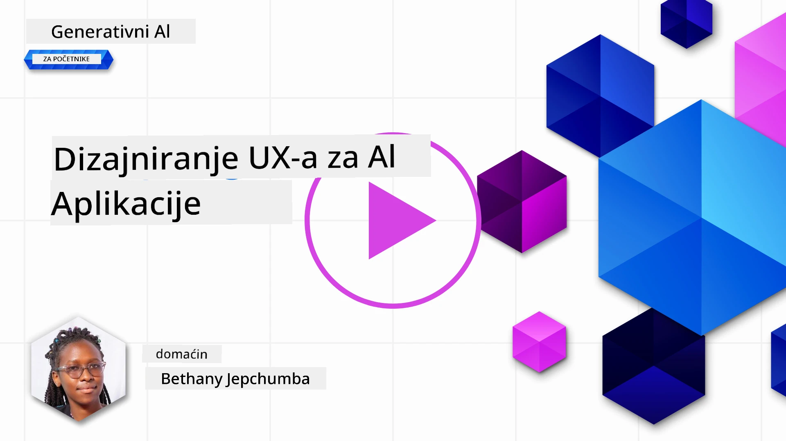
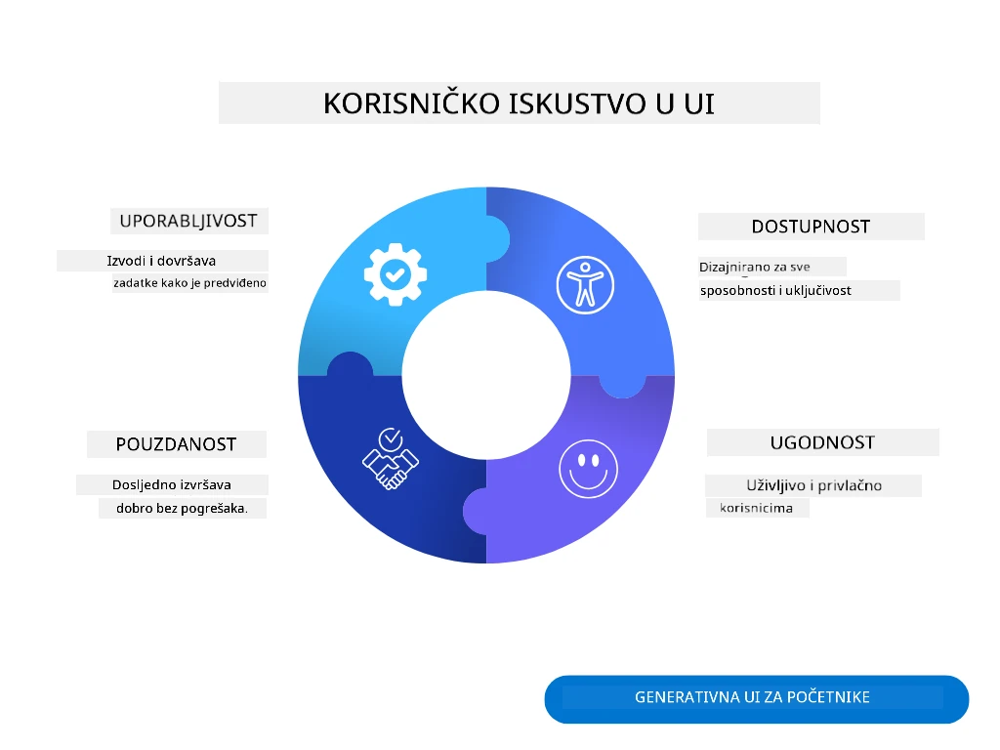
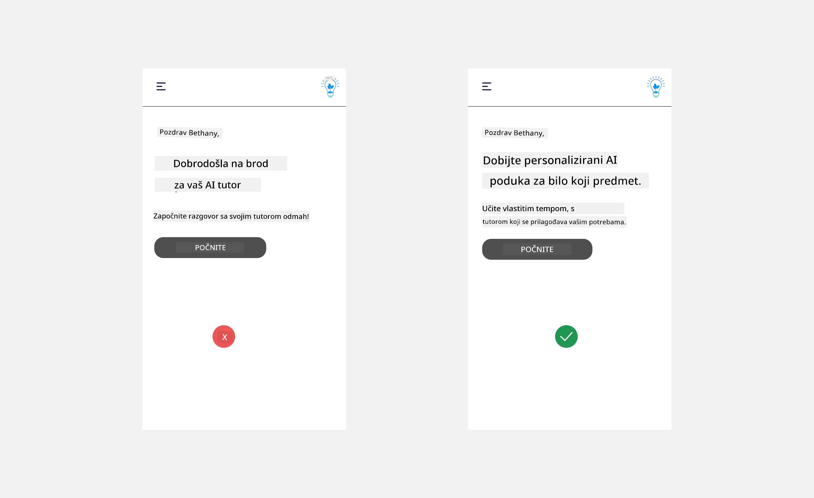
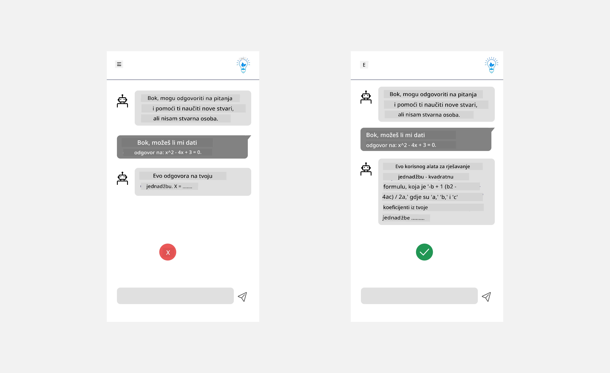
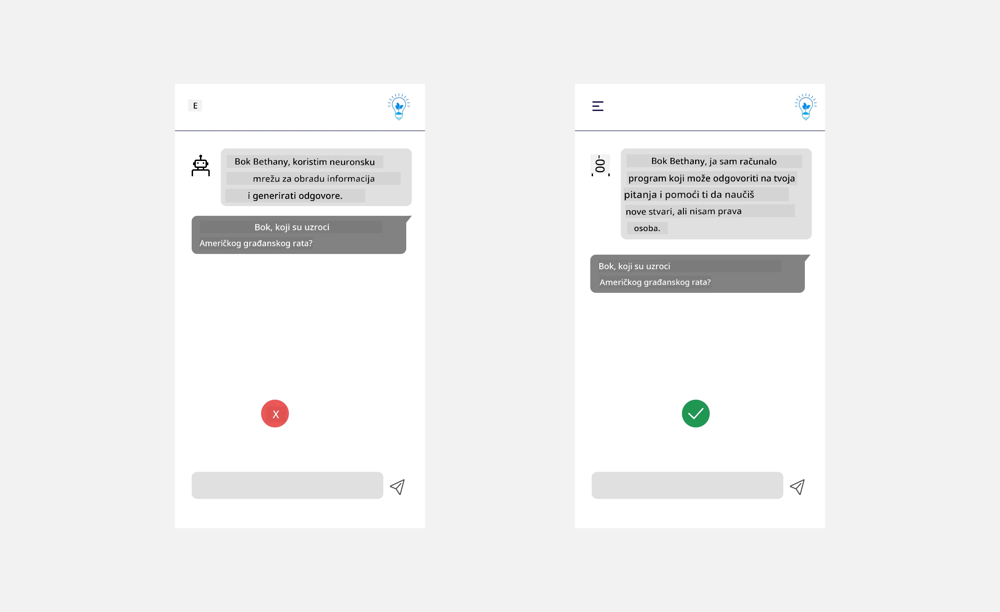
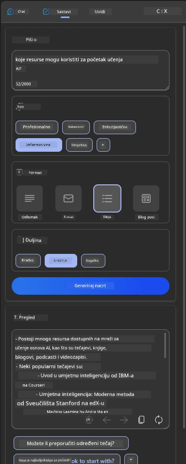
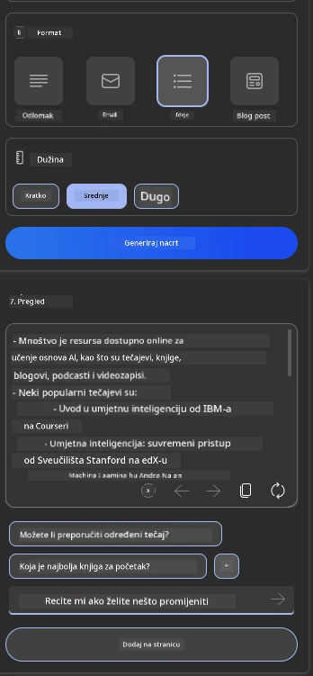

# Dizajniranje UX-a za AI aplikacije

> _(Kliknite na gornju sliku za prikaz videozapisa ove lekcije)_

Korisničko iskustvo je vrlo važan aspekt izgradnje aplikacija. Korisnici trebaju moći koristiti vašu aplikaciju na učinkovit način za obavljanje zadataka. Biti učinkovit je jedno, ali također trebate dizajnirati aplikacije tako da ih mogu koristiti svi, kako bi bile _pristupačne_. Ovo poglavlje će se usredotočiti na ovo područje kako biste na kraju dizajnirali aplikaciju koju ljudi mogu i žele koristiti.

## Uvod

Korisničko iskustvo je način na koji korisnik komunicira i koristi određeni proizvod ili uslugu, bilo da je riječ o sustavu, alatu ili dizajnu. Prilikom razvoja AI aplikacija, programeri se ne fokusiraju samo na osiguranje učinkovitog korisničkog iskustva, već i etičkog. U ovoj lekciji pokrivamo kako izgraditi aplikacije umjetne inteligencije (AI) koje zadovoljavaju potrebe korisnika.

Lekcija će obuhvatiti sljedeća područja:

- Uvod u korisničko iskustvo i razumijevanje potreba korisnika
- Dizajniranje AI aplikacija za povjerenje i transparentnost
- Dizajniranje AI aplikacija za suradnju i povratne informacije

## Ciljevi učenja

Nakon ove lekcije, moći ćete:

- Razumjeti kako izgraditi AI aplikacije koje zadovoljavaju potrebe korisnika.
- Dizajnirati AI aplikacije koje promiču povjerenje i suradnju.

### Predznanje

Odvojite malo vremena i pročitajte više o [korisničkom iskustvu i dizajnerskom razmišljanju.](https://learn.microsoft.com/training/modules/ux-design?WT.mc_id=academic-105485-koreyst)

## Uvod u korisničko iskustvo i razumijevanje potreba korisnika

U našem fiktivnom edukacijskom startupu imamo dva glavna korisnika, nastavnike i učenike. Svaki od njih ima jedinstvene potrebe. Dizajn usmjeren na korisnika stavlja korisnika u središte, osiguravajući da su proizvodi relevantni i korisni za one za koje su namijenjeni.

Aplikacija bi trebala biti **korisna, pouzdana, pristupačna i ugodna** kako bi pružila dobro korisničko iskustvo.

### Upotrebljivost

Biti koristan znači da aplikacija ima funkcionalnost koja odgovara njenoj namjeni, poput automatizacije procesa ocjenjivanja ili generiranja kartica za učenje. Aplikacija koja automatizira ocjenjivanje treba biti u stanju točno i učinkovito dodijeliti ocjene radovima učenika prema unaprijed definiranim kriterijima. Slično tome, aplikacija koja generira kartice za učenje treba moći kreirati relevantna i raznolika pitanja na temelju svojih podataka.

### Pouzdanost

Biti pouzdan znači da aplikacija može dosljedno i bez grešaka izvršavati svoje zadatke. Međutim, AI nije savršen kao ni ljudi i može biti podložan pogreškama. Aplikacije mogu naići na pogreške ili neočekivane situacije koje zahtijevaju ljudsku intervenciju ili ispravak. Kako se nositi s pogreškama? U posljednjem dijelu ove lekcije pokrit ćemo kako su AI sustavi i aplikacije dizajnirani za suradnju i povratne informacije.

### Pristupačnost

Biti pristupačan znači proširiti korisničko iskustvo na korisnike s raznim sposobnostima, uključujući i osobe s invaliditetom, osiguravajući da nitko nije isključen. Slijedeći smjernice i principe pristupačnosti, AI rješenja postaju inkluzivnija, upotrebljivija i korisnija za sve korisnike.

### Ugodno

Biti ugodan znači da je aplikacija ugodna za korištenje. Privlačno korisničko iskustvo može pozitivno utjecati na korisnika, potičući ga da se vraća aplikaciji i povećavajući prihode tvrtke.

Ne može se svaki izazov riješiti AI-jem. AI dolazi kao dodatak vašem korisničkom iskustvu, bilo da automatizira ručne zadatke ili personalizira korisnička iskustva.

## Dizajniranje AI aplikacija za povjerenje i transparentnost

Izgradnja povjerenja je ključna prilikom dizajniranja AI aplikacija. Povjerenje osigurava da korisnik vjeruje da će aplikacija obaviti posao, dosljedno isporučiti rezultate i da su ti rezultati ono što korisnik treba. Rizik u ovom području je nepovjerenje i preveliko povjerenje. Nepovjerenje nastaje kada korisnik ima malo ili nimalo povjerenja u AI sustav, što vodi do odbacivanja vaše aplikacije. Preveliko povjerenje nastaje kada korisnik precjenjuje sposobnosti AI sustava, što dovodi do pretjeranog povjerenja u AI sustav. Na primjer, automatizirani sustav ocjenjivanja u slučaju prevelikog povjerenja može dovesti do toga da nastavnik ne pregledava neke radove kako bi osigurao da sustav dobro radi. To može rezultirati nepoštenim ili netočnim ocjenama za učenike ili propuštenim prilikama za povratne informacije i poboljšanja.

Dva načina da se osigura da je povjerenje u središtu dizajna su objašnjivost i kontrola.

### Objašnjivost

Kad AI pomaže u donošenju odluka poput prenošenja znanja budućim generacijama, ključno je da nastavnici i roditelji razumiju kako AI donosi odluke. To je objašnjivost - razumijevanje kako AI aplikacije donose odluke. Dizajn za objašnjivost uključuje dodavanje detalja koji ističu kako je AI došao do rezultata. Publika mora biti svjesna da je rezultat generirala AI, a ne čovjek. Na primjer, umjesto "Počni odmah razgovarati sa svojim mentorom" recite "Koristi AI mentora koji se prilagođava tvojim potrebama i pomaže ti učiti vlastitim tempom."

Još jedan primjer je kako AI koristi korisničke i osobne podatke. Na primjer, korisnik s ulogom učenika možda ima ograničenja temeljena na svojoj ulozi. AI možda neće moći pokazati odgovore na pitanja, ali može pomoći korisniku da razmisli kako problem može riješiti.

Još jedan ključni dio objašnjivosti je pojednostavljenje objašnjenja. Učenici i nastavnici možda nisu stručnjaci za AI, stoga objašnjenja o tome što aplikacija može ili ne može učiniti trebaju biti pojednostavljena i lako razumljiva.

### Kontrola

Generativni AI stvara suradnju između AI-ja i korisnika, gdje korisnik može mijenjati upite za različite rezultate. Dodatno, kada se rezultat generira, korisnici bi trebali moći mijenjati rezultate dajući im osjećaj kontrole. Na primjer, pri korištenju Microsoft Copilota (nekada Bing Chat), možete prilagoditi svoj upit prema formatu, tonu i duljini. Također, možete dodavati promjene u svoj rezultat i mijenjati ga kao što je prikazano u nastavku:

Još jedna značajka u Microsoft Copilotu koja korisniku daje kontrolu nad aplikacijom je mogućnost da se uključi i isključi u prikupljanje podataka koje AI koristi. Za školsku aplikaciju, učenik može željeti koristiti svoje bilješke kao i nastavničke resurse kao materijal za ponavljanje.

> Prilikom dizajniranja AI aplikacija, namjernost je ključna kako bi se osiguralo da korisnici ne previše vjeruju AI-ju postavljajući nerealna očekivanja o njegovim mogućnostima. Jedan od načina je stvaranje trenja između upita i rezultata. Podsjetiti korisnika da je ovo AI, a ne čovjek.

## Dizajniranje AI aplikacija za suradnju i povratne informacije

Kao što je ranije spomenuto, generativni AI stvara suradnju između korisnika i AI-ja. Većina interakcija uključuje unos upita od strane korisnika i generiranje rezultata od AI-ja. Što ako je rezultat netočan? Kako aplikacija obrađuje pogreške ako se pojave? Krivi li AI korisnika ili uzima vremena za objašnjenje greške?

AI aplikacije trebaju biti dizajnirane za primanje i davanje povratnih informacija. To ne samo da pomaže sustavu AI da se poboljša, već i gradi povjerenje s korisnicima. U dizajn treba uključiti petlju povratnih informacija, primjerice jednostavan like ili dislike na rezultat.

Još jedan način za rješavanje ovoga je jasno komunicirati sposobnosti i ograničenja sustava. Kad korisnik pogriješi tražeći nešto izvan mogućnosti AI-ja, treba postojati način da se to riješi, kao što je prikazano dolje.

Pogreške u sustavu su česte kod aplikacija gdje korisnik možda treba pomoć za informacije izvan opsega AI-ja ili aplikacija može imati ograničenje na broj pitanja/predmeta za koje se mogu generirati sažeci. Na primjer, AI aplikacija trenirana na ograničenim predmetima, primjerice povijesti i matematici, možda neće moći odgovoriti na pitanja o geografiji. Kako bi se to ublažilo, AI sustav može dati odgovor poput: "Oprostite, naš proizvod je treniran s podacima o sljedećim predmetima....., ne mogu odgovoriti na pitanje koje ste postavili."

AI aplikacije nisu savršene, stoga će praviti pogreške. Prilikom dizajniranja aplikacija trebate osigurati prostor za povratne informacije korisnika i rukovanje pogreškama na jednostavan i lako razumljiv način.

## Zadatak

Uzmite bilo koju AI aplikaciju koju ste do sada izgradili i razmotrite implementaciju sljedećih koraka u vašoj aplikaciji:

- **Ugodno:** Razmislite kako možete učiniti vašu aplikaciju ugodnijom. Dodajete li objašnjenja svugdje? Poticate li korisnika na istraživanje? Kako oblikujete poruke o pogreškama?

- **Upotrebljivost:** Ako gradite web aplikaciju. Provjerite da li je aplikacija dostupna i za miš i za tipkovnicu.

- **Povjerenje i transparentnost:** Nemojte potpuno vjerovati AI-ju i njegovim rezultatima, razmislite kako biste uključili čovjeka u proces da provjeri rezultate. Također, razmotrite i implementirajte druge načine za postizanje povjerenja i transparentnosti.

- **Kontrola:** Dajte korisniku kontrolu nad podacima koje pruža aplikaciji. Implementirajte način da se korisnik može uključiti ili isključiti iz prikupljanja podataka u AI aplikaciji.

<!-- ## [Post-lecture quiz](../../../12-designing-ux-for-ai-applications/quiz-url) -->

## Nastavite vaše učenje!

Nakon dovršetka ove lekcije, pogledajte našu [kolekciju za učenje generativnog AI](https://aka.ms/genai-collection?WT.mc_id=academic-105485-koreyst) kako biste nastavili unapređivati svoje znanje o generativnom AI-ju!

Pređite na Lekciju 13, gdje ćemo pogledati kako [osigurati AI aplikacije](../13-securing-ai-applications/README.md?WT.mc_id=academic-105485-koreyst)!

---

<!-- CO-OP TRANSLATOR DISCLAIMER START -->
**Napomena**:
Ovaj dokument je preveden korištenjem AI prevoditeljskog servisa [Co-op Translator](https://github.com/Azure/co-op-translator). Iako težimo točnosti, imajte na umu da automatski prijevodi mogu sadržavati greške ili netočnosti. Izvorni dokument na izvornom jeziku treba smatrati autoritativnim izvorom. Za važne informacije preporuča se profesionalni ljudski prijevod. Nismo odgovorni za bilo kakva nesporazumevanja ili pogrešne interpretacije koje proizlaze iz korištenja ovog prijevoda.
<!-- CO-OP TRANSLATOR DISCLAIMER END -->