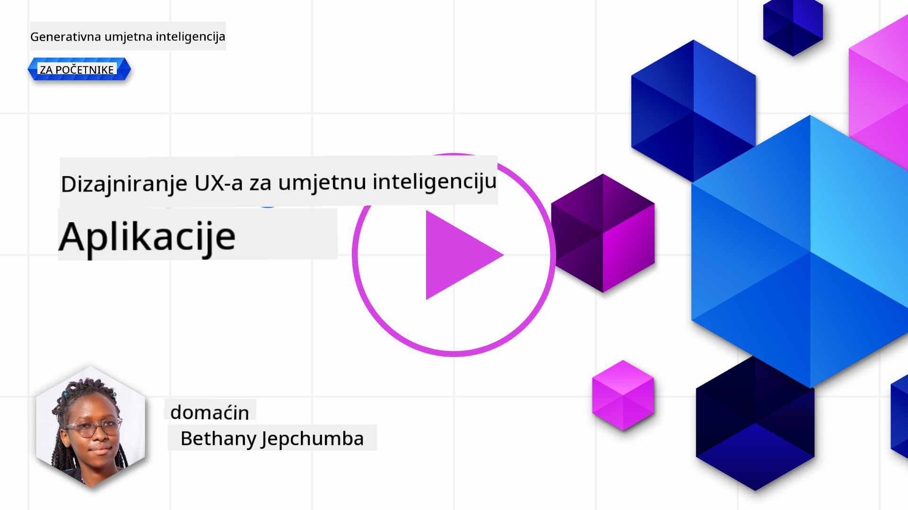
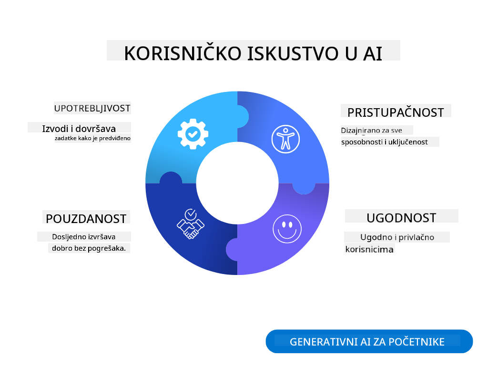
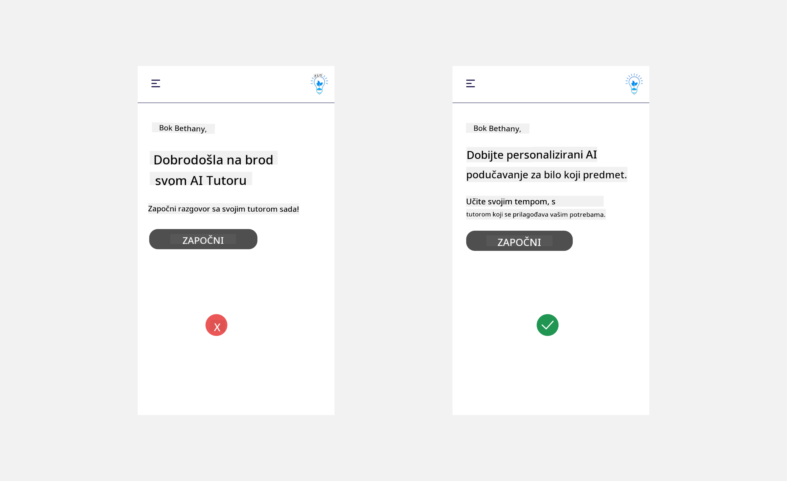
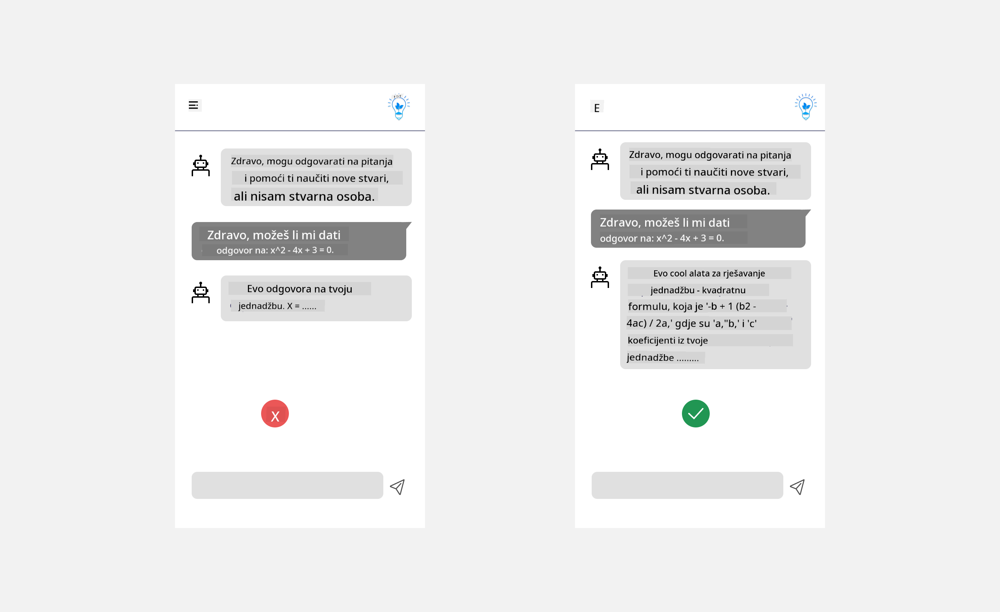
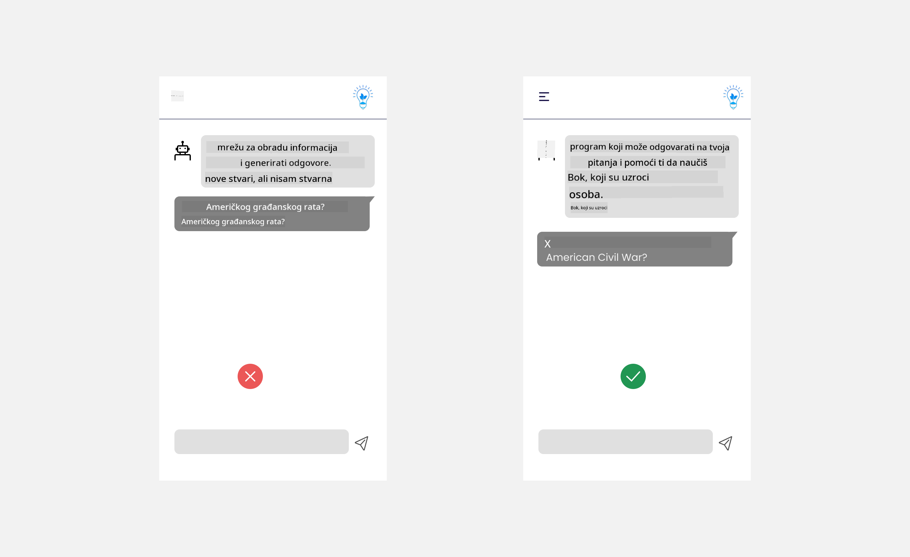
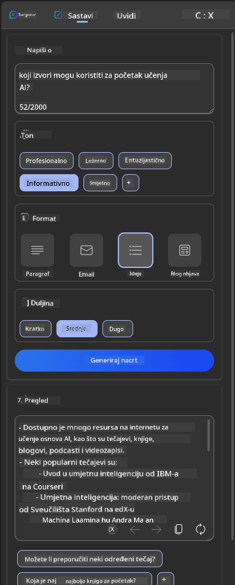
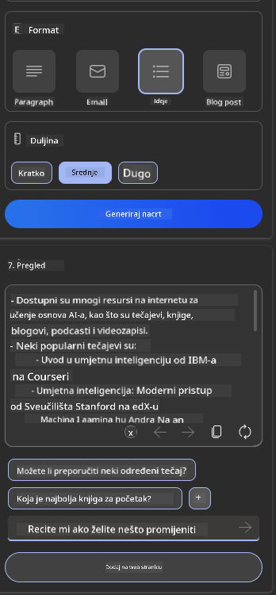
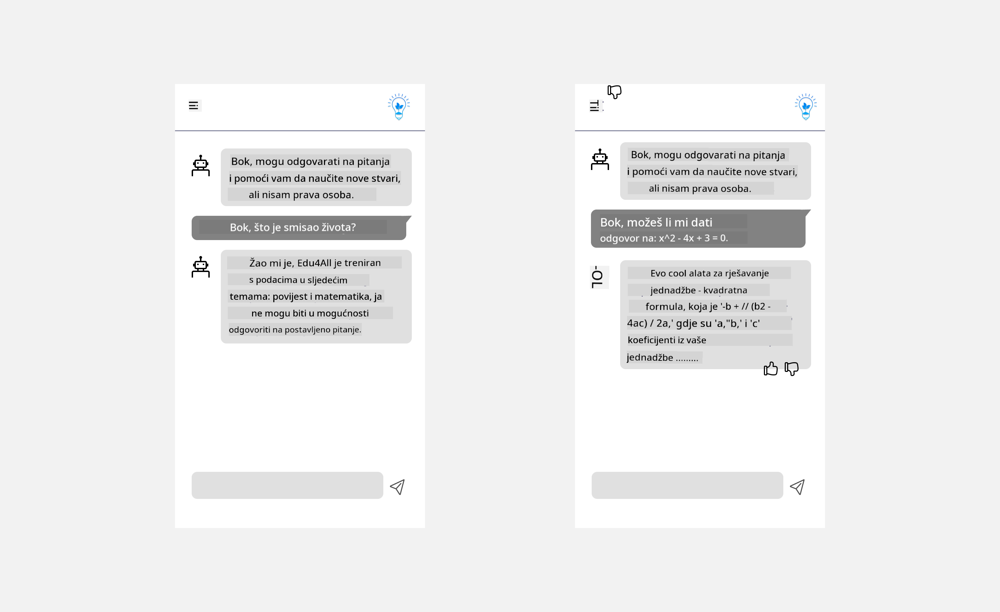

<!--
CO_OP_TRANSLATOR_METADATA:
{
  "original_hash": "ec385b41ee50579025d50cc03bfb3a25",
  "translation_date": "2025-06-25T20:35:24+00:00",
  "source_file": "12-designing-ux-for-ai-applications/README.md",
  "language_code": "hr"
}
-->
# Dizajniranje UX-a za AI aplikacije

> _(Kliknite na sliku iznad da biste pogledali video ovog lekcije)_

Korisničko iskustvo je vrlo važan aspekt izrade aplikacija. Korisnici trebaju moći koristiti vašu aplikaciju na učinkovit način za obavljanje zadataka. Biti učinkovit je jedna stvar, ali također trebate dizajnirati aplikacije tako da ih svi mogu koristiti, kako bi bile _pristupačne_. Ovo poglavlje će se fokusirati na ovo područje kako biste na kraju dizajnirali aplikaciju koju ljudi mogu i žele koristiti.

## Uvod

Korisničko iskustvo je način na koji korisnik interagira s i koristi određeni proizvod ili uslugu, bilo da se radi o sustavu, alatu ili dizajnu. Kada razvijaju AI aplikacije, programeri se ne fokusiraju samo na osiguravanje učinkovitog korisničkog iskustva, već i etičnog. U ovoj lekciji pokrivamo kako izgraditi aplikacije umjetne inteligencije (AI) koje zadovoljavaju potrebe korisnika.

Lekcija će pokriti sljedeća područja:

- Uvod u korisničko iskustvo i razumijevanje potreba korisnika
- Dizajniranje AI aplikacija za povjerenje i transparentnost
- Dizajniranje AI aplikacija za suradnju i povratne informacije

## Ciljevi učenja

Nakon što završite ovu lekciju, moći ćete:

- Razumjeti kako izgraditi AI aplikacije koje zadovoljavaju potrebe korisnika.
- Dizajnirati AI aplikacije koje potiču povjerenje i suradnju.

### Preduvjet

Odvojite malo vremena i pročitajte više o [korisničkom iskustvu i dizajnerskom razmišljanju.](https://learn.microsoft.com/training/modules/ux-design?WT.mc_id=academic-105485-koreyst)

## Uvod u korisničko iskustvo i razumijevanje potreba korisnika

U našem fiktivnom obrazovnom startupu imamo dva primarna korisnika, učitelje i učenike. Svaki od ova dva korisnika ima jedinstvene potrebe. Dizajn usmjeren na korisnika prioritizira korisnika osiguravajući da su proizvodi relevantni i korisni za one kojima su namijenjeni.

Aplikacija bi trebala biti **korisna, pouzdana, pristupačna i ugodna** kako bi pružila dobro korisničko iskustvo.

### Upotrebljivost

Biti koristan znači da aplikacija ima funkcionalnost koja odgovara njenoj namjeni, kao što je automatiziranje procesa ocjenjivanja ili generiranje kartica za ponavljanje. Aplikacija koja automatizira proces ocjenjivanja trebala bi moći točno i učinkovito dodijeliti bodove studentskim radovima na temelju unaprijed definiranih kriterija. Slično tome, aplikacija koja generira kartice za ponavljanje trebala bi moći stvoriti relevantna i raznolika pitanja na temelju svojih podataka.

### Pouzdanost

Biti pouzdan znači da aplikacija može dosljedno i bez grešaka izvršavati svoj zadatak. Međutim, AI, baš kao i ljudi, nije savršen i može biti sklon greškama. Aplikacije mogu naići na greške ili neočekivane situacije koje zahtijevaju ljudsku intervenciju ili ispravak. Kako se nosite s greškama? U posljednjem dijelu ove lekcije pokrit ćemo kako su AI sustavi i aplikacije dizajnirani za suradnju i povratne informacije.

### Pristupačnost

Biti pristupačan znači proširiti korisničko iskustvo na korisnike s različitim sposobnostima, uključujući one s invaliditetom, osiguravajući da nitko nije izostavljen. Slijedeći smjernice i principe pristupačnosti, AI rješenja postaju inkluzivnija, upotrebljivija i korisnija za sve korisnike.

### Ugodnost

Biti ugodan znači da je aplikacija užitak za korištenje. Privlačno korisničko iskustvo može imati pozitivan utjecaj na korisnika, potičući ga da se vrati aplikaciji i povećavajući poslovni prihod.

Ne može se svaki izazov riješiti AI-jem. AI dolazi da poboljša vaše korisničko iskustvo, bilo da se radi o automatiziranju ručnih zadataka ili personaliziranju korisničkih iskustava.

## Dizajniranje AI aplikacija za povjerenje i transparentnost

Izgradnja povjerenja je ključna kada se dizajniraju AI aplikacije. Povjerenje osigurava da je korisnik uvjeren da će aplikacija obaviti posao, dosljedno isporučiti rezultate i da su rezultati ono što korisnik treba. Rizik u ovom području je nepovjerenje i prekomjerno povjerenje. Nepovjerenje se javlja kada korisnik ima malo ili nimalo povjerenja u AI sustav, što dovodi do odbijanja vaše aplikacije. Prekomjerno povjerenje se javlja kada korisnik precjenjuje sposobnosti AI sustava, što dovodi do prevelikog povjerenja u AI sustav. Na primjer, automatizirani sustav ocjenjivanja u slučaju prekomjernog povjerenja može dovesti do toga da učitelj ne provjeri neke od radova kako bi osigurao da sustav ocjenjivanja dobro radi. To bi moglo rezultirati nepoštenim ili netočnim ocjenama za učenike ili propuštenim prilikama za povratne informacije i poboljšanje.

Dva načina za osiguranje povjerenja u dizajnu su objašnjivost i kontrola.

### Objašnjivost

Kada AI pomaže u donošenju odluka kao što je prenošenje znanja budućim generacijama, ključno je da učitelji i roditelji razumiju kako se donose AI odluke. To je objašnjivost - razumijevanje kako AI aplikacije donose odluke. Dizajniranje za objašnjivost uključuje dodavanje detalja o primjerima onoga što AI aplikacija može učiniti. Na primjer, umjesto "Započnite s AI učiteljem", sustav može koristiti: "Sažmite svoje bilješke za lakše ponavljanje pomoću AI."

Još jedan primjer je kako AI koristi korisničke i osobne podatke. Na primjer, korisnik s personom učenika može imati ograničenja na temelju svoje persone. AI možda neće moći otkriti odgovore na pitanja, ali može pomoći korisniku da razmisli o tome kako može riješiti problem.

Jedan posljednji ključni dio objašnjivosti je pojednostavljenje objašnjenja. Učenici i učitelji možda nisu stručnjaci za AI, stoga objašnjenja o tome što aplikacija može ili ne može učiniti trebaju biti pojednostavljena i lako razumljiva.

### Kontrola

Generativni AI stvara suradnju između AI-a i korisnika, gdje, na primjer, korisnik može modificirati upite za različite rezultate. Osim toga, nakon što je generiran izlaz, korisnici bi trebali moći modificirati rezultate dajući im osjećaj kontrole. Na primjer, kada koristite Bing, možete prilagoditi svoj upit na temelju formata, tona i duljine. Osim toga, možete dodati promjene u svoj izlaz i modificirati izlaz kao što je prikazano u nastavku:

Još jedna značajka u Bing-u koja omogućava korisniku kontrolu nad aplikacijom je mogućnost uključivanja i isključivanja podataka koje AI koristi. Za školsku aplikaciju, učenik bi možda želio koristiti svoje bilješke kao i učiteljeve resurse kao materijal za ponavljanje.

> Kada dizajnirate AI aplikacije, namjera je ključna u osiguravanju da korisnici ne prekomjerno vjeruju, postavljajući nerealna očekivanja o njenim sposobnostima. Jedan način da to učinite je stvaranje trenja između upita i rezultata. Podsjećajući korisnika da je ovo AI, a ne drugi čovjek

## Dizajniranje AI aplikacija za suradnju i povratne informacije

Kao što je ranije spomenuto, generativni AI stvara suradnju između korisnika i AI-a. Većina interakcija je s korisnikom koji unosi upit, a AI generira izlaz. Što ako je izlaz netočan? Kako aplikacija rukuje greškama ako se pojave? Krivi li AI korisnika ili uzima vrijeme za objašnjenje greške?

AI aplikacije trebaju biti izgrađene da primaju i daju povratne informacije. To ne samo da pomaže AI sustavu da se poboljša, već također gradi povjerenje s korisnicima. Povratna petlja trebala bi biti uključena u dizajn, primjer može biti jednostavan palac gore ili dolje na izlazu.

Još jedan način za rukovanje ovim je jasno komuniciranje sposobnosti i ograničenja sustava. Kada korisnik napravi grešku tražeći nešto izvan mogućnosti AI-a, također bi trebao postojati način za rukovanje ovim, kao što je prikazano u nastavku.

Sistemske greške su uobičajene kod aplikacija gdje korisnik možda treba pomoć s informacijama izvan opsega AI-a ili aplikacija može imati ograničenje na koliko pitanja/predmeta korisnik može generirati sažetke. Na primjer, AI aplikacija trenirana s podacima o ograničenim predmetima, na primjer, Povijest i Matematika, možda neće moći rukovati pitanjima o Geografiji. Kako bi se to ublažilo, AI sustav može dati odgovor poput: "Žao mi je, naš proizvod je treniran s podacima u sljedećim predmetima....., ne mogu odgovoriti na pitanje koje ste postavili."

AI aplikacije nisu savršene, stoga su sklone greškama. Kada dizajnirate svoje aplikacije, trebali biste osigurati da stvorite prostor za povratne informacije od korisnika i rukovanje greškama na način koji je jednostavan i lako objašnjiv.

## Zadatak

Uzmite bilo koju AI aplikaciju koju ste do sada izradili, razmislite o implementaciji sljedećih koraka u svojoj aplikaciji:

- **Ugodnost:** Razmislite kako možete učiniti svoju aplikaciju ugodnijom. Dodajete li objašnjenja posvuda? Potičete li korisnika da istražuje? Kako formulirate svoje poruke o greškama?

- **Upotrebljivost:** Izgradnja web aplikacije. Pobrinite se da vaša aplikacija bude navigabilna i mišem i tipkovnicom.

- **Povjerenje i transparentnost:** Nemojte potpuno vjerovati AI-u i njegovom izlazu, razmislite kako biste dodali čovjeka u proces za provjeru izlaza. Također, razmislite i implementirajte druge načine za postizanje povjerenja i transparentnosti.

- **Kontrola:** Dajte korisniku kontrolu nad podacima koje pruža aplikaciji. Implementirajte način na koji korisnik može uključiti i isključiti prikupljanje podataka u AI aplikaciji.

## Nastavite s učenjem!

Nakon što završite ovu lekciju, pogledajte našu [Generativnu AI kolekciju za učenje](https://aka.ms/genai-collection?WT.mc_id=academic-105485-koreyst) kako biste nastavili unapređivati svoje znanje o Generativnoj AI!

Prijeđite na Lekciju 13, gdje ćemo pogledati kako [osigurati AI aplikacije](../13-securing-ai-applications/README.md?WT.mc_id=academic-105485-koreyst)!

**Odricanje odgovornosti**:  
Ovaj dokument je preveden korištenjem AI usluge za prevođenje [Co-op Translator](https://github.com/Azure/co-op-translator). Iako težimo točnosti, imajte na umu da automatizirani prijevodi mogu sadržavati pogreške ili netočnosti. Izvorni dokument na izvornom jeziku treba smatrati autoritativnim izvorom. Za ključne informacije preporučuje se profesionalni prijevod od strane ljudskog prevoditelja. Ne preuzimamo odgovornost za bilo kakva nesporazume ili pogrešne interpretacije proizašle iz korištenja ovog prijevoda.