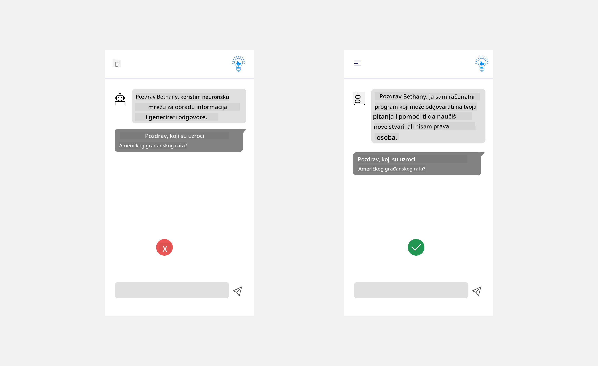
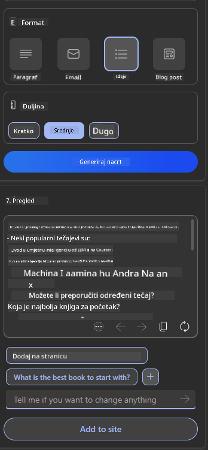

<!--
CO_OP_TRANSLATOR_METADATA:
{
  "original_hash": "ec385b41ee50579025d50cc03bfb3a25",
  "translation_date": "2025-07-09T15:06:00+00:00",
  "source_file": "12-designing-ux-for-ai-applications/README.md",
  "language_code": "hr"
}
-->
# Dizajniranje UX-a za AI aplikacije

> _(Kliknite na gornju sliku za pregled videa ove lekcije)_

Korisničko iskustvo je vrlo važan aspekt izrade aplikacija. Korisnici trebaju moći koristiti vašu aplikaciju na učinkovit način za obavljanje zadataka. Biti učinkovit je jedno, ali također trebate dizajnirati aplikacije tako da ih mogu koristiti svi, kako bi bile _pristupačne_. Ovaj će se odlomak usredotočiti na to područje kako biste na kraju dizajnirali aplikaciju koju ljudi mogu i žele koristiti.

## Uvod

Korisničko iskustvo je način na koji korisnik komunicira i koristi određeni proizvod ili uslugu, bilo da je riječ o sustavu, alatu ili dizajnu. Prilikom razvoja AI aplikacija, programeri se ne fokusiraju samo na to da korisničko iskustvo bude učinkovito, već i etično. U ovoj lekciji obrađujemo kako izgraditi aplikacije umjetne inteligencije (AI) koje zadovoljavaju potrebe korisnika.

Lekcija će obuhvatiti sljedeća područja:

- Uvod u korisničko iskustvo i razumijevanje potreba korisnika
- Dizajniranje AI aplikacija za povjerenje i transparentnost
- Dizajniranje AI aplikacija za suradnju i povratne informacije

## Ciljevi učenja

Nakon ove lekcije moći ćete:

- Razumjeti kako izgraditi AI aplikacije koje zadovoljavaju potrebe korisnika.
- Dizajnirati AI aplikacije koje potiču povjerenje i suradnju.

### Preduvjet

Odvojite malo vremena i pročitajte više o [korisničkom iskustvu i dizajnerskom razmišljanju.](https://learn.microsoft.com/training/modules/ux-design?WT.mc_id=academic-105485-koreyst)

## Uvod u korisničko iskustvo i razumijevanje potreba korisnika

U našem zamišljenom startupu za obrazovanje imamo dva glavna korisnika, nastavnike i učenike. Svaki od njih ima jedinstvene potrebe. Dizajn usmjeren na korisnika stavlja korisnika u prvi plan, osiguravajući da su proizvodi relevantni i korisni za one za koje su namijenjeni.

Aplikacija bi trebala biti **korisna, pouzdana, pristupačna i ugodna** kako bi pružila dobro korisničko iskustvo.

### Upotrebljivost

Biti koristan znači da aplikacija ima funkcionalnost koja odgovara njenoj namjeni, poput automatizacije procesa ocjenjivanja ili generiranja kartica za ponavljanje gradiva. Aplikacija koja automatizira ocjenjivanje trebala bi moći točno i učinkovito dodijeliti ocjene na temelju unaprijed definiranih kriterija. Slično tome, aplikacija koja generira kartice za ponavljanje trebala bi moći kreirati relevantna i raznolika pitanja na temelju svojih podataka.

### Pouzdanost

Biti pouzdan znači da aplikacija može dosljedno i bez pogrešaka obavljati svoj zadatak. Međutim, AI, baš kao i ljudi, nije savršen i može griješiti. Aplikacije mogu naići na pogreške ili neočekivane situacije koje zahtijevaju ljudsku intervenciju ili ispravak. Kako se nositi s pogreškama? U posljednjem dijelu ove lekcije obradit ćemo kako su AI sustavi i aplikacije dizajnirani za suradnju i povratne informacije.

### Pristupačnost

Biti pristupačan znači proširiti korisničko iskustvo na korisnike s različitim sposobnostima, uključujući osobe s invaliditetom, osiguravajući da nitko nije isključen. Slijedeći smjernice i principe pristupačnosti, AI rješenja postaju inkluzivnija, upotrebljivija i korisnija za sve korisnike.

### Ugodnost

Biti ugodan znači da je aplikacija ugodna za korištenje. Privlačno korisničko iskustvo može pozitivno utjecati na korisnika, potičući ga da se vraća aplikaciji i povećavajući prihode poslovanja.

Ne može se svaki izazov riješiti AI-jem. AI dolazi kao dodatak vašem korisničkom iskustvu, bilo da automatizira ručne zadatke ili personalizira korisničko iskustvo.

## Dizajniranje AI aplikacija za povjerenje i transparentnost

Izgradnja povjerenja ključna je pri dizajniranju AI aplikacija. Povjerenje osigurava da korisnik vjeruje da će aplikacija obaviti posao, dosljedno isporučiti rezultate i da su ti rezultati ono što korisnik treba. Rizik u ovom području su nepovjerenje i pretjerano povjerenje. Nepovjerenje nastaje kada korisnik ima malo ili nimalo povjerenja u AI sustav, što dovodi do odbacivanja vaše aplikacije. Pretjerano povjerenje događa se kada korisnik precjenjuje sposobnosti AI sustava, što može dovesti do prevelikog povjerenja u AI. Na primjer, automatizirani sustav ocjenjivanja u slučaju pretjeranog povjerenja može dovesti do toga da nastavnik ne provjerava neke radove kako bi osigurao da sustav radi ispravno. To može rezultirati nepravednim ili netočnim ocjenama za učenike ili propuštenim prilikama za povratne informacije i poboljšanja.

Dva načina da se povjerenje postavi u središte dizajna su objašnjivost i kontrola.

### Objašnjivost

Kada AI pomaže u donošenju odluka, poput prenošenja znanja budućim generacijama, ključno je da nastavnici i roditelji razumiju kako se AI odluke donose. To je objašnjivost – razumijevanje kako AI aplikacije donose odluke. Dizajniranje za objašnjivost uključuje dodavanje primjera što AI aplikacija može učiniti. Na primjer, umjesto "Započni s AI nastavnikom", sustav može koristiti: "Sažmi svoje bilješke za lakše ponavljanje pomoću AI-ja."

Još jedan primjer je kako AI koristi korisničke i osobne podatke. Na primjer, korisnik s ulogom učenika može imati ograničenja temeljena na svojoj ulozi. AI možda neće moći otkriti odgovore na pitanja, ali može pomoći korisniku da razmisli o tome kako riješiti problem.

Zadnji ključni dio objašnjivosti je pojednostavljenje objašnjenja. Učenici i nastavnici možda nisu stručnjaci za AI, stoga objašnjenja o tome što aplikacija može ili ne može učiniti trebaju biti jednostavna i lako razumljiva.

### Kontrola

Generativni AI stvara suradnju između AI-ja i korisnika, gdje korisnik može mijenjati upite za različite rezultate. Osim toga, nakon što se generira rezultat, korisnici bi trebali moći mijenjati rezultate, što im daje osjećaj kontrole. Na primjer, koristeći Bing, možete prilagoditi upit prema formatu, tonu i duljini. Također, možete dodavati izmjene i mijenjati rezultat kao što je prikazano u nastavku:

Još jedna značajka u Bingu koja korisniku daje kontrolu nad aplikacijom je mogućnost uključivanja i isključivanja podataka koje AI koristi. Za školsku aplikaciju, učenik bi možda želio koristiti svoje bilješke kao i nastavničke resurse kao materijal za ponavljanje.

> Prilikom dizajniranja AI aplikacija, namjernost je ključna kako bi se spriječilo pretjerano povjerenje i postavljanje nerealnih očekivanja o njihovim mogućnostima. Jedan od načina za to je stvaranje trenja između upita i rezultata. Podsjećajući korisnika da je ovo AI, a ne drugi čovjek.

## Dizajniranje AI aplikacija za suradnju i povratne informacije

Kao što je ranije spomenuto, generativni AI stvara suradnju između korisnika i AI-ja. Većina interakcija uključuje korisnika koji unosi upit, a AI generira rezultat. Što ako je rezultat netočan? Kako aplikacija rješava pogreške ako se pojave? Krivi li AI korisnika ili uzima vremena da objasni pogrešku?

AI aplikacije trebaju biti dizajnirane za primanje i davanje povratnih informacija. To ne samo da pomaže AI sustavu da se poboljša, već i gradi povjerenje s korisnicima. U dizajn treba uključiti povratnu petlju, primjerice jednostavan palac gore ili dolje za ocjenu rezultata.

Drugi način za rješavanje ovoga je jasno komunicirati mogućnosti i ograničenja sustava. Kada korisnik pogriješi tražeći nešto izvan AI mogućnosti, treba postojati način za rješavanje takvih situacija, kao što je prikazano u nastavku.

Pogreške u sustavu su česte u aplikacijama gdje korisnik može trebati pomoć s informacijama izvan dometa AI-ja ili aplikacija može imati ograničenje koliko pitanja/predmeta korisnik može generirati sažetke. Na primjer, AI aplikacija trenirana na ograničenim predmetima poput Povijesti i Matematike možda neće moći odgovoriti na pitanja iz Geografije. Kako bi se to ublažilo, AI sustav može dati odgovor poput: "Oprostite, naš je proizvod treniran na podacima iz sljedećih predmeta..., ne mogu odgovoriti na postavljeno pitanje."

AI aplikacije nisu savršene, stoga će praviti pogreške. Prilikom dizajniranja aplikacija trebate osigurati prostor za povratne informacije korisnika i rukovanje pogreškama na jednostavan i lako razumljiv način.

## Zadatak

Uzmite bilo koje AI aplikacije koje ste do sada izgradili i razmislite o implementaciji sljedećih koraka u svojoj aplikaciji:

- **Ugodnost:** Razmislite kako možete učiniti svoju aplikaciju ugodnijom. Dodajete li objašnjenja svugdje? Potječete li korisnika na istraživanje? Kako formulirate poruke o pogreškama?

- **Upotrebljivost:** Izgradnja web aplikacije. Provjerite je li vaša aplikacija navigabilna i mišem i tipkovnicom.

- **Povjerenje i transparentnost:** Nemojte potpuno vjerovati AI-ju i njegovim rezultatima, razmislite kako biste uključili čovjeka u proces provjere rezultata. Također, razmotrite i implementirajte druge načine za postizanje povjerenja i transparentnosti.

- **Kontrola:** Dajte korisniku kontrolu nad podacima koje pruža aplikaciji. Implementirajte način da korisnik može uključiti ili isključiti prikupljanje podataka u AI aplikaciji.

## Nastavite s učenjem!

Nakon što završite ovu lekciju, pogledajte našu [kolekciju za učenje o generativnom AI-ju](https://aka.ms/genai-collection?WT.mc_id=academic-105485-koreyst) i nastavite podizati svoje znanje o generativnom AI-ju!

Krenite na Lekciju 13, gdje ćemo pogledati kako [osigurati AI aplikacije](../13-securing-ai-applications/README.md?WT.mc_id=academic-105485-koreyst)!

**Odricanje od odgovornosti**:  
Ovaj dokument je preveden korištenjem AI usluge za prevođenje [Co-op Translator](https://github.com/Azure/co-op-translator). Iako težimo točnosti, imajte na umu da automatski prijevodi mogu sadržavati pogreške ili netočnosti. Izvorni dokument na izvornom jeziku treba smatrati autoritativnim izvorom. Za kritične informacije preporučuje se profesionalni ljudski prijevod. Ne snosimo odgovornost za bilo kakva nesporazuma ili pogrešna tumačenja koja proizlaze iz korištenja ovog prijevoda.