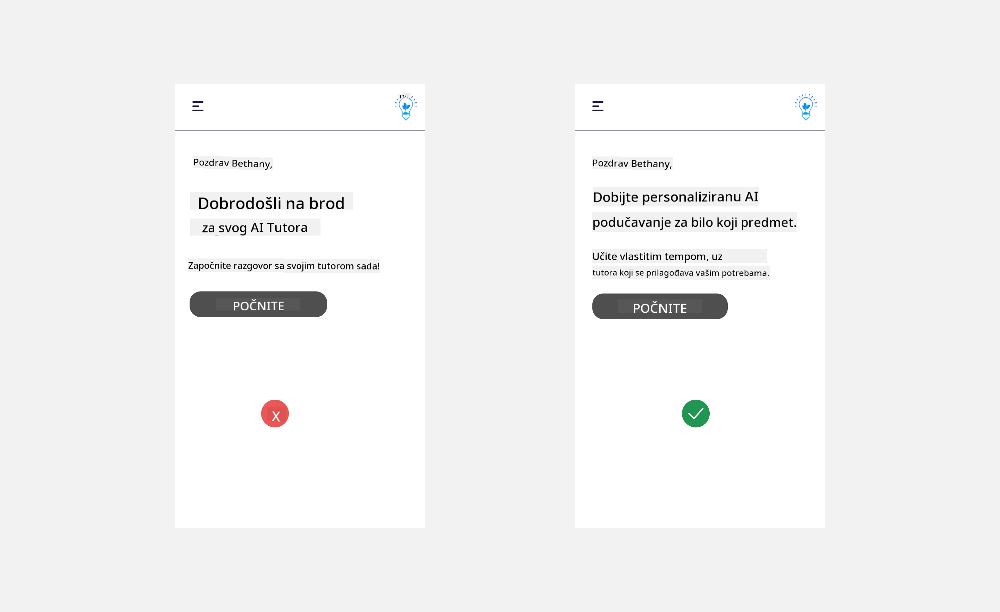

<!--
CO_OP_TRANSLATOR_METADATA:
{
  "original_hash": "747668e4c53d067369f06e9ec2e6313e",
  "translation_date": "2025-08-26T19:46:08+00:00",
  "source_file": "12-designing-ux-for-ai-applications/README.md",
  "language_code": "hr"
}
-->
# Dizajniranje korisničkog iskustva za AI aplikacije

> _(Kliknite na sliku iznad za video lekciju)_

Korisničko iskustvo je vrlo važan aspekt izrade aplikacija. Korisnici moraju moći koristiti vašu aplikaciju na učinkovit način kako bi obavili zadatke. Biti učinkovit je jedno, ali također trebate dizajnirati aplikacije tako da ih svi mogu koristiti, odnosno da budu _pristupačne_. Ovo poglavlje fokusira se na to područje kako biste na kraju dizajnirali aplikaciju koju ljudi mogu i žele koristiti.

## Uvod

Korisničko iskustvo je način na koji korisnik koristi i komunicira s određenim proizvodom ili uslugom, bilo da se radi o sustavu, alatu ili dizajnu. Prilikom razvoja AI aplikacija, developeri ne razmišljaju samo o učinkovitosti korisničkog iskustva, već i o etičnosti. U ovoj lekciji pokrivamo kako izgraditi aplikacije umjetne inteligencije (AI) koje odgovaraju potrebama korisnika.

Lekcija pokriva sljedeća područja:

- Uvod u korisničko iskustvo i razumijevanje potreba korisnika
- Dizajniranje AI aplikacija za povjerenje i transparentnost
- Dizajniranje AI aplikacija za suradnju i povratne informacije

## Ciljevi učenja

Nakon ove lekcije moći ćete:

- Razumjeti kako izgraditi AI aplikacije koje zadovoljavaju potrebe korisnika.
- Dizajnirati AI aplikacije koje potiču povjerenje i suradnju.

### Preduvjet

Odvojite malo vremena i pročitajte više o [korisničkom iskustvu i dizajnerskom razmišljanju.](https://learn.microsoft.com/training/modules/ux-design?WT.mc_id=academic-105485-koreyst)

## Uvod u korisničko iskustvo i razumijevanje potreba korisnika

U našem izmišljenom startupu za obrazovanje imamo dvije glavne skupine korisnika: nastavnike i učenike. Svaka od tih skupina ima svoje specifične potrebe. Dizajn usmjeren na korisnika stavlja korisnika u središte, osiguravajući da su proizvodi relevantni i korisni za one kojima su namijenjeni.

Aplikacija bi trebala biti **korisna, pouzdana, pristupačna i ugodna** kako bi pružila dobro korisničko iskustvo.

### Upotrebljivost

Biti koristan znači da aplikacija ima funkcionalnosti koje odgovaraju njezinoj namjeni, poput automatizacije procesa ocjenjivanja ili generiranja kartica za ponavljanje gradiva. Aplikacija koja automatizira ocjenjivanje treba moći točno i učinkovito dodijeliti bodove na temelju unaprijed definiranih kriterija. Slično, aplikacija koja generira kartice za ponavljanje treba moći kreirati relevantna i raznolika pitanja na temelju svojih podataka.

### Pouzdanost

Biti pouzdan znači da aplikacija može dosljedno i bez grešaka obavljati svoj zadatak. Međutim, AI, baš kao i ljudi, nije savršen i može pogriješiti. Aplikacije mogu naići na pogreške ili neočekivane situacije koje zahtijevaju ljudsku intervenciju ili ispravak. Kako rješavate pogreške? U zadnjem dijelu ove lekcije pokrit ćemo kako su AI sustavi i aplikacije dizajnirani za suradnju i povratne informacije.

### Pristupačnost

Biti pristupačan znači proširiti korisničko iskustvo na korisnike s različitim sposobnostima, uključujući osobe s invaliditetom, kako nitko ne bi bio isključen. Prateći smjernice i principe pristupačnosti, AI rješenja postaju inkluzivnija, upotrebljivija i korisnija za sve korisnike.

### Ugodnost

Biti ugodan znači da je aplikaciju zadovoljstvo koristiti. Privlačno korisničko iskustvo može pozitivno utjecati na korisnika, potaknuti ga da se vrati aplikaciji i povećati prihode.

Ne može se svaki izazov riješiti AI-jem. AI je tu da unaprijedi korisničko iskustvo, bilo automatizacijom ručnih zadataka ili personalizacijom korisničkog doživljaja.

## Dizajniranje AI aplikacija za povjerenje i transparentnost

Izgradnja povjerenja je ključna pri dizajniranju AI aplikacija. Povjerenje osigurava da je korisnik siguran da će aplikacija obaviti posao, dosljedno isporučivati rezultate i da su ti rezultati ono što korisnik treba. Rizik u ovom području je nepovjerenje i pretjerano povjerenje. Nepovjerenje nastaje kada korisnik ima malo ili nimalo povjerenja u AI sustav, što dovodi do odbacivanja vaše aplikacije. Pretjerano povjerenje nastaje kada korisnik precijeni mogućnosti AI sustava, pa mu previše vjeruje. Na primjer, automatizirani sustav za ocjenjivanje u slučaju pretjeranog povjerenja može dovesti do toga da nastavnik ne provjeri neke radove kako bi se uvjerio da sustav dobro radi. To može rezultirati nepravednim ili netočnim ocjenama za učenike ili propuštenim prilikama za povratnu informaciju i napredak.

Dva načina kako osigurati da je povjerenje u središtu dizajna su objašnjivost i kontrola.

### Objašnjivost

Kada AI pomaže u donošenju odluka, poput prenošenja znanja budućim generacijama, važno je da nastavnici i roditelji razumiju kako AI donosi odluke. To je objašnjivost – razumijevanje kako AI aplikacije donose odluke. Dizajniranje za objašnjivost uključuje dodavanje detalja koji pojašnjavaju kako je AI došao do određenog rezultata. Publika mora biti svjesna da je rezultat generirao AI, a ne čovjek. Na primjer, umjesto "Započni razgovor sa svojim tutorom sada", recite "Koristi AI tutora koji se prilagođava tvojim potrebama i pomaže ti učiti vlastitim tempom."

Drugi primjer je način na koji AI koristi korisničke i osobne podatke. Na primjer, korisnik s personom učenika može imati ograničenja na temelju svoje uloge. AI možda neće moći otkriti odgovore na pitanja, ali može pomoći korisniku da razmisli kako može riješiti problem.

Još jedan važan dio objašnjivosti je pojednostavljenje objašnjenja. Učenici i nastavnici možda nisu stručnjaci za AI, stoga objašnjenja o tome što aplikacija može ili ne može učiniti trebaju biti jednostavna i lako razumljiva.

### Kontrola

Generativni AI stvara suradnju između AI-ja i korisnika, gdje korisnik može mijenjati upite za različite rezultate. Također, kada se generira rezultat, korisnici bi trebali moći mijenjati rezultate, čime dobivaju osjećaj kontrole. Na primjer, koristeći Bing, možete prilagoditi svoj upit prema formatu, tonu i duljini. Također, možete mijenjati svoj rezultat i prilagoditi ga, kao što je prikazano dolje:

Još jedna značajka u Bingu koja korisniku daje kontrolu nad aplikacijom je mogućnost uključivanja i isključivanja korištenja podataka od strane AI-ja. Za školsku aplikaciju, učenik možda želi koristiti svoje bilješke kao i nastavničke materijale za ponavljanje gradiva.

> Prilikom dizajniranja AI aplikacija, namjera je ključna kako bi se spriječilo da korisnici pretjerano vjeruju AI-ju i postave nerealna očekivanja o njegovim mogućnostima. Jedan od načina za to je stvaranje "trenja" između upita i rezultata. Podsjetite korisnika da je ovo AI, a ne drugi čovjek.

## Dizajniranje AI aplikacija za suradnju i povratne informacije

Kao što je ranije spomenuto, generativni AI stvara suradnju između korisnika i AI-ja. Većina interakcija odvija se tako da korisnik unese upit, a AI generira rezultat. Što ako je rezultat netočan? Kako aplikacija postupa s pogreškama ako se pojave? Krivi li AI korisnika ili odvoji vrijeme da objasni pogrešku?

AI aplikacije trebaju biti dizajnirane tako da mogu primati i davati povratne informacije. To ne samo da pomaže AI sustavu da se poboljša, već i gradi povjerenje s korisnicima. Povratna petlja treba biti uključena u dizajn, primjer može biti jednostavan palac gore ili dolje na rezultat.

Drugi način za rješavanje ovoga je jasno komuniciranje mogućnosti i ograničenja sustava. Kada korisnik pogriješi tražeći nešto izvan mogućnosti AI-ja, treba postojati način za rješavanje toga, kao što je prikazano dolje.

Sistemske pogreške su česte kod aplikacija gdje korisniku može trebati pomoć s informacijama izvan dosega AI-ja ili aplikacija može imati ograničenje na broj pitanja/predmeta za koje korisnik može generirati sažetke. Na primjer, AI aplikacija obučena na podacima iz ograničenih predmeta, primjerice povijesti i matematike, možda neće moći odgovoriti na pitanja iz geografije. Kako bi se to ublažilo, AI sustav može dati odgovor poput: "Žao mi je, naš proizvod je treniran na podacima iz sljedećih predmeta....., ne mogu odgovoriti na pitanje koje ste postavili."

AI aplikacije nisu savršene, stoga će sigurno griješiti. Prilikom dizajniranja svojih aplikacija, trebali biste osigurati prostor za povratne informacije korisnika i rješavanje pogrešaka na jednostavan i lako objašnjiv način.

## Zadatak

Uzmite bilo koju AI aplikaciju koju ste do sada izradili i razmislite o implementaciji sljedećih koraka u svojoj aplikaciji:

- **Ugodnost:** Razmislite kako možete učiniti svoju aplikaciju ugodnijom. Dodajete li objašnjenja gdje god je to moguće? Potičete li korisnika na istraživanje? Kako formulirate poruke o pogreškama?

- **Upotrebljivost:** Ako gradite web aplikaciju, provjerite je li vaša aplikacija dostupna i mišem i tipkovnicom.

- **Povjerenje i transparentnost:** Nemojte potpuno vjerovati AI-ju i njegovim rezultatima, razmislite kako biste uključili čovjeka u proces provjere rezultata. Također, razmotrite i implementirajte druge načine za postizanje povjerenja i transparentnosti.

- **Kontrola:** Dajte korisniku kontrolu nad podacima koje daje aplikaciji. Implementirajte način na koji korisnik može uključiti ili isključiti prikupljanje podataka u AI aplikaciji.

## Nastavite s učenjem!

Nakon što završite ovu lekciju, pogledajte našu [kolekciju za učenje o generativnoj AI](https://aka.ms/genai-collection?WT.mc_id=academic-105485-koreyst) kako biste nastavili razvijati svoje znanje o generativnoj AI!

Prijeđite na lekciju 13, gdje ćemo pogledati kako [osigurati AI aplikacije](../13-securing-ai-applications/README.md?WT.mc_id=academic-105485-koreyst)!

---

**Odricanje od odgovornosti**:  
Ovaj dokument je preveden pomoću AI usluge za prevođenje [Co-op Translator](https://github.com/Azure/co-op-translator). Iako nastojimo osigurati točnost, imajte na umu da automatski prijevodi mogu sadržavati pogreške ili netočnosti. Izvorni dokument na izvornom jeziku treba smatrati mjerodavnim izvorom. Za ključne informacije preporučuje se profesionalni ljudski prijevod. Ne snosimo odgovornost za bilo kakve nesporazume ili pogrešna tumačenja koja proizlaze iz korištenja ovog prijevoda.