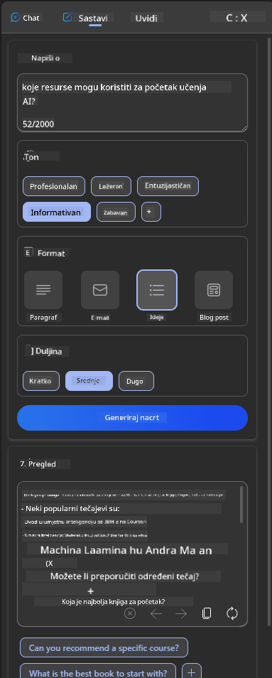

<!--
CO_OP_TRANSLATOR_METADATA:
{
  "original_hash": "78bbeed50fd4dc9fdee931f5daf98cb3",
  "translation_date": "2025-10-18T01:29:22+00:00",
  "source_file": "12-designing-ux-for-ai-applications/README.md",
  "language_code": "hr"
}
-->
# Dizajniranje korisničkog iskustva za AI aplikacije

> _(Kliknite na sliku iznad za pregled videa ove lekcije)_

Korisničko iskustvo je vrlo važan aspekt izrade aplikacija. Korisnici trebaju moći koristiti vašu aplikaciju na učinkovit način za obavljanje zadataka. Biti učinkovit je jedno, ali također trebate dizajnirati aplikacije tako da ih svi mogu koristiti, čineći ih _pristupačnima_. Ovaj će se poglavlje fokusirati na ovo područje kako biste na kraju dizajnirali aplikaciju koju ljudi mogu i žele koristiti.

## Uvod

Korisničko iskustvo odnosi se na način na koji korisnik komunicira s određenim proizvodom ili uslugom, bilo da se radi o sustavu, alatu ili dizajnu. Kada razvijaju AI aplikacije, programeri se ne fokusiraju samo na osiguravanje učinkovitog korisničkog iskustva, već i na etičnost. U ovoj lekciji pokrivamo kako izgraditi aplikacije umjetne inteligencije (AI) koje odgovaraju potrebama korisnika.

Lekcija će obuhvatiti sljedeća područja:

- Uvod u korisničko iskustvo i razumijevanje potreba korisnika
- Dizajniranje AI aplikacija za povjerenje i transparentnost
- Dizajniranje AI aplikacija za suradnju i povratne informacije

## Ciljevi učenja

Nakon ove lekcije, moći ćete:

- Razumjeti kako izgraditi AI aplikacije koje zadovoljavaju potrebe korisnika.
- Dizajnirati AI aplikacije koje potiču povjerenje i suradnju.

### Preduvjet

Odvojite malo vremena i pročitajte više o [korisničkom iskustvu i dizajnerskom razmišljanju.](https://learn.microsoft.com/training/modules/ux-design?WT.mc_id=academic-105485-koreyst)

## Uvod u korisničko iskustvo i razumijevanje potreba korisnika

U našem izmišljenom edukacijskom startupu imamo dva primarna korisnika, učitelje i učenike. Svaki od tih korisnika ima jedinstvene potrebe. Dizajn usmjeren na korisnika prioritizira korisnika, osiguravajući da su proizvodi relevantni i korisni za one kojima su namijenjeni.

Aplikacija bi trebala biti **korisna, pouzdana, pristupačna i ugodna** kako bi pružila dobro korisničko iskustvo.

### Korisnost

Biti koristan znači da aplikacija ima funkcionalnost koja odgovara njezinoj namjeni, poput automatizacije procesa ocjenjivanja ili generiranja kartica za ponavljanje gradiva. Aplikacija koja automatizira proces ocjenjivanja trebala bi moći točno i učinkovito dodijeliti ocjene radovima učenika na temelju unaprijed definiranih kriterija. Slično tome, aplikacija koja generira kartice za ponavljanje gradiva trebala bi moći kreirati relevantna i raznolika pitanja na temelju svojih podataka.

### Pouzdanost

Biti pouzdan znači da aplikacija može dosljedno obavljati svoj zadatak bez grešaka. Međutim, AI, baš kao i ljudi, nije savršen i može biti sklon greškama. Aplikacije se mogu susresti s greškama ili neočekivanim situacijama koje zahtijevaju ljudsku intervenciju ili ispravak. Kako se nositi s greškama? U posljednjem dijelu ove lekcije pokrit ćemo kako se AI sustavi i aplikacije dizajniraju za suradnju i povratne informacije.

### Pristupačnost

Biti pristupačan znači proširiti korisničko iskustvo na korisnike s različitim sposobnostima, uključujući one s invaliditetom, osiguravajući da nitko nije izostavljen. Slijedeći smjernice i principe pristupačnosti, AI rješenja postaju inkluzivnija, upotrebljivija i korisnija za sve korisnike.

### Ugodnost

Biti ugodan znači da je aplikacija užitak za korištenje. Privlačno korisničko iskustvo može imati pozitivan utjecaj na korisnika, potičući ga da se vrati aplikaciji i povećavajući poslovni prihod.

Nije svaki izazov moguće riješiti pomoću AI-a. AI dolazi kao dopuna vašem korisničkom iskustvu, bilo da se radi o automatizaciji ručnih zadataka ili personalizaciji korisničkog iskustva.

## Dizajniranje AI aplikacija za povjerenje i transparentnost

Izgradnja povjerenja je ključna pri dizajniranju AI aplikacija. Povjerenje osigurava da je korisnik uvjeren da će aplikacija obaviti posao, dosljedno isporučiti rezultate i da su rezultati ono što korisnik treba. Rizik u ovom području je nepovjerenje i pretjerano povjerenje. Nepovjerenje se javlja kada korisnik ima malo ili nimalo povjerenja u AI sustav, što dovodi do odbijanja vaše aplikacije. Pretjerano povjerenje se javlja kada korisnik precjenjuje sposobnosti AI sustava, što dovodi do toga da korisnici previše vjeruju AI sustavu. Na primjer, automatizirani sustav ocjenjivanja u slučaju pretjeranog povjerenja mogao bi dovesti do toga da učitelj ne provjeri neke radove kako bi osigurao da sustav ocjenjivanja dobro funkcionira. To bi moglo rezultirati nepravednim ili netočnim ocjenama za učenike ili propuštenim prilikama za povratne informacije i poboljšanje.

Dva načina za osiguranje povjerenja u dizajnu su objašnjivost i kontrola.

### Objašnjivost

Kada AI pomaže u donošenju odluka, poput prenošenja znanja budućim generacijama, ključno je da učitelji i roditelji razumiju kako se donose AI odluke. To je objašnjivost - razumijevanje kako AI aplikacije donose odluke. Dizajniranje za objašnjivost uključuje dodavanje detalja koji ističu kako je AI došao do rezultata. Publika mora biti svjesna da je rezultat generiran od strane AI-a, a ne čovjeka. Na primjer, umjesto da kažete "Započnite razgovor sa svojim tutorom sada", recite "Koristite AI tutora koji se prilagođava vašim potrebama i pomaže vam učiti vlastitim tempom."

Drugi primjer je kako AI koristi korisničke i osobne podatke. Na primjer, korisnik s personom učenika može imati ograničenja na temelju svoje persone. AI možda neće moći otkriti odgovore na pitanja, ali može pomoći korisniku da razmisli o tome kako može riješiti problem.

Još jedan ključni dio objašnjivosti je pojednostavljenje objašnjenja. Učenici i učitelji možda nisu stručnjaci za AI, stoga objašnjenja o tome što aplikacija može ili ne može učiniti trebaju biti pojednostavljena i lako razumljiva.

### Kontrola

Generativni AI stvara suradnju između AI-a i korisnika, gdje, na primjer, korisnik može mijenjati upite za različite rezultate. Osim toga, nakon što se generira rezultat, korisnici bi trebali moći mijenjati rezultate, dajući im osjećaj kontrole. Na primjer, kada koristite Bing, možete prilagoditi svoj upit na temelju formata, tona i duljine. Osim toga, možete dodati promjene svom rezultatu i modificirati ga, kao što je prikazano dolje:

Još jedna značajka na Bingu koja omogućuje korisniku kontrolu nad aplikacijom je mogućnost uključivanja i isključivanja podataka koje AI koristi. Za školsku aplikaciju, učenik bi mogao željeti koristiti svoje bilješke kao i resurse učitelja kao materijal za ponavljanje gradiva.

> Kada dizajnirate AI aplikacije, namjera je ključna za osiguranje da korisnici ne pretjerano vjeruju, postavljajući nerealna očekivanja o njezinim sposobnostima. Jedan od načina za to je stvaranje trenja između upita i rezultata. Podsjetite korisnika da je ovo AI, a ne drugi čovjek.

## Dizajniranje AI aplikacija za suradnju i povratne informacije

Kao što je ranije spomenuto, generativni AI stvara suradnju između korisnika i AI-a. Većina interakcija uključuje korisnika koji unosi upit, a AI generira rezultat. Što ako je rezultat netočan? Kako aplikacija rješava greške ako se pojave? Krivi li AI korisnika ili odvoji vrijeme da objasni grešku?

AI aplikacije trebale bi biti dizajnirane tako da primaju i daju povratne informacije. To ne samo da pomaže AI sustavu da se poboljša, već i gradi povjerenje s korisnicima. Povratna petlja trebala bi biti uključena u dizajn, primjer može biti jednostavan palac gore ili dolje na rezultatu.

Drugi način za rješavanje ovoga je jasno komuniciranje sposobnosti i ograničenja sustava. Kada korisnik napravi grešku tražeći nešto izvan mogućnosti AI-a, također bi trebao postojati način da se to riješi, kao što je prikazano dolje.

Sistemske greške su uobičajene kod aplikacija gdje korisnik možda treba pomoć s informacijama izvan dosega AI-a ili aplikacija može imati ograničenje u broju pitanja/predmeta za koje korisnik može generirati sažetke. Na primjer, AI aplikacija trenirana s podacima o ograničenim predmetima, poput Povijesti i Matematike, možda neće moći obraditi pitanja o Geografiji. Kako bi se to ublažilo, AI sustav može dati odgovor poput: "Nažalost, naš proizvod je treniran s podacima o sljedećim predmetima....., ne mogu odgovoriti na pitanje koje ste postavili."

AI aplikacije nisu savršene, stoga su sklone greškama. Kada dizajnirate svoje aplikacije, trebali biste osigurati prostor za povratne informacije od korisnika i rješavanje grešaka na način koji je jednostavan i lako razumljiv.

## Zadatak

Uzmite bilo koju AI aplikaciju koju ste dosad izradili i razmislite o implementaciji sljedećih koraka u svoju aplikaciju:

- **Ugodnost:** Razmislite kako možete učiniti svoju aplikaciju ugodnijom. Dodajete li objašnjenja svugdje? Potičete li korisnika na istraživanje? Kako formulirate svoje poruke o greškama?

- **Korisnost:** Izradite web aplikaciju. Pobrinite se da vaša aplikacija bude navigabilna i mišem i tipkovnicom.

- **Povjerenje i transparentnost:** Nemojte potpuno vjerovati AI-u i njegovim rezultatima, razmislite kako biste dodali čovjeka u proces za provjeru rezultata. Također, razmislite i implementirajte druge načine za postizanje povjerenja i transparentnosti.

- **Kontrola:** Dajte korisniku kontrolu nad podacima koje pruža aplikaciji. Implementirajte način na koji korisnik može uključiti i isključiti prikupljanje podataka u AI aplikaciji.

<!-- ## [Post-lecture quiz](../../../12-designing-ux-for-ai-applications/quiz-url) -->

## Nastavite učiti!

Nakon što završite ovu lekciju, pogledajte našu [kolekciju za učenje o generativnoj umjetnoj inteligenciji](https://aka.ms/genai-collection?WT.mc_id=academic-105485-koreyst) kako biste nastavili unapređivati svoje znanje o generativnoj umjetnoj inteligenciji!

Prijeđite na lekciju 13, gdje ćemo se baviti [sigurnošću AI aplikacija](../13-securing-ai-applications/README.md?WT.mc_id=academic-105485-koreyst)!

---

**Izjava o odricanju odgovornosti**:  
Ovaj dokument je preveden pomoću AI usluge za prevođenje [Co-op Translator](https://github.com/Azure/co-op-translator). Iako nastojimo osigurati točnost, imajte na umu da automatski prijevodi mogu sadržavati pogreške ili netočnosti. Izvorni dokument na izvornom jeziku treba smatrati autoritativnim izvorom. Za ključne informacije preporučuje se profesionalni prijevod od strane čovjeka. Ne preuzimamo odgovornost za nesporazume ili pogrešna tumačenja koja proizlaze iz korištenja ovog prijevoda.