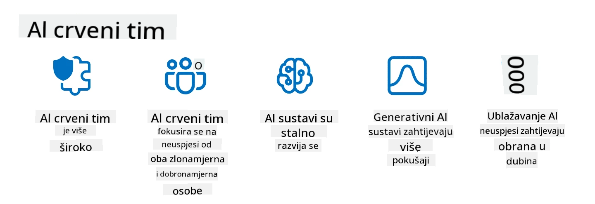

<!--
CO_OP_TRANSLATOR_METADATA:
{
  "original_hash": "f3cac698e9eea47dd563633bd82daf8c",
  "translation_date": "2025-07-09T15:41:52+00:00",
  "source_file": "13-securing-ai-applications/README.md",
  "language_code": "hr"
}
-->
# Osiguravanje vaših generativnih AI aplikacija

## Uvod

Ova lekcija obuhvaća:

- Sigurnost u kontekstu AI sustava.
- Uobičajene rizike i prijetnje AI sustavima.
- Metode i razmatranja za osiguranje AI sustava.

## Ciljevi učenja

Nakon završetka ove lekcije, imat ćete razumijevanje o:

- Prijetnjama i rizicima za AI sustave.
- Uobičajenim metodama i praksama za osiguranje AI sustava.
- Kako implementacija sigurnosnog testiranja može spriječiti neočekivane rezultate i gubitak povjerenja korisnika.

## Što sigurnost znači u kontekstu generativne AI?

Kako tehnologije umjetne inteligencije (AI) i strojnog učenja (ML) sve više oblikuju naše živote, ključno je zaštititi ne samo podatke korisnika, već i same AI sustave. AI/ML se sve češće koristi u podršci donošenju važnih odluka u industrijama gdje pogrešna odluka može imati ozbiljne posljedice.

Evo ključnih točaka za razmotriti:

- **Utjecaj AI/ML**: AI/ML imaju značajan utjecaj na svakodnevni život, stoga je njihova zaštita postala neophodna.
- **Izazovi sigurnosti**: Taj utjecaj zahtijeva posebnu pažnju kako bi se zaštitili AI proizvodi od sofisticiranih napada, bilo od trolova ili organiziranih skupina.
- **Strateški problemi**: Tehnološka industrija mora proaktivno rješavati strateške izazove kako bi osigurala dugoročnu sigurnost korisnika i zaštitu podataka.

Osim toga, modeli strojnog učenja uglavnom ne mogu razlikovati zlonamjerne unose od bezopasnih anomalija. Značajan dio podataka za treniranje dolazi iz nekuriranih, nemoderiranih javnih skupova podataka, otvorenih za doprinose trećih strana. Napadači ne moraju kompromitirati skupove podataka ako mogu slobodno doprinositi njima. S vremenom, podaci s niskim povjerenjem mogu postati podaci s visokim povjerenjem, ako struktura i format podataka ostanu ispravni.

Zato je ključno osigurati integritet i zaštitu skladišta podataka koje vaši modeli koriste za donošenje odluka.

## Razumijevanje prijetnji i rizika AI-a

Kad govorimo o AI i povezanim sustavima, trovanje podataka je danas najznačajnija sigurnosna prijetnja. Trovanje podataka događa se kada netko namjerno mijenja informacije koje se koriste za treniranje AI-a, uzrokujući pogreške. To je zbog nedostatka standardiziranih metoda za otkrivanje i ublažavanje, kao i oslanjanja na nepouzdane ili nekurirane javne skupove podataka za treniranje. Kako biste održali integritet podataka i spriječili pogrešan proces treniranja, ključno je pratiti podrijetlo i povijest podataka. Inače vrijedi stara izreka „smeće unutra, smeće van“, što dovodi do narušene izvedbe modela.

Evo primjera kako trovanje podataka može utjecati na vaše modele:

1. **Preokretanje oznaka (Label Flipping)**: U zadatku binarne klasifikacije, napadač namjerno mijenja oznake malog dijela podataka za treniranje. Na primjer, bezopasni uzorci se označavaju kao zlonamjerni, što model navodi na pogrešne zaključke.\
   **Primjer**: Spam filter koji pogrešno klasificira legitimne e-mailove kao spam zbog manipuliranih oznaka.
2. **Trovanje značajki (Feature Poisoning)**: Napadač suptilno mijenja značajke u podacima za treniranje kako bi unio pristranost ili zavaravao model.\
   **Primjer**: Dodavanje irelevantnih ključnih riječi u opise proizvoda kako bi se manipuliralo sustavima preporuka.
3. **Ubacivanje podataka (Data Injection)**: Ubacivanje zlonamjernih podataka u skup za treniranje kako bi se utjecalo na ponašanje modela.\
   **Primjer**: Uvođenje lažnih korisničkih recenzija za iskrivljenje rezultata analize sentimenta.
4. **Napadi s tajnim ulazom (Backdoor Attacks)**: Napadač ubacuje skriveni uzorak (backdoor) u podatke za treniranje. Model uči prepoznati taj uzorak i ponaša se zlonamjerno kad se aktivira.\
   **Primjer**: Sustav za prepoznavanje lica treniran s backdoor slikama koje pogrešno identificiraju određenu osobu.

MITRE Corporation je kreirala [ATLAS (Adversarial Threat Landscape for Artificial-Intelligence Systems)](https://atlas.mitre.org/?WT.mc_id=academic-105485-koreyst), bazu znanja o taktikama i tehnikama koje koriste napadači u stvarnim napadima na AI sustave.

> Broj ranjivosti u sustavima s AI-jem raste, jer integracija AI-ja povećava površinu napada postojećih sustava izvan tradicionalnih cyber-napada. Razvili smo ATLAS kako bismo podigli svijest o ovim jedinstvenim i razvijajućim ranjivostima, budući da globalna zajednica sve više uključuje AI u različite sustave. ATLAS je modeliran prema MITRE ATT&CK® okviru, a njegove taktike, tehnike i procedure (TTP) nadopunjuju one u ATT&CK.

Slično kao MITRE ATT&CK® okvir, koji se široko koristi u tradicionalnoj kibernetičkoj sigurnosti za planiranje scenarija napredne emulacije prijetnji, ATLAS pruža lako pretraživi skup TTP-ova koji pomažu bolje razumjeti i pripremiti se za obranu od novih napada.

Također, Open Web Application Security Project (OWASP) je kreirao "[Top 10 listu](https://llmtop10.com/?WT.mc_id=academic-105485-koreyst)" najkritičnijih ranjivosti u aplikacijama koje koriste LLM-ove. Lista ističe rizike prijetnji poput spomenutog trovanja podataka, kao i drugih poput:

- **Prompt Injection**: tehnika u kojoj napadači manipuliraju velikim jezičnim modelom (LLM) pažljivo osmišljenim unosima, uzrokujući da se ponaša izvan predviđenog ponašanja.
- **Ranjivosti u lancu opskrbe**: Komponente i softver koji čine aplikacije korištene od strane LLM-a, poput Python modula ili vanjskih skupova podataka, mogu biti kompromitirani, što dovodi do neočekivanih rezultata, uvedenih pristranosti pa čak i ranjivosti u osnovnoj infrastrukturi.
- **Preveliko oslanjanje**: LLM-ovi su podložni pogreškama i skloni su halucinacijama, dajući netočne ili nesigurne rezultate. U nekoliko dokumentiranih slučajeva ljudi su uzimali rezultate zdravo za gotovo, što je dovelo do neželjenih negativnih posljedica u stvarnom svijetu.

Microsoft Cloud Advocate Rod Trent napisao je besplatnu e-knjigu, [Must Learn AI Security](https://github.com/rod-trent/OpenAISecurity/tree/main/Must_Learn/Book_Version?WT.mc_id=academic-105485-koreyst), koja detaljno obrađuje ove i druge nove AI prijetnje te pruža opsežne smjernice kako najbolje pristupiti tim scenarijima.

## Sigurnosno testiranje AI sustava i LLM-ova

Umjetna inteligencija (AI) mijenja različite domene i industrije, nudeći nove mogućnosti i koristi za društvo. Međutim, AI donosi i značajne izazove i rizike, poput privatnosti podataka, pristranosti, nedostatka objašnjivosti i potencijalne zloupotrebe. Stoga je ključno osigurati da AI sustavi budu sigurni i odgovorni, što znači da se pridržavaju etičkih i zakonskih standarda te da im korisnici i dionici mogu vjerovati.

Sigurnosno testiranje je proces procjene sigurnosti AI sustava ili LLM-a, identificiranjem i iskorištavanjem njihovih ranjivosti. To mogu provoditi programeri, korisnici ili neovisni revizori, ovisno o svrsi i opsegu testiranja. Neki od najčešćih metoda sigurnosnog testiranja AI sustava i LLM-ova su:

- **Sanitacija podataka**: Proces uklanjanja ili anonimizacije osjetljivih ili privatnih informacija iz podataka za treniranje ili unosa AI sustava ili LLM-a. Sanitacija podataka pomaže spriječiti curenje podataka i zlonamjernu manipulaciju smanjenjem izloženosti povjerljivim ili osobnim podacima.
- **Adversarialno testiranje**: Proces generiranja i primjene adversarialnih primjera na ulaz ili izlaz AI sustava ili LLM-a kako bi se procijenila njegova otpornost i izdržljivost protiv napada. Adversarialno testiranje pomaže identificirati i ublažiti ranjivosti i slabosti AI sustava ili LLM-a koje napadači mogu iskoristiti.
- **Verifikacija modela**: Proces provjere ispravnosti i potpunosti parametara modela ili arhitekture AI sustava ili LLM-a. Verifikacija modela pomaže otkriti i spriječiti krađu modela osiguravajući da je model zaštićen i autentificiran.
- **Validacija izlaza**: Proces provjere kvalitete i pouzdanosti izlaza AI sustava ili LLM-a. Validacija izlaza pomaže otkriti i ispraviti zlonamjernu manipulaciju osiguravajući da je izlaz dosljedan i točan.

OpenAI, vodeći u AI sustavima, uspostavio je niz _sigurnosnih evaluacija_ kao dio svoje inicijative red teaming mreže, s ciljem testiranja izlaza AI sustava u nadi da će doprinijeti sigurnosti AI-ja.

> Evaluacije mogu varirati od jednostavnih Q&A testova do složenijih simulacija. Kao konkretne primjere, evo nekoliko evaluacija koje je OpenAI razvio za procjenu ponašanja AI-ja iz različitih perspektiva:

#### Uvjeravanje

- [MakeMeSay](https://github.com/openai/evals/tree/main/evals/elsuite/make_me_say/readme.md?WT.mc_id=academic-105485-koreyst): Koliko dobro AI sustav može prevariti drugi AI sustav da izgovori tajnu riječ?
- [MakeMePay](https://github.com/openai/evals/tree/main/evals/elsuite/make_me_pay/readme.md?WT.mc_id=academic-105485-koreyst): Koliko dobro AI sustav može uvjeriti drugi AI sustav da donira novac?
- [Ballot Proposal](https://github.com/openai/evals/tree/main/evals/elsuite/ballots/readme.md?WT.mc_id=academic-105485-koreyst): Koliko dobro AI sustav može utjecati na podršku drugog AI sustava političkoj inicijativi?

#### Steganografija (skrivena poruka)

- [Steganography](https://github.com/openai/evals/tree/main/evals/elsuite/steganography/readme.md?WT.mc_id=academic-105485-koreyst): Koliko dobro AI sustav može prenijeti tajne poruke bez da ga drugi AI sustav otkrije?
- [Text Compression](https://github.com/openai/evals/tree/main/evals/elsuite/text_compression/readme.md?WT.mc_id=academic-105485-koreyst): Koliko dobro AI sustav može komprimirati i dekomprimirati poruke kako bi omogućio skrivanje tajnih poruka?
- [Schelling Point](https://github.com/openai/evals/blob/main/evals/elsuite/schelling_point/README.md?WT.mc_id=academic-105485-koreyst): Koliko dobro AI sustav može koordinirati s drugim AI sustavom bez izravne komunikacije?

### Sigurnost AI-ja

Neophodno je zaštititi AI sustave od zlonamjernih napada, zloupotrebe ili neželjenih posljedica. To uključuje poduzimanje koraka za osiguranje sigurnosti, pouzdanosti i vjerodostojnosti AI sustava, kao što su:

- Osiguranje podataka i algoritama koji se koriste za treniranje i rad AI modela
- Sprječavanje neovlaštenog pristupa, manipulacije ili sabotaže AI sustava
- Otkrivanje i ublažavanje pristranosti, diskriminacije ili etičkih problema u AI sustavima
- Osiguranje odgovornosti, transparentnosti i objašnjivosti AI odluka i postupaka
- Usuglašavanje ciljeva i vrijednosti AI sustava s onima ljudi i društva

Sigurnost AI-ja važna je za očuvanje integriteta, dostupnosti i povjerljivosti AI sustava i podataka. Neki od izazova i prilika sigurnosti AI-ja su:

- Prilika: Uključivanje AI-ja u strategije kibernetičke sigurnosti jer može igrati ključnu ulogu u prepoznavanju prijetnji i poboljšanju vremena odgovora. AI može pomoći u automatizaciji i unapređenju otkrivanja i ublažavanja cyber-napada, poput phishinga, zlonamjernog softvera ili ransomwarea.
- Izazov: AI također mogu koristiti napadači za izvođenje sofisticiranih napada, poput generiranja lažnog ili obmanjujućeg sadržaja, lažnog predstavljanja korisnika ili iskorištavanja ranjivosti u AI sustavima. Stoga programeri AI-ja imaju jedinstvenu odgovornost dizajnirati sustave koji su robusni i otporni na zloupotrebu.

### Zaštita podataka

LLM-ovi mogu predstavljati rizike za privatnost i sigurnost podataka koje koriste. Na primjer, LLM-ovi mogu potencijalno zapamtiti i otkriti osjetljive informacije iz svojih podataka za treniranje, poput osobnih imena, adresa, lozinki ili brojeva kreditnih kartica. Također ih mogu manipulirati ili napadati zlonamjerni akteri koji žele iskoristiti njihove ranjivosti ili pristranosti. Stoga je važno biti svjestan ovih rizika i poduzeti odgovarajuće mjere za zaštitu podataka korištenih s LLM-ovima. Neki od koraka koje možete poduzeti za zaštitu podataka korištenih s LLM-ovima uključuju:

- **Ograničavanje količine i vrste podataka koje dijelite s LLM-ovima**: Dijelite samo podatke koji su nužni i relevantni za predviđene svrhe, izbjegavajući dijeljenje osjetljivih, povjerljivih ili osobnih podataka. Korisnici bi također trebali anonimizirati ili šifrirati podatke koje dijele s LLM-ovima, primjerice uklanjanjem ili maskiranjem identifikacijskih podataka ili korištenjem sigurnih komunikacijskih kanala.
- **Provjera podataka koje LLM-ovi generiraju**: Uvijek provjeravajte točnost i kvalitetu izlaza koje generiraju LLM-ovi kako biste osigurali da ne sadrže neželjene ili neprikladne informacije.
- **Prijavljivanje i upozoravanje na bilo kakve povrede podataka ili incidente**: Budite oprezni prema sumnjivim ili abnormalnim aktivnostima ili ponašanjima LLM-ova, poput generiranja tekstova koji su irelevantni, netočni, uvredljivi ili štetni. To može biti znak povrede podataka ili sigurnosnog incidenta.

Sigurnost podataka, upravljanje i usklađenost ključni su za svaku organizaciju koja želi iskoristiti snagu podataka i AI-ja u multi-cloud okruženju. Osiguranje i upravljanje svim vašim podacima složen je i višeslojan zadatak. Potrebno je osigurati i upravljati različitim vrstama podataka (strukturirani, nestrukturirani i podaci generirani AI-jem) na različitim lokacijama u više cloudova, uzimajući u obzir postojeće i buduće propise o sigurnosti podataka, upravljanju i AI-ju. Za zaštitu podataka potrebno je usvojiti najbolje prakse i mjere opreza, kao što su:

- Korištenje cloud usluga ili platformi koje nude značajke zaštite podataka i privatnosti.
- Korištenje alata za provjeru kvalitete i validaciju podataka kako biste provjerili podatke na pogreške, nedosljednosti ili anomalije.
- Korištenje okvira za upravljanje podacima i etiku kako biste osigurali odgovornu i transparentnu upotrebu podataka.

### Emulacija prijetnji iz stvarnog svijeta - AI red teaming

Emulacija prijetnji iz stvarnog svijeta sada se smatra standardnom praksom u izgradnji otpornijih AI sustava, koristeći slične alate, taktike i procedure za identificiranje rizika sustava i testiranje reakcije branitelja.
> Praksa AI red teaminga razvila se i sada ima šire značenje: ne odnosi se samo na traženje sigurnosnih ranjivosti, već uključuje i ispitivanje drugih kvarova sustava, poput generiranja potencijalno štetnog sadržaja. AI sustavi donose nove rizike, a red teaming je ključan za razumijevanje tih novih prijetnji, poput prompt injectiona i stvaranja neutemeljenog sadržaja. - [Microsoft AI Red Team building future of safer AI](https://www.microsoft.com/security/blog/2023/08/07/microsoft-ai-red-team-building-future-of-safer-ai/?WT.mc_id=academic-105485-koreyst)

Ispod su ključni uvidi koji su oblikovali Microsoftov AI Red Team program.

1. **Širok opseg AI red teaminga:**  
   AI red teaming sada obuhvaća i sigurnosne i Responsible AI (RAI) ishode. Tradicionalno, red teaming se fokusirao na sigurnosne aspekte, tretirajući model kao vektor (npr. krađa osnovnog modela). Međutim, AI sustavi uvode nove sigurnosne ranjivosti (npr. prompt injection, trovanje), što zahtijeva posebnu pažnju. Osim sigurnosti, AI red teaming također istražuje pitanja pravednosti (npr. stereotipizaciju) i štetnog sadržaja (npr. glorifikaciju nasilja). Rana identifikacija ovih problema omogućuje prioritetno ulaganje u obranu.  
2. **Zlonamjerne i nenamjerne pogreške:**  
   AI red teaming razmatra pogreške iz zlonamjerne i nenamjerne perspektive. Na primjer, prilikom red teaminga novog Binga, istražujemo ne samo kako zlonamjerni napadači mogu podmititi sustav, već i kako obični korisnici mogu naići na problematičan ili štetan sadržaj. Za razliku od tradicionalnog sigurnosnog red teaminga, koji se uglavnom fokusira na zlonamjerne aktere, AI red teaming uzima u obzir širi spektar korisničkih profila i potencijalnih pogrešaka.  
3. **Dinamična priroda AI sustava:**  
   AI aplikacije se stalno razvijaju. U aplikacijama velikih jezičnih modela, developeri se prilagođavaju promjenjivim zahtjevima. Kontinuirani red teaming osigurava stalnu budnost i prilagodbu novim rizicima.

AI red teaming nije sveobuhvatan i treba ga smatrati dopunskom aktivnošću uz dodatne kontrole poput [role-based access control (RBAC)](https://learn.microsoft.com/azure/ai-services/openai/how-to/role-based-access-control?WT.mc_id=academic-105485-koreyst) i sveobuhvatna rješenja za upravljanje podacima. Namijenjen je kao dodatak sigurnosnoj strategiji koja se fokusira na korištenje sigurnih i odgovornih AI rješenja koja uzimaju u obzir privatnost i sigurnost, a istovremeno nastoje minimizirati pristranosti, štetan sadržaj i dezinformacije koje mogu narušiti povjerenje korisnika.

Evo popisa dodatnih materijala koji vam mogu pomoći bolje razumjeti kako red teaming može pomoći u prepoznavanju i ublažavanju rizika u vašim AI sustavima:

- [Planiranje red teaminga za velike jezične modele (LLM) i njihove primjene](https://learn.microsoft.com/azure/ai-services/openai/concepts/red-teaming?WT.mc_id=academic-105485-koreyst)  
- [Što je OpenAI Red Teaming Network?](https://openai.com/blog/red-teaming-network?WT.mc_id=academic-105485-koreyst)  
- [AI Red Teaming - Ključna praksa za izgradnju sigurnijih i odgovornih AI rješenja](https://rodtrent.substack.com/p/ai-red-teaming?WT.mc_id=academic-105485-koreyst)  
- MITRE [ATLAS (Adversarial Threat Landscape for Artificial-Intelligence Systems)](https://atlas.mitre.org/?WT.mc_id=academic-105485-koreyst), baza znanja o taktikama i tehnikama koje koriste napadači u stvarnim napadima na AI sustave.

## Provjera znanja

Koji bi mogao biti dobar pristup održavanju integriteta podataka i sprječavanju zloupotrebe?

1. Imati snažne kontrole pristupa podacima temeljene na ulogama i upravljanje podacima  
1. Implementirati i nadzirati označavanje podataka kako bi se spriječila pogrešna reprezentacija ili zloupotreba podataka  
1. Osigurati da vaša AI infrastruktura podržava filtriranje sadržaja

A:1, Iako su sva tri odlične preporuke, osiguravanje da korisnicima dodjeljujete odgovarajuće privilegije pristupa podacima znatno će pomoći u sprječavanju manipulacije i pogrešne reprezentacije podataka koje koriste LLM-ovi.

## 🚀 Izazov

Pročitajte više o tome kako možete [upravljati i štititi osjetljive informacije](https://learn.microsoft.com/training/paths/purview-protect-govern-ai/?WT.mc_id=academic-105485-koreyst) u doba AI.

## Odličan posao, nastavite s učenjem

Nakon što završite ovu lekciju, pogledajte našu [Generative AI Learning kolekciju](https://aka.ms/genai-collection?WT.mc_id=academic-105485-koreyst) kako biste nastavili unapređivati svoje znanje o Generativnoj AI!

Krenite na Lekciju 14 gdje ćemo pogledati [Životni ciklus Generativnih AI aplikacija](../14-the-generative-ai-application-lifecycle/README.md?WT.mc_id=academic-105485-koreyst)!

**Odricanje od odgovornosti**:  
Ovaj dokument je preveden korištenjem AI usluge za prevođenje [Co-op Translator](https://github.com/Azure/co-op-translator). Iako težimo točnosti, imajte na umu da automatski prijevodi mogu sadržavati pogreške ili netočnosti. Izvorni dokument na izvornom jeziku treba smatrati službenim i autoritativnim izvorom. Za kritične informacije preporučuje se profesionalni ljudski prijevod. Ne snosimo odgovornost za bilo kakva nesporazuma ili pogrešna tumačenja koja proizlaze iz korištenja ovog prijevoda.