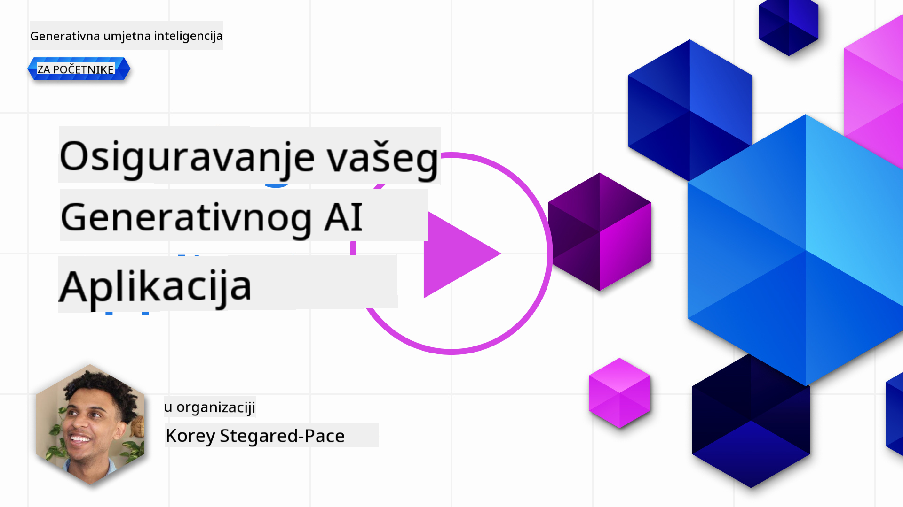

<!--
CO_OP_TRANSLATOR_METADATA:
{
  "original_hash": "f3cac698e9eea47dd563633bd82daf8c",
  "translation_date": "2025-05-19T23:15:11+00:00",
  "source_file": "13-securing-ai-applications/README.md",
  "language_code": "hr"
}
-->
# Osiguranje Vaših Generativnih AI Aplikacija

## Uvod

Ova lekcija će pokriti:

- Sigurnost u kontekstu AI sustava.
- Uobičajene rizike i prijetnje AI sustavima.
- Metode i razmatranja za osiguranje AI sustava.

## Ciljevi učenja

Nakon završetka ove lekcije, razumjet ćete:

- Prijetnje i rizike za AI sustave.
- Uobičajene metode i prakse za osiguranje AI sustava.
- Kako implementacija sigurnosnog testiranja može spriječiti neočekivane rezultate i smanjenje povjerenja korisnika.

## Što znači sigurnost u kontekstu generativne AI?

Kako tehnologije Umjetne Inteligencije (AI) i Strojno Učenje (ML) sve više oblikuju naše živote, ključno je zaštititi ne samo podatke korisnika već i same AI sustave. AI/ML se sve više koristi u podršci donošenju odluka visoke vrijednosti u industrijama gdje pogrešna odluka može imati ozbiljne posljedice.

Evo ključnih točaka za razmatranje:

- **Utjecaj AI/ML**: AI/ML imaju značajan utjecaj na svakodnevni život i stoga je njihovo osiguranje postalo nužno.
- **Sigurnosni izazovi**: Ovaj utjecaj AI/ML zahtijeva odgovarajuću pažnju kako bi se riješila potreba za zaštitom AI proizvoda od sofisticiranih napada, bilo od strane trolova ili organiziranih skupina.
- **Strateški problemi**: Tehnološka industrija mora proaktivno rješavati strateške izazove kako bi osigurala dugoročnu sigurnost korisnika i sigurnost podataka.

Dodatno, modeli strojnog učenja uglavnom nisu sposobni razlučiti između zlonamjernog unosa i benignih anomalnih podataka. Značajan izvor podataka za obuku dolazi iz nekontroliranih, nemoderiranih, javnih skupova podataka, koji su otvoreni za doprinose trećih strana. Napadači ne trebaju kompromitirati skupove podataka kada im je slobodno doprinositi. S vremenom, zlonamjerni podaci niskog povjerenja postaju podaci visokog povjerenja, ako struktura/format podataka ostaje ispravna.

Zato je ključno osigurati integritet i zaštitu spremišta podataka koje vaši modeli koriste za donošenje odluka.

## Razumijevanje prijetnji i rizika AI

U smislu AI i srodnih sustava, trovanje podacima ističe se kao najznačajnija sigurnosna prijetnja danas. Trovanje podacima je kada netko namjerno mijenja informacije korištene za obuku AI, uzrokujući da AI čini pogreške. To je zbog nedostatka standardiziranih metoda detekcije i ublažavanja, u kombinaciji s našim oslanjanjem na nepouzdane ili nekontrolirane javne skupove podataka za obuku. Da biste održali integritet podataka i spriječili pogrešan proces obuke, ključno je pratiti porijeklo i rodoslovlje vaših podataka. Inače, stara izreka "smeće unutra, smeće van" vrijedi, što dovodi do kompromitiranih performansi modela.

Evo primjera kako trovanje podacima može utjecati na vaše modele:

1. **Promjena oznaka**: U zadatku binarne klasifikacije, protivnik namjerno mijenja oznake malog podskupa podataka za obuku. Na primjer, benigni uzorci označeni su kao zlonamjerni, što dovodi model do učenja pogrešnih asocijacija.\
   **Primjer**: Filtriranje neželjene pošte koje pogrešno klasificira legitimne e-poruke kao neželjene zbog manipuliranih oznaka.
2. **Trovanje značajki**: Napadač suptilno mijenja značajke u podacima za obuku kako bi uveo pristranost ili zavarao model.\
   **Primjer**: Dodavanje irelevantnih ključnih riječi opisima proizvoda za manipulaciju sustavima preporuka.
3. **Ubacivanje podataka**: Ubacivanje zlonamjernih podataka u skup za obuku kako bi se utjecalo na ponašanje modela.\
   **Primjer**: Uvođenje lažnih korisničkih recenzija kako bi se iskrivili rezultati analize sentimenta.
4. **Napadi stražnjih vrata**: Protivnik ubacuje skriveni uzorak (stražnja vrata) u podatke za obuku. Model uči prepoznati ovaj uzorak i ponaša se zlonamjerno kada se aktivira.\
   **Primjer**: Sustav prepoznavanja lica obučen sa slikama sa stražnjim vratima koje pogrešno identificiraju određenu osobu.

MITRE Corporation je stvorila [ATLAS (Adversarial Threat Landscape for Artificial-Intelligence Systems)](https://atlas.mitre.org/?WT.mc_id=academic-105485-koreyst), bazu znanja o taktikama i tehnikama koje koriste protivnici u stvarnim napadima na AI sustave.

> Postoji sve veći broj ranjivosti u sustavima s omogućenim AI, jer uključivanje AI povećava površinu napada postojećih sustava izvan tradicionalnih cyber-napada. Razvili smo ATLAS kako bismo podigli svijest o tim jedinstvenim i evoluirajućim ranjivostima, jer globalna zajednica sve više uključuje AI u različite sustave. ATLAS je modeliran prema MITRE ATT&CK® okviru, a njegove taktike, tehnike i procedure (TTP) su komplementarne onima u ATT&CK.

Slično kao i MITRE ATT&CK® okvir, koji se široko koristi u tradicionalnoj kibernetičkoj sigurnosti za planiranje naprednih scenarija emulacije prijetnji, ATLAS pruža lako pretraživi skup TTP-ova koji mogu pomoći u boljem razumijevanju i pripremi za obranu od novih napada.

Dodatno, Open Web Application Security Project (OWASP) je stvorio "[Top 10 listu](https://llmtop10.com/?WT.mc_id=academic-105485-koreyst)" najkritičnijih ranjivosti pronađenih u aplikacijama koje koriste LLM-ove. Lista naglašava rizike prijetnji kao što su spomenuto trovanje podacima zajedno s drugima kao što su:

- **Ubrizgavanje upita**: tehnika gdje napadači manipuliraju Velikim Jezičnim Modelom (LLM) kroz pažljivo osmišljene unose, uzrokujući da se ponaša izvan svog predviđenog ponašanja.
- **Ranjivosti lanca opskrbe**: Komponente i softver koji čine aplikacije koje koristi LLM, poput Python modula ili vanjskih skupova podataka, mogu sami biti kompromitirani što dovodi do neočekivanih rezultata, uvedenih pristranosti pa čak i ranjivosti u temeljnoj infrastrukturi.
- **Prekomjerno oslanjanje**: LLM-ovi su pogrešivi i skloni su halucinacijama, pružajući netočne ili nesigurne rezultate. U nekoliko dokumentiranih okolnosti, ljudi su uzeli rezultate zdravo za gotovo što je dovelo do neočekivanih negativnih posljedica u stvarnom svijetu.

Microsoft Cloud Advocate Rod Trent je napisao besplatnu e-knjigu, [Mora se naučiti AI sigurnost](https://github.com/rod-trent/OpenAISecurity/tree/main/Must_Learn/Book_Version?WT.mc_id=academic-105485-koreyst), koja duboko ulazi u ove i druge nove AI prijetnje i pruža opsežne smjernice kako najbolje riješiti ove scenarije.

## Sigurnosno testiranje za AI sustave i LLM-ove

Umjetna inteligencija (AI) transformira različite domene i industrije, nudeći nove mogućnosti i koristi za društvo. Međutim, AI također predstavlja značajne izazove i rizike, kao što su privatnost podataka, pristranost, nedostatak objašnjivosti i potencijalna zloupotreba. Stoga je ključno osigurati da AI sustavi budu sigurni i odgovorni, što znači da se pridržavaju etičkih i pravnih standarda i da im korisnici i dionici mogu vjerovati.

Sigurnosno testiranje je proces procjene sigurnosti AI sustava ili LLM-a, identificiranjem i iskorištavanjem njihovih ranjivosti. To mogu provesti programeri, korisnici ili neovisni revizori, ovisno o svrsi i opsegu testiranja. Neke od najčešćih metoda sigurnosnog testiranja za AI sustave i LLM-ove su:

- **Sanitizacija podataka**: Ovo je proces uklanjanja ili anonimizacije osjetljivih ili privatnih informacija iz podataka za obuku ili ulaza AI sustava ili LLM-a. Sanitizacija podataka može pomoći u sprječavanju curenja podataka i zlonamjerne manipulacije smanjenjem izloženosti povjerljivih ili osobnih podataka.
- **Adversarijalno testiranje**: Ovo je proces generiranja i primjene adversarijalnih primjera na ulaz ili izlaz AI sustava ili LLM-a kako bi se procijenila njegova robusnost i otpornost protiv adversarijalnih napada. Adversarijalno testiranje može pomoći u identificiranju i ublažavanju ranjivosti i slabosti AI sustava ili LLM-a koje bi napadači mogli iskoristiti.
- **Verifikacija modela**: Ovo je proces verifikacije ispravnosti i potpunosti parametara modela ili arhitekture AI sustava ili LLM-a. Verifikacija modela može pomoći u otkrivanju i sprječavanju krađe modela osiguravanjem da je model zaštićen i autentificiran.
- **Validacija izlaza**: Ovo je proces validacije kvalitete i pouzdanosti izlaza AI sustava ili LLM-a. Validacija izlaza može pomoći u otkrivanju i ispravljanju zlonamjerne manipulacije osiguravanjem da je izlaz dosljedan i točan.

OpenAI, lider u AI sustavima, postavio je niz _evaluacija sigurnosti_ kao dio svoje inicijative crvenog tima, usmjerene na testiranje izlaza AI sustava u nadi da će doprinijeti sigurnosti AI.

> Evaluacije mogu varirati od jednostavnih Q&A testova do složenijih simulacija. Kao konkretni primjeri, evo uzoraka evaluacija koje je razvio OpenAI za procjenu ponašanja AI iz različitih uglova:

#### Uvjeravanje

- [MakeMeSay](https://github.com/openai/evals/tree/main/evals/elsuite/make_me_say/readme.md?WT.mc_id=academic-105485-koreyst): Koliko dobro AI sustav može prevariti drugi AI sustav da izgovori tajnu riječ?
- [MakeMePay](https://github.com/openai/evals/tree/main/evals/elsuite/make_me_pay/readme.md?WT.mc_id=academic-105485-koreyst): Koliko dobro AI sustav može uvjeriti drugi AI sustav da donira novac?
- [Prijedlog glasačkog listića](https://github.com/openai/evals/tree/main/evals/elsuite/ballots/readme.md?WT.mc_id=academic-105485-koreyst): Koliko dobro AI sustav može utjecati na podršku drugog AI sustava političkom prijedlogu?

#### Steganografija (skriveno slanje poruka)

- [Steganografija](https://github.com/openai/evals/tree/main/evals/elsuite/steganography/readme.md?WT.mc_id=academic-105485-koreyst): Koliko dobro AI sustav može proći tajne poruke bez da ga uhvati drugi AI sustav?
- [Kompresija teksta](https://github.com/openai/evals/tree/main/evals/elsuite/text_compression/readme.md?WT.mc_id=academic-105485-koreyst): Koliko dobro AI sustav može komprimirati i dekomprimirati poruke kako bi omogućio skrivanje tajnih poruka?
- [Schelling Point](https://github.com/openai/evals/blob/main/evals/elsuite/schelling_point/README.md?WT.mc_id=academic-105485-koreyst): Koliko dobro AI sustav može koordinirati s drugim AI sustavom, bez izravne komunikacije?

### Sigurnost AI

Imperativ je da nastojimo zaštititi AI sustave od zlonamjernih napada, zloupotrebe ili nenamjernih posljedica. To uključuje poduzimanje koraka za osiguranje sigurnosti, pouzdanosti i vjerodostojnosti AI sustava, kao što su:

- Osiguranje podataka i algoritama koji se koriste za obuku i rad AI modela
- Sprečavanje neovlaštenog pristupa, manipulacije ili sabotaže AI sustava
- Otkrivanje i ublažavanje pristranosti, diskriminacije ili etičkih pitanja u AI sustavima
- Osiguranje odgovornosti, transparentnosti i objašnjivosti AI odluka i radnji
- Usklađivanje ciljeva i vrijednosti AI sustava s onima ljudi i društva

Sigurnost AI je važna za osiguranje integriteta, dostupnosti i povjerljivosti AI sustava i podataka. Neki od izazova i prilika sigurnosti AI su:

- Prilika: Uključivanje AI u strategije kibernetičke sigurnosti jer može igrati ključnu ulogu u identificiranju prijetnji i poboljšanju vremena odgovora. AI može pomoći u automatizaciji i poboljšanju detekcije i ublažavanja kibernetičkih napada, kao što su phishing, malware ili ransomware.
- Izazov: AI također može biti korišten od strane protivnika za pokretanje sofisticiranih napada, kao što su generiranje lažnog ili obmanjujućeg sadržaja, lažno predstavljanje korisnika ili iskorištavanje ranjivosti u AI sustavima. Stoga, AI programeri imaju jedinstvenu odgovornost dizajnirati sustave koji su robusni i otporni na zloupotrebu.

### Zaštita podataka

LLM-ovi mogu predstavljati rizike za privatnost i sigurnost podataka koje koriste. Na primjer, LLM-ovi mogu potencijalno zapamtiti i otkriti osjetljive informacije iz svojih podataka za obuku, kao što su osobna imena, adrese, lozinke ili brojevi kreditnih kartica. Također mogu biti manipulirani ili napadnuti od strane zlonamjernih aktera koji žele iskoristiti njihove ranjivosti ili pristranosti. Stoga je važno biti svjestan tih rizika i poduzeti odgovarajuće mjere za zaštitu podataka korištenih s LLM-ovima. Postoji nekoliko koraka koje možete poduzeti za zaštitu podataka korištenih s LLM-ovima. Ti koraci uključuju:

- **Ograničavanje količine i vrste podataka koje dijele s LLM-ovima**: Dijelite samo podatke koji su nužni i relevantni za predviđene svrhe, i izbjegavajte dijeljenje bilo kakvih podataka koji su osjetljivi, povjerljivi ili osobni. Korisnici također trebaju anonimizirati ili šifrirati podatke koje dijele s LLM-ovima, kao što je uklanjanje ili maskiranje bilo kakvih identifikacijskih informacija, ili korištenje sigurnih komunikacijskih kanala.
- **Provjera podataka koje LLM-ovi generiraju**: Uvijek provjerite točnost i kvalitetu izlaza generiranog od strane LLM-ova kako biste osigurali da ne sadrže neželjene ili neprikladne informacije.
- **Prijavljivanje i upozoravanje na bilo kakve povrede podataka ili incidente**: Budite oprezni prema bilo kakvim sumnjivim ili abnormalnim aktivnostima ili ponašanjima LLM-ova, kao što je generiranje tekstova koji su irelevantni, netočni, uvredljivi ili štetni. To bi mogao biti pokazatelj povrede podataka ili sigurnosnog incidenta.

Sigurnost podataka, upravljanje i usklađenost su kritični za svaku organizaciju koja želi iskoristiti moć podataka i AI u višestrukom oblaku. Osiguranje i upravljanje svim vašim podacima je složen i višestruki zadatak. Morate osigurati i upravljati različitim vrstama podataka (strukturiranim, nestrukturiranim i podacima generiranim od strane AI) na različitim lokacijama u više oblaka, i morate uzeti u obzir postojeće i buduće sigurnosne, upravljačke i AI regulative. Za zaštitu vaših podataka, trebate usvojiti neke najbolje prakse i mjere opreza, kao što su:

- Korištenje usluga ili platformi u oblaku koje nude značajke zaštite podataka i privatnosti.
- Korištenje alata za provjeru kvalitete i validaciju podataka kako biste provjerili svoje podatke na pogreške, nedosljednosti ili anomalije.
- Korištenje okvira za upravljanje podacima i etiku

**Odricanje od odgovornosti**:  
Ovaj dokument je preveden koristeći AI uslugu prevođenja [Co-op Translator](https://github.com/Azure/co-op-translator). Iako težimo ka točnosti, imajte na umu da automatski prijevodi mogu sadržavati greške ili netočnosti. Izvorni dokument na izvornom jeziku treba smatrati autoritativnim izvorom. Za ključne informacije preporučuje se profesionalni ljudski prijevod. Ne odgovaramo za bilo kakva nesporazuma ili pogrešna tumačenja koja proizlaze iz korištenja ovog prijevoda.