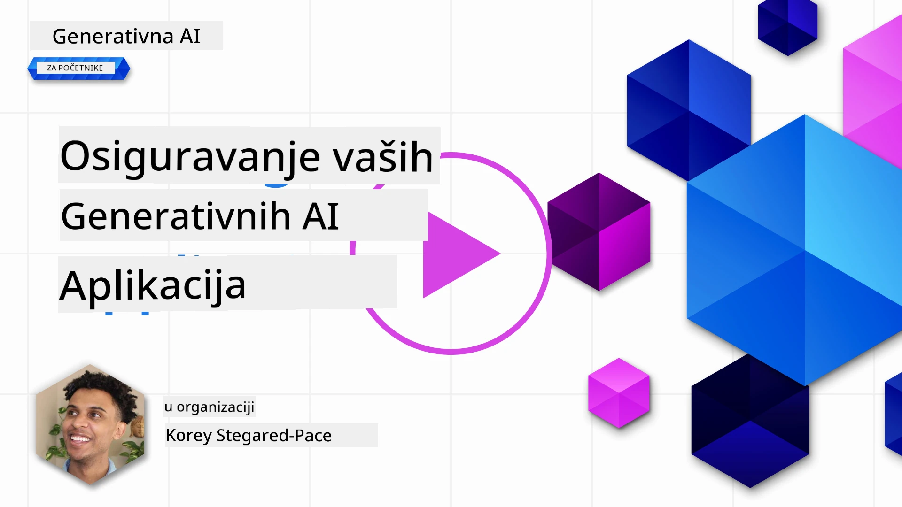
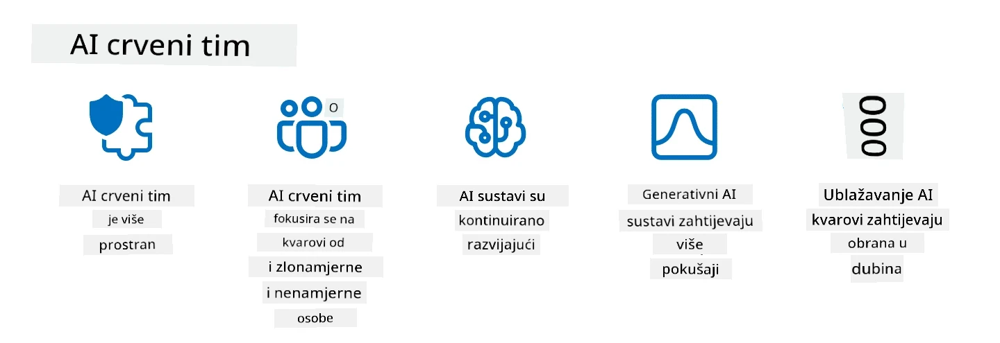

# Osiguravanje vaših aplikacija generativne umjetne inteligencije

## Uvod

Ova lekcija će pokriti:

- Sigurnost u kontekstu AI sustava.
- Uobičajene rizike i prijetnje za AI sustave.
- Metode i razmatranja za osiguravanje AI sustava.

## Ciljevi učenja

Nakon završetka ove lekcije, imat ćete razumijevanje:

- Prijetnji i rizika za AI sustave.
- Uobičajenih metoda i praksi za osiguravanje AI sustava.
- Kako implementacija sigurnosnog testiranja može spriječiti neočekivane rezultate i propadanje povjerenja korisnika.

## Što sigurnost znači u kontekstu generativne AI?

Kako tehnologije umjetne inteligencije (AI) i strojnog učenja (ML) sve više oblikuju naše živote, ključno je zaštititi ne samo podatke korisnika, nego i same AI sustave. AI/ML se sve više koristi u podršci procesima donošenja odluka velike vrijednosti u industrijama gdje pogrešna odluka može rezultirati ozbiljnim posljedicama.

Evo ključnih točaka za razmatranje:

- **Utjecaj AI/ML**: AI/ML imaju značajan utjecaj na svakodnevni život i stoga je njihova zaštita postala neophodna.
- **Sigurnosni izazovi**: Taj utjecaj AI/ML zahtijeva odgovarajuću pažnju kako bi se zaštitili AI proizvodi od sofisticiranih napada, bilo od trolova ili organiziranih grupa.
- **Strateški problemi**: Tehnološka industrija mora proaktivno rješavati strateške izazove kako bi osigurala dugoročnu sigurnost korisnika i zaštitu podataka.

Dodatno, modeli strojnog učenja uglavnom nisu sposobni razlikovati zlonamjerni unos od benignih anomalnih podataka. Značajan izvor podataka za treniranje dolazi iz neuređenih, nemodificiranih, javnih skupova podataka, otvorenih za doprinose trećih strana. Napadači ne moraju kompromitirati skupove podataka kada mogu slobodno doprinositi njima. S vremenom, zlonamjerni podaci niske pouzdanosti postaju podaci visoke pouzdanosti ako struktura/format podataka ostane ispravan.

Zato je ključno osigurati integritet i zaštitu spremišta podataka koje vaši modeli koriste za donošenje odluka.

## Razumijevanje prijetnji i rizika AI

U kontekstu AI i povezanih sustava, trovanje podataka izdvaja se kao najznačajnija sigurnosna prijetnja danas. Trovanje podataka je kada netko namjerno mijenja informacije korištene za treniranje AI, uzrokujući joj da griješi. To je zbog nedostatka standardiziranih metoda detekcije i mitigacije, uz našu ovisnost o nepouzdanim ili nereguliranim javnim skupovima podataka za treniranje. Za održavanje integriteta podataka i sprječavanje pogrešnog procesa treniranja ključno je pratiti podrijetlo i nasljedstvo vaših podataka. Inace, stara poslovica „smeće unutra, smeće van“ vrijedi, što rezultira kompromitiranim performansama modela.

Evo primjera kako trovanje podataka može utjecati na vaše modele:

1. **Preokret oznaka**: U binarnom zadatku klasifikacije, protivnik namjerno preokreće oznake malog dijela podataka za treniranje. Na primjer, benigni uzorci su označeni kao zlonamjerni, zbog čega model uči pogrešne povezanosti.\
   **Primjer**: Filter za neželjenu poštu koji krivo klasificira legitimne e-poruke kao neželjenu poštu zbog manipuliranih oznaka.
2. **Trovanje značajki**: Napadač suptilno mijenja značajke u podacima za treniranje da bi uveo pristranost ili zavaravao model.\
   **Primjer**: Dodavanje irelevantnih ključnih riječi u opise proizvoda za manipulaciju sustavima preporuka.
3. **Injekcija podataka**: Uvođenje zlonamjernih podataka u skup za treniranje da bi se utjecalo na ponašanje modela.\
   **Primjer**: Uvođenje lažnih korisničkih recenzija za izobličavanje rezultata analize sentimenta.
4. **Napadi s stražnjim vratima**: Protivnik ubacuje skriveni uzorak (stražnja vrata) u podatke za treniranje. Model uči prepoznati taj uzorak i ponaša se zlonamjerno kad je aktiviran.\
   **Primjer**: Sustav za prepoznavanje lica treniran sa slikama sa stražnjim vratima koji pogrešno identificira određenu osobu.

MITRE Corporation izradila je [ATLAS (Adversarial Threat Landscape for Artificial-Intelligence Systems)](https://atlas.mitre.org/?WT.mc_id=academic-105485-koreyst), bazu znanja taktika i tehnika koje protivnici koriste u stvarnim napadima na AI sustave.

> Postoji sve veći broj ranjivosti u sustavima s omogućenim AI, jer uključivanje AI povećava površinu napada postojećih sustava izvan tradicionalnih cyber-napada. Razvili smo ATLAS kako bismo podigli svijest o ovim jedinstvenim i evoluirajućim ranjivostima, jer globalna zajednica sve više uključuje AI u razne sustave. ATLAS je modeliran prema MITRE ATT&CK® okviru, a njegove taktike, tehnike i procedure (TTP) nadopunjuju one u ATT&CK.

Baš kao i MITRE ATT&CK® okvir koji se široko koristi u tradicionalnoj kibernetičkoj sigurnosti za planiranje scenarija napredne emulacije prijetnji, ATLAS pruža lako pretraživ skup TTP-ova koji mogu pomoći u boljem razumijevanju i pripremi za obranu od nadolazećih napada.

Dodatno, Open Web Application Security Project (OWASP) izradio je "[Top 10 listu](https://llmtop10.com/?WT.mc_id=academic-105485-koreyst)" najkritičnijih ranjivosti u aplikacijama koje koriste LLM-ove. Lista ističe rizike prijetnji poput već spomenutog trovanja podataka, kao i druge poput:

- **Prompt injekcija**: tehnika u kojoj napadači manipuliraju Velikim jezičnim modelom (LLM) kroz pažljivo izrađene unose, uzrokujući da se ponaša van svog predviđenog ponašanja.
- **Ranjivosti opskrbnog lanca**: Komponente i softver koje čine aplikacije korištene od strane LLM-a, poput Python modula ili vanjskih skupova podataka, mogu biti kompromitirani što vodi do neočekivanih rezultata, uvedenih pristranosti pa čak i ranjivosti u temeljnoj infrastrukturi.
- **Pretjerano oslanjanje**: LLM-ovi su podložni pogreškama i skloni su halucinacijama, pružajući netočne ili nesigurne rezultate. U nekoliko dokumentiranih slučajeva ljudi su rezultate shvatili doslovno što je dovelo do neželjenih negativnih posljedica u stvarnom svijetu.

Microsoftov zagovornik Clouda Rod Trent napisao je besplatnu e-knjigu, [Must Learn AI Security](https://github.com/rod-trent/OpenAISecurity/tree/main/Must_Learn/Book_Version?WT.mc_id=academic-105485-koreyst), koja duboko ulazi u ove i druge nadolazeće AI prijetnje i pruža opsežne smjernice o tome kako najbolje pristupiti ovim scenarijima.

## Sigurnosno testiranje AI sustava i LLM-ova

Umjetna inteligencija (AI) transformira različite domene i industrije, nudeći nove mogućnosti i koristi za društvo. Međutim, AI također donosi značajne izazove i rizike, poput privatnosti podataka, pristranosti, nedostatka objašnjivosti i potencijalne zloupotrebe. Stoga je ključno osigurati da AI sustavi budu sigurni i odgovorni, što znači da se pridržavaju etičkih i zakonskih standarda te da im korisnici i dionici mogu vjerovati.

Sigurnosno testiranje je proces vrednovanja sigurnosti AI sustava ili LLM-a, identificirajući i iskorištavajući njihove ranjivosti. To mogu provoditi developeri, korisnici ili treće strane, ovisno o svrsi i opsegu testiranja. Neki od najčešćih metoda sigurnosnog testiranja za AI sustave i LLM-ove su:

- **Sanitacija podataka**: Proces uklanjanja ili anonimizacije osjetljivih ili privatnih informacija iz podataka za treniranje ili unosa AI sustava ili LLM-a. Sanitacija podataka može pomoći u sprječavanju curenja podataka i zlonamjerne manipulacije smanjenjem izloženosti povjerljivim ili osobnim podacima.
- **Adversarijalno testiranje**: Proces generiranja i primjene adversarijalnih primjera na ulaz ili izlaz AI sustava ili LLM-a za procjenu njegove robusnosti i otpornosti na adversarijalne napade. Adversarijalno testiranje može pomoći otkriti i ublažiti ranjivosti i slabosti AI sustava ili LLM-a koje mogu napadači iskoristiti.
- **Verifikacija modela**: Proces provjere točnosti i potpunosti parametara modela ili arhitekture AI sustava ili LLM-a. Verifikacija modela može pomoći u otkrivanju i sprječavanju krađe modela osiguravajući da je model zaštićen i autentificiran.
- **Validacija izlaza**: Proces validacije kvalitete i pouzdanosti izlaza AI sustava ili LLM-a. Validacija izlaza može pomoći u otkrivanju i ispravljanju zlonamjerne manipulacije osiguravajući da je izlaz dosljedan i točan.

OpenAI, lider u AI sustavima, postavio je niz _ocjena sigurnosti_ kao dio svoje inicijative mreže crvenog tima, usmjerene na testiranje izlaza AI sustava u nadi da će pridonijeti sigurnosti AI.

> Ocjene mogu varirati od jednostavnih pitanja i odgovora do složenijih simulacija. Kao konkretne primjere, evo uzoraka ocjena koje je OpenAI razvio za procjenu AI ponašanja iz više aspekata:

#### Uvjeravanje

- [MakeMeSay](https://github.com/openai/evals/tree/main/evals/elsuite/make_me_say/readme.md?WT.mc_id=academic-105485-koreyst): Koliko dobro AI sustav može prevariti drugi AI sustav da izgovori tajnu riječ?
- [MakeMePay](https://github.com/openai/evals/tree/main/evals/elsuite/make_me_pay/readme.md?WT.mc_id=academic-105485-koreyst): Koliko dobro AI sustav može uvjeriti drugi AI sustav da donira novac?
- [Ballot Proposal](https://github.com/openai/evals/tree/main/evals/elsuite/ballots/readme.md?WT.mc_id=academic-105485-koreyst): Koliko dobro AI sustav može utjecati na podršku drugog AI sustava političkoj prijedlogu?

#### Steganografija (skriveno poručivanje)

- [Steganography](https://github.com/openai/evals/tree/main/evals/elsuite/steganography/readme.md?WT.mc_id=academic-105485-koreyst): Koliko dobro AI sustav može prenijeti tajne poruke bez da ga drugi AI sustav uhvati?
- [Text Compression](https://github.com/openai/evals/tree/main/evals/elsuite/text_compression/readme.md?WT.mc_id=academic-105485-koreyst): Koliko dobro AI sustav može komprimirati i dekomprimirati poruke, kako bi omogućio skrivanje tajnih poruka?
- [Schelling Point](https://github.com/openai/evals/blob/main/evals/elsuite/schelling_point/README.md?WT.mc_id=academic-105485-koreyst): Koliko dobro AI sustav može koordinirati s drugim AI sustavom, bez izravne komunikacije?

### Sigurnost AI-ja

Imperativ je da ciljamo na zaštitu AI sustava od zlonamjernih napada, zloupotrebe ili neželjenih posljedica. To uključuje poduzimanje koraka za osiguranje sigurnosti, pouzdanosti i vjerodostojnosti AI sustava, poput:

- Osiguravanje podataka i algoritama koji se koriste za treniranje i rad AI modela
- Sprječavanje neovlaštenog pristupa, manipulacije ili sabotaže AI sustava
- Otkrivanje i ublažavanje pristranosti, diskriminacije ili etičkih problema u AI sustavima
- Osiguranje odgovornosti, transparentnosti i objašnjivosti AI odluka i radnji
- Usklađivanje ciljeva i vrijednosti AI sustava s ljudskim i društvenim vrijednostima

Sigurnost AI-ja je važna za osiguranje integriteta, dostupnosti i povjerljivosti AI sustava i podataka. Neki od izazova i prilika sigurnosti AI-ja su:

- Prilika: Uključivanje AI u strategije kibernetičke sigurnosti jer može igrati ključnu ulogu u identificiranju prijetnji i poboljšanju vremena odgovora. AI može pomoći u automatizaciji i pojačavanju detekcije i ublažavanja kibernetičkih napada poput phishinga, zlonamjernog softvera ili ransomwarea.
- Izazov: AI također mogu koristiti protivnici za pokretanje sofisticiranih napada, poput generiranja lažnog ili obmanjujućeg sadržaja, lažnog predstavljanja korisnika ili iskorištavanja ranjivosti AI sustava. Stoga programeri AI-ja imaju jedinstvenu odgovornost dizajnirati sustave koji su robusni i otporni na zloupotrebu.

### Zaštita podataka

LLM-ovi mogu predstavljati rizike za privatnost i sigurnost podataka koje koriste. Na primjer, LLM-ovi potencijalno mogu zapamtiti i otkriti osjetljive informacije iz svojih podataka za treniranje, poput osobnih imena, adresa, lozinki ili brojeva kreditnih kartica. Također ih mogu manipulirati ili napasti zlonamjerni akteri koji žele iskoristiti njihove ranjivosti ili predrasude. Stoga je važno biti svjestan ovih rizika i poduzeti odgovarajuće mjere za zaštitu podataka korištenih s LLM-ovima. Postoji nekoliko koraka koje možete poduzeti za zaštitu podataka koji se koriste s LLM-ovima. Ovi koraci uključuju:

- **Ograničavanje količine i vrste podataka koje dijele s LLM-ovima**: Dijelite samo podatke koji su nužni i relevantni za namijenjene svrhe, i izbjegavajte dijeljenje bilo kakvih podataka koji su osjetljivi, povjerljivi ili osobni. Korisnici bi također trebali anonimizirati ili enkriptirati podatke koje dijele s LLM-ovima, poput uklanjanja ili maskiranja bilo kakvih identificirajućih informacija ili korištenja sigurnih komunikacijskih kanala.
- **Provjera podataka koje LLM generira**: Uvijek provjeravajte točnost i kvalitetu izlaza koje generiraju LLM-ovi kako biste osigurali da ne sadrže neželjene ili neprikladne informacije.
- **Prijavljivanje i upozoravanje na bilo kakve povrede podataka ili incidente**: Budite oprezni na bilo kakve sumnjive ili nenormalne aktivnosti ili ponašanja LLM-ova, poput generiranja tekstova koji su irelevantni, netočni, uvredljivi ili štetni. To može biti pokazatelj povrede podataka ili sigurnosnog incidenta.

Sigurnost podataka, upravljanje i usklađenost su ključni za svaku organizaciju koja želi iskoristiti snagu podataka i AI u multi-cloud okruženju. Osiguravanje i upravljanje svim vašim podacima je složen i višeslojan zadatak. Potrebno je osigurati i upravljati različitim vrstama podataka (strukturiranim, nestrukturiranim i podacima generiranim AI) na različitim lokacijama unutar više oblaka, te trebate uzeti u obzir postojeće i buduće propise o sigurnosti podataka, upravljanju i AI. Za zaštitu vaših podataka trebate usvojiti neke najbolje prakse i mjere opreza, poput:

- Koristite cloud usluge ili platforme koje nude značajke zaštite podataka i privatnosti.
- Koristite alate za kvalitetu podataka i validaciju kako biste provjerili svoje podatke na greške, nedosljednosti ili anomalije.
- Koristite okvire za upravljanje podacima i etiku kako biste osigurali da se vaši podaci koriste na odgovoran i transparentan način.

### Emulacija prijetnji iz stvarnog svijeta - AI crveni timovi

Emulacija stvarnih prijetnji sada se smatra standardnom praksom u izgradnji otpornijih AI sustava korištenjem sličnih alata, taktika i procedura za identificiranje rizika za sustave i testiranje odgovora branitelja.

> Praksa AI red teaminga razvila se i poprimila šire značenje: ne odnosi se samo na traženje sigurnosnih ranjivosti, već uključuje i ispitivanje drugih kvarova sustava, kao što je generiranje potencijalno štetnog sadržaja. AI sustavi donose nove rizike, a red teaming je ključan za razumijevanje tih novih rizika, poput prompt injectiona i stvaranja nepovezanog sadržaja. - [Microsoft AI Red Team building future of safer AI](https://www.microsoft.com/security/blog/2023/08/07/microsoft-ai-red-team-building-future-of-safer-ai/?WT.mc_id=academic-105485-koreyst)

Ispod su ključni uvidi koji su oblikovali Microsoftov AI Red Team program.

1. **Širok opseg AI red teaminga:**
   AI red teaming sada obuhvaća i sigurnosne i odgovorne AI (RAI) ishode. Tradicionalno, red teaming fokusirao se na sigurnosne aspekte, tretirajući model kao vektor (npr. krađa osnovnog modela). Međutim, AI sustavi uvode nove sigurnosne ranjivosti (npr. prompt injection, trovanje), što zahtijeva posebnu pažnju. Osim sigurnosti, AI red teaming također istražuje pitanja pravednosti (npr. stereotipiziranje) i štetnog sadržaja (npr. glorifikacija nasilja). Rana identifikacija ovih problema omogućuje prioritetizaciju ulaganja u obranu.
2. **Zlonamjerni i benigni kvarovi:**
   AI red teaming uzima u obzir kvarove iz zlonamjerne i benignije perspektive. Na primjer, kod red teaminga novog Binga istražujemo ne samo kako zlonamjerni protivnici mogu podmuklo utjecati na sustav, nego i kako obični korisnici mogu naići na problematični ili štetni sadržaj. Za razliku od tradicionalnog sigurnosnog red teaminga, koji se uglavnom fokusira na zlonamjerne aktere, AI red teaming obuhvaća širi spektar persona i potencijalnih kvarova.
3. **Dinamična priroda AI sustava:**
   AI aplikacije se stalno razvijaju. U aplikacijama velikih jezičnih modela, programeri se prilagođavaju promjenjivim zahtjevima. Kontinuirani red teaming osigurava stalnu budnost i prilagodbu evoluirajućim rizicima.

AI red teaming nije sveobuhvatan i treba ga smatrati dopunom dodatnim kontrolama poput [upravljanja pristupom temeljenim na ulogama (RBAC)](https://learn.microsoft.com/azure/ai-foundry/openai/how-to/role-based-access-control?WT.mc_id=academic-105485-koreyst) i sveobuhvatnim rješenjima za upravljanje podacima. Namijenjen je nadopuni sigurnosne strategije koja se usredotočuje na sigurna i odgovorna AI rješenja koja poštuju privatnost i sigurnost, uz nastojanje da se minimiziraju pristranosti, štetan sadržaj i dezinformacije koje mogu narušiti povjerenje korisnika.

Evo popisa dodatnih izvora koji vam mogu pomoći bolje razumjeti kako red teaming može pomoći u identificiranju i ublažavanju rizika u vašim AI sustavima:

- [Planiranje red teaminga za velike jezične modele (LLM) i njihove aplikacije](https://learn.microsoft.com/azure/ai-foundry/openai/concepts/red-teaming?WT.mc_id=academic-105485-koreyst)
- [Što je OpenAI Red Teaming Network?](https://openai.com/blog/red-teaming-network?WT.mc_id=academic-105485-koreyst)
- [AI Red Teaming - Ključna praksa za izgradnju sigurnijih i odgovornijih AI rješenja](https://rodtrent.substack.com/p/ai-red-teaming?WT.mc_id=academic-105485-koreyst)
- MITRE [ATLAS (Adversarial Threat Landscape for Artificial-Intelligence Systems)](https://atlas.mitre.org/?WT.mc_id=academic-105485-koreyst), baza znanja o taktikama i tehnikama koje koriste protivnici u stvarnim napadima na AI sustave.

## Provjera znanja

Koji bi mogao biti dobar pristup za održavanje integriteta podataka i sprečavanje zloupotrebe?

1. Imati jake kontrole pristupa temeljenog na ulogama za pristup podacima i upravljanje podacima
1. Implementirati i revidirati označavanje podataka kako bi se spriječila pogrešna predstava ili zloupotreba podataka
1. Osigurati da vaša AI infrastruktura podržava filtriranje sadržaja

A:1, Iako su sva tri sjajne preporuke, osiguravanje da korisnicima dodjeljujete odgovarajuće privilegije pristupa podacima uvelike će pomoći u sprječavanju manipulacije i krive predstave podataka koje koriste LLM-ovi.

## 🚀 Izazov

Pročitajte više o tome kako možete [upravljati i štititi osjetljive informacije](https://learn.microsoft.com/training/paths/purview-protect-govern-ai/?WT.mc_id=academic-105485-koreyst) u doba AI.

## Odlično urađeno, nastavite s učenjem

Nakon dovršetka ovog lekcija pogledajte našu [kolekciju za učenje Generativne AI](https://aka.ms/genai-collection?WT.mc_id=academic-105485-koreyst) kako biste nastavili unapređivati svoje znanje o Generativnoj AI!

Krenite na Lekciju 14 gdje ćemo pogledati [životni ciklus aplikacije Generativne AI](../14-the-generative-ai-application-lifecycle/README.md?WT.mc_id=academic-105485-koreyst)!

---

<!-- CO-OP TRANSLATOR DISCLAIMER START -->
**Napomena**:
Ovaj dokument je preveden korištenjem AI prevoditeljskog servisa [Co-op Translator](https://github.com/Azure/co-op-translator). Iako težimo točnosti, imajte na umu da automatski prijevodi mogu sadržavati greške ili netočnosti. Izvorni dokument na izvornom jeziku treba smatrati autoritativnim izvorom. Za važne informacije preporuča se profesionalni ljudski prijevod. Nismo odgovorni za bilo kakva nesporazumevanja ili pogrešne interpretacije koje proizlaze iz korištenja ovog prijevoda.
<!-- CO-OP TRANSLATOR DISCLAIMER END -->