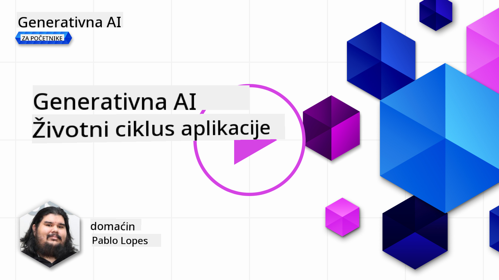
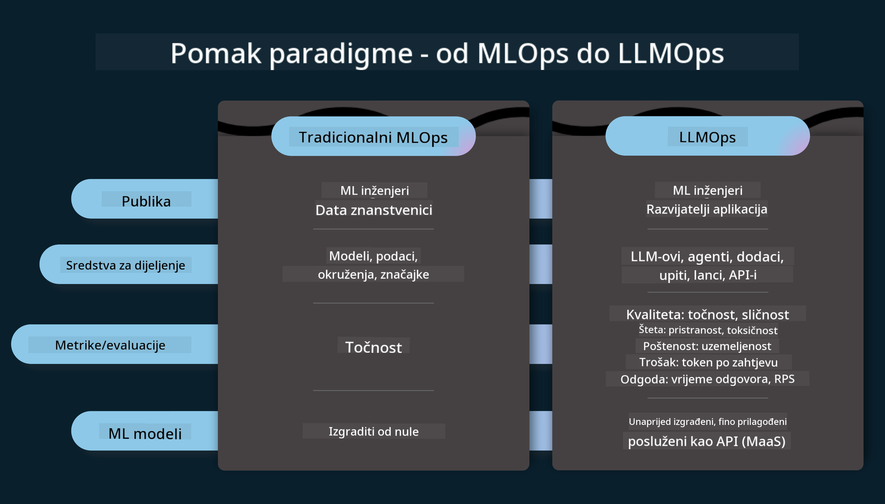
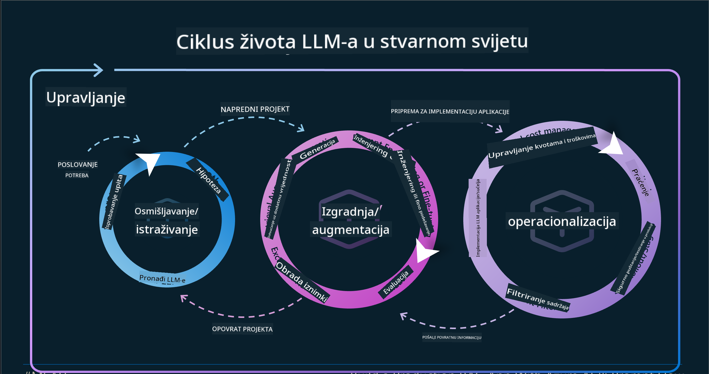
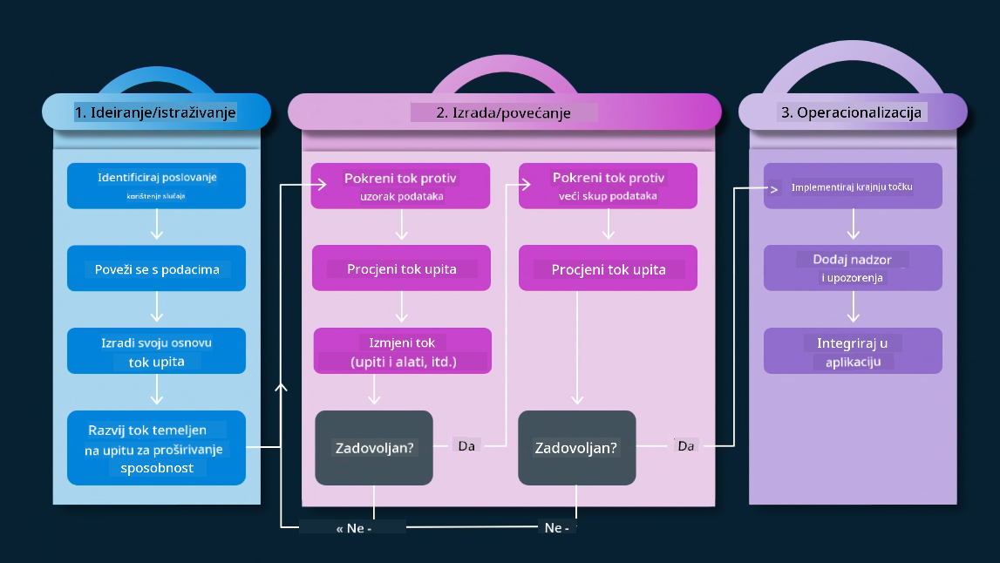
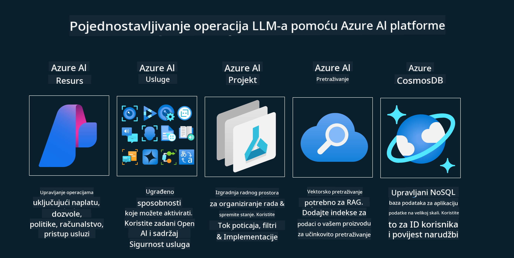
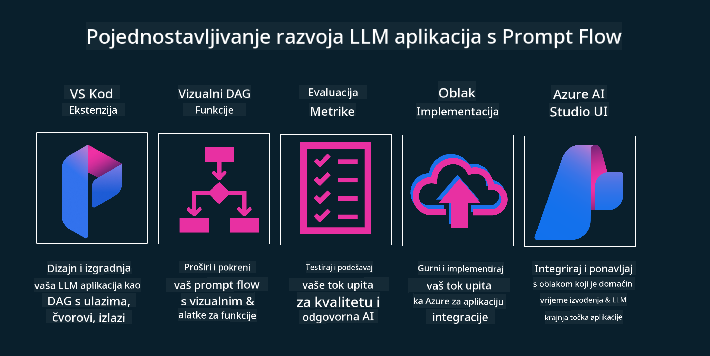

<!--
CO_OP_TRANSLATOR_METADATA:
{
  "original_hash": "27a5347a5022d5ef0a72ab029b03526a",
  "translation_date": "2025-07-09T15:59:36+00:00",
  "source_file": "14-the-generative-ai-application-lifecycle/README.md",
  "language_code": "hr"
}
-->

# Životni ciklus generativne AI aplikacije

Važno pitanje za sve AI aplikacije je relevantnost AI značajki, budući da je AI brzo razvijajuće područje. Kako biste osigurali da vaša aplikacija ostane relevantna, pouzdana i robusna, potrebno ju je kontinuirano pratiti, ocjenjivati i poboljšavati. Tu na scenu stupa životni ciklus generativne AI.

Životni ciklus generativne AI je okvir koji vas vodi kroz faze razvoja, implementacije i održavanja generativne AI aplikacije. Pomaže vam definirati ciljeve, mjeriti izvedbu, prepoznati izazove i provesti rješenja. Također vam pomaže uskladiti aplikaciju s etičkim i pravnim standardima vaše domene i dionika. Prateći životni ciklus generativne AI, možete osigurati da vaša aplikacija uvijek pruža vrijednost i zadovoljava korisnike.

## Uvod

U ovom poglavlju ćete:

- Razumjeti pomak paradigme od MLOps do LLMOps
- Životni ciklus LLM-a
- Alati za životni ciklus
- Metrifikacija i evaluacija životnog ciklusa

## Razumjeti pomak paradigme od MLOps do LLMOps

LLM-ovi su novi alat u arsenalu umjetne inteligencije, iznimno su moćni u zadacima analize i generiranja za aplikacije, no ta moć donosi i određene posljedice u načinu na koji pojednostavljujemo AI i klasične zadatke strojnog učenja.

Zbog toga nam treba nova paradigma koja će prilagoditi ovaj alat dinamički, s pravim poticajima. Starije AI aplikacije možemo kategorizirati kao "ML Apps", a novije kao "GenAI Apps" ili jednostavno "AI Apps", što odražava glavne tehnologije i tehnike korištene u to vrijeme. Ovo mijenja naš pristup na više načina, pogledajte sljedeću usporedbu.

Primijetite da se u LLMOps više fokusiramo na razvojne programere aplikacija, koristeći integracije kao ključnu točku, koristeći "Models-as-a-Service" i razmišljajući o sljedećim metrikama.

- Kvaliteta: kvaliteta odgovora
- Šteta: odgovorna AI
- Iskrenost: utemeljenost odgovora (Ima li smisla? Je li točno?)
- Trošak: budžet rješenja
- Latencija: prosječno vrijeme odgovora po tokenu

## Životni ciklus LLM-a

Prvo, da bismo razumjeli životni ciklus i njegove izmjene, pogledajmo sljedeću infografiku.

Kao što možete primijetiti, ovo se razlikuje od uobičajenih životnih ciklusa u MLOps-u. LLM-ovi imaju mnogo novih zahtjeva, poput promptinga, različitih tehnika za poboljšanje kvalitete (Fine-Tuning, RAG, Meta-Prompts), drugačiju procjenu i odgovornost s odgovornom AI, te nove metrike evaluacije (Kvaliteta, Šteta, Iskrenost, Trošak i Latencija).

Na primjer, pogledajte kako zamišljamo ideje. Koristeći prompt inženjering za eksperimentiranje s različitim LLM-ovima kako bismo istražili mogućnosti i testirali jesu li njihove hipoteze točne.

Imajte na umu da ovo nije linearan proces, već integrirani, iterativni krugovi s nadređenim ciklusom.

Kako bismo mogli istražiti te korake? Pogledajmo detaljnije kako možemo izgraditi životni ciklus.

Ovo može izgledati pomalo složeno, usredotočimo se prvo na tri glavna koraka.

1. Ideacija/Istraživanje: Istraživanje, ovdje možemo istraživati prema poslovnim potrebama. Prototipiranje, kreiranje [PromptFlow](https://microsoft.github.io/promptflow/index.html?WT.mc_id=academic-105485-koreyst) i testiranje je li dovoljno učinkovit za našu hipotezu.
1. Izgradnja/Proširenje: Implementacija, sada počinjemo ocjenjivati veće skupove podataka, primjenjujemo tehnike poput Fine-tuninga i RAG-a kako bismo provjerili robusnost rješenja. Ako ne uspije, ponovna implementacija, dodavanje novih koraka u tijek ili restrukturiranje podataka može pomoći. Nakon testiranja tijeka i skaliranja, ako radi i zadovoljava metrike, spremni smo za sljedeći korak.
1. Operacionalizacija: Integracija, sada dodajemo sustave nadzora i upozorenja, implementaciju i integraciju aplikacije.

Zatim imamo nadređeni ciklus upravljanja, fokusiran na sigurnost, usklađenost i upravljanje.

Čestitamo, sada imate svoju AI aplikaciju spremnu za rad i operativnu. Za praktično iskustvo, pogledajte [Contoso Chat Demo.](https://nitya.github.io/contoso-chat/?WT.mc_id=academic-105485-koreys)

A koje alate možemo koristiti?

## Alati za životni ciklus

Za alate, Microsoft nudi [Azure AI Platform](https://azure.microsoft.com/solutions/ai/?WT.mc_id=academic-105485-koreys) i [PromptFlow](https://microsoft.github.io/promptflow/index.html?WT.mc_id=academic-105485-koreyst) koji olakšavaju i pojednostavljuju implementaciju vašeg ciklusa.

[Azure AI Platform](https://azure.microsoft.com/solutions/ai/?WT.mc_id=academic-105485-koreys) omogućuje korištenje [AI Studija](https://ai.azure.com/?WT.mc_id=academic-105485-koreys). AI Studio je web portal koji vam omogućuje istraživanje modela, primjera i alata. Upravljanje resursima, razvoj korisničkog sučelja i SDK/CLI opcije za razvoj s fokusom na kod.

Azure AI omogućuje korištenje različitih resursa za upravljanje operacijama, uslugama, projektima, potrebama za vektorskim pretraživanjem i bazama podataka.

Izgradite, od Proof-of-Concept (POC) do velikih aplikacija s PromptFlow:

- Dizajnirajte i gradite aplikacije iz VS Code-a, koristeći vizualne i funkcionalne alate
- Testirajte i fino podesite aplikacije za kvalitetnu AI, jednostavno.
- Koristite Azure AI Studio za integraciju i iteraciju s cloudom, brzo implementirajte i pokrenite integraciju.

## Odlično! Nastavite s učenjem!

Sjajno, sada saznajte više o tome kako strukturiramo aplikaciju da biste koristili ove koncepte s [Contoso Chat App](https://nitya.github.io/contoso-chat/?WT.mc_id=academic-105485-koreyst), kako biste vidjeli kako Cloud Advocacy primjenjuje te koncepte u demonstracijama. Za dodatni sadržaj, pogledajte našu [Ignite breakout sesiju!](https://www.youtube.com/watch?v=DdOylyrTOWg)

Sada pogledajte Lekciju 15, kako biste razumjeli kako [Retrieval Augmented Generation i vektorske baze podataka](../15-rag-and-vector-databases/README.md?WT.mc_id=academic-105485-koreyst) utječu na generativnu AI i kako napraviti zanimljivije aplikacije!

**Odricanje od odgovornosti**:  
Ovaj dokument je preveden korištenjem AI usluge za prevođenje [Co-op Translator](https://github.com/Azure/co-op-translator). Iako težimo točnosti, imajte na umu da automatski prijevodi mogu sadržavati pogreške ili netočnosti. Izvorni dokument na izvornom jeziku treba smatrati službenim i autoritativnim izvorom. Za kritične informacije preporučuje se profesionalni ljudski prijevod. Ne snosimo odgovornost za bilo kakve nesporazume ili pogrešna tumačenja koja proizlaze iz korištenja ovog prijevoda.