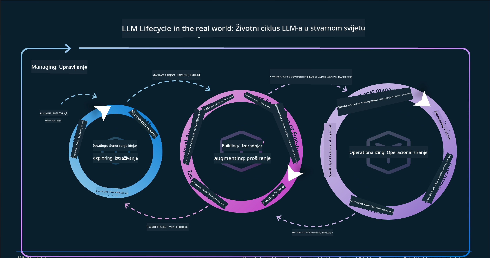
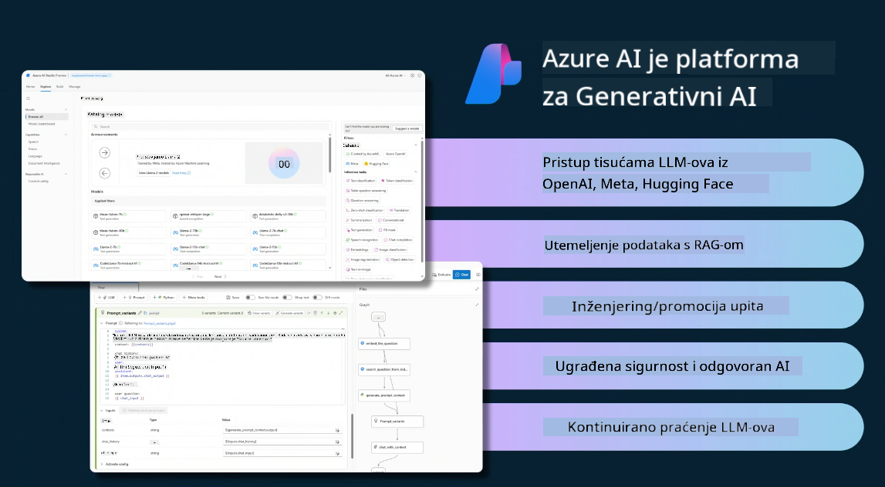
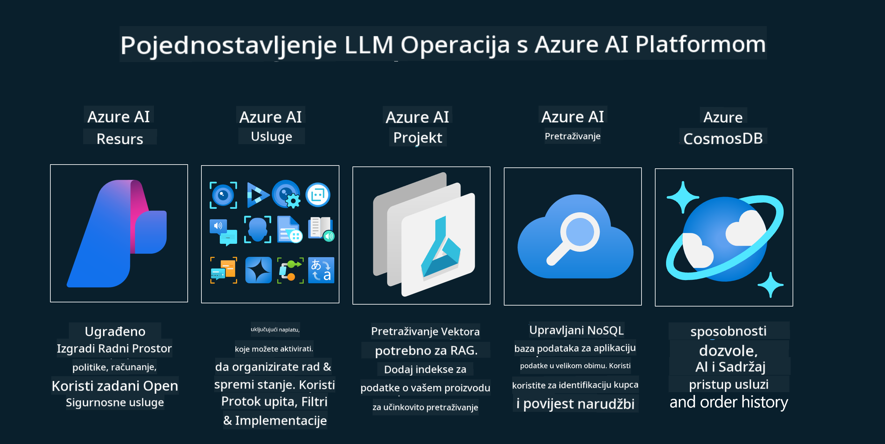
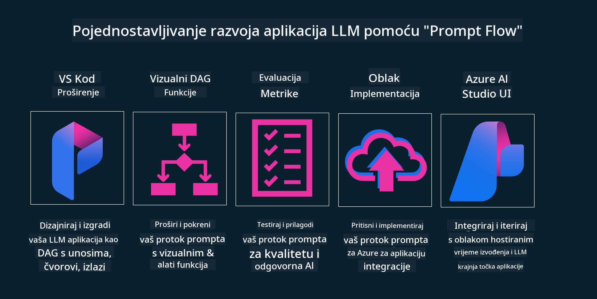

<!--
CO_OP_TRANSLATOR_METADATA:
{
  "original_hash": "27a5347a5022d5ef0a72ab029b03526a",
  "translation_date": "2025-05-20T00:57:31+00:00",
  "source_file": "14-the-generative-ai-application-lifecycle/README.md",
  "language_code": "hr"
}
-->

# Životni ciklus aplikacije generativne AI

Važno pitanje za sve AI aplikacije je relevantnost AI značajki, jer je AI područje koje se brzo razvija. Da biste osigurali da vaša aplikacija ostane relevantna, pouzdana i robusna, trebate je kontinuirano pratiti, procjenjivati i poboljšavati. Ovdje dolazi do izražaja životni ciklus generativne AI.

Životni ciklus generativne AI je okvir koji vas vodi kroz faze razvoja, implementacije i održavanja generativne AI aplikacije. Pomaže vam definirati ciljeve, mjeriti izvedbu, identificirati izazove i implementirati rješenja. Također vam pomaže uskladiti aplikaciju s etičkim i pravnim standardima vašeg područja i dionika. Prateći životni ciklus generativne AI, možete osigurati da vaša aplikacija uvijek pruža vrijednost i zadovoljava korisnike.

## Uvod

U ovom poglavlju ćete:

- Razumjeti promjenu paradigme s MLOps na LLMOps
- Životni ciklus LLM-a
- Alati za životni ciklus
- Metrifikacija i evaluacija životnog ciklusa

## Razumjeti promjenu paradigme s MLOps na LLMOps

LLM-ovi su novi alat u arsenalu umjetne inteligencije, izuzetno su moćni u zadacima analize i generiranja za aplikacije, no ta moć ima posljedice na način kako optimiziramo AI i klasične zadatke strojnog učenja.

S tim u vezi, potrebna nam je nova paradigma za prilagodbu ovog alata u dinamičnom okruženju, s ispravnim poticajima. Starije AI aplikacije možemo kategorizirati kao "ML aplikacije", a novije AI aplikacije kao "GenAI aplikacije" ili jednostavno "AI aplikacije", što odražava mainstream tehnologiju i tehnike korištene u to vrijeme. Ovo mijenja našu priču na više načina, pogledajte sljedeću usporedbu.

Primijetite da se u LLMOps-u više fokusiramo na programere aplikacija, koristeći integracije kao ključnu točku, koristeći "Modeli kao usluga" i razmišljajući o sljedećim točkama za metriku.

- Kvaliteta: Kvaliteta odgovora
- Šteta: Odgovorna AI
- Iskrenost: Utemeljenost odgovora (Ima li smisla? Je li točno?)
- Trošak: Budžet rješenja
- Kašnjenje: Prosječno vrijeme za odgovor tokena

## Životni ciklus LLM-a

Prvo, da bismo razumjeli životni ciklus i promjene, obratimo pažnju na sljedeću infografiku.

Kao što možete primijetiti, ovo se razlikuje od uobičajenih životnih ciklusa MLOps-a. LLM-ovi imaju mnogo novih zahtjeva, kao što su Prompting, različite tehnike za poboljšanje kvalitete (Fine-Tuning, RAG, Meta-Prompts), različita procjena i odgovornost s odgovornom AI, na kraju, nove evaluacijske metrike (Kvaliteta, Šteta, Iskrenost, Trošak i Kašnjenje).

Na primjer, pogledajte kako zamišljamo. Koristeći inženjering promptova za eksperimentiranje s raznim LLM-ovima kako bismo istražili mogućnosti za testiranje jesu li njihove hipoteze ispravne.

Napomena da ovo nije linearno, već integrirani ciklusi, iterativni i s nadređenim ciklusom.

Kako bismo mogli istražiti te korake? Uđimo u detalje kako bismo mogli izgraditi životni ciklus.

Ovo može izgledati pomalo komplicirano, fokusirajmo se prvo na tri velika koraka.

1. Ideacija/Istraživanje: Istraživanje, ovdje možemo istraživati prema potrebama našeg poslovanja. Prototipiranje, stvaranje [PromptFlow](https://microsoft.github.io/promptflow/index.html?WT.mc_id=academic-105485-koreyst) i testiranje je li dovoljno učinkovito za našu hipotezu.
2. Izgradnja/Povećanje: Implementacija, sada počinjemo procjenjivati veće skupove podataka implementirajući tehnike, kao što su Fine-tuning i RAG, kako bismo provjerili robusnost našeg rješenja. Ako nije, ponovna implementacija, dodavanje novih koraka u naš tijek ili restrukturiranje podataka, može pomoći. Nakon testiranja našeg tijeka i naše skale, ako radi i provjerimo naše metrike, spremno je za sljedeći korak.
3. Operativnost: Integracija, sada dodajemo sustave za praćenje i upozorenja u naš sustav, implementaciju i integraciju aplikacije u našu aplikaciju.

Zatim imamo nadređeni ciklus upravljanja, fokusirajući se na sigurnost, usklađenost i upravljanje.

Čestitamo, sada je vaša AI aplikacija spremna za rad i operativna. Za praktično iskustvo, pogledajte [Contoso Chat Demo.](https://nitya.github.io/contoso-chat/?WT.mc_id=academic-105485-koreys)

Koje alate sada možemo koristiti?

## Alati za životni ciklus

Za alate, Microsoft nudi [Azure AI Platform](https://azure.microsoft.com/solutions/ai/?WT.mc_id=academic-105485-koreys) i [PromptFlow](https://microsoft.github.io/promptflow/index.html?WT.mc_id=academic-105485-koreyst) kako bi olakšao i omogućio jednostavnu implementaciju i pripremu vašeg ciklusa.

[Azure AI Platform](https://azure.microsoft.com/solutions/ai/?WT.mc_id=academic-105485-koreys) vam omogućuje korištenje [AI Studio](https://ai.azure.com/?WT.mc_id=academic-105485-koreys). AI Studio je web portal koji vam omogućuje istraživanje modela, uzoraka i alata. Upravljanje vašim resursima, UI razvojni tijekovi i SDK/CLI opcije za razvoj usmjeren na kod.

Azure AI vam omogućuje korištenje više resursa za upravljanje vašim operacijama, uslugama, projektima, pretraživanjem vektora i potrebama baza podataka.

Izgradite, od Proof-of-Concept (POC) do aplikacija velikih razmjera s PromptFlow:

- Dizajnirajte i izgradite aplikacije iz VS Code, s vizualnim i funkcionalnim alatima
- Testirajte i prilagodite svoje aplikacije za kvalitetan AI, s lakoćom.
- Koristite Azure AI Studio za integraciju i iteraciju s oblakom, Pritisnite i implementirajte za brzu integraciju.

## Odlično! Nastavite s učenjem!

Nevjerojatno, sada naučite više o tome kako strukturiramo aplikaciju za korištenje koncepata s [Contoso Chat App](https://nitya.github.io/contoso-chat/?WT.mc_id=academic-105485-koreyst), kako biste provjerili kako Cloud Advocacy dodaje te koncepte u demonstracije. Za više sadržaja, pogledajte našu [Ignite breakout sesiju!
](https://www.youtube.com/watch?v=DdOylyrTOWg)

Sada, provjerite Lekciju 15, kako biste razumjeli kako [Povećano generiranje pretraživanjem i vektorske baze podataka](../15-rag-and-vector-databases/README.md?WT.mc_id=academic-105485-koreyst) utječu na generativnu AI i kako stvoriti angažiranije aplikacije!

**Odricanje od odgovornosti**:  
Ovaj dokument je preveden korištenjem AI usluge za prevođenje [Co-op Translator](https://github.com/Azure/co-op-translator). Iako težimo točnosti, imajte na umu da automatizirani prijevodi mogu sadržavati pogreške ili netočnosti. Izvorni dokument na izvornom jeziku treba smatrati autoritativnim izvorom. Za kritične informacije preporučuje se profesionalni ljudski prijevod. Ne odgovaramo za nesporazume ili pogrešne interpretacije koje proizlaze iz korištenja ovog prijevoda.