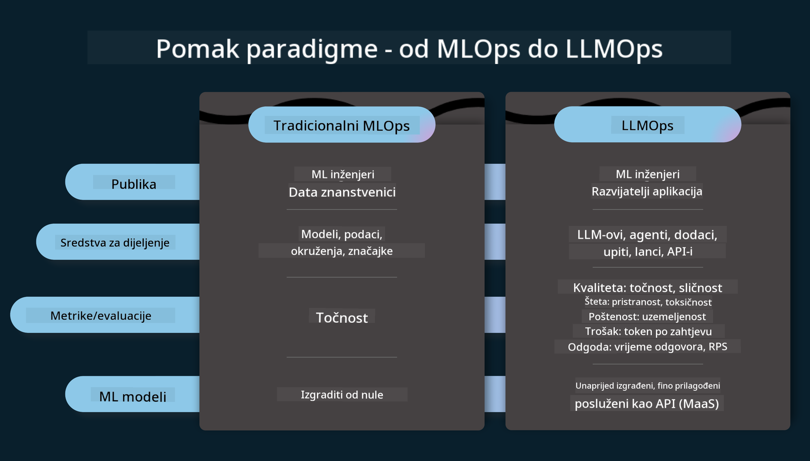
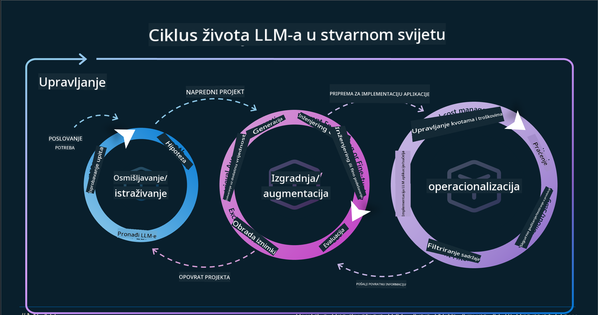
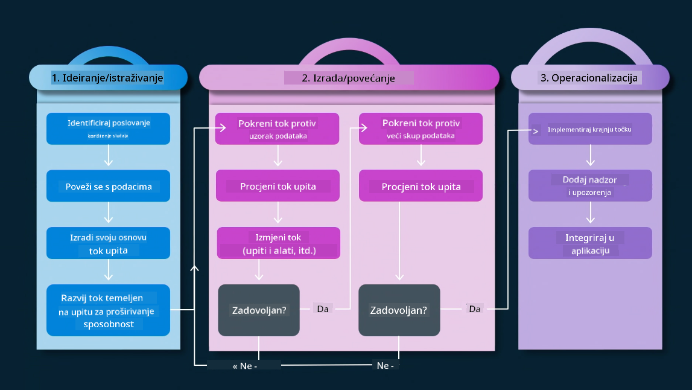
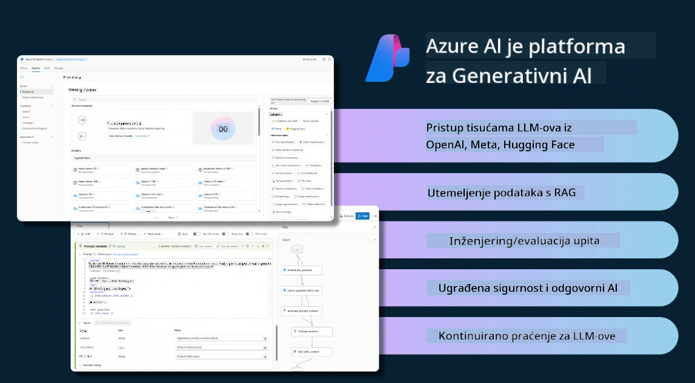
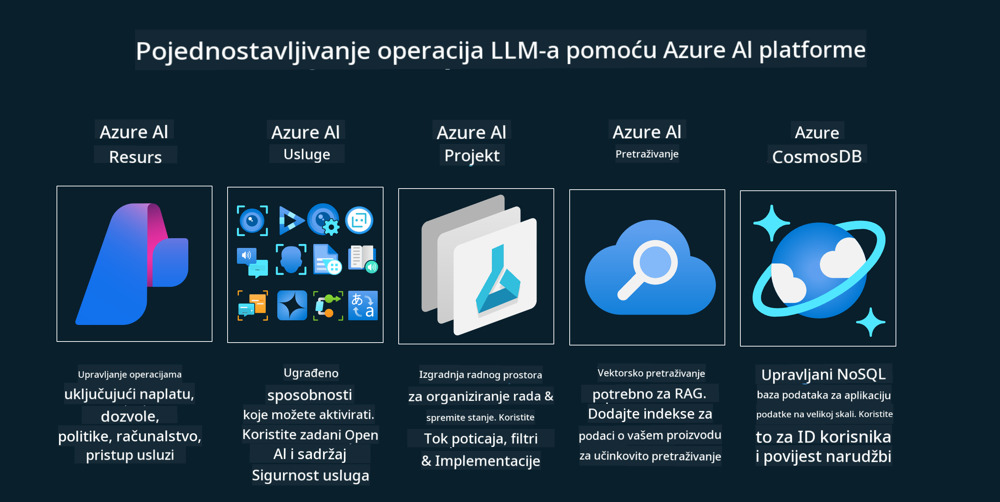
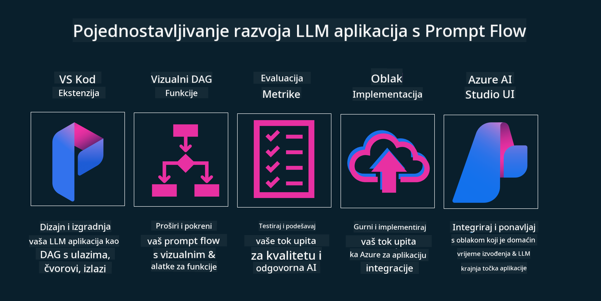

<!--
CO_OP_TRANSLATOR_METADATA:
{
  "original_hash": "27a5347a5022d5ef0a72ab029b03526a",
  "translation_date": "2025-06-25T22:12:04+00:00",
  "source_file": "14-the-generative-ai-application-lifecycle/README.md",
  "language_code": "hr"
}
-->

# Životni ciklus generativne AI aplikacije

Važno pitanje za sve AI aplikacije je relevantnost AI značajki, budući da je AI područje koje se brzo razvija. Da biste osigurali da vaša aplikacija ostane relevantna, pouzdana i robusna, morate je kontinuirano pratiti, procjenjivati i poboljšavati. Ovdje dolazi u igru životni ciklus generativne AI.

Životni ciklus generativne AI je okvir koji vas vodi kroz faze razvoja, implementacije i održavanja generativne AI aplikacije. Pomaže vam definirati ciljeve, mjeriti performanse, identificirati izazove i implementirati rješenja. Također vam pomaže uskladiti vašu aplikaciju s etičkim i pravnim standardima vašeg područja i vaših dionika. Prateći životni ciklus generativne AI, možete osigurati da vaša aplikacija uvijek pruža vrijednost i zadovoljava vaše korisnike.

## Uvod

U ovom poglavlju ćete:

- Razumjeti promjenu paradigme s MLOps na LLMOps
- Životni ciklus LLM-a
- Alati za životni ciklus
- Metrifikacija i evaluacija životnog ciklusa

## Razumjeti promjenu paradigme s MLOps na LLMOps

LLM-ovi su novi alat u arsenalu umjetne inteligencije, izuzetno su moćni u zadacima analize i generiranja za aplikacije, no ova moć ima neke posljedice na način kako usmjeravamo AI i klasične zadatke strojnog učenja.

S tim u vezi, trebamo novu paradigmu da prilagodimo ovaj alat u dinamičnom okruženju, s ispravnim poticajima. Možemo kategorizirati starije AI aplikacije kao "ML aplikacije", a novije AI aplikacije kao "GenAI aplikacije" ili jednostavno "AI aplikacije", odražavajući glavne tehnologije i tehnike korištene u to vrijeme. Ovo mijenja našu naraciju na više načina, pogledajte sljedeću usporedbu.

Primijetite da se u LLMOps više fokusiramo na programere aplikacija, koristeći integracije kao ključnu točku, koristeći "Modeli-kao-usluga" i razmišljajući o sljedećim točkama za metrike.

- Kvaliteta: Kvaliteta odgovora
- Šteta: Odgovorna AI
- Iskrenost: Utemeljenost odgovora (Ima li smisla? Je li točno?)
- Trošak: Proračun rješenja
- Kašnjenje: Prosječno vrijeme za odgovor tokena

## Životni ciklus LLM-a

Prvo, da bismo razumjeli životni ciklus i izmjene, zabilježimo sljedeću infografiku.

Kao što možete primijetiti, ovo se razlikuje od uobičajenih životnih ciklusa iz MLOps. LLM-ovi imaju mnogo novih zahtjeva, kao što su Prompting, različite tehnike za poboljšanje kvalitete (Fine-Tuning, RAG, Meta-Prompts), različita procjena i odgovornost s odgovornom AI, i na kraju, nove evaluacijske metrike (Kvaliteta, Šteta, Iskrenost, Trošak i Kašnjenje).

Na primjer, pogledajte kako osmišljavamo. Koristeći inženjering prompta za eksperimentiranje s raznim LLM-ovima kako bismo istražili mogućnosti testiranja ispravnosti njihove hipoteze.

Napominjemo da ovo nije linearno, već integrirani ciklusi, iterativni i s nadređenim ciklusom.

Kako bismo mogli istražiti te korake? Krenimo u detalje kako možemo izgraditi životni ciklus.

Ovo može izgledati pomalo komplicirano, fokusirajmo se prvo na tri velika koraka.

1. Osmišljavanje/Istraživanje: Istraživanje, ovdje možemo istraživati prema našim poslovnim potrebama. Prototipiranje, kreiranje [PromptFlow](https://microsoft.github.io/promptflow/index.html?WT.mc_id=academic-105485-koreyst) i testiranje je li dovoljno učinkovito za našu hipotezu.
2. Izgradnja/Povećavanje: Implementacija, sada počinjemo evaluirati veće skupove podataka i implementirati tehnike, poput Fine-tuninga i RAG-a, kako bismo provjerili robusnost našeg rješenja. Ako nije, ponovno ga implementiramo, dodajući nove korake u naš tok ili restrukturirajući podatke, što može pomoći. Nakon testiranja našeg toka i naše skale, ako radi i provjerava naše metrike, spremno je za sljedeći korak.
3. Operacionalizacija: Integracija, sada dodajemo sustave nadzora i upozorenja našem sustavu, implementaciju i integraciju aplikacija u našu aplikaciju.

Zatim imamo nadređeni ciklus upravljanja, fokusiran na sigurnost, usklađenost i upravljanje.

Čestitamo, sada imate svoju AI aplikaciju spremnu za rad i operativnu. Za praktično iskustvo, pogledajte [Contoso Chat Demo.](https://nitya.github.io/contoso-chat/?WT.mc_id=academic-105485-koreys)

Sada, koje alate možemo koristiti?

## Alati za životni ciklus

Za alate, Microsoft nudi [Azure AI Platform](https://azure.microsoft.com/solutions/ai/?WT.mc_id=academic-105485-koreys) i [PromptFlow](https://microsoft.github.io/promptflow/index.html?WT.mc_id=academic-105485-koreyst) kako bi olakšali i učinili vaš ciklus lakim za implementaciju i spremnim za rad.

[Azure AI Platform](https://azure.microsoft.com/solutions/ai/?WT.mc_id=academic-105485-koreys) vam omogućuje korištenje [AI Studija](https://ai.azure.com/?WT.mc_id=academic-105485-koreys). AI Studio je web portal koji vam omogućuje istraživanje modela, uzoraka i alata. Upravljanje vašim resursima, UI razvojnim tokovima i SDK/CLI opcijama za razvoj temeljen na kodu.

Azure AI vam omogućuje korištenje više resursa za upravljanje vašim operacijama, uslugama, projektima, pretraživanjem vektora i potrebama baza podataka.

Izgradite, od dokaza koncepta (POC) do aplikacija velikih razmjera s PromptFlow:

- Dizajnirajte i izradite aplikacije iz VS Code, s vizualnim i funkcionalnim alatima
- Testirajte i prilagodite svoje aplikacije za kvalitetnu AI, s lakoćom.
- Koristite Azure AI Studio za integraciju i iteraciju s oblakom, potiskivanje i implementaciju za brzu integraciju.

## Odlično! Nastavite s učenjem!

Nevjerojatno, sada naučite više o tome kako strukturiramo aplikaciju za korištenje koncepata s [Contoso Chat App](https://nitya.github.io/contoso-chat/?WT.mc_id=academic-105485-koreyst), kako biste vidjeli kako Cloud Advocacy dodaje te koncepte u demonstracije. Za više sadržaja, pogledajte naš [Ignite breakout session!
](https://www.youtube.com/watch?v=DdOylyrTOWg)

Sada, provjerite Lekciju 15, kako biste razumjeli kako [Retrieval Augmented Generation i vektorske baze podataka](../15-rag-and-vector-databases/README.md?WT.mc_id=academic-105485-koreyst) utječu na generativnu AI i kako stvoriti zanimljivije aplikacije!

**Odricanje odgovornosti**:  
Ovaj dokument je preveden korištenjem AI usluge prevođenja [Co-op Translator](https://github.com/Azure/co-op-translator). Iako se trudimo za točnost, imajte na umu da automatski prijevodi mogu sadržavati pogreške ili netočnosti. Izvorni dokument na izvornom jeziku treba smatrati mjerodavnim izvorom. Za ključne informacije preporučuje se profesionalni prijevod od strane ljudi. Ne odgovaramo za nesporazume ili pogrešna tumačenja koja proizlaze iz korištenja ovog prijevoda.