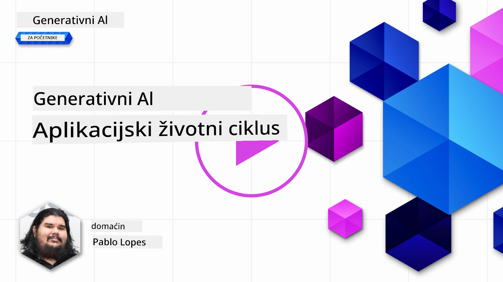
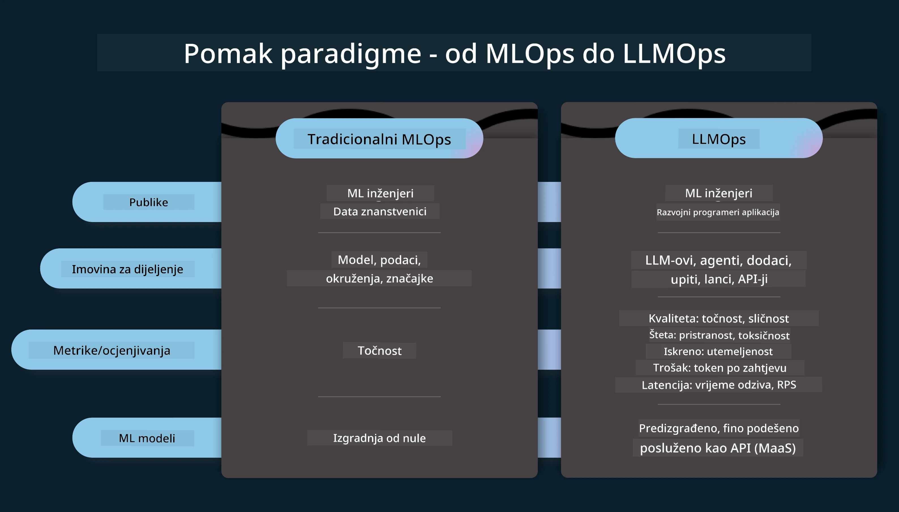
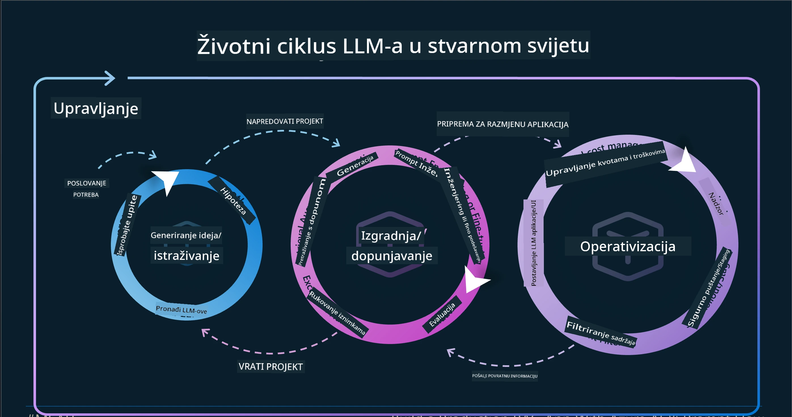
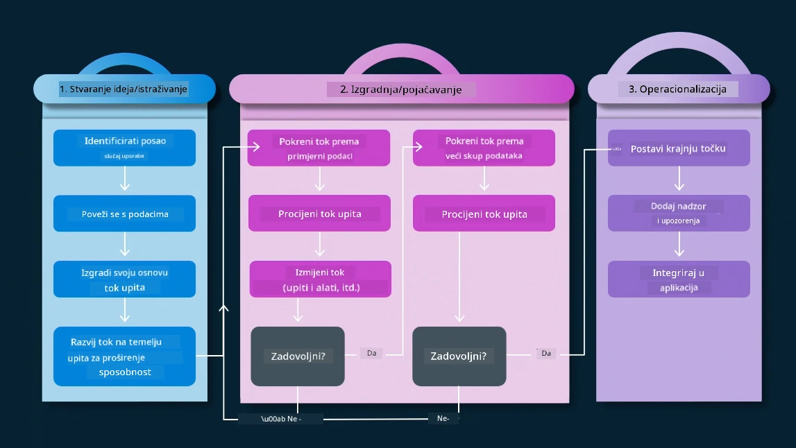
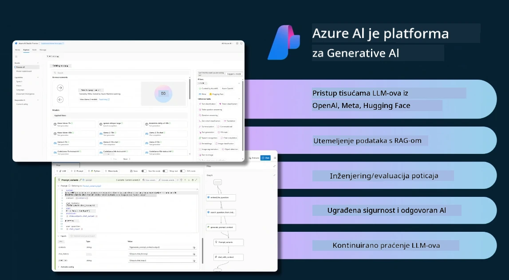
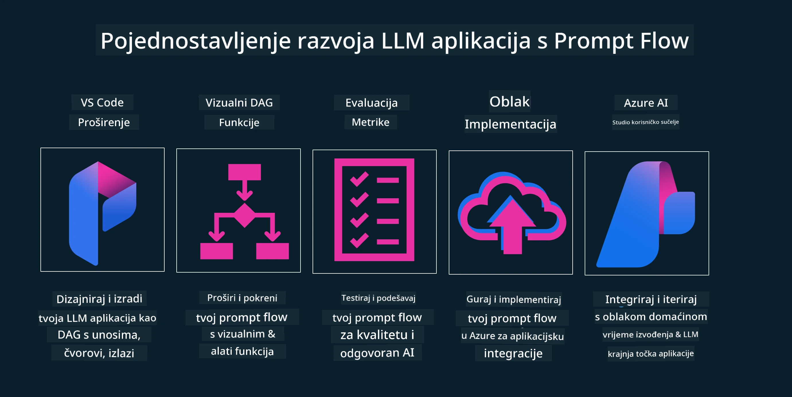

# Životni ciklus generativne AI aplikacije

Važno pitanje za sve AI aplikacije jest relevantnost AI značajki, budući da je AI brzo razvijajuće područje, kako bi vaša aplikacija ostala relevantna, pouzdana i čvrsta, morate je kontinuirano pratiti, ocjenjivati i poboljšavati. Tu dolazi u obzir životni ciklus generativne AI.

Životni ciklus generativne AI je okvir koji vas vodi kroz faze razvoja, implementacije i održavanja generativne AI aplikacije. Pomaže vam definirati ciljeve, mjeriti izvedbu, identificirati izazove i provoditi rješenja. Također pomaže uskladiti vašu aplikaciju s etičkim i pravnim normama vaše domene i dionika. Prateći životni ciklus generativne AI, možete osigurati da vaša aplikacija uvijek pruža vrijednost i zadovoljava vaše korisnike.

## Uvod

U ovom poglavlju ćete:

- Razumjeti Paradigmatsku promjenu od MLOps do LLMOps
- Životni ciklus LLM-a
- Alati za životni ciklus
- Metrifikacija i evaluacija životnog ciklusa

## Razumjeti Paradigmatsku promjenu od MLOps do LLMOps

LLM-ovi su novi alat u arsenalu umjetne inteligencije, nevjerojatno su moćni u zadacima analize i generiranja za aplikacije, no ta moć ima posljedice u načinu na koji pojednostavljujemo AI i klasične zadatke strojnog učenja.

S tim, potrebna nam je nova paradigma za prilagodbu ovog alata u dinamičnom okruženju, s pravim poticajima. Možemo kategorizirati starije AI aplikacije kao "ML aplikacije" i novije AI aplikacije kao "GenAI aplikacije" ili samo "AI aplikacije", što odražava glavne tehnologije i tehnike korištene u to vrijeme. Ovo pomiče naš narativ na više načina, pogledajte sljedeću usporedbu.

Primijetite da se kod LLMOps više fokusiramo na programere aplikacija, koristeći integracije kao ključnu točku, koristeći "Modeli kao usluga" i promišljajući sljedeće točke za metrike.

- Kvaliteta: Kvaliteta odgovora
- Šteta: Odgovorna AI
- Iskrenost: Utemeljenost odgovora (Ima li smisla? Je li ispravno?)
- Trošak: Proračun rješenja
- Kašnjenje: Prosječno vrijeme odgovora tokena

## Životni ciklus LLM-a

Prvo, za razumijevanje životnog ciklusa i izmjena, pogledajmo sljedeću infografiku.

Kao što možete primijetiti, ovo je različito od uobičajenih životnih ciklusa u MLOps-u. LLM-ovi imaju mnoge nove zahtjeve, poput promptiranja, različitih tehnika za poboljšanje kvalitete (fino podešavanje, RAG, meta-prompti), različite procjene i odgovornosti s odgovornom AI, te konačno, nove metrike evaluacije (kvaliteta, šteta, iskrenost, trošak i kašnjenje).

Na primjer, pogledajte kako razvijamo ideje. Koristeći inženjerstvo prompta za isprobavanje raznih LLM-ova kako bismo istražili mogućnosti i testirali jesu li njihove hipoteze točne.

Imajte na umu da ovo nije linearno, već integrirani krugovi, iterativni i s nadređenim ciklusom.

Kako bismo mogli istražiti te korake? Pogledajmo detaljno kako bismo mogli izgraditi životni ciklus.

Ovo može izgledati pomalo složeno, usredotočimo se prvo na tri velika koraka.

1. Generiranje ideja/Istraživanje: Istraživanje, ovdje možemo istraživati prema poslovnim potrebama. Prototipizacija, kreiranje [PromptFlow](https://microsoft.github.io/promptflow/index.html?WT.mc_id=academic-105485-koreyst) i testiranje je li dovoljno učinkovit za naše hipoteze.
1. Izgradnja/Poboljšavanje: Implementacija, sada počinjemo s evaluacijom za veće skupove podataka, implementiramo tehnike poput fino podešavanja i RAG-a kako bismo provjerili robusnost našeg rješenja. Ako nije, ponovno implementiranje, dodavanje novih koraka u tok ili restrukturiranje podataka može pomoći. Nakon testiranja našeg toka i opsega, ako funkcionira i ako metrike zadovoljavaju, spremni smo za sljedeći korak.
1. Stavljanje u rad: Integracija, sada dodajemo sustave za nadzor i obavijesti u sustav, implementaciju i integraciju aplikacije.

Zatim imamo nadređeni upravljački ciklus, fokusiran na sigurnost, usklađenost i upravljanje.

Čestitamo, sada imate svoju AI aplikaciju spremnu i u radnom stanju. Za praktično iskustvo, pogledajte [Contoso Chat Demo.](https://nitya.github.io/contoso-chat/?WT.mc_id=academic-105485-koreyst)

Sada, koje alate možemo koristiti?

## Alati za životni ciklus

Za alate, Microsoft nudi [Azure AI Platform](https://azure.microsoft.com/solutions/ai/?WT.mc_id=academic-105485-koreyst) i [PromptFlow](https://microsoft.github.io/promptflow/index.html?WT.mc_id=academic-105485-koreyst) koji olakšavaju i pojednostavljuju vaš ciklus implementacije i pripremaju ga za rad.

[Azure AI Platform](https://azure.microsoft.com/solutions/ai/?WT.mc_id=academic-105485-koreyst), omogućava vam korištenje [AI Studija](https://ai.azure.com/?WT.mc_id=academic-105485-koreyst). AI Studio je web portal koji vam omogućava istraživanje modela, uzoraka i alata. Upravljanje resursima, UI razvojnim tokovima i SDK/CLI opcijama za razvoj s prednošću koda.

Azure AI omogućuje vam korištenje više resursa za upravljanje vašim operacijama, uslugama, projektima, potrebama pretraživanja vektora i baza podataka.

Izgradite, od konceptualnog dokaza (POC) do velikih aplikacija s PromptFlow:

- Dizajnirajte i izgradite aplikacije iz VS Codea, s vizualnim i funkcionalnim alatima
- Testirajte i fino podesite svoje aplikacije za kvalitetnu AI, jednostavno.
- Koristite Azure AI Studio za integraciju i iteraciju s oblakom, push i deployment za brzu integraciju.

## Odlično! Nastavite svoje učenje!

Nevjerojatno, sada saznajte više o tome kako strukturirati aplikaciju za korištenje koncepata kroz [Contoso Chat App](https://nitya.github.io/contoso-chat/?WT.mc_id=academic-105485-koreyst), da provjerite kako Cloud Advocacy dodaje te koncepte u demonstracijama. Za više sadržaja, pogledajte našu [Ignite breakout session!
](https://www.youtube.com/watch?v=DdOylyrTOWg)

Sada pogledajte Lekciju 15, da razumijete kako [Retrieval Augmented Generation i Vektorske baze podataka](../15-rag-and-vector-databases/README.md?WT.mc_id=academic-105485-koreyst) utječu na Generativnu AI i kako napraviti uzbudljivije Aplikacije!

---

<!-- CO-OP TRANSLATOR DISCLAIMER START -->
**Odricanje od odgovornosti**:
Ovaj dokument je preveden pomoću AI prevoditeljskog servisa [Co-op Translator](https://github.com/Azure/co-op-translator). Iako težimo točnosti, molimo imajte na umu da automatski prijevodi mogu sadržavati pogreške ili netočnosti. Izvorni dokument na izvornom jeziku treba smatrati autoritativnim izvorom. Za kritične informacije preporučujemo profesionalni ljudski prijevod. Nismo odgovorni za bilo kakva nesporazumevanja ili kriva tumačenja koja proizlaze iz korištenja ovog prijevoda.
<!-- CO-OP TRANSLATOR DISCLAIMER END -->