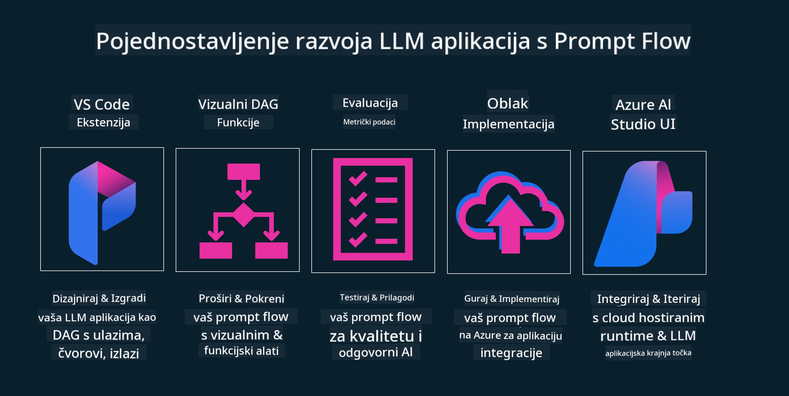

<!--
CO_OP_TRANSLATOR_METADATA:
{
  "original_hash": "b9d32511b27373a1b21b5789d4fda057",
  "translation_date": "2025-10-18T01:34:17+00:00",
  "source_file": "14-the-generative-ai-application-lifecycle/README.md",
  "language_code": "hr"
}
-->

# Životni ciklus generativnih AI aplikacija

Važno pitanje za sve AI aplikacije je relevantnost AI značajki, budući da je AI područje koje se brzo razvija. Kako biste osigurali da vaša aplikacija ostane relevantna, pouzdana i robusna, potrebno je kontinuirano pratiti, procjenjivati i poboljšavati je. Tu dolazi u igru životni ciklus generativnog AI-a.

Životni ciklus generativnog AI-a je okvir koji vas vodi kroz faze razvoja, implementacije i održavanja generativne AI aplikacije. Pomaže vam definirati ciljeve, mjeriti performanse, identificirati izazove i implementirati rješenja. Također vam pomaže uskladiti aplikaciju s etičkim i pravnim standardima vašeg područja i vaših dionika. Slijedeći životni ciklus generativnog AI-a, možete osigurati da vaša aplikacija uvijek pruža vrijednost i zadovoljava korisnike.

## Uvod

U ovom poglavlju ćete:

- Razumjeti promjenu paradigme s MLOps na LLMOps
- Životni ciklus LLM-a
- Alati za životni ciklus
- Metrifikacija i evaluacija životnog ciklusa

## Razumijevanje promjene paradigme s MLOps na LLMOps

LLM-ovi su novi alat u arsenalu umjetne inteligencije, izuzetno su moćni u analitičkim i generativnim zadacima za aplikacije. Međutim, ta moć ima određene posljedice na način na koji optimiziramo AI i klasične zadatke strojnog učenja.

Zbog toga nam je potrebna nova paradigma kako bismo prilagodili ovaj alat na dinamičan način, uz odgovarajuće poticaje. Starije AI aplikacije možemo kategorizirati kao "ML aplikacije", dok novije AI aplikacije možemo nazvati "GenAI aplikacijama" ili jednostavno "AI aplikacijama", što odražava dominantnu tehnologiju i tehnike koje se koriste u to vrijeme. Ova promjena mijenja našu perspektivu na više načina, pogledajte sljedeću usporedbu.

Primijetite da se u LLMOps-u više fokusiramo na razvojne programere aplikacija, koristeći integracije kao ključnu točku, koristeći "Modeli-kao-usluga" i razmatrajući sljedeće točke za metrike.

- Kvaliteta: Kvaliteta odgovora
- Šteta: Odgovorna AI
- Iskrenost: Utemeljenost odgovora (Ima li smisla? Je li točno?)
- Trošak: Proračun rješenja
- Kašnjenje: Prosječno vrijeme odgovora po tokenu

## Životni ciklus LLM-a

Prvo, kako bismo razumjeli životni ciklus i njegove modifikacije, pogledajmo sljedeći infografiku.

Kao što možete primijetiti, ovo se razlikuje od uobičajenih životnih ciklusa iz MLOps-a. LLM-ovi imaju mnoge nove zahtjeve, poput Promptinga, različitih tehnika za poboljšanje kvalitete (Fine-Tuning, RAG, Meta-Prompts), različite procjene i odgovornosti s odgovornom AI, te nove evaluacijske metrike (Kvaliteta, Šteta, Iskrenost, Trošak i Kašnjenje).

Na primjer, pogledajte kako ideiramo. Koristeći inženjering promptova za eksperimentiranje s različitim LLM-ovima kako bismo istražili mogućnosti i testirali je li njihova hipoteza točna.

Primijetite da ovo nije linearno, već integrirani ciklusi, iterativni i s općim ciklusom.

Kako možemo istražiti te korake? Pogledajmo detaljno kako možemo izgraditi životni ciklus.

Ovo može izgledati pomalo komplicirano, fokusirajmo se na tri glavna koraka.

1. Ideiranje/Istraživanje: Istraživanje, ovdje možemo istraživati prema našim poslovnim potrebama. Prototipiranje, stvaranje [PromptFlow](https://microsoft.github.io/promptflow/index.html?WT.mc_id=academic-105485-koreyst) i testiranje je li dovoljno učinkovito za našu hipotezu.
2. Izgradnja/Poboljšanje: Implementacija, sada počinjemo procjenjivati veće skupove podataka, implementirati tehnike poput Fine-tuninga i RAG-a, kako bismo provjerili robusnost našeg rješenja. Ako nije dovoljno, ponovno implementiranje, dodavanje novih koraka u naš tijek ili restrukturiranje podataka može pomoći. Nakon testiranja našeg tijeka i naše skale, ako funkcionira i provjerimo naše metrike, spremno je za sljedeći korak.
3. Operacionalizacija: Integracija, sada dodajemo sustave za praćenje i upozorenja našem sustavu, implementaciju i integraciju aplikacije u našu aplikaciju.

Zatim imamo opći ciklus upravljanja, fokusirajući se na sigurnost, usklađenost i upravljanje.

Čestitamo, sada je vaša AI aplikacija spremna za rad i operativna. Za praktično iskustvo, pogledajte [Contoso Chat Demo.](https://nitya.github.io/contoso-chat/?WT.mc_id=academic-105485-koreys)

Koje alate možemo koristiti?

## Alati za životni ciklus

Za alate, Microsoft pruža [Azure AI Platform](https://azure.microsoft.com/solutions/ai/?WT.mc_id=academic-105485-koreys) i [PromptFlow](https://microsoft.github.io/promptflow/index.html?WT.mc_id=academic-105485-koreyst) kako bi olakšao i omogućio jednostavnu implementaciju vašeg ciklusa.

[Azure AI Platform](https://azure.microsoft.com/solutions/ai/?WT.mc_id=academic-105485-koreys) omogućuje korištenje [AI Studio](https://ai.azure.com/?WT.mc_id=academic-105485-koreys). AI Studio je web portal koji vam omogućuje istraživanje modela, uzoraka i alata. Upravljanje vašim resursima, razvojni tijekovi korisničkog sučelja i opcije SDK/CLI za razvoj temeljen na kodu.

Azure AI omogućuje korištenje više resursa za upravljanje vašim operacijama, uslugama, projektima, pretraživanjem vektora i potrebama baza podataka.

Izgradite, od Proof-of-Concept (POC) do aplikacija velikih razmjera s PromptFlow:

- Dizajnirajte i izradite aplikacije iz VS Code-a, s vizualnim i funkcionalnim alatima
- Testirajte i fino podešavajte svoje aplikacije za kvalitetnu AI, s lakoćom.
- Koristite Azure AI Studio za integraciju i iteraciju s oblakom, implementaciju i brzo povezivanje.

## Odlično! Nastavite s učenjem!

Izvrsno, sada saznajte više o tome kako strukturiramo aplikaciju za korištenje ovih koncepata s [Contoso Chat App](https://nitya.github.io/contoso-chat/?WT.mc_id=academic-105485-koreyst), kako biste vidjeli kako Cloud Advocacy primjenjuje te koncepte u demonstracijama. Za više sadržaja, pogledajte naš [Ignite breakout session!
](https://www.youtube.com/watch?v=DdOylyrTOWg)

Sada, pogledajte Lekciju 15, kako biste razumjeli kako [Retrieval Augmented Generation i vektorske baze podataka](../15-rag-and-vector-databases/README.md?WT.mc_id=academic-105485-koreyst) utječu na generativni AI i kako stvoriti zanimljivije aplikacije!

---

**Izjava o odricanju odgovornosti**:  
Ovaj dokument je preveden pomoću AI usluge za prevođenje [Co-op Translator](https://github.com/Azure/co-op-translator). Iako nastojimo osigurati točnost, imajte na umu da automatski prijevodi mogu sadržavati pogreške ili netočnosti. Izvorni dokument na izvornom jeziku treba smatrati autoritativnim izvorom. Za ključne informacije preporučuje se profesionalni prijevod od strane čovjeka. Ne preuzimamo odgovornost za nesporazume ili pogrešne interpretacije koje proizlaze iz korištenja ovog prijevoda.