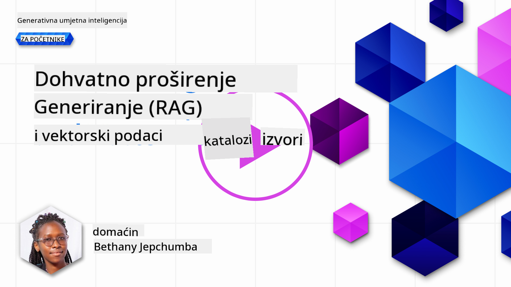
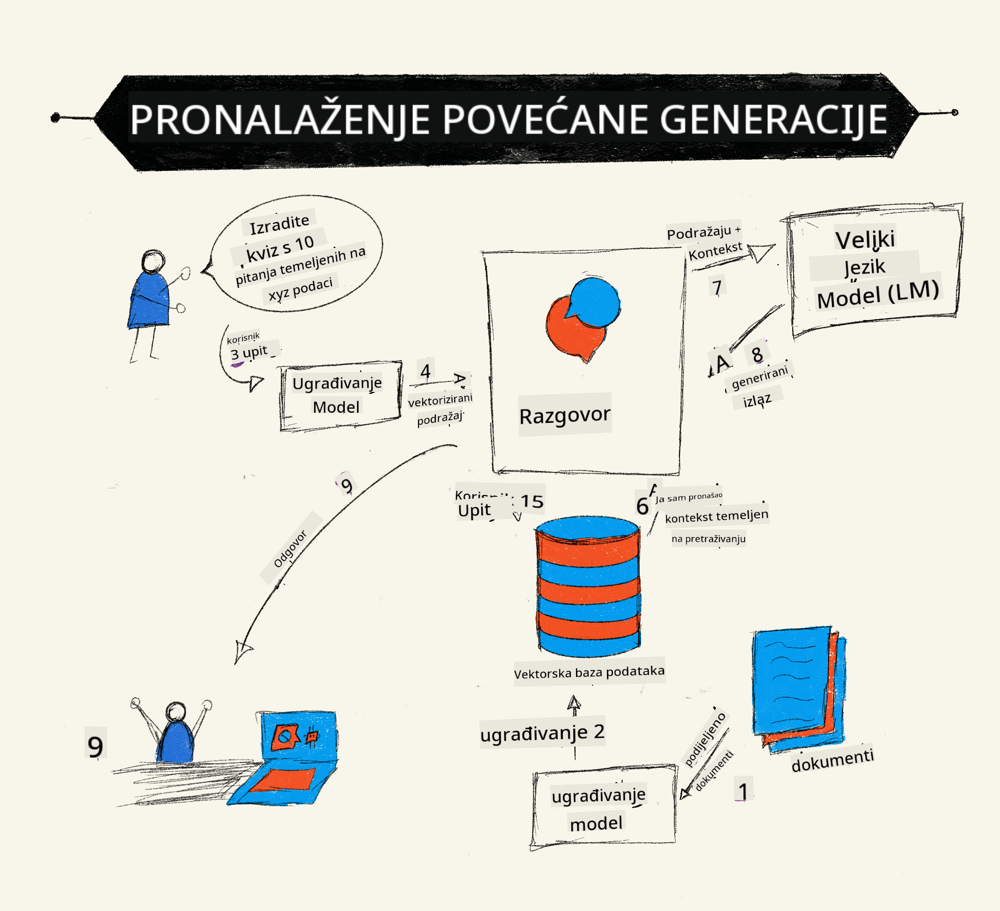
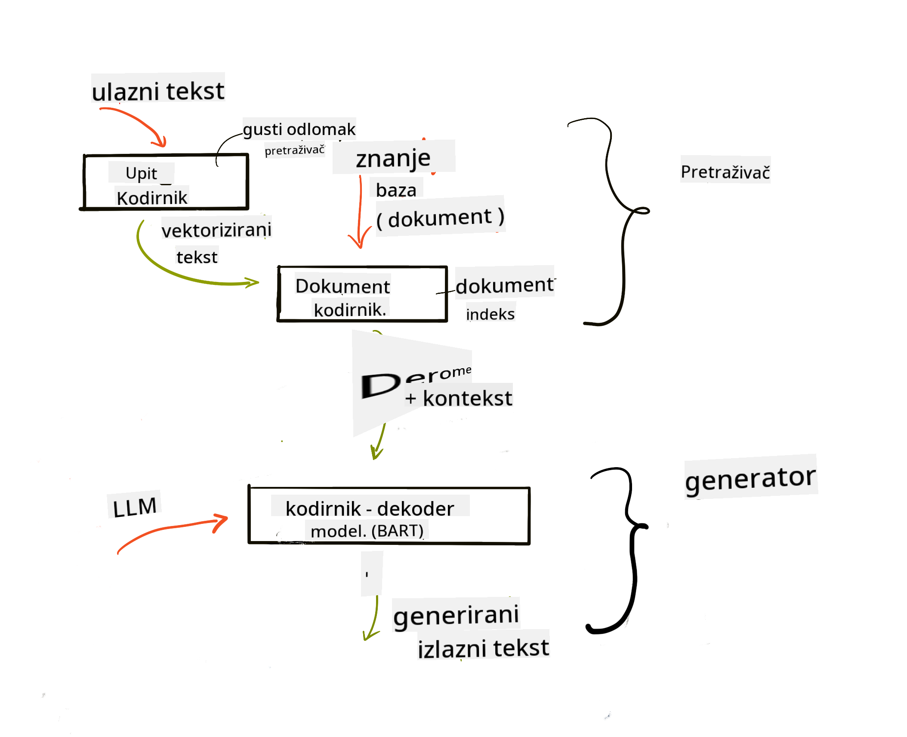
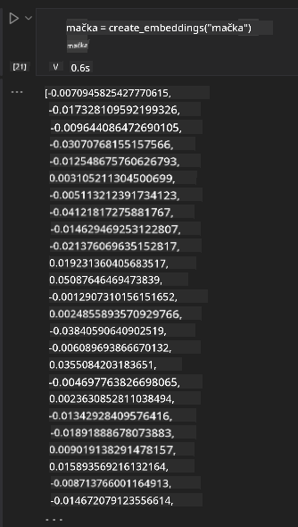

<!--
CO_OP_TRANSLATOR_METADATA:
{
  "original_hash": "e2861bbca91c0567ef32bc77fe054f9e",
  "translation_date": "2025-07-09T16:21:33+00:00",
  "source_file": "15-rag-and-vector-databases/README.md",
  "language_code": "hr"
}
-->
# Retrieval Augmented Generation (RAG) i vektorske baze podataka

[](https://aka.ms/gen-ai-lesson15-gh?WT.mc_id=academic-105485-koreyst)

U lekciji o aplikacijama za pretraživanje, ukratko smo naučili kako integrirati vlastite podatke u Large Language Models (LLM). U ovoj lekciji ćemo dublje istražiti koncepte povezivanja vaših podataka u LLM aplikaciji, mehaniku procesa i metode pohrane podataka, uključujući i embeddings i tekst.

> **Video uskoro**

## Uvod

U ovoj lekciji ćemo obraditi sljedeće:

- Uvod u RAG, što je i zašto se koristi u AI (umjetnoj inteligenciji).

- Razumijevanje što su vektorske baze podataka i kako stvoriti jednu za našu aplikaciju.

- Praktični primjer kako integrirati RAG u aplikaciju.

## Ciljevi učenja

Nakon završetka ove lekcije, moći ćete:

- Objasniti važnost RAG-a u dohvaćanju i obradi podataka.

- Postaviti RAG aplikaciju i povezati svoje podatke s LLM-om.

- Učinkovito integrirati RAG i vektorske baze podataka u LLM aplikacije.

## Naš scenarij: unapređenje naših LLM-ova vlastitim podacima

Za ovu lekciju želimo dodati vlastite bilješke u edukacijski startup, što omogućuje chatbotu da dobije više informacija o različitim predmetima. Koristeći bilješke koje imamo, učenici će moći bolje učiti i razumjeti različite teme, što će im olakšati pripremu za ispite. Za kreiranje našeg scenarija koristit ćemo:

- `Azure OpenAI:` LLM koji ćemo koristiti za izradu chatbota

- `AI for beginners' lesson on Neural Networks:` podaci na kojima ćemo temeljiti naš LLM

- `Azure AI Search` i `Azure Cosmos DB:` vektorska baza podataka za pohranu podataka i kreiranje indeksa za pretraživanje

Korisnici će moći stvarati kvizove za vježbu iz svojih bilješki, kartice za ponavljanje i sažetke u pregledne prikaze. Za početak, pogledajmo što je RAG i kako funkcionira:

## Retrieval Augmented Generation (RAG)

Chatbot pokretan LLM-om obrađuje korisničke upite kako bi generirao odgovore. Dizajniran je da bude interaktivan i komunicira s korisnicima o širokom spektru tema. Međutim, njegovi odgovori ograničeni su na kontekst koji mu je dan i na osnovne podatke na kojima je treniran. Na primjer, GPT-4 ima cutoff znanja do rujna 2021., što znači da nema informacije o događajima nakon tog razdoblja. Osim toga, podaci korišteni za treniranje LLM-ova ne uključuju povjerljive informacije poput osobnih bilješki ili priručnika za proizvode tvrtke.

### Kako RAG (Retrieval Augmented Generation) funkcionira



Pretpostavimo da želite implementirati chatbota koji stvara kvizove iz vaših bilješki, trebat će vam veza s bazom znanja. Tu RAG dolazi kao rješenje. RAG radi na sljedeći način:

- **Baza znanja:** Prije dohvaćanja, dokumenti se moraju unijeti i prethodno obraditi, obično razbijanjem velikih dokumenata na manje dijelove, pretvaranjem u tekstualne embeddings i pohranom u bazu podataka.

- **Korisnički upit:** korisnik postavlja pitanje

- **Dohvaćanje:** Kada korisnik postavi pitanje, embedding model pronalazi relevantne informacije iz baze znanja kako bi pružio dodatni kontekst koji će se uključiti u upit.

- **Augmentirana generacija:** LLM poboljšava svoj odgovor na temelju dohvaćenih podataka. To omogućuje da odgovor nije samo baziran na prethodno treniranim podacima, već i na relevantnim informacijama iz dodanog konteksta. Dohvaćeni podaci koriste se za obogaćivanje odgovora LLM-a. LLM zatim vraća odgovor na korisnički upit.



Arhitektura RAG-a implementirana je pomoću transformera koji se sastoje od dva dijela: enkodera i dekodera. Na primjer, kada korisnik postavi pitanje, ulazni tekst se 'enkodira' u vektore koji hvataju značenje riječi, a ti se vektori 'dekodiraju' u indeks dokumenata i generira se novi tekst na temelju korisničkog upita. LLM koristi model enkoder-dekoder za generiranje izlaza.

Dvije su pristupa implementaciji RAG-a prema predloženom radu: [Retrieval-Augmented Generation for Knowledge intensive NLP Tasks](https://arxiv.org/pdf/2005.11401.pdf?WT.mc_id=academic-105485-koreyst):

- **_RAG-Sequence_** koristi dohvaćene dokumente za predviđanje najboljeg mogućeg odgovora na korisnički upit

- **RAG-Token** koristi dokumente za generiranje sljedećeg tokena, zatim ih dohvaća za odgovor na korisnički upit

### Zašto koristiti RAG?

- **Bogatstvo informacija:** osigurava da su tekstualni odgovori ažurni i aktualni. Time se poboljšava izvedba na zadacima specifičnim za određeno područje pristupom internoj bazi znanja.

- Smanjuje izmišljanje podataka korištenjem **provjerljivih podataka** iz baze znanja za pružanje konteksta korisničkim upitima.

- **Isplativo je** jer je ekonomičnije od finog podešavanja LLM-a.

## Kreiranje baze znanja

Naša aplikacija temelji se na osobnim podacima, tj. lekciji o neuronskim mrežama iz kurikuluma AI For Beginners.

### Vektorske baze podataka

Vektorska baza podataka, za razliku od tradicionalnih baza, je specijalizirana baza dizajnirana za pohranu, upravljanje i pretraživanje ugrađenih vektora. Pohranjuje numeričke prikaze dokumenata. Razbijanje podataka u numeričke embeddings olakšava našem AI sustavu razumijevanje i obradu podataka.

Embeddings pohranjujemo u vektorske baze podataka jer LLM-ovi imaju ograničenje broja tokena koje mogu primiti kao ulaz. Kako ne možemo proslijediti cijele embeddings LLM-u, moramo ih razbiti na dijelove, a kada korisnik postavi pitanje, vraćaju se embeddings najbliži pitanju zajedno s upitom. Razbijanje na dijelove također smanjuje troškove vezane uz broj tokena koji se šalju LLM-u.

Neke popularne vektorske baze podataka uključuju Azure Cosmos DB, Clarifyai, Pinecone, Chromadb, ScaNN, Qdrant i DeepLake. Možete kreirati Azure Cosmos DB model koristeći Azure CLI s naredbom:

```bash
az login
az group create -n <resource-group-name> -l <location>
az cosmosdb create -n <cosmos-db-name> -r <resource-group-name>
az cosmosdb list-keys -n <cosmos-db-name> -g <resource-group-name>
```

### Od teksta do embeddings

Prije nego što pohranimo podatke, moramo ih pretvoriti u vektorske embeddings. Ako radite s velikim dokumentima ili dugim tekstovima, možete ih razbiti na dijelove prema očekivanim upitima. Razbijanje može biti na razini rečenice ili paragrafa. Budući da razbijanje izvlači značenje iz riječi oko njih, možete dodati i dodatni kontekst dijelu, na primjer, naslov dokumenta ili neki tekst prije ili poslije dijela. Podatke možete razbiti na sljedeći način:

```python
def split_text(text, max_length, min_length):
    words = text.split()
    chunks = []
    current_chunk = []

    for word in words:
        current_chunk.append(word)
        if len(' '.join(current_chunk)) < max_length and len(' '.join(current_chunk)) > min_length:
            chunks.append(' '.join(current_chunk))
            current_chunk = []

    # If the last chunk didn't reach the minimum length, add it anyway
    if current_chunk:
        chunks.append(' '.join(current_chunk))

    return chunks
```

Nakon razbijanja, tekst možemo ugraditi koristeći različite modele za embeddings. Neki modeli koje možete koristiti su: word2vec, ada-002 od OpenAI, Azure Computer Vision i mnogi drugi. Izbor modela ovisi o jezicima koje koristite, vrsti sadržaja (tekst/slike/audio), veličini ulaza koji može kodirati i duljini izlaza embeddingsa.

Primjer ugrađenog teksta korištenjem OpenAI modela `text-embedding-ada-002` je:


## Dohvaćanje i vektorsko pretraživanje

Kada korisnik postavi pitanje, retriver ga pretvara u vektor koristeći query encoder, zatim pretražuje indeks dokumenata za relevantne vektore povezane s upitom. Nakon toga, ulazni vektor i vektori dokumenata pretvaraju se u tekst i prosljeđuju LLM-u.

### Dohvaćanje

Dohvaćanje se događa kada sustav brzo pronalazi dokumente iz indeksa koji zadovoljavaju kriterije pretraživanja. Cilj retrivera je pronaći dokumente koji će se koristiti za pružanje konteksta i povezivanje LLM-a s vašim podacima.

Postoji nekoliko načina za pretraživanje u našoj bazi podataka, kao što su:

- **Pretraživanje po ključnim riječima** - koristi se za tekstualna pretraživanja

- **Semantičko pretraživanje** - koristi semantičko značenje riječi

- **Vektorsko pretraživanje** - pretvara dokumente iz teksta u vektorske prikaze koristeći modele za embeddings. Dohvaćanje se vrši upitom dokumenata čiji su vektorski prikazi najbliži korisničkom pitanju.

- **Hibridno** - kombinacija pretraživanja po ključnim riječima i vektorskog pretraživanja.

Izazov kod dohvaćanja nastaje kada u bazi nema sličnog odgovora na upit, tada sustav vraća najbolje moguće informacije, no možete koristiti taktike poput postavljanja maksimalne udaljenosti za relevantnost ili koristiti hibridno pretraživanje koje kombinira ključne riječi i vektorsko pretraživanje. U ovoj lekciji koristit ćemo hibridno pretraživanje, kombinaciju vektorskog i pretraživanja po ključnim riječima. Podatke ćemo pohraniti u dataframe s kolonama koje sadrže dijelove teksta i embeddings.

### Vektorska sličnost

Retriver će pretraživati bazu znanja za embeddings koji su blizu jedan drugome, najbliži susjed, jer su to slični tekstovi. U scenariju kada korisnik postavi upit, on se prvo ugrađuje, a zatim se uspoređuje sa sličnim embeddingsima. Najčešća mjera za određivanje sličnosti vektora je kosinusna sličnost, koja se temelji na kutu između dva vektora.

Sličnost možemo mjeriti i drugim metodama poput Euklidske udaljenosti, koja je najkraća linija između krajeva vektora, ili skalarne produkcije koja mjeri zbroj proizvoda odgovarajućih elemenata dva vektora.

### Indeks pretraživanja

Prije dohvaćanja, potrebno je izgraditi indeks pretraživanja za bazu znanja. Indeks pohranjuje naše embeddings i može brzo dohvatiti najsličnije dijelove čak i u velikoj bazi podataka. Indeks možemo kreirati lokalno koristeći:

```python
from sklearn.neighbors import NearestNeighbors

embeddings = flattened_df['embeddings'].to_list()

# Create the search index
nbrs = NearestNeighbors(n_neighbors=5, algorithm='ball_tree').fit(embeddings)

# To query the index, you can use the kneighbors method
distances, indices = nbrs.kneighbors(embeddings)
```

### Ponovno rangiranje

Nakon što ste izvršili upit u bazu, možda ćete htjeti sortirati rezultate od najrelevantnijih. Reranking LLM koristi strojno učenje za poboljšanje relevantnosti rezultata pretraživanja tako da ih poredak postavi od najrelevantnijih. Koristeći Azure AI Search, reranking se automatski obavlja pomoću semantičkog rerankera. Primjer kako reranking funkcionira koristeći najbliže susjede:

```python
# Find the most similar documents
distances, indices = nbrs.kneighbors([query_vector])

index = []
# Print the most similar documents
for i in range(3):
    index = indices[0][i]
    for index in indices[0]:
        print(flattened_df['chunks'].iloc[index])
        print(flattened_df['path'].iloc[index])
        print(flattened_df['distances'].iloc[index])
    else:
        print(f"Index {index} not found in DataFrame")
```

## Sve zajedno

Zadnji korak je dodati naš LLM u cijelu priču kako bismo mogli dobiti odgovore koji su povezani s našim podacima. Možemo ga implementirati na sljedeći način:

```python
user_input = "what is a perceptron?"

def chatbot(user_input):
    # Convert the question to a query vector
    query_vector = create_embeddings(user_input)

    # Find the most similar documents
    distances, indices = nbrs.kneighbors([query_vector])

    # add documents to query  to provide context
    history = []
    for index in indices[0]:
        history.append(flattened_df['chunks'].iloc[index])

    # combine the history and the user input
    history.append(user_input)

    # create a message object
    messages=[
        {"role": "system", "content": "You are an AI assistant that helps with AI questions."},
        {"role": "user", "content": history[-1]}
    ]

    # use chat completion to generate a response
    response = openai.chat.completions.create(
        model="gpt-4",
        temperature=0.7,
        max_tokens=800,
        messages=messages
    )

    return response.choices[0].message

chatbot(user_input)
```

## Evaluacija naše aplikacije

### Mjerne vrijednosti evaluacije

- Kvaliteta odgovora: osigurati da zvuče prirodno, tečno i ljudski

- Povezanost podataka: procjena je li odgovor došao iz dostavljenih dokumenata

- Relevantnost: procjena podudara li se odgovor i odnosi li se na postavljeno pitanje

- Tečnost - da li odgovor gramatički ima smisla

## Primjeri upotrebe RAG-a i vektorskih baza podataka

Postoji mnogo različitih primjena gdje pozivi funkcija mogu poboljšati vašu aplikaciju, kao što su:

- Pitanja i odgovori: povezivanje podataka vaše tvrtke s chatom koji zaposlenici mogu koristiti za postavljanje pitanja.

- Sustavi preporuka: gdje možete kreirati sustav koji pronalazi najsličnije vrijednosti, npr. filmove, restorane i slično.

- Chatbot usluge: možete pohraniti povijest razgovora i personalizirati konverzaciju na temelju korisničkih podataka.

- Pretraživanje slika na temelju vektorskih embeddings, korisno za prepoznavanje slika i otkrivanje anomalija.

## Sažetak

Obradili smo osnovna područja RAG-a, od dodavanja podataka u aplikaciju, korisničkog upita do izlaza. Za jednostavniju izradu RAG-a možete koristiti okvire poput Semantic Kernel, Langchain ili Autogen.

## Zadatak

Za nastavak učenja Retrieval Augmented Generation (RAG) možete izgraditi:

- Front-end aplikacije koristeći okvir po vašem izboru

- Iskoristiti neki od okvira, LangChain ili Semantic Kernel, i ponovno izraditi svoju aplikaciju.

Čestitamo na završetku lekcije 👏.

## Učenje ne prestaje ovdje, nastavite putovanje

Nakon završetka ove lekcije, pogledajte našu [Generative AI Learning kolekciju](https://aka.ms/genai-collection?WT.mc_id=academic-105485-koreyst) i nastavite podizati svoje znanje o Generativnoj AI!

**Odricanje od odgovornosti**:  
Ovaj dokument je preveden korištenjem AI usluge za prevođenje [Co-op Translator](https://github.com/Azure/co-op-translator). Iako težimo točnosti, imajte na umu da automatski prijevodi mogu sadržavati pogreške ili netočnosti. Izvorni dokument na izvornom jeziku treba smatrati službenim i autoritativnim izvorom. Za kritične informacije preporučuje se profesionalni ljudski prijevod. Ne snosimo odgovornost za bilo kakva nesporazuma ili pogrešna tumačenja koja proizlaze iz korištenja ovog prijevoda.