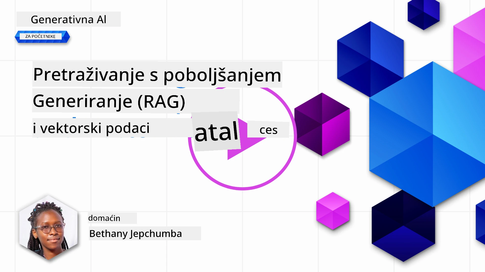
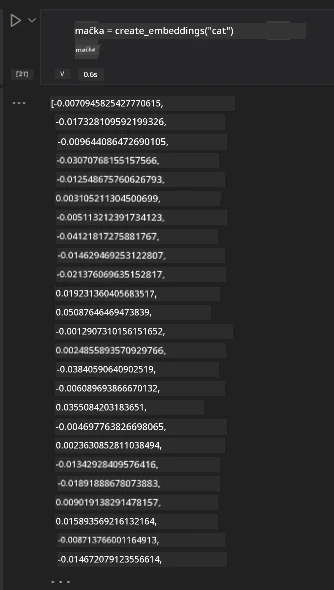

# Retrieval Augmented Generation (RAG) i Vektorske Baze Podataka

[](https://youtu.be/4l8zhHUBeyI?si=BmvDmL1fnHtgQYkL)

U lekciji o aplikacijama za pretraživanje, ukratko smo naučili kako integrirati vlastite podatke u velike jezične modele (LLM). U ovoj lekciji ćemo dublje istražiti koncepte utemeljivanja vaših podataka u vašoj LLM aplikaciji, mehaniku procesa i metode pohrane podataka, uključujući i ugrađene podatke i tekst.

> **Video uskoro**

## Uvod

U ovoj lekciji ćemo obraditi sljedeće:

- Uvod u RAG, što je i zašto se koristi u AI (umjetna inteligencija).

- Razumijevanje što su vektorske baze podataka i kreiranje jedne za našu aplikaciju.

- Praktični primjer kako integrirati RAG u aplikaciju.

## Ciljevi učenja

Nakon završetka ove lekcije, moći ćete:

- Objasniti značaj RAG-a u dohvaćanju i obradi podataka.

- Postaviti RAG aplikaciju i utemeljiti svoje podatke u LLM.

- Učinkovito integrirati RAG i Vektorske Baze Podataka u LLM aplikacije.

## Naš scenarij: unaprjeđenje naših LLM-ova vlastitim podacima

Za ovu lekciju želimo dodati vlastite bilješke u edukativni startup, što omogućuje chatbotu da dobije više informacija o različitim predmetima. Koristeći bilješke koje imamo, učenici će moći bolje učiti i razumjeti različite teme, olakšavajući pritom pripremu za ispite. Za izradu našeg scenarija koristit ćemo:

- `Azure OpenAI:` LLM koji ćemo koristiti za stvaranje našeg chatbota

- `Lekcija AI za početnike o neuronskim mrežama:` to će biti podaci na kojima utemeljujemo naš LLM

- `Azure AI Search` i `Azure Cosmos DB:` vektorska baza podataka za pohranu naših podataka i kreiranje indeksa pretraživanja

Korisnici će moći kreirati vježbovne kvizove iz svojih bilješki, kartice za ponavljanje i sažetke u kratkim pregledima. Za početak, pogledajmo što je RAG i kako funkcionira:

## Retrieval Augmented Generation (RAG)

Chatbot pokretan LLM-om obrađuje korisničke upite za generiranje odgovora. Dizajniran je da bude interaktivan i uključuje se u razgovore s korisnicima o širokom rasponu tema. Međutim, njegovi su odgovori ograničeni na kontekst koji mu je dostavljen i temeljne podatke za učenje. Na primjer, GPT-4 ima datum rezanja znanja u rujnu 2021., što znači da ne zna za događaje koji su se dogodili nakon tog datuma. Osim toga, podaci korišteni za treniranje LLM-ova ne uključuju povjerljive informacije poput osobnih bilješki ili uredskih priručnika.

### Kako RAG (Retrieval Augmented Generation) funkcionira


Pretpostavimo da želite pokrenuti chatbota koji kreira kvizove iz vaših bilješki, trebat će vam veza s bazom znanja. Tu na scenu stupa RAG. RAG-ovi funkcioniraju na sljedeći način:

- **Baza znanja:** Prije dohvaćanja ti dokumenti trebaju biti uneseni i prethodno obrađeni, obično razbijeni na manje cjeline, pretvoreni u tekstualne ugradnje i pohranjeni u bazu podataka.

- **Korisnički upit:** korisnik postavlja pitanje

- **Dohvaćanje:** Kada korisnik postavi pitanje, model ugradnje dohvaća relevantne informacije iz naše baze znanja kako bi pružio više konteksta koji će se uključiti u upit.

- **Proširena Generacija:** LLM poboljšava svoj odgovor na temelju dohvaćenih podataka. Omogućuje da generirani odgovor ne bude samo na temelju prethodno treniranih podataka nego i relevantnih informacija iz dodanog konteksta. Dohvaćeni podaci koriste se za obogaćivanje odgovora LLM-a. LLM zatim vraća odgovor na korisničko pitanje.


Arhitektura RAG implementirana je korištenjem transformera koji se sastoje od dva dijela: kodera i dekodera. Na primjer, kada korisnik postavi pitanje, ulazni tekst se 'kodira' u vektore koji hvataju značenje riječi, a vektori se 'dekodiraju' u naš indeks dokumenata i generiraju novi tekst na temelju korisničkog upita. LLM koristi model kodera i dekodera za generiranje izlaza.

Dvije pristupa implementaciji RAG prema predloženom radu: [Retrieval-Augmented Generation for Knowledge intensive NLP (natural language processing software) Tasks](https://arxiv.org/pdf/2005.11401.pdf?WT.mc_id=academic-105485-koreyst) su:

- **_RAG-Sequence_** koristi dohvaćene dokumente za predviđanje najboljeg mogućeg odgovora na korisnički upit

- **RAG-Token** koristi dokumente za generiranje sljedećeg tokena, zatim ih dohvaća da odgovori na korisnički upit

### Zašto koristiti RAG?

- **Bogatstvo informacija:** osigurava da su tekstualni odgovori ažurni i aktualni. Time poboljšava izvedbu na zadacima specifičnim za domenu pristupanjem internom znanju baze.

- Smanjuje izmišljanje korištenjem **provjerljivih podataka** u bazi znanja za pružanje konteksta korisničkim upitima.

- **Isplativ je** jer je ekonomičniji u usporedbi s finim podešavanjem LLM-a

## Kreiranje baze znanja

Naša je aplikacija temeljena na našim osobnim podacima, tj. lekciji o neuronskim mrežama na kurikulumu AI za početnike.

### Vektorske baze podataka

Vektorska baza podataka, za razliku od tradicionalnih baza podataka, je specijalizirana baza dizajnirana za pohranu, upravljanje i pretraživanje ugrađenih vektora. Pohranjuje numeričke prikaze dokumenata. Razbijanje podataka u numeričke ugradnje olakšava našem AI sustavu razumijevanje i obradu podataka.

Ugrađene podatke pohranjujemo u vektorske baze podataka jer LLM-ovi imaju ograničenje broja tokena koje primaju kao ulaz. Kako ne možete poslati cijele ugradbe u LLM, morat ćemo ih razbiti u cjeline, a kada korisnik postavi pitanje, vraćaju se najviše povezane ugradbe zajedno s upitom. Razbijanje također smanjuje troškove broja tokena poslanih kroz LLM.

Neki od popularnih vektorskih baza podataka su Azure Cosmos DB, Clarifyai, Pinecone, Chromadb, ScaNN, Qdrant i DeepLake. Možete kreirati model Azure Cosmos DB koristeći Azure CLI s ovom naredbom:

```bash
az login
az group create -n <resource-group-name> -l <location>
az cosmosdb create -n <cosmos-db-name> -r <resource-group-name>
az cosmosdb list-keys -n <cosmos-db-name> -g <resource-group-name>
```


### Od teksta do ugradnji

Prije nego što pohranimo naše podatke, moramo ih pretvoriti u vektorske ugradnje prije pohrane u bazu podataka. Ako radite s velikim dokumentima ili dugačkim tekstovima, možete ih razbiti na dijelove prema očekivanim upitima. Razbijanje se može napraviti na razini rečenica ili paragrafa. Budući da razbijanje izvlači značenja iz riječi oko njih, možete dodati dodatni kontekst u dio, na primjer, dodavanjem naslova dokumenta ili uključivanjem nekog teksta prije ili poslije dijela. Podatke možete razbiti na sljedeći način:

```python
def split_text(text, max_length, min_length):
    words = text.split()
    chunks = []
    current_chunk = []

    for word in words:
        current_chunk.append(word)
        if len(' '.join(current_chunk)) < max_length and len(' '.join(current_chunk)) > min_length:
            chunks.append(' '.join(current_chunk))
            current_chunk = []

    # Ako zadnji dio nije dosegnuo minimalnu duljinu, dodajte ga ipak
    if current_chunk:
        chunks.append(' '.join(current_chunk))

    return chunks
```


Nakon razbijanja možemo ugrađivati tekst koristeći različite modele ugradnje. Neki od modela koje možete koristiti su: word2vec, ada-002 od OpenAI-ja, Azure Computer Vision i mnogi drugi. Izbor modela ovisi o jezicima koje koristite, tipu sadržaja koji se kodira (tekst/slike/zvuk), veličini ulaza koju može kodirati i duljini izlazne ugradnje.

Primjer ugrađenog teksta pomoću OpenAI modela `text-embedding-ada-002` je:


## Dohvaćanje i Vektorsko Pretraživanje

Kad korisnik postavi pitanje, retriver ga pretvara u vektor pomoću enkodera upita, zatim pretražuje naš indeks dokumenata za relevantne vektore u dokumentu vezane uz ulazni upit. Nakon toga, konvertira i ulazni i dokumentarne vektore u tekst i prosljeđuje ih LLM-u.

### Dohvaćanje

Dohvaćanje se događa kada sustav pokušava brzo pronaći dokumente iz indeksa koji zadovoljavaju kriterije pretraživanja. Cilj retrivera je dobiti dokumente koji će se koristiti za pružanje konteksta i utemeljivanje LLM-a na vašim podacima.

Postoji nekoliko načina za izvršenje pretraživanja unutar naše baze podataka kao što su:

- **Pretraživanje ključnih riječi** - koristi se za tekstualna pretraživanja

- **Vektorsko pretraživanje** - pretvara dokumente iz teksta u vektorske prikaze koristeći modele ugradnje, dopuštajući **semantičko pretraživanje** koristeći značenje riječi. Dohvaćanje se vrši upitivanjem dokumenata čiji su vektorski prikazi najbliži korisničkom pitanju.

- **Hibridno** - kombinacija pretraživanja ključnih riječi i vektorskog pretraživanja.

Izazov u dohvatu nastaje kada u bazi podataka nema sličnog odgovora na upit, tada sustav vraća najbolje moguće informacije. Međutim, možete koristiti taktike kao što su postavljanje maksimalne udaljenosti za relevantnost ili koristiti hibridno pretraživanje koje kombinira i ključne riječi i vektorsko pretraživanje. U ovoj lekciji koristit ćemo hibridno pretraživanje, kombinaciju oba načina pretraživanja. Pohranit ćemo naše podatke u tablicu s stupcima koji sadrže dijelove i ugradnje.

### Sličnost vektora

Retriver će pretraživati u bazi znanja za ugradnjama koje su blizu jedna drugoj, najbližim susjedom, jer su tekstovi slični. U scenariju korisničkog upita, upit se prvo ugrađuje zatim uspoređuje sličnim ugradnjama. Uobičajena mjera koja se koristi za određivanje koliko su različiti vektori slični je kosinusna sličnost, koja je zasnovana na kutu između dva vektora.

Sličnost možemo mjeriti i drugim alternativama kao što su Euklidska udaljenost, što je pravocrtna udaljenost između krajeva vektora, i skalarni produkt koji mjeri zbroj proizvoda odgovarajućih elemenata dva vektora.

### Indeks pretraživanja

Prilikom dohvaćanja podataka, potrebno je najprije izgraditi indeks pretraživanja za bazu znanja. Indeks će pohraniti naše ugradnje i može brzo dohvatiti najsličnije dijelove čak i u velikoj bazi. Indeks možemo napraviti lokalno koristeći:

```python
from sklearn.neighbors import NearestNeighbors

embeddings = flattened_df['embeddings'].to_list()

# Kreirajte indeks pretraživanja
nbrs = NearestNeighbors(n_neighbors=5, algorithm='ball_tree').fit(embeddings)

# Za upit indeksa možete koristiti metodu kneighbors
distances, indices = nbrs.kneighbors(embeddings)
```


### Ponovno rangiranje

Nakon što upitamo bazu podataka, možda će biti potrebno sortirati rezultate od najrelevantnijih. LLM za ponovno rangiranje koristi strojno učenje za poboljšanje relevantnosti rezultata pretraživanja tako da ih sortira po stupnju relevantnosti. Koristeći Azure AI Search, ponovno rangiranje se automatski izvršava pomoću semantičkog rerankera. Primjer kako ponovno rangiranje funkcionira pomoću najbližih susjeda:

```python
# Pronađi najsličnije dokumente
distances, indices = nbrs.kneighbors([query_vector])

index = []
# Ispiši najsličnije dokumente
for i in range(3):
    index = indices[0][i]
    for index in indices[0]:
        print(flattened_df['chunks'].iloc[index])
        print(flattened_df['path'].iloc[index])
        print(flattened_df['distances'].iloc[index])
    else:
        print(f"Index {index} not found in DataFrame")
```


## Spojimo sve zajedno

Zadnji korak je dodati naš LLM u proces kako bismo mogli dobivati odgovore utemeljene na našim podacima. Možemo ga implementirati na sljedeći način:

```python
user_input = "what is a perceptron?"

def chatbot(user_input):
    # Pretvori pitanje u vektor upita
    query_vector = create_embeddings(user_input)

    # Pronađi najsličnije dokumente
    distances, indices = nbrs.kneighbors([query_vector])

    # dodaj dokumente u upit radi pružanja konteksta
    history = []
    for index in indices[0]:
        history.append(flattened_df['chunks'].iloc[index])

    # spoji povijest i korisnički unos
    history.append(user_input)

    # kreiraj objekt poruke
    messages=[
        {"role": "system", "content": "You are an AI assistant that helps with AI questions."},
        {"role": "user", "content": "\n\n".join(history) }
    ]

    # koristi chat dovršetak za generiranje odgovora
    response = openai.chat.completions.create(
        model="gpt-4",
        temperature=0.7,
        max_tokens=800,
        messages=messages
    )

    return response.choices[0].message

chatbot(user_input)
```


## Evaluacija naše aplikacije

### Mjerne vrijednosti evaluacije

- Kvaliteta danih odgovora, osiguravajući da zvuče prirodno, tečno i nalik čovjeku

- Utemeljenost podataka: procjena dolazi li odgovor iz dostavljenih dokumenata

- Relevancija: procjena da odgovor odgovara i povezan je sa postavljenim pitanjem

- Tečnost - promatranje da li odgovor gramatički ima smisla

## Primjene korištenja RAG (Retrieval Augmented Generation) i vektorskih baza podataka

Postoji mnogo različitih primjena gdje pozivi funkcijama mogu unaprijediti vašu aplikaciju poput:

- Pitanja i odgovori: utemeljivanje podataka vaše tvrtke u chat koji zaposlenici mogu koristiti za postavljanje pitanja.

- Sustavi preporuke: gdje možete kreirati sustav koji pronalazi najviše slične vrijednosti, npr. filmove, restorane i mnogo više.

- Usluge chatbota: možete pohraniti povijest razgovora i personalizirati konverzaciju na temelju korisničkih podataka.

- Pretraživanje slika na temelju vektorskih ugradnji, korisno kod prepoznavanja slika i otkrivanja anomalija.

## Sažetak

Obradili smo temeljna područja RAG-a od dodavanja naših podataka u aplikaciju, korisnički upit i izlaz. Za pojednostavljenje izrade RAG-a, možete koristiti okvire poput Semantičkog Kernel-a, Langchain-a ili Autogen-a.

## Zadatak

Za nastavak učenja o Retrieval Augmented Generation (RAG), možete izgraditi:

- Front-end za aplikaciju koristeći okvir po vašem izboru

- Iskoristiti okvir, bilo LangChain ili Semantic Kernel, i ponovno izgraditi svoju aplikaciju.

Čestitamo na završetku lekcije 👏.

## Učenje ne prestaje ovdje, nastavite putovanje

Nakon završetka lekcije, pogledajte našu [kolekciju za učenje Generative AI](https://aka.ms/genai-collection?WT.mc_id=academic-105485-koreyst) i nastavite unapređivati svoje znanje o Generative AI!

---

<!-- CO-OP TRANSLATOR DISCLAIMER START -->
**Izjava o odricanju od odgovornosti**:
Ovaj dokument preveden je pomoću AI prevodilačke usluge [Co-op Translator](https://github.com/Azure/co-op-translator). Iako težimo točnosti, imajte na umu da automatski prijevodi mogu sadržavati pogreške ili netočnosti. Izvorni dokument na izvornom jeziku treba smatrati službenim i autoritativnim izvorom. Za kritične informacije preporučuje se profesionalni ljudski prijevod. Ne snosimo odgovornost za bilo kakva nesporazuma ili kriva tumačenja koja proizlaze iz korištenja ovog prijevoda.
<!-- CO-OP TRANSLATOR DISCLAIMER END -->