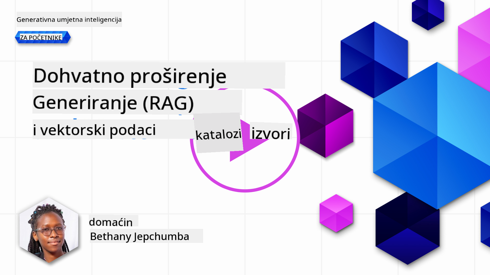
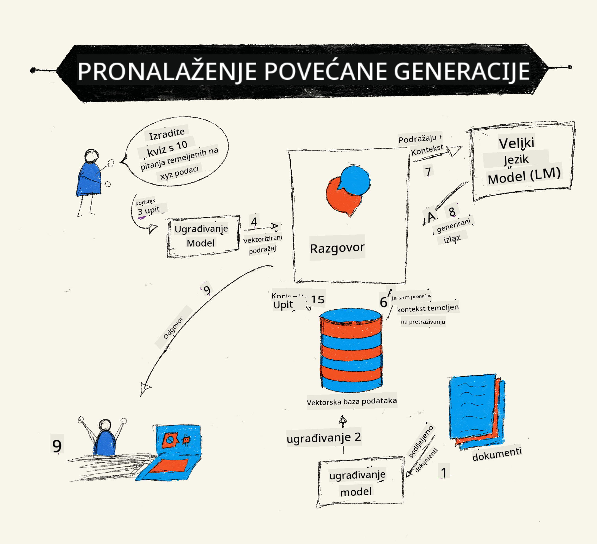
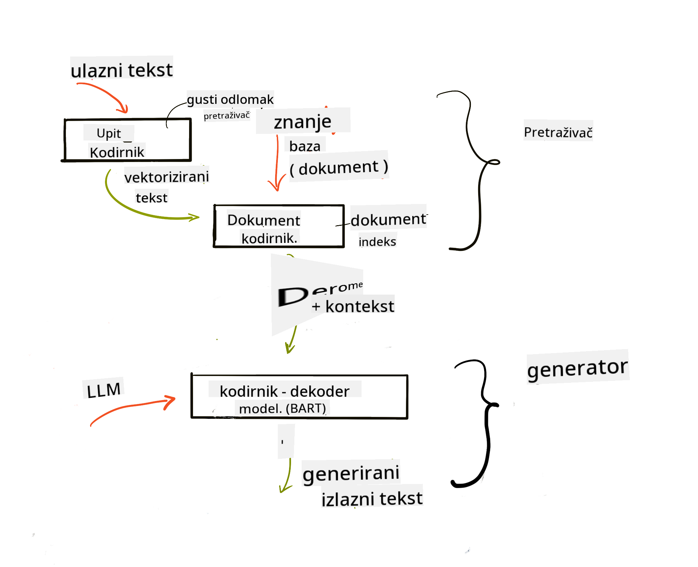
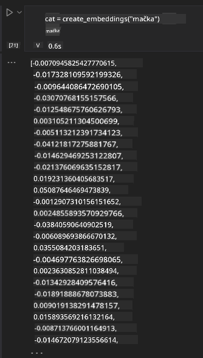

<!--
CO_OP_TRANSLATOR_METADATA:
{
  "original_hash": "e2861bbca91c0567ef32bc77fe054f9e",
  "translation_date": "2025-06-25T22:48:12+00:00",
  "source_file": "15-rag-and-vector-databases/README.md",
  "language_code": "hr"
}
-->
# Generacija uz potpomognuto dohvaćanje (RAG) i vektorske baze podataka

[](https://aka.ms/gen-ai-lesson15-gh?WT.mc_id=academic-105485-koreyst)

U lekciji o aplikacijama za pretraživanje, ukratko smo naučili kako integrirati vlastite podatke u velike jezične modele (LLMs). U ovoj lekciji, detaljnije ćemo istražiti koncepte uzemljenja vaših podataka u vašoj LLM aplikaciji, mehaniku procesa i metode za pohranu podataka, uključujući ugrađivanja i tekst.

> **Video dolazi uskoro**

## Uvod

U ovoj lekciji obradit ćemo sljedeće:

- Uvod u RAG, što je to i zašto se koristi u AI (umjetnoj inteligenciji).

- Razumijevanje što su vektorske baze podataka i stvaranje jedne za našu aplikaciju.

- Praktičan primjer kako integrirati RAG u aplikaciju.

## Ciljevi učenja

Nakon završetka ove lekcije, moći ćete:

- Objasniti značaj RAG-a u dohvaćanju i obradi podataka.

- Postaviti RAG aplikaciju i uzemljiti vaše podatke na LLM.

- Učinkovita integracija RAG-a i vektorskih baza podataka u LLM aplikacije.

## Naš scenarij: poboljšanje naših LLM-ova vlastitim podacima

Za ovu lekciju, želimo dodati vlastite bilješke u startup za obrazovanje, što omogućava chatbotu da dobije više informacija o različitim temama. Koristeći bilješke koje imamo, učenici će moći bolje učiti i razumjeti različite teme, što olakšava pripremu za ispite. Da bismo stvorili naš scenarij, koristit ćemo:

- `Azure OpenAI:` LLM koji ćemo koristiti za stvaranje našeg chatbota

- `AI for beginners' lesson on Neural Networks`: ovo će biti podaci na kojima ćemo uzemljiti naš LLM

- `Azure AI Search` i `Azure Cosmos DB:` vektorska baza podataka za pohranu naših podataka i stvaranje indeksa pretraživanja

Korisnici će moći stvarati kvizove za vježbu iz svojih bilješki, kartice za ponavljanje i sažeti ih u koncizne preglede. Da bismo započeli, pogledajmo što je RAG i kako radi:

## Generacija uz potpomognuto dohvaćanje (RAG)

Chatbot pogonjen LLM-om obrađuje korisničke upite kako bi generirao odgovore. Dizajniran je da bude interaktivan i komunicira s korisnicima na širokom spektru tema. Međutim, njegovi odgovori su ograničeni na kontekst koji mu je pružen i osnovne podatke o treniranju. Na primjer, GPT-4 ima ograničenje znanja do rujna 2021., što znači da nema znanja o događajima koji su se dogodili nakon tog razdoblja. Osim toga, podaci korišteni za treniranje LLM-ova isključuju povjerljive informacije kao što su osobne bilješke ili priručnik proizvoda tvrtke.

### Kako RAG-ovi (Generacija uz potpomognuto dohvaćanje) rade



Pretpostavimo da želite implementirati chatbot koji stvara kvizove iz vaših bilješki, trebat će vam veza s bazom znanja. Tu RAG dolazi u pomoć. RAG-ovi rade na sljedeći način:

- **Baza znanja:** Prije dohvaćanja, ovi dokumenti trebaju biti uneseni i unaprijed obrađeni, obično razbijanjem velikih dokumenata na manje dijelove, pretvaranjem u tekstualna ugrađivanja i pohranjivanjem u bazu podataka.

- **Korisnički upit:** korisnik postavlja pitanje

- **Dohvaćanje:** Kada korisnik postavi pitanje, model ugrađivanja dohvaća relevantne informacije iz naše baze znanja kako bi pružio više konteksta koji će biti uključen u upit.

- **Generacija uz potpomognuto dohvaćanje:** LLM poboljšava svoj odgovor na temelju dohvaćenih podataka. Omogućuje da odgovor generiran ne bude samo na temelju unaprijed treniranih podataka, već i relevantnih informacija iz dodanog konteksta. Dohvaćeni podaci se koriste za poboljšanje odgovora LLM-a. LLM zatim vraća odgovor na korisničko pitanje.



Arhitektura za RAG-ove se implementira korištenjem transformatora koji se sastoje od dva dijela: kodera i dekodera. Na primjer, kada korisnik postavi pitanje, ulazni tekst se 'kodira' u vektore koji bilježe značenje riječi, a vektori se 'dekodiraju' u naš indeks dokumenata i generiraju novi tekst na temelju korisničkog upita. LLM koristi i koder-dekoder model za generiranje izlaza.

Dva pristupa prilikom implementacije RAG-a prema predloženom radu: [Retrieval-Augmented Generation for Knowledge intensive NLP (natural language processing software) Tasks](https://arxiv.org/pdf/2005.11401.pdf?WT.mc_id=academic-105485-koreyst) su:

- **_RAG-Sequence_** koristi dohvaćene dokumente za predviđanje najboljeg mogućeg odgovora na korisnički upit

- **RAG-Token** koristi dokumente za generiranje sljedećeg tokena, a zatim ih dohvaća kako bi odgovorio na korisnički upit

### Zašto biste koristili RAG-ove?

- **Bogata informacija:** osigurava da su tekstualni odgovori ažurni i aktualni. Time se poboljšava izvedba na zadacima specifičnim za domenu pristupom internoj bazi znanja.

- Smanjuje fabrikaciju korištenjem **provjerljivih podataka** u bazi znanja kako bi pružio kontekst korisničkim upitima.

- **Ekonomičan je** jer su ekonomičniji u usporedbi s finim podešavanjem LLM-a

## Stvaranje baze znanja

Naša aplikacija temelji se na našim osobnim podacima, tj. lekciji o neuronskim mrežama u kurikulumu AI za početnike.

### Vektorske baze podataka

Vektorska baza podataka, za razliku od tradicionalnih baza podataka, je specijalizirana baza podataka dizajnirana za pohranu, upravljanje i pretraživanje ugrađenih vektora. Pohranjuje numeričke reprezentacije dokumenata. Razbijanje podataka na numerička ugrađivanja olakšava našem AI sustavu razumijevanje i obradu podataka.

Pohranjujemo naša ugrađivanja u vektorske baze podataka jer LLM-ovi imaju ograničenje broja tokena koje prihvaćaju kao ulaz. Budući da ne možete proslijediti cijela ugrađivanja LLM-u, trebat ćemo ih razbiti na dijelove, a kada korisnik postavi pitanje, ugrađivanja koja su najbliža pitanju bit će vraćena zajedno s upitom. Razbijanje također smanjuje troškove na broju tokena proslijeđenih kroz LLM.

Neke popularne vektorske baze podataka uključuju Azure Cosmos DB, Clarifyai, Pinecone, Chromadb, ScaNN, Qdrant i DeepLake. Možete stvoriti Azure Cosmos DB model koristeći Azure CLI s sljedećom naredbom:

```bash
az login
az group create -n <resource-group-name> -l <location>
az cosmosdb create -n <cosmos-db-name> -r <resource-group-name>
az cosmosdb list-keys -n <cosmos-db-name> -g <resource-group-name>
```

### Od teksta do ugrađivanja

Prije nego što pohranimo naše podatke, trebamo ih pretvoriti u vektorska ugrađivanja prije nego što ih pohranimo u bazu podataka. Ako radite s velikim dokumentima ili dugim tekstovima, možete ih razbiti na temelju očekivanih upita. Razbijanje se može izvršiti na razini rečenice ili na razini paragrafa. Budući da razbijanje izvlači značenja iz riječi oko njih, možete dodati neki drugi kontekst u dio, na primjer, dodavanjem naslova dokumenta ili uključivanjem nekog teksta prije ili nakon dijela. Možete razbiti podatke na sljedeći način:

```python
def split_text(text, max_length, min_length):
    words = text.split()
    chunks = []
    current_chunk = []

    for word in words:
        current_chunk.append(word)
        if len(' '.join(current_chunk)) < max_length and len(' '.join(current_chunk)) > min_length:
            chunks.append(' '.join(current_chunk))
            current_chunk = []

    # If the last chunk didn't reach the minimum length, add it anyway
    if current_chunk:
        chunks.append(' '.join(current_chunk))

    return chunks
```

Jednom kada su razbijeni, možemo zatim ugraditi naš tekst koristeći različite modele ugrađivanja. Neki modeli koje možete koristiti uključuju: word2vec, ada-002 od OpenAI, Azure Computer Vision i mnoge druge. Odabir modela koji ćete koristiti ovisi o jezicima koje koristite, vrsti sadržaja koji se kodira (tekst/slike/audio), veličini ulaza koji može kodirati i duljini izlaza ugrađivanja.

Primjer ugrađenog teksta korištenjem OpenAI-ovog modela `text-embedding-ada-002` je:


## Dohvaćanje i vektorsko pretraživanje

Kada korisnik postavi pitanje, dohvaćivač ga pretvara u vektor koristeći koder upita, zatim pretražuje naš indeks pretraživanja dokumenata za relevantne vektore u dokumentu koji su povezani s ulazom. Kada završi, pretvara i ulazni vektor i vektore dokumenata u tekst i prosljeđuje ga kroz LLM.

### Dohvaćanje

Dohvaćanje se događa kada sustav pokušava brzo pronaći dokumente iz indeksa koji zadovoljavaju kriterije pretraživanja. Cilj dohvaćivača je dobiti dokumente koji će se koristiti za pružanje konteksta i uzemljenje LLM-a na vašim podacima.

Postoji nekoliko načina za izvođenje pretraživanja unutar naše baze podataka kao što su:

- **Pretraživanje po ključnim riječima** - koristi se za pretraživanje teksta

- **Semantičko pretraživanje** - koristi semantičko značenje riječi

- **Vektorsko pretraživanje** - pretvara dokumente iz teksta u vektorske reprezentacije koristeći modele ugrađivanja. Dohvaćanje će se izvršiti pretraživanjem dokumenata čije su vektorske reprezentacije najbliže korisničkom pitanju.

- **Hibridno** - kombinacija pretraživanja po ključnim riječima i vektorskog pretraživanja.

Izazov s dohvaćanjem dolazi kada nema sličnog odgovora na upit u bazi podataka, sustav će tada vratiti najbolje informacije koje može dobiti, međutim, možete koristiti taktike kao što su postavljanje maksimalne udaljenosti za relevantnost ili korištenje hibridnog pretraživanja koje kombinira ključne riječi i vektorsko pretraživanje. U ovoj lekciji koristit ćemo hibridno pretraživanje, kombinaciju vektorskog i pretraživanja po ključnim riječima. Pohranit ćemo naše podatke u okvir podataka s stupcima koji sadrže dijelove kao i ugrađivanja.

### Vektorska sličnost

Dohvaćivač će pretraživati kroz bazu znanja za ugrađivanja koja su bliska, najbliži susjed, jer su to tekstovi koji su slični. U scenariju kada korisnik postavi upit, prvo se ugrađuje, a zatim se podudara s sličnim ugrađivanjima. Uobičajena mjera koja se koristi za pronalaženje koliko su različiti vektori slični je kosinusna sličnost koja se temelji na kutu između dva vektora.

Možemo mjeriti sličnost koristeći druge alternative kao što su Euklidska udaljenost koja je ravna crta između krajnjih točaka vektora i skalarni produkt koji mjeri zbroj proizvoda odgovarajućih elemenata dvaju vektora.

### Indeks pretraživanja

Prilikom dohvaćanja, trebat ćemo izgraditi indeks pretraživanja za našu bazu znanja prije nego što izvršimo pretraživanje. Indeks će pohraniti naša ugrađivanja i može brzo dohvatiti najsličnije dijelove čak i u velikoj bazi podataka. Možemo stvoriti naš indeks lokalno koristeći:

```python
from sklearn.neighbors import NearestNeighbors

embeddings = flattened_df['embeddings'].to_list()

# Create the search index
nbrs = NearestNeighbors(n_neighbors=5, algorithm='ball_tree').fit(embeddings)

# To query the index, you can use the kneighbors method
distances, indices = nbrs.kneighbors(embeddings)
```

### Ponovno rangiranje

Nakon što ste pretražili bazu podataka, možda ćete trebati sortirati rezultate od najrelevantnijih. LLM za ponovno rangiranje koristi strojno učenje za poboljšanje relevantnosti rezultata pretraživanja njihovim redoslijedom od najrelevantnijih. Korištenjem Azure AI Search, ponovno rangiranje se automatski obavlja za vas korištenjem semantičkog ponovnog rangiranja. Primjer kako ponovno rangiranje radi koristeći najbliže susjede:

```python
# Find the most similar documents
distances, indices = nbrs.kneighbors([query_vector])

index = []
# Print the most similar documents
for i in range(3):
    index = indices[0][i]
    for index in indices[0]:
        print(flattened_df['chunks'].iloc[index])
        print(flattened_df['path'].iloc[index])
        print(flattened_df['distances'].iloc[index])
    else:
        print(f"Index {index} not found in DataFrame")
```

## Spojimo sve zajedno

Posljednji korak je dodavanje našeg LLM-a u mješavinu kako bismo mogli dobiti odgovore koji su uzemljeni na našim podacima. Možemo to implementirati na sljedeći način:

```python
user_input = "what is a perceptron?"

def chatbot(user_input):
    # Convert the question to a query vector
    query_vector = create_embeddings(user_input)

    # Find the most similar documents
    distances, indices = nbrs.kneighbors([query_vector])

    # add documents to query  to provide context
    history = []
    for index in indices[0]:
        history.append(flattened_df['chunks'].iloc[index])

    # combine the history and the user input
    history.append(user_input)

    # create a message object
    messages=[
        {"role": "system", "content": "You are an AI assistant that helps with AI questions."},
        {"role": "user", "content": history[-1]}
    ]

    # use chat completion to generate a response
    response = openai.chat.completions.create(
        model="gpt-4",
        temperature=0.7,
        max_tokens=800,
        messages=messages
    )

    return response.choices[0].message

chatbot(user_input)
```

## Evaluacija naše aplikacije

### Metrike evaluacije

- Kvaliteta odgovora osiguravajući da zvuči prirodno, tečno i ljudski

- Utemeljenost podataka: procjena da li odgovor dolazi iz dostavljenih dokumenata

- Relevantnost: procjena da li odgovor odgovara i je povezan s postavljenim pitanjem

- Tečnost - da li odgovor ima smisla gramatički

## Primjeri korištenja RAG-a (Generacija uz potpomognuto dohvaćanje) i vektorskih baza podataka

Postoje mnogi različiti primjeri korištenja gdje pozivi funkcija mogu poboljšati vašu aplikaciju kao:

- Postavljanje pitanja i odgovora: uzemljenje podataka vaše tvrtke za chat koji mogu koristiti zaposlenici za postavljanje pitanja.

- Sustavi preporuka: gdje možete stvoriti sustav koji odgovara najsličnijim vrijednostima npr. filmovima, restoranima i mnogim drugima.

- Usluge chatbota: možete pohraniti povijest chata i personalizirati razgovor na temelju korisničkih podataka.

- Pretraživanje slika na temelju vektorskih ugrađivanja, korisno prilikom prepoznavanja slika i otkrivanja anomalija.

## Sažetak

Pokrijili smo temeljna područja RAG-a od dodavanja naših podataka u aplikaciju, korisničkog upita i izlaza. Kako bismo pojednostavili stvaranje RAG-a, možete koristiti okvire kao što su Semanti Kernel, Langchain ili Autogen.

## Zadatak

Kako biste nastavili svoje učenje o Generaciji uz potpomognuto dohvaćanje (RAG) možete izgraditi:

- Izgradite front-end za aplikaciju koristeći okvir po vašem izboru

- Iskoristite okvir, bilo LangChain ili Semantic Kernel, i ponovno kreirajte svoju aplikaciju.

Čestitamo na završetku lekcije 👏.

## Učenje ovdje ne prestaje, nastavite putovanje

Nakon završetka ove lekcije, pogledajte našu [Generativnu AI kolekciju za učenje](https://aka.ms/genai-collection?WT.mc_id=academic-105485-koreyst) kako biste nastavili nadograđivati svoje znanje o Generativnoj AI!

**Odricanje od odgovornosti**:  
Ovaj dokument je preveden korištenjem AI usluge prevođenja [Co-op Translator](https://github.com/Azure/co-op-translator). Iako težimo točnosti, imajte na umu da automatski prijevodi mogu sadržavati pogreške ili netočnosti. Izvorni dokument na izvornom jeziku treba smatrati autoritativnim izvorom. Za kritične informacije preporučuje se profesionalni ljudski prijevod. Ne snosimo odgovornost za bilo kakve nesporazume ili pogrešna tumačenja koja proizlaze iz korištenja ovog prijevoda.