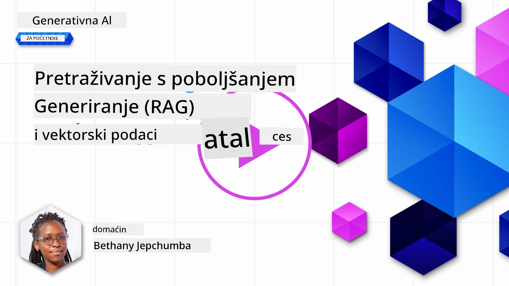
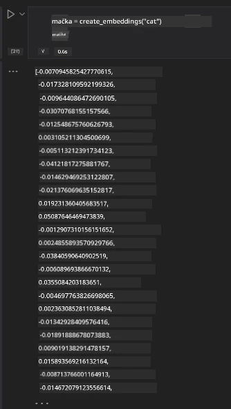

# Generiranje uz pomoć pretraživanja (RAG) i vektorske baze podataka

[](https://youtu.be/4l8zhHUBeyI?si=BmvDmL1fnHtgQYkL)

U lekciji o aplikacijama pretraživanja ukratko smo naučili kako integrirati vlastite podatke u velike jezične modele (LLM). U ovoj lekciji dublje ćemo istražiti koncepte utemeljenja vaših podataka u LLM aplikaciji, mehaniku procesa i metode pohrane podataka, uključujući i ugradnje i tekst.

> **Video uskoro**

## Uvod

U ovoj lekciji pokrit ćemo sljedeće:

- Uvod u RAG, što je i zašto se koristi u umjetnoj inteligenciji (AI).

- Razumijevanje što su vektorske baze podataka i kreiranje jedne za našu aplikaciju.

- Praktičan primjer kako integrirati RAG u aplikaciju.

## Ciljevi učenja

Nakon završetka ove lekcije moći ćete:

- Objasniti važnost RAG-a u dohvaćanju i obradi podataka.

- Postaviti RAG aplikaciju i utemeljiti vaše podatke na LLM

- Učinkovita integracija RAG-a i vektorskih baza podataka u LLM aplikacije.

## Naš scenarij: poboljšavanje naših LLM-ova vlastitim podacima

Za ovu lekciju želimo dodati vlastite bilješke u obrazovni startup, što omogućuje chatbotu da dobije više informacija o različitim predmetima. Koristeći bilješke koje imamo, učenici će moći bolje učiti i razumjeti različite teme, što će olakšati pripremu za ispite. Za naš scenarij koristit ćemo:

- `Azure OpenAI:` LLM koji ćemo koristiti za stvaranje našeg chatbota

- `Lekcija AI za početnike o neuronskim mrežama`: to će biti podaci na kojima temeljimo naš LLM

- `Azure AI Search` i `Azure Cosmos DB:` vektorska baza podataka za pohranu podataka i kreiranje indeksa pretraživanja

Korisnici će moći stvarati praktične kvizove iz svojih bilješki, kartice za ponavljanje i sažetke u koncizne prikaze. Za početak, pogledajmo što je RAG i kako funkcionira:

## Generiranje uz pomoć pretraživanja (RAG)

Chatbot pokretan LLM-om obrađuje korisničke upite za generiranje odgovora. Dizajniran je za interakciju i angažira se s korisnicima na širokom spektru tema. Međutim, njegovi su odgovori ograničeni na kontekst koji je dan i na temeljne podatke za obuku. Na primjer, GPT-4 ima datum završetka znanja u rujnu 2021., što znači da nema znanja o događajima nakon tog razdoblja. Osim toga, podaci korišteni za treniranje LLM-ova isključuju povjerljive informacije poput osobnih bilješki ili priručnika tvrtke.

### Kako RAG (Generiranje uz pomoć pretraživanja) radi


Pretpostavimo da želite implementirati chatbota koji stvara kvizove iz vaših bilješki, trebat će vam poveznica na bazu znanja. Tu na scenu stupa RAG. RAG radi na sljedeći način:

- **Baza znanja:** Prije dohvaćanja, ti dokumenti moraju biti uneseni i prethodno obrađeni, obično razbijanjem velikih dokumenata u manje dijelove, pretvorbom u tekstualne ugradnje i pohranom u bazu podataka.

- **Korisnički upit:** korisnik postavlja pitanje

- **Dohvaćanje:** Kad korisnik postavi pitanje, model ugradnje dohvaća relevantne informacije iz naše baze znanja kako bi pružio više konteksta koji će se integrirati u upit.

- **Augmentirano generiranje:** LLM poboljšava svoj odgovor na temelju dohvaćenih podataka. To omogućuje da generirani odgovor ne bude temeljeno samo na unaprijed naučenim podacima već i na relevantnim informacijama iz dodanog konteksta. Dohvaćeni podaci se koriste za povećanje kvalitete LLM-ovih odgovora. LLM zatim vraća odgovor na korisnikovo pitanje.


Arhitektura RAG-ova implementirana je pomoću transformatora koji se sastoje od dva dijela: enkodera i dekodera. Na primjer, kada korisnik postavi pitanje, ulazni tekst se 'enkodira' u vektore koji hvataju značenje riječi, a ti se vektori 'dekodiraju' u naš indeks dokumenata i generiraju novi tekst temeljen na korisničkom upitu. LLM koristi model enkoder-dekoder za generiranje izlaza.

Prema predloženom radu: [Retrieval-Augmented Generation for Knowledge intensive NLP (natural language processing software) Tasks](https://arxiv.org/pdf/2005.11401.pdf?WT.mc_id=academic-105485-koreyst) postoje dva pristupa implementacije RAG-a:

- **_RAG-Sequence_** koristi dohvaćene dokumente za predviđanje najboljeg mogućeg odgovora na korisnički upit

- **RAG-Token** koristi dokumente za generiranje sljedećeg tokena, a zatim dohvaća dokumente za odgovor na korisnički upit

### Zašto biste koristili RAG?

- **Bogatstvo informacija:** osigurava da su tekstualni odgovori ažurni i ažurni. Time poboljšava izvedbu na zadacima specifičnim za domena pristupanjem internoj bazi znanja.

- Smanjuje izmišljanje koristeći **provjerljive podatke** u bazi znanja za pružanje konteksta korisničkim upitima.

- **Isplativo je** jer su ekonomičniji u usporedbi s dodatnim podešavanjem LLM-a

## Kreiranje baze znanja

Naša je aplikacija bazirana na našim osobnim podacima, odnosno lekciji o neuronskim mrežama iz kurikuluma AI za početnike.

### Vektorske baze podataka

Vektorska baza podataka, za razliku od tradicionalnih baza, specijalizirana je baza dizajnirana za pohranu, upravljanje i pretraživanje ugrađenih vektora. Pohranjuje numeričke prikaze dokumenata. Razbijanje podataka na numeričke ugradnje olakšava našem AI sustavu razumijevanje i obradu podataka.

Svoje ugradnje pohranjujemo u vektorske baze podataka jer LLM-ovi imaju ograničenje broja tokena koje prihvaćaju kao ulaz. Budući da ne možete proslijediti cijele ugradnje LLM-u, morat ćemo ih razbiti u dijelove i kada korisnik postavi pitanje, vraćaju se najprikladnije ugradnje zajedno s upitom. Razbijanje na dijelove također smanjuje troškove broja tokena koje LLM obrađuje.

Neke popularne vektorske baze podataka uključuju Azure Cosmos DB, Clarifyai, Pinecone, Chromadb, ScaNN, Qdrant i DeepLake. Možete kreirati model Azure Cosmos DB koristeći Azure CLI s naredbom:

```bash
az login
az group create -n <resource-group-name> -l <location>
az cosmosdb create -n <cosmos-db-name> -r <resource-group-name>
az cosmosdb list-keys -n <cosmos-db-name> -g <resource-group-name>
```

### Od teksta do ugradnji (embeddings)

Prije nego što pohranimo naše podatke, morat ćemo ih pretvoriti u vektorske ugradnje prije pohrane u bazu podataka. Ako radite s velikim dokumentima ili dugim tekstovima, možete ih razbiti na dijelove prema očekivanim upitima. Razbijanje može biti na razini rečenice ili odlomka. Kako razbijanje izvlači značenja iz riječi oko njih, možete dodati još neki kontekst dijelu, na primjer, naslov dokumenta ili uključenje nekog teksta prije ili poslije dijela. Podatke možete razbiti na dijelove kao slijedi:

```python
def split_text(text, max_length, min_length):
    words = text.split()
    chunks = []
    current_chunk = []

    for word in words:
        current_chunk.append(word)
        if len(' '.join(current_chunk)) < max_length and len(' '.join(current_chunk)) > min_length:
            chunks.append(' '.join(current_chunk))
            current_chunk = []

    # Ako posljednji dio nije dostigao minimalnu duljinu, dodaj ga ipak
    if current_chunk:
        chunks.append(' '.join(current_chunk))

    return chunks
```

Nakon razbijanja, možemo zatim ugraditi tekst koristeći različite modele za ugradnju. Neki modeli koje možete koristiti su: word2vec, ada-002 od OpenAI, Azure Computer Vision i mnogi drugi. Odabir modela ovisit će o jezicima koje koristite, vrsti sadržaja koji kodira (tekst/slike/zvuk), veličini ulaza koji može kodirati i duljini izlaza ugradnje.

Primjer ugrađenog teksta pomoću OpenAI-jeva modela `text-embedding-ada-002` je:


## Dohvaćanje i vektorsko pretraživanje

Kada korisnik postavi pitanje, uređaj za dohvaćanje pretvara ga u vektor koristeći enkoder upita, zatim pretražuje naš indeks dokumenata za relevantne vektore u dokumentima povezane s ulazom. Nakon toga pretvara ulazni i dokumentarni vektor u tekst i prosljeđuje Ga LLM-u.

### Dohvaćanje

Dohvaćanje se događa kada sustav pokušava brzo pronaći dokumente iz indeksa koji zadovoljavaju kriterije pretraživanja. Cilj uređaja za dohvaćanje je dobiti dokumente koji će se koristiti za pružanje konteksta i utemeljenje LLM-a na vašim podacima.

Postoji nekoliko načina za pretraživanje u našoj bazi podataka, poput:

- **Pretraživanje ključnih riječi** - koristi se za tekstualna pretraživanja

- **Vektorsko pretraživanje** - pretvara dokumente iz teksta u vektorske prikaze korištenjem modela ugradnje, omogućujući **semantičko pretraživanje** koristeći značenje riječi. Dohvaćanje se vrši upitivanjem dokumenata čiji su vektorski prikazi najbliži korisničkom pitanju.

- **Hibridno** - kombinacija pretraživanja ključnih riječi i vektorskog pretraživanja.

Izazov u dohvaćanju nastaje kada nema sličnog odgovora u bazi podataka, sustav tada vraća najbolju moguću informaciju, ali možete koristiti taktike poput postavljanja maksimalne udaljenosti za relevantnost ili koristiti hibridno pretraživanje koje kombinira ključne riječi i vektorsko pretraživanje. U ovoj lekciji koristit ćemo hibridno pretraživanje, kombinaciju vektorskog i pretraživanja ključnih riječi. Pohranit ćemo podatke u dataframe s stupcima koji sadrže dijelove i ugradnje.

### Sličnost vektora

Uređaj za dohvaćanje pretražit će bazu znanja za ugradnje koje su blizu jedna drugoj, bližeg susjeda, jer su to slični tekstovi. U scenariju korisnik postavi upit, najprije se ugradi, zatim se uspoređuje sa sličnim ugradnjama. Česta mjera koja se koristi za određivanje sličnosti različitih vektora je kosinusna sličnost koja se temelji na kutu između dva vektora.

Mjeru sličnosti možemo koristiti i druge poput Euklidske udaljenosti koja je izravna linija između krajeva vektora i skalarni umnožak koji mjeri zbroj produkata odgovarajućih elemenata dvaju vektora.

### Indeks pretraživanja

Prije nego što obavimo dohvaćanje, potrebno je izgraditi indeks pretraživanja za našu bazu znanja. Indeks pohranjuje naše ugradnje i može brzo dohvatiti najsličnije dijelove čak i u velikoj bazi podataka. Indeks možemo kreirati lokalno koristeći:

```python
from sklearn.neighbors import NearestNeighbors

embeddings = flattened_df['embeddings'].to_list()

# Kreirajte pretraživački indeks
nbrs = NearestNeighbors(n_neighbors=5, algorithm='ball_tree').fit(embeddings)

# Za upit indeksa, možete koristiti metodu kneighbors
distances, indices = nbrs.kneighbors(embeddings)
```

### Re-rangiranje

Nakon što ste upitali bazu podataka, možda ćete trebati sortirati rezultate po relevantnosti. Re-rangirani LLM koristi strojno učenje da poboljša relevantnost rezultata pretraživanja tako da ih naslovi od najrelevantnijih. Koristeći Azure AI Search, re-rangiranje se automatski obavlja pomoću semantičkog re-rankera. Primjer kako re-rangiranje funkcionira koristeći najbliže susjede:

```python
# Pronađi najsličnije dokumente
distances, indices = nbrs.kneighbors([query_vector])

index = []
# Ispiši najsličnije dokumente
for i in range(3):
    index = indices[0][i]
    for index in indices[0]:
        print(flattened_df['chunks'].iloc[index])
        print(flattened_df['path'].iloc[index])
        print(flattened_df['distances'].iloc[index])
    else:
        print(f"Index {index} not found in DataFrame")
```

## Sve zajedno

Posljednji korak je dodavanje našeg LLM-a u cijelu proceduru kako bismo mogli dobiti odgovore utemeljene na našim podacima. Možemo to implementirati ovako:

```python
user_input = "what is a perceptron?"

def chatbot(user_input):
    # Pretvori pitanje u upitni vektor
    query_vector = create_embeddings(user_input)

    # Pronađi najsličnije dokumente
    distances, indices = nbrs.kneighbors([query_vector])

    # dodaj dokumente u upit za pružanje konteksta
    history = []
    for index in indices[0]:
        history.append(flattened_df['chunks'].iloc[index])

    # kombiniraj povijest i korisnički unos
    history.append(user_input)

    # napravi objekt poruke
    messages=[
        {"role": "system", "content": "You are an AI assistant that helps with AI questions."},
        {"role": "user", "content": "\n\n".join(history) }
    ]

    # koristi Responses API za generiranje odgovora
    response = client.responses.create(
        model="gpt-4o-mini",
        temperature=0.7,
        max_output_tokens=800,
        input=messages,
        store=False,
    )

    return response.output_text

chatbot(user_input)
```

## Procjena naše aplikacije

### Mjerne vrijednosti procjene

- Kvaliteta isporučenih odgovora osiguravajući da zvuče prirodno, tečno i humano

- Utemeljenost podataka: procjena je li odgovor došao iz isporučenih dokumenata

- Relevantnost: procjena odgovora je li podudaran ili povezan s postavljenim pitanjem

- Tečnost - daje li odgovor gramatički smisao

## Primjeri upotrebe RAG-a i vektorskih baza podataka

Postoje brojni primjeri gdje funkcijske pozive mogu poboljšati vašu aplikaciju poput:

- Pitanja i odgovori: utemeljite podatke tvrtke u chat koji zaposlenici mogu koristiti za postavljanje pitanja.

- Sustavi za preporuke: gdje se može kreirati sustav koji pronalazi najsličnije vrijednosti npr. filmove, restorane i slično.

- Usluge chatbotova: možete pohraniti povijest razgovora i personalizirati razgovor na temelju korisničkih podataka.

- Pretraživanje slika na temelju vektorskih ugradnji, korisno za prepoznavanje slika i detekciju anomalija.

## Sažetak

Pokrili smo osnovna područja RAG-a od dodavanja naših podataka u aplikaciju, korisničkog upita i rezultata. Za pojednostavljenje izrade RAG-a možete koristiti okvire kao što su Semantic Kernel, Langchain ili Autogen.

## Zadatak

Za nastavak učenja o Generiranju uz pomoć pretraživanja (RAG) možete izgraditi:

- Izraditi korisničko sučelje za aplikaciju koristeći okvir po vašem izboru

- Iskoristiti neki okvir, bilo LangChain ili Semantic Kernel, i ponovno izgraditi vašu aplikaciju.

Čestitamo na završetku lekcije 👏.

## Učenje ne prestaje ovdje, nastavite putovanje

Nakon završetka ove lekcije, pogledajte našu [kolekciju za učenje Generativne AI](https://aka.ms/genai-collection?WT.mc_id=academic-105485-koreyst) i nastavite unapređivati svoje znanje o Generativnoj AI!

---

<!-- CO-OP TRANSLATOR DISCLAIMER START -->
**Napomena**:
Ovaj dokument je preveden korištenjem AI prevoditeljskog servisa [Co-op Translator](https://github.com/Azure/co-op-translator). Iako težimo točnosti, imajte na umu da automatski prijevodi mogu sadržavati greške ili netočnosti. Izvorni dokument na izvornom jeziku treba smatrati autoritativnim izvorom. Za važne informacije preporuča se profesionalni ljudski prijevod. Nismo odgovorni za bilo kakva nesporazumevanja ili pogrešne interpretacije koje proizlaze iz korištenja ovog prijevoda.
<!-- CO-OP TRANSLATOR DISCLAIMER END -->