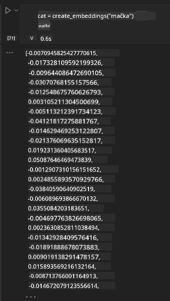

<!--
CO_OP_TRANSLATOR_METADATA:
{
  "original_hash": "b4b0266fbadbba7ded891b6485adc66d",
  "translation_date": "2025-10-18T01:31:59+00:00",
  "source_file": "15-rag-and-vector-databases/README.md",
  "language_code": "hr"
}
-->
# Generiranje uz pomoć pretraživanja (RAG) i vektorske baze podataka

[](https://youtu.be/4l8zhHUBeyI?si=BmvDmL1fnHtgQYkL)

U lekciji o aplikacijama za pretraživanje, ukratko smo naučili kako integrirati vlastite podatke u modele velikih jezika (LLM). U ovoj lekciji ćemo detaljnije istražiti koncepte povezivanja vaših podataka s aplikacijom LLM, mehanizme tog procesa i metode za pohranu podataka, uključujući i ugrađene podatke i tekst.

> **Video uskoro dolazi**

## Uvod

U ovoj lekciji obradit ćemo sljedeće:

- Uvod u RAG, što je to i zašto se koristi u umjetnoj inteligenciji (AI).

- Razumijevanje što su vektorske baze podataka i kako ih kreirati za našu aplikaciju.

- Praktičan primjer kako integrirati RAG u aplikaciju.

## Ciljevi učenja

Nakon završetka ove lekcije, moći ćete:

- Objasniti značaj RAG-a u pretraživanju i obradi podataka.

- Postaviti RAG aplikaciju i povezati svoje podatke s LLM-om.

- Učinkovito integrirati RAG i vektorske baze podataka u LLM aplikacije.

## Naš scenarij: poboljšanje LLM-a vlastitim podacima

Za ovu lekciju želimo dodati vlastite bilješke u obrazovni startup, što će omogućiti chatbotu da dobije više informacija o različitim temama. Koristeći bilješke koje imamo, učenici će moći bolje učiti i razumjeti različite teme, što će im olakšati pripremu za ispite. Za stvaranje našeg scenarija koristit ćemo:

- `Azure OpenAI:` LLM koji ćemo koristiti za izradu našeg chatbota

- `Lekcija za početnike o neuronskim mrežama:` ovo će biti podaci na kojima ćemo temeljiti naš LLM

- `Azure AI Search` i `Azure Cosmos DB:` vektorska baza podataka za pohranu naših podataka i stvaranje indeksa pretraživanja

Korisnici će moći kreirati vježbovne kvizove iz svojih bilješki, kartice za ponavljanje i sažetke. Za početak, pogledajmo što je RAG i kako funkcionira:

## Generiranje uz pomoć pretraživanja (RAG)

Chatbot pokretan LLM-om obrađuje korisničke upite kako bi generirao odgovore. Dizajniran je da bude interaktivan i da komunicira s korisnicima o širokom spektru tema. Međutim, njegovi odgovori su ograničeni na kontekst koji mu je dostupan i na osnovne podatke na kojima je treniran. Na primjer, GPT-4 ima ograničenje znanja do rujna 2021., što znači da mu nedostaju informacije o događajima koji su se dogodili nakon tog razdoblja. Osim toga, podaci korišteni za treniranje LLM-a isključuju povjerljive informacije poput osobnih bilješki ili priručnika za proizvode tvrtke.

### Kako funkcionira RAG (Generiranje uz pomoć pretraživanja)


Pretpostavimo da želite implementirati chatbot koji kreira kvizove iz vaših bilješki, trebat će vam veza s bazom znanja. Tu dolazi RAG u pomoć. RAG funkcionira na sljedeći način:

- **Baza znanja:** Prije pretraživanja, dokumenti se moraju unijeti i obraditi, obično razbijanjem velikih dokumenata na manje dijelove, pretvaranjem u ugrađene tekstove i pohranjivanjem u bazu podataka.

- **Upit korisnika:** korisnik postavlja pitanje.

- **Pretraživanje:** Kada korisnik postavi pitanje, model za ugrađivanje pronalazi relevantne informacije iz naše baze znanja kako bi pružio više konteksta koji će biti uključen u upit.

- **Generiranje uz pomoć pretraživanja:** LLM poboljšava svoj odgovor na temelju pronađenih podataka. To omogućuje da generirani odgovor ne bude samo temeljen na prethodno treniranim podacima, već i na relevantnim informacijama iz dodanog konteksta. Pronađeni podaci koriste se za poboljšanje odgovora LLM-a. LLM zatim vraća odgovor na korisničko pitanje.


Arhitektura RAG-a implementira se pomoću transformatora koji se sastoje od dva dijela: kodera i dekodera. Na primjer, kada korisnik postavi pitanje, ulazni tekst se 'kodira' u vektore koji sadrže značenje riječi, a vektori se 'dekodiraju' u naš indeks dokumenata i generiraju novi tekst na temelju korisničkog upita. LLM koristi model kodera-dekodera za generiranje izlaza.

Dva pristupa pri implementaciji RAG-a prema predloženom radu: [Generiranje uz pomoć pretraživanja za zadatke obrade prirodnog jezika (NLP)](https://arxiv.org/pdf/2005.11401.pdf?WT.mc_id=academic-105485-koreyst) su:

- **_RAG-Sequence_** koristi pronađene dokumente za predviđanje najboljeg mogućeg odgovora na korisnički upit.

- **RAG-Token** koristi dokumente za generiranje sljedećeg tokena, zatim ih pronalazi kako bi odgovorio na korisnički upit.

### Zašto koristiti RAG? 

- **Bogatstvo informacija:** osigurava da su tekstualni odgovori ažurirani i aktualni. Stoga poboljšava performanse na zadacima specifičnim za određeno područje pristupajući unutarnjoj bazi znanja.

- Smanjuje izmišljanje koristeći **provjerljive podatke** iz baze znanja za pružanje konteksta korisničkim upitima.

- **Ekonomičan je** jer je isplativiji u usporedbi s finim podešavanjem LLM-a.

## Kreiranje baze znanja

Naša aplikacija temelji se na našim osobnim podacima, tj. lekciji o neuronskim mrežama iz kurikuluma AI za početnike.

### Vektorske baze podataka

Vektorska baza podataka, za razliku od tradicionalnih baza podataka, specijalizirana je baza podataka dizajnirana za pohranu, upravljanje i pretraživanje ugrađenih vektora. Pohranjuje numeričke reprezentacije dokumenata. Razbijanje podataka na numeričke ugrađene podatke olakšava našem AI sustavu razumijevanje i obradu podataka.

Ugrađene podatke pohranjujemo u vektorske baze podataka jer LLM-ovi imaju ograničenje broja tokena koje prihvaćaju kao ulaz. Budući da ne možete proslijediti cijele ugrađene podatke LLM-u, morat ćemo ih razbiti na dijelove, a kada korisnik postavi pitanje, ugrađeni podaci koji su najbliži pitanju bit će vraćeni zajedno s upitom. Razbijanje također smanjuje troškove broja tokena koji prolaze kroz LLM.

Neke popularne vektorske baze podataka uključuju Azure Cosmos DB, Clarifyai, Pinecone, Chromadb, ScaNN, Qdrant i DeepLake. Možete kreirati model Azure Cosmos DB koristeći Azure CLI s sljedećom naredbom:

```bash
az login
az group create -n <resource-group-name> -l <location>
az cosmosdb create -n <cosmos-db-name> -r <resource-group-name>
az cosmosdb list-keys -n <cosmos-db-name> -g <resource-group-name>
```

### Od teksta do ugrađenih podataka

Prije nego što pohranimo naše podatke, morat ćemo ih pretvoriti u vektorske ugrađene podatke prije nego što ih pohranimo u bazu podataka. Ako radite s velikim dokumentima ili dugim tekstovima, možete ih razbiti na temelju upita koje očekujete. Razbijanje se može obaviti na razini rečenice ili na razini paragrafa. Budući da razbijanje izvlači značenja iz riječi koje ih okružuju, možete dodati neki drugi kontekst dijelu, na primjer, dodavanjem naslova dokumenta ili uključivanjem nekog teksta prije ili nakon dijela. Podatke možete razbiti na sljedeći način:

```python
def split_text(text, max_length, min_length):
    words = text.split()
    chunks = []
    current_chunk = []

    for word in words:
        current_chunk.append(word)
        if len(' '.join(current_chunk)) < max_length and len(' '.join(current_chunk)) > min_length:
            chunks.append(' '.join(current_chunk))
            current_chunk = []

    # If the last chunk didn't reach the minimum length, add it anyway
    if current_chunk:
        chunks.append(' '.join(current_chunk))

    return chunks
```

Jednom razbijeni, možemo zatim ugraditi naš tekst koristeći različite modele za ugrađivanje. Neki modeli koje možete koristiti uključuju: word2vec, ada-002 od OpenAI, Azure Computer Vision i mnoge druge. Odabir modela ovisit će o jezicima koje koristite, vrsti sadržaja koji se kodira (tekst/slike/audio), veličini ulaza koji može kodirati i duljini izlaza ugrađenih podataka.

Primjer ugrađenog teksta koristeći OpenAI-ov model `text-embedding-ada-002` je:


## Pretraživanje i vektorsko pretraživanje

Kada korisnik postavi pitanje, pretraživač ga pretvara u vektor koristeći kodera upita, zatim pretražuje naš indeks dokumenata za relevantne vektore u dokumentu koji su povezani s ulazom. Nakon toga, pretvara ulazni vektor i vektore dokumenata u tekst i prosljeđuje ih kroz LLM.

### Pretraživanje

Pretraživanje se događa kada sustav pokušava brzo pronaći dokumente iz indeksa koji zadovoljavaju kriterije pretraživanja. Cilj pretraživača je dobiti dokumente koji će se koristiti za pružanje konteksta i povezivanje LLM-a s vašim podacima.

Postoji nekoliko načina za pretraživanje unutar naše baze podataka, kao što su:

- **Pretraživanje ključnih riječi** - koristi se za pretraživanje teksta.

- **Semantičko pretraživanje** - koristi semantičko značenje riječi.

- **Vektorsko pretraživanje** - pretvara dokumente iz teksta u vektorske reprezentacije koristeći modele za ugrađivanje. Pretraživanje se obavlja upitom dokumenata čije su vektorske reprezentacije najbliže korisničkom pitanju.

- **Hibridno** - kombinacija pretraživanja ključnih riječi i vektorskog pretraživanja.

Izazov s pretraživanjem nastaje kada u bazi podataka ne postoji sličan odgovor na upit, sustav će tada vratiti najbolje informacije koje može pronaći, međutim, možete koristiti taktike poput postavljanja maksimalne udaljenosti za relevantnost ili koristiti hibridno pretraživanje koje kombinira ključne riječi i vektorsko pretraživanje. U ovoj lekciji koristit ćemo hibridno pretraživanje, kombinaciju vektorskog i pretraživanja ključnih riječi. Pohranit ćemo naše podatke u dataframe sa stupcima koji sadrže dijelove teksta kao i ugrađene podatke.

### Vektorska sličnost

Pretraživač će pretraživati bazu znanja za ugrađene podatke koji su blizu jedni drugima, najbliži susjedi, jer su to tekstovi koji su slični. U slučaju da korisnik postavi upit, prvo se ugrađuje, a zatim se podudara sa sličnim ugrađenim podacima. Uobičajena mjera koja se koristi za određivanje koliko su različiti vektori slični je kosinusna sličnost koja se temelji na kutu između dva vektora.

Možemo mjeriti sličnost koristeći i druge alternative poput Euklidske udaljenosti, koja je ravna linija između krajnjih točaka vektora, i skalarni produkt koji mjeri zbroj proizvoda odgovarajućih elemenata dvaju vektora.

### Indeks pretraživanja

Prilikom pretraživanja, trebat ćemo izgraditi indeks pretraživanja za našu bazu znanja prije nego što obavimo pretraživanje. Indeks će pohraniti naše ugrađene podatke i moći će brzo pronaći najsličnije dijelove čak i u velikoj bazi podataka. Indeks možemo kreirati lokalno koristeći:

```python
from sklearn.neighbors import NearestNeighbors

embeddings = flattened_df['embeddings'].to_list()

# Create the search index
nbrs = NearestNeighbors(n_neighbors=5, algorithm='ball_tree').fit(embeddings)

# To query the index, you can use the kneighbors method
distances, indices = nbrs.kneighbors(embeddings)
```

### Ponovno rangiranje

Nakon što ste pretražili bazu podataka, možda ćete trebati sortirati rezultate od najrelevantnijih. LLM za ponovno rangiranje koristi strojno učenje za poboljšanje relevantnosti rezultata pretraživanja tako što ih sortira od najrelevantnijih. Koristeći Azure AI Search, ponovno rangiranje se automatski obavlja za vas koristeći semantički ponovni rangiratelj. Primjer kako ponovno rangiranje funkcionira koristeći najbliže susjede:

```python
# Find the most similar documents
distances, indices = nbrs.kneighbors([query_vector])

index = []
# Print the most similar documents
for i in range(3):
    index = indices[0][i]
    for index in indices[0]:
        print(flattened_df['chunks'].iloc[index])
        print(flattened_df['path'].iloc[index])
        print(flattened_df['distances'].iloc[index])
    else:
        print(f"Index {index} not found in DataFrame")
```

## Spajanje svega zajedno

Posljednji korak je dodavanje našeg LLM-a u proces kako bismo mogli dobiti odgovore koji se temelje na našim podacima. Možemo ga implementirati na sljedeći način:

```python
user_input = "what is a perceptron?"

def chatbot(user_input):
    # Convert the question to a query vector
    query_vector = create_embeddings(user_input)

    # Find the most similar documents
    distances, indices = nbrs.kneighbors([query_vector])

    # add documents to query  to provide context
    history = []
    for index in indices[0]:
        history.append(flattened_df['chunks'].iloc[index])

    # combine the history and the user input
    history.append(user_input)

    # create a message object
    messages=[
        {"role": "system", "content": "You are an AI assistant that helps with AI questions."},
        {"role": "user", "content": history[-1]}
    ]

    # use chat completion to generate a response
    response = openai.chat.completions.create(
        model="gpt-4",
        temperature=0.7,
        max_tokens=800,
        messages=messages
    )

    return response.choices[0].message

chatbot(user_input)
```

## Evaluacija naše aplikacije

### Metrike evaluacije

- Kvaliteta odgovora: osiguravanje da zvuče prirodno, tečno i ljudski.

- Povezanost podataka: procjena je li odgovor došao iz dostavljenih dokumenata.

- Relevantnost: procjena odgovara li odgovor i je li povezan s postavljenim pitanjem.

- Tečnost: procjena je li odgovor gramatički smislen.

## Primjene RAG-a (Generiranje uz pomoć pretraživanja) i vektorskih baza podataka

Postoji mnogo različitih primjena gdje pozivi funkcija mogu poboljšati vašu aplikaciju, poput:

- Postavljanje pitanja i odgovaranje: povezivanje podataka vaše tvrtke s chatom koji zaposlenici mogu koristiti za postavljanje pitanja.

- Sustavi preporuka: gdje možete kreirati sustav koji pronalazi najsličnije vrijednosti, npr. filmove, restorane i mnoge druge.

- Usluge chatbota: možete pohraniti povijest razgovora i personalizirati komunikaciju na temelju korisničkih podataka.

- Pretraživanje slika na temelju vektorskih ugrađenih podataka, korisno pri prepoznavanju slika i otkrivanju anomalija.

## Sažetak

Obradili smo osnovne aspekte RAG-a, od dodavanja naših podataka u aplikaciju, korisničkog upita do izlaza. Kako bismo pojednostavili kreiranje RAG-a, možete koristiti okvire poput Semantic Kernel, Langchain ili Autogen.

## Zadatak

Za nastavak učenja o Generiranju uz pomoć pretraživanja (RAG) možete:

- Izraditi korisničko sučelje za aplikaciju koristeći okvir po vašem izboru.

- Koristiti okvir, bilo LangChain ili Semantic Kernel, i ponovno kreirati svoju aplikaciju.

Čestitamo na završetku lekcije 👏.

## Učenje ne prestaje ovdje, nastavite svoje putovanje

Nakon završetka ove lekcije, pogledajte našu [Generativnu AI kolekciju za učenje](https://aka.ms/genai-collection?WT.mc_id=academic-105485-koreyst) kako biste nastavili unapređivati svoje znanje o generativnoj umjetnoj inteligenciji!

---

**Izjava o odricanju odgovornosti**:  
Ovaj dokument je preveden pomoću AI usluge za prevođenje [Co-op Translator](https://github.com/Azure/co-op-translator). Iako nastojimo osigurati točnost, imajte na umu da automatski prijevodi mogu sadržavati pogreške ili netočnosti. Izvorni dokument na izvornom jeziku treba smatrati autoritativnim izvorom. Za ključne informacije preporučuje se profesionalni prijevod od strane čovjeka. Ne preuzimamo odgovornost za nesporazume ili pogrešna tumačenja koja proizlaze iz korištenja ovog prijevoda.