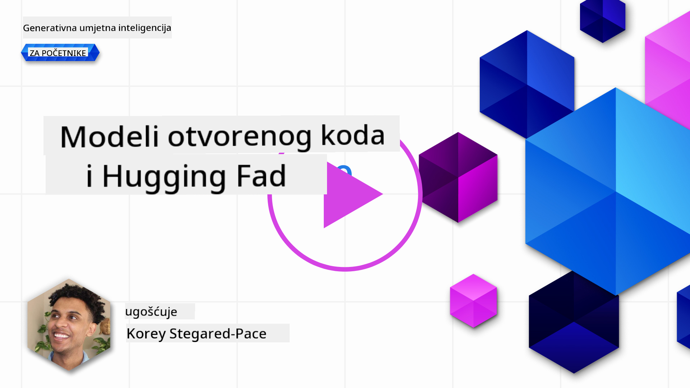
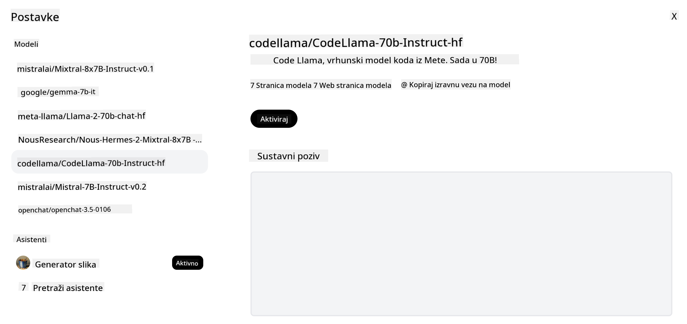

<!--
CO_OP_TRANSLATOR_METADATA:
{
  "original_hash": "0bba96e53ab841d99db731892a51fab8",
  "translation_date": "2025-05-20T07:05:11+00:00",
  "source_file": "16-open-source-models/README.md",
  "language_code": "hr"
}
-->

## Uvod

Svijet open-source LLM-ova je uzbudljiv i stalno se razvija. Ova lekcija ima za cilj pružiti detaljan pregled open-source modela. Ako tražite informacije o tome kako se vlasnički modeli uspoređuju s open-source modelima, idite na lekciju ["Istraživanje i usporedba različitih LLM-ova"](../02-exploring-and-comparing-different-llms/README.md?WT.mc_id=academic-105485-koreyst). Ova lekcija će također pokriti temu finog podešavanja, ali detaljnije objašnjenje možete pronaći u lekciji ["Fino podešavanje LLM-ova"](../18-fine-tuning/README.md?WT.mc_id=academic-105485-koreyst).

## Ciljevi učenja

- Razumijevanje open-source modela
- Razumijevanje prednosti rada s open-source modelima
- Istraživanje dostupnih open modela na Hugging Face i Azure AI Studio

## Što su Open Source modeli?

Open-source softver odigrao je ključnu ulogu u rastu tehnologije u različitim područjima. Open Source Initiative (OSI) definirao je [10 kriterija za softver](https://web.archive.org/web/20241126001143/https://opensource.org/osd?WT.mc_id=academic-105485-koreyst) kako bi se klasificirao kao open-source. Izvorni kod mora biti otvoreno dijeljen pod licencom koju odobrava OSI.

Iako razvoj LLM-ova ima slične elemente razvoju softvera, proces nije potpuno isti. To je donijelo mnogo rasprava u zajednici o definiciji open-source u kontekstu LLM-ova. Da bi model bio usklađen s tradicionalnom definicijom open-sourcea, sljedeće informacije trebaju biti javno dostupne:

- Skupovi podataka korišteni za treniranje modela.
- Puna težina modela kao dio treninga.
- Kod za evaluaciju.
- Kod za fino podešavanje.
- Puna težina modela i metrički podaci o treningu.

Trenutno postoji samo nekoliko modela koji odgovaraju ovom kriteriju. [OLMo model stvoren od strane Allen Institute for Artificial Intelligence (AllenAI)](https://huggingface.co/allenai/OLMo-7B?WT.mc_id=academic-105485-koreyst) je jedan koji odgovara ovoj kategoriji.

Za ovu lekciju, modele ćemo nadalje nazivati "otvorenim modelima" jer možda ne odgovaraju gore navedenim kriterijima u trenutku pisanja.

## Prednosti otvorenih modela

**Visoko prilagodljivi** - Budući da su otvoreni modeli objavljeni s detaljnim informacijama o treningu, istraživači i programeri mogu mijenjati unutarnje dijelove modela. To omogućuje stvaranje visoko specijaliziranih modela koji su fino podešeni za određeni zadatak ili područje proučavanja. Neki primjeri ovoga su generiranje koda, matematičke operacije i biologija.

**Trošak** - Trošak po tokenu za korištenje i implementaciju ovih modela niži je nego kod vlasničkih modela. Kada gradite aplikacije generativne umjetne inteligencije, treba usporediti izvedbu i cijenu kada radite s ovim modelima na vašem slučaju korištenja.

  
Izvor: Artificial Analysis

**Fleksibilnost** - Rad s otvorenim modelima omogućuje vam fleksibilnost u korištenju različitih modela ili njihovom kombiniranju. Primjer ovoga su [HuggingChat asistenti](https://huggingface.co/chat?WT.mc_id=academic-105485-koreyst) gdje korisnik može odabrati model koji se koristi izravno u korisničkom sučelju:

## Istraživanje različitih otvorenih modela

### Llama 2

[LLama2](https://huggingface.co/meta-llama?WT.mc_id=academic-105485-koreyst), razvijen od strane Meta, je otvoreni model koji je optimiziran za aplikacije temeljene na chatu. To je zbog njegove metode finog podešavanja koja je uključivala veliku količinu dijaloga i povratnih informacija od ljudi. S ovom metodom, model proizvodi više rezultata koji su u skladu s očekivanjima ljudi, što pruža bolje korisničko iskustvo.

Neki primjeri fino podešenih verzija Llama uključuju [Japanese Llama](https://huggingface.co/elyza/ELYZA-japanese-Llama-2-7b?WT.mc_id=academic-105485-koreyst), koja se specijalizira za japanski jezik i [Llama Pro](https://huggingface.co/TencentARC/LLaMA-Pro-8B?WT.mc_id=academic-105485-koreyst), koja je poboljšana verzija osnovnog modela.

### Mistral

[Mistral](https://huggingface.co/mistralai?WT.mc_id=academic-105485-koreyst) je otvoreni model s jakim fokusom na visoku izvedbu i učinkovitost. Koristi pristup Mješavine stručnjaka koji kombinira grupu specijaliziranih stručnih modela u jedan sustav gdje se, ovisno o ulazu, odabiru određeni modeli za korištenje. To čini izračun učinkovitijim jer modeli obrađuju samo ulaze u kojima su specijalizirani.

Neki primjeri fino podešenih verzija Mistrala uključuju [BioMistral](https://huggingface.co/BioMistral/BioMistral-7B?text=Mon+nom+est+Thomas+et+mon+principal?WT.mc_id=academic-105485-koreyst), koji je fokusiran na medicinsko područje i [OpenMath Mistral](https://huggingface.co/nvidia/OpenMath-Mistral-7B-v0.1-hf?WT.mc_id=academic-105485-koreyst), koji obavlja matematičke izračune.

### Falcon

[Falcon](https://huggingface.co/tiiuae?WT.mc_id=academic-105485-koreyst) je LLM stvoren od strane Instituta za tehnološke inovacije (**TII**). Falcon-40B je treniran na 40 milijardi parametara, što se pokazalo boljim od GPT-3 s manjim proračunom za izračun. To je zbog korištenja FlashAttention algoritma i multiquery pažnje koja omogućuje smanjenje memorijskih zahtjeva tijekom izvođenja. S ovim smanjenim vremenom izvođenja, Falcon-40B je prikladan za aplikacije temeljene na chatu.

Neki primjeri fino podešenih verzija Falcona su [OpenAssistant](https://huggingface.co/OpenAssistant/falcon-40b-sft-top1-560?WT.mc_id=academic-105485-koreyst), asistent izgrađen na otvorenim modelima i [GPT4ALL](https://huggingface.co/nomic-ai/gpt4all-falcon?WT.mc_id=academic-105485-koreyst), koji pruža veću izvedbu od osnovnog modela.

## Kako odabrati

Ne postoji jednoznačan odgovor za odabir otvorenog modela. Dobro mjesto za početak je korištenje funkcije filtriranja prema zadatku u Azure AI Studio. To će vam pomoći da shvatite za koje vrste zadataka je model treniran. Hugging Face također održava LLM ljestvicu koja vam pokazuje najbolje modele prema određenim metrikama.

Kada želite usporediti LLM-ove različitih tipova, [Artificial Analysis](https://artificialanalysis.ai/?WT.mc_id=academic-105485-koreyst) je još jedan izvrstan resurs:

  
Izvor: Artifical Analysis

Ako radite na specifičnom slučaju korištenja, pretraživanje fino podešenih verzija koje su fokusirane na isto područje može biti učinkovito. Eksperimentiranje s više otvorenih modela kako biste vidjeli kako se ponašaju prema vašim i očekivanjima vaših korisnika je još jedna dobra praksa.

## Sljedeći koraci

Najbolji dio o otvorenim modelima je što možete brzo započeti raditi s njima. Pogledajte [Azure AI Studio katalog modela](https://ai.azure.com?WT.mc_id=academic-105485-koreyst), koji sadrži specifičnu Hugging Face kolekciju s ovim modelima koje smo ovdje raspravili.

## Učenje ne prestaje ovdje, nastavite putovanje

Nakon što završite ovu lekciju, pogledajte našu [Generative AI Learning kolekciju](https://aka.ms/genai-collection?WT.mc_id=academic-105485-koreyst) kako biste nastavili unapređivati svoje znanje o generativnoj umjetnoj inteligenciji!

**Odricanje odgovornosti**:  
Ovaj dokument je preveden koristeći AI uslugu prevođenja [Co-op Translator](https://github.com/Azure/co-op-translator). Iako se trudimo postići točnost, imajte na umu da automatski prijevodi mogu sadržavati pogreške ili netočnosti. Izvorni dokument na izvornom jeziku treba smatrati autoritativnim izvorom. Za ključne informacije preporučuje se profesionalni ljudski prijevod. Ne odgovaramo za nesporazume ili pogrešna tumačenja koja proizlaze iz korištenja ovog prijevoda.