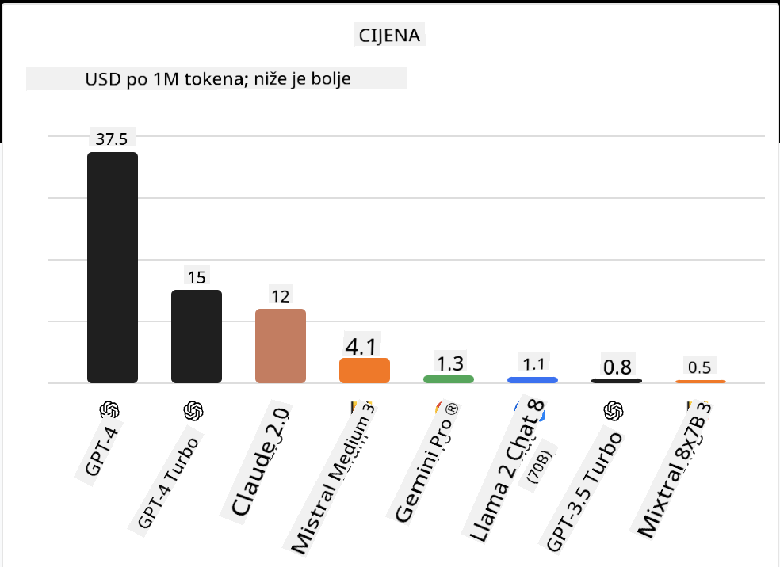
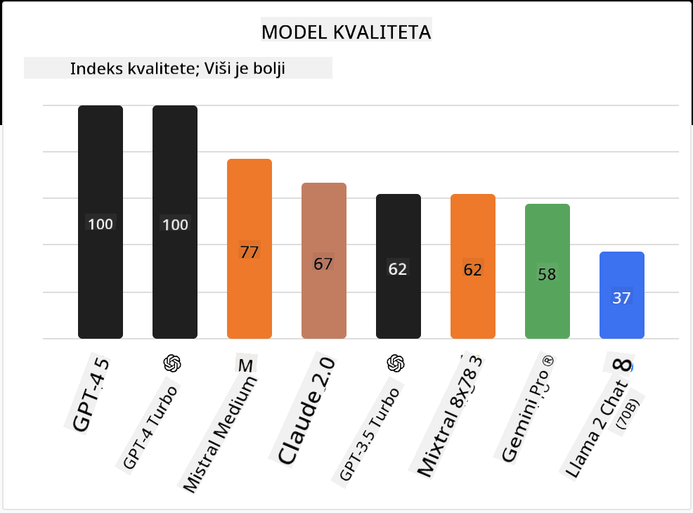

<!--
CO_OP_TRANSLATOR_METADATA:
{
  "original_hash": "0bba96e53ab841d99db731892a51fab8",
  "translation_date": "2025-07-09T17:15:53+00:00",
  "source_file": "16-open-source-models/README.md",
  "language_code": "hr"
}
-->

## Uvod

Svijet open-source LLM-ova je uzbudljiv i stalno se razvija. Ova lekcija ima za cilj pružiti detaljan pregled open source modela. Ako tražite informacije o tome kako se vlasnički modeli uspoređuju s open source modelima, posjetite lekciju ["Istraživanje i usporedba različitih LLM-ova"](../02-exploring-and-comparing-different-llms/README.md?WT.mc_id=academic-105485-koreyst). Ova lekcija će također obuhvatiti temu fine-tuninga, no detaljnije objašnjenje možete pronaći u lekciji ["Fine-Tuning LLMs"](../18-fine-tuning/README.md?WT.mc_id=academic-105485-koreyst).

## Ciljevi učenja

- Steći razumijevanje open source modela  
- Razumjeti prednosti rada s open source modelima  
- Istražiti dostupne open modele na Hugging Face i Azure AI Studiu  

## Što su Open Source modeli?

Open source softver odigrao je ključnu ulogu u razvoju tehnologije u raznim područjima. Open Source Initiative (OSI) definirao je [10 kriterija za softver](https://web.archive.org/web/20241126001143/https://opensource.org/osd?WT.mc_id=academic-105485-koreyst) da bi se klasificirao kao open source. Izvorni kod mora biti javno dostupan pod licencom koju je odobrila OSI.

Iako razvoj LLM-ova ima slične elemente kao razvoj softvera, proces nije potpuno isti. To je izazvalo mnogo rasprava u zajednici o definiciji open source u kontekstu LLM-ova. Da bi model bio u skladu s tradicionalnom definicijom open source, sljedeće informacije trebaju biti javno dostupne:

- Skupovi podataka korišteni za treniranje modela  
- Potpune težine modela kao dio treninga  
- Kod za evaluaciju  
- Kod za fine-tuning  
- Potpune težine modela i metričke vrijednosti treninga  

Trenutno postoji samo nekoliko modela koji zadovoljavaju ove kriterije. [OLMo model koji je kreirao Allen Institute for Artificial Intelligence (AllenAI)](https://huggingface.co/allenai/OLMo-7B?WT.mc_id=academic-105485-koreyst) jedan je od takvih.

U ovoj lekciji ćemo modele ubuduće nazivati "open modeli" jer možda u trenutku pisanja ne zadovoljavaju sve gore navedene kriterije.

## Prednosti Open modela

**Visoka prilagodljivost** – Budući da su open modeli objavljeni s detaljnim informacijama o treningu, istraživači i developeri mogu mijenjati unutrašnjost modela. To omogućuje stvaranje vrlo specijaliziranih modela koji su fino podešeni za određeni zadatak ili područje. Primjeri uključuju generiranje koda, matematičke operacije i biologiju.

**Trošak** – Trošak po tokenu za korištenje i implementaciju ovih modela niži je nego kod vlasničkih modela. Prilikom izrade Generativnih AI aplikacija, važno je razmotriti omjer performansi i cijene za vaš slučaj upotrebe.

  
Izvor: Artificial Analysis

**Fleksibilnost** – Rad s open modelima omogućuje vam fleksibilnost u korištenju različitih modela ili njihovom kombiniranju. Primjer za to su [HuggingChat asistenti](https://huggingface.co/chat?WT.mc_id=academic-105485-koreyst) gdje korisnik može izravno u sučelju odabrati model koji želi koristiti:

## Istraživanje različitih Open modela

### Llama 2

[LLama2](https://huggingface.co/meta-llama?WT.mc_id=academic-105485-koreyst), koji je razvio Meta, open je model optimiziran za chat aplikacije. To je zbog metode fine-tuninga koja je uključivala veliku količinu dijaloga i povratnih informacija od ljudi. Ova metoda omogućuje modelu da daje rezultate koji su bolje usklađeni s ljudskim očekivanjima, što pruža bolje korisničko iskustvo.

Neki primjeri fino podešenih verzija Llama uključuju [Japanese Llama](https://huggingface.co/elyza/ELYZA-japanese-Llama-2-7b?WT.mc_id=academic-105485-koreyst), specijaliziran za japanski jezik, i [Llama Pro](https://huggingface.co/TencentARC/LLaMA-Pro-8B?WT.mc_id=academic-105485-koreyst), poboljšanu verziju osnovnog modela.

### Mistral

[Mistral](https://huggingface.co/mistralai?WT.mc_id=academic-105485-koreyst) je open model s jakim fokusom na visoke performanse i učinkovitost. Koristi pristup Mixture-of-Experts koji kombinira skupinu specijaliziranih ekspertskih modela u jedan sustav gdje se, ovisno o ulazu, odabiru određeni modeli za korištenje. To čini izračune učinkovitijima jer modeli obrađuju samo one ulaze za koje su specijalizirani.

Neki primjeri fino podešenih verzija Mistral uključuju [BioMistral](https://huggingface.co/BioMistral/BioMistral-7B?text=Mon+nom+est+Thomas+et+mon+principal?WT.mc_id=academic-105485-koreyst), fokusiran na medicinsku domenu, i [OpenMath Mistral](https://huggingface.co/nvidia/OpenMath-Mistral-7B-v0.1-hf?WT.mc_id=academic-105485-koreyst), koji izvodi matematičke izračune.

### Falcon

[Falcon](https://huggingface.co/tiiuae?WT.mc_id=academic-105485-koreyst) je LLM koji je kreirao Technology Innovation Institute (**TII**). Falcon-40B treniran je na 40 milijardi parametara i pokazao je bolje performanse od GPT-3 uz manji računalni budžet. To je rezultat korištenja FlashAttention algoritma i multiquery attentiona koji smanjuju memorijske zahtjeve tijekom izvođenja. S ovim smanjenim vremenom izvođenja, Falcon-40B je prikladan za chat aplikacije.

Neki primjeri fino podešenih verzija Falcona su [OpenAssistant](https://huggingface.co/OpenAssistant/falcon-40b-sft-top1-560?WT.mc_id=academic-105485-koreyst), asistent izgrađen na open modelima, i [GPT4ALL](https://huggingface.co/nomic-ai/gpt4all-falcon?WT.mc_id=academic-105485-koreyst), koji pruža bolje performanse od osnovnog modela.

## Kako odabrati

Ne postoji jedinstven odgovor na pitanje kako odabrati open model. Dobar početak je korištenje značajke filtriranja po zadatku u Azure AI Studiu. To će vam pomoći razumjeti za koje vrste zadataka je model treniran. Hugging Face također održava LLM Leaderboard koji prikazuje najbolje modele prema određenim metrikama.

Kada želite usporediti LLM-ove različitih vrsta, [Artificial Analysis](https://artificialanalysis.ai/?WT.mc_id=academic-105485-koreyst) je još jedan odličan izvor:

  
Izvor: Artificial Analysis

Ako radite na specifičnom slučaju upotrebe, traženje fino podešenih verzija usmjerenih na isto područje može biti učinkovito. Eksperimentiranje s više open modela kako biste vidjeli kako se ponašaju u skladu s vašim i očekivanjima korisnika također je dobra praksa.

## Sljedeći koraci

Najbolji dio open modela je što s njima možete brzo započeti rad. Pogledajte [Azure AI Studio Model Catalog](https://ai.azure.com?WT.mc_id=academic-105485-koreyst), koji sadrži posebnu Hugging Face kolekciju s modelima o kojima smo ovdje govorili.

## Učenje ne prestaje ovdje, nastavite putovanje

Nakon što završite ovu lekciju, pogledajte našu [Generative AI Learning kolekciju](https://aka.ms/genai-collection?WT.mc_id=academic-105485-koreyst) i nastavite podizati svoje znanje o Generativnoj AI!

**Odricanje od odgovornosti**:  
Ovaj dokument je preveden korištenjem AI usluge za prevođenje [Co-op Translator](https://github.com/Azure/co-op-translator). Iako težimo točnosti, imajte na umu da automatski prijevodi mogu sadržavati pogreške ili netočnosti. Izvorni dokument na izvornom jeziku treba smatrati autoritativnim izvorom. Za kritične informacije preporučuje se profesionalni ljudski prijevod. Ne snosimo odgovornost za bilo kakva nesporazume ili pogrešna tumačenja koja proizlaze iz korištenja ovog prijevoda.