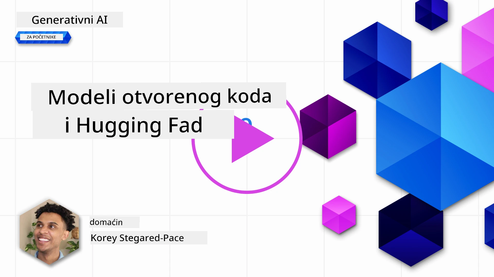
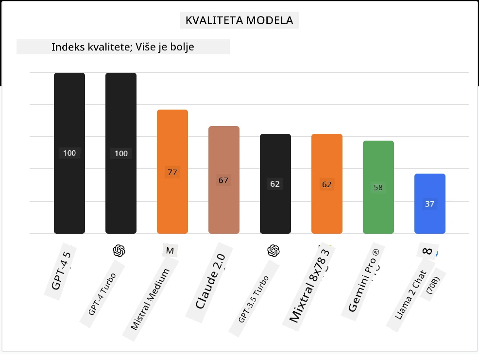

<!--
CO_OP_TRANSLATOR_METADATA:
{
  "original_hash": "85b754d4dc980f270f264d17116d9a5f",
  "translation_date": "2025-12-19T17:22:00+00:00",
  "source_file": "16-open-source-models/README.md",
  "language_code": "hr"
}
-->

## Uvod

Svijet open-source LLM-ova je uzbudljiv i stalno se razvija. Ova lekcija ima za cilj pružiti dubinski pregled open source modela. Ako tražite informacije o tome kako se vlasnički modeli uspoređuju s open source modelima, idite na lekciju ["Istraživanje i usporedba različitih LLM-ova"](../02-exploring-and-comparing-different-llms/README.md?WT.mc_id=academic-105485-koreyst). Ova lekcija će također pokriti temu fino podešavanja, ali detaljnije objašnjenje možete pronaći u lekciji ["Fino podešavanje LLM-ova"](../18-fine-tuning/README.md?WT.mc_id=academic-105485-koreyst).

## Ciljevi učenja

- Steći razumijevanje open source modela
- Razumjeti prednosti rada s open source modelima
- Istražiti dostupne open modele na Hugging Face i Azure AI Studio

## Što su Open Source modeli?

Open source softver odigrao je ključnu ulogu u rastu tehnologije u raznim područjima. Open Source Initiative (OSI) je definirao [10 kriterija za softver](https://web.archive.org/web/20241126001143/https://opensource.org/osd?WT.mc_id=academic-105485-koreyst) da bi bio klasificiran kao open source. Izvorni kod mora biti javno dostupan pod licencom koju odobri OSI.

Iako razvoj LLM-ova ima slične elemente kao razvoj softvera, proces nije potpuno isti. To je dovelo do mnogo rasprava u zajednici o definiciji open source u kontekstu LLM-ova. Da bi model bio usklađen s tradicionalnom definicijom open source, sljedeće informacije trebaju biti javno dostupne:

- Skupovi podataka korišteni za treniranje modela.
- Potpune težine modela kao dio treniranja.
- Kod za evaluaciju.
- Kod za fino podešavanje.
- Potpune težine modela i metrike treniranja.

Trenutno postoji samo nekoliko modela koji zadovoljavaju ove kriterije. [OLMo model koji je kreirao Allen Institute for Artificial Intelligence (AllenAI)](https://huggingface.co/allenai/OLMo-7B?WT.mc_id=academic-105485-koreyst) je jedan od njih.

Za ovu lekciju, ubuduće ćemo modele nazivati "open modeli" jer možda ne zadovoljavaju gore navedene kriterije u trenutku pisanja.

## Prednosti Open modela

**Visoka prilagodljivost** - Budući da su open modeli objavljeni s detaljnim informacijama o treniranju, istraživači i programeri mogu mijenjati unutrašnjost modela. To omogućuje stvaranje vrlo specijaliziranih modela koji su fino podešeni za određeni zadatak ili područje proučavanja. Neki primjeri su generiranje koda, matematičke operacije i biologija.

**Trošak** - Trošak po tokenu za korištenje i implementaciju ovih modela je niži nego kod vlasničkih modela. Prilikom izrade Generativnih AI aplikacija, treba razmotriti omjer performansi i cijene pri radu s ovim modelima za vaš slučaj upotrebe.

Izvor: Artificial Analysis

**Fleksibilnost** - Rad s open modelima omogućuje vam fleksibilnost u smislu korištenja različitih modela ili njihove kombinacije. Primjer za to su [HuggingChat asistenti](https://huggingface.co/chat?WT.mc_id=academic-105485-koreyst) gdje korisnik može izravno u korisničkom sučelju odabrati model koji se koristi:

## Istraživanje različitih Open modela

### Llama 2

[LLama2](https://huggingface.co/meta-llama?WT.mc_id=academic-105485-koreyst), koji je razvio Meta, je open model optimiziran za chat aplikacije. To je zbog njegove metode fino podešavanja, koja je uključivala veliku količinu dijaloga i povratnih informacija od ljudi. Ovom metodom model daje rezultate koji su više usklađeni s ljudskim očekivanjima, što pruža bolje korisničko iskustvo.

Neki primjeri fino podešenih verzija Llama uključuju [Japanese Llama](https://huggingface.co/elyza/ELYZA-japanese-Llama-2-7b?WT.mc_id=academic-105485-koreyst), koji je specijaliziran za japanski jezik, i [Llama Pro](https://huggingface.co/TencentARC/LLaMA-Pro-8B?WT.mc_id=academic-105485-koreyst), koji je poboljšana verzija osnovnog modela.

### Mistral

[Mistral](https://huggingface.co/mistralai?WT.mc_id=academic-105485-koreyst) je open model s jakim fokusom na visoke performanse i učinkovitost. Koristi pristup Mixture-of-Experts koji kombinira skupinu specijaliziranih ekspertskih modela u jedan sustav gdje se ovisno o ulazu odabiru određeni modeli za korištenje. To čini izračun učinkovitijim jer modeli obrađuju samo ulaze za koje su specijalizirani.

Neki primjeri fino podešenih verzija Mistral uključuju [BioMistral](https://huggingface.co/BioMistral/BioMistral-7B?text=Mon+nom+est+Thomas+et+mon+principal?WT.mc_id=academic-105485-koreyst), koji je fokusiran na medicinsko područje, i [OpenMath Mistral](https://huggingface.co/nvidia/OpenMath-Mistral-7B-v0.1-hf?WT.mc_id=academic-105485-koreyst), koji izvodi matematičke izračune.

### Falcon

[Falcon](https://huggingface.co/tiiuae?WT.mc_id=academic-105485-koreyst) je LLM koji je stvorio Technology Innovation Institute (**TII**). Falcon-40B je treniran na 40 milijardi parametara i pokazao je bolje performanse od GPT-3 uz manji računalni budžet. To je zbog korištenja FlashAttention algoritma i multiquery pažnje koja omogućuje smanjenje memorijskih zahtjeva tijekom izvođenja. S ovim smanjenim vremenom izvođenja, Falcon-40B je prikladan za chat aplikacije.

Neki primjeri fino podešenih verzija Falcon su [OpenAssistant](https://huggingface.co/OpenAssistant/falcon-40b-sft-top1-560?WT.mc_id=academic-105485-koreyst), asistent izgrađen na open modelima, i [GPT4ALL](https://huggingface.co/nomic-ai/gpt4all-falcon?WT.mc_id=academic-105485-koreyst), koji pruža bolje performanse od osnovnog modela.

## Kako odabrati

Ne postoji jedinstven odgovor za odabir open modela. Dobar početak je korištenje značajke filtriranja po zadatku u Azure AI Studiu. To će vam pomoći razumjeti za koje vrste zadataka je model treniran. Hugging Face također održava LLM ljestvicu koja prikazuje najbolje modele prema određenim metrikama.

Kada želite usporediti LLM-ove različitih vrsta, [Artificial Analysis](https://artificialanalysis.ai/?WT.mc_id=academic-105485-koreyst) je još jedan izvrstan resurs:

Izvor: Artificial Analysis

Ako radite na specifičnom slučaju upotrebe, traženje fino podešenih verzija koje su fokusirane na isto područje može biti učinkovito. Eksperimentiranje s više open modela kako biste vidjeli kako se ponašaju prema vašim i očekivanjima vaših korisnika je također dobra praksa.

## Sljedeći koraci

Najbolji dio open modela je što možete brzo započeti rad s njima. Pogledajte [Azure AI Foundry Model Catalog](https://ai.azure.com?WT.mc_id=academic-105485-koreyst), koji sadrži posebnu Hugging Face kolekciju s modelima koje smo ovdje spomenuli.

## Učenje ne prestaje ovdje, nastavite putovanje

Nakon što završite ovu lekciju, pogledajte našu [Generative AI Learning kolekciju](https://aka.ms/genai-collection?WT.mc_id=academic-105485-koreyst) kako biste nastavili podizati svoje znanje o Generativnoj AI!

---

<!-- CO-OP TRANSLATOR DISCLAIMER START -->
**Odricanje od odgovornosti**:
Ovaj dokument je preveden pomoću AI usluge za prevođenje [Co-op Translator](https://github.com/Azure/co-op-translator). Iako nastojimo postići točnost, imajte na umu da automatski prijevodi mogu sadržavati pogreške ili netočnosti. Izvorni dokument na izvornom jeziku treba smatrati autoritativnim izvorom. Za kritične informacije preporučuje se profesionalni ljudski prijevod. Ne snosimo odgovornost za bilo kakva nesporazuma ili pogrešna tumačenja koja proizlaze iz korištenja ovog prijevoda.
<!-- CO-OP TRANSLATOR DISCLAIMER END -->