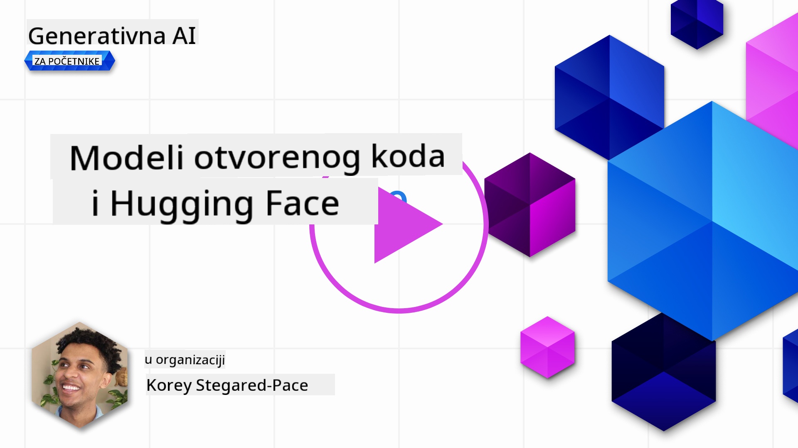
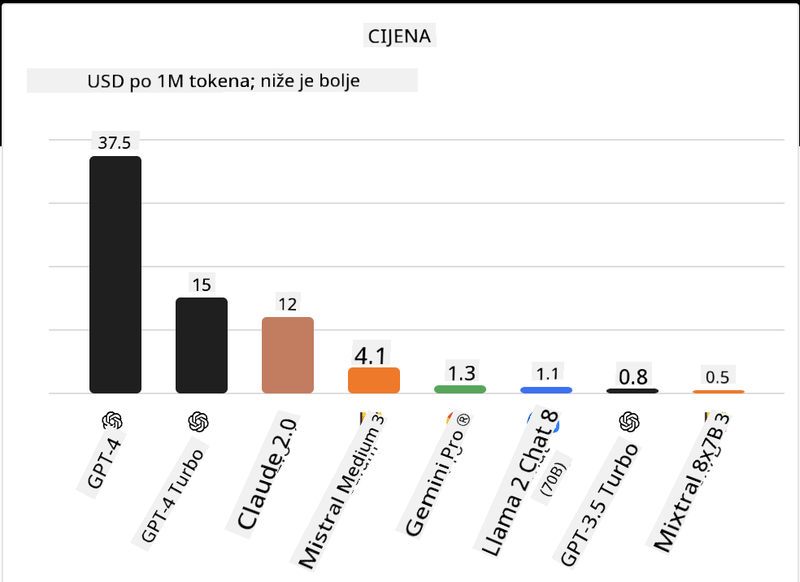
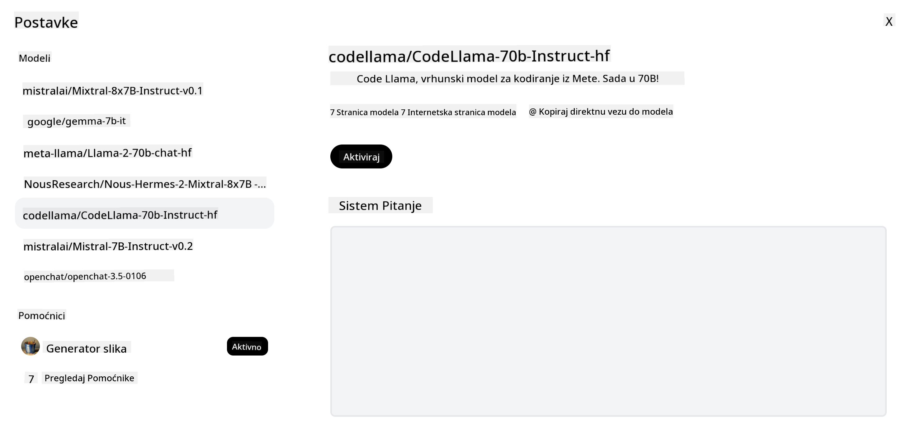
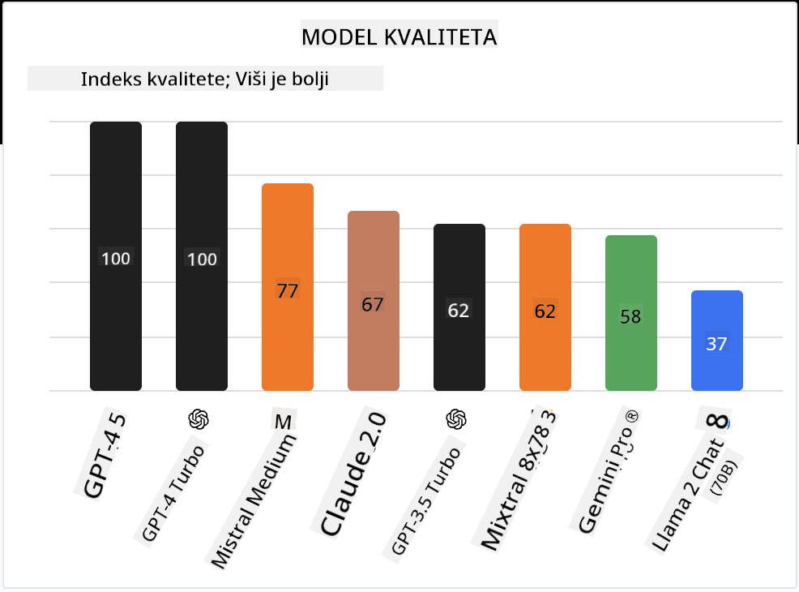

<!--
CO_OP_TRANSLATOR_METADATA:
{
  "original_hash": "0bba96e53ab841d99db731892a51fab8",
  "translation_date": "2025-06-26T00:05:11+00:00",
  "source_file": "16-open-source-models/README.md",
  "language_code": "hr"
}
-->

## Uvod

Svijet open-source LLM-ova je uzbudljiv i stalno se razvija. Ova lekcija ima za cilj pružiti detaljan pregled open-source modela. Ako tražite informacije o tome kako se vlasnički modeli uspoređuju s open-source modelima, posjetite lekciju ["Istraživanje i usporedba različitih LLM-ova"](../02-exploring-and-comparing-different-llms/README.md?WT.mc_id=academic-105485-koreyst). Ova lekcija će također pokriti temu fino podešavanja, no detaljnije objašnjenje možete pronaći u lekciji ["Fino podešavanje LLM-ova"](../18-fine-tuning/README.md?WT.mc_id=academic-105485-koreyst).

## Ciljevi učenja

- Razumijevanje open-source modela
- Razumijevanje prednosti rada s open-source modelima
- Istraživanje dostupnih open modela na Hugging Face i Azure AI Studiju

## Što su Open Source modeli?

Open source softver igra ključnu ulogu u rastu tehnologije u raznim područjima. Open Source Initiative (OSI) je definirala [10 kriterija za softver](https://web.archive.org/web/20241126001143/https://opensource.org/osd?WT.mc_id=academic-105485-koreyst) da bi bio klasificiran kao open source. Izvorni kod mora biti otvoreno dijeljen pod licencom koju odobrava OSI.

Iako razvoj LLM-ova ima slične elemente razvoju softvera, proces nije potpuno isti. To je dovelo do mnogo rasprava u zajednici o definiciji open source u kontekstu LLM-ova. Da bi model bio usklađen s tradicionalnom definicijom open source, sljedeće informacije trebaju biti javno dostupne:

- Skupovi podataka korišteni za treniranje modela.
- Puna težina modela kao dio treniranja.
- Kod za evaluaciju.
- Kod za fino podešavanje.
- Puna težina modela i metrički podaci treniranja.

Trenutno postoji samo nekoliko modela koji ispunjavaju ove kriterije. [OLMo model koji je stvorio Allen Institute for Artificial Intelligence (AllenAI)](https://huggingface.co/allenai/OLMo-7B?WT.mc_id=academic-105485-koreyst) jedan je od tih modela.

Za ovu lekciju, modele ćemo nadalje nazivati "open modelima" jer možda ne ispunjavaju gore navedene kriterije u trenutku pisanja.

## Prednosti Open modela

**Visoka prilagodljivost** - Budući da su open modeli objavljeni s detaljnim informacijama o treniranju, istraživači i programeri mogu mijenjati unutrašnjost modela. To omogućuje stvaranje visoko specijaliziranih modela koji su fino podešeni za određeni zadatak ili područje istraživanja. Neki primjeri uključuju generiranje koda, matematičke operacije i biologiju.

**Trošak** - Trošak po tokenu za korištenje i implementaciju ovih modela niži je nego kod vlasničkih modela. Kada gradite aplikacije generativne umjetne inteligencije, trebali biste usporediti performanse i cijenu kada radite s ovim modelima na vašem slučaju korištenja.

  
Izvor: Artificial Analysis

**Fleksibilnost** - Rad s open modelima omogućuje vam fleksibilnost u korištenju različitih modela ili njihovoj kombinaciji. Primjer za to su [HuggingChat Assistants](https://huggingface.co/chat?WT.mc_id=academic-105485-koreyst) gdje korisnik može odabrati model koji se koristi izravno u korisničkom sučelju:

## Istraživanje različitih Open modela

### Llama 2

[LLama2](https://huggingface.co/meta-llama?WT.mc_id=academic-105485-koreyst), razvijen od strane Meta, je open model optimiziran za aplikacije temeljene na chatu. To je zbog njegove metode fino podešavanja, koja uključuje veliku količinu dijaloga i povratnih informacija od ljudi. Ovom metodom model proizvodi više rezultata koji su usklađeni s očekivanjima ljudi, što pruža bolje korisničko iskustvo.

Neki primjeri fino podešenih verzija Llama uključuju [Japanese Llama](https://huggingface.co/elyza/ELYZA-japanese-Llama-2-7b?WT.mc_id=academic-105485-koreyst), koji se specijalizira za japanski jezik, i [Llama Pro](https://huggingface.co/TencentARC/LLaMA-Pro-8B?WT.mc_id=academic-105485-koreyst), koji je poboljšana verzija osnovnog modela.

### Mistral

[Mistral](https://huggingface.co/mistralai?WT.mc_id=academic-105485-koreyst) je open model s jakim fokusom na visoku učinkovitost i performanse. Koristi pristup Mješavine stručnjaka koji kombinira grupu specijaliziranih ekspertnih modela u jedan sustav gdje se, ovisno o unosu, određeni modeli biraju za korištenje. To čini računanje učinkovitijim jer se modeli bave samo unosima u kojima su specijalizirani.

Neki primjeri fino podešenih verzija Mistrala uključuju [BioMistral](https://huggingface.co/BioMistral/BioMistral-7B?text=Mon+nom+est+Thomas+et+mon+principal?WT.mc_id=academic-105485-koreyst), koji je usmjeren na medicinsko područje, i [OpenMath Mistral](https://huggingface.co/nvidia/OpenMath-Mistral-7B-v0.1-hf?WT.mc_id=academic-105485-koreyst), koji obavlja matematičke izračune.

### Falcon

[Falcon](https://huggingface.co/tiiuae?WT.mc_id=academic-105485-koreyst) je LLM koji je stvorio Institut za tehnološke inovacije (**TII**). Falcon-40B je treniran na 40 milijardi parametara, što se pokazalo boljim od GPT-3 uz manji proračunski kapacitet. To je zbog korištenja FlashAttention algoritma i multiquery pažnje koji omogućuju smanjenje zahtjeva za memorijom tijekom inferencije. S ovim smanjenim vremenom inferencije, Falcon-40B je prikladan za chat aplikacije.

Neki primjeri fino podešenih verzija Falcona su [OpenAssistant](https://huggingface.co/OpenAssistant/falcon-40b-sft-top1-560?WT.mc_id=academic-105485-koreyst), asistent izgrađen na open modelima, i [GPT4ALL](https://huggingface.co/nomic-ai/gpt4all-falcon?WT.mc_id=academic-105485-koreyst), koji pruža bolje performanse od osnovnog modela.

## Kako odabrati

Ne postoji jedinstven odgovor za odabir open modela. Dobar početak je korištenje značajke filtriranja prema zadatku u Azure AI Studiju. To će vam pomoći razumjeti za koje je vrste zadataka model treniran. Hugging Face također održava LLM Leaderboard koji vam prikazuje najbolje performanse modela na temelju određenih metrika.

Kada želite usporediti LLM-ove među različitim vrstama, [Artificial Analysis](https://artificialanalysis.ai/?WT.mc_id=academic-105485-koreyst) je još jedan izvrstan resurs:

  
Izvor: Artificial Analysis

Ako radite na specifičnom slučaju korištenja, pretraga fino podešenih verzija koje su usmjerene na isto područje može biti učinkovita. Eksperimentiranje s više open modela kako biste vidjeli kako se ponašaju prema vašim i očekivanjima vaših korisnika još je jedna dobra praksa.

## Sljedeći koraci

Najbolji dio kod open modela je što možete brzo započeti raditi s njima. Pogledajte [Azure AI Studio Model Catalog](https://ai.azure.com?WT.mc_id=academic-105485-koreyst), koji sadrži specifičnu Hugging Face kolekciju s modelima o kojima smo ovdje raspravljali.

## Učenje ne prestaje ovdje, nastavite putovanje

Nakon što završite ovu lekciju, pogledajte našu [Generative AI Learning collection](https://aka.ms/genai-collection?WT.mc_id=academic-105485-koreyst) kako biste nastavili s unapređivanjem svog znanja o generativnoj umjetnoj inteligenciji!

**Odricanje od odgovornosti**:  
Ovaj dokument je preveden koristeći AI uslugu prevođenja [Co-op Translator](https://github.com/Azure/co-op-translator). Iako nastojimo postići točnost, molimo vas da budete svjesni da automatski prijevodi mogu sadržavati pogreške ili netočnosti. Izvorni dokument na izvornom jeziku treba smatrati autoritativnim izvorom. Za kritične informacije preporučuje se profesionalni prijevod od strane ljudi. Ne odgovaramo za bilo kakva nesporazuma ili pogrešna tumačenja koja proizlaze iz korištenja ovog prijevoda.