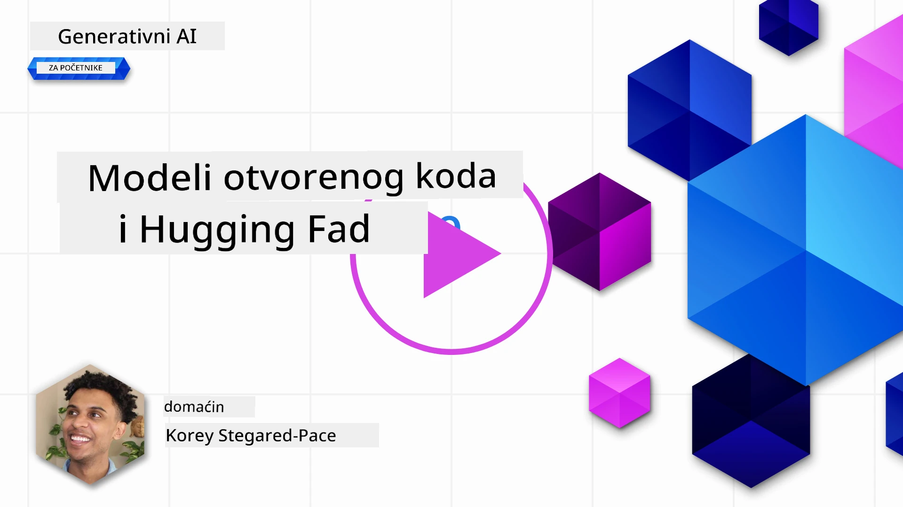
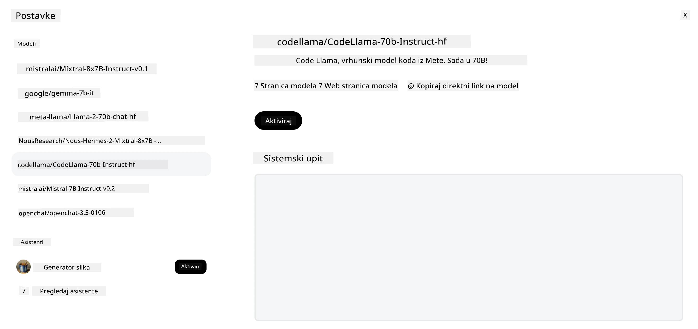
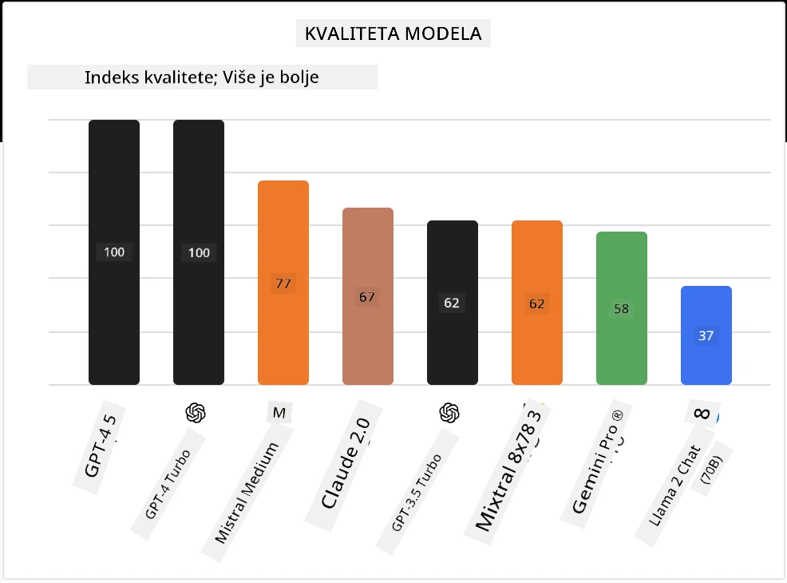

## Uvod

Svijet otvorenih LLM-ova je uzbudljiv i neprestano se razvija. Ova lekcija ima za cilj pružiti dubinski pogled na modele otvorenog koda. Ako tražite informacije o tome kako se vlasnički modeli uspoređuju s modelima otvorenog koda, idite na lekciju ["Istraživanje i usporedba različitih LLM-a"](../02-exploring-and-comparing-different-llms/README.md?WT.mc_id=academic-105485-koreyst). U ovoj će lekciji također biti obrađena tema finog podešavanja, ali detaljnije objašnjenje možete pronaći u lekciji ["Fino podešavanje LLM-a"](../18-fine-tuning/README.md?WT.mc_id=academic-105485-koreyst).

## Ciljevi učenja

- Steći razumijevanje modela otvorenog koda
- Razumjeti prednosti rada s modelima otvorenog koda
- Istražiti dostupne otvorene modele na Hugging Face i katalogu modela Microsoft Foundry

## Što su modeli otvorenog koda?

Softver otvorenog koda odigrao je ključnu ulogu u rastu tehnologije u raznim područjima. Inicijativa Open Source (OSI) definirala je [10 kriterija za softver](https://web.archive.org/web/20241126001143/https://opensource.org/osd?WT.mc_id=academic-105485-koreyst) koji se klasificira kao otvorenog koda. Izvorni kod mora biti otvoreno podijeljen pod licencom koju odobrava OSI.

Iako razvoj LLM-ova ima slične elemente kao razvoj softvera, proces nije potpuno isti. To je dovelo do mnogo rasprava u zajednici o definiciji otvorenog koda u kontekstu LLM-ova. Da bi model bio usklađen s tradicionalnom definicijom otvorenog koda, sljedeće informacije trebaju biti javno dostupne:

- Skupovi podataka korišteni za treniranje modela.
- Potpune težine modela kao dio treninga.
- Kod za evaluaciju.
- Kod finog podešavanja.
- Potpune težine modela i metričke podatke treninga.

Trenutno postoji samo nekoliko modela koji zadovoljavaju ove kriterije. [OLMo model koji je kreirao Allen Institute for Artificial Intelligence (AllenAI)](https://huggingface.co/allenai/OLMo-7B?WT.mc_id=academic-105485-koreyst) je jedan koji spada u ovu kategoriju.

U ovoj lekciji dalje ćemo se referirati na modele kao na "otvorene modele" jer možda u vrijeme pisanja ne ispunjavaju gornje kriterije.

## Prednosti otvorenih modela

**Visoko prilagodljivi** - Budući da su otvoreni modeli objavljeni s detaljnim informacijama o treningu, istraživači i programeri mogu modificirati unutrašnjost modela. To omogućuje stvaranje visoko specijaliziranih modela finog podešavanja za određeni zadatak ili područje proučavanja. Neki primjeri ovoga su generiranje koda, matematičke operacije i biologija.

**Trošak** - Trošak po tokenu za korištenje i implementaciju ovih modela niži je nego za vlasničke modele. Kada gradite Generativne AI aplikacije, treba razmotriti omjer učinkovitosti i cijene prilikom korištenja ovih modela za vaš slučaj upotrebe.

Izvor: Artificial Analysis

**Fleksibilnost** - Rad s otvorenim modelima omogućuje vam fleksibilnost u smislu korištenja različitih modela ili njihove kombinacije. Primjer za to su [HuggingChat asistenti](https://huggingface.co/chat?WT.mc_id=academic-105485-koreyst) gdje korisnik može izravno u korisničkom sučelju odabrati model koji se koristi:

## Istraživanje različitih otvorenih modela

### Llama 2

[Llama2](https://huggingface.co/meta-llama?WT.mc_id=academic-105485-koreyst), kojeg je razvio Meta, je otvoreni model optimiziran za aplikacije zasnovane na chatu. To je zbog njegovog načina finog podešavanja koji je uključivao veliku količinu dijaloga i ljudskih povratnih informacija. Ovom metodom model pruža rezultate usklađene s ljudskim očekivanjima što osigurava bolje korisničko iskustvo.

Neki primjeri fino podešenih verzija Llam-e uključuju [Japanese Llama](https://huggingface.co/elyza/ELYZA-japanese-Llama-2-7b?WT.mc_id=academic-105485-koreyst), koji je specijaliziran za japanski jezik, i [Llama Pro](https://huggingface.co/TencentARC/LLaMA-Pro-8B?WT.mc_id=academic-105485-koreyst), što je poboljšana verzija osnovnog modela.

### Mistral

[Mistral](https://huggingface.co/mistralai?WT.mc_id=academic-105485-koreyst) je otvoreni model s jakim fokusom na visoke performanse i učinkovitost. Koristi pristup Mixture-of-Experts koji kombinira skupinu specijaliziranih ekspertskih modela u jedan sustav gdje se, ovisno o ulazu, biraju određeni modeli za korištenje. To čini računanje učinkovitijim jer modeli obrađuju samo ulaze u kojima su specijalizirani.

Neki primjeri fino podešenih verzija Mistrala uključuju [BioMistral](https://huggingface.co/BioMistral/BioMistral-7B?text=Mon+nom+est+Thomas+et+mon+principal?WT.mc_id=academic-105485-koreyst), koji je fokusiran na medicinsko područje, i [OpenMath Mistral](https://huggingface.co/nvidia/OpenMath-Mistral-7B-v0.1-hf?WT.mc_id=academic-105485-koreyst), koji vrši matematičke izračune.

### Falcon

[Falcon](https://huggingface.co/tiiuae?WT.mc_id=academic-105485-koreyst) je LLM stvoren od strane Technology Innovation Institute (**TII**). Falcon-40B treniran je na 40 milijardi parametara, a pokazao se boljim od GPT-3 uz manji proračun za računsku snagu. To je zbog korištenja FlashAttention algoritma i multiquery pažnje koja omogućuje smanjenje memorijskih zahtjeva u inferenciji. S ovim smanjenim vremenom inferencije, Falcon-40B je prikladan za aplikacije zasnovane na chat-u.

Neki primjeri fino podešenih verzija Falcona su [OpenAssistant](https://huggingface.co/OpenAssistant/falcon-40b-sft-top1-560?WT.mc_id=academic-105485-koreyst), asistent izgrađen na osnovi otvorenih modela, i [GPT4ALL](https://huggingface.co/nomic-ai/gpt4all-falcon?WT.mc_id=academic-105485-koreyst), koji pruža bolje performanse od osnovnog modela.

## Kako odabrati

Ne postoji jednoznačan odgovor za odabir otvorenog modela. Dobro je mjesto za početak korištenje značajke filtriranja prema zadatku u Microsoft Foundry katalogu modela. To će vam pomoći razumjeti za koje vrste zadataka je model treniran. Hugging Face također održava LLM listu najboljih modela koja prikazuje najbolje modele prema određenim metrima.

Kada želite usporediti LLM-ove različitih vrsta, [Artificial Analysis](https://artificialanalysis.ai/?WT.mc_id=academic-105485-koreyst) je još jedan izvrstan resurs:

Izvor: Artificial Analysis

Ako radite na specifičnom slučaju upotrebe, traženje fino podešenih verzija fokusiranih na isto područje može biti učinkovito. Eksperimentiranje s više otvorenih modela da vidite kako oni zadovoljavaju vaša i očekivanja vaših korisnika je također dobra praksa.

## Sljedeći koraci

Najbolji dio kod otvorenih modela je što možete brzo početi raditi s njima. Pogledajte [Microsoft Foundry katalog modela](https://ai.azure.com?WT.mc_id=academic-105485-koreyst), koji sadrži posebnu Hugging Face kolekciju s ovim modelima koje smo ovdje raspravili.

## Učenje ne prestaje ovdje, nastavite putovanje

Nakon završetka ove lekcije, pogledajte našu [kolekciju za učenje generativne AI](https://aka.ms/genai-collection?WT.mc_id=academic-105485-koreyst) kako biste nastavili podizati razinu svog znanja o generativnoj AI!

---

<!-- CO-OP TRANSLATOR DISCLAIMER START -->
**Napomena**:
Ovaj dokument je preveden korištenjem AI prevoditeljskog servisa [Co-op Translator](https://github.com/Azure/co-op-translator). Iako težimo točnosti, imajte na umu da automatski prijevodi mogu sadržavati greške ili netočnosti. Izvorni dokument na izvornom jeziku treba smatrati autoritativnim izvorom. Za važne informacije preporuča se profesionalni ljudski prijevod. Nismo odgovorni za bilo kakva nesporazumevanja ili pogrešne interpretacije koje proizlaze iz korištenja ovog prijevoda.
<!-- CO-OP TRANSLATOR DISCLAIMER END -->