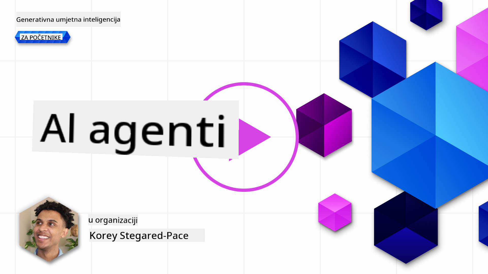
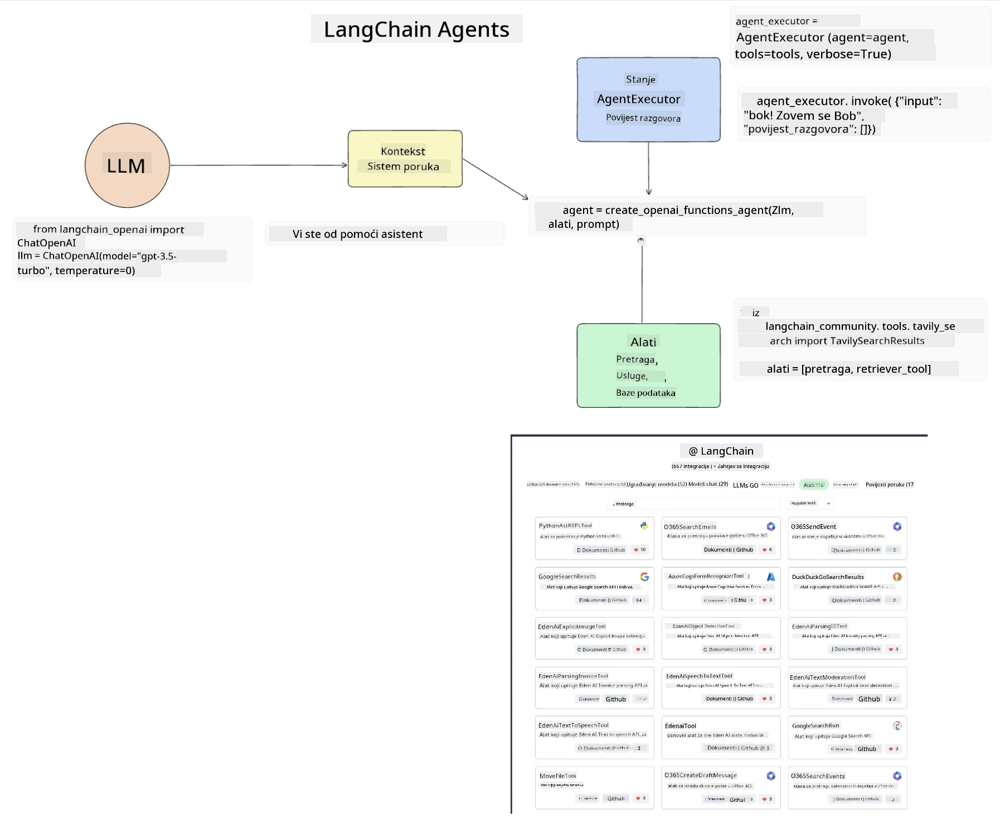
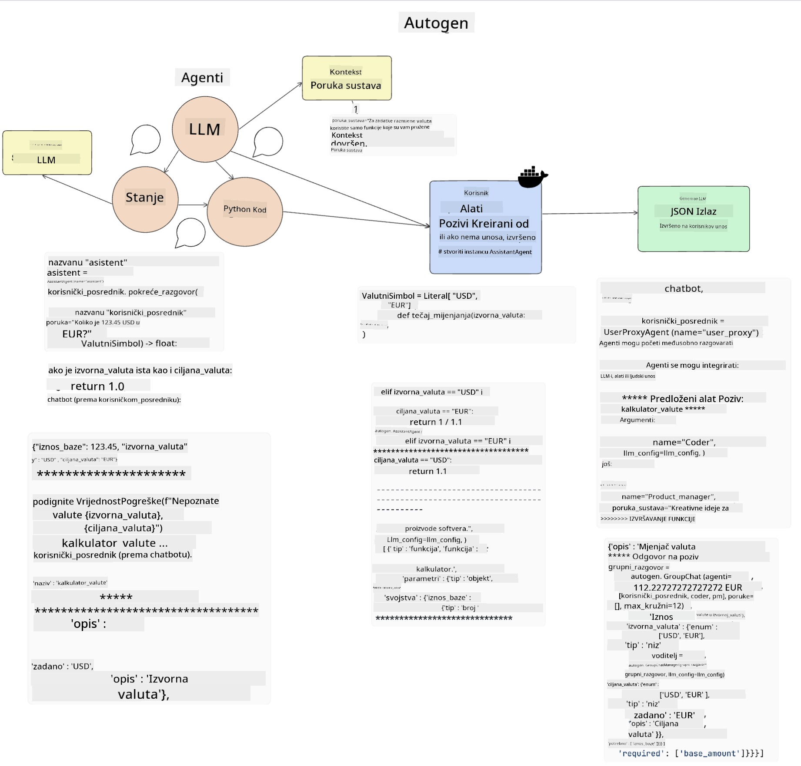
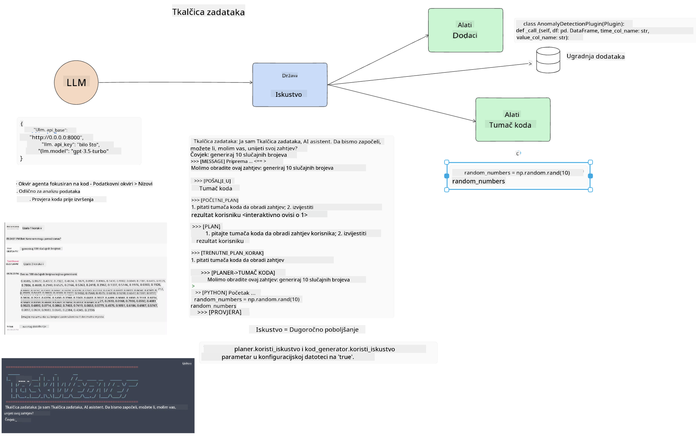
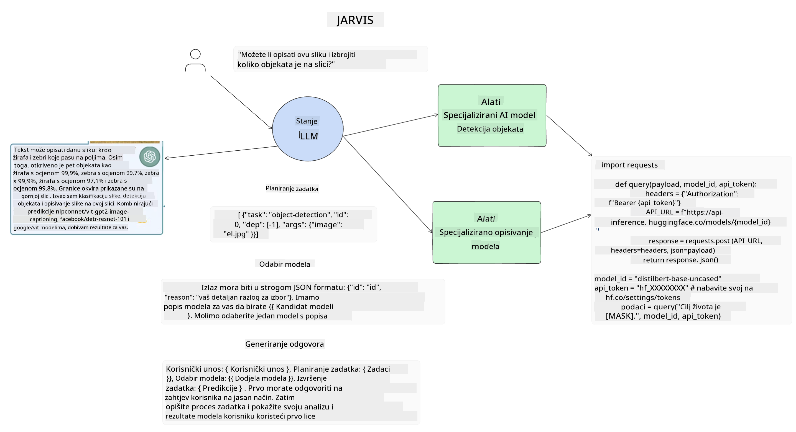

<!--
CO_OP_TRANSLATOR_METADATA:
{
  "original_hash": "11f03c81f190d9cbafd0f977dcbede6c",
  "translation_date": "2025-05-20T07:33:02+00:00",
  "source_file": "17-ai-agents/README.md",
  "language_code": "hr"
}
-->
[](https://aka.ms/gen-ai-lesson17-gh?WT.mc_id=academic-105485-koreyst)

## Uvod

AI agenti predstavljaju uzbudljiv razvoj u Generativnoj AI, omogućujući Velikim Jezičnim Modelima (LLM) da se razviju od asistenata u agente sposobne za poduzimanje akcija. Okviri za AI agente omogućuju programerima stvaranje aplikacija koje daju LLM-ovima pristup alatima i upravljanju stanjem. Ovi okviri također poboljšavaju vidljivost, omogućujući korisnicima i programerima praćenje radnji koje LLM planira, čime se poboljšava upravljanje iskustvom.

Lekcija će obuhvatiti sljedeća područja:

- Razumijevanje što je AI agent - Što točno je AI agent?
- Istraživanje četiri različita okvira za AI agente - Što ih čini jedinstvenima?
- Primjena ovih AI agenata u različitim slučajevima korištenja - Kada trebamo koristiti AI agente?

## Ciljevi učenja

Nakon ove lekcije, bit ćete sposobni:

- Objasniti što su AI agenti i kako se mogu koristiti.
- Razumjeti razlike između nekih popularnih okvira za AI agente i kako se razlikuju.
- Razumjeti kako AI agenti funkcioniraju kako biste mogli graditi aplikacije s njima.

## Što su AI agenti?

AI agenti su vrlo uzbudljivo područje u svijetu Generativne AI. Uz ovo uzbuđenje ponekad dolazi i zbunjenost oko termina i njihove primjene. Da bi stvari bile jednostavne i uključive za većinu alata koji se odnose na AI agente, koristit ćemo ovu definiciju:

AI agenti omogućuju Velikim Jezičnim Modelima (LLM) da obavljaju zadatke dajući im pristup **stanju** i **alatima**.


Definirajmo ove pojmove:

**Veliki Jezični Modeli** - To su modeli na koje se referira tijekom ovog tečaja kao što su GPT-3.5, GPT-4, Llama-2, itd.

**Stanje** - Ovo se odnosi na kontekst u kojem LLM radi. LLM koristi kontekst svojih prošlih akcija i trenutni kontekst, vodeći svoje donošenje odluka za sljedeće akcije. Okviri za AI agente omogućuju programerima lakše održavanje ovog konteksta.

**Alati** - Da bi dovršio zadatak koji je korisnik zatražio i koji je LLM isplanirao, LLM treba pristup alatima. Neki primjeri alata mogu biti baza podataka, API, vanjska aplikacija ili čak drugi LLM!

Ove definicije će vam nadamo se dati dobru osnovu dok dalje istražujemo kako su implementirani. Istražimo nekoliko različitih okvira za AI agente:

## LangChain Agents

[LangChain Agents](https://python.langchain.com/docs/how_to/#agents?WT.mc_id=academic-105485-koreyst) je implementacija definicija koje smo dali gore.

Za upravljanje **stanjem**, koristi ugrađenu funkciju nazvanu `AgentExecutor`. Ova funkcija prihvaća definirane `agent` i `tools` koji su dostupni.

`Agent Executor` također pohranjuje povijest razgovora kako bi pružio kontekst razgovora.



LangChain nudi [katalog alata](https://integrations.langchain.com/tools?WT.mc_id=academic-105485-koreyst) koji se mogu uvesti u vašu aplikaciju u kojoj LLM može dobiti pristup. Ove alate izrađuje zajednica i tim LangChain.

Možete zatim definirati ove alate i proslijediti ih `Agent Executor`.

Vidljivost je još jedan važan aspekt kada govorimo o AI agentima. Važno je da programeri aplikacija razumiju koji alat LLM koristi i zašto. Za to je tim u LangChain razvio LangSmith.

## AutoGen

Sljedeći okvir za AI agente koji ćemo raspraviti je [AutoGen](https://microsoft.github.io/autogen/?WT.mc_id=academic-105485-koreyst). Glavni fokus AutoGena su razgovori. Agenti su i **razgovorljivi** i **prilagodljivi**.

**Razgovorljivi -** LLM-ovi mogu započeti i nastaviti razgovor s drugim LLM-om kako bi dovršili zadatak. To se postiže stvaranjem `AssistantAgents` i davanjem specifične sistemske poruke.

```python

autogen.AssistantAgent( name="Coder", llm_config=llm_config, ) pm = autogen.AssistantAgent( name="Product_manager", system_message="Creative in software product ideas.", llm_config=llm_config, )

```

**Prilagodljivi** - Agenti se mogu definirati ne samo kao LLM-ovi već i kao korisnik ili alat. Kao programer, možete definirati `UserProxyAgent` koji je odgovoran za interakciju s korisnikom radi povratne informacije u dovršavanju zadatka. Ova povratna informacija može ili nastaviti izvršenje zadatka ili ga zaustaviti.

```python
user_proxy = UserProxyAgent(name="user_proxy")
```

### Stanje i Alati

Za promjenu i upravljanje stanjem, pomoćni agent generira Python kod za dovršavanje zadatka.

Evo primjera procesa:



#### LLM definiran sa sistemskom porukom

```python
system_message="For weather related tasks, only use the functions you have been provided with. Reply TERMINATE when the task is done."
```

Ova sistemska poruka usmjerava ovaj specifični LLM prema funkcijama koje su relevantne za njegov zadatak. Zapamtite, s AutoGenom možete imati više definiranih AssistantAgenta s različitim sistemskim porukama.

#### Razgovor započinje korisnik

```python
user_proxy.initiate_chat( chatbot, message="I am planning a trip to NYC next week, can you help me pick out what to wear? ", )

```

Ova poruka od user_proxy (ljudskog) je ono što će pokrenuti proces Agenta da istraži moguće funkcije koje bi trebao izvršiti.

#### Funkcija se izvršava

```bash
chatbot (to user_proxy):

***** Suggested tool Call: get_weather ***** Arguments: {"location":"New York City, NY","time_periond:"7","temperature_unit":"Celsius"} ******************************************************** --------------------------------------------------------------------------------

>>>>>>>> EXECUTING FUNCTION get_weather... user_proxy (to chatbot): ***** Response from calling function "get_weather" ***** 112.22727272727272 EUR ****************************************************************

```

Jednom kada je početni razgovor obrađen, Agent će poslati predloženi alat za poziv. U ovom slučaju, to je funkcija nazvana `get_weather`. Depending on your configuration, this function can be automatically executed and read by the Agent or can be executed based on user input.

You can find a list of [AutoGen code samples](https://microsoft.github.io/autogen/docs/Examples/?WT.mc_id=academic-105485-koreyst) to further explore how to get started building.

## Taskweaver

The next agent framework we will explore is [Taskweaver](https://microsoft.github.io/TaskWeaver/?WT.mc_id=academic-105485-koreyst). It is known as a "code-first" agent because instead of working strictly with `strings` , it can work with DataFrames in Python. This becomes extremely useful for data analysis and generation tasks. This can be things like creating graphs and charts or generating random numbers.

### State and Tools

To manage the state of the conversation, TaskWeaver uses the concept of a `Planner`. The `Planner` is a LLM that takes the request from the users and maps out the tasks that need to be completed to fulfill this request.

To complete the tasks the `Planner` is exposed to the collection of tools called `Plugins`. Ovo mogu biti Python klase ili opći kod interpreter. Ovi dodaci su pohranjeni kao ugrađivanja kako bi LLM bolje mogao pretraživati za pravim dodatkom.



Evo primjera dodatka za rukovanje detekcijom anomalija:

```python
class AnomalyDetectionPlugin(Plugin): def __call__(self, df: pd.DataFrame, time_col_name: str, value_col_name: str):
```

Kod se provjerava prije izvršenja. Još jedna značajka za upravljanje kontekstom u Taskweaveru je `experience`. Experience allows for the context of a conversation to be stored over to the long term in a YAML file. This can be configured so that the LLM improves over time on certain tasks given that it is exposed to prior conversations.

## JARVIS

The last agent framework we will explore is [JARVIS](https://github.com/microsoft/JARVIS?tab=readme-ov-file?WT.mc_id=academic-105485-koreyst). What makes JARVIS unique is that it uses an LLM to manage the `state` razgovora i `tools` su drugi AI modeli. Svaki od AI modela su specijalizirani modeli koji obavljaju određene zadatke kao što su detekcija objekata, transkripcija ili opisivanje slike.



LLM, kao model opće namjene, prima zahtjev od korisnika i identificira specifičan zadatak i bilo koje argumente/podatke koji su potrebni za dovršavanje zadatka.

```python
[{"task": "object-detection", "id": 0, "dep": [-1], "args": {"image": "e1.jpg" }}]
```

LLM zatim oblikuje zahtjev na način da ga specijalizirani AI model može interpretirati, kao što je JSON. Kada AI model vrati svoju predikciju temeljem zadatka, LLM prima odgovor.

Ako je potrebno više modela za dovršavanje zadatka, također će interpretirati odgovor tih modela prije nego ih spoji kako bi generirao odgovor korisniku.

Primjer ispod pokazuje kako bi to funkcioniralo kada korisnik traži opis i broj objekata na slici:

## Zadatak

Da biste nastavili svoje učenje o AI agentima, možete graditi s AutoGenom:

- Aplikaciju koja simulira poslovni sastanak s različitim odjelima obrazovnog startupa.
- Kreirajte sistemske poruke koje vode LLM-ove u razumijevanju različitih persona i prioriteta, te omogućuju korisniku da predstavi novu ideju proizvoda.
- LLM bi zatim trebao generirati naknadna pitanja iz svakog odjela kako bi poboljšao i unaprijedio prezentaciju i ideju proizvoda.

## Učenje ne završava ovdje, nastavite putovanje

Nakon završetka ove lekcije, pogledajte našu [Generative AI Learning kolekciju](https://aka.ms/genai-collection?WT.mc_id=academic-105485-koreyst) kako biste nastavili unapređivati svoje znanje o Generativnoj AI!

**Odricanje odgovornosti**:  
Ovaj dokument je preveden koristeći AI uslugu prevođenja [Co-op Translator](https://github.com/Azure/co-op-translator). Iako se trudimo postići točnost, imajte na umu da automatski prijevodi mogu sadržavati greške ili netočnosti. Izvorni dokument na izvornom jeziku treba smatrati autoritativnim izvorom. Za kritične informacije preporučuje se profesionalni ljudski prijevod. Ne odgovaramo za bilo kakva nesporazuma ili pogrešna tumačenja koja proizlaze iz korištenja ovog prijevoda.