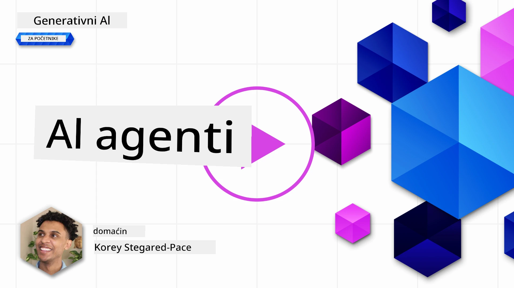
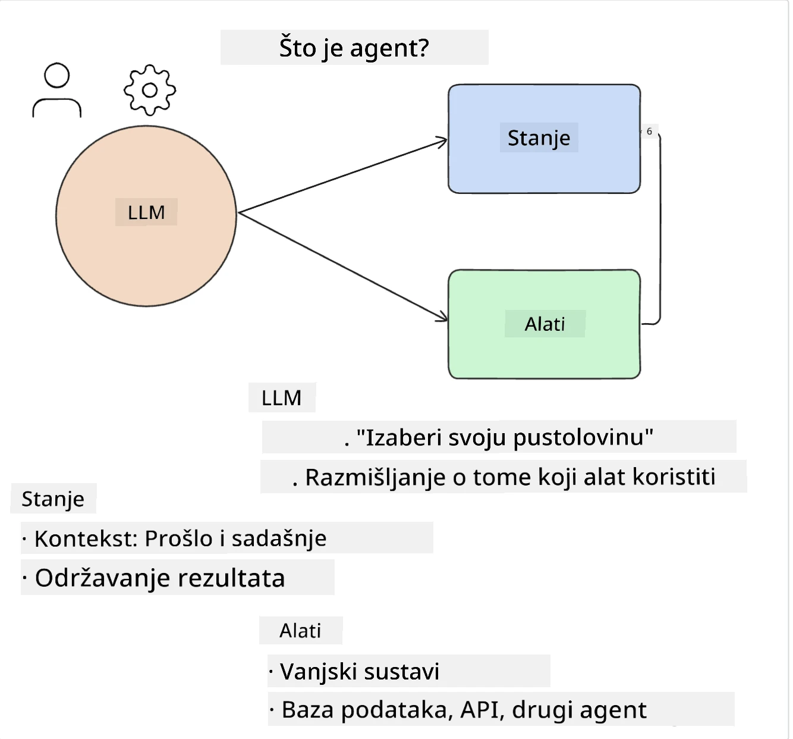
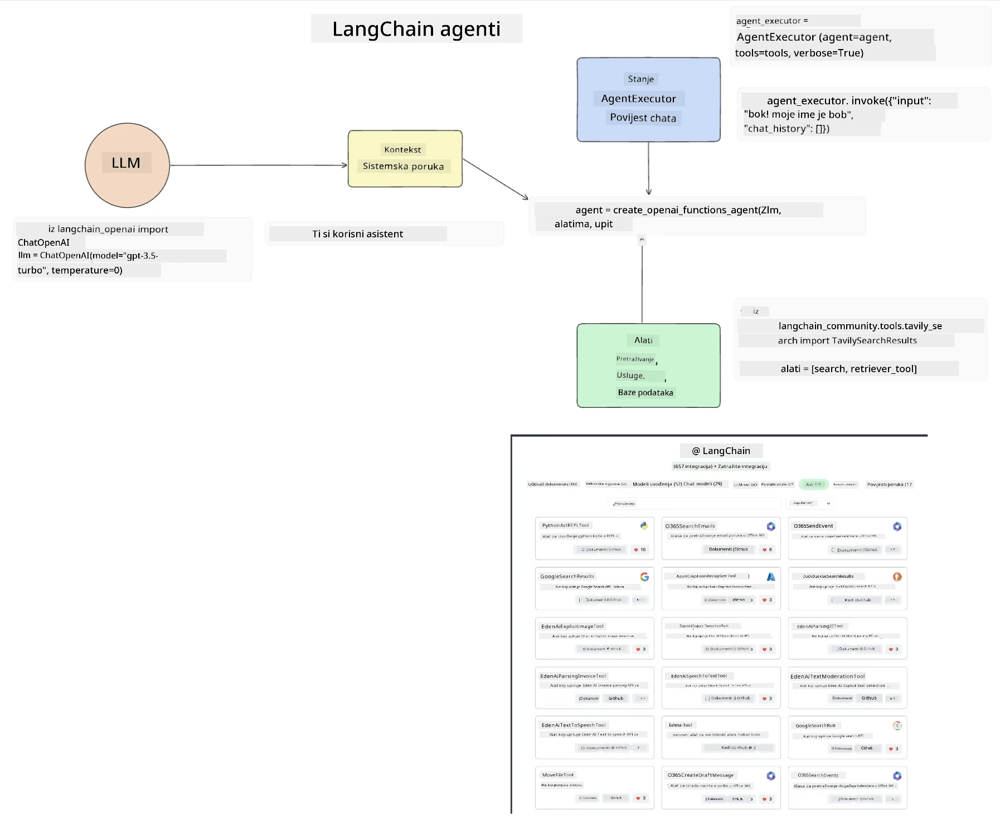
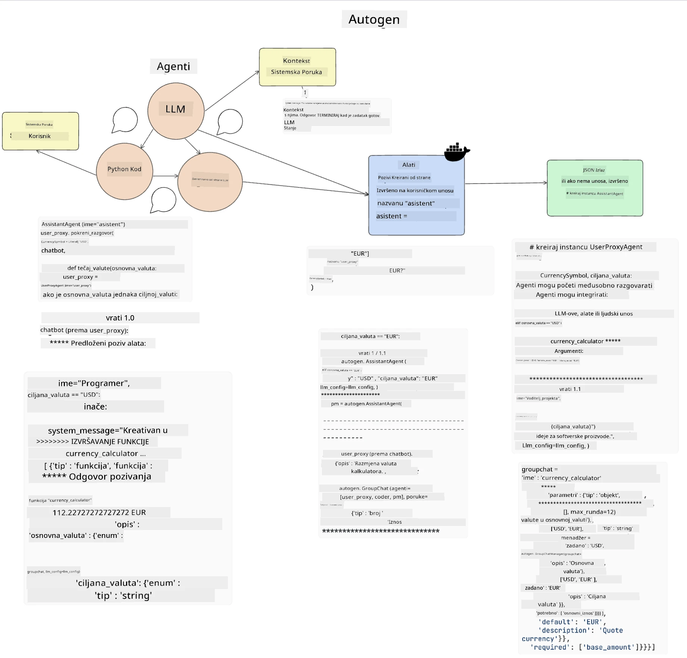
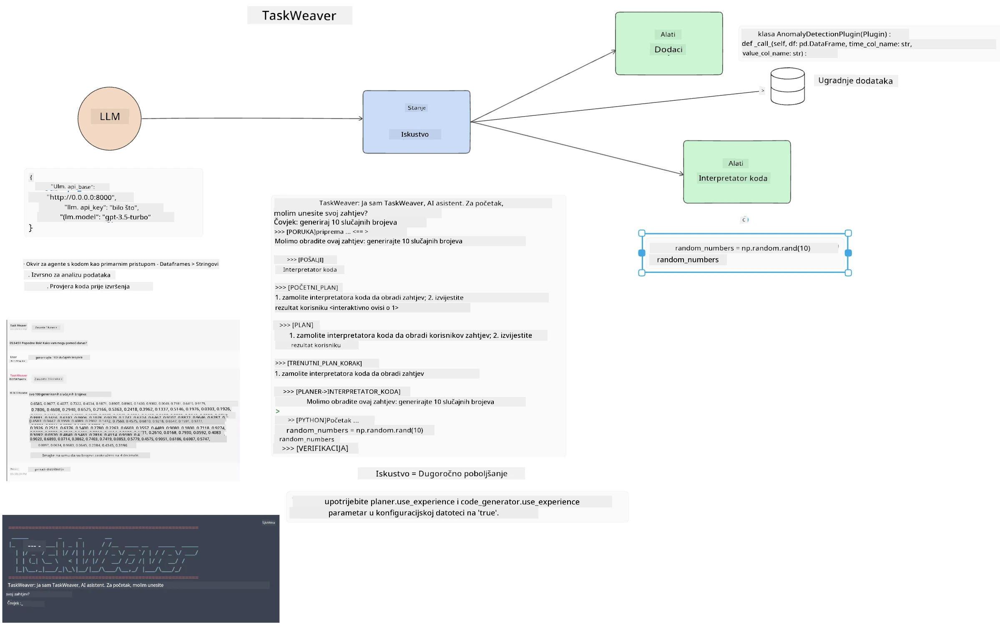
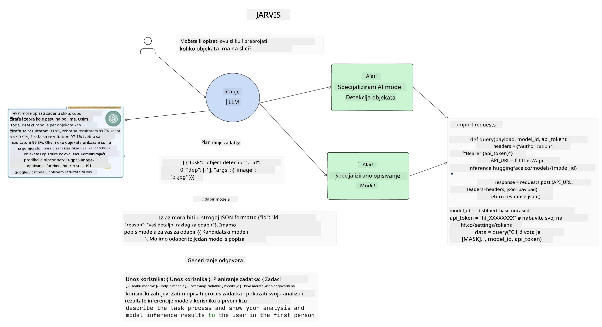

[](https://youtu.be/yAXVW-lUINc?si=bOtW9nL6jc3XJgOM)

## Uvod

AI agenti predstavljaju uzbudljiv razvoj u Generativnoj umjetnoj inteligenciji, omogućujući Velikim jezičnim modelima (LLMs) da evoluiraju iz asistenata u agente sposobne za poduzimanje akcija. Okviri za AI agente omogućuju programerima stvaranje aplikacija koje daju LLM-ovima pristup alatima i upravljanje stanjem. Ti okviri također poboljšavaju vidljivost, dopuštajući korisnicima i programerima da prate planirane akcije LLM-ova, čime se poboljšava upravljanje iskustvom.

Lekcija će obuhvatiti sljedeća područja:

- Razumijevanje što je AI agent - Što točno znači AI agent?
- Istraživanje četiri različita okvira za AI agente - Što ih čini jedinstvenima?
- Primjena ovih AI agenata na različite slučajeve korištenja - Kada bismo trebali koristiti AI agente?

## Ciljevi učenja

Nakon ove lekcije moći ćete:

- Objasniti što su AI agenti i kako se mogu koristiti.
- Razumjeti razlike između nekih popularnih okvira za AI agente i kako se razlikuju.
- Razumjeti kako AI agenti funkcioniraju kako biste mogli graditi aplikacije koristeći ih.

## Što su AI agenti?

AI agenti su vrlo uzbudljivo područje u svijetu Generativne umjetne inteligencije. S time dolazi i ponekad zbunjenost pojmovima i njihovom primjenom. Da bismo stvari pojednostavili i obuhvatili većinu alata koji se odnose na AI agente, koristit ćemo ovu definiciju:

AI agenti dopuštaju Velikim jezičnim modelima (LLMs) da obavljaju zadatke dajući im pristup **stanje** i **alatima**.



Definirajmo ove pojmove:

**Veliki jezični modeli** - To su modeli na koje se poziva kroz ovaj tečaj, poput GPT-3.5, GPT-4, Llama-2 i slično.

**Stanje** - Odnosi se na kontekst u kojem LLM radi. LLM koristi kontekst svojih prethodnih akcija i trenutni kontekst kako bi usmjerio donošenje odluka za sljedeće akcije. Okviri za AI agente olakšavaju programerima održavanje ovog konteksta.

**Alati** - Za izvršenje zadatka koji je korisnik zatražio, a LLM je isplanirao, LLM treba pristup alatima. Neki primjeri alata mogu biti baza podataka, API, vanjska aplikacija ili čak drugi LLM!

Nadamo se da će vam ove definicije pružiti dobru osnovu za daljnje proučavanje implementacije. Pogledajmo nekoliko različitih okvira za AI agente:

## LangChain agenti

[LangChain agenti](https://python.langchain.com/docs/how_to/#agents?WT.mc_id=academic-105485-koreyst) su implementacija definicija koje smo naveli iznad.

Za upravljanje **stanjem** koristi ugrađenu funkciju nazvanu `AgentExecutor`. Ona prima definirani `agent` i `alatima` koji su mu dostupni.

`AgentExecutor` također pohranjuje povijest razgovora kako bi osigurao kontekst chata.



LangChain nudi [katalog alata](https://integrations.langchain.com/tools?WT.mc_id=academic-105485-koreyst) koji se mogu uvesti u vašu aplikaciju, a kojima LLM može pristupiti. Ti su alati izrađeni od strane zajednice i LangChain tima.

Zatim te alate možete definirati i proslijediti ih `AgentExecutor`u.

Vidljivost je još jedan važan aspekt kod AI agenata. Važno je za programere aplikacija razumjeti koji alat LLM koristi i zašto. Zbog toga je tim u LangChainu razvio LangSmith.

## AutoGen

Sljedeći okvir za AI agente koji ćemo razmotriti je [AutoGen](https://microsoft.github.io/autogen/?WT.mc_id=academic-105485-koreyst). Glavni fokus AutoGena su razgovori. Agenti su i **razgovorni** i **prilagodljivi**.

**Razgovorni -** LLM-ovi mogu započeti i nastaviti razgovor s drugim LLM-om kako bi dovršili zadatak. To se radi stvaranjem `AssistantAgents` i dodjeljivanjem specifične sistemske poruke.

```python

autogen.AssistantAgent( name="Coder", llm_config=llm_config, ) pm = autogen.AssistantAgent( name="Product_manager", system_message="Creative in software product ideas.", llm_config=llm_config, )

```

**Prilagodljivi** - Agenti se ne mogu definirati samo kao LLM-ovi već i kao korisnik ili alat. Kao programer, možete definirati `UserProxyAgent` koji je zadužen za interakciju s korisnikom radi povratnih informacija za dovršetak zadatka. Te povratne informacije mogu ili nastaviti izvršenje zadatka ili ga zaustaviti.

```python
user_proxy = UserProxyAgent(name="user_proxy")
```

### Stanje i alati

Za promjenu i upravljanje stanjem, pomoćnički agent generira Python kôd za dovršetak zadatka.

Evo primjera procesa:



#### LLM definiran sistemskom porukom

```python
system_message="For weather related tasks, only use the functions you have been provided with. Reply TERMINATE when the task is done."
```

Ova sistemska poruka usmjerava ovaj specifični LLM na koje su funkcije relevantne za njegov zadatak. Zapamtite, kod AutoGena možete imati više definiranim AssistantAgents s različitim sistemskim porukama.

#### Razgovor pokreće korisnik

```python
user_proxy.initiate_chat( chatbot, message="I am planning a trip to NYC next week, can you help me pick out what to wear? ", )

```

Ova poruka od user_proxy (čovjek) je ono što će pokrenuti proces agenta za istraživanje mogućih funkcija koje bi trebao izvršiti.

#### Funkcija se izvršava

```bash
chatbot (to user_proxy):

***** Suggested tool Call: get_weather ***** Arguments: {"location":"New York City, NY","time_periond:"7","temperature_unit":"Celsius"} ******************************************************** --------------------------------------------------------------------------------

>>>>>>>> EXECUTING FUNCTION get_weather... user_proxy (to chatbot): ***** Response from calling function "get_weather" ***** 112.22727272727272 EUR ****************************************************************

```

Nakon što se početni razgovor obradi, agent će poslati prijedlog alata za pozivanje. U ovom slučaju, to je funkcija nazvana `get_weather`. Ovisno o konfiguraciji, ova funkcija može biti automatski izvršena i pročitana od strane agenta ili se može izvršiti na temelju korisničkog unosa.

Možete pronaći popis [AutoGen primjera koda](https://microsoft.github.io/autogen/docs/Examples/?WT.mc_id=academic-105485-koreyst) za daljnje istraživanje kako započeti s izgradnjom.

## Taskweaver

Sljedeći okvir za agente koji ćemo istražiti je [Taskweaver](https://microsoft.github.io/TaskWeaver/?WT.mc_id=academic-105485-koreyst). Poznat je kao "code-first" agent jer umjesto da radi isključivo s `stringovima`, može raditi s DataFrameovima u Pythonu. Ovo postaje iznimno korisno za zadatke analize i generiranja podataka. To mogu biti stvari poput izrade grafova i dijagrama ili generiranja slučajnih brojeva.

### Stanje i alati

Za upravljanje stanjem razgovora, TaskWeaver koristi koncept `Planera`. `Planer` je LLM koji prima zahtjev korisnika i mapira zadatke koji trebaju biti dovršeni kako bi se ispunio taj zahtjev.

Za dovršetak zadataka planer ima pristup kolekciji alata nazvanih `Plugins`. To mogu biti Python klase ili opći kodni interpretator. Ti dodaci su pohranjeni kao ugrađene reprezentacije (embeddings) tako da LLM može bolje pretraživati pravi dodatak.



Evo primjera dodatka za rukovanje detekcijom anomalija:

```python
class AnomalyDetectionPlugin(Plugin): def __call__(self, df: pd.DataFrame, time_col_name: str, value_col_name: str):
```

Kôd se provjerava prije izvršenja. Još jedna značajka za upravljanje kontekstom u Taskweaveru je `iskustvo` (experience). Experience omogućava da kontekst razgovora bude pohranjen za dugoročno u YAML datoteci. To se može konfigurirati tako da LLM s vremenom poboljšava rad na određenim zadacima ako mu je izložen prethodnim razgovorima.

## JARVIS

Posljednji okvir za agente koji ćemo istražiti je [JARVIS](https://github.com/microsoft/JARVIS?tab=readme-ov-file&WT.mc_id=academic-105485-koreyst). Ono što čini JARVIS jedinstvenim je to što koristi LLM za upravljanje `stanjem` razgovora, a `alati` su drugi AI modeli. Svaki od AI modela su specijalizirani modeli koji obavljaju određene zadatke poput detekcije objekata, transkripcije ili opisivanja slika.



LLM, kao model opće namjene, prima zahtjev korisnika i identificira specifičan zadatak i bilo koje argumente/podatke potrebne za izvršenje zadatka.

```python
[{"task": "object-detection", "id": 0, "dep": [-1], "args": {"image": "e1.jpg" }}]
```

Zatim LLM formatira zahtjev na način koji specijalizirani AI model može interpretirati, poput JSON-a. Kada AI model vrati svoju predikciju za zadatak, LLM prima odgovor.

Ako je za dovršetak zadatka potrebno više modela, LLM će također interpretirati odgovore tih modela prije nego što ih objedini kako bi generirao odgovor korisniku.

Primjer u nastavku pokazuje kako bi ovo funkcioniralo kada korisnik traži opis i broj objekata na slici:

## Zadatak

Za nastavak učenja o AI agentima možete graditi s AutoGenom:

- Aplikaciju koja simulira poslovni sastanak s različitim odjelima jedne startup tvrtke iz obrazovanja.
- Kreirajte sistemske poruke koje usmjeravaju LLM-ove u razumijevanju različitih persona i prioriteta te omogućuju korisniku predstavljanje nove ideje proizvoda.
- Zatim bi LLM trebao generirati pitanja za daljnju raspravu iz svakog odjela kako bi se dodatno usavršila i poboljšala ideja i prezentacija proizvoda.

## Učenje ne staje ovdje, nastavite putovanje

Po završetku ove lekcije, pogledajte našu [kolekciju za učenje Generativne AI](https://aka.ms/genai-collection?WT.mc_id=academic-105485-koreyst) kako biste nastavili podizati svoje znanje o Generativnoj AI!

---

<!-- CO-OP TRANSLATOR DISCLAIMER START -->
**Izjava o odricanju od odgovornosti**:  
Ovaj dokument preveden je pomoću AI prevoditeljskog servisa [Co-op Translator](https://github.com/Azure/co-op-translator). Iako nastojimo osigurati točnost, imajte na umu da automatski prijevodi mogu sadržavati pogreške ili netočnosti. Izvorni dokument na izvornom jeziku trebao bi se smatrati autoritativnim izvorom. Za kritične informacije preporučuje se profesionalni ljudski prijevod. Nismo odgovorni za bilo kakve nesporazume ili pogrešna tumačenja proizašla iz korištenja ovog prijevoda.
<!-- CO-OP TRANSLATOR DISCLAIMER END -->