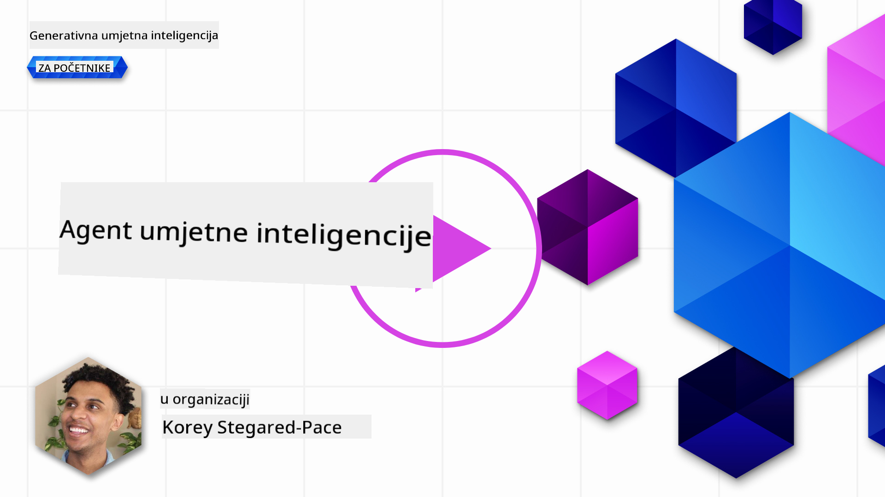
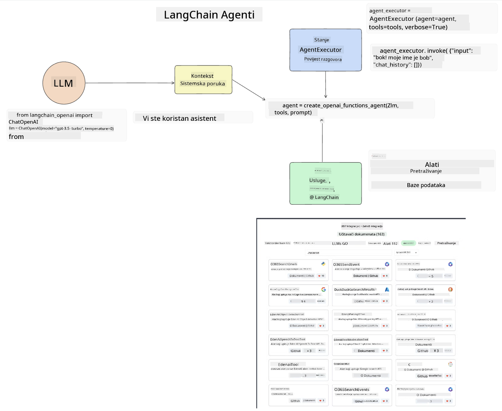

<!--
CO_OP_TRANSLATOR_METADATA:
{
  "original_hash": "11f03c81f190d9cbafd0f977dcbede6c",
  "translation_date": "2025-07-09T17:32:21+00:00",
  "source_file": "17-ai-agents/README.md",
  "language_code": "hr"
}
-->
[](https://aka.ms/gen-ai-lesson17-gh?WT.mc_id=academic-105485-koreyst)

## Uvod

AI Agenti predstavljaju uzbudljiv razvoj u Generativnoj AI, omogućujući Velikim Jezičnim Modelima (LLM-ovima) da se razviju iz pomoćnika u agente sposobne za poduzimanje radnji. Okviri za AI Agente omogućuju programerima stvaranje aplikacija koje daju LLM-ovima pristup alatima i upravljanju stanjem. Ti okviri također poboljšavaju vidljivost, omogućujući korisnicima i programerima praćenje radnji koje LLM planira, čime se poboljšava upravljanje iskustvom.

Lekcija će obuhvatiti sljedeća područja:

- Razumijevanje što je AI Agent - Što točno znači AI Agent?
- Istraživanje četiri različita okvira za AI Agente - Što ih čini jedinstvenima?
- Primjena ovih AI Agenata u različitim slučajevima upotrebe - Kada bismo trebali koristiti AI Agente?

## Ciljevi učenja

Nakon ove lekcije moći ćete:

- Objasniti što su AI Agenti i kako se mogu koristiti.
- Razumjeti razlike između nekih popularnih okvira za AI Agente i kako se razlikuju.
- Shvatiti kako AI Agenti funkcioniraju kako biste mogli graditi aplikacije s njima.

## Što su AI Agenti?

AI Agenti su vrlo uzbudljivo područje u svijetu Generativne AI. Uz to uzbuđenje često dolazi i zbunjenost pojmova i njihove primjene. Kako bismo stvari pojednostavili i uključili većinu alata koji se odnose na AI Agente, koristit ćemo ovu definiciju:

AI Agenti omogućuju Velikim Jezičnim Modelima (LLM-ovima) da obavljaju zadatke dajući im pristup **stanju** i **alatima**.


Definirajmo ove pojmove:

**Veliki Jezični Modeli** - To su modeli o kojima se govori u ovom tečaju, poput GPT-3.5, GPT-4, Llama-2 i slično.

**Stanje** - Odnosi se na kontekst u kojem LLM radi. LLM koristi kontekst svojih prethodnih radnji i trenutni kontekst kako bi usmjerio donošenje odluka za sljedeće radnje. Okviri za AI Agente omogućuju programerima lakše održavanje tog konteksta.

**Alati** - Da bi dovršio zadatak koji je korisnik zatražio i koji je LLM isplanirao, LLM treba pristup alatima. Primjeri alata mogu biti baza podataka, API, vanjska aplikacija ili čak drugi LLM!

Ove definicije će vam, nadamo se, pružiti dobru osnovu dok istražujemo kako se oni implementiraju. Pogledajmo nekoliko različitih okvira za AI Agente:

## LangChain Agenti

[LangChain Agenti](https://python.langchain.com/docs/how_to/#agents?WT.mc_id=academic-105485-koreyst) su implementacija gore navedenih definicija.

Za upravljanje **stanjem** koristi ugrađenu funkciju nazvanu `AgentExecutor`. Ona prima definirani `agent` i `tools` koji su mu dostupni.

`AgentExecutor` također pohranjuje povijest razgovora kako bi pružio kontekst chata.



LangChain nudi [katalog alata](https://integrations.langchain.com/tools?WT.mc_id=academic-105485-koreyst) koje možete uvesti u svoju aplikaciju i kojima LLM može pristupiti. Ti alati su izrađeni od strane zajednice i LangChain tima.

Zatim možete definirati te alate i proslijediti ih `AgentExecutoru`.

Vidljivost je još jedan važan aspekt kada govorimo o AI Agentima. Važno je da programeri aplikacija razumiju koji alat LLM koristi i zašto. Za to je tim LangChain razvio LangSmith.

## AutoGen

Sljedeći okvir za AI Agente o kojem ćemo govoriti je [AutoGen](https://microsoft.github.io/autogen/?WT.mc_id=academic-105485-koreyst). Glavni fokus AutoGena su razgovori. Agenti su i **razgovorni** i **prilagodljivi**.

**Razgovorni -** LLM-ovi mogu započeti i nastaviti razgovor s drugim LLM-om kako bi dovršili zadatak. To se radi stvaranjem `AssistantAgents` i dodjeljivanjem specifične sistemske poruke.

```python

autogen.AssistantAgent( name="Coder", llm_config=llm_config, ) pm = autogen.AssistantAgent( name="Product_manager", system_message="Creative in software product ideas.", llm_config=llm_config, )

```

**Prilagodljivi** - Agenti se mogu definirati ne samo kao LLM-ovi, već i kao korisnik ili alat. Kao programer možete definirati `UserProxyAgent` koji je odgovoran za interakciju s korisnikom radi povratnih informacija u izvršavanju zadatka. Te povratne informacije mogu ili nastaviti izvršenje zadatka ili ga zaustaviti.

```python
user_proxy = UserProxyAgent(name="user_proxy")
```

### Stanje i alati

Za promjenu i upravljanje stanjem, pomoćni Agent generira Python kod za dovršetak zadatka.

Evo primjera procesa:


#### LLM definiran sistemskom porukom

```python
system_message="For weather related tasks, only use the functions you have been provided with. Reply TERMINATE when the task is done."
```

Ova sistemska poruka usmjerava ovaj specifični LLM na koje su funkcije relevantne za njegov zadatak. Zapamtite, s AutoGenom možete imati više definirani AssistantAgents s različitim sistemskim porukama.

#### Chat započinje korisnik

```python
user_proxy.initiate_chat( chatbot, message="I am planning a trip to NYC next week, can you help me pick out what to wear? ", )

```

Ova poruka od user_proxy (čovjeka) pokreće proces u kojem Agent istražuje moguće funkcije koje treba izvršiti.

#### Funkcija se izvršava

```bash
chatbot (to user_proxy):

***** Suggested tool Call: get_weather ***** Arguments: {"location":"New York City, NY","time_periond:"7","temperature_unit":"Celsius"} ******************************************************** --------------------------------------------------------------------------------

>>>>>>>> EXECUTING FUNCTION get_weather... user_proxy (to chatbot): ***** Response from calling function "get_weather" ***** 112.22727272727272 EUR ****************************************************************

```

Nakon što se obradi početni chat, Agent šalje prijedlog alata za pozivanje. U ovom slučaju, to je funkcija nazvana `get_weather`. Ovisno o vašoj konfiguraciji, ta funkcija može se automatski izvršiti i pročitati od strane Agenta ili se može izvršiti na temelju korisničkog unosa.

Možete pronaći popis [AutoGen primjera koda](https://microsoft.github.io/autogen/docs/Examples/?WT.mc_id=academic-105485-koreyst) za daljnje istraživanje kako započeti s izradom.

## Taskweaver

Sljedeći okvir za agente koji ćemo istražiti je [Taskweaver](https://microsoft.github.io/TaskWeaver/?WT.mc_id=academic-105485-koreyst). Poznat je kao "code-first" agent jer umjesto da radi isključivo s `stringovima`, može raditi s DataFrameovima u Pythonu. Ovo postaje izuzetno korisno za zadatke analize podataka i generiranja. To mogu biti stvari poput izrade grafikona i dijagrama ili generiranja slučajnih brojeva.

### Stanje i alati

Za upravljanje stanjem razgovora, TaskWeaver koristi koncept `Planner`. `Planner` je LLM koji prima zahtjev od korisnika i mapira zadatke koje treba dovršiti da bi se ispunio taj zahtjev.

Za dovršetak zadataka, `Planner` ima pristup zbirci alata nazvanih `Plugins`. To mogu biti Python klase ili opći interpretator koda. Ti pluginovi se pohranjuju kao embeddings kako bi LLM mogao bolje pretraživati odgovarajući plugin.


Evo primjera plugina za detekciju anomalija:

```python
class AnomalyDetectionPlugin(Plugin): def __call__(self, df: pd.DataFrame, time_col_name: str, value_col_name: str):
```

Kod se provjerava prije izvršenja. Još jedna značajka za upravljanje kontekstom u Taskweaveru je `experience`. Experience omogućuje da se kontekst razgovora pohrani na duži rok u YAML datoteku. Ovo se može konfigurirati tako da LLM s vremenom poboljšava određene zadatke, pod uvjetom da je izložen prethodnim razgovorima.

## JARVIS

Posljednji okvir za agente koji ćemo istražiti je [JARVIS](https://github.com/microsoft/JARVIS?tab=readme-ov-file?WT.mc_id=academic-105485-koreyst). Ono što JARVIS čini jedinstvenim jest to što koristi LLM za upravljanje `stanjem` razgovora, dok su `tools` drugi AI modeli. Svaki od tih AI modela su specijalizirani modeli koji obavljaju određene zadatke poput detekcije objekata, transkripcije ili opisivanja slika.


LLM, kao model opće namjene, prima zahtjev od korisnika i identificira specifični zadatak te sve argumente/podatke potrebne za dovršetak zadatka.

```python
[{"task": "object-detection", "id": 0, "dep": [-1], "args": {"image": "e1.jpg" }}]
```

LLM zatim formatira zahtjev na način koji specijalizirani AI model može interpretirati, poput JSON-a. Nakon što AI model vrati svoju predikciju na temelju zadatka, LLM prima odgovor.

Ako je za dovršetak zadatka potrebno više modela, LLM će također interpretirati odgovore tih modela prije nego što ih objedini i generira odgovor korisniku.

Primjer ispod pokazuje kako bi to funkcioniralo kada korisnik traži opis i broj objekata na slici:

## Zadatak

Za nastavak učenja o AI Agentima možete izgraditi s AutoGenom:

- Aplikaciju koja simulira poslovni sastanak različitih odjela obrazovnog startup-a.
- Kreirajte sistemske poruke koje usmjeravaju LLM-ove u razumijevanju različitih persona i prioriteta, te omogućuju korisniku da predstavi novu ideju proizvoda.
- LLM bi zatim trebao generirati dodatna pitanja od svakog odjela kako bi se usavršila i poboljšala prezentacija i ideja proizvoda.

## Učenje ne prestaje ovdje, nastavite putovanje

Nakon što završite ovu lekciju, pogledajte našu [Generative AI Learning kolekciju](https://aka.ms/genai-collection?WT.mc_id=academic-105485-koreyst) kako biste nastavili podizati svoje znanje o Generativnoj AI!

**Odricanje od odgovornosti**:  
Ovaj dokument je preveden korištenjem AI usluge za prevođenje [Co-op Translator](https://github.com/Azure/co-op-translator). Iako nastojimo postići točnost, imajte na umu da automatski prijevodi mogu sadržavati pogreške ili netočnosti. Izvorni dokument na izvornom jeziku treba smatrati autoritativnim izvorom. Za kritične informacije preporučuje se profesionalni ljudski prijevod. Ne snosimo odgovornost za bilo kakva nesporazuma ili pogrešna tumačenja koja proizlaze iz korištenja ovog prijevoda.