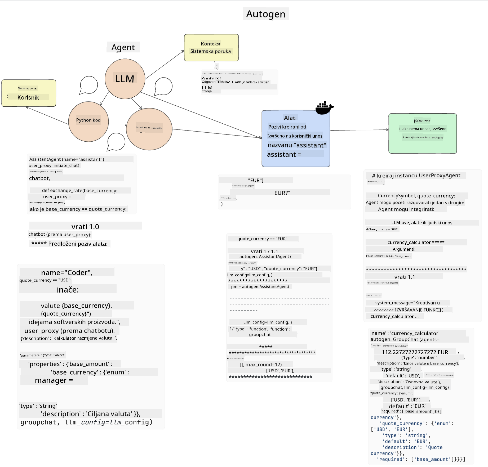
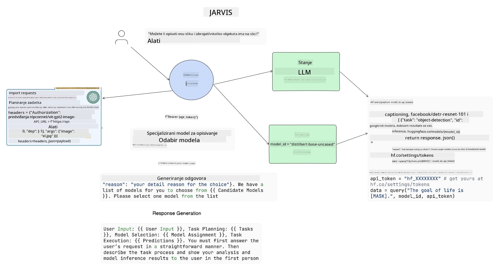

<!--
CO_OP_TRANSLATOR_METADATA:
{
  "original_hash": "8e8d1f6a63da606af7176a87ff8e92b6",
  "translation_date": "2025-10-18T01:37:13+00:00",
  "source_file": "17-ai-agents/README.md",
  "language_code": "hr"
}
-->
[](https://youtu.be/yAXVW-lUINc?si=bOtW9nL6jc3XJgOM)

## Uvod

AI agenti predstavljaju uzbudljiv razvoj u području generativne umjetne inteligencije, omogućujući velikim jezičnim modelima (LLMs) da se razviju od asistenata u agente sposobne za poduzimanje radnji. Okviri za AI agente omogućuju programerima stvaranje aplikacija koje daju LLM-ovima pristup alatima i upravljanju stanjem. Ovi okviri također poboljšavaju vidljivost, omogućujući korisnicima i programerima praćenje radnji koje LLM-ovi planiraju, čime se poboljšava upravljanje iskustvom.

Lekcija će obuhvatiti sljedeće teme:

- Razumijevanje što je AI agent - Što točno predstavlja AI agent?
- Istraživanje četiri različita okvira za AI agente - Što ih čini jedinstvenima?
- Primjena ovih AI agenata na različite slučajeve upotrebe - Kada ih trebamo koristiti?

## Ciljevi učenja

Nakon ove lekcije, moći ćete:

- Objasniti što su AI agenti i kako se mogu koristiti.
- Razumjeti razlike između nekih popularnih okvira za AI agente i kako se razlikuju.
- Shvatiti kako AI agenti funkcioniraju kako biste mogli graditi aplikacije s njima.

## Što su AI agenti?

AI agenti su vrlo uzbudljivo područje u svijetu generativne umjetne inteligencije. S ovom uzbudljivošću ponekad dolazi i zbunjenost oko pojmova i njihove primjene. Kako bismo stvari pojednostavili i uključili većinu alata koji se odnose na AI agente, koristit ćemo ovu definiciju:

AI agenti omogućuju velikim jezičnim modelima (LLMs) obavljanje zadataka dajući im pristup **stanju** i **alatima**.


Definirajmo ove pojmove:

**Veliki jezični modeli** - To su modeli spomenuti tijekom ovog tečaja, poput GPT-3.5, GPT-4, Llama-2 itd.

**Stanje** - Odnosi se na kontekst u kojem LLM radi. LLM koristi kontekst svojih prošlih radnji i trenutni kontekst kako bi usmjerio donošenje odluka za sljedeće radnje. Okviri za AI agente omogućuju programerima lakše održavanje ovog konteksta.

**Alati** - Kako bi dovršio zadatak koji je korisnik zatražio, a koji je LLM isplanirao, LLM treba pristup alatima. Neki primjeri alata mogu biti baza podataka, API, vanjska aplikacija ili čak drugi LLM!

Ove definicije trebale bi vam pružiti dobru osnovu za daljnje istraživanje kako se implementiraju. Pogledajmo nekoliko različitih okvira za AI agente:

## LangChain Agents

[LangChain Agents](https://python.langchain.com/docs/how_to/#agents?WT.mc_id=academic-105485-koreyst) je implementacija definicija koje smo gore naveli.

Za upravljanje **stanjem**, koristi ugrađenu funkciju pod nazivom `AgentExecutor`. Ova funkcija prihvaća definirani `agent` i dostupne `alate`.

`AgentExecutor` također pohranjuje povijest razgovora kako bi pružio kontekst razgovora.


LangChain nudi [katalog alata](https://integrations.langchain.com/tools?WT.mc_id=academic-105485-koreyst) koji se mogu uvesti u vašu aplikaciju, omogućujući LLM-u pristup tim alatima. Ove alate kreira zajednica i tim LangChain-a.

Možete definirati te alate i proslijediti ih `AgentExecutoru`.

Vidljivost je još jedan važan aspekt kada govorimo o AI agentima. Važno je da programeri aplikacija razumiju koji alat LLM koristi i zašto. Za to je tim LangChain-a razvio LangSmith.

## AutoGen

Sljedeći okvir za AI agente koji ćemo raspraviti je [AutoGen](https://microsoft.github.io/autogen/?WT.mc_id=academic-105485-koreyst). Glavni fokus AutoGena su razgovori. Agenti su i **razgovorni** i **prilagodljivi**.

**Razgovorni -** LLM-ovi mogu započeti i nastaviti razgovor s drugim LLM-om kako bi dovršili zadatak. To se postiže stvaranjem `AssistantAgents` i dodjeljivanjem specifične sistemske poruke.

```python

autogen.AssistantAgent( name="Coder", llm_config=llm_config, ) pm = autogen.AssistantAgent( name="Product_manager", system_message="Creative in software product ideas.", llm_config=llm_config, )

```

**Prilagodljivi** - Agenti se mogu definirati ne samo kao LLM-ovi, već i kao korisnici ili alati. Kao programer, možete definirati `UserProxyAgent` koji je odgovoran za interakciju s korisnikom radi povratnih informacija u dovršavanju zadatka. Ove povratne informacije mogu nastaviti izvršavanje zadatka ili ga zaustaviti.

```python
user_proxy = UserProxyAgent(name="user_proxy")
```

### Stanje i alati

Za promjenu i upravljanje stanjem, pomoćni agent generira Python kod za dovršavanje zadatka.

Evo primjera procesa:



#### LLM definiran sistemskom porukom

```python
system_message="For weather related tasks, only use the functions you have been provided with. Reply TERMINATE when the task is done."
```

Ova sistemska poruka usmjerava ovaj specifični LLM na funkcije koje su relevantne za njegov zadatak. Zapamtite, s AutoGenom možete imati više definiranih AssistantAgents s različitim sistemskim porukama.

#### Razgovor započinje korisnik

```python
user_proxy.initiate_chat( chatbot, message="I am planning a trip to NYC next week, can you help me pick out what to wear? ", )

```

Ova poruka od user_proxy (ljudskog korisnika) pokreće proces agenta da istraži moguće funkcije koje bi trebao izvršiti.

#### Funkcija se izvršava

```bash
chatbot (to user_proxy):

***** Suggested tool Call: get_weather ***** Arguments: {"location":"New York City, NY","time_periond:"7","temperature_unit":"Celsius"} ******************************************************** --------------------------------------------------------------------------------

>>>>>>>> EXECUTING FUNCTION get_weather... user_proxy (to chatbot): ***** Response from calling function "get_weather" ***** 112.22727272727272 EUR ****************************************************************

```

Nakon što se početni razgovor obradi, agent će predložiti alat koji treba pozvati. U ovom slučaju, to je funkcija nazvana `get_weather`. Ovisno o vašoj konfiguraciji, ova funkcija može biti automatski izvršena i pročitana od strane agenta ili se može izvršiti na temelju korisničkog unosa.

Možete pronaći popis [AutoGen primjera koda](https://microsoft.github.io/autogen/docs/Examples/?WT.mc_id=academic-105485-koreyst) za daljnje istraživanje kako započeti s izradom.

## Taskweaver

Sljedeći okvir za agente koji ćemo istražiti je [Taskweaver](https://microsoft.github.io/TaskWeaver/?WT.mc_id=academic-105485-koreyst). Poznat je kao agent "prvo kod" jer umjesto da radi isključivo s `stringovima`, može raditi s DataFrames u Pythonu. Ovo postaje izuzetno korisno za zadatke analize podataka i generiranja. To mogu biti stvari poput stvaranja grafova i dijagrama ili generiranja slučajnih brojeva.

### Stanje i alati

Za upravljanje stanjem razgovora, TaskWeaver koristi koncept `Plannera`. `Planner` je LLM koji prima zahtjev od korisnika i mapira zadatke koje treba dovršiti kako bi se ispunio taj zahtjev.

Za dovršavanje zadataka, `Planner` ima pristup zbirci alata nazvanih `Plugins`. To mogu biti Python klase ili opći interpreter koda. Ovi pluginovi se pohranjuju kao ugrađeni podaci kako bi LLM mogao bolje pretraživati odgovarajući plugin.


Evo primjera plugina za detekciju anomalija:

```python
class AnomalyDetectionPlugin(Plugin): def __call__(self, df: pd.DataFrame, time_col_name: str, value_col_name: str):
```

Kod se provjerava prije izvršavanja. Još jedna značajka za upravljanje kontekstom u TaskWeaveru je `experience`. Experience omogućuje da se kontekst razgovora dugoročno pohrani u YAML datoteku. Ovo se može konfigurirati tako da LLM s vremenom poboljšava određene zadatke s obzirom na prethodne razgovore.

## JARVIS

Posljednji okvir za agente koji ćemo istražiti je [JARVIS](https://github.com/microsoft/JARVIS?tab=readme-ov-file?WT.mc_id=academic-105485-koreyst). Ono što JARVIS čini jedinstvenim jest to što koristi LLM za upravljanje `stanjem` razgovora, dok su `alati` drugi AI modeli. Svaki od AI modela su specijalizirani modeli koji obavljaju određene zadatke poput detekcije objekata, transkripcije ili opisivanja slika.



LLM, kao model opće namjene, prima zahtjev od korisnika i identificira specifičan zadatak te sve argumente/podatke potrebne za dovršavanje zadatka.

```python
[{"task": "object-detection", "id": 0, "dep": [-1], "args": {"image": "e1.jpg" }}]
```

LLM zatim formatira zahtjev na način koji specijalizirani AI model može interpretirati, poput JSON-a. Kada AI model vrati svoju predikciju na temelju zadatka, LLM prima odgovor.

Ako je potrebno više modela za dovršavanje zadatka, LLM će također interpretirati odgovore tih modela prije nego što ih spoji kako bi generirao odgovor korisniku.

Primjer u nastavku pokazuje kako bi to funkcioniralo kada korisnik zatraži opis i broj objekata na slici:

## Zadatak

Za nastavak učenja o AI agentima možete izraditi aplikaciju s AutoGenom:

- Aplikaciju koja simulira poslovni sastanak s različitim odjelima obrazovnog startupa.
- Kreirajte sistemske poruke koje usmjeravaju LLM-ove u razumijevanju različitih osobnosti i prioriteta te omogućuju korisniku da predstavi novu ideju za proizvod.
- LLM bi zatim trebao generirati dodatna pitanja od svakog odjela kako bi se ideja i proizvod dodatno razradili i poboljšali.

## Učenje ne završava ovdje, nastavite svoje putovanje

Nakon završetka ove lekcije, pogledajte našu [kolekciju za učenje o generativnoj umjetnoj inteligenciji](https://aka.ms/genai-collection?WT.mc_id=academic-105485-koreyst) kako biste nastavili unapređivati svoje znanje o generativnoj umjetnoj inteligenciji!

---

**Izjava o odricanju odgovornosti**:  
Ovaj dokument je preveden pomoću AI usluge za prevođenje [Co-op Translator](https://github.com/Azure/co-op-translator). Iako nastojimo osigurati točnost, imajte na umu da automatski prijevodi mogu sadržavati pogreške ili netočnosti. Izvorni dokument na izvornom jeziku treba smatrati autoritativnim izvorom. Za ključne informacije preporučuje se profesionalni prijevod od strane čovjeka. Ne preuzimamo odgovornost za nesporazume ili pogrešna tumačenja koja mogu proizaći iz korištenja ovog prijevoda.