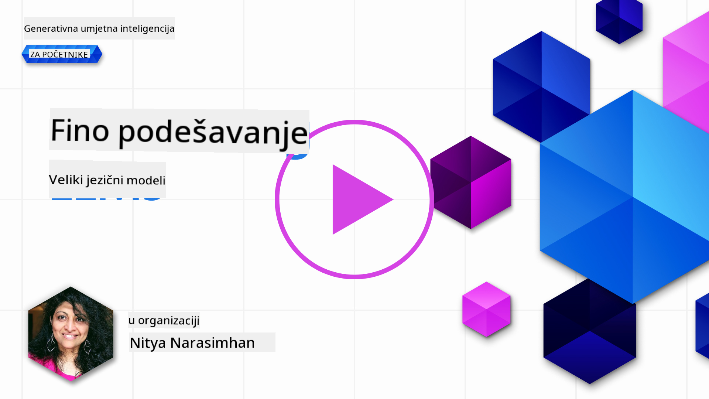
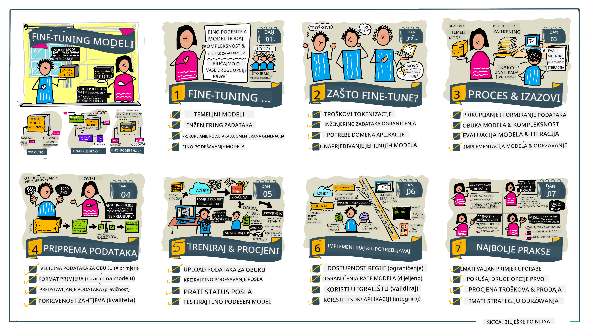

<!--
CO_OP_TRANSLATOR_METADATA:
{
  "original_hash": "68664f7e754a892ae1d8d5e2b7bd2081",
  "translation_date": "2025-05-20T08:22:54+00:00",
  "source_file": "18-fine-tuning/README.md",
  "language_code": "hr"
}
-->

# Fino podešavanje vašeg LLM-a

Korištenje velikih jezičnih modela za izgradnju aplikacija generativne umjetne inteligencije donosi nove izazove. Ključno pitanje je osiguranje kvalitete odgovora (točnosti i relevantnosti) u sadržaju koji model generira za određeni korisnički zahtjev. U prethodnim lekcijama, raspravljali smo o tehnikama kao što su inženjering upita i generacija potpomognuta pretraživanjem koje pokušavaju riješiti problem _modificiranjem ulaza upita_ postojećem modelu.

U današnjoj lekciji raspravljamo o trećoj tehnici, **fino podešavanje**, koja pokušava riješiti izazov _ponovnim treniranjem samog modela_ s dodatnim podacima. Uronimo u detalje.

## Ciljevi učenja

Ova lekcija uvodi koncept finog podešavanja za unaprijed trenirane jezične modele, istražuje prednosti i izazove ovog pristupa te pruža smjernice o tome kada i kako koristiti fino podešavanje za poboljšanje performansi vaših generativnih AI modela.

Na kraju ove lekcije trebali biste moći odgovoriti na sljedeća pitanja:

- Što je fino podešavanje za jezične modele?
- Kada i zašto je fino podešavanje korisno?
- Kako mogu fino podesiti unaprijed trenirani model?
- Koja su ograničenja finog podešavanja?

Spremni? Krenimo.

## Ilustrirani vodič

Želite li dobiti širu sliku o onome što ćemo pokriti prije nego što uronimo? Pogledajte ovaj ilustrirani vodič koji opisuje put učenja za ovu lekciju - od učenja osnovnih koncepata i motivacije za fino podešavanje, do razumijevanja procesa i najboljih praksi za izvršavanje zadatka finog podešavanja. Ovo je fascinantna tema za istraživanje, stoga ne zaboravite provjeriti [Resurse](./RESOURCES.md?WT.mc_id=academic-105485-koreyst) za dodatne poveznice koje podržavaju vaše samostalno učenje!

## Što je fino podešavanje za jezične modele?

Po definiciji, veliki jezični modeli su _unaprijed trenirani_ na velikim količinama teksta prikupljenog iz raznih izvora uključujući internet. Kao što smo naučili u prethodnim lekcijama, trebamo tehnike kao što su _inženjering upita_ i _generacija potpomognuta pretraživanjem_ kako bismo poboljšali kvalitetu odgovora modela na korisnička pitanja ("upite").

Popularna tehnika inženjeringa upita uključuje davanje modelu više smjernica o tome što se očekuje u odgovoru bilo pružanjem _uputa_ (eksplicitne smjernice) ili _davši mu nekoliko primjera_ (implicitne smjernice). To se naziva _učenje s malo primjera_ ali ima dva ograničenja:

- Ograničenja broja tokena modela mogu ograničiti broj primjera koje možete dati, i ograničiti učinkovitost.
- Troškovi tokena modela mogu učiniti skupo dodavanje primjera svakom upitu, i ograničiti fleksibilnost.

Fino podešavanje je uobičajena praksa u sustavima strojnog učenja gdje uzimamo unaprijed trenirani model i ponovno ga treniramo s novim podacima kako bismo poboljšali njegovu izvedbu na specifičnom zadatku. U kontekstu jezičnih modela, možemo fino podesiti unaprijed trenirani model _s pažljivo odabranim skupom primjera za određeni zadatak ili domenu primjene_ kako bismo stvorili **prilagođeni model** koji može biti točniji i relevantniji za taj specifični zadatak ili domenu. Sporedna korist finog podešavanja je da može također smanjiti broj primjera potrebnih za učenje s malo primjera - smanjujući korištenje tokena i povezane troškove.

## Kada i zašto bismo trebali fino podešavati modele?

U _ovom_ kontekstu, kada govorimo o finom podešavanju, mislimo na **supervizirano** fino podešavanje gdje se ponovno treniranje obavlja **dodavanjem novih podataka** koji nisu bili dio originalnog skupa podataka za treniranje. Ovo se razlikuje od nesuperviziranog pristupa finog podešavanja gdje se model ponovno trenira na originalnim podacima, ali s različitim hiperparametrima.

Ključna stvar koju treba zapamtiti je da je fino podešavanje napredna tehnika koja zahtijeva određenu razinu stručnosti kako bi se postigli željeni rezultati. Ako se učini pogrešno, možda neće pružiti očekivana poboljšanja, pa čak može i degradirati performanse modela za vašu ciljanu domenu.

Dakle, prije nego što naučite "kako" fino podešavati jezične modele, trebate znati "zašto" biste trebali krenuti tim putem, i "kada" započeti proces finog podešavanja. Počnite postavljanjem ovih pitanja:

- **Upotreba**: Koji je vaš _slučaj upotrebe_ za fino podešavanje? Koji aspekt trenutnog unaprijed treniranog modela želite poboljšati?
- **Alternative**: Jeste li pokušali _druge tehnike_ za postizanje željenih rezultata? Iskoristite ih za stvaranje osnovne linije za usporedbu.
  - Inženjering upita: Isprobajte tehnike poput upita s malo primjera s primjerima relevantnih odgovora na upite. Procijenite kvalitetu odgovora.
  - Generacija potpomognuta pretraživanjem: Isprobajte proširivanje upita s rezultatima pretraživanja vaših podataka. Procijenite kvalitetu odgovora.
- **Troškovi**: Jeste li identificirali troškove za fino podešavanje?
  - Mogućnost podešavanja - je li unaprijed trenirani model dostupan za fino podešavanje?
  - Napor - za pripremu podataka za treniranje, evaluaciju i rafiniranje modela.
  - Računanje - za pokretanje poslova finog podešavanja i implementaciju fino podešenog modela
  - Podaci - pristup dovoljnim kvalitetnim primjerima za utjecaj finog podešavanja
- **Prednosti**: Jeste li potvrdili prednosti finog podešavanja?
  - Kvaliteta - je li fino podešeni model nadmašio osnovnu liniju?
  - Trošak - smanjuje li korištenje tokena pojednostavljivanjem upita?
  - Proširivost - možete li ponovno koristiti osnovni model za nove domene?

Odgovarajući na ova pitanja, trebali biste biti u mogućnosti odlučiti je li fino podešavanje pravi pristup za vaš slučaj upotrebe. Idealno, pristup je valjan samo ako prednosti nadmašuju troškove. Kada odlučite nastaviti, vrijeme je da razmislite o tome _kako_ možete fino podesiti unaprijed trenirani model.

Želite li dobiti više uvida u proces donošenja odluka? Pogledajte [Da fino podesite ili ne fino podesite](https://www.youtube.com/watch?v=0Jo-z-MFxJs)

## Kako možemo fino podesiti unaprijed trenirani model?

Za fino podešavanje unaprijed treniranog modela trebate imati:

- unaprijed trenirani model za fino podešavanje
- skup podataka za korištenje u finom podešavanju
- okruženje za treniranje za pokretanje posla finog podešavanja
- okruženje za hosting za implementaciju fino podešenog modela

## Fino podešavanje u praksi

Sljedeći resursi pružaju detaljne tutorijale koji vas vode kroz stvarni primjer korištenja odabranog modela s pažljivo odabranim skupom podataka. Za rad kroz ove tutorijale, trebate račun na specifičnom pružatelju, zajedno s pristupom relevantnom modelu i skupovima podataka.

| Pružatelj     | Tutorial                                                                                                                                                                       | Opis                                                                                                                                                                                                                                                                                                                                                                                                                        |
| ------------ | ------------------------------------------------------------------------------------------------------------------------------------------------------------------------------ | ---------------------------------------------------------------------------------------------------------------------------------------------------------------------------------------------------------------------------------------------------------------------------------------------------------------------------------------------------------------------------------------------------------------------------------- |
| OpenAI       | [Kako fino podesiti chat modele](https://github.com/openai/openai-cookbook/blob/main/examples/How_to_finetune_chat_models.ipynb?WT.mc_id=academic-105485-koreyst)                | Naučite fino podesiti `gpt-35-turbo` za specifičnu domenu ("asistent za recepte") pripremom podataka za treniranje, pokretanjem posla finog podešavanja i korištenjem fino podešenog modela za inferenciju.                                                                                                                                                                                                                                              |
| Azure OpenAI | [GPT 3.5 Turbo tutorial za fino podešavanje](https://learn.microsoft.com/azure/ai-services/openai/tutorials/fine-tune?tabs=python-new%2Ccommand-line?WT.mc_id=academic-105485-koreyst) | Naučite fino podesiti `gpt-35-turbo-0613` model **na Azureu** poduzimanjem koraka za kreiranje i učitavanje podataka za treniranje, pokretanje posla finog podešavanja. Implementirajte i koristite novi model.                                                                                                                                                                                                                                                                 |
| Hugging Face | [Fino podešavanje LLM-ova s Hugging Face](https://www.philschmid.de/fine-tune-llms-in-2024-with-trl?WT.mc_id=academic-105485-koreyst)                                               | Ovaj blog post vas vodi kroz fino podešavanje _otvorenog LLM-a_ (npr. `CodeLlama 7B`) korištenjem [transformers](https://huggingface.co/docs/transformers/index?WT.mc_id=academic-105485-koreyst) biblioteke i [Reinforcement Learning za Transformere (TRL)](https://huggingface.co/docs/trl/index?WT.mc_id=academic-105485-koreyst]) s otvorenim [skupovima podataka](https://huggingface.co/docs/datasets/index?WT.mc_id=academic-105485-koreyst) na Hugging Face. |
|              |                                                                                                                                                                                |                                                                                                                                                                                                                                                                                                                                                                                                                                    |
| 🤗 AutoTrain | [Fino podešavanje LLM-ova s AutoTrain](https://github.com/huggingface/autotrain-advanced/?WT.mc_id=academic-105485-koreyst)                                                         | AutoTrain (ili AutoTrain Advanced) je python biblioteka koju je razvio Hugging Face i omogućuje fino podešavanje za mnoge različite zadatke uključujući fino podešavanje LLM-ova. AutoTrain je rješenje bez koda i fino podešavanje se može obaviti u vašem vlastitom oblaku, na Hugging Face Spaces ili lokalno. Podržava i web-bazirano GUI, CLI i treniranje putem yaml konfiguracijskih datoteka.                                                                               |
|              |                                                                                                                                                                                |                                                                                                                                                                                                                                                                                                                                                                                                                                    |

## Zadatak

Odaberite jedan od gornjih tutorijala i prođite kroz njega. _Možda ćemo replicirati verziju ovih tutorijala u Jupyter Notebooks u ovom repozitoriju samo za referencu. Molimo koristite originalne izvore izravno za najnovije verzije_.

## Odlično obavljeno! Nastavite s učenjem.

Nakon završetka ove lekcije, pogledajte našu [Kolekciju učenja o generativnoj umjetnoj inteligenciji](https://aka.ms/genai-collection?WT.mc_id=academic-105485-koreyst) kako biste nastavili unapređivati svoje znanje o generativnoj umjetnoj inteligenciji!

Čestitamo!! Završili ste posljednju lekciju iz v2 serije za ovaj tečaj! Nemojte prestati učiti i graditi. \*\*Provjerite [RESURSE](RESOURCES.md?WT.mc_id=academic-105485-koreyst) za popis dodatnih prijedloga samo za ovu temu.

Naša v1 serija lekcija također je ažurirana s više zadataka i koncepata. Zato odvojite trenutak da osvježite svoje znanje - i molimo [podijelite svoja pitanja i povratne informacije](https://github.com/microsoft/generative-ai-for-beginners/issues?WT.mc_id=academic-105485-koreyst) kako biste nam pomogli poboljšati ove lekcije za zajednicu.

**Odricanje od odgovornosti**:  
Ovaj dokument je preveden pomoću AI usluge prevođenja [Co-op Translator](https://github.com/Azure/co-op-translator). Iako nastojimo osigurati točnost, imajte na umu da automatski prijevodi mogu sadržavati pogreške ili netočnosti. Izvorni dokument na njegovom izvornom jeziku treba smatrati mjerodavnim izvorom. Za kritične informacije preporučuje se profesionalni ljudski prijevod. Ne odgovaramo za nesporazume ili pogrešna tumačenja koja proizlaze iz korištenja ovog prijevoda.