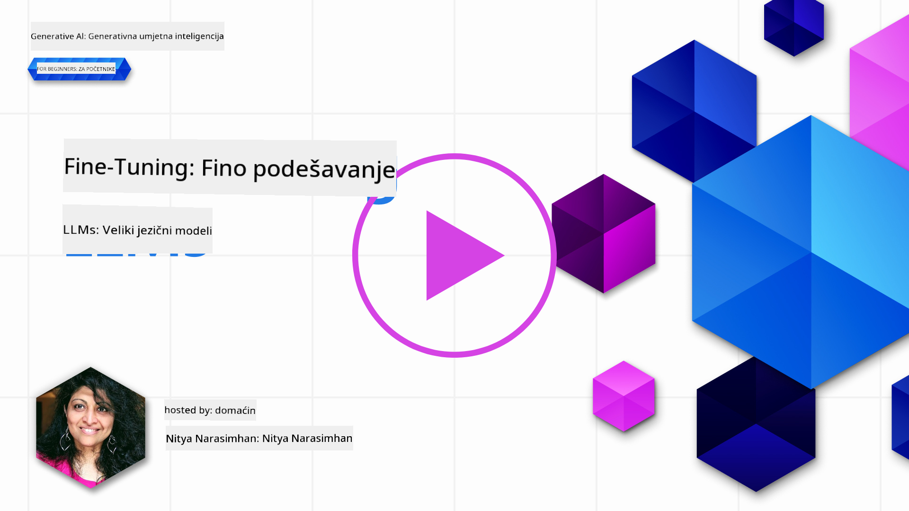
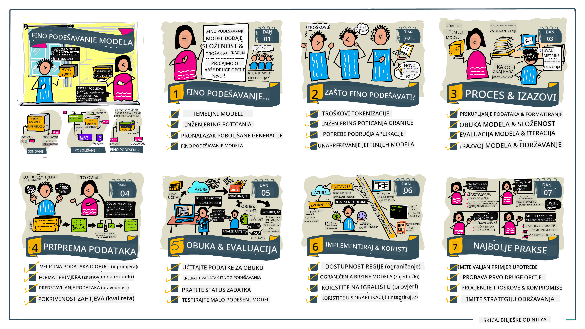

<!--
CO_OP_TRANSLATOR_METADATA:
{
  "original_hash": "68664f7e754a892ae1d8d5e2b7bd2081",
  "translation_date": "2025-07-09T17:50:53+00:00",
  "source_file": "18-fine-tuning/README.md",
  "language_code": "hr"
}
-->

# Fino podešavanje vašeg LLM-a

Korištenje velikih jezičnih modela za izgradnju generativnih AI aplikacija donosi nove izazove. Ključno pitanje je osigurati kvalitetu odgovora (točnost i relevantnost) u sadržaju koji model generira za određeni korisnički zahtjev. U prethodnim lekcijama razgovarali smo o tehnikama poput prompt inženjeringa i generacije potpomognute dohvatom koje pokušavaju riješiti problem _izmjenom ulaza prompta_ postojećem modelu.

U današnjoj lekciji raspravljamo o trećoj tehnici, **fino podešavanju**, koja pokušava riješiti izazov _ponovnim treniranjem samog modela_ s dodatnim podacima. Krenimo u detalje.

## Ciljevi učenja

Ova lekcija uvodi pojam fino podešavanja za unaprijed trenirane jezične modele, istražuje prednosti i izazove ovog pristupa te pruža smjernice kada i kako koristiti fino podešavanje za poboljšanje performansi vaših generativnih AI modela.

Na kraju ove lekcije trebali biste moći odgovoriti na sljedeća pitanja:

- Što je fino podešavanje jezičnih modela?
- Kada i zašto je fino podešavanje korisno?
- Kako mogu fino podesiti unaprijed trenirani model?
- Koja su ograničenja fino podešavanja?

Spremni? Krenimo.

## Ilustrirani vodič

Želite li dobiti širu sliku onoga što ćemo pokriti prije nego što zaronimo u detalje? Pogledajte ovaj ilustrirani vodič koji opisuje put učenja za ovu lekciju – od upoznavanja s osnovnim pojmovima i motivacijom za fino podešavanje, do razumijevanja procesa i najboljih praksi za izvođenje zadatka fino podešavanja. Ovo je fascinantna tema za istraživanje, stoga ne zaboravite posjetiti [Resurse](./RESOURCES.md?WT.mc_id=academic-105485-koreyst) za dodatne poveznice koje će podržati vaše samostalno učenje!

## Što je fino podešavanje jezičnih modela?

Prema definiciji, veliki jezični modeli su _unaprijed trenirani_ na velikim količinama teksta prikupljenog iz različitih izvora, uključujući internet. Kao što smo naučili u prethodnim lekcijama, potrebne su nam tehnike poput _prompt inženjeringa_ i _generacije potpomognute dohvatom_ kako bismo poboljšali kvalitetu odgovora modela na korisnička pitanja ("prompte").

Popularna tehnika prompt inženjeringa uključuje davanje modelu više uputa o tome što se očekuje u odgovoru, bilo pružanjem _instrukcija_ (izravne upute) ili _davanjem nekoliko primjera_ (neizravne upute). To se naziva _few-shot learning_, ali ima dva ograničenja:

- Ograničenja broja tokena modela mogu ograničiti broj primjera koje možete dati i smanjiti učinkovitost.
- Troškovi tokena modela mogu učiniti dodavanje primjera u svaki prompt skupim i ograničiti fleksibilnost.

Fino podešavanje je uobičajena praksa u sustavima strojnog učenja gdje uzimamo unaprijed trenirani model i ponovno ga treniramo s novim podacima kako bismo poboljšali njegove performanse na određenom zadatku. U kontekstu jezičnih modela, možemo fino podesiti unaprijed trenirani model _s pažljivo odabranim skupom primjera za određeni zadatak ili domenu primjene_ kako bismo stvorili **prilagođeni model** koji može biti točniji i relevantniji za taj specifični zadatak ili domenu. Dodatna prednost fino podešavanja je što može smanjiti broj primjera potrebnih za few-shot učenje – smanjujući korištenje tokena i povezane troškove.

## Kada i zašto bismo trebali fino podešavati modele?

U _ovom_ kontekstu, kada govorimo o fino podešavanju, mislimo na **nadzorovano** fino podešavanje gdje se ponovno treniranje vrši **dodavanjem novih podataka** koji nisu bili dio izvornog skupa podataka za treniranje. Ovo se razlikuje od nenadzorovanog pristupa fino podešavanja gdje se model ponovno trenira na izvornim podacima, ali s različitim hiperparametrima.

Ključna stvar koju treba zapamtiti je da je fino podešavanje napredna tehnika koja zahtijeva određenu razinu stručnosti da bi se postigli željeni rezultati. Ako se ne izvede ispravno, možda neće donijeti očekivana poboljšanja, a može čak i pogoršati performanse modela za vašu ciljanu domenu.

Stoga, prije nego što naučite "kako" fino podesiti jezične modele, trebate znati "zašto" biste trebali krenuti tim putem i "kada" započeti proces fino podešavanja. Počnite tako da si postavite ova pitanja:

- **Slučaj upotrebe**: Koji je vaš _slučaj upotrebe_ za fino podešavanje? Koji aspekt trenutnog unaprijed treniranog modela želite poboljšati?
- **Alternativa**: Jeste li isprobali _druge tehnike_ za postizanje željenih rezultata? Koristite ih za stvaranje osnovne usporedbe.
  - Prompt inženjering: Isprobajte tehnike poput few-shot promptinga s primjerima relevantnih odgovora. Procijenite kvalitetu odgovora.
  - Generacija potpomognuta dohvatom: Pokušajte obogatiti prompte rezultatima pretraživanja vaših podataka. Procijenite kvalitetu odgovora.
- **Troškovi**: Jeste li identificirali troškove fino podešavanja?
  - Mogućnost podešavanja – je li unaprijed trenirani model dostupan za fino podešavanje?
  - Uloženi trud – za pripremu podataka za treniranje, evaluaciju i doradu modela.
  - Računalni resursi – za izvođenje poslova fino podešavanja i implementaciju fino podešenog modela.
  - Podaci – pristup dovoljnim kvalitetnim primjerima za značajan utjecaj fino podešavanja.
- **Prednosti**: Jeste li potvrdili prednosti fino podešavanja?
  - Kvaliteta – je li fino podešeni model nadmašio osnovni model?
  - Troškovi – smanjuje li korištenje tokena pojednostavljivanjem prompta?
  - Proširivost – možete li osnovni model iskoristiti za nove domene?

Odgovarajući na ova pitanja, trebali biste moći odlučiti je li fino podešavanje pravi pristup za vaš slučaj upotrebe. Idealno, pristup je opravdan samo ako prednosti nadmašuju troškove. Kad odlučite nastaviti, vrijeme je da razmislite _kako_ možete fino podesiti unaprijed trenirani model.

Želite li dodatne uvide u proces donošenja odluka? Pogledajte [To fine-tune or not to fine-tune](https://www.youtube.com/watch?v=0Jo-z-MFxJs)

## Kako možemo fino podesiti unaprijed trenirani model?

Za fino podešavanje unaprijed treniranog modela trebate imati:

- unaprijed trenirani model za fino podešavanje
- skup podataka za fino podešavanje
- okruženje za treniranje za izvođenje posla fino podešavanja
- okruženje za implementaciju fino podešenog modela

## Fino podešavanje u praksi

Sljedeći resursi pružaju vodiče korak po korak koji vas vode kroz stvarni primjer korištenja odabranog modela s pažljivo odabranim skupom podataka. Za rad s ovim vodičima trebate račun kod određenog pružatelja usluga, kao i pristup relevantnim modelima i skupovima podataka.

| Pružatelj usluge | Vodič                                                                                                                                                                         | Opis                                                                                                                                                                                                                                                                                                                                                                                                                              |
| ---------------- | ---------------------------------------------------------------------------------------------------------------------------------------------------------------------------- | -------------------------------------------------------------------------------------------------------------------------------------------------------------------------------------------------------------------------------------------------------------------------------------------------------------------------------------------------------------------------------------------------------------------------------- |
| OpenAI           | [Kako fino podesiti chat modele](https://github.com/openai/openai-cookbook/blob/main/examples/How_to_finetune_chat_models.ipynb?WT.mc_id=academic-105485-koreyst)            | Naučite kako fino podesiti `gpt-35-turbo` za specifičnu domenu ("pomoćnik za recepte") pripremom podataka za treniranje, izvođenjem posla fino podešavanja i korištenjem fino podešenog modela za izvođenje.                                                                                                                                                                                                                     |
| Azure OpenAI     | [GPT 3.5 Turbo tutorial za fino podešavanje](https://learn.microsoft.com/azure/ai-services/openai/tutorials/fine-tune?tabs=python-new%2Ccommand-line?WT.mc_id=academic-105485-koreyst) | Naučite kako fino podesiti `gpt-35-turbo-0613` model **na Azureu** kroz korake stvaranja i učitavanja podataka za treniranje, izvođenje posla fino podešavanja, implementaciju i korištenje novog modela.                                                                                                                                                                                                                          |
| Hugging Face     | [Fino podešavanje LLM-a s Hugging Face](https://www.philschmid.de/fine-tune-llms-in-2024-with-trl?WT.mc_id=academic-105485-koreyst)                                         | Ovaj blog vodi vas kroz fino podešavanje _otvorenog LLM-a_ (npr. `CodeLlama 7B`) koristeći [transformers](https://huggingface.co/docs/transformers/index?WT.mc_id=academic-105485-koreyst) biblioteku i [Transformer Reinforcement Learning (TRL)](https://huggingface.co/docs/trl/index?WT.mc_id=academic-105485-koreyst) s otvorenim [skupovima podataka](https://huggingface.co/docs/datasets/index?WT.mc_id=academic-105485-koreyst) na Hugging Face. |
|                  |                                                                                                                                                                              |                                                                                                                                                                                                                                                                                                                                                                                                                                  |
| 🤗 AutoTrain     | [Fino podešavanje LLM-a s AutoTrain](https://github.com/huggingface/autotrain-advanced/?WT.mc_id=academic-105485-koreyst)                                                     | AutoTrain (ili AutoTrain Advanced) je Python biblioteka koju je razvio Hugging Face, a koja omogućuje fino podešavanje za mnoge različite zadatke, uključujući fino podešavanje LLM-a. AutoTrain je rješenje bez kodiranja i fino podešavanje se može izvesti u vašem oblaku, na Hugging Face Spaces ili lokalno. Podržava web sučelje, CLI i treniranje putem yaml konfiguracijskih datoteka.                                                                                 |
|                  |                                                                                                                                                                              |                                                                                                                                                                                                                                                                                                                                                                                                                                  |

## Zadatak

Odaberite jedan od gore navedenih vodiča i prođite kroz njega. _Možemo replicirati verziju ovih vodiča u Jupyter Notebookovima u ovom repozitoriju samo za referencu. Molimo koristite izvorne izvore izravno kako biste dobili najnovije verzije_.

## Odličan posao! Nastavite s učenjem.

Nakon što završite ovu lekciju, pogledajte našu [kolekciju za učenje generativne AI](https://aka.ms/genai-collection?WT.mc_id=academic-105485-koreyst) kako biste nastavili podizati svoje znanje o generativnoj AI!

Čestitamo!! Završili ste završnu lekciju iz v2 serije ovog tečaja! Nemojte prestati učiti i graditi. \*\*Pogledajte [RESURSE](RESOURCES.md?WT.mc_id=academic-105485-koreyst) stranicu za popis dodatnih prijedloga samo za ovu temu.

Naša v1 serija lekcija također je ažurirana s više zadataka i koncepata. Zato odvojite minutu za osvježavanje znanja – i molimo vas da [podijelite svoja pitanja i povratne informacije](https://github.com/microsoft/generative-ai-for-beginners/issues?WT.mc_id=academic-105485-koreyst) kako bismo mogli poboljšati ove lekcije za zajednicu.

**Odricanje od odgovornosti**:  
Ovaj dokument je preveden korištenjem AI usluge za prevođenje [Co-op Translator](https://github.com/Azure/co-op-translator). Iako težimo točnosti, imajte na umu da automatski prijevodi mogu sadržavati pogreške ili netočnosti. Izvorni dokument na izvornom jeziku treba smatrati autoritativnim izvorom. Za kritične informacije preporučuje se profesionalni ljudski prijevod. Ne snosimo odgovornost za bilo kakva nesporazuma ili pogrešna tumačenja koja proizlaze iz korištenja ovog prijevoda.