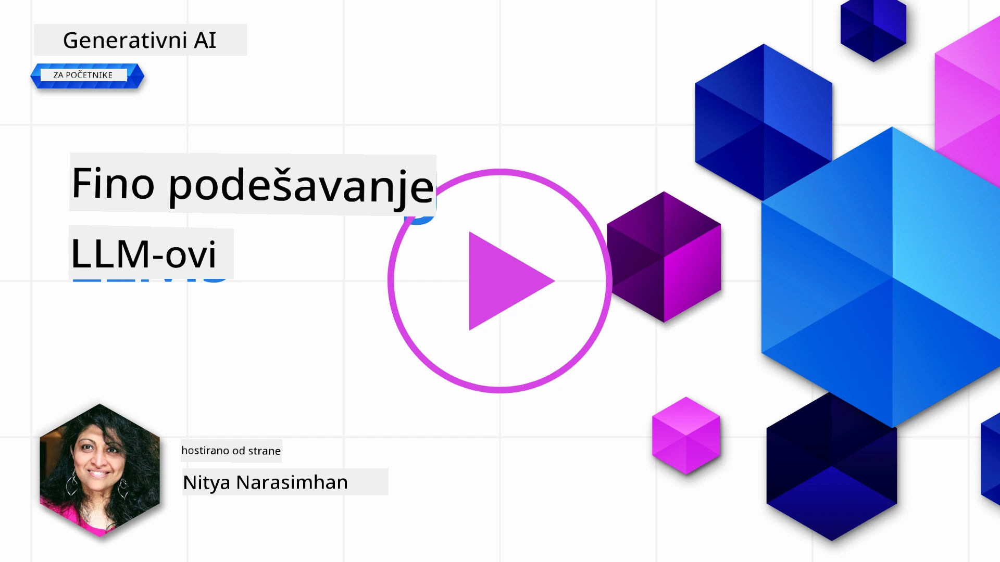
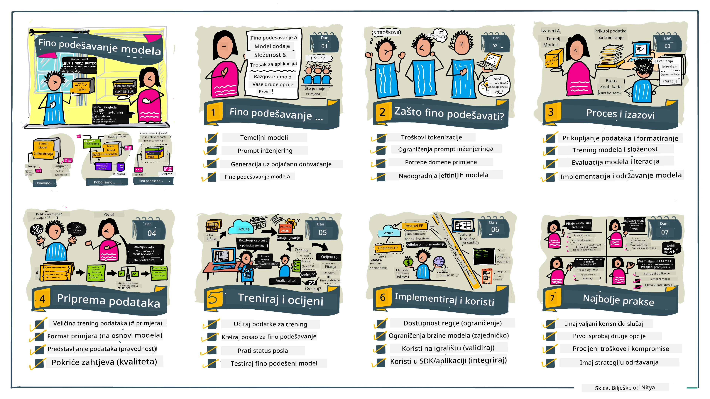

# Fino podešavanje vašeg LLM-a

Korištenje velikih jezičnih modela za izgradnju generativnih AI aplikacija donosi nove izazove. Ključno pitanje je osigurati kvalitetu odgovora (točnost i relevantnost) u sadržaju koji model generira za određeni korisnički zahtjev. U prethodnim lekcijama razgovarali smo o tehnikama poput inženjeringa promptova i generacije potpomognute dohvatom koje pokušavaju riješiti problem _modificiranjem unosa prompta_ u postojeći model.

U današnjoj lekciji raspravljamo o trećoj tehnici, **fino podešavanje**, koja pokušava riješiti izazov _ponovnim treniranjem samog modela_ s dodatnim podacima. Zaronimo u detalje.

## Ciljevi učenja

Ova lekcija uvodi koncept fino podešavanja prethodno treniranih jezičnih modela, istražuje prednosti i izazove ovog pristupa te pruža smjernice kada i kako koristiti fino podešavanje za poboljšanje performansi vaših generativnih AI modela.

Na kraju ove lekcije trebali biste moći odgovoriti na sljedeća pitanja:

- Što je fino podešavanje za jezične modele?
- Kada i zašto je fino podešavanje korisno?
- Kako mogu fino podesiti prethodno trenirani model?
- Koja su ograničenja fino podešavanja?

Spremni? Krenimo.

## Ilustrirani vodič

Želite li dobiti cjelovitu sliku onoga što ćemo pokriti prije nego što krenemo? Pogledajte ovaj ilustrirani vodič koji opisuje put učenja za ovu lekciju – od učenja osnovnih koncepata i motivacije za fino podešavanje, do razumijevanja procesa i najboljih praksi za izvršavanje zadatka fino podešavanja. Ovo je fascinantna tema za istraživanje, stoga ne zaboravite provjeriti stranicu [Resursi](./RESOURCES.md?WT.mc_id=academic-105485-koreyst) za dodatne poveznice koje će podržati vaše samostalno učenje!

## Što je fino podešavanje za jezične modele?

Prema definiciji, veliki jezični modeli su _prethodno trenirani_ na velikim količinama tekstova prikupljenim iz različitih izvora uključujući internet. Kao što smo naučili u prethodnim lekcijama, potrebne su nam tehnike poput _inženjeringa promptova_ i _generacije potpomognute dohvatom_ kako bismo poboljšali kvalitetu odgovora modela na korisnička pitanja ("prompte").

Popularna tehnika inženjeringa prompta uključuje davanje modelu više smjernica o tome što se očekuje u odgovoru bilo pružanjem _uputa_ (izravnih smjernica) ili _davanjem nekoliko primjera_ (neizravnih smjernica). Ovo se naziva _učenje s nekoliko primjera_ (few-shot learning) ali ima dvije ograničenja:

- Ograničenja tokena modela mogu suziti broj primjera koje možete dati i ograničiti učinkovitost.
- Troškovi tokena modela mogu učiniti skupo dodavanje primjera u svaki prompt, ograničavajući fleksibilnost.

Fino podešavanje je uobičajena praksa u sustavima strojnog učenja gdje uzimamo prethodno trenirani model i ponovo ga treniramo s novim podacima kako bismo poboljšali njegovu izvedbu na specifičnom zadatku. U kontekstu jezičnih modela, možemo fino podesiti prethodno trenirani model _s pažljivo odabranim skupom primjera za određeni zadatak ili domenu primjene_ kako bismo stvorili **prilagođeni model** koji može biti točniji i relevantniji za taj specifični zadatak ili domenu. Dodatna prednost fino podešavanja je da može smanjiti broj primjera potreban za učenje s nekoliko primjera - smanjujući korištenje tokena i povezane troškove.

## Kada i zašto trebamo fino podešavati modele?

U _ovom_ kontekstu, kada govorimo o fino podešavanju, referiramo se na **supervizirano** fino podešavanje gdje se ponovno treniranje radi **dodavanjem novih podataka** koji nisu bili dio izvornog skupa podataka za treniranje. Ovo se razlikuje od pristupa nesuperviziranog fino podešavanja gdje se model ponovno trenira na izvornim podacima, ali s različitim hiperparametrima.

Ključna stvar koju treba zapamtiti je da je fino podešavanje napredna tehnika koja zahtijeva određenu razinu stručnosti za postizanje željenih rezultata. Ako se pogrešno izvede, možda neće donijeti očekivana poboljšanja, pa čak može i pogoršati izvedbu modela za vašu ciljanu domenu.

Dakle, prije nego što naučite "kako" fino podesiti jezične modele, morate znati "zašto" biste trebali krenuti tim putem i "kada" započeti proces fino podešavanja. Počnite tako što ćete sebi postaviti sljedeća pitanja:

- **Slučaj upotrebe**: Koji je vaš _slučaj upotrebe_ za fino podešavanje? Koji aspekt trenutnog prethodno treniranog modela želite poboljšati?
- **Alternativa**: Jeste li isprobali _druge tehnike_ za postizanje željenih rezultata? Koristite ih da stvorite osnovnu liniju za usporedbu.
  - Inženjering prompta: Isprobajte tehnike poput few-shot promptinga s primjerima relevantnih odgovora. Procijenite kvalitetu odgovora.
  - Generacija potpomognuta dohvatom: Isprobajte pojačavanje promptova rezultatima pretraživanja vaših podataka. Procijenite kvalitetu odgovora.
- **Troškovi**: Jeste li identificirali troškove za fino podešavanje?
  - Mogućnost podešavanja - je li prethodno trenirani model dostupan za fino podešavanje?
  - Uloženi trud - za pripremu podataka za treniranje, procjenu i usavršavanje modela.
  - Računalna snaga - za izvođenje poslova fino podešavanja i implementaciju fino podešenog modela.
  - Podaci - pristup dovoljnom broju kvalitetnih primjera za utjecaj fino podešavanja.
- **Prednosti**: Jeste li potvrdili prednosti fino podešavanja?
  - Kvaliteta - je li fino podešeni model nadmašio osnovu?
  - Troškovi - smanjuje li korištenje tokena pojednostavljivanjem promptova?
  - Proširivost - možete li ponovo koristiti osnovni model za nove domene?

Odgovaranjem na ova pitanja trebali biste moći odlučiti je li fino podešavanje pravi pristup za vaš slučaj upotrebe. Idealno, pristup je valjan samo ako prednosti premašuju troškove. Kad se odlučite nastaviti, vrijeme je da razmislite o tome _kako_ možete fino podesiti prethodno trenirani model.

Želite li dobiti više uvida u proces donošenja odluka? Pogledajte [Fino podešavati ili ne fino podešavati](https://www.youtube.com/watch?v=0Jo-z-MFxJs)

## Kako možemo fino podesiti prethodno trenirani model?

Za fino podešavanje prethodno treniranog modela trebate imati:

- prethodno trenirani model za fino podešavanje
- skup podataka za fino podešavanje
- okruženje za treniranje za izvođenje posla fino podešavanja
- okruženje za hostiranje za implementaciju fino podešenog modela

## Fino podešavanje u praksi

Sljedeći resursi pružaju korak-po-korak tutorijale koji vas provode kroz stvarni primjer koristeći odabrani model s pažljivo odabranim skupom podataka. Da biste prošli ove tutorijale, trebate račun kod određenog davatelja usluga, kao i pristup relevantnom modelu i datasetima.

| Davatelj usluge | Tutorijal                                                                                                                                                                                   | Opis                                                                                                                                                                                                                                                                                                                                                                                                                            |
| ---------------- | -------------------------------------------------------------------------------------------------------------------------------------------------------------------------------------------- | -------------------------------------------------------------------------------------------------------------------------------------------------------------------------------------------------------------------------------------------------------------------------------------------------------------------------------------------------------------------------------------------------------------------------------- |
| OpenAI           | [Kako fino podesiti chat modele](https://github.com/openai/openai-cookbook/blob/main/examples/How_to_finetune_chat_models.ipynb?WT.mc_id=academic-105485-koreyst)                             | Naučite kako fino podesiti `gpt-35-turbo` za specifičnu domenu ("pomoćnik za recepte") pripremanjem podataka za treniranje, izvođenjem posla fino podešavanja te korištenjem fino podešenog modela za izvođenje.                                                                                                                                                                                                                  |
| Azure OpenAI     | [Tutorijal za fino podešavanje GPT 3.5 Turbo](https://learn.microsoft.com/azure/ai-services/openai/tutorials/fine-tune?tabs=python-new%2Ccommand-line?WT.mc_id=academic-105485-koreyst)          | Naučite kako fino podesiti `gpt-35-turbo-0613` model **na Azureu** korak po korak kreiranjem i učitavanjem podataka za treniranje, izvođenjem posla fino podešavanja. Implementirajte i koristite novi model.                                                                                                                                                                                                                     |
| Hugging Face     | [Fino podešavanje LLM-ova s Hugging Face](https://www.philschmid.de/fine-tune-llms-in-2024-with-trl?WT.mc_id=academic-105485-koreyst)                                                        | Ovaj blog vodi vas kroz fino podešavanje _otvorenog LLM-a_ (npr. `CodeLlama 7B`) korištenjem biblioteke [transformers](https://huggingface.co/docs/transformers/index?WT.mc_id=academic-105485-koreyst) i [Transformer Reinforcement Learning (TRL)](https://huggingface.co/docs/trl/index?WT.mc_id=academic-105485-koreyst]) s otvorenim [datasetima](https://huggingface.co/docs/datasets/index?WT.mc_id=academic-105485-koreyst) na Hugging Face. |
|                  |                                                                                                                                                                                              |                                                                                                                                                                                                                                                                                                                                                                                                                                |
| 🤗 AutoTrain     | [Fino podešavanje LLM-ova s AutoTrain](https://github.com/huggingface/autotrain-advanced/?WT.mc_id=academic-105485-koreyst)                                                                     | AutoTrain (ili AutoTrain Advanced) je python biblioteka koju je razvio Hugging Face, a koja omogućuje fino podešavanje za mnoge različite zadatke uključujući fino podešavanje LLM-ova. AutoTrain je rješenje bez koda koje može raditi u vašem oblaku, na Hugging Face Spaces ili lokalno. Podržava web-based GUI, CLI i treniranje putem yaml konfiguracijskih datoteka.                                                                                 |
|                  |                                                                                                                                                                                              |                                                                                                                                                                                                                                                                                                                                                                                                                                |
| 🦥 Unsloth       | [Fino podešavanje LLM-ova s Unsloth](https://github.com/unslothai/unsloth)                                                                                                                     | Unsloth je open-source okvir koji podržava fino podešavanje LLM-ova i učenje s potkrepljenjem (RL). Unsloth pojednostavljuje lokalno treniranje, evaluaciju i implementaciju uz spremne [bilježnice](https://github.com/unslothai/notebooks). Također podržava pretvaranje teksta u govor (TTS), BERT i multimodalne modele. Za početak pročitajte njihov korak-po-korak [Vodič za fino podešavanje LLM-ova](https://docs.unsloth.ai/get-started/fine-tuning-llms-guide).                                       |
|                  |                                                                                                                                                                                              |                                                                                                                                                                                                                                                                                                                                                                                                                                |
## Zadatak

Odaberite jedan od gore navedenih tutorijala i prođite ga. _Moguće je da ćemo replicirati verziju ovih tutorijala u Jupyter bilježnicama u ovom spremištu samo za referencu. Molimo koristite izvorne izvore direktno za najnovije verzije_.

## Sjajan posao! Nastavite s učenjem.

Nakon dovršetka ove lekcije, pogledajte našu [kolekciju za učenje generativne AI](https://aka.ms/genai-collection?WT.mc_id=academic-105485-koreyst) kako biste nastavili podizati svoje znanje o generativnoj AI!

Čestitamo!! Završili ste završnu lekciju iz v2 serije ovog tečaja! Nemojte prestati učiti i graditi. \*\*Pogledajte stranicu [RESURSИ](RESOURCES.md?WT.mc_id=academic-105485-koreyst) za popis dodatnih preporuka za ovu temu.

Naša v1 serija lekcija također je ažurirana s više zadataka i koncepata. Pa odvojite minutu za osvježenje svog znanja – i molimo [podijelite svoja pitanja i povratne informacije](https://github.com/microsoft/generative-ai-for-beginners/issues?WT.mc_id=academic-105485-koreyst) kako bismo mogli poboljšati ove lekcije za zajednicu.

---

<!-- CO-OP TRANSLATOR DISCLAIMER START -->
**Odricanje od odgovornosti**:
Ovaj dokument je preveden korištenjem AI usluge prevođenja [Co-op Translator](https://github.com/Azure/co-op-translator). Iako težimo točnosti, imajte na umu da automatski prijevodi mogu sadržavati pogreške ili netočnosti. Izvorni dokument na izvornom jeziku treba smatrati službenim i vjerodostojnim izvorom. Za važne informacije preporučuje se stručni prijevod od strane profesionalnih prevoditelja. Ne snosimo odgovornost za bilo kakve nerazumijevanja ili pogrešne interpretacije koje proizlaze iz korištenja ovog prijevoda.
<!-- CO-OP TRANSLATOR DISCLAIMER END -->