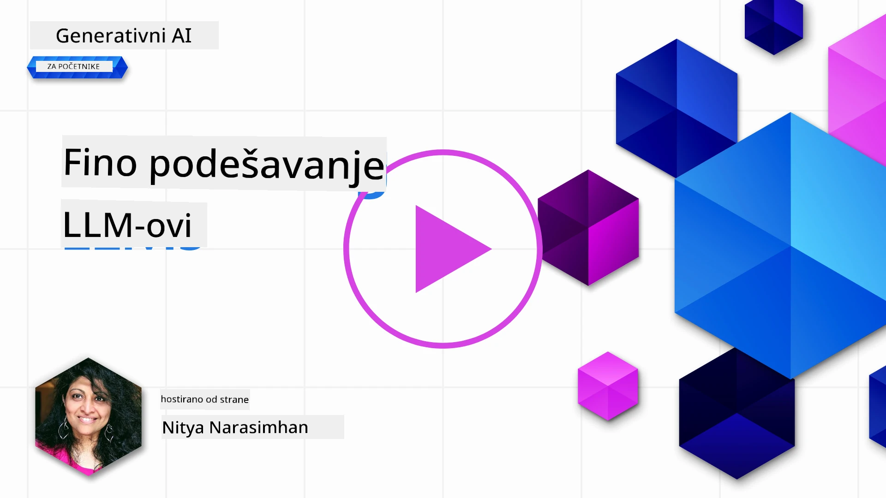
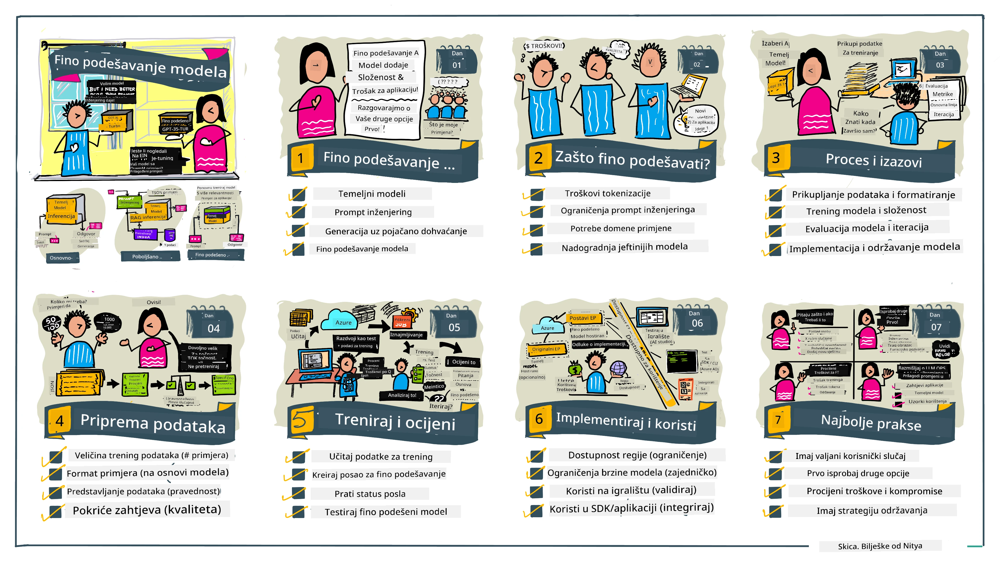

# Fino podešavanje vašeg LLM-a

Korištenje velikih jezičnih modela za izgradnju generativnih AI aplikacija donosi nove izazove. Ključni problem je osigurati kvalitetu odgovora (točnost i relevantnost) u sadržaju koji model generira za dani korisnički zahtjev. U prethodnim lekcijama raspravljali smo o tehnikama poput inženjeringa upita i generacije potpomognute dohvatom koje pokušavaju riješiti problem _izmjenom ulaza upita_ postojećeg modela.

U današnjoj lekciji raspravljamo o trećoj tehnici, **finoj prilagodbi**, koja pokušava riješiti izazov _ponovnim treniranjem samog modela_ uz dodatne podatke. Idemo u detalje.

## Ciljevi učenja

Ova lekcija uvodi pojam finog podešavanja za unaprijed trenirane jezične modele, istražuje prednosti i izazove ovog pristupa te pruža smjernice kada i kako koristiti fino podešavanje za poboljšanje performansi vaših generativnih AI modela.

Na kraju lekcije trebali biste moći odgovoriti na sljedeća pitanja:

- Što je fino podešavanje jezičnih modela?
- Kada i zašto je fino podešavanje korisno?
- Kako mogu fino podesiti unaprijed trenirani model?
- Koja su ograničenja finog podešavanja?

Spremni? Krenimo.

## Ilustrirani vodič

Želite li dobiti cjelokupni pregled onoga što ćemo pokriti prije nego započnemo? Pogledajte ovaj ilustrirani vodič koji opisuje put učenja za ovu lekciju - od učenja osnovnih pojmova i motivacije za fino podešavanje do razumijevanja procesa i najboljih praksi za izvođenje zadatka finog podešavanja. Ovo je fascinantna tema za istraživanje, stoga ne zaboravite provjeriti [Resurse](./RESOURCES.md?WT.mc_id=academic-105485-koreyst) za dodatne veze koje podržavaju vaše samostalno učenje!

## Što je fino podešavanje jezičnih modela?

Po definiciji, veliki jezični modeli su _unaprijed trenirani_ na velikim količinama teksta prikupljenog iz različitih izvora, uključujući internet. Kao što smo naučili u prethodnim lekcijama, trebaju nam tehnike poput _inženjeringa upita_ i _generacije potpomognute dohvatom_ za poboljšanje kvalitete modelovih odgovora na korisnička pitanja ("upite").

Popularna tehnika inženjeringa upita uključuje davanje modelu više uputa o tome što se očekuje u odgovoru, bilo pružanjem _uputa_ (izravno vođenje) ili _davanjem nekoliko primjera_ (neizravno vođenje). To se naziva _učenje na nekoliko primjera_, ali ima dva ograničenja:

- Ograničenja na broj tokena modela mogu ograničiti broj primjera koje možete dati i smanjiti učinkovitost.
- Troškovi tokena modela mogu učiniti skupo dodavanje primjera svakom upitu i ograničiti fleksibilnost.

Fino podešavanje je uobičajena praksa u sustavima strojnog učenja gdje uzmemo unaprijed trenirani model i ponovno ga treniramo s novim podacima kako bismo poboljšali njegovu izvedbu na određenom zadatku. U kontekstu jezičnih modela, možemo fino podesiti unaprijed trenirani model _s kuriranim skupom primjera za određeni zadatak ili domenu primjene_ kako bismo stvorili **prilagođeni model** koji može biti točniji i relevantniji za taj specifični zadatak ili domenu. Dodatna korist finog podešavanja je da može smanjiti broj primjera potrebnih za učenje na nekoliko primjera - smanjujući upotrebu tokena i povezane troškove.

## Kada i zašto bismo trebali fino podešavati modele?

U _ovom_ kontekstu, kada govorimo o finom podešavanju, mislimo na **nadzorovano** fino podešavanje gdje se ponovno treniranje izvodi dodavanjem **novih podataka** koji nisu bili dio izvornog skupa podataka za treniranje. Ovo je drugačije od nenadzorovanog finog podešavanja gdje se model ponovno trenira na izvornim podacima, ali s različitim hiperparametrima.

Ključna stvar za zapamtiti je da je fino podešavanje napredna tehnika koja zahtijeva određenu razinu stručnosti da bi se postigli željeni rezultati. Ako se izvodi nepravilno, možda neće dati očekivana poboljšanja, a može čak i pogoršati performanse modela za vašu ciljanu domenu.

Dakle, prije nego što naučite "kako" fino podesiti jezične modele, trebate znati "zašto" biste trebali odabrati ovaj put i "kada" započeti proces finog podešavanja. Počnite postavljanjem sljedećih pitanja:

- **Slučaj upotrebe**: Koji je vaš _slučaj upotrebe_ za fino podešavanje? Koji aspekt trenutačnog unaprijed treniranog modela želite poboljšati?
- **Alternativa**: Jeste li pokušali s _drugim tehnikama_ da postignete željene rezultate? Koristite ih za stvaranje osnovne usporedbe.
  - Inženjering upita: Isprobajte tehnike poput učenja na nekoliko primjera s primjerima relevantnih odgovora na upite. Procijenite kvalitetu odgovora.
  - Generacija potpomognuta dohvatom: Pokušajte nadograditi upite rezultatima pretraživanja vaših podataka. Procijenite kvalitetu odgovora.
- **Troškovi**: Jeste li identificirali troškove finog podešavanja?
  - Mogućnost podešavanja - je li unaprijed trenirani model dostupan za fino podešavanje?
  - Napor - za pripremu podataka za treniranje, procjenu i doradu modela.
  - Računska snaga - za izvođenje poslova finog podešavanja i postavljanje fino podešenog modela
  - Podatci - pristup kvalitetnim primjerima za utjecaj finog podešavanja
- **Prednosti**: Jeste li potvrdili prednosti finog podešavanja?
  - Kvaliteta - je li fino podešeni model nadmašio osnovni model?
  - Troškovi - smanjuje li upotrebu tokena pojednostavljivanjem upita?
  - Proširivost - možete li ponovno iskoristiti osnovni model za nove domene?

Odgovaranjem na ova pitanja trebali biste moći odlučiti je li fino podešavanje pravi pristup za vaš slučaj upotrebe. Idealno, pristup je valjan samo ako su koristi veće od troškova. Kad odlučite nastaviti dalje, vrijeme je da razmislite _kako_ možete fino podesiti unaprijed trenirani model.

Želite li dobiti više uvida u proces donošenja odluka? Pogledajte [Fino podešavanje ili ne fino podešavanje](https://www.youtube.com/watch?v=0Jo-z-MFxJs)

## Kako možemo fino podesiti unaprijed trenirani model?

Da biste fino podesili unaprijed trenirani model, trebate imati:

- unaprijed trenirani model za fino podešavanje
- skup podataka za fino podešavanje
- okruženje za treniranje za izvođenje posla finog podešavanja
- okruženje za hosting za postavljanje fino podešenog modela

## Fino podešavanje u praksi

Sljedeći resursi pružaju korak-po-korak vodiče koji vas vode kroz stvarni primjer koristeći odabrani model s kuriranim skupom podataka. Da biste radili ove vodiče, potrebni su vam račun kod određenog pružatelja usluga, zajedno s pristupom relevantnom modelu i skupovima podataka.

| Pružatelj usluge | Vodič                                                                                                                                                                            | Opis                                                                                                                                                                                                                                                                                                                                                                                                                              |
| ---------------- | -------------------------------------------------------------------------------------------------------------------------------------------------------------------------------- | -------------------------------------------------------------------------------------------------------------------------------------------------------------------------------------------------------------------------------------------------------------------------------------------------------------------------------------------------------------------------------------------------------------------------------- |
| OpenAI           | [Kako fino podesiti chat modele](https://github.com/openai/openai-cookbook/blob/main/examples/How_to_finetune_chat_models.ipynb?WT.mc_id=academic-105485-koreyst)                | Naučite fino podesiti `gpt-35-turbo` za određenu domenu ("asistent za recepte") pripremom podataka za treniranje, pokretanjem posla finog podešavanja i korištenjem fino podešenog modela za izvođenje.                                                                                                                                                                                                                        |
| Azure OpenAI     | [Vodič za fino podešavanje GPT 3.5 Turbo](https://learn.microsoft.com/azure/ai-services/openai/tutorials/fine-tune?tabs=python-new%2Ccommand-line&WT.mc_id=academic-105485-koreyst) | Naučite fino podesiti `gpt-35-turbo-0613` model **na Azureu** koracima za kreiranje i prijenos podataka za treniranje, pokretanje posla finog podešavanja, postavljanje i korištenje novog modela.                                                                                                                                                                                                                              |
| Hugging Face     | [Fino podešavanje LLM-a s Hugging Face](https://www.philschmid.de/fine-tune-llms-in-2024-with-trl?WT.mc_id=academic-105485-koreyst)                                               | Ovaj blog vodi vas kroz fino podešavanje _otvorenog LLM-a_ (npr. `CodeLlama 7B`) koristeći biblioteku [transformers](https://huggingface.co/docs/transformers/index?WT.mc_id=academic-105485-koreyst) i [Transformer Reinforcement Learning (TRL)](https://huggingface.co/docs/trl/index?WT.mc_id=academic-105485-koreyst) s otvorenim [skupovima podataka](https://huggingface.co/docs/datasets/index?WT.mc_id=academic-105485-koreyst) na Hugging Face. |
|                  |                                                                                                                                                                                  |                                                                                                                                                                                                                                                                                                                                                                                                                                  |
| 🤗 AutoTrain      | [Fino podešavanje LLM-a s AutoTrain](https://github.com/huggingface/autotrain-advanced/?WT.mc_id=academic-105485-koreyst)                                                         | AutoTrain (ili AutoTrain Advanced) je Python biblioteka koju je razvio Hugging Face koja omogućuje fino podešavanje za mnoge različite zadatke uključujući fino podešavanje LLM-a. AutoTrain je rješenje bez koda i fino podešavanje se može izvršiti u vašem vlastitom oblaku, na Hugging Face Spaces ili lokalno. Podržava web sučelje, CLI i treniranje putem yaml konfiguracijskih datoteka.                                                       |
|                  |                                                                                                                                                                                  |                                                                                                                                                                                                                                                                                                                                                                                                                                  |
| 🦥 Unsloth        | [Fino podešavanje LLM-a s Unsloth](https://github.com/unslothai/unsloth)                                                                                                        | Unsloth je open-source okvir koji podržava fino podešavanje LLM-a i učenje pojačanjem (RL). Unsloth pojednostavljuje lokalno treniranje, evaluaciju i postavljanje s gotovim [notebook-ovima](https://github.com/unslothai/notebooks). Također podržava pretvaranje teksta u govor (TTS), BERT i multimodalne modele. Za početak, pročitajte njihov korak-po-korak [Vodič za fino podešavanje LLM-a](https://docs.unsloth.ai/get-started/fine-tuning-llms-guide).                        |
|                  |                                                                                                                                                                                  |                                                                                                                                                                                                                                                                                                                                                                                                                                  |
## Zadatak

Odaberite jedan od gore navedenih vodiča i prođite kroz njega. _Moguće je da ćemo u ovom repozitoriju replicirati verziju ovih vodiča u Jupyter Notebookovima samo za referencu. Molimo koristite originalne izvore direktno da dobijete najnovije verzije_.

## Odlično! Nastavite sa učenjem.

Nakon što završite ovu lekciju, pogledajte našu [kolekciju za učenje generativne umjetne inteligencije](https://aka.ms/genai-collection?WT.mc_id=academic-105485-koreyst) kako biste nastavili podizati razinu vašeg znanja o generativnoj AI!

Čestitamo!! Završili ste završnu lekciju iz v2 serije ovog tečaja! Nemojte prestati učiti i stvarati. \*\*Pogledajte [RESURSE](RESOURCES.md?WT.mc_id=academic-105485-koreyst) stranicu za popis dodatnih prijedloga samo za ovu temu.

Naša v1 serija lekcija također je ažurirana s više zadataka i koncepata. Odvojite minutu da osvježite vaše znanje - i molimo vas da [podijelite svoja pitanja i povratne informacije](https://github.com/microsoft/generative-ai-for-beginners/issues?WT.mc_id=academic-105485-koreyst) kako bismo mogli poboljšati ove lekcije za zajednicu.

---

<!-- CO-OP TRANSLATOR DISCLAIMER START -->
**Izjava o odricanju od odgovornosti**:
Ovaj dokument je preveden korištenjem AI prevoditeljskog servisa [Co-op Translator](https://github.com/Azure/co-op-translator). Iako nastojimo postići točnost, imajte na umu da automatski prijevodi mogu sadržavati pogreške ili netočnosti. Izvorni dokument na izvornom jeziku treba se smatrati autoritativnim izvorom. Za važne informacije preporučuje se profesionalni ljudski prijevod. Ne preuzimamo odgovornost za bilo kakva nesporazuma ili pogrešna tumačenja proizašla iz korištenja ovog prijevoda.
<!-- CO-OP TRANSLATOR DISCLAIMER END -->