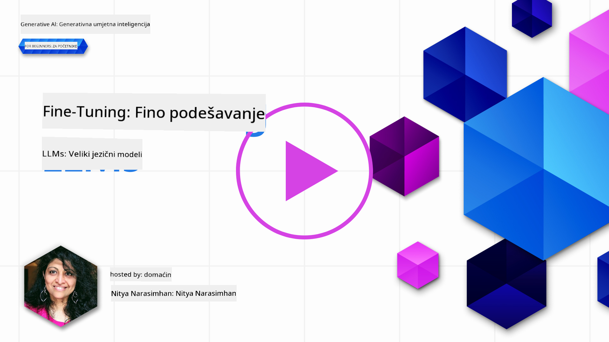
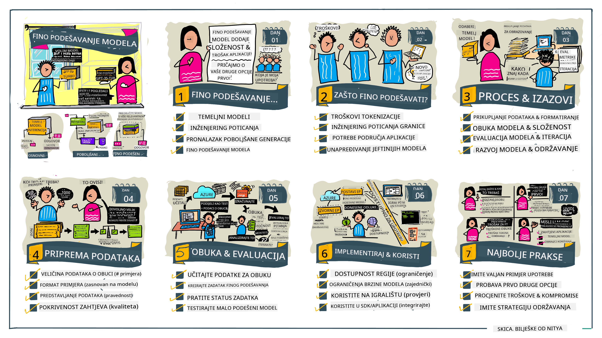

<!--
CO_OP_TRANSLATOR_METADATA:
{
  "original_hash": "68664f7e754a892ae1d8d5e2b7bd2081",
  "translation_date": "2025-06-26T00:53:29+00:00",
  "source_file": "18-fine-tuning/README.md",
  "language_code": "hr"
}
-->

# Fino podešavanje vašeg LLM-a

Korištenje velikih jezičnih modela za izgradnju generativnih AI aplikacija donosi nove izazove. Ključno pitanje je osiguranje kvalitete odgovora (točnost i relevantnost) u sadržaju koji model generira za određeni zahtjev korisnika. U prethodnim lekcijama raspravljali smo o tehnikama poput oblikovanja upita i generacije potpomognute pretraživanjem koje pokušavaju riješiti problem _modificiranjem ulaza upita_ postojećem modelu.

U današnjoj lekciji raspravljamo o trećoj tehnici, **fino podešavanje**, koja pokušava riješiti izazov _ponovnim treniranjem samog modela_ dodatnim podacima. Idemo u detalje.

## Ciljevi učenja

Ova lekcija uvodi koncept finog podešavanja za unaprijed trenirane jezične modele, istražuje prednosti i izazove ovog pristupa te daje smjernice kada i kako koristiti fino podešavanje za poboljšanje performansi vaših generativnih AI modela.

Na kraju ove lekcije trebali biste moći odgovoriti na sljedeća pitanja:

- Što je fino podešavanje za jezične modele?
- Kada i zašto je fino podešavanje korisno?
- Kako mogu fino podesiti unaprijed trenirani model?
- Koja su ograničenja finog podešavanja?

Spremni? Krenimo.

## Ilustrirani vodič

Želite li dobiti opću sliku o onome što ćemo pokriti prije nego što zaronimo? Pogledajte ovaj ilustrirani vodič koji opisuje put učenja za ovu lekciju - od učenja osnovnih pojmova i motivacije za fino podešavanje, do razumijevanja procesa i najboljih praksi za izvršenje zadatka finog podešavanja. Ovo je fascinantna tema za istraživanje, stoga ne zaboravite provjeriti [Resurse](./RESOURCES.md?WT.mc_id=academic-105485-koreyst) stranicu za dodatne poveznice koje će podržati vaše samostalno učenje!

## Što je fino podešavanje za jezične modele?

Po definiciji, veliki jezični modeli su _unaprijed trenirani_ na velikim količinama teksta iz raznih izvora, uključujući internet. Kao što smo naučili u prethodnim lekcijama, potrebne su nam tehnike poput _oblikovanja upita_ i _generacije potpomognute pretraživanjem_ za poboljšanje kvalitete odgovora modela na korisnička pitanja ("upite").

Popularna tehnika oblikovanja upita uključuje davanje modelu više smjernica o tome što se očekuje u odgovoru bilo pružanjem _instrukcija_ (eksplicitne smjernice) ili _davanjem nekoliko primjera_ (implicitne smjernice). Ovo se naziva _učenje s malo primjera_, ali ima dva ograničenja:

- Ograničenja broja tokena modela mogu ograničiti broj primjera koje možete dati i smanjiti učinkovitost.
- Troškovi tokena modela mogu učiniti skupo dodavanje primjera svakom upitu i ograničiti fleksibilnost.

Fino podešavanje je uobičajena praksa u sustavima strojnog učenja gdje uzimamo unaprijed trenirani model i ponovno ga treniramo s novim podacima kako bismo poboljšali njegovu izvedbu na određenom zadatku. U kontekstu jezičnih modela, možemo fino podesiti unaprijed trenirani model _s pažljivo odabranim skupom primjera za određeni zadatak ili područje primjene_ kako bismo stvorili **prilagođeni model** koji može biti precizniji i relevantniji za taj određeni zadatak ili područje. Nuspojava finog podešavanja je da može smanjiti broj potrebnih primjera za učenje s malo primjera - smanjujući korištenje tokena i povezane troškove.

## Kada i zašto trebamo fino podešavati modele?

U _ovom_ kontekstu, kada govorimo o finom podešavanju, mislimo na **supervizirano** fino podešavanje gdje se ponovno treniranje vrši **dodavanjem novih podataka** koji nisu bili dio izvornog skupa podataka za treniranje. Ovo se razlikuje od nesuperviziranog pristupa finog podešavanja gdje se model ponovno trenira na izvornim podacima, ali s različitim hiperparametrima.

Ključno je zapamtiti da je fino podešavanje napredna tehnika koja zahtijeva određenu razinu stručnosti kako bi se postigli željeni rezultati. Ako se ne provede ispravno, možda neće pružiti očekivana poboljšanja, a može čak i degradirati performanse modela za vaše ciljno područje.

Dakle, prije nego što naučite "kako" fino podesiti jezične modele, trebate znati "zašto" biste trebali krenuti tim putem i "kada" započeti proces finog podešavanja. Počnite postavljanjem ovih pitanja:

- **Upotreba**: Koji je vaš _slučaj upotrebe_ za fino podešavanje? Koji aspekt trenutnog unaprijed treniranog modela želite poboljšati?
- **Alternative**: Jeste li pokušali _druge tehnike_ kako biste postigli željene rezultate? Koristite ih za stvaranje osnovne linije za usporedbu.
  - Oblikovanje upita: Isprobajte tehnike poput oblikovanja upita s malo primjera relevantnih odgovora na upite. Procijenite kvalitetu odgovora.
  - Generacija potpomognuta pretraživanjem: Pokušajte obogatiti upite rezultatima pretraživanja vaših podataka. Procijenite kvalitetu odgovora.
- **Troškovi**: Jeste li identificirali troškove za fino podešavanje?
  - Mogućnost podešavanja - je li unaprijed trenirani model dostupan za fino podešavanje?
  - Napor - za pripremu podataka za treniranje, evaluaciju i poboljšanje modela.
  - Računanje - za pokretanje poslova finog podešavanja i implementaciju fino podešenog modela.
  - Podaci - pristup dovoljnim kvalitetnim primjerima za utjecaj finog podešavanja.
- **Prednosti**: Jeste li potvrdili prednosti finog podešavanja?
  - Kvaliteta - je li fino podešen model nadmašio osnovnu liniju?
  - Trošak - smanjuje li korištenje tokena pojednostavljivanjem upita?
  - Proširivost - možete li prenamijeniti osnovni model za nova područja?

Odgovaranjem na ova pitanja trebali biste moći odlučiti je li fino podešavanje pravi pristup za vaš slučaj upotrebe. Idealno, pristup je valjan samo ako prednosti nadmašuju troškove. Kada odlučite nastaviti, vrijeme je da razmislite o tome _kako_ možete fino podesiti unaprijed trenirani model.

Želite li dobiti više uvida u proces donošenja odluka? Pogledajte [Fino podešavanje ili ne fino podešavanje](https://www.youtube.com/watch?v=0Jo-z-MFxJs)

## Kako možemo fino podesiti unaprijed trenirani model?

Za fino podešavanje unaprijed treniranog modela, trebate imati:

- unaprijed trenirani model za fino podešavanje
- skup podataka za korištenje u finom podešavanju
- okruženje za treniranje za pokretanje posla finog podešavanja
- okruženje za hosting za implementaciju fino podešenog modela

## Fino podešavanje u praksi

Sljedeći resursi pružaju detaljne vodiče koji vas vode kroz pravi primjer korištenja odabranog modela s pažljivo odabranim skupom podataka. Za rad kroz ove vodiče, potreban vam je račun kod specifičnog pružatelja usluga, zajedno s pristupom relevantnim modelima i skupovima podataka.

| Pružatelj usluga | Vodič                                                                                                                                                                       | Opis                                                                                                                                                                                                                                                                                                                                                                                                                        |
| ---------------- | ---------------------------------------------------------------------------------------------------------------------------------------------------------------------------- | ---------------------------------------------------------------------------------------------------------------------------------------------------------------------------------------------------------------------------------------------------------------------------------------------------------------------------------------------------------------------------------------------------------------------------------- |
| OpenAI           | [Kako fino podesiti modele za chat](https://github.com/openai/openai-cookbook/blob/main/examples/How_to_finetune_chat_models.ipynb?WT.mc_id=academic-105485-koreyst)          | Naučite fino podesiti `gpt-35-turbo` za određeno područje ("asistent za recepte") pripremom podataka za treniranje, pokretanjem posla finog podešavanja i korištenjem fino podešenog modela za inferenciju.                                                                                                                                                                                                                     |
| Azure OpenAI     | [GPT 3.5 Turbo vodič za fino podešavanje](https://learn.microsoft.com/azure/ai-services/openai/tutorials/fine-tune?tabs=python-new%2Ccommand-line?WT.mc_id=academic-105485-koreyst) | Naučite fino podesiti `gpt-35-turbo-0613` model **na Azureu** poduzimanjem koraka za kreiranje i učitavanje podataka za treniranje, pokretanje posla finog podešavanja. Implementirajte i koristite novi model.                                                                                                                                                                                                                       |
| Hugging Face     | [Fino podešavanje LLM-a s Hugging Face](https://www.philschmid.de/fine-tune-llms-in-2024-with-trl?WT.mc_id=academic-105485-koreyst)                                          | Ovaj blog post vas vodi kroz fino podešavanje _otvorenog LLM-a_ (npr. `CodeLlama 7B`) koristeći [transformers](https://huggingface.co/docs/transformers/index?WT.mc_id=academic-105485-koreyst) biblioteku & [Transformer Reinforcement Learning (TRL)](https://huggingface.co/docs/trl/index?WT.mc_id=academic-105485-koreyst]) s otvorenim [skupovima podataka](https://huggingface.co/docs/datasets/index?WT.mc_id=academic-105485-koreyst) na Hugging Face. |
|                  |                                                                                                                                                                              |                                                                                                                                                                                                                                                                                                                                                                                                                                    |
| 🤗 AutoTrain     | [Fino podešavanje LLM-a s AutoTrain](https://github.com/huggingface/autotrain-advanced/?WT.mc_id=academic-105485-koreyst)                                                   | AutoTrain (ili AutoTrain Advanced) je python biblioteka koju je razvio Hugging Face i omogućuje fino podešavanje za mnoge različite zadatke, uključujući fino podešavanje LLM-a. AutoTrain je rješenje bez koda i fino podešavanje može se obaviti u vašem oblaku, na Hugging Face Spaces ili lokalno. Podržava i web-bazirani GUI, CLI i treniranje putem yaml konfiguracijskih datoteka.                                                                               |
|                  |                                                                                                                                                                              |                                                                                                                                                                                                                                                                                                                                                                                                                                    |

## Zadatak

Odaberite jedan od gore navedenih vodiča i prođite kroz njega. _Možda ćemo replicirati verziju ovih vodiča u Jupyter Notebooks u ovom repozitoriju samo za referencu. Molimo koristite izvorne izvore izravno za dobivanje najnovijih verzija_.

## Odlično obavljen posao! Nastavite s učenjem.

Nakon završetka ove lekcije, pogledajte našu [Generativnu AI kolekciju za učenje](https://aka.ms/genai-collection?WT.mc_id=academic-105485-koreyst) kako biste nastavili podizati svoje znanje o generativnoj AI!

Čestitamo!! Završili ste posljednju lekciju iz serije v2 za ovaj tečaj! Ne prestajte učiti i graditi. \*\*Provjerite [RESURSE](RESOURCES.md?WT.mc_id=academic-105485-koreyst) stranicu za popis dodatnih prijedloga upravo za ovu temu.

Naša serija lekcija v1 također je ažurirana s više zadataka i koncepata. Stoga uzmite minutu da osvježite svoje znanje - i molimo vas [podijelite svoja pitanja i povratne informacije](https://github.com/microsoft/generative-ai-for-beginners/issues?WT.mc_id=academic-105485-koreyst) kako biste nam pomogli poboljšati ove lekcije za zajednicu.

**Odricanje od odgovornosti**:  
Ovaj dokument je preveden korištenjem AI usluge prevođenja [Co-op Translator](https://github.com/Azure/co-op-translator). Iako se trudimo postići točnost, molimo vas da budete svjesni da automatizirani prijevodi mogu sadržavati greške ili netočnosti. Izvorni dokument na njegovom izvornom jeziku treba smatrati autoritativnim izvorom. Za kritične informacije preporučuje se profesionalni prijevod od strane čovjeka. Ne odgovaramo za bilo kakva nesporazume ili pogrešne interpretacije koje proizlaze iz korištenja ovog prijevoda.