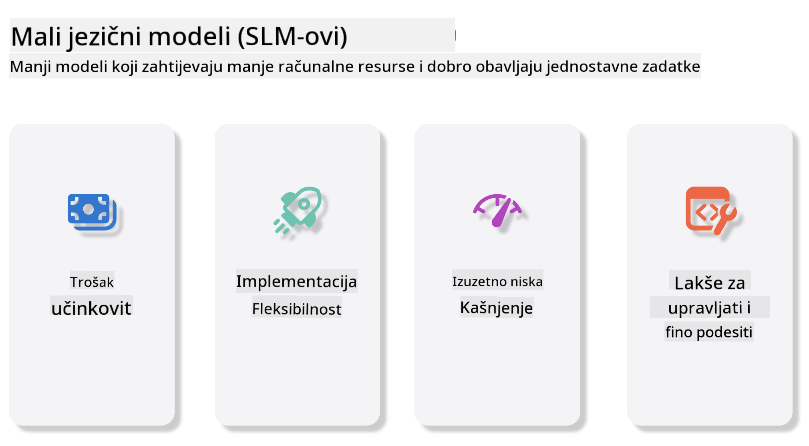
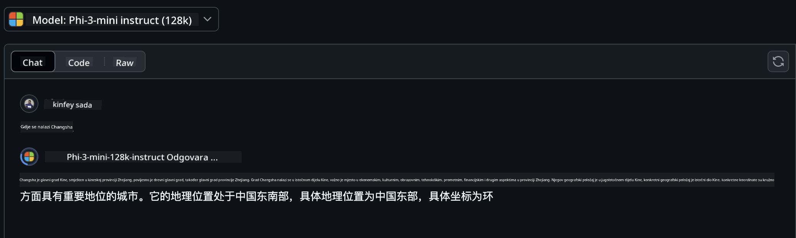
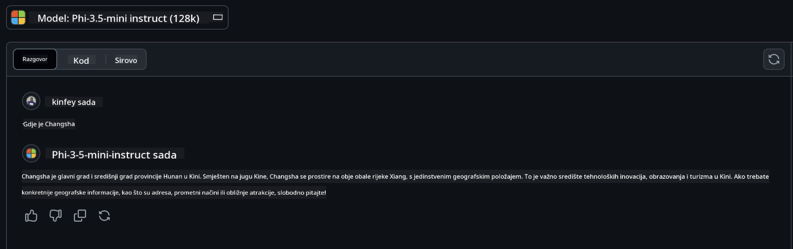

<!--
CO_OP_TRANSLATOR_METADATA:
{
  "original_hash": "124ad36cfe96f74038811b6e2bb93e9d",
  "translation_date": "2025-05-20T10:40:48+00:00",
  "source_file": "19-slm/README.md",
  "language_code": "hr"
}
-->
# Uvod u male jezične modele za generativnu umjetnu inteligenciju za početnike

Generativna umjetna inteligencija je fascinantno područje umjetne inteligencije koje se fokusira na stvaranje sustava sposobnih za generiranje novog sadržaja. Ovaj sadržaj može varirati od teksta i slika do glazbe, pa čak i cijelih virtualnih okruženja. Jedna od najuzbudljivijih primjena generativne umjetne inteligencije je u području jezičnih modela.

## Što su mali jezični modeli?

Mali jezični model (SLM) predstavlja smanjenu varijantu velikog jezičnog modela (LLM), koristeći mnoge arhitektonske principe i tehnike LLM-ova, dok pokazuje značajno smanjeni računalni otisak. SLM-ovi su podskup jezičnih modela dizajniranih za generiranje teksta nalik ljudskom. Za razliku od svojih većih pandana, kao što je GPT-4, SLM-ovi su kompaktniji i učinkovitiji, što ih čini idealnim za primjene gdje su računalni resursi ograničeni. Unatoč svojoj manjoj veličini, mogu obavljati razne zadatke. Obično se SLM-ovi konstruiraju kompresijom ili destilacijom LLM-ova, s ciljem zadržavanja značajnog dijela izvorne funkcionalnosti i jezičnih sposobnosti modela. Ovo smanjenje veličine modela smanjuje ukupnu složenost, čineći SLM-ove učinkovitijima u pogledu korištenja memorije i računalnih zahtjeva. Unatoč tim optimizacijama, SLM-ovi mogu obavljati širok raspon zadataka obrade prirodnog jezika (NLP):

- Generiranje teksta: Stvaranje koherentnih i kontekstualno relevantnih rečenica ili odlomaka.
- Dovršavanje teksta: Predviđanje i dovršavanje rečenica na temelju danog upita.
- Prijevod: Pretvaranje teksta s jednog jezika na drugi.
- Sažimanje: Skraćivanje dugih dijelova teksta u kraće, lakše probavljive sažetke.

Iako s nekim kompromisima u izvedbi ili dubini razumijevanja u usporedbi s njihovim većim pandana.

## Kako rade mali jezični modeli?

SLM-ovi su obučeni na velikim količinama tekstualnih podataka. Tijekom obuke, uče obrasce i strukture jezika, omogućujući im generiranje teksta koji je gramatički ispravan i kontekstualno prikladan. Proces obuke uključuje:

- Prikupljanje podataka: Prikupljanje velikih skupova podataka teksta iz različitih izvora.
- Predobrada: Čišćenje i organiziranje podataka kako bi bili prikladni za obuku.
- Obuka: Korištenje algoritama strojnog učenja za poučavanje modela kako razumjeti i generirati tekst.
- Fino podešavanje: Prilagođavanje modela za poboljšanje njegove izvedbe na specifičnim zadacima.

Razvoj SLM-ova usklađen je s rastućom potrebom za modelima koji se mogu implementirati u okruženjima s ograničenim resursima, kao što su mobilni uređaji ili platforme za rubno računalstvo, gdje puni LLM-ovi mogu biti nepraktični zbog svojih velikih zahtjeva za resursima. Fokusiranjem na učinkovitost, SLM-ovi balansiraju izvedbu s dostupnošću, omogućujući širu primjenu u raznim domenama.



## Ciljevi učenja

U ovoj lekciji nadamo se predstaviti znanje o SLM-ovima i kombinirati ga s Microsoft Phi-3 kako bismo naučili različite scenarije u tekstualnom sadržaju, viziji i MoE. Na kraju ove lekcije trebali biste biti u stanju odgovoriti na sljedeća pitanja:

- Što je SLM
- Koja je razlika između SLM-a i LLM-a
- Što je Microsoft Phi-3/3.5 Family
- Kako izvesti zaključke Microsoft Phi-3/3.5 Family

Spremni? Krenimo.

## Razlike između velikih jezičnih modela (LLM-ova) i malih jezičnih modela (SLM-ova)

I LLM-ovi i SLM-ovi izgrađeni su na temeljima probabilističkog strojnog učenja, slijedeći slične pristupe u njihovom arhitektonskom dizajnu, metodologijama obuke, procesima generiranja podataka i tehnikama evaluacije modela. Međutim, nekoliko ključnih čimbenika razlikuje ove dvije vrste modela.

## Primjene malih jezičnih modela

SLM-ovi imaju širok raspon primjena, uključujući:

- Chatbotovi: Pružanje korisničke podrške i interakcija s korisnicima na konverzacijski način.
- Stvaranje sadržaja: Pomoć piscima u generiranju ideja ili čak pisanju cijelih članaka.
- Obrazovanje: Pomoć studentima s pisanim zadacima ili učenjem novih jezika.
- Pristupačnost: Stvaranje alata za osobe s invaliditetom, kao što su sustavi za pretvaranje teksta u govor.

**Veličina**

Primarna razlika između LLM-ova i SLM-ova leži u razmjeru modela. LLM-ovi, kao što je ChatGPT (GPT-4), mogu sadržavati procijenjenih 1,76 trilijuna parametara, dok su open-source SLM-ovi poput Mistral 7B dizajnirani sa znatno manje parametara — otprilike 7 milijardi. Ova razlika je prvenstveno zbog razlika u arhitekturi modela i procesima obuke. Na primjer, ChatGPT koristi mehanizam samopozornosti unutar okvira enkoder-dekoder, dok Mistral 7B koristi klizni prozor pažnje, što omogućuje učinkovitiju obuku unutar modela koji koristi samo dekoder. Ova arhitektonska raznolikost ima duboke implikacije za složenost i izvedbu ovih modela.

**Razumijevanje**

SLM-ovi su obično optimizirani za izvedbu unutar specifičnih domena, što ih čini visoko specijaliziranim, ali potencijalno ograničenim u sposobnosti pružanja širokog kontekstualnog razumijevanja kroz više područja znanja. Nasuprot tome, LLM-ovi nastoje simulirati ljudsku inteligenciju na sveobuhvatniji način. Obučeni na velikim, raznolikim skupovima podataka, LLM-ovi su dizajnirani da dobro rade u različitim domenama, nudeći veću svestranost i prilagodljivost. Posljedično, LLM-ovi su prikladniji za širi raspon zadataka nizvodno, kao što su obrada prirodnog jezika i programiranje.

**Računalni resursi**

Obuka i implementacija LLM-ova su procesi koji zahtijevaju značajne računalne resurse, često zahtijevajući značajnu računalnu infrastrukturu, uključujući velike GPU klastere. Na primjer, obuka modela poput ChatGPT-a od nule može zahtijevati tisuće GPU-ova tijekom duljih razdoblja. Nasuprot tome, SLM-ovi, sa svojim manjim brojem parametara, pristupačniji su u smislu računalnih resursa. Modeli poput Mistral 7B mogu se obučavati i pokretati na lokalnim računalima opremljenim umjerenim GPU mogućnostima, iako obuka još uvijek zahtijeva nekoliko sati na više GPU-ova.

**Pristranost**

Pristranost je poznat problem u LLM-ovima, prvenstveno zbog prirode podataka za obuku. Ovi modeli često se oslanjaju na sirove, otvoreno dostupne podatke s interneta, koji mogu podzastupljivati ili pogrešno predstavljati određene skupine, uvoditi pogrešno označavanje ili odražavati jezične pristranosti pod utjecajem dijalekta, geografskih varijacija i gramatičkih pravila. Dodatno, složenost LLM arhitektura može nenamjerno pogoršati pristranost, koja može proći nezapaženo bez pažljivog finog podešavanja. S druge strane, SLM-ovi, budući da su obučeni na ograničenijim, domeni specifičnim skupovima podataka, inherentno su manje podložni takvim pristranostima, iako nisu imuni na njih.

**Zaključivanje**

Smanjena veličina SLM-ova pruža im značajnu prednost u smislu brzine zaključivanja, omogućujući im da generiraju izlaze učinkovito na lokalnom hardveru bez potrebe za opsežnom paralelnom obradom. Nasuprot tome, LLM-ovi, zbog svoje veličine i složenosti, često zahtijevaju značajne paralelne računalne resurse za postizanje prihvatljivih vremena zaključivanja. Prisutnost više istovremenih korisnika dodatno usporava vrijeme odziva LLM-ova, osobito kada su implementirani u velikom opsegu.

U sažetku, iako i LLM-ovi i SLM-ovi dijele temeljnu osnovu u strojnom učenju, značajno se razlikuju u smislu veličine modela, zahtjeva za resursima, kontekstualnog razumijevanja, podložnosti pristranosti i brzine zaključivanja. Ove razlike odražavaju njihovu odgovarajuću prikladnost za različite slučajeve upotrebe, pri čemu su LLM-ovi svestraniji, ali zahtijevaju više resursa, dok SLM-ovi nude veću domensko-specifičnu učinkovitost sa smanjenim računalnim zahtjevima.

***Napomena: U ovom poglavlju, predstavit ćemo SLM koristeći Microsoft Phi-3 / 3.5 kao primjer.***

## Predstavljanje obitelji Phi-3 / Phi-3.5

Obitelj Phi-3 / 3.5 uglavnom cilja tekst, viziju i Agent (MoE) scenarije primjene:

### Phi-3 / 3.5 Upute

Uglavnom za generiranje teksta, dovršavanje razgovora i ekstrakciju sadržajnih informacija, itd.

**Phi-3-mini**

Model jezika od 3,8 milijardi parametara dostupan je na Microsoft Azure AI Studio, Hugging Face i Ollama. Phi-3 modeli značajno nadmašuju jezične modele jednake i veće veličine na ključnim referentnim točkama (vidi dolje navedene brojeve referentnih točaka, veći brojevi su bolji). Phi-3-mini nadmašuje modele dvostruke veličine, dok Phi-3-small i Phi-3-medium nadmašuju veće modele, uključujući GPT-3.5.

**Phi-3-small & medium**

Samo s 7 milijardi parametara, Phi-3-small nadmašuje GPT-3.5T na raznim jezičnim, logičkim, kodirajućim i matematičkim referentnim točkama. Phi-3-medium s 14 milijardi parametara nastavlja ovaj trend i nadmašuje Gemini 1.0 Pro.

**Phi-3.5-mini**

Možemo ga smatrati nadogradnjom Phi-3-mini. Iako parametri ostaju nepromijenjeni, poboljšava sposobnost podržavanja više jezika (podržava 20+ jezika: arapski, kineski, češki, danski, nizozemski, engleski, finski, francuski, njemački, hebrejski, mađarski, talijanski, japanski, korejski, norveški, poljski, portugalski, ruski, španjolski, švedski, tajlandski, turski, ukrajinski) i dodaje jaču podršku za dugi kontekst. Phi-3.5-mini s 3,8 milijardi parametara nadmašuje jezične modele iste veličine i izjednačen je s modelima dvostruke veličine.

### Phi-3 / 3.5 Vizija

Možemo smatrati Instruct model Phi-3/3.5 kao Phi-jevu sposobnost razumijevanja, a Vizija je ono što daje Phi-ju oči da razumije svijet.

**Phi-3-Vizija**

Phi-3-vizija, s samo 4,2 milijarde parametara, nastavlja ovaj trend i nadmašuje veće modele kao što su Claude-3 Haiku i Gemini 1.0 Pro V na općim zadacima vizualnog zaključivanja, OCR-u i zadacima razumijevanja tablica i dijagrama.

**Phi-3.5-Vizija**

Phi-3.5-Vizija je također nadogradnja Phi-3-Vizije, dodajući podršku za više slika. Možete ga smatrati poboljšanjem vizije, ne samo da možete vidjeti slike, već i videozapise. Phi-3.5-vizija nadmašuje veće modele kao što su Claude-3.5 Sonnet i Gemini 1.5 Flash u OCR-u, zadacima razumijevanja tablica i grafikona te je izjednačena u općim zadacima vizualnog znanja. Podržava unos više okvira, tj. izvođenje zaključivanja na više ulaznih slika.

### Phi-3.5-MoE

***Mješavina stručnjaka (MoE)*** omogućuje modelima da se unaprijed obučavaju s mnogo manje računalne snage, što znači da možete dramatično povećati veličinu modela ili skupa podataka s istim proračunom za računanje kao gusti model. Konkretno, MoE model bi trebao postići istu kvalitetu kao njegov gusti pandan mnogo brže tijekom predobuke. Phi-3.5-MoE sastoji se od 16x3.8B stručnih modula. Phi-3.5-MoE s samo 6.6B aktivnih parametara postiže sličnu razinu zaključivanja, razumijevanja jezika i matematike kao mnogo veći modeli.

Možemo koristiti model obitelji Phi-3/3.5 na temelju različitih scenarija. Za razliku od LLM-a, možete implementirati Phi-3/3.5-mini ili Phi-3/3.5-Vizija na rubnim uređajima.

## Kako koristiti modele obitelji Phi-3/3.5

Nadamo se koristiti Phi-3/3.5 u različitim scenarijima. Sljedeće ćemo koristiti Phi-3/3.5 na temelju različitih scenarija.


### Razlika u zaključivanju

Cloud API

**GitHub modeli**

GitHub
Modeli su najizravniji način. Možete brzo pristupiti modelu Phi-3/3.5-Instruct putem GitHub Modela. U kombinaciji s Azure AI Inference SDK / OpenAI SDK, možete pristupiti API-ju putem koda za dovršetak poziva Phi-3/3.5-Instruct. Također možete testirati različite efekte putem Playgrounda. - Demo: Usporedba efekata Phi-3-mini i Phi-3.5-mini u kineskim scenarijima   **Azure AI Studio** Ili ako želimo koristiti modele vizije i MoE, možete koristiti Azure AI Studio za dovršetak poziva. Ako ste zainteresirani, možete pročitati Phi-3 Cookbook kako biste naučili kako pozivati Phi-3/3.5 Instruct, Vision, MoE putem Azure AI Studio [Kliknite ovaj link](https://github.com/microsoft/Phi-3CookBook/blob/main/md/02.QuickStart/AzureAIStudio_QuickStart.md?WT.mc_id=academic-105485-koreyst) **NVIDIA NIM** Osim rješenja kataloga modela temeljenih na oblaku koje nude Azure i GitHub, možete koristiti i [Nivida NIM](https://developer.nvidia.com/nim?WT.mc_id=academic-105485-koreyst) za dovršavanje povezanih poziva. Možete posjetiti NIVIDA NIM za dovršavanje API poziva za obitelj Phi-3/3.5. NVIDIA NIM (NVIDIA Inference Microservices) je skup ubrzanih mikrousloga za inferenciju dizajniranih kako bi pomogli programerima da učinkovito implementiraju AI modele u raznim okruženjima, uključujući oblake, podatkovne centre i radne stanice. Evo nekih ključnih značajki NVIDIA NIM-a: - **Jednostavnost implementacije:** NIM omogućuje implementaciju AI modela s jednom naredbom, čineći ga jednostavnim za integraciju u postojeće tijekove rada. - **Optimizirana izvedba:** Koristi NVIDIA-ine unaprijed optimizirane motore za inferenciju, kao što su TensorRT i TensorRT-LLM, kako bi osigurao nisku latenciju i visok propusnost. - **Skalabilnost:** NIM podržava automatsko skaliranje na Kubernetesu, omogućujući mu učinkovito rukovanje različitim opterećenjima. - **Sigurnost i kontrola:** Organizacije mogu održavati kontrolu nad svojim podacima i aplikacijama samostalnim hostiranjem NIM mikrousloga na vlastitoj upravljanoj infrastrukturi. - **Standardni API-ji:** NIM pruža industrijske standardne API-je, što olakšava izgradnju i integraciju AI aplikacija poput chatbotova, AI asistenata i više. NIM je dio NVIDIA AI Enterprise, koji ima za cilj pojednostaviti implementaciju i operacionalizaciju AI modela, osiguravajući da rade učinkovito na NVIDIA GPU-ima. - Demo: Korištenje Nividia NIM-a za pozivanje Phi-3.5-Vision-API [[Kliknite ovaj link](../../../19-slm/python/Phi-3-Vision-Nividia-NIM.ipynb)] ### Inferencija Phi-3/3.5 u lokalnom okruženju Inferencija u vezi s Phi-3, ili bilo kojim jezičnim modelom poput GPT-3, odnosi se na proces generiranja odgovora ili predviđanja na temelju ulaza koji prima. Kada pružite upit ili pitanje Phi-3, koristi svoju treniranu neuronsku mrežu za izvođenje najvjerojatnijeg i najrelevantnijeg odgovora analizirajući obrasce i odnose u podacima na kojima je treniran. **Hugging Face Transformer** Hugging Face Transformers je moćna knjižnica dizajnirana za obradu prirodnog jezika (NLP) i druge zadatke strojnog učenja. Evo nekih ključnih točaka o njoj: 1. **Pretrenirani modeli**: Pruža tisuće pretreniranih modela koji se mogu koristiti za razne zadatke kao što su klasifikacija teksta, prepoznavanje imenovanih entiteta, odgovaranje na pitanja, sažimanje, prevođenje i generiranje teksta. 2. **Interoperabilnost okvira**: Knjižnica podržava više okvira dubokog učenja, uključujući PyTorch, TensorFlow i JAX. To vam omogućuje treniranje modela u jednom okviru i korištenje u drugom. 3. **Multimodalne sposobnosti**: Osim NLP-a, Hugging Face Transformers također podržava zadatke u računalnom vidu (npr. klasifikacija slika, detekcija objekata) i obradi zvuka (npr. prepoznavanje govora, klasifikacija zvuka). 4. **Jednostavnost korištenja**: Knjižnica nudi API-je i alate za jednostavno preuzimanje i fino podešavanje modela, čineći je pristupačnom za početnike i stručnjake. 5. **Zajednica i resursi**: Hugging Face ima živu zajednicu i opsežnu dokumentaciju, tutorijale i vodiče koji pomažu korisnicima da započnu i iskoriste knjižnicu na najbolji način. [službena dokumentacija](https://huggingface.co/docs/transformers/index?WT.mc_id=academic-105485-koreyst) ili njihov [GitHub repozitorij](https://github.com/huggingface/transformers?WT.mc_id=academic-105485-koreyst). Ovo je najčešće korištena metoda, ali također zahtijeva GPU akceleraciju. Uostalom, scene poput Vision i MoE zahtijevaju mnogo izračuna, što će biti vrlo ograničeno na CPU-u ako nisu kvantizirane. - Demo: Korištenje Transformera za pozivanje Phi-3.5-Instuct [Kliknite ovaj link](../../../19-slm/python/phi35-instruct-demo.ipynb) - Demo: Korištenje Transformera za pozivanje Phi-3.5-Vision[Kliknite ovaj link](../../../19-slm/python/phi35-vision-demo.ipynb) - Demo: Korištenje Transformera za pozivanje Phi-3.5-MoE[Kliknite ovaj link](../../../19-slm/python/phi35_moe_demo.ipynb) **Ollama** [Ollama](https://ollama.com/?WT.mc_id=academic-105485-koreyst) je platforma dizajnirana za olakšavanje pokretanja velikih jezičnih modela (LLM) lokalno na vašem računalu. Podržava razne modele kao što su Llama 3.1, Phi 3, Mistral i Gemma 2, među ostalima. Platforma pojednostavljuje proces kombiniranjem težina modela, konfiguracije i podataka u jedan paket, čineći ga pristupačnijim za korisnike za prilagodbu i stvaranje vlastitih modela. Ollama je dostupna za macOS, Linux i Windows. To je odličan alat ako želite eksperimentirati s ili implementirati LLM-ove bez oslanjanja na usluge u oblaku. Ollama je najizravniji način, samo trebate izvršiti sljedeću izjavu. ```bash

ollama run phi3.5

``` **ONNX Runtime za GenAI** [ONNX Runtime](https://github.com/microsoft/onnxruntime-genai?WT.mc_id=academic-105485-koreyst) je unakrsna platforma za inferenciju i obuku akceleratora strojnog učenja. ONNX Runtime za Generativnu AI (GENAI) je moćan alat koji vam pomaže u pokretanju generativnih AI modela učinkovito na raznim platformama. ## Što je ONNX Runtime? ONNX Runtime je projekt otvorenog koda koji omogućuje visokoučinkovitu inferenciju modela strojnog učenja. Podržava modele u Open Neural Network Exchange (ONNX) formatu, koji je standard za predstavljanje modela strojnog učenja. ONNX Runtime inferencija može omogućiti brže korisničko iskustvo i niže troškove, podržavajući modele iz okvira dubokog učenja kao što su PyTorch i TensorFlow/Keras, kao i klasične knjižnice strojnog učenja kao što su scikit-learn, LightGBM, XGBoost itd. ONNX Runtime je kompatibilan s različitim hardverom, upravljačkim programima i operativnim sustavima te pruža optimalnu izvedbu korištenjem hardverskih akceleratora gdje je primjenjivo uz optimizacije grafa i transformacije. ## Što je Generativna AI? Generativna AI odnosi se na AI sustave koji mogu generirati novi sadržaj, kao što su tekst, slike ili glazba, na temelju podataka na kojima su trenirani. Primjeri uključuju jezične modele poput GPT-3 i modele generiranja slika poput Stable Diffusion. ONNX Runtime za GenAI knjižnica pruža generativnu AI petlju za ONNX modele, uključujući inferenciju s ONNX Runtime, obradu logita, pretragu i uzorkovanje te upravljanje KV cache-om. ## ONNX Runtime za GENAI ONNX Runtime za GENAI proširuje mogućnosti ONNX Runtime kako bi podržao generativne AI modele. Evo nekih ključnih značajki: - **Široka podrška platformi:** Radi na raznim platformama, uključujući Windows, Linux, macOS, Android i iOS. - **Podrška za modele:** Podržava mnoge popularne generativne AI modele, kao što su LLaMA, GPT-Neo, BLOOM i više. - **Optimizacija performansi:** Uključuje optimizacije za različite hardverske akceleratore poput NVIDIA GPU-ova, AMD GPU-ova i više. - **Jednostavnost korištenja:** Pruža API-je za jednostavnu integraciju u aplikacije, omogućujući vam generiranje teksta, slika i drugog sadržaja s minimalnim kodom - Korisnici mogu pozvati metodu generate() na visokoj razini, ili pokrenuti svaku iteraciju modela u petlji, generirajući jedan token po jedan, i opcionalno ažurirati parametre generiranja unutar petlje. - ONNX runtime također podržava pohlepnu/greedy pretragu i TopP, TopK uzorkovanje za generiranje sekvenci tokena i ugrađenu obradu logita poput kazni za ponavljanje. Također možete lako dodati prilagođeno bodovanje. ## Početak rada Da biste započeli s ONNX Runtime za GENAI, možete slijediti ove korake: ### Instalirajte ONNX Runtime: ```Python
pip install onnxruntime
``` ### Instalirajte ekstenzije za Generativnu AI: ```Python
pip install onnxruntime-genai
``` ### Pokrenite model: Evo jednostavnog primjera u Pythonu: ```Python
import onnxruntime_genai as og

model = og.Model('path_to_your_model.onnx')

tokenizer = og.Tokenizer(model)

input_text = "Hello, how are you?"

input_tokens = tokenizer.encode(input_text)

output_tokens = model.generate(input_tokens)

output_text = tokenizer.decode(output_tokens)

print(output_text) 
``` ### Demo: Korištenje ONNX Runtime GenAI za pozivanje Phi-3.5-Vision ```python

import onnxruntime_genai as og

model_path = './Your Phi-3.5-vision-instruct ONNX Path'

img_path = './Your Image Path'

model = og.Model(model_path)

processor = model.create_multimodal_processor()

tokenizer_stream = processor.create_stream()

text = "Your Prompt"

prompt = "<|user|>\n"

prompt += "<|image_1|>\n"

prompt += f"{text}<|end|>\n"

prompt += "<|assistant|>\n"

image = og.Images.open(img_path)

inputs = processor(prompt, images=image)

params = og.GeneratorParams(model)

params.set_inputs(inputs)

params.set_search_options(max_length=3072)

generator = og.Generator(model, params)

while not generator.is_done():

    generator.compute_logits()
    
    generator.generate_next_token()

    new_token = generator.get_next_tokens()[0]
    
    code += tokenizer_stream.decode(new_token)
    
    print(tokenizer_stream.decode(new_token), end='', flush=True)

``` **Ostali** Osim ONNX Runtime i Ollama referentnih metoda, također možemo dovršiti referencu kvantitativnih modela na temelju metoda referenci modela koje pružaju različiti proizvođači. Kao što su Apple MLX okvir s Apple Metal, Qualcomm QNN s NPU, Intel OpenVINO s CPU/GPU itd. Također možete dobiti više sadržaja iz [Phi-3 Cookbook](https://github.com/microsoft/phi-3cookbook?WT.mc_id=academic-105485-koreyst) ## Više Naučili smo osnove obitelji Phi-3/3.5, ali da bismo naučili više o SLM-u trebamo više znanja. Odgovore možete pronaći u Phi-3 Cookbook. Ako želite saznati više, posjetite [Phi-3 Cookbook](https://github.com/microsoft/phi-3cookbook?WT.mc_id=academic-105485-koreyst).

**Odricanje odgovornosti**:  
Ovaj dokument je preveden korištenjem AI usluge prevođenja [Co-op Translator](https://github.com/Azure/co-op-translator). Iako se trudimo postići točnost, imajte na umu da automatski prijevodi mogu sadržavati pogreške ili netočnosti. Izvorni dokument na izvornom jeziku treba smatrati autoritativnim izvorom. Za ključne informacije preporučuje se profesionalni prijevod od strane čovjeka. Ne odgovaramo za bilo kakve nesporazume ili pogrešna tumačenja koja proizlaze iz korištenja ovog prijevoda.