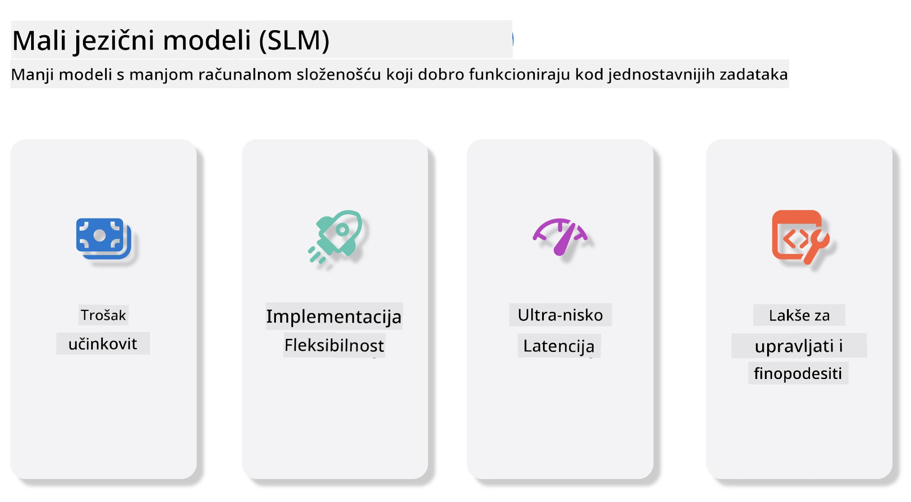
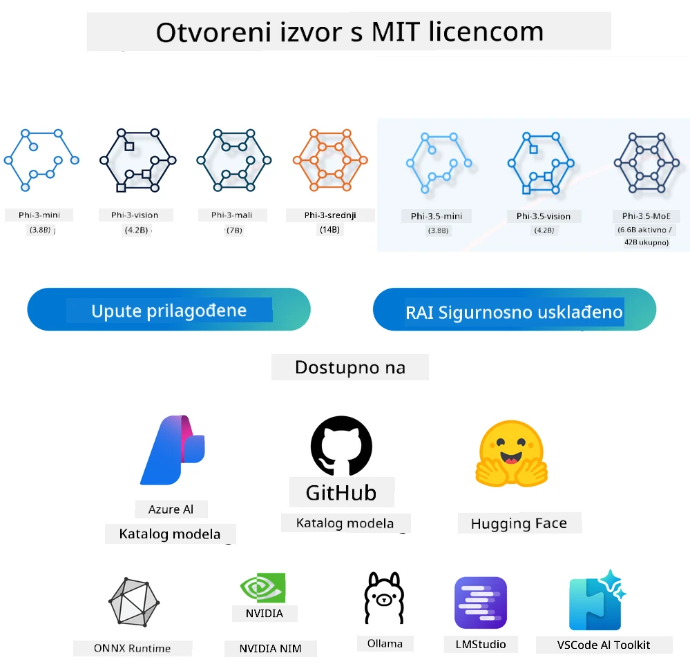
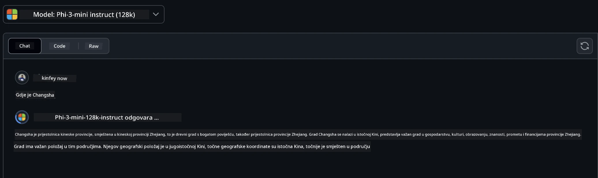
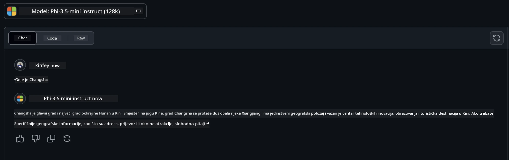

# Uvod u Male Jezične Modele za Generativnu AI za Početnike
Generativna AI je fascinantno područje umjetne inteligencije koje se fokusira na stvaranje sustava sposobnih generirati novi sadržaj. Taj sadržaj može uključivati tekst i slike, glazbu pa čak i cijela virtualna okruženja. Jedna od najuzbudljivijih primjena generativne AI jest područje jezičnih modela.

## Što su Mali Jezični Modeli?

Mali jezični model (SLM) predstavlja smanjenu varijantu velikog jezičnog modela (LLM), koristeći mnoge arhitektonske principe i tehnike LLM-ova, dok pokazuje znatno smanjen računalni otisak.

SLM-ovi su podskup jezičnih modela dizajniranih za generiranje teksta nalik ljudskom. Za razliku od svojih većih kolega, poput GPT-4, SLM-ovi su kompaktni i učinkoviti, što ih čini idealnima za primjene gdje su računalni resursi ograničeni. Usprkos manjoj veličini, oni i dalje mogu obavljati razne zadatke. Tipično, SLM-ovi se konstruiraju kompresijom ili destilacijom LLM-ova, s ciljem zadržavanja značajnog dijela izvorne funkcionalnosti i jezičnih sposobnosti modela. Ovo smanjenje veličine modela smanjuje ukupnu složenost, čineći SLM-ove učinkovitijima u pogledu memorijske potrošnje i računalnih zahtjeva. Unatoč ovim optimizacijama, SLM-ovi mogu obavljati širok raspon zadataka obrade prirodnog jezika (NLP):

- Generiranje teksta: Stvaranje koherentnih i kontekstualno relevantnih rečenica ili odlomaka.
- Dovršavanje teksta: Predviđanje i dovršavanje rečenica na temelju zadanog upita.
- Prijevod: Pretvaranje teksta iz jednog jezika u drugi.
- Sažimanje: Sažimanje dugih tekstova u kraće, preglednije sažetke.

Iako uz određene kompromise u izvedbi ili dubini razumijevanja u odnosu na njihove veće kolege.

## Kako Male Jezične Modele Funkcioniraju?
SLM-ovi se treniraju na velikim količinama tekstualnih podataka. Tijekom treninga, uče obrasce i strukture jezika, omogućujući im generiranje teksta koji je gramatički ispravan i kontekstualno odgovarajući. Proces treninga uključuje:

- Prikupljanje podataka: Sakupljanje velikih skupova tekstova iz raznih izvora.
- Predobrada: Čišćenje i organiziranje podataka kako bi bili prikladni za trening.
- Trening: Korištenje algoritama strojnog učenja za učenje modela kako razumjeti i generirati tekst.
- Fino podešavanje: Prilagodba modela radi poboljšanja izvedbe na specifičnim zadacima.

Razvoj SLM-ova usklađen je s rastućom potrebom za modelima koji se mogu implementirati u okruženjima s ograničenim resursima, poput mobilnih uređaja ili edge računalnih platformi, gdje bi LLM-ovi pune snage bili nepraktični zbog velike potrošnje resursa. Fokusiranjem na učinkovitost, SLM-ovi ostvaruju balans između performansi i pristupačnosti, omogućavajući širu primjenu u različitim područjima.



## Ciljevi Učenja

U ovoj lekciji nadamo se predstaviti znanje o SLM-ovima i kombinirati ga s Microsoft Phi-3 kako bismo naučili različite scenarije u tekstualnom sadržaju, vidu i MoE.

Na kraju ove lekcije trebali biste moći odgovoriti na sljedeća pitanja:

- Što je SLM?
- Koja je razlika između SLM i LLM?
- Što je Microsoft Phi-3/3.5 obitelj?
- Kako izvršiti inferenciju pomoću Microsoft Phi-3/3.5 obitelji?

Spremni? Krenimo.

## Razlike između Velikih Jezičnih Modela (LLM) i Malih Jezičnih Modela (SLM)

I LLM-ovi i SLM-ovi temelje se na osnovnim principima probabilističkog strojnog učenja, slijedeći slične pristupe u arhitektonskom dizajnu, metodologijama treninga, procesima generiranja podataka i tehnikama evaluacije modela. Međutim, nekoliko ključnih čimbenika razlikuje ove dvije vrste modela.

## Primjene Malih Jezičnih Modela

SLM-ovi imaju širok spektar primjena, uključujući:

- Chatbotovi: Pružanje korisničke podrške i vođenje razgovora s korisnicima.
- Kreiranje sadržaja: Pomoć piscima u generiranju ideja ili čak sastavljanju cijelih članaka.
- Obrazovanje: Pomoć učenicima u pisanju zadataka ili učenju novih jezika.
- Pristupačnost: Izrada alata za osobe s invaliditetom, poput sustava za pretvaranje teksta u govor.

**Veličina**

Osnovna razlika između LLM i SLM-modela leži u njihovoj skali. LLM-ovi, poput ChatGPT-a (GPT-4), mogu sadržavati procijenjenih 1.76 bilijuna parametara, dok otvoreni SLM-ovi poput Mistral 7B imaju značajno manji broj parametara — otprilike 7 milijardi. Ova razlika prvenstveno proizlazi iz razlika u arhitekturi modela i procesima treninga. Na primjer, ChatGPT koristi mehanizam samo-pažnje u okviru enkoder-dekoder arhitekture, dok Mistral 7B koristi prozor pažnje, što omogućava učinkovitiji trening unutar modela samo-dekoder. Ova arhitektonska razlika ima duboke implikacije na složenost i izvedbu ovih modela.

**Razumijevanje**

SLM-ovi su obično optimizirani za izvedbu unutar specifičnih domena, što ih čini vrlo specijaliziranim, ali potencijalno ograničenim u njihovoj sposobnosti pružanja širokog kontekstualnog razumijevanja kroz razna područja znanja. Nasuprot tome, LLM-ovi nastoje simulirati ljudsku inteligenciju na sveobuhvatnijoj razini. Trenirani na golemim, raznolikim skupovima podataka, LLM-ovi su dizajnirani za dobre performanse u različitim domenama, nudeći veću svestranost i prilagodljivost. Stoga su LLM-ovi prikladniji za širi raspon zadataka poput obrade prirodnog jezika i programiranja.

**Računalni Resursi**

Trening i implementacija LLM-ova zahtijevaju velike resurse, često uključujući značajnu računalnu infrastrukturu poput velikih klastera GPU jedinica. Na primjer, treniranje modela poput ChatGPT od samog početka može zahtijevati tisuće GPU-a tijekom dugog vremenskog razdoblja. S druge strane, SLM-ovi, sa svojim manjim brojem parametara, pristupačniji su u smislu računalnih resursa. Modeli poput Mistral 7B mogu se trenirati i pokretati na lokalnim računalima opremljenim umjerenim GPU kapacitetima, iako trening i dalje zahtijeva nekoliko sati na više GPU-a.

**Pristranost**

Pristranost je poznat problem kod LLM-ova, uglavnom zbog prirode trening podataka. Ti modeli često koriste sirove, javno dostupne podatke s interneta, koji mogu podzastupljivati ili krivo prikazivati određene skupine, uvoditi netočne oznake ili odražavati jezične pristranosti koje proizlaze iz dijalekata, geografskih varijacija i gramatičkih pravila. Osim toga, složenost arhitekture LLM-ova može nenamjerno pojačati pristranosti, koje mogu ostati neprimijećene bez pažljivog fino podešavanja. S druge strane, SLM-ovi, trenirani na ograničenijim, domen-specifičnim skupovima podataka, prirodno su manje podložni takvim pristranostima, iako nisu potpuno imuni.

**Inferencija**

Manja veličina SLM-ova daje im značajnu prednost u brzini inferencije, dopuštajući im učinkovito generiranje rezultata na lokalnom hardveru bez potrebe za opsežnim paralelnim procesiranjem. Suprotno tome, LLM-ovi, zbog svoje veličine i složenosti, često zahtijevaju velike paralelne računalne resurse kako bi postigli prihvatljive vremenske intervale inferencije. Prisutnost više istovremenih korisnika dodatno usporava vrijeme odziva LLM-ova, osobito kada su implementirani na velikoj skali.

U sažetku, iako LLM-ovi i SLM-ovi dijele temeljne principe strojnog učenja, značajno se razlikuju u veličini modela, zahtjevima za resursima, kontekstualnom razumijevanju, podložnosti pristranosti i brzini inferencije. Te razlike odražavaju njihovu prikladnost za različite primjene, pri čemu su LLM-ovi svestraniji, ali zahtjevniji za resurse, dok SLM-ovi nude efikasnost u specifičnim domenama s manjim računalnim zahtjevima.

***Napomena: U ovoj lekciji uvodimo SLM koristeći Microsoft Phi-3 / 3.5 kao primjer.***

## Predstavljanje Phi-3 / Phi-3.5 Obitelji

Phi-3 / 3.5 obitelj primarno cilja na tekst, viziju i aplikacijske scenarije Agenta (MoE):

### Phi-3 / 3.5 Instruct

Prvenstveno za generiranje teksta, dovršavanje razgovora i izvlačenje informacija iz sadržaja.

**Phi-3-mini**

Jezični model od 3.8B dostupan je na Microsoft Azure AI Studio, Hugging Face i Ollama. Phi-3 modeli značajno nadmašuju jezične modele iste i veće veličine na ključnim benchmark testovima (vidi ispod benchmark brojeve, veći broj je bolji). Phi-3-mini nadmašuje modele dvostruke veličine, dok Phi-3-small i Phi-3-medium nadmašuju veće modele, uključujući GPT-3.5.

**Phi-3-small & medium**

Samo sa 7 milijardi parametara, Phi-3-small pobjeđuje GPT-3.5T na raznim benchmarkovima za jezik, zaključivanje, kodiranje i matematiku.

Phi-3-medium s 14 milijardi parametara nastavlja ovaj trend i nadmašuje Gemini 1.0 Pro.

**Phi-3.5-mini**

Možemo ga smatrati nadogradnjom Phi-3-mini. Iako se broj parametara nije promijenio, poboljšava sposobnost podrške za više jezika (podržava 20+ jezika: arapski, kineski, češki, danski, nizozemski, engleski, finski, francuski, njemački, hebrejski, mađarski, talijanski, japanski, korejski, norveški, poljski, portugalski, ruski, španjolski, švedski, tajlandski, turski, ukrajinski) i dodaje jaču podršku za dugi kontekst.

Phi-3.5-mini s 3.8B parametara nadmašuje modele iste veličine i jednaka je modelima dvostruke veličine.

### Phi-3 / 3.5 Vision

Instruct model Phi-3/3.5 možemo promatrati kao Phi-ovu sposobnost razumijevanja, a Vision je ono što Phi-u daje oči da razumije svijet.


**Phi-3-Vision**

Phi-3-Vision, sa samo 4.2B parametara, nastavlja ovaj trend i nadmašuje veće modele poput Claude-3 Haiku i Gemini 1.0 Pro V u zadacima općeg vizualnog zaključivanja, OCR-a te razumijevanja tablica i dijagrama.


**Phi-3.5-Vision**

Phi-3.5-Vision je također nadogradnja Phi-3-Vision, dodajući podršku za više slika. Možete ga smatrati poboljšanjem vida, ne samo da može vidjeti slike, već i videozapise.

Phi-3.5-Vision nadmašuje veće modele poput Claude-3.5 Sonnet i Gemini 1.5 Flash u zadacima OCR-a, razumijevanja tablica i grafikona te je izjednačen u općem vizualnom znanju i zaključivanju. Podržava višeframe ulaze, tj. može izvoditi zaključivanje na temelju više ulaznih slika.


### Phi-3.5-MoE

***Mixture of Experts (MoE)*** omogućuje modelima da se prethodno treniraju s mnogo manjim računalnim zahtjevima, što znači da možete dramatično povećati veličinu modela ili skupa podataka uz isti budžet računalne snage kao i gusta mreža. Konkretno, MoE model bi trebao postići istu kvalitetu kao i njegov gusti pandan znatno brže tijekom pretreninga.

Phi-3.5-MoE sadrži 16x3.8B ekspertnih modula. Phi-3.5-MoE s samo 6.6B aktivnih parametara postiže razinu zaključivanja, razumijevanja jezika i matematike sličnu onoj puno većih modela.

Možemo koristiti model iz Phi-3/3.5 obitelji za različite scenarije. Za razliku od LLM, možete implementirati Phi-3/3.5-mini ili Phi-3/3.5-Vision na edge uređajima.


## Kako koristiti modele iz Phi-3/3.5 obitelji

Nadamo se koristiti Phi-3/3.5 u različitim scenarijima. Sljedeće ćemo koristiti Phi-3/3.5 na temelju različitih scenarija.



### Inferencija putem Cloud API-ja

**GitHub modeli**

GitHub modeli su najizravniji način. Možete brzo pristupiti Phi-3/3.5-Instruct modelu putem GitHub Models. U kombinaciji sa Azure AI Inference SDK / OpenAI SDK, možete preko koda pristupiti API-ju i napraviti poziv Phi-3/3.5-Instruct modela. Također možete testirati različite učinke putem Playground-a.

- Demo: Usporedba učinaka Phi-3-mini i Phi-3.5-mini u kineskim scenarijima






**Azure AI Studio**

Ako želimo koristiti vizualne i MoE modele, možemo koristiti Azure AI Studio za obavljanje poziva. Ako vas zanima, pročitajte Phi-3 Cookbook za učenje kako pozvati Phi-3/3.5 Instruct, Vision, MoE putem Azure AI Studija [Kliknite ovaj link](https://github.com/microsoft/Phi-3CookBook/blob/main/md/02.QuickStart/AzureAIStudio_QuickStart.md?WT.mc_id=academic-105485-koreyst)


**NVIDIA NIM**

Osim cloud rješenja Model Catalog koje pružaju Azure i GitHub, također možete koristiti [NVIDIA NIM](https://developer.nvidia.com/nim?WT.mc_id=academic-105485-koreyst) za izvršavanje pripadajućih poziva. Posjetite NVIDIA NIM kako biste izvršili API pozive Phi-3/3.5 Obitelji. NVIDIA NIM (NVIDIA Inference Microservices) je skup ubrzanih mikrousuga za inferenciju dizajniranih da pomognu developerima u efikasnom raspoređivanju AI modela kroz razne okoline, uključujući cloudove, podatkovne centre i radne stanice.

Evo nekoliko ključnih značajki NVIDIA NIM-a:
- **Jednostavnost implementacije:** NIM omogućava implementaciju AI modela jednim naredbom, što olakšava integraciju u postojeće radne tokove.
- **Optimizirana izvedba:** Koristi NVIDIA-in prethodno optimizirani inference engine, poput TensorRT i TensorRT-LLM, kako bi osigurao nisku latenciju i visok protok.
- **Skalabilnost:** NIM podržava autoskaliranje na Kubernetesu, omogućavajući učinkovito upravljanje različitim opterećenjima.
- **Sigurnost i kontrola:** Organizacije mogu zadržati kontrolu nad svojim podacima i aplikacijama samostalnim hostingom NIM mikrousluga na vlastitoj upravljanoj infrastrukturi.
- **Standardni API-ji:** NIM pruža industrijske standardne API-je, što olakšava izgradnju i integraciju AI aplikacija poput chatbotova, AI asistenata i drugih.

NIM je dio NVIDIA AI Enterprise, koji ima za cilj pojednostaviti implementaciju i operativnost AI modela, osiguravajući njihovo učinkovito izvođenje na NVIDIA GPU-ima.

- Demo: Korištenje NVIDIA NIM za pozivanje Phi-3.5-Vision-API-ja [[Kliknite ovaj link](./python/Phi-3-Vision-Nividia-NIM.ipynb?WT.mc_id=academic-105485-koreyst)]


### Pokretanje Phi-3/3.5 lokalno
Inferencija u odnosu na Phi-3, ili bilo koji jezični model poput GPT-3, odnosi se na proces generiranja odgovora ili predviđanja na temelju primljenog unosa. Kada pružite upit ili pitanje Phi-3, on koristi svoju treniranu neuronsku mrežu kako bi izvukao najvjerojatniji i najrelevantniji odgovor analizirajući obrasce i odnose u podacima na kojima je treniran.

**Hugging Face Transformer**  
Hugging Face Transformers je moćna biblioteka dizajnirana za obradu prirodnog jezika (NLP) i druge zadatke strojnog učenja. Evo nekoliko ključnih točaka o njoj:

1. **Pretrenirani modeli:** Pruža tisuće pretreniranih modela koji se mogu koristiti za različite zadatke kao što su klasifikacija teksta, prepoznavanje imenovanih entiteta, odgovaranje na pitanja, sažimanje, prevođenje i generiranje teksta.

2. **Interoperabilnost okvira:** Biblioteka podržava više deep learning okvira, uključujući PyTorch, TensorFlow i JAX. To vam omogućuje treniranje modela u jednom okviru i korištenje u drugom.

3. **Multimodalne mogućnosti:** Osim NLP-a, Hugging Face Transformers podržava zadatke u računalnom vidu (npr. klasifikacija slika, otkrivanje objekata) i obradi zvuka (npr. prepoznavanje govora, klasifikacija zvuka).

4. **Jednostavnost korištenja:** Biblioteka nudi API-je i alate za jednostavno preuzimanje i fino podešavanje modela, što je dostupno kako početnicima, tako i stručnjacima.

5. **Zajednica i resursi:** Hugging Face ima živu zajednicu i opsežnu dokumentaciju, tutorijale i vodiče koji pomažu korisnicima da započnu i maksimalno iskoriste biblioteku. [službena dokumentacija](https://huggingface.co/docs/transformers/index?WT.mc_id=academic-105485-koreyst) ili njihov [GitHub repozitorij](https://github.com/huggingface/transformers?WT.mc_id=academic-105485-koreyst).

Ovo je najčešće korištena metoda, ali također zahtijeva ubrzanje GPU-om. Na kraju krajeva, scenariji poput Vision i MoE zahtijevaju mnogo izračuna, što će biti vrlo sporo na CPU-u ako nisu kvantizirani.


- Demo: Korištenje Transformera za pozivanje Phi-3.5-Instruct [Kliknite ovaj link](./python/phi35-instruct-demo.ipynb?WT.mc_id=academic-105485-koreyst)

- Demo: Korištenje Transformera za pozivanje Phi-3.5-Vision [Kliknite ovaj link](./python/phi35-vision-demo.ipynb?WT.mc_id=academic-105485-koreyst)

- Demo: Korištenje Transformera za pozivanje Phi-3.5-MoE [Kliknite ovaj link](./python/phi35_moe_demo.ipynb?WT.mc_id=academic-105485-koreyst)

**Ollama**  
[Ollama](https://ollama.com/?WT.mc_id=academic-105485-koreyst) je platforma dizajnirana da olakša pokretanje velikih jezičnih modela (LLM) lokalno na vašem računalu. Podržava različite modele poput Llama 3.1, Phi 3, Mistral i Gemma 2, među ostalima. Platforma pojednostavljuje proces tako što bundla težine modela, konfiguraciju i podatke u jedan paket, što olakšava korisnicima prilagodbu i stvaranje vlastitih modela. Ollama je dostupna za macOS, Linux i Windows. Izvrsna je alatka ako želite eksperimentirati ili implementirati LLM bez oslanjanja na cloud usluge. Ollama je najdirektniji način, samo trebate izvršiti sljedeću naredbu.


```bash

ollama run phi3.5

```


**ONNX Runtime za GenAI**

[ONNX Runtime](https://github.com/microsoft/onnxruntime-genai?WT.mc_id=academic-105485-koreyst) je višestruka platforma za ubrzanje inferencije i treniranja strojnog učenja. ONNX Runtime za Generativni AI (GENAI) je snažan alat koji vam pomaže efikasno pokretati generativne AI modele na raznim platformama.

## Što je ONNX Runtime?
ONNX Runtime je open-source projekt koji omogućuje visokoučinkovitu inferenciju modela strojnog učenja. Podržava modele u Open Neural Network Exchange (ONNX) formatu, koji je standard za predstavljanje modela strojnog učenja. ONNX Runtime inferencija može omogućiti brža korisnička iskustva i niže troškove, podržavajući modele iz deep learning okvira poput PyTorch i TensorFlow/Keras kao i klasične biblioteke strojnog učenja poput scikit-learn, LightGBM, XGBoost itd. ONNX Runtime je kompatibilan s različitim hardverima, upravljačkim programima i operativnim sustavima, te pruža optimalne performanse iskorištavanjem hardverskih ubrzivača zajedno s optimizacijama i transformacijama grafa.

## Što je Generativni AI?
Generativni AI odnosi se na AI sustave koji mogu generirati nov sadržaj, poput teksta, slika ili glazbe, na temelju podataka na kojima su trenirani. Primjeri uključuju jezične modele poput GPT-3 i modele generiranja slika poput Stable Diffusion. ONNX Runtime za GenAI biblioteka pruža generativni AI ciklus za ONNX modele, uključujući inferenciju s ONNX Runtime, obradu logita, pretraživanje i uzorkovanje te upravljanje KV predmemorijom.

## ONNX Runtime za GENAI
ONNX Runtime za GENAI proširuje mogućnosti ONNX Runtime-a kako bi podržao generativne AI modele. Evo nekoliko ključnih značajki:

- **Široka podrška platformi:** Radi na raznim platformama, uključujući Windows, Linux, macOS, Android i iOS.
- **Podrška modela:** Podržava mnoge popularne generativne AI modele, poput LLaMA, GPT-Neo, BLOOM i drugih.
- **Optimizacija performansi:** Uključuje optimizacije za različite hardverske ubrzivače poput NVIDIA GPU-ova, AMD GPU-ova i drugih.
- **Jednostavnost upotrebe:** Pruža API-je za laku integraciju u aplikacije, omogućujući generiranje teksta, slika i drugog sadržaja uz minimalan kod.
- Korisnici mogu pozvati visoko razinu generate() metodu ili izvršavati svaki korak modela u petlji, generirajući jedan token u isto vrijeme, s mogućim ažuriranjem parametara generacije unutar petlje.
- ONNX runtime također podržava greedy/beam pretraživanje te TopP, TopK uzorkovanje za generiranje niza tokena i ugrađenu obradu logita poput penalizacije ponavljanja. Također možete lako dodati prilagođeno ocjenjivanje.

## Početak rada
Za početak s ONNX Runtime za GENAI možete slijediti ove korake:

### Instalirajte ONNX Runtime:
```Python
pip install onnxruntime
```
### Instalirajte Generative AI Extensions:
```Python
pip install onnxruntime-genai
```

### Pokrenite model: Evo jednostavnog primjera u Pythonu:
```Python
import onnxruntime_genai as og

model = og.Model('path_to_your_model.onnx')

tokenizer = og.Tokenizer(model)

input_text = "Hello, how are you?"

input_tokens = tokenizer.encode(input_text)

output_tokens = model.generate(input_tokens)

output_text = tokenizer.decode(output_tokens)

print(output_text) 
```
### Demo: Korištenje ONNX Runtime GenAI za pozivanje Phi-3.5-Vision


```python

import onnxruntime_genai as og

model_path = './Your Phi-3.5-vision-instruct ONNX Path'

img_path = './Your Image Path'

model = og.Model(model_path)

processor = model.create_multimodal_processor()

tokenizer_stream = processor.create_stream()

text = "Your Prompt"

prompt = "<|user|>\n"

prompt += "<|image_1|>\n"

prompt += f"{text}<|end|>\n"

prompt += "<|assistant|>\n"

image = og.Images.open(img_path)

inputs = processor(prompt, images=image)

params = og.GeneratorParams(model)

params.set_inputs(inputs)

params.set_search_options(max_length=3072)

generator = og.Generator(model, params)

while not generator.is_done():

    generator.compute_logits()
    
    generator.generate_next_token()

    new_token = generator.get_next_tokens()[0]
    
    output = tokenizer_stream.decode(new_token)
    
    print(tokenizer_stream.decode(new_token), end='', flush=True)

```


**Ostalo**

Osim metoda referenci ONNX Runtime i Ollama, možemo također dopuniti referencu kvantitativnih modela baziranih na modelskim referencama koje pružaju različiti proizvođači. Kao što su Apple MLX framework s Apple Metalom, Qualcomm QNN s NPU, Intel OpenVINO s CPU/GPU itd. Više sadržaja možete pronaći i u [Phi-3 Cookbook](https://github.com/microsoft/phi-3cookbook?WT.mc_id=academic-105485-koreyst).

## Više

Naučili smo osnove Phi-3/3.5 obitelji, ali da bismo saznali više o SLM potrebna su dodatna znanja. Odgovore možete pronaći u Phi-3 Cookbook. Ako želite saznati više, posjetite [Phi-3 Cookbook](https://github.com/microsoft/phi-3cookbook?WT.mc_id=academic-105485-koreyst).

---

<!-- CO-OP TRANSLATOR DISCLAIMER START -->
**Odricanje od odgovornosti**:  
Ovaj dokument preveden je korištenjem AI prevoditeljskog servisa [Co-op Translator](https://github.com/Azure/co-op-translator). Iako težimo točnosti, imajte na umu da automatski prijevodi mogu sadržavati pogreške ili netočnosti. Izvorni dokument na izvornom jeziku smatra se službenim i vjerodostojnim izvorom. Za kritične informacije preporučujemo profesionalni ljudski prijevod. Ne odgovaramo za bilo kakve nesporazume ili pogrešne interpretacije nastale uporabom ovog prijevoda.
<!-- CO-OP TRANSLATOR DISCLAIMER END -->