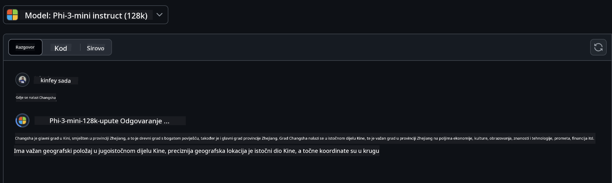
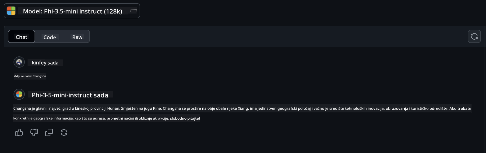

<!--
CO_OP_TRANSLATOR_METADATA:
{
  "original_hash": "124ad36cfe96f74038811b6e2bb93e9d",
  "translation_date": "2025-06-26T03:00:29+00:00",
  "source_file": "19-slm/README.md",
  "language_code": "hr"
}
-->

Modeli su najizravniji način. Možete brzo pristupiti Phi-3/3.5-Instruct modelu putem GitHub Modela. U kombinaciji s Azure AI Inference SDK / OpenAI SDK, možete pristupiti API-ju putem koda kako biste završili poziv Phi-3/3.5-Instruct. Također možete testirati različite efekte putem Playgrounda. - Demo:Usporedba učinaka Phi-3-mini i Phi-3.5-mini u kineskim scenarijima   **Azure AI Studio** Ili ako želimo koristiti modele za viziju i MoE, možete koristiti Azure AI Studio za završavanje poziva. Ako ste zainteresirani, možete pročitati Phi-3 Cookbook kako biste naučili kako pozvati Phi-3/3.5 Instruct, Vision, MoE putem Azure AI Studija [Kliknite ovaj link](https://github.com/microsoft/Phi-3CookBook/blob/main/md/02.QuickStart/AzureAIStudio_QuickStart.md?WT.mc_id=academic-105485-koreyst) **NVIDIA NIM** Osim rješenja Model Catalog temeljenih na oblaku koje pružaju Azure i GitHub, možete također koristiti [Nivida NIM](https://developer.nvidia.com/nim?WT.mc_id=academic-105485-koreyst) za dovršavanje povezanih poziva. Možete posjetiti NIVIDA NIM kako biste dovršili API pozive Phi-3/3.5 obitelji. NVIDIA NIM (NVIDIA Inference Microservices) je skup ubrzanih mikroservisa za inferenciju dizajniranih kako bi pomogli programerima u učinkovitom implementiranju AI modela u raznim okruženjima, uključujući oblake, podatkovne centre i radne stanice. Evo nekih ključnih značajki NVIDIA NIM-a: - **Jednostavnost implementacije:** NIM omogućuje implementaciju AI modela jednim naredbom, što ga čini jednostavnim za integraciju u postojeće tijekove rada. - **Optimizirane performanse:** Koristi NVIDIA-ine unaprijed optimizirane inferencijske motore, kao što su TensorRT i TensorRT-LLM, kako bi osigurao nisku latenciju i visoku propusnost. - **Skalabilnost:** NIM podržava automatsko skaliranje na Kubernetesu, omogućujući mu učinkovito rukovanje promjenjivim opterećenjima. - **Sigurnost i kontrola:** Organizacije mogu održavati kontrolu nad svojim podacima i aplikacijama samostalnim hostingom NIM mikroservisa na vlastitoj upravljanoj infrastrukturi. - **Standardni API-ji:** NIM pruža industrijske standardne API-je, čineći ga jednostavnim za izgradnju i integraciju AI aplikacija poput chatbotova, AI asistenata i više. NIM je dio NVIDIA AI Enterprise, koji ima za cilj pojednostaviti implementaciju i operativnost AI modela, osiguravajući njihovo učinkovito izvođenje na NVIDIA GPU-ima. - Demo: Korištenje Nividia NIM-a za pozivanje Phi-3.5-Vision-API [[Kliknite ovaj link](../../../19-slm/python/Phi-3-Vision-Nividia-NIM.ipynb)] ### Inferencija Phi-3/3.5 u lokalnom okruženju Inferencija u vezi s Phi-3, ili bilo kojim jezičnim modelom poput GPT-3, odnosi se na proces generiranja odgovora ili predikcija na temelju unosa koji prima. Kada pružite upit ili pitanje Phi-3, koristi svoju treniranu neuronsku mrežu kako bi zaključio najvjerojatniji i relevantni odgovor analizom uzoraka i odnosa u podacima na kojima je treniran. **Hugging Face Transformer** Hugging Face Transformers je moćna knjižnica dizajnirana za obradu prirodnog jezika (NLP) i druge zadatke strojnog učenja. Evo nekih ključnih točaka o njoj: 1. **Pretrenirani modeli**: Pruža tisuće pretreniranih modela koji se mogu koristiti za razne zadatke kao što su klasifikacija teksta, prepoznavanje imenovanih entiteta, odgovaranje na pitanja, sažimanje, prevođenje i generiranje teksta. 2. **Interoperabilnost okvira**: Knjižnica podržava više okvira za duboko učenje, uključujući PyTorch, TensorFlow i JAX. To vam omogućuje treniranje modela u jednom okviru i korištenje u drugom. 3. **Multimodalne sposobnosti**: Osim NLP-a, Hugging Face Transformers također podržava zadatke u računalnoj viziji (npr. klasifikacija slika, prepoznavanje objekata) i obradi zvuka (npr. prepoznavanje govora, klasifikacija zvuka). 4. **Jednostavnost korištenja**: Knjižnica nudi API-je i alate za jednostavno preuzimanje i fino podešavanje modela, čineći je dostupnom i početnicima i stručnjacima. 5. **Zajednica i resursi**: Hugging Face ima živu zajednicu i opsežnu dokumentaciju, vodiče i upute kako bi pomogao korisnicima da započnu i iskoriste knjižnicu. [službena dokumentacija](https://huggingface.co/docs/transformers/index?WT.mc_id=academic-105485-koreyst) ili njihov [GitHub repozitorij](https://github.com/huggingface/transformers?WT.mc_id=academic-105485-koreyst). Ovo je najčešće korištena metoda, ali također zahtijeva ubrzanje putem GPU-a. Na kraju, scene kao što su Vision i MoE zahtijevaju mnogo izračuna, što će biti vrlo ograničeno na CPU-u ako nisu kvantizirane. - Demo: Korištenje Transformera za pozivanje Phi-3.5-Instuct [Kliknite ovaj link](../../../19-slm/python/phi35-instruct-demo.ipynb) - Demo: Korištenje Transformera za pozivanje Phi-3.5-Vision[Kliknite ovaj link](../../../19-slm/python/phi35-vision-demo.ipynb) - Demo: Korištenje Transformera za pozivanje Phi-3.5-MoE[Kliknite ovaj link](../../../19-slm/python/phi35_moe_demo.ipynb) **Ollama** [Ollama](https://ollama.com/?WT.mc_id=academic-105485-koreyst) je platforma dizajnirana kako bi olakšala lokalno pokretanje velikih jezičnih modela (LLM) na vašem računalu. Podržava različite modele poput Llama 3.1, Phi 3, Mistral i Gemma 2, među ostalima. Platforma pojednostavljuje proces pakiranjem težina modela, konfiguracije i podataka u jedan paket, čineći ga dostupnijim korisnicima za prilagodbu i izradu vlastitih modela. Ollama je dostupna za macOS, Linux i Windows. To je izvrstan alat ako želite eksperimentirati ili implementirati LLM-ove bez oslanjanja na usluge u oblaku. Ollama je najizravniji način, samo trebate izvršiti sljedeću izjavu. ```bash

ollama run phi3.5

``` **ONNX Runtime za GenAI** [ONNX Runtime](https://github.com/microsoft/onnxruntime-genai?WT.mc_id=academic-105485-koreyst) je multiplatformski akcelerator za inferenciju i treniranje strojnog učenja. ONNX Runtime za Generativnu AI (GENAI) je moćan alat koji vam pomaže u učinkovitom pokretanju generativnih AI modela na različitim platformama. ## Što je ONNX Runtime? ONNX Runtime je projekt otvorenog koda koji omogućuje visokoučinkovitu inferenciju modela strojnog učenja. Podržava modele u Open Neural Network Exchange (ONNX) formatu, koji je standard za predstavljanje modela strojnog učenja.ONNX Runtime inferencija može omogućiti brža korisnička iskustva i niže troškove, podržavajući modele iz okvira za duboko učenje kao što su PyTorch i TensorFlow/Keras kao i klasične knjižnice strojnog učenja kao što su scikit-learn, LightGBM, XGBoost itd. ONNX Runtime je kompatibilan s različitim hardverom, upravljačkim programima i operativnim sustavima, te pruža optimalne performanse korištenjem hardverskih akceleratora gdje je primjenjivo uz optimizacije i transformacije grafa. ## Što je Generativna AI? Generativna AI odnosi se na AI sustave koji mogu generirati novi sadržaj, kao što su tekst, slike ili glazba, na temelju podataka na kojima su trenirani. Primjeri uključuju jezične modele poput GPT-3 i modele za generiranje slika poput Stable Diffusion. ONNX Runtime za GenAI knjižnica pruža generativnu AI petlju za ONNX modele, uključujući inferenciju s ONNX Runtimeom, obradu logita, pretragu i uzorkovanje, te upravljanje KV cacheom. ## ONNX Runtime za GENAI ONNX Runtime za GENAI proširuje mogućnosti ONNX Runtimea za podršku generativnim AI modelima. Evo nekih ključnih značajki: - **Široka podrška platformi:** Radi na raznim platformama, uključujući Windows, Linux, macOS, Android i iOS. - **Podrška modelima:** Podržava mnoge popularne generativne AI modele, kao što su LLaMA, GPT-Neo, BLOOM i više. - **Optimizacija performansi:** Uključuje optimizacije za različite hardverske akceleratore kao što su NVIDIA GPU-ovi, AMD GPU-ovi i više2. - **Jednostavnost korištenja:** Pruža API-je za jednostavnu integraciju u aplikacije, omogućujući generiranje teksta, slika i drugog sadržaja uz minimalni kod - Korisnici mogu pozvati metodu generate() na visokoj razini, ili pokrenuti svaku iteraciju modela u petlji, generirajući jedan token odjednom, te po želji ažurirati parametre generiranja unutar petlje. - ONNX runtime također ima podršku za pohlepnu/beam pretragu i TopP, TopK uzorkovanje za generiranje sekvenci tokena i ugrađenu obradu logita kao što su kazne za ponavljanje. Također možete lako dodati prilagođeno bodovanje. ## Početak rada Za početak s ONNX Runtime za GENAI, možete slijediti ove korake: ### Instalirajte ONNX Runtime: ```Python
pip install onnxruntime
``` ### Instalirajte Generativne AI Ekstenzije: ```Python
pip install onnxruntime-genai
``` ### Pokrenite Model: Evo jednostavnog primjera u Pythonu: ```Python
import onnxruntime_genai as og

model = og.Model('path_to_your_model.onnx')

tokenizer = og.Tokenizer(model)

input_text = "Hello, how are you?"

input_tokens = tokenizer.encode(input_text)

output_tokens = model.generate(input_tokens)

output_text = tokenizer.decode(output_tokens)

print(output_text) 
``` ### Demo:Korištenje ONNX Runtime GenAI za pozivanje Phi-3.5-Vision ```python

import onnxruntime_genai as og

model_path = './Your Phi-3.5-vision-instruct ONNX Path'

img_path = './Your Image Path'

model = og.Model(model_path)

processor = model.create_multimodal_processor()

tokenizer_stream = processor.create_stream()

text = "Your Prompt"

prompt = "<|user|>\n"

prompt += "<|image_1|>\n"

prompt += f"{text}<|end|>\n"

prompt += "<|assistant|>\n"

image = og.Images.open(img_path)

inputs = processor(prompt, images=image)

params = og.GeneratorParams(model)

params.set_inputs(inputs)

params.set_search_options(max_length=3072)

generator = og.Generator(model, params)

while not generator.is_done():

    generator.compute_logits()
    
    generator.generate_next_token()

    new_token = generator.get_next_tokens()[0]
    
    code += tokenizer_stream.decode(new_token)
    
    print(tokenizer_stream.decode(new_token), end='', flush=True)

``` **Ostali** Osim referentnih metoda ONNX Runtimea i Ollame, možemo također dovršiti referencu kvantitativnih modela na temelju referentnih metoda modela koje pružaju različiti proizvođači. Kao što su Apple MLX okvir s Apple Metalom, Qualcomm QNN s NPU-om, Intel OpenVINO s CPU/GPU-om, itd. Također možete dobiti više sadržaja iz [Phi-3 Cookbook](https://github.com/microsoft/phi-3cookbook?WT.mc_id=academic-105485-koreyst) ## Više Naučili smo osnove Phi-3/3.5 obitelji, ali kako bismo naučili više o SLM-u trebamo više znanja. Odgovore možete pronaći u Phi-3 Cookbooku. Ako želite saznati više, molimo posjetite [Phi-3 Cookbook](https://github.com/microsoft/phi-3cookbook?WT.mc_id=academic-105485-koreyst).

**Izjava o odricanju odgovornosti**:  
Ovaj dokument je preveden pomoću AI usluge za prevođenje [Co-op Translator](https://github.com/Azure/co-op-translator). Iako se trudimo postići točnost, imajte na umu da automatizirani prijevodi mogu sadržavati pogreške ili netočnosti. Izvorni dokument na izvornom jeziku treba smatrati autoritativnim izvorom. Za kritične informacije preporučuje se profesionalni ljudski prijevod. Ne odgovaramo za nesporazume ili pogrešna tumačenja koja mogu proizaći iz korištenja ovog prijevoda.