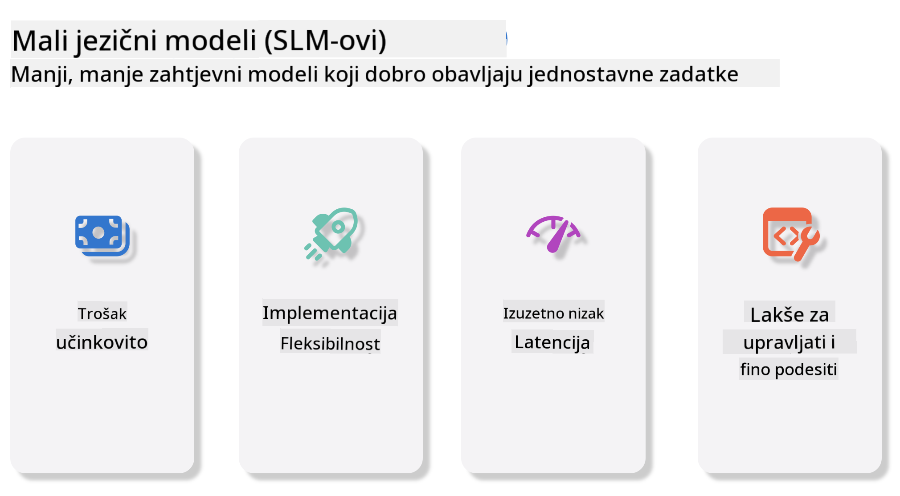
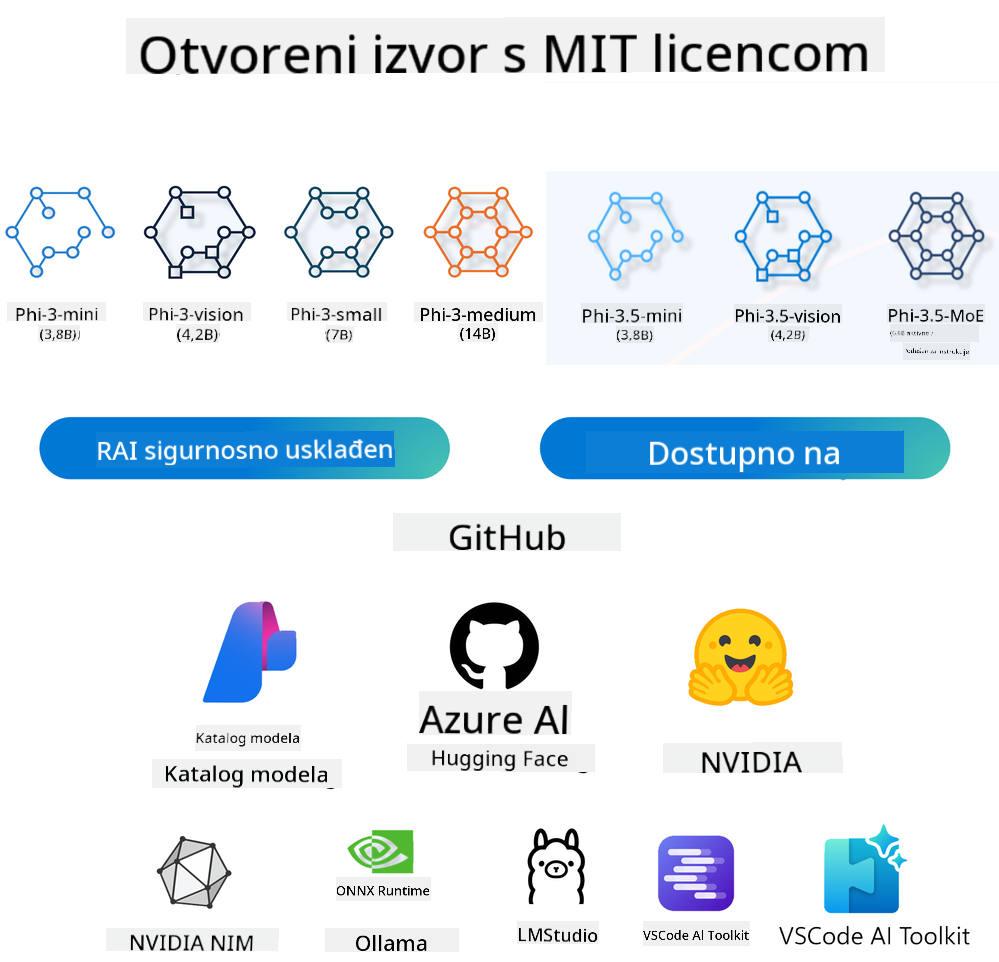

<!--
CO_OP_TRANSLATOR_METADATA:
{
  "original_hash": "124ad36cfe96f74038811b6e2bb93e9d",
  "translation_date": "2025-07-09T18:50:41+00:00",
  "source_file": "19-slm/README.md",
  "language_code": "hr"
}
-->
# Uvod u Male Jezične Modele za Generativnu AI za Početnike
Generativna AI je fascinantno područje umjetne inteligencije koje se fokusira na stvaranje sustava sposobnih generirati novi sadržaj. Taj sadržaj može biti tekst, slike, glazba pa čak i cijeli virtualni svjetovi. Jedna od najuzbudljivijih primjena generativne AI je u području jezičnih modela.

## Što su Mali Jezični Modeli?

Mali Jezični Model (SLM) predstavlja smanjenu verziju velikog jezičnog modela (LLM), koristeći mnoge arhitektonske principe i tehnike LLM-ova, ali s znatno manjim računalnim zahtjevima.

SLM-ovi su podskup jezičnih modela dizajniranih za generiranje teksta nalik ljudskom. Za razliku od svojih većih kolega, poput GPT-4, SLM-ovi su kompaktniji i učinkovitiji, što ih čini idealnima za primjene gdje su računalni resursi ograničeni. Unatoč manjoj veličini, mogu obavljati razne zadatke. Obično se SLM-ovi grade kompresijom ili destilacijom LLM-ova, s ciljem zadržavanja značajnog dijela funkcionalnosti i jezičnih sposobnosti izvornog modela. Ova redukcija veličine modela smanjuje ukupnu složenost, čineći SLM-ove učinkovitijima u pogledu memorijske potrošnje i računalnih zahtjeva. Unatoč tim optimizacijama, SLM-ovi mogu obavljati širok spektar zadataka obrade prirodnog jezika (NLP):

- Generiranje teksta: stvaranje koherentnih i kontekstualno relevantnih rečenica ili odlomaka.
- Dovršavanje teksta: predviđanje i dovršavanje rečenica na temelju zadanog upita.
- Prevođenje: pretvaranje teksta s jednog jezika na drugi.
- Sažimanje: skraćivanje dugih tekstova u kraće, preglednije sažetke.

Iako uz određene kompromise u izvedbi ili dubini razumijevanja u usporedbi s većim modelima.

## Kako Mali Jezični Modeli Funkcioniraju?
SLM-ovi se treniraju na ogromnim količinama tekstualnih podataka. Tijekom treninga uče obrasce i strukture jezika, što im omogućuje generiranje teksta koji je gramatički ispravan i kontekstualno prikladan. Proces treninga uključuje:

- Prikupljanje podataka: skupljanje velikih skupova tekstualnih podataka iz različitih izvora.
- Predobrada: čišćenje i organiziranje podataka kako bi bili prikladni za trening.
- Trening: korištenje algoritama strojnog učenja za učenje modela kako razumjeti i generirati tekst.
- Fino podešavanje: prilagodba modela za poboljšanje izvedbe na specifičnim zadacima.

Razvoj SLM-ova prati rastuću potrebu za modelima koji se mogu implementirati u okruženjima s ograničenim resursima, poput mobilnih uređaja ili edge računalnih platformi, gdje su puni LLM-ovi često nepraktični zbog velikih zahtjeva za resursima. Fokusirajući se na učinkovitost, SLM-ovi balansiraju izvedbu i pristupačnost, omogućujući širu primjenu u različitim područjima.



## Ciljevi Učenja

U ovoj lekciji želimo predstaviti znanje o SLM-ovima i povezati ga s Microsoft Phi-3 kako bismo naučili različite scenarije u tekstualnom sadržaju, viziji i MoE.

Na kraju ove lekcije trebali biste moći odgovoriti na sljedeća pitanja:

- Što je SLM
- Koja je razlika između SLM i LLM
- Što je Microsoft Phi-3/3.5 obitelj
- Kako izvesti inferenciju s Microsoft Phi-3/3.5 obitelji

Spremni? Krenimo.

## Razlike između Velikih Jezičnih Modela (LLM) i Malih Jezičnih Modela (SLM)

I LLM-ovi i SLM-ovi temelje se na osnovnim principima probabilističkog strojnog učenja, slijedeći slične pristupe u arhitektonskom dizajnu, metodologiji treninga, procesima generiranja podataka i tehnikama evaluacije modela. Međutim, nekoliko ključnih faktora razlikuje ove dvije vrste modela.

## Primjene Malih Jezičnih Modela

SLM-ovi imaju širok spektar primjena, uključujući:

- Chatbotovi: pružanje korisničke podrške i interakcija s korisnicima u razgovornom obliku.
- Kreiranje sadržaja: pomoć piscima u generiranju ideja ili čak pisanju cijelih članaka.
- Obrazovanje: pomoć učenicima u pisanju zadataka ili učenju novih jezika.
- Pristupačnost: stvaranje alata za osobe s invaliditetom, poput sustava za pretvaranje teksta u govor.

**Veličina**

Glavna razlika između LLM-ova i SLM-ova leži u veličini modela. LLM-ovi, poput ChatGPT-a (GPT-4), mogu imati procijenjenih 1,76 bilijuna parametara, dok open-source SLM-ovi poput Mistral 7B imaju znatno manje parametara — otprilike 7 milijardi. Ova razlika prvenstveno proizlazi iz arhitekture modela i procesa treninga. Na primjer, ChatGPT koristi mehanizam samopozornosti unutar encoder-decoder okvira, dok Mistral 7B koristi sliding window attention, što omogućuje učinkovitiji trening unutar modela samo s decoderom. Ova arhitektonska razlika ima duboke implikacije na složenost i izvedbu modela.

**Razumijevanje**

SLM-ovi su obično optimizirani za izvedbu unutar specifičnih domena, što ih čini vrlo specijaliziranim, ali potencijalno ograničenim u pružanju širokog kontekstualnog razumijevanja kroz različita područja znanja. Nasuprot tome, LLM-ovi nastoje simulirati ljudsku inteligenciju na sveobuhvatnijoj razini. Trenirani na ogromnim, raznolikim skupovima podataka, LLM-ovi su dizajnirani da dobro funkcioniraju u različitim domenama, nudeći veću svestranost i prilagodljivost. Stoga su LLM-ovi prikladniji za širi spektar zadataka, poput obrade prirodnog jezika i programiranja.

**Računalni Resursi**

Trening i implementacija LLM-ova zahtijevaju velike računalne resurse, često uključujući velike GPU klastere. Na primjer, treniranje modela poput ChatGPT-a od nule može zahtijevati tisuće GPU-a tijekom dugog vremenskog razdoblja. Nasuprot tome, SLM-ovi, sa znatno manjim brojem parametara, pristupačniji su u pogledu računalnih resursa. Modeli poput Mistral 7B mogu se trenirati i pokretati na lokalnim računalima s umjerenim GPU kapacitetima, iako trening i dalje zahtijeva nekoliko sati na više GPU-a.

**Pristranost**

Pristranost je poznat problem kod LLM-ova, uglavnom zbog prirode podataka za trening. Ti modeli često koriste sirove, javno dostupne podatke s interneta, koji mogu podzastupljivati ili pogrešno predstavljati određene skupine, uvoditi netočne oznake ili odražavati jezične pristranosti uzrokovane dijalektima, geografskim varijacijama i gramatičkim pravilima. Također, složenost arhitekture LLM-ova može nenamjerno pojačati pristranost, koja može proći nezapaženo bez pažljivog fino podešavanja. S druge strane, SLM-ovi, trenirani na ograničenijim, domenama specifičnim skupovima podataka, inherentno su manje podložni takvim pristranostima, iako nisu potpuno imuni.

**Inferencija**

Manja veličina SLM-ova daje im značajnu prednost u brzini inferencije, omogućujući učinkovito generiranje izlaza na lokalnom hardveru bez potrebe za opsežnim paralelnim procesiranjem. Nasuprot tome, LLM-ovi zbog svoje veličine i složenosti često zahtijevaju velike paralelne računalne resurse za prihvatljive vrijeme odgovora. Prisutnost više istovremenih korisnika dodatno usporava vrijeme odgovora LLM-ova, osobito pri implementaciji u velikom opsegu.

Ukratko, iako LLM-ovi i SLM-ovi dijele temelj u strojnome učenju, značajno se razlikuju u veličini modela, zahtjevima za resursima, kontekstualnom razumijevanju, podložnosti pristranosti i brzini inferencije. Te razlike odražavaju njihovu prikladnost za različite slučajeve uporabe, pri čemu su LLM-ovi svestraniji, ali zahtjevniji za resurse, dok SLM-ovi nude veću učinkovitost u specifičnim domenama uz smanjene računalne zahtjeve.

***Note：U ovom poglavlju ćemo predstaviti SLM koristeći Microsoft Phi-3 / 3.5 kao primjer.***

## Predstavljanje Phi-3 / Phi-3.5 Obitelji

Phi-3 / 3.5 obitelj prvenstveno cilja na scenarije primjene u tekstu, viziji i Agentu (MoE):

### Phi-3 / 3.5 Instruct

Prvenstveno za generiranje teksta, dovršavanje razgovora i ekstrakciju sadržaja.

**Phi-3-mini**

Jezični model od 3.8 milijardi parametara dostupan je na Microsoft Azure AI Studio, Hugging Face i Ollama. Phi-3 modeli značajno nadmašuju jezične modele iste i veće veličine na ključnim benchmark testovima (pogledajte brojeve benchmarka u nastavku, veći brojevi znače bolje rezultate). Phi-3-mini nadmašuje modele dvostruke veličine, dok Phi-3-small i Phi-3-medium nadmašuju veće modele, uključujući GPT-3.5.

**Phi-3-small & medium**

S samo 7 milijardi parametara, Phi-3-small pobjeđuje GPT-3.5T na raznim jezičnim, rezonirajućim, kodirajućim i matematičkim benchmark testovima.

Phi-3-medium s 14 milijardi parametara nastavlja ovaj trend i nadmašuje Gemini 1.0 Pro.

**Phi-3.5-mini**

Možemo ga smatrati nadogradnjom Phi-3-mini. Iako broj parametara ostaje isti, poboljšava podršku za više jezika (podržava 20+ jezika: arapski, kineski, češki, danski, nizozemski, engleski, finski, francuski, njemački, hebrejski, mađarski, talijanski, japanski, korejski, norveški, poljski, portugalski, ruski, španjolski, švedski, tajlandski, turski, ukrajinski) i dodaje snažniju podršku za dugi kontekst.

Phi-3.5-mini s 3.8 milijardi parametara nadmašuje jezične modele iste veličine i usporediv je s modelima dvostruke veličine.

### Phi-3 / 3.5 Vision

Možemo zamisliti Instruct model Phi-3/3.5 kao Phi-ovu sposobnost razumijevanja, a Vision je ono što Phi-u daje oči za razumijevanje svijeta.

**Phi-3-Vision**

Phi-3-vision, s samo 4.2 milijarde parametara, nastavlja ovaj trend i nadmašuje veće modele poput Claude-3 Haiku i Gemini 1.0 Pro V u općim zadacima vizualnog rezoniranja, OCR-u te razumijevanju tablica i dijagrama.

**Phi-3.5-Vision**

Phi-3.5-Vision je također nadogradnja Phi-3-Vision, dodajući podršku za više slika. Možete ga smatrati poboljšanjem u vidu – ne samo da može vidjeti slike, već i videozapise.

Phi-3.5-vision nadmašuje veće modele poput Claude-3.5 Sonnet i Gemini 1.5 Flash u zadacima OCR-a, razumijevanja tablica i grafikona, te je usporediv u općim zadacima vizualnog rezoniranja. Podržava višeframeski ulaz, tj. rezoniranje na temelju više ulaznih slika.

### Phi-3.5-MoE

***Mixture of Experts (MoE)*** omogućuje modelima da se prethodno treniraju uz znatno manje računalnih resursa, što znači da možete znatno povećati veličinu modela ili skupa podataka uz isti proračun za računalne resurse kao kod gustog modela. Konkretno, MoE model bi trebao postići istu kvalitetu kao njegov gusti pandan mnogo brže tijekom prethodnog treninga.

Phi-3.5-MoE sastoji se od 16x3.8B ekspertskih modula. Phi-3.5-MoE s samo 6.6 milijardi aktivnih parametara postiže sličnu razinu rezoniranja, razumijevanja jezika i matematike kao mnogo veći modeli.

Možemo koristiti Phi-3/3.5 obitelj modela u različitim scenarijima. Za razliku od LLM-ova, Phi-3/3.5-mini ili Phi-3/3.5-Vision možete implementirati na edge uređajima.

## Kako koristiti Phi-3/3.5 obitelj modela

Želimo koristiti Phi-3/3.5 u različitim scenarijima. Sljedeće ćemo koristiti Phi-3/3.5 u skladu s različitim scenarijima.



### Razlika u inferenciji putem Cloud API-ja

**GitHub Models**

GitHub Models je najizravniji način. Možete brzo pristupiti Phi-3/3.5-Instruct modelu putem GitHub Models. U kombinaciji s Azure AI Inference SDK / OpenAI SDK, možete pristupiti API-ju putem koda za dovršetak poziva Phi-3/3.5-Instruct. Također možete testirati različite rezultate putem Playgrounda.

- Demo: Usporedba učinaka Phi-3-mini i Phi-3.5-mini u kineskim scenarijima


**Azure AI Studio**

Ako želimo koristiti modele za viziju i MoE, možemo koristiti Azure AI Studio za dovršetak poziva. Ako ste zainteresirani, možete pročitati Phi-3 Cookbook kako biste naučili kako pozivati Phi-3/3.5 Instruct, Vision, MoE putem Azure AI Studio [Kliknite ovaj link](https://github.com/microsoft/Phi-3CookBook/blob/main/md/02.QuickStart/AzureAIStudio_QuickStart.md?WT.mc_id=academic-105485-koreyst)

**NVIDIA NIM**

Osim rješenja Model Catalog u oblaku koje pružaju Azure i GitHub, možete koristiti i [NVIDIA NIM](https://developer.nvidia.com/nim?WT.mc_id=academic-105485-koreyst) za dovršetak povezanih poziva. Posjetite NVIDIA NIM za dovršetak API poziva Phi-3/3.5 obitelji. NVIDIA NIM (NVIDIA Inference Microservices) je skup ubrzanih mikroservisa za inferenciju dizajniranih da pomognu developerima u učinkovitoj implementaciji AI modela u različitim okruženjima, uključujući oblak, podatkovne centre i radne stanice.

Evo nekoliko ključnih značajki NVIDIA NIM-a:

- **Jednostavnost implementacije:** NIM omogućuje implementaciju AI modela jednom naredbom, što olakšava integraciju u postojeće radne tokove.
- **Optimizirana izvedba:** Koristi NVIDIA-ine prethodno optimizirane inferencijske motore, poput TensorRT i TensorRT-LLM, za osiguranje niske latencije i visokog protoka.
- **Skalabilnost:** NIM podržava automatsko skaliranje na Kubernetesu, omogućujući učinkovito upravljanje promjenjivim opterećenjima.
- **Sigurnost i kontrola:** Organizacije mogu zadržati kontrolu nad svojim podacima i aplikacijama tako da samostalno hostaju NIM mikroservise na vlastitoj upravljanoj infrastrukturi.  
- **Standardni API-ji:** NIM pruža industrijske standardne API-je, što olakšava izgradnju i integraciju AI aplikacija poput chatbotova, AI asistenata i drugih.

NIM je dio NVIDIA AI Enterprise, čiji je cilj pojednostaviti implementaciju i operativnost AI modela, osiguravajući njihovo učinkovito izvođenje na NVIDIA GPU-ima.

- Demo: Korištenje Nividia NIM za pozivanje Phi-3.5-Vision-API [[Kliknite na ovaj link](../../../19-slm/python/Phi-3-Vision-Nividia-NIM.ipynb)]


### Inference Phi-3/3.5 u lokalnom okruženju  
Inference u kontekstu Phi-3, ili bilo kojeg jezičnog modela poput GPT-3, odnosi se na proces generiranja odgovora ili predviđanja na temelju primljenog unosa. Kada Phi-3 unesete upit ili pitanje, on koristi svoj trenirani neuronski model kako bi zaključio najvjerojatniji i najrelevantniji odgovor analizirajući obrasce i odnose u podacima na kojima je treniran.

**Hugging Face Transformer**  
Hugging Face Transformers je moćna biblioteka namijenjena obradi prirodnog jezika (NLP) i drugim zadacima strojnog učenja. Evo nekoliko ključnih točaka o njoj:

1. **Prethodno trenirani modeli:** Nudi tisuće prethodno treniranih modela koji se mogu koristiti za različite zadatke poput klasifikacije teksta, prepoznavanja imenovanih entiteta, odgovaranja na pitanja, sažimanja, prevođenja i generiranja teksta.

2. **Interoperabilnost okvira:** Biblioteka podržava više dubokih okvira za učenje, uključujući PyTorch, TensorFlow i JAX. To vam omogućuje da model trenirate u jednom okviru, a koristite u drugom.

3. **Multimodalne mogućnosti:** Osim NLP-a, Hugging Face Transformers podržava i zadatke računalnog vida (npr. klasifikacija slika, detekcija objekata) i obrade zvuka (npr. prepoznavanje govora, klasifikacija zvuka).

4. **Jednostavnost korištenja:** Biblioteka nudi API-je i alate za jednostavno preuzimanje i fino podešavanje modela, što je pristupačno i početnicima i stručnjacima.

5. **Zajednica i resursi:** Hugging Face ima aktivnu zajednicu te opsežnu dokumentaciju, tutorijale i vodiče koji pomažu korisnicima da započnu i maksimalno iskoriste biblioteku.  
[službena dokumentacija](https://huggingface.co/docs/transformers/index?WT.mc_id=academic-105485-koreyst) ili njihov [GitHub repozitorij](https://github.com/huggingface/transformers?WT.mc_id=academic-105485-koreyst).

Ovo je najčešće korištena metoda, ali zahtijeva GPU ubrzanje. Na kraju krajeva, zadaci poput Vision i MoE zahtijevaju mnogo izračuna, što će na CPU-u biti vrlo ograničeno ako se ne kvantiziraju.


- Demo: Korištenje Transformera za pozivanje Phi-3.5-Instuct [Kliknite na ovaj link](../../../19-slm/python/phi35-instruct-demo.ipynb)

- Demo: Korištenje Transformera za pozivanje Phi-3.5-Vision [Kliknite na ovaj link](../../../19-slm/python/phi35-vision-demo.ipynb)

- Demo: Korištenje Transformera za pozivanje Phi-3.5-MoE [Kliknite na ovaj link](../../../19-slm/python/phi35_moe_demo.ipynb)

**Ollama**  
[Ollama](https://ollama.com/?WT.mc_id=academic-105485-koreyst) je platforma dizajnirana da olakša pokretanje velikih jezičnih modela (LLM) lokalno na vašem računalu. Podržava različite modele poput Llama 3.1, Phi 3, Mistral i Gemma 2, među ostalima. Platforma pojednostavljuje proces tako što u jedan paket objedinjuje težine modela, konfiguraciju i podatke, čineći ga pristupačnijim korisnicima za prilagodbu i izradu vlastitih modela. Ollama je dostupna za macOS, Linux i Windows. Odličan je alat ako želite eksperimentirati ili implementirati LLM-ove bez oslanjanja na cloud usluge. Ollama je najizravniji način, samo trebate izvršiti sljedeću naredbu.


```bash

ollama run phi3.5

```


**ONNX Runtime za GenAI**

[ONNX Runtime](https://github.com/microsoft/onnxruntime-genai?WT.mc_id=academic-105485-koreyst) je cross-platformski akcelerator za inferencu i treniranje strojnog učenja. ONNX Runtime za Generative AI (GENAI) je moćan alat koji vam pomaže da učinkovito pokrećete generativne AI modele na različitim platformama.

## Što je ONNX Runtime?  
ONNX Runtime je open-source projekt koji omogućuje visokoučinkovitu inferencu modela strojnog učenja. Podržava modele u Open Neural Network Exchange (ONNX) formatu, koji je standard za predstavljanje modela strojnog učenja. ONNX Runtime inference može omogućiti brže korisničko iskustvo i niže troškove, podržavajući modele iz dubokih okvira poput PyTorch i TensorFlow/Keras, kao i klasične biblioteke strojnog učenja poput scikit-learn, LightGBM, XGBoost i drugih. ONNX Runtime je kompatibilan s različitim hardverom, upravljačkim programima i operativnim sustavima, te pruža optimalne performanse iskorištavanjem hardverskih akceleratora gdje je moguće, uz optimizacije i transformacije grafova.

## Što je Generative AI?  
Generative AI odnosi se na AI sustave koji mogu generirati novi sadržaj, poput teksta, slika ili glazbe, na temelju podataka na kojima su trenirani. Primjeri su jezični modeli poput GPT-3 i modeli za generiranje slika poput Stable Diffusion. ONNX Runtime za GenAI biblioteka pruža generativni AI ciklus za ONNX modele, uključujući inferencu s ONNX Runtime, obradu logita, pretraživanje i uzorkovanje te upravljanje KV cacheom.

## ONNX Runtime za GENAI  
ONNX Runtime za GENAI proširuje mogućnosti ONNX Runtime-a kako bi podržao generativne AI modele. Evo nekoliko ključnih značajki:

- **Široka podrška platformi:** Radi na različitim platformama, uključujući Windows, Linux, macOS, Android i iOS.  
- **Podrška modela:** Podržava mnoge popularne generativne AI modele, poput LLaMA, GPT-Neo, BLOOM i drugih.  
- **Optimizacija performansi:** Uključuje optimizacije za različite hardverske akceleratore poput NVIDIA GPU-a, AMD GPU-a i drugih.  
- **Jednostavnost korištenja:** Pruža API-je za jednostavnu integraciju u aplikacije, omogućujući generiranje teksta, slika i drugog sadržaja s minimalnim kodom.  
- Korisnici mogu pozvati visoko razinu metode generate(), ili pokretati svaku iteraciju modela u petlji, generirajući jedan token po token, uz mogućnost ažuriranja parametara generiranja unutar petlje.  
- ONNX runtime također podržava greedy/beam pretraživanje i TopP, TopK uzorkovanje za generiranje nizova tokena te ugrađenu obradu logita poput penalizacije ponavljanja. Također je lako dodati vlastito ocjenjivanje.

## Početak rada  
Za početak s ONNX Runtime za GENAI, slijedite ove korake:

### Instalirajte ONNX Runtime:  
```Python
pip install onnxruntime
```  
### Instalirajte Generative AI ekstenzije:  
```Python
pip install onnxruntime-genai
```

### Pokrenite model: Evo jednostavnog primjera u Pythonu:  
```Python
import onnxruntime_genai as og

model = og.Model('path_to_your_model.onnx')

tokenizer = og.Tokenizer(model)

input_text = "Hello, how are you?"

input_tokens = tokenizer.encode(input_text)

output_tokens = model.generate(input_tokens)

output_text = tokenizer.decode(output_tokens)

print(output_text) 
```  
### Demo: Korištenje ONNX Runtime GenAI za pozivanje Phi-3.5-Vision  


```python

import onnxruntime_genai as og

model_path = './Your Phi-3.5-vision-instruct ONNX Path'

img_path = './Your Image Path'

model = og.Model(model_path)

processor = model.create_multimodal_processor()

tokenizer_stream = processor.create_stream()

text = "Your Prompt"

prompt = "<|user|>\n"

prompt += "<|image_1|>\n"

prompt += f"{text}<|end|>\n"

prompt += "<|assistant|>\n"

image = og.Images.open(img_path)

inputs = processor(prompt, images=image)

params = og.GeneratorParams(model)

params.set_inputs(inputs)

params.set_search_options(max_length=3072)

generator = og.Generator(model, params)

while not generator.is_done():

    generator.compute_logits()
    
    generator.generate_next_token()

    new_token = generator.get_next_tokens()[0]
    
    code += tokenizer_stream.decode(new_token)
    
    print(tokenizer_stream.decode(new_token), end='', flush=True)

```


**Ostalo**

Osim ONNX Runtime i Ollama referentnih metoda, možemo također dovršiti referencu kvantitativnih modela na temelju referentnih metoda modela koje pružaju različiti proizvođači. Kao što su Apple MLX framework s Apple Metalom, Qualcomm QNN s NPU-om, Intel OpenVINO s CPU/GPU-om i slično. Više sadržaja možete pronaći i u [Phi-3 Cookbook](https://github.com/microsoft/phi-3cookbook?WT.mc_id=academic-105485-koreyst).


## Više

Naučili smo osnove Phi-3/3.5 obitelji, ali za dublje razumijevanje SLM-a potrebna su dodatna znanja. Odgovore možete pronaći u Phi-3 Cookbooku. Ako želite saznati više, posjetite [Phi-3 Cookbook](https://github.com/microsoft/phi-3cookbook?WT.mc_id=academic-105485-koreyst).

**Odricanje od odgovornosti**:  
Ovaj dokument je preveden korištenjem AI usluge za prevođenje [Co-op Translator](https://github.com/Azure/co-op-translator). Iako težimo točnosti, imajte na umu da automatski prijevodi mogu sadržavati pogreške ili netočnosti. Izvorni dokument na izvornom jeziku treba smatrati službenim i autoritativnim izvorom. Za kritične informacije preporučuje se profesionalni ljudski prijevod. Ne snosimo odgovornost za bilo kakva nesporazuma ili pogrešna tumačenja koja proizlaze iz korištenja ovog prijevoda.