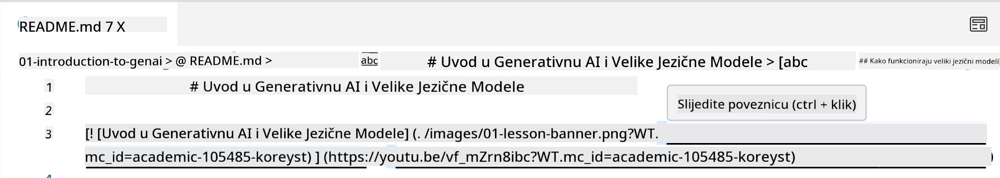
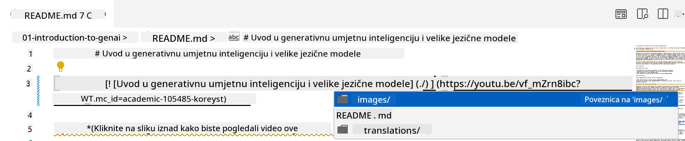
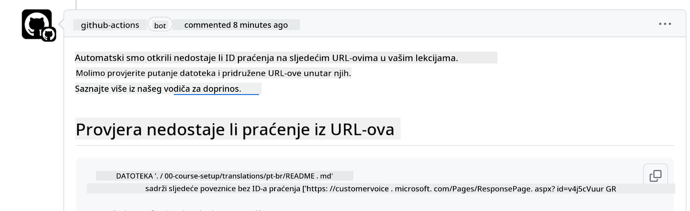
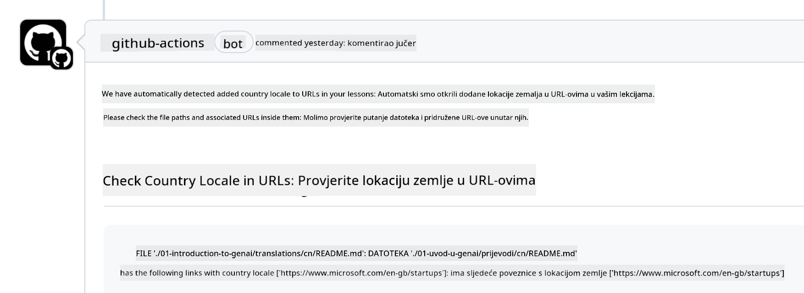

<!--
CO_OP_TRANSLATOR_METADATA:
{
  "original_hash": "57c41f2af71001a2cff9d8eb797cb843",
  "translation_date": "2025-05-19T11:26:41+00:00",
  "source_file": "CONTRIBUTING.md",
  "language_code": "hr"
}
-->
# Doprinos

Ovaj projekt pozdravlja doprinose i prijedloge. Većina doprinosa zahtijeva da se složite s Ugovorom o licenci za doprinositelje (CLA) u kojem izjavljujete da imate pravo, i zapravo dajete nam prava za korištenje vašeg doprinosa. Za detalje, posjetite <https://cla.microsoft.com>.

> Važno: prilikom prevođenja teksta u ovom repozitoriju, molimo vas da ne koristite strojno prevođenje. Provjerit ćemo prijevode putem zajednice, stoga se prijavite za prijevode samo na jezicima na kojima ste vješti.

Kada pošaljete zahtjev za povlačenje, CLA-bot će automatski odrediti trebate li osigurati CLA i odgovarajuće označiti PR (npr. oznakom, komentarom). Jednostavno slijedite upute koje daje bot. To ćete morati učiniti samo jednom za sve repozitorije koji koriste naš CLA.

## Kodeks ponašanja

Ovaj projekt je usvojio [Microsoftov kodeks ponašanja za otvoreni izvor](https://opensource.microsoft.com/codeofconduct/?WT.mc_id=academic-105485-koreyst).
Za više informacija pročitajte [FAQ o kodeksu ponašanja](https://opensource.microsoft.com/codeofconduct/faq/?WT.mc_id=academic-105485-koreyst) ili kontaktirajte [opencode@microsoft.com](mailto:opencode@microsoft.com) s bilo kakvim dodatnim pitanjima ili komentarima.

## Pitanje ili problem?

Molimo vas da ne otvarate GitHub probleme za opća pitanja podrške jer bi se GitHub lista trebala koristiti za zahtjeve za značajke i prijave grešaka. Na taj način možemo lakše pratiti stvarne probleme ili greške iz koda i držati opću raspravu odvojeno od stvarnog koda.

## Pravopisne pogreške, problemi, greške i doprinosi

Kad god podnosite bilo kakve promjene u repozitorij Generative AI for Beginners, molimo vas da slijedite ove preporuke.

* Uvijek klonirajte repozitorij na svoj račun prije nego što napravite izmjene
* Nemojte kombinirati više promjena u jedan zahtjev za povlačenje. Na primjer, pošaljite popravak greške i ažuriranja dokumentacije koristeći zasebne PR-ove
* Ako vaš zahtjev za povlačenje pokazuje sukobe pri spajanju, provjerite da li je vaš lokalni glavni ogranak ažuriran tako da odražava ono što je u glavnom repozitoriju prije nego što napravite izmjene
* Ako podnosite prijevod, molimo vas da napravite jedan PR za sve prevedene datoteke jer ne prihvaćamo djelomične prijevode sadržaja
* Ako podnosite pravopisnu pogrešku ili ispravak dokumentacije, možete kombinirati izmjene u jedan PR gdje je to prikladno

## Opće smjernice za pisanje

- Provjerite da su svi vaši URL-ovi uvučeni u uglate zagrade, a zatim slijedi zagrada bez dodatnih razmaka oko njih ili unutar njih ``.
- Provjerite da svaki relativni link (tj. linkovi na druge datoteke i mape u repozitoriju) počinje s `./` koji se odnosi na datoteku ili mapu smještenu u trenutnom radnom direktoriju ili `../` koji se odnosi na datoteku ili mapu smještenu u nadređenom radnom direktoriju.
- Provjerite da svaki relativni link (tj. linkovi na druge datoteke i mape u repozitoriju) ima ID praćenja (tj. `?` ili `&` zatim `wt.mc_id=` ili `WT.mc_id=`) na kraju.
- Provjerite da bilo koji URL s domena _github.com, microsoft.com, visualstudio.com, aka.ms, i azure.com_ ima ID praćenja (tj. `?` ili `&` zatim `wt.mc_id=` ili `WT.mc_id=`) na kraju.
- Provjerite da vaši linkovi nemaju lokalizaciju specifičnu za zemlju u njima (tj. `/en-us/` ili `/en/`).
- Provjerite da su sve slike pohranjene u mapi `./images`.
- Provjerite da slike imaju opisne nazive koristeći engleske znakove, brojeve i crtice u nazivu vaše slike.

## GitHub tijekovi rada

Kada pošaljete zahtjev za povlačenje, četiri različita tijeka rada bit će pokrenuta kako bi se provjerila prethodna pravila.
Jednostavno slijedite ovdje navedene upute kako biste prošli provjere tijeka rada.

- [Provjera slomljenih relativnih putanja](../..)
- [Provjera putanja s praćenjem](../..)
- [Provjera URL-ova s praćenjem](../..)
- [Provjera URL-ova bez lokalizacije](../..)

### Provjera slomljenih relativnih putanja

Ovaj tijek rada osigurava da bilo koja relativna putanja u vašim datotekama funkcionira.
Ovaj repozitorij je objavljen na GitHub stranicama, stoga morate biti vrlo pažljivi kada upisujete linkove koji sve povezuju kako ne biste nikoga usmjerili na pogrešno mjesto.

Da biste bili sigurni da vaši linkovi pravilno funkcioniraju, jednostavno koristite VS kod za provjeru.

Na primjer, kada zadržite pokazivač iznad bilo kojeg linka u vašim datotekama, bit ćete upitani da slijedite link pritiskom na **ctrl + klik**

Ako kliknete na link i on ne radi lokalno, tada će sigurno pokrenuti tijek rada i neće raditi na GitHubu.

Da biste riješili ovaj problem, pokušajte upisati link uz pomoć VS koda.

Kada upišete `./` ili `../`, VS kod će vas upitati da odaberete iz dostupnih opcija prema onome što ste upisali.

Slijedite putanju klikom na željenu datoteku ili mapu i bit ćete sigurni da vaša putanja nije slomljena.

Jednom kada dodate ispravnu relativnu putanju, spremite i pošaljite svoje promjene, tijek rada će se ponovno pokrenuti kako bi provjerio vaše promjene.
Ako prođete provjeru, možete nastaviti dalje.

### Provjera putanja s praćenjem

Ovaj tijek rada osigurava da svaka relativna putanja ima praćenje.
Ovaj repozitorij je objavljen na GitHub stranicama, pa trebamo pratiti kretanje između različitih datoteka i mapa.

Da biste bili sigurni da vaše relativne putanje imaju praćenje, jednostavno provjerite sljedeći tekst `?wt.mc_id=` na kraju putanje.
Ako je dodan vašim relativnim putanjama, proći ćete ovu provjeru.

Ako nije, možda ćete dobiti sljedeću grešku.

Da biste riješili ovaj problem, pokušajte otvoriti putanju datoteke koju je tijek rada istaknuo i dodajte ID praćenja na kraj relativnih putanja.

Jednom kada dodate ID praćenja, spremite i pošaljite svoje promjene, tijek rada će se ponovno pokrenuti kako bi provjerio vaše promjene.
Ako prođete provjeru, možete nastaviti dalje.

### Provjera URL-ova s praćenjem

Ovaj tijek rada osigurava da bilo koji web URL ima praćenje.
Ovaj repozitorij je dostupan svima, pa morate osigurati praćenje pristupa kako biste znali odakle dolazi promet.

Da biste bili sigurni da vaši URL-ovi imaju praćenje, jednostavno provjerite sljedeći tekst `?wt.mc_id=` na kraju URL-a.
Ako je dodan vašim URL-ovima, proći ćete ovu provjeru.

Ako nije, možda ćete dobiti sljedeću grešku.

Da biste riješili ovaj problem, pokušajte otvoriti putanju datoteke koju je tijek rada istaknuo i dodajte ID praćenja na kraj URL-ova.

Jednom kada dodate ID praćenja, spremite i pošaljite svoje promjene, tijek rada će se ponovno pokrenuti kako bi provjerio vaše promjene.
Ako prođete provjeru, možete nastaviti dalje.

### Provjera URL-ova bez lokalizacije

Ovaj tijek rada osigurava da bilo koji web URL nema lokalizaciju specifičnu za zemlju u njemu.
Ovaj repozitorij je dostupan svima diljem svijeta, pa morate osigurati da ne uključujete lokalizaciju svoje zemlje u URL-ove.

Da biste bili sigurni da vaši URL-ovi nemaju lokalizaciju zemlje u njima, jednostavno provjerite sljedeći tekst `/en-us/` ili `/en/` ili bilo koju drugu lokalizaciju jezika bilo gdje u URL-u.
Ako nije prisutan u vašim URL-ovima, proći ćete ovu provjeru.

Ako nije, možda ćete dobiti sljedeću grešku.

Da biste riješili ovaj problem, pokušajte otvoriti putanju datoteke koju je tijek rada istaknuo i uklonite lokalizaciju zemlje iz URL-ova.

Jednom kada uklonite lokalizaciju zemlje, spremite i pošaljite svoje promjene, tijek rada će se ponovno pokrenuti kako bi provjerio vaše promjene.
Ako prođete provjeru, možete nastaviti dalje.

Čestitamo! Javit ćemo vam se čim prije s povratnim informacijama o vašem doprinosu.

**Odricanje odgovornosti**:  
Ovaj dokument je preveden pomoću AI usluge za prevođenje [Co-op Translator](https://github.com/Azure/co-op-translator). Iako se trudimo da prevod bude tačan, imajte na umu da automatski prevodi mogu sadržavati greške ili netočnosti. Izvorni dokument na izvornom jeziku treba smatrati autoritativnim izvorom. Za kritične informacije preporučuje se profesionalni prijevod od strane čovjeka. Ne odgovaramo za bilo kakva nesporazuma ili pogrešna tumačenja koja proizlaze iz korištenja ovog prijevoda.