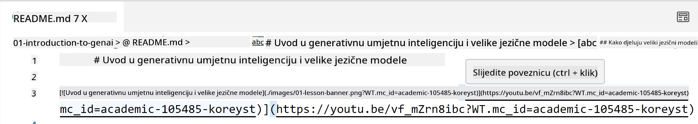
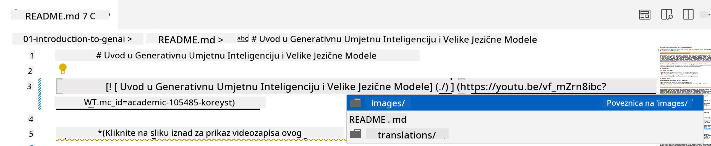
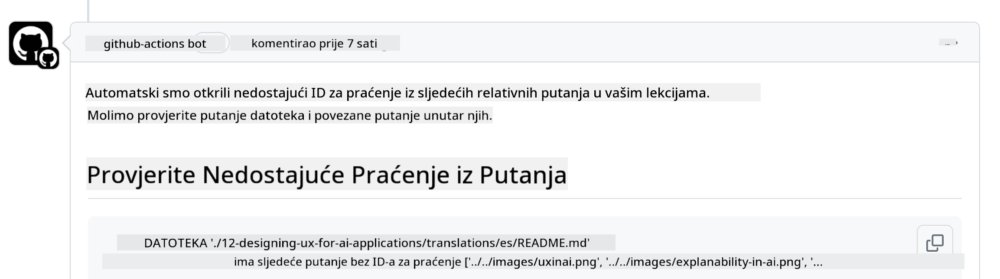
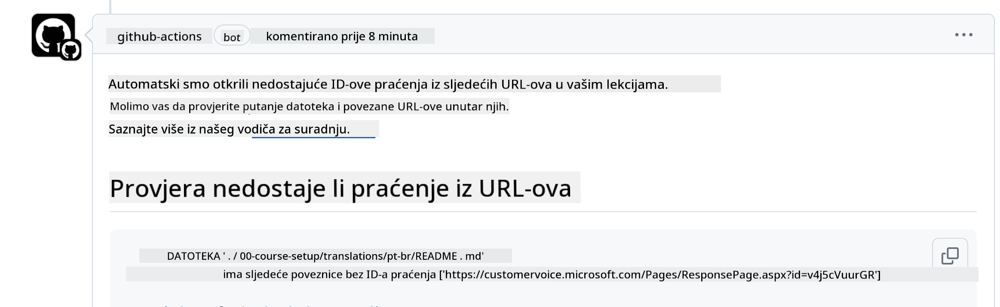
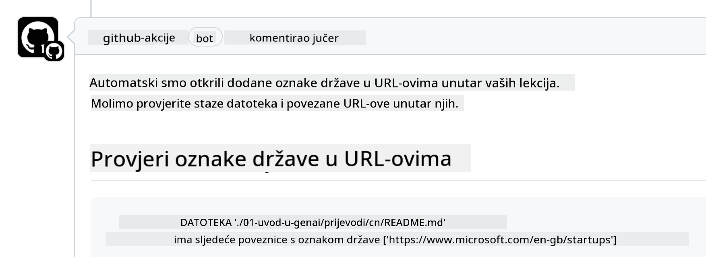

<!--
CO_OP_TRANSLATOR_METADATA:
{
  "original_hash": "57c41f2af71001a2cff9d8eb797cb843",
  "translation_date": "2025-06-25T07:21:41+00:00",
  "source_file": "CONTRIBUTING.md",
  "language_code": "hr"
}
-->
# Doprinos

Ovaj projekt pozdravlja doprinose i prijedloge. Većina doprinosa zahtijeva da se složite s Ugovorom o licenci za doprinositelje (CLA) koji izjavljuje da imate pravo, i zapravo dajete nam prava, koristiti vaš doprinos. Za detalje posjetite <https://cla.microsoft.com>.

> Važno: kada prevodite tekst u ovom repozitoriju, molimo osigurajte da ne koristite strojno prevođenje. Provjerit ćemo prijevode putem zajednice, stoga se dobrovoljno prijavite za prijevode samo na jezicima na kojima ste stručni.

Kada pošaljete zahtjev za povlačenje, CLA-bot će automatski odrediti trebate li pružiti CLA i odgovarajuće ukrasiti PR (npr. oznaka, komentar). Jednostavno slijedite upute koje vam daje bot. To ćete morati učiniti samo jednom za sve repozitorije koji koriste naš CLA.

## Kodeks ponašanja

Ovaj projekt je usvojio [Microsoft Open Source Kodeks ponašanja](https://opensource.microsoft.com/codeofconduct/?WT.mc_id=academic-105485-koreyst). Za više informacija pročitajte [FAQ o kodeksu ponašanja](https://opensource.microsoft.com/codeofconduct/faq/?WT.mc_id=academic-105485-koreyst) ili kontaktirajte [opencode@microsoft.com](mailto:opencode@microsoft.com) s dodatnim pitanjima ili komentarima.

## Pitanje ili problem?

Molimo ne otvarajte GitHub probleme za opća pitanja podrške jer bi se GitHub lista trebala koristiti za zahtjeve za značajkama i prijave bugova. Na taj način možemo lakše pratiti stvarne probleme ili bugove iz koda i držati opću raspravu odvojeno od stvarnog koda.

## Pogreške u tipkanju, problemi, bugovi i doprinosi

Kad god šaljete bilo kakve promjene u repozitorij Generative AI for Beginners, slijedite ove preporuke.

* Uvijek forkajte repozitorij na svoj račun prije nego što napravite svoje izmjene
* Ne kombinirajte više promjena u jedan zahtjev za povlačenje. Na primjer, pošaljite bilo kakav popravak bugova i ažuriranja dokumentacije koristeći odvojene PR-ove
* Ako vaš zahtjev za povlačenje pokazuje sukobe spajanja, pobrinite se da ažurirate svoju lokalnu glavnu granu da bude zrcalo onoga što je u glavnom repozitoriju prije nego što napravite svoje izmjene
* Ako šaljete prijevod, molimo stvorite jedan PR za sve prevedene datoteke jer ne prihvaćamo djelomične prijevode sadržaja
* Ako šaljete ispravak pogreške u tipkanju ili dokumentaciji, možete kombinirati izmjene u jedan PR gdje je to prikladno

## Opće smjernice za pisanje

- Osigurajte da su svi vaši URL-ovi uvučeni u uglate zagrade, a zatim u zagrade bez dodatnih razmaka oko njih ili unutar njih ``.
- Osigurajte da bilo koja relativna poveznica (tj. poveznice na druge datoteke i mape u repozitoriju) počinje s `./` koja se odnosi na datoteku ili mapu smještenu u trenutnom radnom direktoriju ili `../` koja se odnosi na datoteku ili mapu smještenu u nadređenom radnom direktoriju.
- Osigurajte da bilo koja relativna poveznica (tj. poveznice na druge datoteke i mape u repozitoriju) ima ID praćenja (tj. `?` ili `&`, zatim `wt.mc_id=` ili `WT.mc_id=`) na kraju.
- Osigurajte da bilo koji URL s domena _github.com, microsoft.com, visualstudio.com, aka.ms, i azure.com_ ima ID praćenja (tj. `?` ili `&`, zatim `wt.mc_id=` ili `WT.mc_id=`) na kraju.
- Osigurajte da vaše poveznice nemaju specifične jezične lokalizacije u njima (tj. `/en-us/` ili `/en/`).
- Osigurajte da su sve slike pohranjene u mapi `./images`.
- Osigurajte da slike imaju opisne nazive koristeći engleske znakove, brojeve i crtice u nazivu vaše slike.

## GitHub Radni tijekovi

Kada pošaljete zahtjev za povlačenje, četiri različita radna tijeka bit će pokrenuta kako bi se provjerila prethodna pravila. Jednostavno slijedite upute navedene ovdje kako biste prošli provjere radnog tijeka.

- [Provjeri slomljene relativne putove](../..)
- [Provjeri putove s praćenjem](../..)
- [Provjeri URL-ove s praćenjem](../..)
- [Provjeri URL-ove bez lokalizacije](../..)

### Provjeri slomljene relativne putove

Ovaj radni tijek osigurava da bilo koji relativni put u vašim datotekama radi. Ovaj repozitorij je postavljen na GitHub stranice pa morate biti vrlo pažljivi kada upisujete poveznice koje sve povezuju kako ne biste nikoga usmjerili na pogrešno mjesto.

Kako biste bili sigurni da vaše poveznice ispravno rade, jednostavno koristite VS code za provjeru toga.

Na primjer, kada prijeđete mišem preko bilo koje poveznice u vašim datotekama, bit ćete upitani da slijedite poveznicu pritiskom na **ctrl + klik**

Ako kliknete na poveznicu i ona ne radi lokalno, tada će zasigurno pokrenuti radni tijek i neće raditi na GitHub-u.

Kako biste popravili ovaj problem, pokušajte upisati poveznicu uz pomoć VS code-a.

Kada upišete `./` ili `../`, VS code će vas upitati da odaberete iz dostupnih opcija prema onome što ste upisali.

Slijedite put klikom na željenu datoteku ili mapu i bit ćete sigurni da vaš put nije slomljen.

Kada dodate ispravan relativni put, spremite i pošaljite svoje izmjene, radni tijek će biti ponovno pokrenut kako bi potvrdio vaše izmjene. Ako prođete provjeru, spremni ste.

### Provjeri putove s praćenjem

Ovaj radni tijek osigurava da bilo koji relativni put ima praćenje u njemu. Ovaj repozitorij je postavljen na GitHub stranice pa trebamo pratiti kretanje između različitih datoteka i mapa.

Kako biste bili sigurni da vaši relativni putovi imaju praćenje u njima, jednostavno provjerite sljedeći tekst `?wt.mc_id=` na kraju puta. Ako je dodan vašim relativnim putovima, proći ćete ovu provjeru.

Ako nije, možete dobiti sljedeću pogrešku.

Kako biste popravili ovaj problem, pokušajte otvoriti datoteku puta koji je radni tijek istaknuo i dodajte ID praćenja na kraj relativnih putova.

Kada dodate ID praćenja, spremite i pošaljite svoje izmjene, radni tijek će biti ponovno pokrenut kako bi potvrdio vaše izmjene. Ako prođete provjeru, spremni ste.

### Provjeri URL-ove s praćenjem

Ovaj radni tijek osigurava da bilo koji web URL ima praćenje u njemu. Ovaj repozitorij je dostupan svima pa trebate osigurati da pratite pristup kako biste znali odakle dolazi promet.

Kako biste bili sigurni da vaši URL-ovi imaju praćenje u njima, jednostavno provjerite sljedeći tekst `?wt.mc_id=` na kraju URL-a. Ako je dodan vašim URL-ovima, proći ćete ovu provjeru.

Ako nije, možete dobiti sljedeću pogrešku.

Kako biste popravili ovaj problem, pokušajte otvoriti datoteku puta koji je radni tijek istaknuo i dodajte ID praćenja na kraj URL-ova.

Kada dodate ID praćenja, spremite i pošaljite svoje izmjene, radni tijek će biti ponovno pokrenut kako bi potvrdio vaše izmjene. Ako prođete provjeru, spremni ste.

### Provjeri URL-ove bez lokalizacije

Ovaj radni tijek osigurava da bilo koji web URL nema specifičnu jezičnu lokalizaciju u njemu. Ovaj repozitorij je dostupan svima diljem svijeta pa trebate osigurati da ne uključujete lokalizaciju svoje zemlje u URL-ove.

Kako biste bili sigurni da vaši URL-ovi nemaju lokalizaciju zemlje u njima, jednostavno provjerite sljedeći tekst `/en-us/` ili `/en/` ili bilo koju drugu jezičnu lokalizaciju bilo gdje u URL-u. Ako nije prisutno u vašim URL-ovima, proći ćete ovu provjeru.

Ako nije, možete dobiti sljedeću pogrešku.

Kako biste popravili ovaj problem, pokušajte otvoriti datoteku puta koji je radni tijek istaknuo i uklonite lokalizaciju zemlje iz URL-ova.

Kada uklonite lokalizaciju zemlje, spremite i pošaljite svoje izmjene, radni tijek će biti ponovno pokrenut kako bi potvrdio vaše izmjene. Ako prođete provjeru, spremni ste.

Čestitamo! Javimo vam se čim prije s povratnim informacijama o vašem doprinosu.

**Odricanje od odgovornosti**:  
Ovaj dokument je preveden korištenjem AI usluge prevođenja [Co-op Translator](https://github.com/Azure/co-op-translator). Iako težimo točnosti, molimo vas da budete svjesni da automatizirani prijevodi mogu sadržavati pogreške ili netočnosti. Izvorni dokument na izvornom jeziku treba smatrati mjerodavnim izvorom. Za kritične informacije preporučuje se profesionalni ljudski prijevod. Ne snosimo odgovornost za bilo kakve nesporazume ili pogrešne interpretacije proizašle iz korištenja ovog prijevoda.