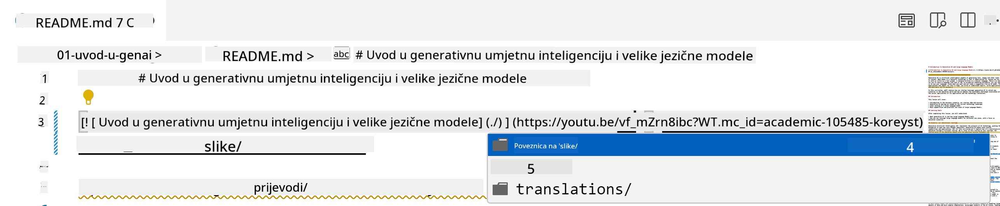
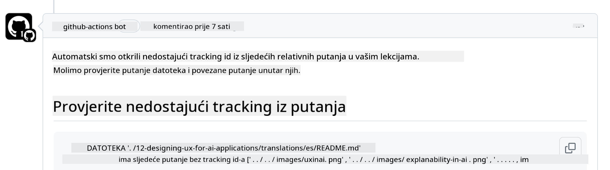
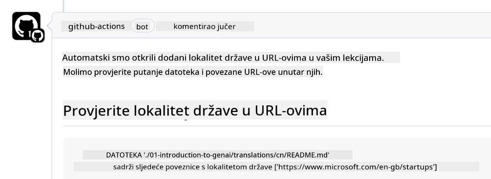

<!--
CO_OP_TRANSLATOR_METADATA:
{
  "original_hash": "57c41f2af71001a2cff9d8eb797cb843",
  "translation_date": "2025-07-09T06:13:29+00:00",
  "source_file": "CONTRIBUTING.md",
  "language_code": "hr"
}
-->
# Contributing

Ovaj projekt pozdravlja doprinose i prijedloge. Većina doprinosa zahtijeva da se složite s Contributor License Agreement (CLA) kojim izjavljujete da imate pravo i doista nam dajete prava za korištenje vašeg doprinosa. Za detalje posjetite <https://cla.microsoft.com>.

> Važno: prilikom prevođenja teksta u ovom repozitoriju, molimo vas da ne koristite strojni prijevod. Prijevode ćemo provjeravati putem zajednice, stoga se prijavljujte za prijevode samo za jezike u kojima ste vješti.

Kada pošaljete pull request, CLA-bot će automatski utvrditi trebate li dostaviti CLA i označiti PR na odgovarajući način (npr. oznakom, komentarom). Jednostavno slijedite upute koje vam bot daje. Ovo ćete morati napraviti samo jednom za sve repozitorije koji koriste naš CLA.

## Code of Conduct

Ovaj projekt je usvojio [Microsoft Open Source Code of Conduct](https://opensource.microsoft.com/codeofconduct/?WT.mc_id=academic-105485-koreyst).  
Za više informacija pročitajte [Code of Conduct FAQ](https://opensource.microsoft.com/codeofconduct/faq/?WT.mc_id=academic-105485-koreyst) ili kontaktirajte [opencode@microsoft.com](mailto:opencode@microsoft.com) za dodatna pitanja ili komentare.

## Pitanje ili problem?

Molimo vas da ne otvarate GitHub issue za opća pitanja podrške jer se GitHub lista treba koristiti za zahtjeve za značajkama i prijave bugova. Na taj način lakše pratimo stvarne probleme ili bugove u kodu i držimo opću raspravu odvojenu od samog koda.

## Tipfeleri, problemi, bugovi i doprinosi

Kad god šaljete bilo kakve promjene u Generative AI for Beginners repozitorij, molimo vas da slijedite ove preporuke.

* Uvijek forkajte repozitorij na svoj račun prije nego što napravite izmjene  
* Nemojte kombinirati više promjena u jedan pull request. Na primjer, prijavite ispravke bugova i ažuriranja dokumentacije u zasebnim PR-ovima  
* Ako vaš pull request pokazuje konflikte pri spajanju, pobrinite se da ažurirate svoj lokalni main tako da bude ogledalo onoga što je u glavnom repozitoriju prije nego što napravite izmjene  
* Ako šaljete prijevod, molimo napravite jedan PR za sve prevedene datoteke jer ne prihvaćamo djelomične prijevode sadržaja  
* Ako šaljete ispravak tipfelera ili dokumentacije, možete kombinirati izmjene u jedan PR gdje je to prikladno

## Opće smjernice za pisanje

- Provjerite jesu li svi vaši URL-ovi u uglatim zagradama praćeni zagradama bez dodatnih razmaka ``.  
- Provjerite da svaki relativni link (tj. linkovi na druge datoteke i mape u repozitoriju) počinje s `./` za datoteku ili mapu u trenutnom radnom direktoriju ili `../` za datoteku ili mapu u roditeljskom direktoriju.  
- Provjerite da svaki relativni link ima tracking ID (tj. `?` ili `&` zatim `wt.mc_id=` ili `WT.mc_id=`) na kraju.  
- Provjerite da svaki URL s domena _github.com, microsoft.com, visualstudio.com, aka.ms, i azure.com_ ima tracking ID na kraju.  
- Provjerite da vaši linkovi ne sadrže lokalizaciju specifičnu za zemlju (npr. `/en-us/` ili `/en/`).  
- Provjerite da su sve slike pohranjene u `./images` mapi.  
- Provjerite da slike imaju opisna imena koristeći engleska slova, brojeve i crtice u nazivu.

## GitHub Workflows

Kada pošaljete pull request, pokrenut će se četiri različita workflowa za provjeru prethodnih pravila.  
Jednostavno slijedite upute navedene ovdje da biste prošli provjere workflowa.

- [Check Broken Relative Paths](../..)  
- [Check Paths Have Tracking](../..)  
- [Check URLs Have Tracking](../..)  
- [Check URLs Don't Have Locale](../..)

### Check Broken Relative Paths

Ovaj workflow osigurava da svaki relativni put u vašim datotekama radi.  
Ovaj repozitorij je postavljen na GitHub pages pa morate biti vrlo pažljivi pri upisivanju linkova koji povezuju sve da ne bi usmjerili nekoga na krivo mjesto.

Da biste bili sigurni da vaši linkovi rade ispravno, jednostavno koristite VS code za provjeru.

Na primjer, kada pređete mišem preko bilo kojeg linka u vašim datotekama, dobit ćete mogućnost da slijedite link pritiskom na **ctrl + klik**

Ako kliknete na link i on ne radi lokalno, sigurno će workflow prijaviti grešku i neće raditi ni na GitHubu.

Da biste riješili ovaj problem, pokušajte upisati link uz pomoć VS code-a.

Kada upišete `./` ili `../`, VS code će vam ponuditi dostupne opcije prema onome što ste upisali.

Slijedite put klikom na željenu datoteku ili mapu i bit ćete sigurni da vaš put nije pokvaren.

Kada dodate ispravan relativni put, spremite i pushajte promjene, workflow će se ponovno pokrenuti da provjeri vaše izmjene.  
Ako prođete provjeru, spremni ste za daljnji rad.

### Check Paths Have Tracking

Ovaj workflow osigurava da svaki relativni put ima tracking u sebi.  
Ovaj repozitorij je postavljen na GitHub pages pa trebamo pratiti kretanje između različitih datoteka i mapa.

Da biste bili sigurni da vaši relativni putovi imaju tracking, provjerite postoji li na kraju puta tekst `?wt.mc_id=`.  
Ako je dodan na vaše relativne putove, proći ćete ovu provjeru.

Ako nije, možete dobiti sljedeću grešku.

Da biste riješili ovaj problem, otvorite datoteku koju je workflow označio i dodajte tracking ID na kraj relativnih putova.

Kada dodate tracking ID, spremite i pushajte promjene, workflow će se ponovno pokrenuti da provjeri vaše izmjene.  
Ako prođete provjeru, spremni ste za daljnji rad.

### Check URLs Have Tracking

Ovaj workflow osigurava da svaki web URL ima tracking u sebi.  
Ovaj repozitorij je dostupan svima pa morate biti sigurni da pratite pristupe kako biste znali odakle dolazi promet.

Da biste bili sigurni da vaši URL-ovi imaju tracking, provjerite postoji li na kraju URL-a tekst `?wt.mc_id=`.  
Ako je dodan na vaše URL-ove, proći ćete ovu provjeru.

Ako nije, možete dobiti sljedeću grešku.

Da biste riješili ovaj problem, otvorite datoteku koju je workflow označio i dodajte tracking ID na kraj URL-ova.

Kada dodate tracking ID, spremite i pushajte promjene, workflow će se ponovno pokrenuti da provjeri vaše izmjene.  
Ako prođete provjeru, spremni ste za daljnji rad.

### Check URLs Don't Have Locale

Ovaj workflow osigurava da nijedan web URL ne sadrži lokalizaciju specifičnu za zemlju.  
Ovaj repozitorij je dostupan svima u svijetu pa morate paziti da ne uključite lokalizaciju svoje zemlje u URL-ove.

Da biste bili sigurni da vaši URL-ovi nemaju lokalizaciju zemlje, provjerite postoji li u URL-u tekst `/en-us/` ili `/en/` ili bilo koja druga jezična lokalizacija.  
Ako nije prisutna u vašim URL-ovima, proći ćete ovu provjeru.

Ako jest, možete dobiti sljedeću grešku.

Da biste riješili ovaj problem, otvorite datoteku koju je workflow označio i uklonite lokalizaciju zemlje iz URL-ova.

Kada uklonite lokalizaciju zemlje, spremite i pushajte promjene, workflow će se ponovno pokrenuti da provjeri vaše izmjene.  
Ako prođete provjeru, spremni ste za daljnji rad.

Čestitamo! Javili smo vam se čim prije s povratnom informacijom o vašem doprinosu.

**Odricanje od odgovornosti**:  
Ovaj dokument je preveden korištenjem AI usluge za prevođenje [Co-op Translator](https://github.com/Azure/co-op-translator). Iako težimo točnosti, imajte na umu da automatski prijevodi mogu sadržavati pogreške ili netočnosti. Izvorni dokument na izvornom jeziku treba smatrati službenim i autoritativnim izvorom. Za kritične informacije preporučuje se profesionalni ljudski prijevod. Ne snosimo odgovornost za bilo kakva nesporazuma ili pogrešna tumačenja koja proizlaze iz korištenja ovog prijevoda.