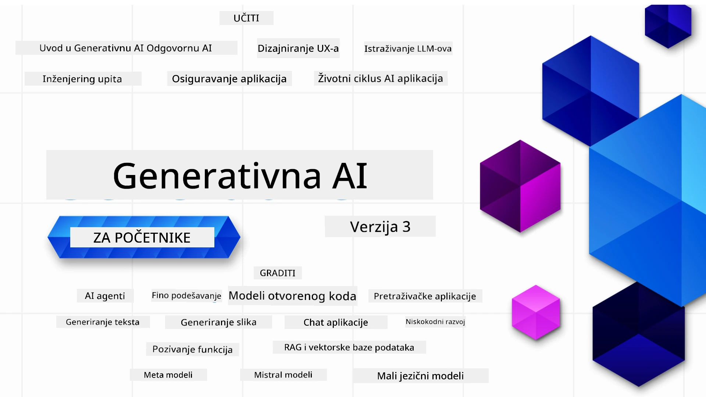

### 21 lekcija koja podučava sve što trebate znati za početak izrade Generativnih AI aplikacija

[](https://github.com/microsoft/Generative-AI-For-Beginners/blob/master/LICENSE?WT.mc_id=academic-105485-koreyst)
[](https://GitHub.com/microsoft/Generative-AI-For-Beginners/graphs/contributors/?WT.mc_id=academic-105485-koreyst)
[](https://GitHub.com/microsoft/Generative-AI-For-Beginners/issues/?WT.mc_id=academic-105485-koreyst)
[](https://GitHub.com/microsoft/Generative-AI-For-Beginners/pulls/?WT.mc_id=academic-105485-koreyst)
[](http://makeapullrequest.com?WT.mc_id=academic-105485-koreyst)

[](https://GitHub.com/microsoft/Generative-AI-For-Beginners/watchers/?WT.mc_id=academic-105485-koreyst)
[](https://GitHub.com/microsoft/Generative-AI-For-Beginners/network/?WT.mc_id=academic-105485-koreyst)
[](https://GitHub.com/microsoft/Generative-AI-For-Beginners/stargazers/?WT.mc_id=academic-105485-koreyst)

[](https://discord.gg/nTYy5BXMWG)

### 🌐 Višejezična podrška

#### Podržano putem GitHub Action (automatizirano i uvijek ažurirano)

<!-- CO-OP TRANSLATOR LANGUAGES TABLE START -->
[Arapski](../ar/README.md) | [Bengalski](../bn/README.md) | [Bugarski](../bg/README.md) | [Burmanski (Myanmar)](../my/README.md) | [Kineski (pojednostavljeni)](../zh-CN/README.md) | [Kineski (tradicionalni, Hong Kong)](../zh-HK/README.md) | [Kineski (tradicionalni, Makao)](../zh-MO/README.md) | [Kineski (tradicionalni, Tajvan)](../zh-TW/README.md) | [Hrvatski](./README.md) | [Češki](../cs/README.md) | [Danski](../da/README.md) | [Nizozemski](../nl/README.md) | [Estonski](../et/README.md) | [Finski](../fi/README.md) | [Francuski](../fr/README.md) | [Njemački](../de/README.md) | [Grčki](../el/README.md) | [Hebrejski](../he/README.md) | [Hindi](../hi/README.md) | [Mađarski](../hu/README.md) | [Indonezijski](../id/README.md) | [Talijanski](../it/README.md) | [Japanski](../ja/README.md) | [Kannada](../kn/README.md) | [Korejski](../ko/README.md) | [Litvanski](../lt/README.md) | [Malajski](../ms/README.md) | [Malajalam](../ml/README.md) | [Marathi](../mr/README.md) | [Nepalski](../ne/README.md) | [Nigerijski pidgin](../pcm/README.md) | [Norveški](../no/README.md) | [Persijski (Farsi)](../fa/README.md) | [Poljski](../pl/README.md) | [Portugalski (Brazil)](../pt-BR/README.md) | [Portugalski (Portugal)](../pt-PT/README.md) | [Punjabi (Gurmukhi)](../pa/README.md) | [Rumunjski](../ro/README.md) | [Ruski](../ru/README.md) | [Srpski (ćirilica)](../sr/README.md) | [Slovački](../sk/README.md) | [Slovenski](../sl/README.md) | [Španjolski](../es/README.md) | [Svahili](../sw/README.md) | [Švedski](../sv/README.md) | [Tagalog (Filipinski)](../tl/README.md) | [Tamilski](../ta/README.md) | [Telugu](../te/README.md) | [Tajlandski](../th/README.md) | [Turski](../tr/README.md) | [Ukrajinski](../uk/README.md) | [Urdu](../ur/README.md) | [Vijetnamski](../vi/README.md)

> **Radije klonirati lokalno?**

> Ovaj repozitorij uključuje 50+ prijevoda što znatno povećava veličinu preuzimanja. Za kloniranje bez prijevoda, koristite sparse checkout:
> ```bash
> git clone --filter=blob:none --sparse https://github.com/microsoft/generative-ai-for-beginners.git
> cd generative-ai-for-beginners
> git sparse-checkout set --no-cone '/*' '!translations' '!translated_images'
> ```
> Ovo vam daje sve što trebate za dovršetak tečaja s puno bržim preuzimanjem.
<!-- CO-OP TRANSLATOR LANGUAGES TABLE END -->

# Generativna AI za početnike (Verzija 3) - Tečaj

Naučite osnove izrade Generativnih AI aplikacija kroz naš sveobuhvatni tečaj od 21 lekcije kojeg vode Microsoft Cloud Advocates.

## 🌱 Početak

Ovaj tečaj ima 21 lekciju. Svaka lekcija pokriva svoju temu, pa započnite gdje želite!

Lekcije su označene kao "Uči" lekcije koje objašnjavaju pojam Generativne AI ili "Izgradi" lekcije koje objašnjavaju pojam i primjere koda u oba **Pythona** i **TypeScripta** kad je moguće.

Za .NET programere pogledajte [Generativna AI za početnike (.NET izdanje)](https://github.com/microsoft/Generative-AI-for-beginners-dotnet?WT.mc_id=academic-105485-koreyst)!

Svaka lekcija također uključuje odjeljak "Nastavi učiti" s dodatnim obrazovnim materijalima.

## Što vam treba
### Za pokretanje koda ovog tečaja možete koristiti:
 - [Azure OpenAI uslugu](https://aka.ms/genai-beginners/azure-open-ai?WT.mc_id=academic-105485-koreyst) - **Lekcije:** "aoai-assignment"
 - [GitHub Marketplace katalog modela](https://aka.ms/genai-beginners/gh-models?WT.mc_id=academic-105485-koreyst) - **Lekcije:** "githubmodels"
 - [OpenAI API](https://aka.ms/genai-beginners/open-ai?WT.mc_id=academic-105485-koreyst) - **Lekcije:** "oai-assignment" 
   
- Osnovno znanje Pythona ili TypeScripta je korisno - \*Za potpune početnike pogledajte ove [Python](https://aka.ms/genai-beginners/python?WT.mc_id=academic-105485-koreyst) i [TypeScript](https://aka.ms/genai-beginners/typescript?WT.mc_id=academic-105485-koreyst) tečajeve
- GitHub račun za [forkanje ovog repozitorija](https://aka.ms/genai-beginners/github?WT.mc_id=academic-105485-koreyst) na vlastiti GitHub račun

Napravili smo **[Postavljanje tečaja](./00-course-setup/README.md?WT.mc_id=academic-105485-koreyst)** lekciju koja vam pomaže s postavljanjem razvojne okoline.

Ne zaboravite [označiti (🌟) ovaj repozitorij](https://docs.github.com/en/get-started/exploring-projects-on-github/saving-repositories-with-stars?WT.mc_id=academic-105485-koreyst) kako biste ga lakše pronašli kasnije.

## 🧠 Spremni za implementaciju?

Ako tražite naprednije primjere koda, pogledajte našu [kolekciju Generativnih AI primjera koda](https://aka.ms/genai-beg-code?WT.mc_id=academic-105485-koreyst) u oba **Pythona** i **TypeScripta**.

## 🗣️ Upoznajte druge polaznike, dobijte podršku

Pridružite se našem [službenom Azure AI Foundry Discord serveru](https://aka.ms/genai-discord?WT.mc_id=academic-105485-koreyst) kako biste upoznali i povezali se s drugim polaznicima tečaja i dobili podršku.

Postavljajte pitanja ili dijelite povratne informacije o proizvodu u našem [Azure AI Foundry Developer Forum](https://aka.ms/azureaifoundry/forum) na Githubu.

## 🚀 Gradeći startup?

Posjetite [Microsoft for Startups](https://www.microsoft.com/startups) i saznajte kako započeti izradu uz Azure kredite već danas.

## 🙏 Želite pomoći?

Imate prijedloge ili ste pronašli pravopisne ili kodne pogreške? [Otvorite problem](https://github.com/microsoft/generative-ai-for-beginners/issues?WT.mc_id=academic-105485-koreyst) ili [Napravite pull request](https://github.com/microsoft/generative-ai-for-beginners/pulls?WT.mc_id=academic-105485-koreyst)

## 📂 Svaka lekcija uključuje:

- Kratki video uvod u temu
- Pisanu lekciju u README datoteci
- Primjere koda u Pythonu i TypeScriptu za podršku Azure OpenAI i OpenAI API-ju
- Poveznice na dodatne resurse za nastavak učenja

## 🗃️ Lekcije

| #   | **Poveznica na lekciju**                                                                                                                      | **Opis**                                                                                       | **Video**                                                                   | **Dodatno učenje**                                                             |
| --- | ---------------------------------------------------------------------------------------------------------------------------------------------- | --------------------------------------------------------------------------------------------- | --------------------------------------------------------------------------- | ------------------------------------------------------------------------------ |
| 00  | [Postavljanje tečaja](./00-course-setup/README.md?WT.mc_id=academic-105485-koreyst)                                                            | **Nauči:** Kako postaviti razvojno okruženje                                                | Video uskoro                                                                 | [Saznaj više](https://aka.ms/genai-collection?WT.mc_id=academic-105485-koreyst) |
| 01  | [Uvod u Generativnu AI i LLM-ove](./01-introduction-to-genai/README.md?WT.mc_id=academic-105485-koreyst)                                        | **Nauči:** Razumijevanje što je Generativna AI i kako veliki jezični modeli (LLM) rade.       | [Video](https://aka.ms/gen-ai-lesson-1-gh?WT.mc_id=academic-105485-koreyst) | [Saznaj više](https://aka.ms/genai-collection?WT.mc_id=academic-105485-koreyst) |
| 02  | [Istraživanje i usporedba različitih LLM-ova](./02-exploring-and-comparing-different-llms/README.md?WT.mc_id=academic-105485-koreyst)           | **Nauči:** Kako odabrati pravi model za vaš slučaj upotrebe                                  | [Video](https://aka.ms/gen-ai-lesson2-gh?WT.mc_id=academic-105485-koreyst)  | [Saznaj više](https://aka.ms/genai-collection?WT.mc_id=academic-105485-koreyst) |
| 03  | [Odgovorno korištenje Generativne AI](./03-using-generative-ai-responsibly/README.md?WT.mc_id=academic-105485-koreyst)                          | **Nauči:** Kako izgraditi Generativne AI aplikacije odgovorno                               | [Video](https://aka.ms/gen-ai-lesson3-gh?WT.mc_id=academic-105485-koreyst)  | [Saznaj više](https://aka.ms/genai-collection?WT.mc_id=academic-105485-koreyst) |
| 04  | [Razumijevanje osnova inženjerstva upita](./04-prompt-engineering-fundamentals/README.md?WT.mc_id=academic-105485-koreyst)             | **Nauči:** Praktične najbolje prakse inženjerstva upita                                           | [Video](https://aka.ms/gen-ai-lesson4-gh?WT.mc_id=academic-105485-koreyst)  | [Saznaj više](https://aka.ms/genai-collection?WT.mc_id=academic-105485-koreyst) |
| 05  | [Izrada naprednih upita](./05-advanced-prompts/README.md?WT.mc_id=academic-105485-koreyst)                                                | **Nauči:** Kako primijeniti tehnike inženjerstva upita koje poboljšavaju rezultate upita         | [Video](https://aka.ms/gen-ai-lesson5-gh?WT.mc_id=academic-105485-koreyst)  | [Saznaj više](https://aka.ms/genai-collection?WT.mc_id=academic-105485-koreyst) |
| 06  | [Izrada aplikacija za generiranje teksta](./06-text-generation-apps/README.md?WT.mc_id=academic-105485-koreyst)                          | **Izradi:** Aplikaciju za generiranje teksta koristeći Azure OpenAI / OpenAI API                  | [Video](https://aka.ms/gen-ai-lesson6-gh?WT.mc_id=academic-105485-koreyst)  | [Saznaj više](https://aka.ms/genai-collection?WT.mc_id=academic-105485-koreyst) |
| 07  | [Izrada chat aplikacija](./07-building-chat-applications/README.md?WT.mc_id=academic-105485-koreyst)                                     | **Izradi:** Tehnike za učinkovitu izradu i integraciju chat aplikacija                            | [Video](https://aka.ms/gen-ai-lessons7-gh?WT.mc_id=academic-105485-koreyst) | [Saznaj više](https://aka.ms/genai-collection?WT.mc_id=academic-105485-koreyst) |
| 08  | [Izrada aplikacija za pretraživanje s vektorskim bazama podataka](./08-building-search-applications/README.md?WT.mc_id=academic-105485-koreyst) | **Izradi:** Aplikaciju za pretraživanje koja koristi ugnježđivanja za pretraživanje podataka     | [Video](https://aka.ms/gen-ai-lesson8-gh?WT.mc_id=academic-105485-koreyst)  | [Saznaj više](https://aka.ms/genai-collection?WT.mc_id=academic-105485-koreyst) |
| 09  | [Izrada aplikacija za generiranje slika](./09-building-image-applications/README.md?WT.mc_id=academic-105485-koreyst)                    | **Izradi:** Aplikaciju za generiranje slika                                                    | [Video](https://aka.ms/gen-ai-lesson9-gh?WT.mc_id=academic-105485-koreyst)  | [Saznaj više](https://aka.ms/genai-collection?WT.mc_id=academic-105485-koreyst) |
| 10  | [Izrada Low Code AI aplikacija](./10-building-low-code-ai-applications/README.md?WT.mc_id=academic-105485-koreyst)                       | **Izradi:** Generativnu AI aplikaciju koristeći Low Code alate                                  | [Video](https://aka.ms/gen-ai-lesson10-gh?WT.mc_id=academic-105485-koreyst) | [Saznaj više](https://aka.ms/genai-collection?WT.mc_id=academic-105485-koreyst) |
| 11  | [Integracija vanjskih aplikacija s pozivom funkcija](./11-integrating-with-function-calling/README.md?WT.mc_id=academic-105485-koreyst)   | **Izradi:** Što je pozivanje funkcija i njegove primjene u aplikacijama                         | [Video](https://aka.ms/gen-ai-lesson11-gh?WT.mc_id=academic-105485-koreyst) | [Saznaj više](https://aka.ms/genai-collection?WT.mc_id=academic-105485-koreyst) |
| 12  | [Dizajniranje korisničkog iskustva za AI aplikacije](./12-designing-ux-for-ai-applications/README.md?WT.mc_id=academic-105485-koreyst)      | **Nauči:** Kako primijeniti principe dizajna korisničkog iskustva pri razvoju Generativnih AI aplikacija | [Video](https://aka.ms/gen-ai-lesson12-gh?WT.mc_id=academic-105485-koreyst) | [Saznaj više](https://aka.ms/genai-collection?WT.mc_id=academic-105485-koreyst) |
| 13  | [Zaštita vaših Generativnih AI aplikacija](./13-securing-ai-applications/README.md?WT.mc_id=academic-105485-koreyst)                      | **Nauči:** Prijetnje i rizike za AI sustave te metode zaštite tih sustava                      | [Video](https://aka.ms/gen-ai-lesson13-gh?WT.mc_id=academic-105485-koreyst) | [Saznaj više](https://aka.ms/genai-collection?WT.mc_id=academic-105485-koreyst) |
| 14  | [Životni ciklus Generativnih AI aplikacija](./14-the-generative-ai-application-lifecycle/README.md?WT.mc_id=academic-105485-koreyst)       | **Nauči:** Alate i metrike za upravljanje životnim ciklusom LLM i LLMOps                         | [Video](https://aka.ms/gen-ai-lesson14-gh?WT.mc_id=academic-105485-koreyst) | [Saznaj više](https://aka.ms/genai-collection?WT.mc_id=academic-105485-koreyst) |
| 15  | [Retrieval Augmented Generation (RAG) i vektorske baze podataka](./15-rag-and-vector-databases/README.md?WT.mc_id=academic-105485-koreyst) | **Izradi:** Aplikaciju koristeći RAG okvir koji dohvaća ugnježđivanja iz vektorskih baza podataka | [Video](https://aka.ms/gen-ai-lesson15-gh?WT.mc_id=academic-105485-koreyst) | [Saznaj više](https://aka.ms/genai-collection?WT.mc_id=academic-105485-koreyst) |
| 16  | [Otvoreni modeli i Hugging Face](./16-open-source-models/README.md?WT.mc_id=academic-105485-koreyst)                                        | **Izradi:** Aplikaciju koristeći otvorene modele dostupne na Hugging Face                       | [Video](https://aka.ms/gen-ai-lesson16-gh?WT.mc_id=academic-105485-koreyst) | [Saznaj više](https://aka.ms/genai-collection?WT.mc_id=academic-105485-koreyst) |
| 17  | [AI agenti](./17-ai-agents/README.md?WT.mc_id=academic-105485-koreyst)                                                                       | **Izradi:** Aplikaciju koristeći okvir za AI agente                                           | [Video](https://aka.ms/gen-ai-lesson17-gh?WT.mc_id=academic-105485-koreyst) | [Saznaj više](https://aka.ms/genai-collection?WT.mc_id=academic-105485-koreyst) |
| 18  | [Fino podešavanje LLM-ova](./18-fine-tuning/README.md?WT.mc_id=academic-105485-koreyst)                                                      | **Nauči:** Što je, zašto i kako fino podešavati LLM-ove                                       | [Video](https://aka.ms/gen-ai-lesson18-gh?WT.mc_id=academic-105485-koreyst) | [Saznaj više](https://aka.ms/genai-collection?WT.mc_id=academic-105485-koreyst) |
| 19  | [Izgradnja s malim jezičnim modelima (SLM)](./19-slm/README.md?WT.mc_id=academic-105485-koreyst)                                               | **Nauči:** Prednosti izgradnje s malim jezičnim modelima                                      | Video uskoro | [Saznaj više](https://aka.ms/genai-collection?WT.mc_id=academic-105485-koreyst) |
| 20  | [Izgradnja s Mistral modelima](./20-mistral/README.md?WT.mc_id=academic-105485-koreyst)                                                       | **Nauči:** Značajke i razlike u Mistral obiteljskim modelima                                  | Video uskoro | [Saznaj više](https://aka.ms/genai-collection?WT.mc_id=academic-105485-koreyst) |
| 21  | [Izgradnja s Meta modelima](./21-meta/README.md?WT.mc_id=academic-105485-koreyst)                                                             | **Nauči:** Značajke i razlike u Meta obiteljskim modelima                                     | Video uskoro | [Saznaj više](https://aka.ms/genai-collection?WT.mc_id=academic-105485-koreyst) |

### 🌟 Posebna zahvala

Posebna zahvala [**Johnu Azizu**](https://www.linkedin.com/in/john0isaac/) za kreiranje svih GitHub Actions i workflowa

[**Bernhardu Merkleu**](https://www.linkedin.com/in/bernhard-merkle-738b73/) za ključne doprinose u svakoj lekciji koji su poboljšali iskustvo učenja i rada s kodom.

## 🎒 Ostali tečajevi

Naš tim proizvodi i druge tečajeve! Pogledajte:

<!-- CO-OP TRANSLATOR OTHER COURSES START -->
### LangChain
[](https://aka.ms/langchain4j-for-beginners)
[](https://aka.ms/langchainjs-for-beginners?WT.mc_id=m365-94501-dwahlin)

---

### Azure / Edge / MCP / Agenti
[](https://github.com/microsoft/AZD-for-beginners?WT.mc_id=academic-105485-koreyst)
[](https://github.com/microsoft/edgeai-for-beginners?WT.mc_id=academic-105485-koreyst)
[](https://github.com/microsoft/mcp-for-beginners?WT.mc_id=academic-105485-koreyst)
[](https://github.com/microsoft/ai-agents-for-beginners?WT.mc_id=academic-105485-koreyst)

---
 
### Serija o Generativnoj AI
[](https://github.com/microsoft/generative-ai-for-beginners?WT.mc_id=academic-105485-koreyst)
[-9333EA?style=for-the-badge&labelColor=E5E7EB&color=9333EA)](https://github.com/microsoft/Generative-AI-for-beginners-dotnet?WT.mc_id=academic-105485-koreyst)
[-C084FC?style=for-the-badge&labelColor=E5E7EB&color=C084FC)](https://github.com/microsoft/generative-ai-for-beginners-java?WT.mc_id=academic-105485-koreyst)
[-E879F9?style=for-the-badge&labelColor=E5E7EB&color=E879F9)](https://github.com/microsoft/generative-ai-with-javascript?WT.mc_id=academic-105485-koreyst)

---
 
### Osnove učenja
[](https://aka.ms/ml-beginners?WT.mc_id=academic-105485-koreyst)
[](https://aka.ms/datascience-beginners?WT.mc_id=academic-105485-koreyst)
[](https://aka.ms/ai-beginners?WT.mc_id=academic-105485-koreyst)
[](https://github.com/microsoft/Security-101?WT.mc_id=academic-96948-sayoung)
[](https://aka.ms/webdev-beginners?WT.mc_id=academic-105485-koreyst)
[](https://aka.ms/iot-beginners?WT.mc_id=academic-105485-koreyst)
[](https://github.com/microsoft/xr-development-for-beginners?WT.mc_id=academic-105485-koreyst)

---
 
### Serija Copilot
[](https://aka.ms/GitHubCopilotAI?WT.mc_id=academic-105485-koreyst)
[](https://github.com/microsoft/mastering-github-copilot-for-dotnet-csharp-developers?WT.mc_id=academic-105485-koreyst)
[](https://github.com/microsoft/CopilotAdventures?WT.mc_id=academic-105485-koreyst)
<!-- CO-OP TRANSLATOR OTHER COURSES END -->

## Dobivanje pomoći

Ako zapnete ili imate bilo kakvih pitanja o izradi AI aplikacija. Pridružite se drugim učenicima i iskusnim programerima u raspravama o MCP-u. To je poticajna zajednica gdje su pitanja dobrodošla i znanje se slobodno dijeli.

[](https://discord.gg/nTYy5BXMWG)

Ako imate povratne informacije o proizvodu ili naiđete na greške tijekom izrade, posjetite:

[](https://aka.ms/foundry/forum)

---

<!-- CO-OP TRANSLATOR DISCLAIMER START -->
**Odricanje od odgovornosti**:
Ovaj dokument preveden je korištenjem AI usluge za prevođenje [Co-op Translator](https://github.com/Azure/co-op-translator). Iako nastojimo osigurati točnost, imajte na umu da automatski prijevodi mogu sadržavati pogreške ili netočnosti. Izvorni dokument na izvornom jeziku treba se smatrati autoritativnim izvorom. Za kritične informacije preporučuje se profesionalni ljudski prijevod. Ne snosimo odgovornost za bilo kakva nesporazuma ili pogrešna tumačenja nastala korištenjem ovog prijevoda.
<!-- CO-OP TRANSLATOR DISCLAIMER END -->