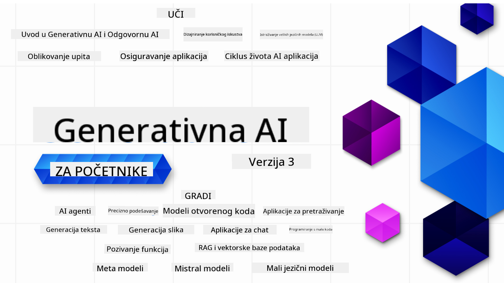

<!--
CO_OP_TRANSLATOR_METADATA:
{
  "original_hash": "ca2afa136ed9aca0634f39f51239746e",
  "translation_date": "2025-08-27T08:59:20+00:00",
  "source_file": "README.md",
  "language_code": "hr"
}
-->

### 21 lekcija koje vas uče svemu što trebate znati za početak izrade aplikacija s generativnom AI tehnologijom

### 🌐 Podrška za više jezika

#### Podržano putem GitHub Action (Automatski i uvijek ažurirano)

[Francuski](../fr/README.md) | [Španjolski](../es/README.md) | [Njemački](../de/README.md) | [Ruski](../ru/README.md) | [Arapski](../ar/README.md) | [Perzijski (Farsi)](../fa/README.md) | [Urdu](../ur/README.md) | [Kineski (pojednostavljeni)](../zh/README.md) | [Kineski (tradicionalni, Makao)](../mo/README.md) | [Kineski (tradicionalni, Hong Kong)](../hk/README.md) | [Kineski (tradicionalni, Tajvan)](../tw/README.md) | [Japanski](../ja/README.md) | [Korejski](../ko/README.md) | [Hindski](../hi/README.md) | [Bengalski](../bn/README.md) | [Marathi](../mr/README.md) | [Nepalski](../ne/README.md) | [Punjabi (Gurmukhi)](../pa/README.md) | [Portugalski (Portugal)](../pt/README.md) | [Portugalski (Brazil)](../br/README.md) | [Talijanski](../it/README.md) | [Litvanski](../lt/README.md) | [Poljski](../pl/README.md) | [Turski](../tr/README.md) | [Grčki](../el/README.md) | [Tajlandski](../th/README.md) | [Švedski](../sv/README.md) | [Danski](../da/README.md) | [Norveški](../no/README.md) | [Finski](../fi/README.md) | [Nizozemski](../nl/README.md) | [Hebrejski](../he/README.md) | [Vijetnamski](../vi/README.md) | [Indonezijski](../id/README.md) | [Malajski](../ms/README.md) | [Tagalog (Filipinski)](../tl/README.md) | [Svahili](../sw/README.md) | [Mađarski](../hu/README.md) | [Češki](../cs/README.md) | [Slovački](../sk/README.md) | [Rumunjski](../ro/README.md) | [Bugarski](../bg/README.md) | [Srpski (ćirilica)](../sr/README.md) | [Hrvatski](./README.md) | [Slovenski](../sl/README.md) | [Ukrajinski](../uk/README.md) | [Burmanski (Mjanmar)](../my/README.md)

# Generativna AI za početnike (Verzija 3) - Tečaj

Naučite osnove izrade aplikacija s generativnom AI tehnologijom uz naš sveobuhvatni tečaj od 21 lekcije koji su osmislili Microsoft Cloud Advocates.

## 🌱 Početak

Ovaj tečaj sadrži 21 lekciju. Svaka lekcija pokriva vlastitu temu, pa možete započeti gdje god želite!

Lekcije su označene kao "Learn" lekcije koje objašnjavaju koncept generativne AI tehnologije ili "Build" lekcije koje objašnjavaju koncept i pružaju primjere koda u **Pythonu** i **TypeScriptu** kad god je to moguće.

Za .NET programere pogledajte [Generativna AI za početnike (.NET izdanje)](https://github.com/microsoft/Generative-AI-for-beginners-dotnet?WT.mc_id=academic-105485-koreyst)!

Svaka lekcija također uključuje odjeljak "Keep Learning" s dodatnim alatima za učenje.

## Što vam je potrebno
### Za pokretanje koda ovog tečaja možete koristiti:
 - [Azure OpenAI Service](https://aka.ms/genai-beginners/azure-open-ai?WT.mc_id=academic-105485-koreyst) - **Lekcije:** "aoai-assignment"
 - [GitHub Marketplace Model Catalog](https://aka.ms/genai-beginners/gh-models?WT.mc_id=academic-105485-koreyst) - **Lekcije:** "githubmodels"
 - [OpenAI API](https://aka.ms/genai-beginners/open-ai?WT.mc_id=academic-105485-koreyst) - **Lekcije:** "oai-assignment" 

- Osnovno znanje Python-a ili TypeScript-a je korisno - \*Za apsolutne početnike pogledajte ove tečajeve [Python](https://aka.ms/genai-beginners/python?WT.mc_id=academic-105485-koreyst) i [TypeScript](https://aka.ms/genai-beginners/typescript?WT.mc_id=academic-105485-koreyst)
- GitHub račun za [forkanje cijelog repozitorija](https://aka.ms/genai-beginners/github?WT.mc_id=academic-105485-koreyst) na vlastiti GitHub račun

Napravili smo lekciju **[Postavljanje tečaja](./00-course-setup/README.md?WT.mc_id=academic-105485-koreyst)** kako bismo vam pomogli u postavljanju vašeg razvojnog okruženja.

Ne zaboravite [označiti zvjezdicom (🌟) ovaj repozitorij](https://docs.github.com/en/get-started/exploring-projects-on-github/saving-repositories-with-stars?WT.mc_id=academic-105485-koreyst) kako biste ga lakše pronašli kasnije.

## 🧠 Spremni za implementaciju?

Ako tražite napredne primjere koda, pogledajte našu [kolekciju primjera koda za generativnu AI tehnologiju](https://aka.ms/genai-beg-code?WT.mc_id=academic-105485-koreyst) u **Pythonu** i **TypeScriptu**.

## 🗣️ Upoznajte druge polaznike, dobijte podršku

Pridružite se našem [službenom Azure AI Foundry Discord serveru](https://aka.ms/genai-discord?WT.mc_id=academic-105485-koreyst) kako biste upoznali i povezali se s drugim polaznicima ovog tečaja te dobili podršku.

Postavljajte pitanja ili dijelite povratne informacije o proizvodu na našem [Azure AI Foundry Developer Forumu](https://aka.ms/azureaifoundry/forum) na Githubu.

## 🚀 Gradite startup?

Posjetite [Microsoft za startupe](https://www.microsoft.com/startups) kako biste saznali kako započeti gradnju uz Azure kredite već danas.

## 🙏 Želite pomoći?

Imate prijedloge ili ste pronašli pravopisne ili programske pogreške? [Postavite problem](https://github.com/microsoft/generative-ai-for-beginners/issues?WT.mc_id=academic-105485-koreyst) ili [Napravite pull request](https://github.com/microsoft/generative-ai-for-beginners/pulls?WT.mc_id=academic-105485-koreyst)

## 📂 Svaka lekcija uključuje:

- Kratki video uvod u temu
- Pisanu lekciju smještenu u README
- Primjere koda u Pythonu i TypeScriptu koji podržavaju Azure OpenAI i OpenAI API
- Linkove na dodatne resurse za nastavak učenja

## 🗃️ Lekcije

| #   | **Link na lekciju**                                                                                                                          | **Opis**                                                                                       | **Video**                                                                   | **Dodatno učenje**                                                             |
| --- | -------------------------------------------------------------------------------------------------------------------------------------------- | --------------------------------------------------------------------------------------------- | --------------------------------------------------------------------------- | ------------------------------------------------------------------------------ |
| 00  | [Postavljanje tečaja](./00-course-setup/README.md?WT.mc_id=academic-105485-koreyst)                                                          | **Learn:** Kako postaviti razvojno okruženje                                                  | Video uskoro                                                                 | [Saznajte više](https://aka.ms/genai-collection?WT.mc_id=academic-105485-koreyst) |
| 01  | [Uvod u generativnu AI i LLM-ove](./01-introduction-to-genai/README.md?WT.mc_id=academic-105485-koreyst)                                     | **Learn:** Razumijevanje što je generativna AI i kako funkcioniraju veliki jezični modeli (LLM-ovi). | [Video](https://aka.ms/gen-ai-lesson-1-gh?WT.mc_id=academic-105485-koreyst) | [Saznajte više](https://aka.ms/genai-collection?WT.mc_id=academic-105485-koreyst) |
| 02  | [Istraživanje i usporedba različitih LLM-ova](./02-exploring-and-comparing-different-llms/README.md?WT.mc_id=academic-105485-koreyst)        | **Learn:** Kako odabrati pravi model za vaš slučaj uporabe                                    | [Video](https://aka.ms/gen-ai-lesson2-gh?WT.mc_id=academic-105485-koreyst)  | [Saznajte više](https://aka.ms/genai-collection?WT.mc_id=academic-105485-koreyst) |
| 03  | [Odgovorno korištenje generativne AI tehnologije](./03-using-generative-ai-responsibly/README.md?WT.mc_id=academic-105485-koreyst)           | **Learn:** Kako odgovorno izraditi aplikacije s generativnom AI tehnologijom                  | [Video](https://aka.ms/gen-ai-lesson3-gh?WT.mc_id=academic-105485-koreyst)  | [Saznajte više](https://aka.ms/genai-collection?WT.mc_id=academic-105485-koreyst) |
| 04  | [Razumijevanje osnova inženjeringa upita](./04-prompt-engineering-fundamentals/README.md?WT.mc_id=academic-105485-koreyst)                   | **Learn:** Praktične najbolje prakse za inženjering upita                                     | [Video](https://aka.ms/gen-ai-lesson4-gh?WT.mc_id=academic-105485-koreyst)  | [Saznajte više](https://aka.ms/genai-collection?WT.mc_id=academic-105485-koreyst) |
| 05  | [Izrada naprednih upita](./05-advanced-prompts/README.md?WT.mc_id=academic-105485-koreyst)                                                   | **Learn:** Kako primijeniti tehnike inženjeringa upita koje poboljšavaju rezultate vaših upita | [Video](https://aka.ms/gen-ai-lesson5-gh?WT.mc_id=academic-105485-koreyst)  | [Saznajte više](https://aka.ms/genai-collection?WT.mc_id=academic-105485-koreyst) |
| 06  | [Izrada aplikacija za generiranje teksta](./06-text-generation-apps/README.md?WT.mc_id=academic-105485-koreyst)                                | **Izrada:** Aplikacija za generiranje teksta koristeći Azure OpenAI / OpenAI API                                | [Video](https://aka.ms/gen-ai-lesson6-gh?WT.mc_id=academic-105485-koreyst)  | [Saznaj više](https://aka.ms/genai-collection?WT.mc_id=academic-105485-koreyst) |
| 07  | [Izrada aplikacija za chat](./07-building-chat-applications/README.md?WT.mc_id=academic-105485-koreyst)                                     | **Izrada:** Tehnike za učinkovitu izradu i integraciju aplikacija za chat.               | [Video](https://aka.ms/gen-ai-lessons7-gh?WT.mc_id=academic-105485-koreyst) | [Saznaj više](https://aka.ms/genai-collection?WT.mc_id=academic-105485-koreyst) |
| 08  | [Izrada aplikacija za pretraživanje s vektorskim bazama podataka](./08-building-search-applications/README.md?WT.mc_id=academic-105485-koreyst)                        | **Izrada:** Aplikacija za pretraživanje koja koristi ugrađene podatke za pretraživanje.                        | [Video](https://aka.ms/gen-ai-lesson8-gh?WT.mc_id=academic-105485-koreyst)  | [Saznaj više](https://aka.ms/genai-collection?WT.mc_id=academic-105485-koreyst) |
| 09  | [Izrada aplikacija za generiranje slika](./09-building-image-applications/README.md?WT.mc_id=academic-105485-koreyst)                        | **Izrada:** Aplikacija za generiranje slika                                                       | [Video](https://aka.ms/gen-ai-lesson9-gh?WT.mc_id=academic-105485-koreyst)  | [Saznaj više](https://aka.ms/genai-collection?WT.mc_id=academic-105485-koreyst) |
| 10  | [Izrada AI aplikacija s malo koda](./10-building-low-code-ai-applications/README.md?WT.mc_id=academic-105485-koreyst)                       | **Izrada:** Generativna AI aplikacija koristeći alate s malo koda                                     | [Video](https://aka.ms/gen-ai-lesson10-gh?WT.mc_id=academic-105485-koreyst) | [Saznaj više](https://aka.ms/genai-collection?WT.mc_id=academic-105485-koreyst) |
| 11  | [Integracija vanjskih aplikacija pomoću poziva funkcija](./11-integrating-with-function-calling/README.md?WT.mc_id=academic-105485-koreyst) | **Izrada:** Što je poziv funkcija i kako se koristi u aplikacijama                          | [Video](https://aka.ms/gen-ai-lesson11-gh?WT.mc_id=academic-105485-koreyst) | [Saznaj više](https://aka.ms/genai-collection?WT.mc_id=academic-105485-koreyst) |
| 12  | [Dizajniranje UX-a za AI aplikacije](./12-designing-ux-for-ai-applications/README.md?WT.mc_id=academic-105485-koreyst)                         | **Učenje:** Kako primijeniti UX principe dizajna pri razvoju generativnih AI aplikacija         | [Video](https://aka.ms/gen-ai-lesson12-gh?WT.mc_id=academic-105485-koreyst) | [Saznaj više](https://aka.ms/genai-collection?WT.mc_id=academic-105485-koreyst) |
| 13  | [Osiguravanje vaših generativnih AI aplikacija](./13-securing-ai-applications/README.md?WT.mc_id=academic-105485-koreyst)                         | **Učenje:** Prijetnje i rizici za AI sustave te metode za njihovo osiguranje.             | [Video](https://aka.ms/gen-ai-lesson13-gh?WT.mc_id=academic-105485-koreyst) | [Saznaj više](https://aka.ms/genai-collection?WT.mc_id=academic-105485-koreyst) |
| 14  | [Životni ciklus generativnih AI aplikacija](./14-the-generative-ai-application-lifecycle/README.md?WT.mc_id=academic-105485-koreyst)           | **Učenje:** Alati i metrike za upravljanje životnim ciklusom LLM-a i LLMOps                         | [Video](https://aka.ms/gen-ai-lesson14-gh?WT.mc_id=academic-105485-koreyst) | [Saznaj više](https://aka.ms/genai-collection?WT.mc_id=academic-105485-koreyst) |
| 15  | [Generiranje uz dohvat podataka (RAG) i vektorske baze podataka](./15-rag-and-vector-databases/README.md?WT.mc_id=academic-105485-koreyst)        | **Izrada:** Aplikacija koristeći RAG okvir za dohvat ugrađenih podataka iz vektorskih baza podataka  | [Video](https://aka.ms/gen-ai-lesson15-gh?WT.mc_id=academic-105485-koreyst) | [Saznaj više](https://aka.ms/genai-collection?WT.mc_id=academic-105485-koreyst) |
| 16  | [Open Source modeli i Hugging Face](./16-open-source-models/README.md?WT.mc_id=academic-105485-koreyst)                                    | **Izrada:** Aplikacija koristeći open source modele dostupne na Hugging Face                    | [Video](https://aka.ms/gen-ai-lesson16-gh?WT.mc_id=academic-105485-koreyst) | [Saznaj više](https://aka.ms/genai-collection?WT.mc_id=academic-105485-koreyst) |
| 17  | [AI agenti](./17-ai-agents/README.md?WT.mc_id=academic-105485-koreyst)                                                                       | **Izrada:** Aplikacija koristeći AI Agent Framework                                           | [Video](https://aka.ms/gen-ai-lesson17-gh?WT.mc_id=academic-105485-koreyst) | [Saznaj više](https://aka.ms/genai-collection?WT.mc_id=academic-105485-koreyst) |
| 18  | [Fino podešavanje LLM-ova](./18-fine-tuning/README.md?WT.mc_id=academic-105485-koreyst)                                                              | **Učenje:** Što, zašto i kako fino podesiti LLM-ove                                            | [Video](https://aka.ms/gen-ai-lesson18-gh?WT.mc_id=academic-105485-koreyst) | [Saznaj više](https://aka.ms/genai-collection?WT.mc_id=academic-105485-koreyst) |
| 19  | [Izrada s malim jezičnim modelima (SLM)](./19-slm/README.md?WT.mc_id=academic-105485-koreyst)                                                              | **Učenje:** Prednosti izrade s malim jezičnim modelima                                            | Video uskoro | [Saznaj više](https://aka.ms/genai-collection?WT.mc_id=academic-105485-koreyst) |
| 20  | [Izrada s Mistral modelima](./20-mistral/README.md?WT.mc_id=academic-105485-koreyst)                                                              | **Učenje:** Značajke i razlike modela obitelji Mistral                                           | Video uskoro | [Saznaj više](https://aka.ms/genai-collection?WT.mc_id=academic-105485-koreyst) |
| 21  | [Izrada s Meta modelima](./21-meta/README.md?WT.mc_id=academic-105485-koreyst)                                                              | **Učenje:** Značajke i razlike modela obitelji Meta                                           | Video uskoro | [Saznaj više](https://aka.ms/genai-collection?WT.mc_id=academic-105485-koreyst) |

### 🌟 Posebna zahvala

Posebna zahvala [**Johnu Azizu**](https://www.linkedin.com/in/john0isaac/) za kreiranje svih GitHub Actions i tijekova rada.

[**Bernhardu Merkleu**](https://www.linkedin.com/in/bernhard-merkle-738b73/) za ključne doprinose svakoj lekciji kako bi se poboljšalo iskustvo učenja i rada s kodom.

## 🎒 Ostali tečajevi

Naš tim proizvodi i druge tečajeve! Pogledajte:

- [**NOVO** Model Context Protocol za početnike](https://github.com/microsoft/mcp-for-beginners)
- [AI agenti za početnike](https://github.com/microsoft/ai-agents-for-beginners)
- [Generativni AI za početnike koristeći .NET](https://github.com/microsoft/Generative-AI-for-beginners-dotnet)
- [Generativni AI za početnike koristeći JavaScript](https://aka.ms/genai-js-course)
- [Generativni AI za početnike koristeći Javu](https://aka.ms/genaijava)
- [ML za početnike](https://aka.ms/ml-beginners)
- [Data Science za početnike](https://aka.ms/datascience-beginners)
- [AI za početnike](https://aka.ms/ai-beginners)
- [Kibernetička sigurnost za početnike](https://github.com/microsoft/Security-101)
- [Web razvoj za početnike](https://aka.ms/webdev-beginners)
- [IoT za početnike](https://aka.ms/iot-beginners)
- [XR razvoj za početnike](https://github.com/microsoft/xr-development-for-beginners)
- [Savladavanje GitHub Copilota za AI programiranje u paru](https://aka.ms/GitHubCopilotAI)
- [Savladavanje GitHub Copilota za C#/.NET programere](https://github.com/microsoft/mastering-github-copilot-for-dotnet-csharp-developers)
- [Odaberi svoju vlastitu Copilot avanturu](https://github.com/microsoft/CopilotAdventures)

---

**Odricanje od odgovornosti**:  
Ovaj dokument je preveden pomoću AI usluge za prevođenje [Co-op Translator](https://github.com/Azure/co-op-translator). Iako nastojimo osigurati točnost, imajte na umu da automatski prijevodi mogu sadržavati pogreške ili netočnosti. Izvorni dokument na izvornom jeziku treba smatrati autoritativnim izvorom. Za kritične informacije preporučuje se profesionalni prijevod od strane ljudskog prevoditelja. Ne preuzimamo odgovornost za bilo kakve nesporazume ili pogrešne interpretacije koje proizlaze iz korištenja ovog prijevoda.