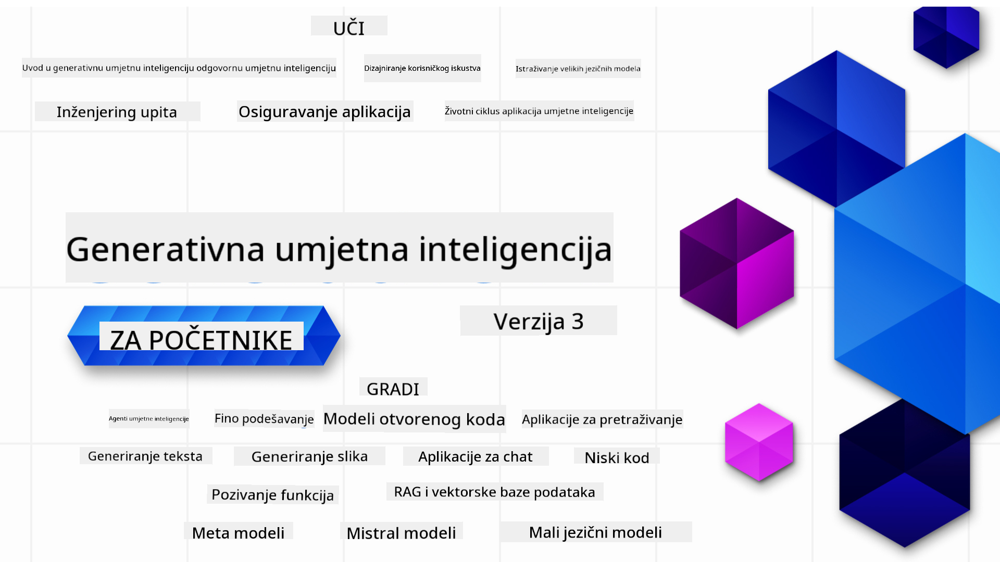

<!--
CO_OP_TRANSLATOR_METADATA:
{
  "original_hash": "c2ee25895ebbfa1a52868bb6eab686fc",
  "translation_date": "2025-05-19T12:06:15+00:00",
  "source_file": "README.md",
  "language_code": "hr"
}
-->

### 21 lekcija koje vas uče svemu što trebate znati kako biste počeli graditi aplikacije za generativnu AI

### 🌐 Podrška za više jezika

#### Podržano putem GitHub Action (Automatizirano i uvijek ažurirano)
[Francuski](../fr/README.md) | [Španjolski](../es/README.md) | [Njemački](../de/README.md) | [Ruski](../ru/README.md) | [Arapski](../ar/README.md) | [Perzijski (Farsi)](../fa/README.md) | [Urdu](../ur/README.md) | [Kineski (pojednostavljeni)](../zh/README.md) | [Kineski (tradicionalni, Makao)](../mo/README.md) | [Kineski (tradicionalni, Hong Kong)](../hk/README.md) | [Kineski (tradicionalni, Tajvan)](../tw/README.md) | [Japanski](../ja/README.md) | [Korejski](../ko/README.md) | [Hindski](../hi/README.md) | [Bengalski](../bn/README.md) | [Marathi](../mr/README.md) | [Nepalski](../ne/README.md) | [Pandžapski (Gurmukhi)](../pa/README.md) | [Portugalski (Portugal)](../pt/README.md) | [Portugalski (Brazil)](../br/README.md) | [Talijanski](../it/README.md) | [Poljski](../pl/README.md) | [Turski](../tr/README.md) | [Grčki](../el/README.md) | [Tajlandski](../th/README.md) | [Švedski](../sv/README.md) | [Danski](../da/README.md) | [Norveški](../no/README.md) | [Finski](../fi/README.md) | [Nizozemski](../nl/README.md) | [Hebrejski](../he/README.md) | [Vijetnamski](../vi/README.md) | [Indonezijski](../id/README.md) | [Malajski](../ms/README.md) | [Tagalog (Filipino)](../tl/README.md) | [Svahili](../sw/README.md) | [Mađarski](../hu/README.md) | [Češki](../cs/README.md) | [Slovački](../sk/README.md) | [Rumunjski](../ro/README.md) | [Bugarski](../bg/README.md) | [Srpski (ćirilica)](../sr/README.md) | [Hrvatski](./README.md) | [Slovenski](../sl/README.md)
# Generativna AI za početnike (Verzija 3) - Tečaj

Naučite osnove izgradnje aplikacija generativne AI uz naš sveobuhvatan tečaj od 21 lekcije kojeg su pripremili Microsoft Cloud Advocates.

## 🌱 Početak

Ovaj tečaj ima 21 lekciju. Svaka lekcija pokriva svoju temu, pa možete početi gdje god želite!

Lekcije su označene kao "Nauči" lekcije koje objašnjavaju koncept generativne AI ili "Izgradi" lekcije koje objašnjavaju koncept i primjere koda u **Pythonu** i **TypeScriptu** kad je to moguće.

Za .NET programere pogledajte [Generativna AI za početnike (.NET izdanje)](https://github.com/microsoft/Generative-AI-for-beginners-dotnet?WT.mc_id=academic-105485-koreyst)!

Svaka lekcija također uključuje sekciju "Nastavite učiti" s dodatnim alatima za učenje.

## Što Vam je Potrebno
### Da biste pokrenuli kod ovog tečaja, možete koristiti:
 - [Azure OpenAI Service](https://aka.ms/genai-beginners/azure-open-ai?WT.mc_id=academic-105485-koreyst) - **Lekcije:** "aoai-assignment"
 - [GitHub Marketplace Model Catalog](https://aka.ms/genai-beginners/gh-models?WT.mc_id=academic-105485-koreyst) - **Lekcije:** "githubmodels"
 - [OpenAI API](https://aka.ms/genai-beginners/open-ai?WT.mc_id=academic-105485-koreyst) - **Lekcije:** "oai-assignment" 

- Osnovno znanje o Pythonu ili TypeScriptu je korisno - \*Za apsolutne početnike pogledajte ove tečajeve [Python](https://aka.ms/genai-beginners/python?WT.mc_id=academic-105485-koreyst) i [TypeScript](https://aka.ms/genai-beginners/typescript?WT.mc_id=academic-105485-koreyst)
- GitHub račun za [fork cijelog ovog repozitorija](https://aka.ms/genai-beginners/github?WT.mc_id=academic-105485-koreyst) na svoj GitHub račun

Napravili smo lekciju **[Postavljanje Tečaja](./00-course-setup/README.md?WT.mc_id=academic-105485-koreyst)** da vam pomognemo u postavljanju vašeg razvojnog okruženja.

Ne zaboravite [dodati zvjezdicu (🌟) ovom repozitoriju](https://docs.github.com/en/get-started/exploring-projects-on-github/saving-repositories-with-stars?WT.mc_id=academic-105485-koreyst) kako biste ga lakše pronašli kasnije.

## 🧠 Spremni za implementaciju?

Ako tražite naprednije primjere koda, pogledajte našu [kolekciju generativnih AI uzoraka koda](https://aka.ms/genai-beg-code?WT.mc_id=academic-105485-koreyst) u **Pythonu** i **TypeScriptu**.

## 🗣️ Upoznajte Druge Polaznike, Dobijte Podršku

Pridružite se našem [službenom Azure AI Foundry Discord serveru](https://aka.ms/genai-discord?WT.mc_id=academic-105485-koreyst) da upoznate i povežete se s drugim polaznicima koji pohađaju ovaj tečaj i dobijete podršku.

Postavite pitanja ili podijelite povratne informacije o proizvodu na našem [Azure AI Foundry Developer Forumu](https://aka.ms/azureaifoundry/forum) na Githubu.

## 🚀 Gradite Startup?

Prijavite se za [Microsoft za Startups Founders Hub](https://aka.ms/genai-foundershub?WT.mc_id=academic-105485-koreyst) kako biste dobili **besplatne OpenAI kredite** i do **$150k za Azure kredite za pristup OpenAI modelima putem Azure OpenAI usluga**.

## 🙏 Želite pomoći?

Imate prijedloge ili ste pronašli pravopisne ili kodne greške? [Podignite problem](https://github.com/microsoft/generative-ai-for-beginners/issues?WT.mc_id=academic-105485-koreyst) ili [Napravite pull request](https://github.com/microsoft/generative-ai-for-beginners/pulls?WT.mc_id=academic-105485-koreyst)

## 📂 Svaka lekcija uključuje:

- Kratki video uvod u temu
- Pisanu lekciju smještenu u README
- Python i TypeScript primjere koda koji podržavaju Azure OpenAI i OpenAI API
- Linkove na dodatne resurse za nastavak učenja

## 🗃️ Lekcije

| #   | **Link Lekcije**                                                                                                                              | **Opis**                                                                                         | **Video**                                                                   | **Dodatno Učenje**                                                             |
| --- | -------------------------------------------------------------------------------------------------------------------------------------------- | ----------------------------------------------------------------------------------------------- | --------------------------------------------------------------------------- | ------------------------------------------------------------------------------ |
| 00  | [Postavljanje Tečaja](./00-course-setup/README.md?WT.mc_id=academic-105485-koreyst)                                                           | **Nauči:** Kako postaviti svoje razvojno okruženje                                              | Video dolazi uskoro                                                             | [Saznaj Više](https://aka.ms/genai-collection?WT.mc_id=academic-105485-koreyst) |
| 01  | [Uvod u Generativnu AI i LLMs](./01-introduction-to-genai/README.md?WT.mc_id=academic-105485-koreyst)                                        | **Nauči:** Razumijevanje što je generativna AI i kako rade Veliki Jezični Modeli (LLMs).         | [Video](https://aka.ms/gen-ai-lesson-1-gh?WT.mc_id=academic-105485-koreyst) | [Saznaj Više](https://aka.ms/genai-collection?WT.mc_id=academic-105485-koreyst) |
| 02  | [Istraživanje i usporedba različitih LLMs](./02-exploring-and-comparing-different-llms/README.md?WT.mc_id=academic-105485-koreyst)           | **Nauči:** Kako odabrati pravi model za svoju primjenu                                          | [Video](https://aka.ms/gen-ai-lesson2-gh?WT.mc_id=academic-105485-koreyst)  | [Saznaj Više](https://aka.ms/genai-collection?WT.mc_id=academic-105485-koreyst) |
| 03  | [Korištenje Generativne AI Odgovorno](./03-using-generative-ai-responsibly/README.md?WT.mc_id=academic-105485-koreyst)                        | **Nauči:** Kako odgovorno izgraditi aplikacije generativne AI                                   | [Video](https://aka.ms/gen-ai-lesson3-gh?WT.mc_id=academic-105485-koreyst)  | [Saznaj Više](https://aka.ms/genai-collection?WT.mc_id=academic-105485-koreyst) |
| 04  | [Razumijevanje Osnova Inženjeringa Prompta](./04-prompt-engineering-fundamentals/README.md?WT.mc_id=academic-105485-koreyst)                  | **Nauči:** Praktične najbolje prakse inženjeringa prompta                                       | [Video](https://aka.ms/gen-ai-lesson4-gh?WT.mc_id=academic-105485-koreyst)  | [Saznaj Više](https://aka.ms/genai-collection?WT.mc_id=academic-105485-koreyst) |
| 05  | [Stvaranje naprednih upita](./05-advanced-prompts/README.md?WT.mc_id=academic-105485-koreyst)                                                | **Naučite:** Kako primijeniti tehnike oblikovanja upita koje poboljšavaju rezultate vaših upita. | [Video](https://aka.ms/gen-ai-lesson5-gh?WT.mc_id=academic-105485-koreyst)  | [Saznajte više](https://aka.ms/genai-collection?WT.mc_id=academic-105485-koreyst) |
| 06  | [Izgradnja aplikacija za generiranje teksta](./06-text-generation-apps/README.md?WT.mc_id=academic-105485-koreyst)                                | **Izgradite:** Aplikaciju za generiranje teksta koristeći Azure OpenAI / OpenAI API                                | [Video](https://aka.ms/gen-ai-lesson6-gh?WT.mc_id=academic-105485-koreyst)  | [Saznajte više](https://aka.ms/genai-collection?WT.mc_id=academic-105485-koreyst) |
| 07  | [Izgradnja chat aplikacija](./07-building-chat-applications/README.md?WT.mc_id=academic-105485-koreyst)                                     | **Izgradite:** Tehnike za učinkovitu izgradnju i integraciju chat aplikacija.               | [Video](https://aka.ms/gen-ai-lessons7-gh?WT.mc_id=academic-105485-koreyst) | [Saznajte više](https://aka.ms/genai-collection?WT.mc_id=academic-105485-koreyst) |
| 08  | [Izgradnja aplikacija za pretraživanje vektorskih baza podataka](./08-building-search-applications/README.md?WT.mc_id=academic-105485-koreyst)                        | **Izgradite:** Aplikaciju za pretraživanje koja koristi ugrađivanja za pretraživanje podataka.                        | [Video](https://aka.ms/gen-ai-lesson8-gh?WT.mc_id=academic-105485-koreyst)  | [Saznajte više](https://aka.ms/genai-collection?WT.mc_id=academic-105485-koreyst) |
| 09  | [Izgradnja aplikacija za generiranje slika](./09-building-image-applications/README.md?WT.mc_id=academic-105485-koreyst)                        | **Izgradite:** Aplikaciju za generiranje slika                                                       | [Video](https://aka.ms/gen-ai-lesson9-gh?WT.mc_id=academic-105485-koreyst)  | [Saznajte više](https://aka.ms/genai-collection?WT.mc_id=academic-105485-koreyst) |
| 10  | [Izgradnja AI aplikacija s malo koda](./10-building-low-code-ai-applications/README.md?WT.mc_id=academic-105485-koreyst)                       | **Izgradite:** Generativnu AI aplikaciju koristeći alate s malo koda                                     | [Video](https://aka.ms/gen-ai-lesson10-gh?WT.mc_id=academic-105485-koreyst) | [Saznajte više](https://aka.ms/genai-collection?WT.mc_id=academic-105485-koreyst) |
| 11  | [Integracija vanjskih aplikacija s pozivanjem funkcija](./11-integrating-with-function-calling/README.md?WT.mc_id=academic-105485-koreyst) | **Izgradite:** Što je pozivanje funkcija i kako se koristi u aplikacijama                          | [Video](https://aka.ms/gen-ai-lesson11-gh?WT.mc_id=academic-105485-koreyst) | [Saznajte više](https://aka.ms/genai-collection?WT.mc_id=academic-105485-koreyst) |
| 12  | [Dizajniranje UX-a za AI aplikacije](./12-designing-ux-for-ai-applications/README.md?WT.mc_id=academic-105485-koreyst)                         | **Naučite:** Kako primijeniti principe dizajna UX-a pri razvoju generativnih AI aplikacija         | [Video](https://aka.ms/gen-ai-lesson12-gh?WT.mc_id=academic-105485-koreyst) | [Saznajte više](https://aka.ms/genai-collection?WT.mc_id=academic-105485-koreyst) |
| 13  | [Osiguranje vaših generativnih AI aplikacija](./13-securing-ai-applications/README.md?WT.mc_id=academic-105485-koreyst)                         | **Naučite:** Prijetnje i rizike za AI sustave te metode za osiguranje tih sustava.             | [Video](https://aka.ms/gen-ai-lesson13-gh?WT.mc_id=academic-105485-koreyst) | [Saznajte više](https://aka.ms/genai-collection?WT.mc_id=academic-105485-koreyst) |
| 14  | [Životni ciklus generativne AI aplikacije](./14-the-generative-ai-application-lifecycle/README.md?WT.mc_id=academic-105485-koreyst)           | **Naučite:** Alate i metrike za upravljanje životnim ciklusom LLM-a i LLMOps                         | [Video](https://aka.ms/gen-ai-lesson14-gh?WT.mc_id=academic-105485-koreyst) | [Saznajte više](https://aka.ms/genai-collection?WT.mc_id=academic-105485-koreyst) |
| 15  | [Retrieval Augmented Generation (RAG) i vektorske baze podataka](./15-rag-and-vector-databases/README.md?WT.mc_id=academic-105485-koreyst)        | **Izgradnja:** Aplikacija koristeći RAG okvir za dohvaćanje ugrađenih podataka iz vektorskih baza podataka  | [Video](https://aka.ms/gen-ai-lesson15-gh?WT.mc_id=academic-105485-koreyst) | [Saznaj više](https://aka.ms/genai-collection?WT.mc_id=academic-105485-koreyst) |
| 16  | [Modeli otvorenog koda i Hugging Face](./16-open-source-models/README.md?WT.mc_id=academic-105485-koreyst)                                    | **Izgradnja:** Aplikacija koristeći modele otvorenog koda dostupne na Hugging Face                    | [Video](https://aka.ms/gen-ai-lesson16-gh?WT.mc_id=academic-105485-koreyst) | [Saznaj više](https://aka.ms/genai-collection?WT.mc_id=academic-105485-koreyst) |
| 17  | [AI agenti](./17-ai-agents/README.md?WT.mc_id=academic-105485-koreyst)                                                                       | **Izgradnja:** Aplikacija koristeći okvir AI agenta                                           | [Video](https://aka.ms/gen-ai-lesson17-gh?WT.mc_id=academic-105485-koreyst) | [Saznaj više](https://aka.ms/genai-collection?WT.mc_id=academic-105485-koreyst) |
| 18  | [Fino podešavanje LLM-ova](./18-fine-tuning/README.md?WT.mc_id=academic-105485-koreyst)                                                              | **Nauči:** Što, zašto i kako fino podesiti LLM-ove                                            | [Video](https://aka.ms/gen-ai-lesson18-gh?WT.mc_id=academic-105485-koreyst) | [Saznaj više](https://aka.ms/genai-collection?WT.mc_id=academic-105485-koreyst) |
| 19  | [Izgradnja s SLM-ovima](./19-slm/README.md?WT.mc_id=academic-105485-koreyst)                                                              | **Nauči:** Prednosti izgradnje s malim jezičnim modelima                                            | Video uskoro | [Saznaj više](https://aka.ms/genai-collection?WT.mc_id=academic-105485-koreyst) |
| 20  | [Izgradnja s Mistral modelima](./20-mistral/README.md?WT.mc_id=academic-105485-koreyst)                                                              | **Nauči:** Značajke i razlike modela obitelji Mistral                                           | Video uskoro | [Saznaj više](https://aka.ms/genai-collection?WT.mc_id=academic-105485-koreyst) |
| 21  | [Izgradnja s Meta modelima](./21-meta/README.md?WT.mc_id=academic-105485-koreyst)                                                              | **Nauči:** Značajke i razlike modela obitelji Meta                                           | Video uskoro | [Saznaj više](https://aka.ms/genai-collection?WT.mc_id=academic-105485-koreyst) |

### 🌟 Posebna zahvala

Posebna zahvala [**Johnu Azizu**](https://www.linkedin.com/in/john0isaac/) za kreiranje svih GitHub akcija i tijekova rada.

[**Bernhardu Merkleu**](https://www.linkedin.com/in/bernhard-merkle-738b73/) za ključne doprinose svakoj lekciji kako bi se poboljšalo iskustvo učenika i kodiranja.

## 🎒 Ostali tečajevi

Naš tim proizvodi i druge tečajeve! Pogledajte:

- [**NOVO** AI agenti za početnike](https://github.com/microsoft/ai-agents-for-beginners?WT.mc_id=academic-105485-koreyst)
- [**NOVO** Generativni AI za početnike koristeći .NET](https://github.com/microsoft/Generative-AI-for-beginners-dotnet?WT.mc_id=academic-105485-koreyst)
- [**NOVO** Generativni AI za početnike koristeći JavaScript](https://aka.ms/genai-js-course?WT.mc_id=academic-105485-koreyst)
- [ML za početnike](https://aka.ms/ml-beginners?WT.mc_id=academic-105485-koreyst)
- [Data Science za početnike](https://aka.ms/datascience-beginners?WT.mc_id=academic-105485-koreyst)
- [AI za početnike](https://aka.ms/ai-beginners?WT.mc_id=academic-105485-koreyst)
- [Kibernetička sigurnost za početnike](https://github.com/microsoft/Security-101??WT.mc_id=academic-96948-sayoung)
- [Web razvoj za početnike](https://aka.ms/webdev-beginners?WT.mc_id=academic-105485-koreyst)
- [IoT za početnike](https://aka.ms/iot-beginners?WT.mc_id=academic-105485-koreyst)
- [XR razvoj za početnike](https://github.com/microsoft/xr-development-for-beginners?WT.mc_id=academic-105485-koreyst)
- [Ovladavanje GitHub Copilotom za AI parno programiranje](https://aka.ms/GitHubCopilotAI?WT.mc_id=academic-105485-koreyst)
- [Ovladavanje GitHub Copilotom za C#/.NET programere](https://github.com/microsoft/mastering-github-copilot-for-dotnet-csharp-developers?WT.mc_id=academic-105485-koreyst)
- [Odaberi svoju Copilot avanturu](https://github.com/microsoft/CopilotAdventures?WT.mc_id=academic-105485-koreyst)

**Odricanje odgovornosti**:  
Ovaj dokument je preveden korištenjem AI usluge prevođenja [Co-op Translator](https://github.com/Azure/co-op-translator). Iako težimo točnosti, imajte na umu da automatski prijevodi mogu sadržavati pogreške ili netočnosti. Izvorni dokument na izvornom jeziku treba smatrati mjerodavnim izvorom. Za kritične informacije preporučuje se profesionalni prijevod od strane čovjeka. Ne preuzimamo odgovornost za bilo kakva nesporazume ili pogrešna tumačenja koja proizlaze iz korištenja ovog prijevoda.