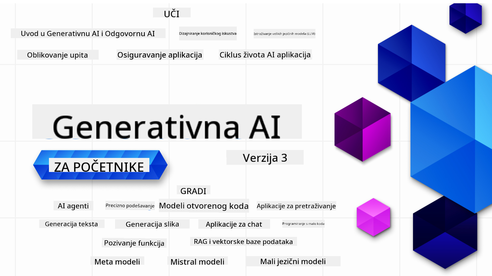

<!--
CO_OP_TRANSLATOR_METADATA:
{
  "original_hash": "6e3f4c8a4f323b8eab1cf11ded304b0f",
  "translation_date": "2025-06-25T08:18:41+00:00",
  "source_file": "README.md",
  "language_code": "hr"
}
-->

### 21 lekcija koje podučavaju sve što trebate znati za početak izrade aplikacija s generativnom umjetnom inteligencijom

### 🌐 Podrška za više jezika

#### Podržano putem GitHub akcije (Automatizirano i uvijek ažurirano)

# Generativna AI za početnike (Verzija 3) - Tečaj

Naučite osnove izrade generativnih AI aplikacija uz naš sveobuhvatan tečaj od 21 lekcije, kojeg su osmislili Microsoft Cloud Advocates.

## 🌱 Početak

Ovaj tečaj ima 21 lekciju. Svaka lekcija pokriva vlastitu temu, tako da možete početi gdje god želite!

Lekcije su označene kao "Learn" lekcije koje objašnjavaju koncept generativne AI ili "Build" lekcije koje objašnjavaju koncept i primjere koda u **Pythonu** i **TypeScriptu** kad god je to moguće.

Za .NET developere pogledajte [Generativna AI za početnike (.NET izdanje)](https://github.com/microsoft/Generative-AI-for-beginners-dotnet?WT.mc_id=academic-105485-koreyst)!

Svaka lekcija također uključuje odjeljak "Keep Learning" s dodatnim alatima za učenje.

## Što vam je potrebno
### Da biste pokrenuli kod ovog tečaja, možete koristiti:
 - [Azure OpenAI Service](https://aka.ms/genai-beginners/azure-open-ai?WT.mc_id=academic-105485-koreyst) - **Lekcije:** "aoai-assignment"
 - [GitHub Marketplace Model Catalog](https://aka.ms/genai-beginners/gh-models?WT.mc_id=academic-105485-koreyst) - **Lekcije:** "githubmodels"
 - [OpenAI API](https://aka.ms/genai-beginners/open-ai?WT.mc_id=academic-105485-koreyst) - **Lekcije:** "oai-assignment" 

- Osnovno znanje Pythona ili TypeScripta je korisno - \*Za apsolutne početnike pogledajte ove tečajeve [Python](https://aka.ms/genai-beginners/python?WT.mc_id=academic-105485-koreyst) i [TypeScript](https://aka.ms/genai-beginners/typescript?WT.mc_id=academic-105485-koreyst)
- GitHub račun za [forkanje ovog cijelog repozitorija](https://aka.ms/genai-beginners/github?WT.mc_id=academic-105485-koreyst) na vaš vlastiti GitHub račun

Napravili smo lekciju **[Postavljanje tečaja](./00-course-setup/README.md?WT.mc_id=academic-105485-koreyst)** da vam pomogne u postavljanju vašeg razvojnog okruženja.

Ne zaboravite [označiti (🌟) ovaj repozitorij](https://docs.github.com/en/get-started/exploring-projects-on-github/saving-repositories-with-stars?WT.mc_id=academic-105485-koreyst) kako biste ga kasnije lakše pronašli.

## 🧠 Spremni za implementaciju?

Ako tražite naprednije primjere koda, pogledajte našu [zbirku generativnih AI uzoraka koda](https://aka.ms/genai-beg-code?WT.mc_id=academic-105485-koreyst) u **Pythonu** i **TypeScriptu**.

## 🗣️ Upoznajte druge učenike, dobijte podršku

Pridružite se našem [službenom Azure AI Foundry Discord serveru](https://aka.ms/genai-discord?WT.mc_id=academic-105485-koreyst) kako biste se povezali i umrežili s drugim učenicima koji pohađaju ovaj tečaj i dobili podršku.

Postavljajte pitanja ili dijelite povratne informacije o proizvodu na našem [Azure AI Foundry Developer Forumu](https://aka.ms/azureaifoundry/forum) na Githubu.

## 🚀 Gradite startup?

Prijavite se za [Microsoft for Startups Founders Hub](https://aka.ms/genai-foundershub?WT.mc_id=academic-105485-koreyst) kako biste dobili **besplatne OpenAI kredite** i do **$150k za Azure kredite za pristup OpenAI modelima putem Azure OpenAI usluga**.

## 🙏 Želite pomoći?

Imate li prijedloge ili ste pronašli pravopisne ili kodne greške? [Postavite problem](https://github.com/microsoft/generative-ai-for-beginners/issues?WT.mc_id=academic-105485-koreyst) ili [Napravite pull request](https://github.com/microsoft/generative-ai-for-beginners/pulls?WT.mc_id=academic-105485-koreyst)

## 📂 Svaka lekcija uključuje:

- Kratki video uvod u temu
- Pisanu lekciju smještenu u README
- Primjere koda u Pythonu i TypeScriptu koji podržavaju Azure OpenAI i OpenAI API
- Linkove na dodatne resurse za nastavak učenja

## 🗃️ Lekcije

| #   | **Link na lekciju**                                                                                                                              | **Opis**                                                                                         | **Video**                                                                   | **Dodatno učenje**                                                             |
| --- | -------------------------------------------------------------------------------------------------------------------------------------------- | ----------------------------------------------------------------------------------------------- | --------------------------------------------------------------------------- | ------------------------------------------------------------------------------ |
| 00  | [Postavljanje tečaja](./00-course-setup/README.md?WT.mc_id=academic-105485-koreyst)                                                                 | **Learn:** Kako postaviti vaše razvojno okruženje                                            | Video uskoro dolazi                                                                 | [Saznajte više](https://aka.ms/genai-collection?WT.mc_id=academic-105485-koreyst) |
| 01  | [Uvod u generativnu AI i LLM](./01-introduction-to-genai/README.md?WT.mc_id=academic-105485-koreyst)                              | **Learn:** Razumijevanje što je generativna AI i kako rade veliki jezični modeli (LLM).       | [Video](https://aka.ms/gen-ai-lesson-1-gh?WT.mc_id=academic-105485-koreyst) | [Saznajte više](https://aka.ms/genai-collection?WT.mc_id=academic-105485-koreyst) |
| 02  | [Istraživanje i usporedba različitih LLM](./02-exploring-and-comparing-different-llms/README.md?WT.mc_id=academic-105485-koreyst)             | **Learn:** Kako odabrati pravi model za vaš slučaj korištenja                                      | [Video](https://aka.ms/gen-ai-lesson2-gh?WT.mc_id=academic-105485-koreyst)  | [Saznajte više](https://aka.ms/genai-collection?WT.mc_id=academic-105485-koreyst) |
| 03  | [Odgovorna uporaba generativne AI](./03-using-generative-ai-responsibly/README.md?WT.mc_id=academic-105485-koreyst)                           | **Learn:** Kako odgovorno graditi generativne AI aplikacije                                  | [Video](https://aka.ms/gen-ai-lesson3-gh?WT.mc_id=academic-105485-koreyst)  | [Saznajte više](https://aka.ms/genai-collection?WT.mc_id=academic-105485-koreyst) |
| 04  | [Razumijevanje osnovnih principa prompt inženjeringa](./04-prompt-engineering-fundamentals/README.md?WT.mc_id=academic-105485-koreyst)             | **Learn:** Praktične najbolje prakse prompt inženjeringa                                           | [Video](https://aka.ms/gen-ai-lesson4-gh?WT.mc_id=academic-105485-koreyst)  | [Saznajte više](https://aka.ms/genai-collection?WT.mc_id=academic-105485-koreyst) |
| 05  | [Stvaranje naprednih upita](./05-advanced-prompts/README.md?WT.mc_id=academic-105485-koreyst)                                                | **Naučite:** Kako primijeniti tehnike oblikovanja upita koje poboljšavaju rezultate vaših upita. | [Video](https://aka.ms/gen-ai-lesson5-gh?WT.mc_id=academic-105485-koreyst)  | [Saznajte više](https://aka.ms/genai-collection?WT.mc_id=academic-105485-koreyst) |
| 06  | [Izrada aplikacija za generiranje teksta](./06-text-generation-apps/README.md?WT.mc_id=academic-105485-koreyst)                                | **Izgradite:** Aplikaciju za generiranje teksta koristeći Azure OpenAI / OpenAI API                                | [Video](https://aka.ms/gen-ai-lesson6-gh?WT.mc_id=academic-105485-koreyst)  | [Saznajte više](https://aka.ms/genai-collection?WT.mc_id=academic-105485-koreyst) |
| 07  | [Izrada chat aplikacija](./07-building-chat-applications/README.md?WT.mc_id=academic-105485-koreyst)                                     | **Izgradite:** Tehnike za učinkovitu izradu i integraciju chat aplikacija.               | [Video](https://aka.ms/gen-ai-lessons7-gh?WT.mc_id=academic-105485-koreyst) | [Saznajte više](https://aka.ms/genai-collection?WT.mc_id=academic-105485-koreyst) |
| 08  | [Izrada aplikacija za pretraživanje s vektorskim bazama podataka](./08-building-search-applications/README.md?WT.mc_id=academic-105485-koreyst)                        | **Izgradite:** Aplikaciju za pretraživanje koja koristi ugrađivanja za pretraživanje podataka.                        | [Video](https://aka.ms/gen-ai-lesson8-gh?WT.mc_id=academic-105485-koreyst)  | [Saznajte više](https://aka.ms/genai-collection?WT.mc_id=academic-105485-koreyst) |
| 09  | [Izrada aplikacija za generiranje slika](./09-building-image-applications/README.md?WT.mc_id=academic-105485-koreyst)                        | **Izgradite:** Aplikaciju za generiranje slika                                                       | [Video](https://aka.ms/gen-ai-lesson9-gh?WT.mc_id=academic-105485-koreyst)  | [Saznajte više](https://aka.ms/genai-collection?WT.mc_id=academic-105485-koreyst) |
| 10  | [Izrada AI aplikacija s malo koda](./10-building-low-code-ai-applications/README.md?WT.mc_id=academic-105485-koreyst)                       | **Izgradite:** Generativnu AI aplikaciju koristeći alate s malo koda                                     | [Video](https://aka.ms/gen-ai-lesson10-gh?WT.mc_id=academic-105485-koreyst) | [Saznajte više](https://aka.ms/genai-collection?WT.mc_id=academic-105485-koreyst) |
| 11  | [Integracija vanjskih aplikacija s pozivima funkcija](./11-integrating-with-function-calling/README.md?WT.mc_id=academic-105485-koreyst) | **Izgradite:** Što je poziv funkcija i njegove upotrebe za aplikacije                          | [Video](https://aka.ms/gen-ai-lesson11-gh?WT.mc_id=academic-105485-koreyst) | [Saznajte više](https://aka.ms/genai-collection?WT.mc_id=academic-105485-koreyst) |
| 12  | [Dizajniranje korisničkog iskustva za AI aplikacije](./12-designing-ux-for-ai-applications/README.md?WT.mc_id=academic-105485-koreyst)                         | **Naučite:** Kako primijeniti principe dizajna korisničkog iskustva pri razvoju generativnih AI aplikacija         | [Video](https://aka.ms/gen-ai-lesson12-gh?WT.mc_id=academic-105485-koreyst) | [Saznajte više](https://aka.ms/genai-collection?WT.mc_id=academic-105485-koreyst) |
| 13  | [Osiguravanje vaših generativnih AI aplikacija](./13-securing-ai-applications/README.md?WT.mc_id=academic-105485-koreyst)                         | **Naučite:** Prijetnje i rizike za AI sustave i metode za osiguravanje tih sustava.             | [Video](https://aka.ms/gen-ai-lesson13-gh?WT.mc_id=academic-105485-koreyst) | [Saznajte više](https://aka.ms/genai-collection?WT.mc_id=academic-105485-koreyst) |
| 14  | [Životni ciklus generativne AI aplikacije](./14-the-generative-ai-application-lifecycle/README.md?WT.mc_id=academic-105485-koreyst)           | **Naučite:** Alate i metrike za upravljanje životnim ciklusom LLM i LLMOps                         | [Video](https://aka.ms/gen-ai-lesson14-gh?WT.mc_id=academic-105485-koreyst) | [Saznajte više](https://aka.ms/genai-collection?WT.mc_id=academic-105485-koreyst) |
| 15  | [Retrieval Augmented Generation (RAG) i vektorske baze podataka](./15-rag-and-vector-databases/README.md?WT.mc_id=academic-105485-koreyst)        | **Izgradnja:** Aplikacija koristeći RAG okvir za dohvaćanje ugradnji iz vektorskih baza podataka  | [Video](https://aka.ms/gen-ai-lesson15-gh?WT.mc_id=academic-105485-koreyst) | [Saznajte više](https://aka.ms/genai-collection?WT.mc_id=academic-105485-koreyst) |
| 16  | [Open Source modeli i Hugging Face](./16-open-source-models/README.md?WT.mc_id=academic-105485-koreyst)                                    | **Izgradnja:** Aplikacija koristeći open source modele dostupne na Hugging Face                    | [Video](https://aka.ms/gen-ai-lesson16-gh?WT.mc_id=academic-105485-koreyst) | [Saznajte više](https://aka.ms/genai-collection?WT.mc_id=academic-105485-koreyst) |
| 17  | [AI agenti](./17-ai-agents/README.md?WT.mc_id=academic-105485-koreyst)                                                                       | **Izgradnja:** Aplikacija koristeći AI Agent Framework                                           | [Video](https://aka.ms/gen-ai-lesson17-gh?WT.mc_id=academic-105485-koreyst) | [Saznajte više](https://aka.ms/genai-collection?WT.mc_id=academic-105485-koreyst) |
| 18  | [Fino podešavanje LLM-ova](./18-fine-tuning/README.md?WT.mc_id=academic-105485-koreyst)                                                              | **Učenje:** Što, zašto i kako fino podešavanje LLM-ova                                            | [Video](https://aka.ms/gen-ai-lesson18-gh?WT.mc_id=academic-105485-koreyst) | [Saznajte više](https://aka.ms/genai-collection?WT.mc_id=academic-105485-koreyst) |
| 19  | [Izgradnja sa SLM-ovima](./19-slm/README.md?WT.mc_id=academic-105485-koreyst)                                                              | **Učenje:** Prednosti izgradnje sa malim jezičnim modelima                                            | Video uskoro | [Saznajte više](https://aka.ms/genai-collection?WT.mc_id=academic-105485-koreyst) |
| 20  | [Izgradnja s Mistral modelima](./20-mistral/README.md?WT.mc_id=academic-105485-koreyst)                                                              | **Učenje:** Značajke i razlike Mistral obiteljskih modela                                           | Video uskoro | [Saznajte više](https://aka.ms/genai-collection?WT.mc_id=academic-105485-koreyst) |
| 21  | [Izgradnja s Meta modelima](./21-meta/README.md?WT.mc_id=academic-105485-koreyst)                                                              | **Učenje:** Značajke i razlike Meta obiteljskih modela                                           | Video uskoro | [Saznajte više](https://aka.ms/genai-collection?WT.mc_id=academic-105485-koreyst) |

### 🌟 Posebna zahvala

Posebna zahvala [**Johnu Azizu**](https://www.linkedin.com/in/john0isaac/) za stvaranje svih GitHub akcija i radnih tokova

[**Bernhardu Merkleu**](https://www.linkedin.com/in/bernhard-merkle-738b73/) za ključne doprinose svakoj lekciji kako bi poboljšao iskustvo učenja i rada s kodom. 

## 🎒 Ostali tečajevi

Naš tim proizvodi i druge tečajeve! Pogledajte:

- [**NOVO** Protokol konteksta modela za početnike](https://github.com/microsoft/mcp-for-beginners?WT.mc_id=academic-105485-koreyst)
- [AI agenti za početnike](https://github.com/microsoft/ai-agents-for-beginners?WT.mc_id=academic-105485-koreyst)
- [Generativna AI za početnike koristeći .NET](https://github.com/microsoft/Generative-AI-for-beginners-dotnet?WT.mc_id=academic-105485-koreyst)
- [Generativna AI za početnike koristeći JavaScript](https://aka.ms/genai-js-course?WT.mc_id=academic-105485-koreyst)
- [ML za početnike](https://aka.ms/ml-beginners?WT.mc_id=academic-105485-koreyst)
- [Znanost o podacima za početnike](https://aka.ms/datascience-beginners?WT.mc_id=academic-105485-koreyst)
- [AI za početnike](https://aka.ms/ai-beginners?WT.mc_id=academic-105485-koreyst)
- [Kibernetička sigurnost za početnike](https://github.com/microsoft/Security-101??WT.mc_id=academic-96948-sayoung)
- [Web razvoj za početnike](https://aka.ms/webdev-beginners?WT.mc_id=academic-105485-koreyst)
- [IoT za početnike](https://aka.ms/iot-beginners?WT.mc_id=academic-105485-koreyst)
- [XR Razvoj za Početnike](https://github.com/microsoft/xr-development-for-beginners?WT.mc_id=academic-105485-koreyst)
- [Savladavanje GitHub Copilot za AI Upareno Programiranje](https://aka.ms/GitHubCopilotAI?WT.mc_id=academic-105485-koreyst)
- [Savladavanje GitHub Copilot za C#/.NET Razvojne Programere](https://github.com/microsoft/mastering-github-copilot-for-dotnet-csharp-developers?WT.mc_id=academic-105485-koreyst)
- [Odaberi Svoju Vlastitu Copilot Avanturu](https://github.com/microsoft/CopilotAdventures?WT.mc_id=academic-105485-koreyst)

**Odricanje odgovornosti**:  
Ovaj dokument je preveden pomoću AI usluge prevođenja [Co-op Translator](https://github.com/Azure/co-op-translator). Iako se trudimo postići točnost, imajte na umu da automatizirani prijevodi mogu sadržavati pogreške ili netočnosti. Izvorni dokument na izvornom jeziku treba smatrati autoritativnim izvorom. Za ključne informacije preporučuje se profesionalni ljudski prijevod. Ne odgovaramo za nesporazume ili pogrešna tumačenja koja proizlaze iz korištenja ovog prijevoda.