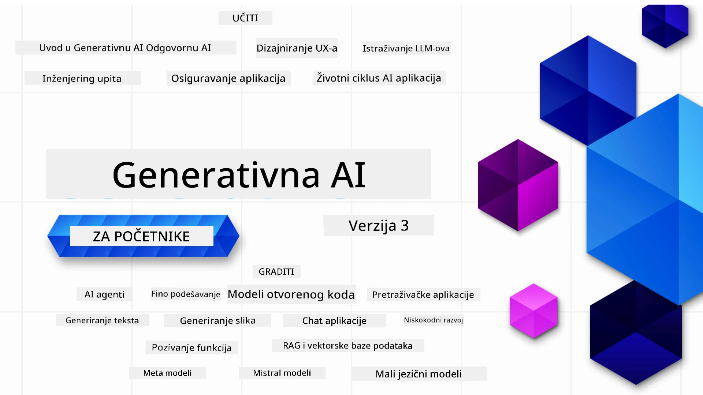

### 21 lekcija koje podučavaju sve što trebate znati za početak izrade Generativnih AI aplikacija

[](https://github.com/microsoft/Generative-AI-For-Beginners/blob/master/LICENSE?WT.mc_id=academic-105485-koreyst)
[](https://GitHub.com/microsoft/Generative-AI-For-Beginners/graphs/contributors/?WT.mc_id=academic-105485-koreyst)
[](https://GitHub.com/microsoft/Generative-AI-For-Beginners/issues/?WT.mc_id=academic-105485-koreyst)
[](https://GitHub.com/microsoft/Generative-AI-For-Beginners/pulls/?WT.mc_id=academic-105485-koreyst)
[](http://makeapullrequest.com?WT.mc_id=academic-105485-koreyst)

[](https://GitHub.com/microsoft/Generative-AI-For-Beginners/watchers/?WT.mc_id=academic-105485-koreyst)
[](https://GitHub.com/microsoft/Generative-AI-For-Beginners/network/?WT.mc_id=academic-105485-koreyst)
[](https://GitHub.com/microsoft/Generative-AI-For-Beginners/stargazers/?WT.mc_id=academic-105485-koreyst)

[](https://discord.gg/nTYy5BXMWG)

### 🌐 Višejezična podrška

#### Podržano putem GitHub akcije (Automatski i uvijek ažurno)

<!-- CO-OP TRANSLATOR LANGUAGES TABLE START -->
[Arapski](../ar/README.md) | [Bengalski](../bn/README.md) | [Bugarski](../bg/README.md) | [Burmanski (Myanmar)](../my/README.md) | [Kineski (pojednostavljeni)](../zh-CN/README.md) | [Kineski (tradicionalni, Hong Kong)](../zh-HK/README.md) | [Kineski (tradicionalni, Makao)](../zh-MO/README.md) | [Kineski (tradicionalni, Tajvan)](../zh-TW/README.md) | [Hrvatski](./README.md) | [Češki](../cs/README.md) | [Danski](../da/README.md) | [Nizozemski](../nl/README.md) | [Estonski](../et/README.md) | [Finski](../fi/README.md) | [Francuski](../fr/README.md) | [Njemački](../de/README.md) | [Grčki](../el/README.md) | [Hebrejski](../he/README.md) | [Hindi](../hi/README.md) | [Mađarski](../hu/README.md) | [Indonezijski](../id/README.md) | [Talijanski](../it/README.md) | [Japanski](../ja/README.md) | [Kannada](../kn/README.md) | [Khmer](../km/README.md) | [Korejski](../ko/README.md) | [Litvanski](../lt/README.md) | [Malajski](../ms/README.md) | [Malajalamski](../ml/README.md) | [Marathi](../mr/README.md) | [Nepalski](../ne/README.md) | [Nigerijski Pidgin](../pcm/README.md) | [Norveški](../no/README.md) | [Perzijski (Farsi)](../fa/README.md) | [Poljski](../pl/README.md) | [Portugalski (Brazil)](../pt-BR/README.md) | [Portugalski (Portugal)](../pt-PT/README.md) | [Panjabi (Gurmukhi)](../pa/README.md) | [Rumunjski](../ro/README.md) | [Ruski](../ru/README.md) | [Srpski (ćirilica)](../sr/README.md) | [Slovački](../sk/README.md) | [Slovenski](../sl/README.md) | [Španjolski](../es/README.md) | [Svahili](../sw/README.md) | [Švedski](../sv/README.md) | [Tagalog (Filipinski)](../tl/README.md) | [Tamilski](../ta/README.md) | [Telugu](../te/README.md) | [Tajlandski](../th/README.md) | [Turski](../tr/README.md) | [Ukrajinski](../uk/README.md) | [Urdu](../ur/README.md) | [Vijetnamski](../vi/README.md)

> **Radije klonirati lokalno?**
>
> Ovaj repozitorij uključuje 50+ prijevoda jezika što značajno povećava veličinu preuzimanja. Za kloniranje bez prijevoda koristite “sparse checkout”:
>
> **Bash / macOS / Linux:**
> ```bash
> git clone --filter=blob:none --sparse https://github.com/microsoft/generative-ai-for-beginners.git
> cd generative-ai-for-beginners
> git sparse-checkout set --no-cone '/*' '!translations' '!translated_images'
> ```
>
> **CMD (Windows):**
> ```cmd
> git clone --filter=blob:none --sparse https://github.com/microsoft/generative-ai-for-beginners.git
> cd generative-ai-for-beginners
> git sparse-checkout set --no-cone "/*" "!translations" "!translated_images"
> ```
>
> Ovo vam daje sve što vam je potrebno za dovršetak tečaja s mnogo bržim preuzimanjem.
<!-- CO-OP TRANSLATOR LANGUAGES TABLE END -->

# Generativna AI za početnike (Verzija 3) - Tečaj

Naučite osnove izgradnje Generativnih AI aplikacija s našim sveobuhvatnim tečajem od 21 lekcije koji su pripremili Microsoft Cloud Advocates.

## 🌱 Početak

Ovaj tečaj ima 21 lekciju. Svaka lekcija pokriva vlastitu temu pa počnite gdje god želite!

Lekcije su označene kao "Nauči" koje objašnjavaju pojam generativne AI ili "Izradi" koje objašnjavaju pojam i primjere koda u **Pythonu** i **TypeScriptu** kada je moguće.

Za .NET programere pogledajte [Generativnu AI za početnike (.NET izdanje)](https://github.com/microsoft/Generative-AI-for-beginners-dotnet?WT.mc_id=academic-105485-koreyst)!

Svaka lekcija također uključuje sekciju "Nastavi učiti" s dodatnim obrazovnim alatima.

## Što vam treba
### Za pokretanje koda iz ovog tečaja možete koristiti bilo što od:
 - [Azure OpenAI Service](https://aka.ms/genai-beginners/azure-open-ai?WT.mc_id=academic-105485-koreyst) - **Lekcije:** "aoai-assignment"
 - [Microsoft Foundry Models](https://ai.azure.com/catalog/models?WT.mc_id=academic-105485-koreyst) - **Lekcije:** "githubmodels" (GitHub Models se ukida krajem srpnja 2026. - koristite Microsoft Foundry Models umjesto toga)
 - [OpenAI API](https://aka.ms/genai-beginners/open-ai?WT.mc_id=academic-105485-koreyst) - **Lekcije:** "oai-assignment" 
 - [Foundry Local](https://foundrylocal.ai?WT.mc_id=academic-105485-koreyst) - Pokrenite modele potpuno offline na vlastitom uređaju, nije potrebna pretplata u oblaku
   
- Osnovno znanje Pythona ili TypeScripta je korisno - \*Za potpune početnike pogledajte ove [Python](https://aka.ms/genai-beginners/python?WT.mc_id=academic-105485-koreyst) i [TypeScript](https://aka.ms/genai-beginners/typescript?WT.mc_id=academic-105485-koreyst) tečajeve
- GitHub račun za [forkanje cijelog repozitorija](https://aka.ms/genai-beginners/github?WT.mc_id=academic-105485-koreyst) na vlastiti GitHub račun

Kreirali smo lekciju **[Postavljanje tečaja](./00-course-setup/README.md?WT.mc_id=academic-105485-koreyst)** koja će vam pomoći u postavljanju vašeg razvojog okruženja.

Ne zaboravite [označiti zvjezdicom (🌟) ovaj repozitorij](https://docs.github.com/en/get-started/exploring-projects-on-github/saving-repositories-with-stars?WT.mc_id=academic-105485-koreyst) da biste ga lakše pronašli kasnije.

## 🧠 Spremni za implementaciju?

Ako tražite naprednije primjere koda, pogledajte našu [kolekciju primjera koda za generativnu AI](https://aka.ms/genai-beg-code?WT.mc_id=academic-105485-koreyst) u **Pythonu** i **TypeScriptu**.

## 🗣️ Upoznajte druge polaznike, dobijte podršku

Pridružite se našem [službenom Microsoft Foundry Discord serveru](https://aka.ms/genai-discord?WT.mc_id=academic-105485-koreyst) da upoznate i povežete se s drugim polaznicima ovog tečaja i dobijete podršku.

Postavite pitanja ili podijelite povratne informacije o proizvodu na našem [Microsoft Foundry Developer Forum](https://aka.ms/azureaifoundry/forum) na Githubu.

## 🚀 Izgradnja startupa?

Posjetite [Microsoft za startupe](https://www.microsoft.com/startups?WT.mc_id=academic-105485-koreyst) da saznate kako započeti izgradnju koristeći Azure kredite već danas.

## 🙏 Želite pomoći?

Imate li prijedloge ili ste pronašli pravopisne ili kodne greške? [Podignite problem](https://github.com/microsoft/generative-ai-for-beginners/issues?WT.mc_id=academic-105485-koreyst) ili [Napravite pull request](https://github.com/microsoft/generative-ai-for-beginners/pulls?WT.mc_id=academic-105485-koreyst)

## 📂 Svaka lekcija sadrži:

- Kratki video uvod u temu
- Pisanu lekciju smještenu u README
- Primjere koda u Pythonu i TypeScriptu koji podržavaju Azure OpenAI i OpenAI API
- Poveznice na dodatne izvore za nastavak učenja

## 🗃️ Lekcije

| #   | **Poveznica na lekciju**                                                                                                                        | **Opis**                                                                                      | **Video**                                                                 | **Dodatno učenje**                                                             |
| --- | ------------------------------------------------------------------------------------------------------------------------------------------------ | ---------------------------------------------------------------------------------------------- | --------------------------------------------------------------------------- | ------------------------------------------------------------------------------ |
| 00  | [Postavljanje tečaja](./00-course-setup/README.md?WT.mc_id=academic-105485-koreyst)                                                                | **Nauči:** Kako postaviti razvojno okruženje                                                 | Video uskoro                                                                  | [Saznaj više](https://aka.ms/genai-collection?WT.mc_id=academic-105485-koreyst) |
| 01  | [Uvod u Generativnu AI i LLM-ove](./01-introduction-to-genai/README.md?WT.mc_id=academic-105485-koreyst)                                           | **Nauči:** Razumijevanje što je generativna AI i kako veliki jezični modeli (LLM) funkcioniraju | [Video](https://aka.ms/gen-ai-lesson-1-gh?WT.mc_id=academic-105485-koreyst) | [Saznaj više](https://aka.ms/genai-collection?WT.mc_id=academic-105485-koreyst) |
| 02  | [Istraživanje i usporedba različitih LLM-ova](./02-exploring-and-comparing-different-llms/README.md?WT.mc_id=academic-105485-koreyst)               | **Nauči:** Kako odabrati pravi model za vaš slučaj uporabe                                  | [Video](https://aka.ms/gen-ai-lesson2-gh?WT.mc_id=academic-105485-koreyst)  | [Saznaj više](https://aka.ms/genai-collection?WT.mc_id=academic-105485-koreyst) |

| 03  | [Odgovorno korištenje Generativne AI](./03-using-generative-ai-responsibly/README.md?WT.mc_id=academic-105485-koreyst)                           | **Nauči:** Kako odgovorno izgraditi Generativne AI aplikacije                                  | [Video](https://aka.ms/gen-ai-lesson3-gh?WT.mc_id=academic-105485-koreyst)  | [Saznaj više](https://aka.ms/genai-collection?WT.mc_id=academic-105485-koreyst) |
| 04  | [Razumijevanje osnova prompt inženjeringa](./04-prompt-engineering-fundamentals/README.md?WT.mc_id=academic-105485-koreyst)             | **Nauči:** Praktične najbolje prakse prompt inženjeringa                                           | [Video](https://aka.ms/gen-ai-lesson4-gh?WT.mc_id=academic-105485-koreyst)  | [Saznaj više](https://aka.ms/genai-collection?WT.mc_id=academic-105485-koreyst) |
| 05  | [Izrada naprednih promptova](./05-advanced-prompts/README.md?WT.mc_id=academic-105485-koreyst)                                                | **Nauči:** Kako primijeniti tehnike prompt inženjeringa koje poboljšavaju rezultate promptova. | [Video](https://aka.ms/gen-ai-lesson5-gh?WT.mc_id=academic-105485-koreyst)  | [Saznaj više](https://aka.ms/genai-collection?WT.mc_id=academic-105485-koreyst) |
| 06  | [Izgradnja aplikacija za generiranje teksta](./06-text-generation-apps/README.md?WT.mc_id=academic-105485-koreyst)                                | **Izgradi:** Aplikaciju za generiranje teksta koristeći Azure OpenAI / OpenAI API                                | [Video](https://aka.ms/gen-ai-lesson6-gh?WT.mc_id=academic-105485-koreyst)  | [Saznaj više](https://aka.ms/genai-collection?WT.mc_id=academic-105485-koreyst) |
| 07  | [Izgradnja chat aplikacija](./07-building-chat-applications/README.md?WT.mc_id=academic-105485-koreyst)                                     | **Izgradi:** Tehnike za učinkovitu izradu i integraciju chat aplikacija.               | [Video](https://aka.ms/gen-ai-lessons7-gh?WT.mc_id=academic-105485-koreyst) | [Saznaj više](https://aka.ms/genai-collection?WT.mc_id=academic-105485-koreyst) |
| 08  | [Izgradnja pretraživačkih aplikacija sa vektorskim bazama podataka](./08-building-search-applications/README.md?WT.mc_id=academic-105485-koreyst)                        | **Izgradi:** Pretraživačku aplikaciju koja koristi ugradnje (Embeddings) za pretraživanje podataka.                        | [Video](https://aka.ms/gen-ai-lesson8-gh?WT.mc_id=academic-105485-koreyst)  | [Saznaj više](https://aka.ms/genai-collection?WT.mc_id=academic-105485-koreyst) |
| 09  | [Izgradnja aplikacija za generiranje slika](./09-building-image-applications/README.md?WT.mc_id=academic-105485-koreyst)                        | **Izgradi:** Aplikaciju za generiranje slika                                                       | [Video](https://aka.ms/gen-ai-lesson9-gh?WT.mc_id=academic-105485-koreyst)  | [Saznaj više](https://aka.ms/genai-collection?WT.mc_id=academic-105485-koreyst) |
| 10  | [Izgradnja AI aplikacija s malim kodom](./10-building-low-code-ai-applications/README.md?WT.mc_id=academic-105485-koreyst)                       | **Izgradi:** Generativnu AI aplikaciju koristeći alate za mali kod                                     | [Video](https://aka.ms/gen-ai-lesson10-gh?WT.mc_id=academic-105485-koreyst) | [Saznaj više](https://aka.ms/genai-collection?WT.mc_id=academic-105485-koreyst) |
| 11  | [Integriranje vanjskih aplikacija pomoću pozivanja funkcija](./11-integrating-with-function-calling/README.md?WT.mc_id=academic-105485-koreyst) | **Izgradi:** Što je pozivanje funkcija i njihova primjena u aplikacijama                          | [Video](https://aka.ms/gen-ai-lesson11-gh?WT.mc_id=academic-105485-koreyst) | [Saznaj više](https://aka.ms/genai-collection?WT.mc_id=academic-105485-koreyst) |
| 12  | [Dizajn UX za AI aplikacije](./12-designing-ux-for-ai-applications/README.md?WT.mc_id=academic-105485-koreyst)                         | **Nauči:** Kako primijeniti principe dizajna korisničkog iskustva pri razvoju Generativnih AI aplikacija         | [Video](https://aka.ms/gen-ai-lesson12-gh?WT.mc_id=academic-105485-koreyst) | [Saznaj više](https://aka.ms/genai-collection?WT.mc_id=academic-105485-koreyst) |
| 13  | [Osiguravanje generativnih AI aplikacija](./13-securing-ai-applications/README.md?WT.mc_id=academic-105485-koreyst)                         | **Nauči:** Prijetnje i rizike za AI sustave te metode za njihovo osiguranje.             | [Video](https://aka.ms/gen-ai-lesson13-gh?WT.mc_id=academic-105485-koreyst) | [Saznaj više](https://aka.ms/genai-collection?WT.mc_id=academic-105485-koreyst) |
| 14  | [Životni ciklus Generativne AI aplikacije](./14-the-generative-ai-application-lifecycle/README.md?WT.mc_id=academic-105485-koreyst)           | **Nauči:** Alate i metrike za upravljanje životnim ciklusom LLM-a i LLMOps                         | [Video](https://aka.ms/gen-ai-lesson14-gh?WT.mc_id=academic-105485-koreyst) | [Saznaj više](https://aka.ms/genai-collection?WT.mc_id=academic-105485-koreyst) |
| 15  | [Retrieval Augmented Generation (RAG) i vektorske baze podataka](./15-rag-and-vector-databases/README.md?WT.mc_id=academic-105485-koreyst)        | **Izgradi:** Aplikaciju koristeći RAG okvir za dohvat ugradnji (embeddings) iz vektorskih baza podataka  | [Video](https://aka.ms/gen-ai-lesson15-gh?WT.mc_id=academic-105485-koreyst) | [Saznaj više](https://aka.ms/genai-collection?WT.mc_id=academic-105485-koreyst) |
| 16  | [Modeli otvorenog koda i Hugging Face](./16-open-source-models/README.md?WT.mc_id=academic-105485-koreyst)                                    | **Izgradi:** Aplikaciju koristeći modele otvorenog koda dostupne na Hugging Face                    | [Video](https://aka.ms/gen-ai-lesson16-gh?WT.mc_id=academic-105485-koreyst) | [Saznaj više](https://aka.ms/genai-collection?WT.mc_id=academic-105485-koreyst) |
| 17  | [AI agenti](./17-ai-agents/README.md?WT.mc_id=academic-105485-koreyst)                                                                       | **Izgradi:** Aplikaciju koristeći AI Agent Framework                                           | [Video](https://aka.ms/gen-ai-lesson17-gh?WT.mc_id=academic-105485-koreyst) | [Saznaj više](https://aka.ms/genai-collection?WT.mc_id=academic-105485-koreyst) |
| 18  | [Fino podešavanje LLM-ova](./18-fine-tuning/README.md?WT.mc_id=academic-105485-koreyst)                                                              | **Nauči:** Što, zašto i kako fino podešavati LLM-ove                                            | [Video](https://aka.ms/gen-ai-lesson18-gh?WT.mc_id=academic-105485-koreyst) | [Saznaj više](https://aka.ms/genai-collection?WT.mc_id=academic-105485-koreyst) |
| 19  | [Izgradnja sa SLM-ovima](./19-slm/README.md?WT.mc_id=academic-105485-koreyst)                                                              | **Nauči:** Prednosti izgradnje sa Small Language Models                                            | Video uskoro | [Saznaj više](https://aka.ms/genai-collection?WT.mc_id=academic-105485-koreyst) |
| 20  | [Izgradnja sa Mistral modelima](./20-mistral/README.md?WT.mc_id=academic-105485-koreyst)                                                              | **Nauči:** Značajke i razlike Mistral obitelji modela                                           | Video uskoro | [Saznaj više](https://aka.ms/genai-collection?WT.mc_id=academic-105485-koreyst) |
| 21  | [Izgradnja sa Meta modelima](./21-meta/README.md?WT.mc_id=academic-105485-koreyst)                                                              | **Nauči:** Značajke i razlike Meta obitelji modela                                           | Video uskoro | [Saznaj više](https://aka.ms/genai-collection?WT.mc_id=academic-105485-koreyst) |

### 🌟 Posebna zahvala

Posebna zahvala [**Johnu Azizu**](https://www.linkedin.com/in/john0isaac/) za kreiranje svih GitHub Actions i tijekova rada

[**Bernhardu Merkleru**](https://www.linkedin.com/in/bernhard-merkle-738b73/) za ključne doprinose svakoj lekciji u cilju unaprjeđenja iskustva učenika i rada s kodom. 

## 🎒 Ostali tečajevi

Naš tim proizvodi i druge tečajeve! Pogledajte:

<!-- CO-OP TRANSLATOR OTHER COURSES START -->
### LangChain
[](https://aka.ms/langchain4j-for-beginners)
[](https://aka.ms/langchainjs-for-beginners?WT.mc_id=m365-94501-dwahlin)
[](https://github.com/microsoft/langchain-for-beginners?WT.mc_id=m365-94501-dwahlin)
---

### Azure / Edge / MCP / Agenti
[](https://github.com/microsoft/AZD-for-beginners?WT.mc_id=academic-105485-koreyst)
[](https://github.com/microsoft/edgeai-for-beginners?WT.mc_id=academic-105485-koreyst)
[](https://github.com/microsoft/mcp-for-beginners?WT.mc_id=academic-105485-koreyst)
[](https://github.com/microsoft/ai-agents-for-beginners?WT.mc_id=academic-105485-koreyst)

---
 
### Serija Generativne AI
[](https://github.com/microsoft/generative-ai-for-beginners?WT.mc_id=academic-105485-koreyst)
[-9333EA?style=for-the-badge&labelColor=E5E7EB&color=9333EA)](https://github.com/microsoft/Generative-AI-for-beginners-dotnet?WT.mc_id=academic-105485-koreyst)

[-C084FC?style=for-the-badge&labelColor=E5E7EB&color=C084FC)](https://github.com/microsoft/generative-ai-for-beginners-java?WT.mc_id=academic-105485-koreyst)
[-E879F9?style=for-the-badge&labelColor=E5E7EB&color=E879F9)](https://github.com/microsoft/generative-ai-with-javascript?WT.mc_id=academic-105485-koreyst)

---
 
### Osnove učenja
[](https://aka.ms/ml-beginners?WT.mc_id=academic-105485-koreyst)
[](https://aka.ms/datascience-beginners?WT.mc_id=academic-105485-koreyst)
[](https://aka.ms/ai-beginners?WT.mc_id=academic-105485-koreyst)
[](https://github.com/microsoft/Security-101?WT.mc_id=academic-96948-sayoung)
[](https://aka.ms/webdev-beginners?WT.mc_id=academic-105485-koreyst)
[](https://aka.ms/iot-beginners?WT.mc_id=academic-105485-koreyst)
[](https://github.com/microsoft/xr-development-for-beginners?WT.mc_id=academic-105485-koreyst)

---
 
### Copilot serija
[](https://aka.ms/GitHubCopilotAI?WT.mc_id=academic-105485-koreyst)
[](https://github.com/microsoft/mastering-github-copilot-for-dotnet-csharp-developers?WT.mc_id=academic-105485-koreyst)
[](https://github.com/microsoft/CopilotAdventures?WT.mc_id=academic-105485-koreyst)
<!-- CO-OP TRANSLATOR OTHER COURSES END -->

## Dobivanje pomoći

Ako zapnete ili imate pitanja o izradi AI aplikacija. Pridružite se ostalim učenicima i iskusnim programerima u raspravama o MCP-u. To je podržavajuća zajednica gdje su pitanja dobrodošla i znanje se slobodno dijeli.

[](https://discord.gg/nTYy5BXMWG)

Ako imate povratne informacije o proizvodu ili greške tijekom izrade, posjetite:

[](https://aka.ms/foundry/forum)

---

<!-- CO-OP TRANSLATOR DISCLAIMER START -->
**Napomena**:
Ovaj dokument je preveden korištenjem AI prevoditeljskog servisa [Co-op Translator](https://github.com/Azure/co-op-translator). Iako težimo točnosti, imajte na umu da automatski prijevodi mogu sadržavati greške ili netočnosti. Izvorni dokument na izvornom jeziku treba smatrati autoritativnim izvorom. Za važne informacije preporuča se profesionalni ljudski prijevod. Nismo odgovorni za bilo kakva nesporazumevanja ili pogrešne interpretacije koje proizlaze iz korištenja ovog prijevoda.
<!-- CO-OP TRANSLATOR DISCLAIMER END -->