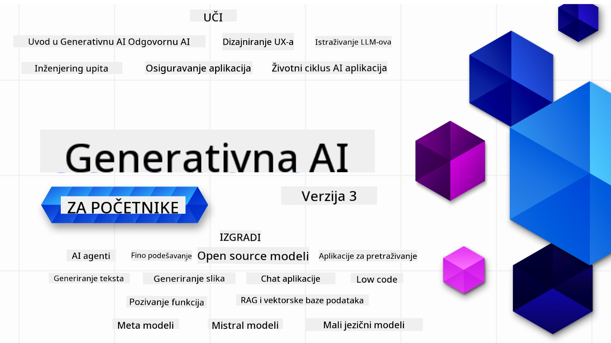

<!--
CO_OP_TRANSLATOR_METADATA:
{
  "original_hash": "3371380dfb4e3ac288036c36fff84eeb",
  "translation_date": "2025-08-25T12:10:50+00:00",
  "source_file": "README.md",
  "language_code": "hr"
}
-->

### 21 lekcija koje vas uče svemu što trebate znati za početak izrade generativnih AI aplikacija

### 🌐 Podrška za više jezika

#### Podržano putem GitHub Action (Automatizirano i uvijek ažurno)

[French](../fr/README.md) | [Spanish](../es/README.md) | [German](../de/README.md) | [Russian](../ru/README.md) | [Arabic](../ar/README.md) | [Persian (Farsi)](../fa/README.md) | [Urdu](../ur/README.md) | [Chinese (Simplified)](../zh/README.md) | [Chinese (Traditional, Macau)](../mo/README.md) | [Chinese (Traditional, Hong Kong)](../hk/README.md) | [Chinese (Traditional, Taiwan)](../tw/README.md) | [Japanese](../ja/README.md) | [Korean](../ko/README.md) | [Hindi](../hi/README.md) | [Bengali](../bn/README.md) | [Marathi](../mr/README.md) | [Nepali](../ne/README.md) | [Punjabi (Gurmukhi)](../pa/README.md) | [Portuguese (Portugal)](../pt/README.md) | [Portuguese (Brazil)](../br/README.md) | [Italian](../it/README.md) | [Lithuanian](../lt/README.md) | [Polish](../pl/README.md) | [Turkish](../tr/README.md) | [Greek](../el/README.md) | [Thai](../th/README.md) | [Swedish](../sv/README.md) | [Danish](../da/README.md) | [Norwegian](../no/README.md) | [Finnish](../fi/README.md) | [Dutch](../nl/README.md) | [Hebrew](../he/README.md) | [Vietnamese](../vi/README.md) | [Indonesian](../id/README.md) | [Malay](../ms/README.md) | [Tagalog (Filipino)](../tl/README.md) | [Swahili](../sw/README.md) | [Hungarian](../hu/README.md) | [Czech](../cs/README.md) | [Slovak](../sk/README.md) | [Romanian](../ro/README.md) | [Bulgarian](../bg/README.md) | [Serbian (Cyrillic)](../sr/README.md) | [Croatian](./README.md) | [Slovenian](../sl/README.md) | [Ukrainian](../uk/README.md) | [Burmese (Myanmar)](../my/README.md)

# Generativna AI za početnike (Verzija 3) - Tečaj

Naučite osnove izrade generativnih AI aplikacija kroz naš sveobuhvatni tečaj od 21 lekcije koji su pripremili Microsoft Cloud Advocates.

## 🌱 Početak

Ovaj tečaj sadrži 21 lekciju. Svaka lekcija obrađuje svoju temu pa možete započeti gdje god želite!

Lekcije su označene kao "Learn" lekcije koje objašnjavaju generativne AI koncepte ili "Build" lekcije koje uz objašnjenje donose i primjere koda u **Pythonu** i **TypeScriptu** kad god je to moguće.

Za .NET developere pogledajte [Generative AI for Beginners (.NET Edition)](https://github.com/microsoft/Generative-AI-for-beginners-dotnet?WT.mc_id=academic-105485-koreyst)!

Svaka lekcija ima i dio "Keep Learning" s dodatnim alatima za učenje.

## Što vam treba
### Za pokretanje koda iz ovog tečaja možete koristiti:
 - [Azure OpenAI Service](https://aka.ms/genai-beginners/azure-open-ai?WT.mc_id=academic-105485-koreyst) - **Lekcije:** "aoai-assignment"
 - [GitHub Marketplace Model Catalog](https://aka.ms/genai-beginners/gh-models?WT.mc_id=academic-105485-koreyst) - **Lekcije:** "githubmodels"
 - [OpenAI API](https://aka.ms/genai-beginners/open-ai?WT.mc_id=academic-105485-koreyst) - **Lekcije:** "oai-assignment" 
   
- Osnovno znanje Pythona ili TypeScripta je korisno - \*Za potpune početnike preporučujemo ove tečajeve za [Python](https://aka.ms/genai-beginners/python?WT.mc_id=academic-105485-koreyst) i [TypeScript](https://aka.ms/genai-beginners/typescript?WT.mc_id=academic-105485-koreyst)
- GitHub račun za [forkanje ovog repozitorija](https://aka.ms/genai-beginners/github?WT.mc_id=academic-105485-koreyst) na svoj GitHub račun

Pripremili smo lekciju **[Course Setup](./00-course-setup/README.md?WT.mc_id=academic-105485-koreyst)** koja će vam pomoći oko postavljanja razvojnog okruženja.

Ne zaboravite [označiti repo zvjezdicom (🌟)](https://docs.github.com/en/get-started/exploring-projects-on-github/saving-repositories-with-stars?WT.mc_id=academic-105485-koreyst) kako biste ga lakše pronašli kasnije.

## 🧠 Spremni za implementaciju?

Ako tražite naprednije primjere koda, pogledajte našu [kolekciju generativnih AI primjera koda](https://aka.ms/genai-beg-code?WT.mc_id=academic-105485-koreyst) u **Pythonu** i **TypeScriptu**.

## 🗣️ Upoznajte druge polaznike, zatražite podršku

Pridružite se našem [službenom Azure AI Foundry Discord serveru](https://aka.ms/genai-discord?WT.mc_id=academic-105485-koreyst) kako biste upoznali i povezali se s drugim polaznicima tečaja i dobili podršku.

Postavite pitanja ili podijelite povratne informacije o proizvodu na našem [Azure AI Foundry Developer Forumu](https://aka.ms/azureaifoundry/forum) na Githubu.

## 🚀 Pokrećete startup?

Posjetite [Microsoft for Startups](https://www.microsoft.com/startups) i saznajte kako danas započeti razvoj uz Azure kredite.

## 🙏 Želite pomoći?

Imate prijedloge ili ste pronašli greške u pisanju ili kodu? [Prijavite problem](https://github.com/microsoft/generative-ai-for-beginners/issues?WT.mc_id=academic-105485-koreyst) ili [kreirajte pull request](https://github.com/microsoft/generative-ai-for-beginners/pulls?WT.mc_id=academic-105485-koreyst)

## 📂 Svaka lekcija uključuje:

- Kratki video uvod u temu
- Pisanu lekciju u README datoteci
- Primjere koda u Pythonu i TypeScriptu za Azure OpenAI i OpenAI API
- Linkove na dodatne resurse za nastavak učenja

## 🗃️ Lekcije

| #   | **Link na lekciju**                                                                                                                              | **Opis**                                                                                 | **Video**                                                                   | **Dodatno učenje**                                                             |
| --- | -------------------------------------------------------------------------------------------------------------------------------------------- | ----------------------------------------------------------------------------------------------- | --------------------------------------------------------------------------- | ------------------------------------------------------------------------------ |
| 00  | [Course Setup](./00-course-setup/README.md?WT.mc_id=academic-105485-koreyst)                                                                 | **Learn:** Kako postaviti razvojno okruženje                                            | Video uskoro dolazi                                                                 | [Saznaj više](https://aka.ms/genai-collection?WT.mc_id=academic-105485-koreyst) |
| 01  | [Uvod u generativnu AI i LLM-ove](./01-introduction-to-genai/README.md?WT.mc_id=academic-105485-koreyst)                              | **Learn:** Razumijevanje što je generativna AI i kako rade veliki jezični modeli (LLM-ovi).       | [Video](https://aka.ms/gen-ai-lesson-1-gh?WT.mc_id=academic-105485-koreyst) | [Saznaj više](https://aka.ms/genai-collection?WT.mc_id=academic-105485-koreyst) |
| 02  | [Istraživanje i usporedba različitih LLM-ova](./02-exploring-and-comparing-different-llms/README.md?WT.mc_id=academic-105485-koreyst)             | **Learn:** Kako odabrati pravi model za svoju primjenu                                      | [Video](https://aka.ms/gen-ai-lesson2-gh?WT.mc_id=academic-105485-koreyst)  | [Saznaj više](https://aka.ms/genai-collection?WT.mc_id=academic-105485-koreyst) |
| 03  | [Odgovorno korištenje generativne AI](./03-using-generative-ai-responsibly/README.md?WT.mc_id=academic-105485-koreyst)                           | **Learn:** Kako odgovorno graditi generativne AI aplikacije                                  | [Video](https://aka.ms/gen-ai-lesson3-gh?WT.mc_id=academic-105485-koreyst)  | [Saznaj više](https://aka.ms/genai-collection?WT.mc_id=academic-105485-koreyst) |
| 04  | [Osnove prompt inženjeringa](./04-prompt-engineering-fundamentals/README.md?WT.mc_id=academic-105485-koreyst)             | **Learn:** Praktične najbolje prakse za prompt inženjering                                           | [Video](https://aka.ms/gen-ai-lesson4-gh?WT.mc_id=academic-105485-koreyst)  | [Saznaj više](https://aka.ms/genai-collection?WT.mc_id=academic-105485-koreyst) |
| 05  | [Izrada naprednih promptova](./05-advanced-prompts/README.md?WT.mc_id=academic-105485-koreyst)                                                | **Learn:** Kako primijeniti tehnike prompt inženjeringa za bolji rezultat svojih promptova. | [Video](https://aka.ms/gen-ai-lesson5-gh?WT.mc_id=academic-105485-koreyst)  | [Saznaj više](https://aka.ms/genai-collection?WT.mc_id=academic-105485-koreyst) |
| 06  | [Izrada aplikacija za generiranje teksta](./06-text-generation-apps/README.md?WT.mc_id=academic-105485-koreyst)                                | **Izradi:** Aplikaciju za generiranje teksta koristeći Azure OpenAI / OpenAI API                                | [Video](https://aka.ms/gen-ai-lesson6-gh?WT.mc_id=academic-105485-koreyst)  | [Saznaj više](https://aka.ms/genai-collection?WT.mc_id=academic-105485-koreyst) |
| 07  | [Izrada chat aplikacija](./07-building-chat-applications/README.md?WT.mc_id=academic-105485-koreyst)                                     | **Izradi:** Tehnike za učinkovitu izradu i integraciju chat aplikacija.               | [Video](https://aka.ms/gen-ai-lessons7-gh?WT.mc_id=academic-105485-koreyst) | [Saznaj više](https://aka.ms/genai-collection?WT.mc_id=academic-105485-koreyst) |
| 08  | [Izrada aplikacija za pretraživanje s vektorskim bazama podataka](./08-building-search-applications/README.md?WT.mc_id=academic-105485-koreyst)                        | **Izradi:** Aplikaciju za pretraživanje koja koristi Embeddings za pretragu podataka.                        | [Video](https://aka.ms/gen-ai-lesson8-gh?WT.mc_id=academic-105485-koreyst)  | [Saznaj više](https://aka.ms/genai-collection?WT.mc_id=academic-105485-koreyst) |
| 09  | [Izrada aplikacija za generiranje slika](./09-building-image-applications/README.md?WT.mc_id=academic-105485-koreyst)                        | **Izradi:** Aplikaciju za generiranje slika                                                       | [Video](https://aka.ms/gen-ai-lesson9-gh?WT.mc_id=academic-105485-koreyst)  | [Saznaj više](https://aka.ms/genai-collection?WT.mc_id=academic-105485-koreyst) |
| 10  | [Izrada AI aplikacija bez puno kodiranja](./10-building-low-code-ai-applications/README.md?WT.mc_id=academic-105485-koreyst)                       | **Izradi:** Generativnu AI aplikaciju koristeći alate za rad bez puno kodiranja                                     | [Video](https://aka.ms/gen-ai-lesson10-gh?WT.mc_id=academic-105485-koreyst) | [Saznaj više](https://aka.ms/genai-collection?WT.mc_id=academic-105485-koreyst) |
| 11  | [Integracija vanjskih aplikacija pomoću Function Calling](./11-integrating-with-function-calling/README.md?WT.mc_id=academic-105485-koreyst) | **Izradi:** Što je function calling i kako se koristi u aplikacijama                          | [Video](https://aka.ms/gen-ai-lesson11-gh?WT.mc_id=academic-105485-koreyst) | [Saznaj više](https://aka.ms/genai-collection?WT.mc_id=academic-105485-koreyst) |
| 12  | [Dizajniranje korisničkog iskustva za AI aplikacije](./12-designing-ux-for-ai-applications/README.md?WT.mc_id=academic-105485-koreyst)                         | **Nauči:** Kako primijeniti UX principe prilikom razvoja generativnih AI aplikacija         | [Video](https://aka.ms/gen-ai-lesson12-gh?WT.mc_id=academic-105485-koreyst) | [Saznaj više](https://aka.ms/genai-collection?WT.mc_id=academic-105485-koreyst) |
| 13  | [Sigurnost vaših generativnih AI aplikacija](./13-securing-ai-applications/README.md?WT.mc_id=academic-105485-koreyst)                         | **Nauči:** Prijetnje i rizici za AI sustave i metode zaštite tih sustava.             | [Video](https://aka.ms/gen-ai-lesson13-gh?WT.mc_id=academic-105485-koreyst) | [Saznaj više](https://aka.ms/genai-collection?WT.mc_id=academic-105485-koreyst) |
| 14  | [Životni ciklus generativnih AI aplikacija](./14-the-generative-ai-application-lifecycle/README.md?WT.mc_id=academic-105485-koreyst)           | **Nauči:** Alate i metrike za upravljanje životnim ciklusom LLM-a i LLMOps                         | [Video](https://aka.ms/gen-ai-lesson14-gh?WT.mc_id=academic-105485-koreyst) | [Saznaj više](https://aka.ms/genai-collection?WT.mc_id=academic-105485-koreyst) |
| 15  | [Retrieval Augmented Generation (RAG) i vektorske baze podataka](./15-rag-and-vector-databases/README.md?WT.mc_id=academic-105485-koreyst)        | **Izradi:** Aplikaciju koja koristi RAG Framework za dohvat embeddinga iz vektorske baze podataka  | [Video](https://aka.ms/gen-ai-lesson15-gh?WT.mc_id=academic-105485-koreyst) | [Saznaj više](https://aka.ms/genai-collection?WT.mc_id=academic-105485-koreyst) |
| 16  | [Open source modeli i Hugging Face](./16-open-source-models/README.md?WT.mc_id=academic-105485-koreyst)                                    | **Izradi:** Aplikaciju koristeći open source modele dostupne na Hugging Face                    | [Video](https://aka.ms/gen-ai-lesson16-gh?WT.mc_id=academic-105485-koreyst) | [Saznaj više](https://aka.ms/genai-collection?WT.mc_id=academic-105485-koreyst) |
| 17  | [AI agenti](./17-ai-agents/README.md?WT.mc_id=academic-105485-koreyst)                                                                       | **Izradi:** Aplikaciju koristeći AI Agent Framework                                           | [Video](https://aka.ms/gen-ai-lesson17-gh?WT.mc_id=academic-105485-koreyst) | [Saznaj više](https://aka.ms/genai-collection?WT.mc_id=academic-105485-koreyst) |
| 18  | [Fino podešavanje LLM-ova](./18-fine-tuning/README.md?WT.mc_id=academic-105485-koreyst)                                                              | **Nauči:** Što je, zašto i kako fino podešavati LLM-ove                                            | [Video](https://aka.ms/gen-ai-lesson18-gh?WT.mc_id=academic-105485-koreyst) | [Saznaj više](https://aka.ms/genai-collection?WT.mc_id=academic-105485-koreyst) |
| 19  | [Izrada sa SLM-ovima](./19-slm/README.md?WT.mc_id=academic-105485-koreyst)                                                              | **Nauči:** Prednosti izrade sa Small Language Models                                            | Video uskoro | [Saznaj više](https://aka.ms/genai-collection?WT.mc_id=academic-105485-koreyst) |
| 20  | [Izrada s Mistral modelima](./20-mistral/README.md?WT.mc_id=academic-105485-koreyst)                                                              | **Nauči:** Značajke i razlike Mistral obitelji modela                                           | Video uskoro | [Saznaj više](https://aka.ms/genai-collection?WT.mc_id=academic-105485-koreyst) |
| 21  | [Izrada s Meta modelima](./21-meta/README.md?WT.mc_id=academic-105485-koreyst)                                                              | **Nauči:** Značajke i razlike Meta obitelji modela                                           | Video uskoro | [Saznaj više](https://aka.ms/genai-collection?WT.mc_id=academic-105485-koreyst) |

### 🌟 Posebna zahvala

Posebna zahvala [**Johnu Azizu**](https://www.linkedin.com/in/john0isaac/) za izradu svih GitHub Actions i workflowova

[**Bernhardu Merkleu**](https://www.linkedin.com/in/bernhard-merkle-738b73/) za ključne doprinose svakoj lekciji kako bi poboljšao iskustvo učenja i rada s kodom.

## 🎒 Ostali tečajevi

Naš tim izrađuje i druge tečajeve! Pogledajte:

- [**NOVO** Model Context Protocol za početnike](https://github.com/microsoft/mcp-for-beginners?WT.mc_id=academic-105485-koreyst)
- [AI agenti za početnike](https://github.com/microsoft/ai-agents-for-beginners?WT.mc_id=academic-105485-koreyst)
- [Generativni AI za početnike uz .NET](https://github.com/microsoft/Generative-AI-for-beginners-dotnet?WT.mc_id=academic-105485-koreyst)
- [Generativni AI za početnike uz JavaScript](https://aka.ms/genai-js-course?WT.mc_id=academic-105485-koreyst)
- [Generativni AI za početnike uz Javu](https://aka.ms/genaijava?WT.mc_id=academic-105485-koreyst)
- [ML za početnike](https://aka.ms/ml-beginners?WT.mc_id=academic-105485-koreyst)
- [Data Science za početnike](https://aka.ms/datascience-beginners?WT.mc_id=academic-105485-koreyst)
- [AI za početnike](https://aka.ms/ai-beginners?WT.mc_id=academic-105485-koreyst)
- [Kibernetička sigurnost za početnike](https://github.com/microsoft/Security-101??WT.mc_id=academic-96948-sayoung)
- [Web razvoj za početnike](https://aka.ms/webdev-beginners?WT.mc_id=academic-105485-koreyst)
- [IoT za početnike](https://aka.ms/iot-beginners?WT.mc_id=academic-105485-koreyst)
- [XR razvoj za početnike](https://github.com/microsoft/xr-development-for-beginners?WT.mc_id=academic-105485-koreyst)
- [Savladajte GitHub Copilot za AI programiranje u paru](https://aka.ms/GitHubCopilotAI?WT.mc_id=academic-105485-koreyst)
- [Savladajte GitHub Copilot za C#/.NET developere](https://github.com/microsoft/mastering-github-copilot-for-dotnet-csharp-developers?WT.mc_id=academic-105485-koreyst)
- [Odaberi svoju Copilot avanturu](https://github.com/microsoft/CopilotAdventures?WT.mc_id=academic-105485-koreyst)

---

**Odricanje od odgovornosti**:  
Ovaj dokument je preveden pomoću AI usluge za prevođenje [Co-op Translator](https://github.com/Azure/co-op-translator). Iako nastojimo osigurati točnost, imajte na umu da automatski prijevodi mogu sadržavati pogreške ili netočnosti. Izvorni dokument na izvornom jeziku treba smatrati mjerodavnim izvorom. Za ključne informacije preporučuje se profesionalni ljudski prijevod. Ne snosimo odgovornost za bilo kakve nesporazume ili pogrešna tumačenja koja proizlaze iz korištenja ovog prijevoda.