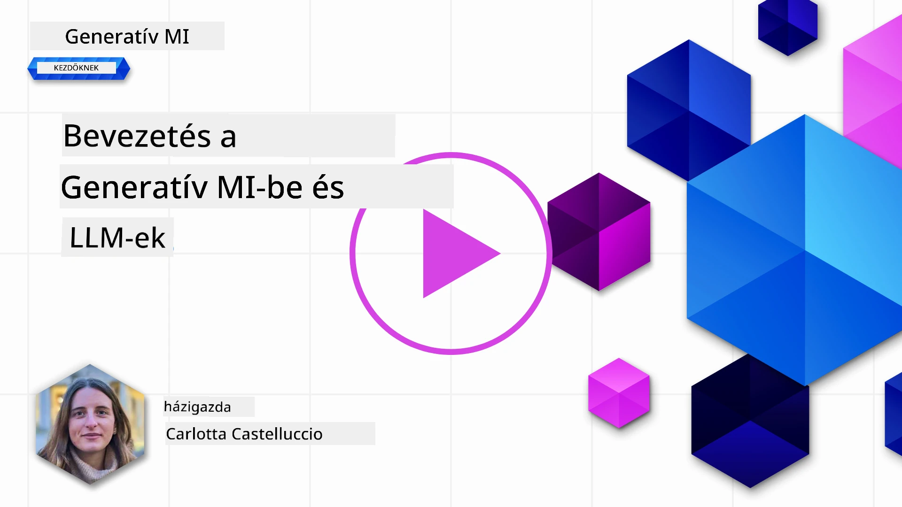
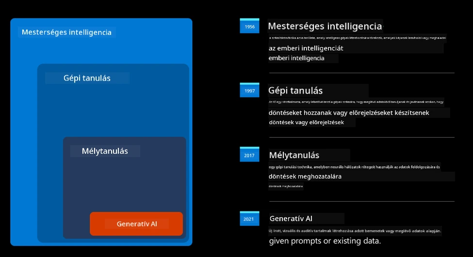
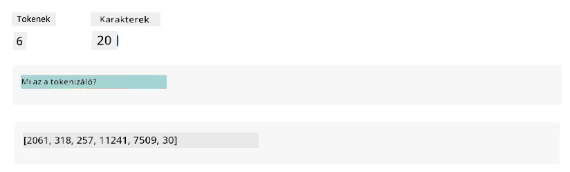
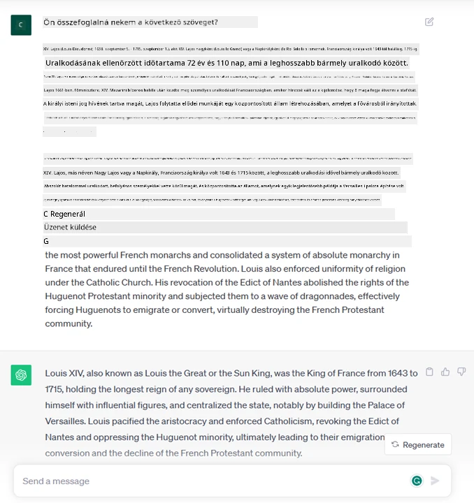
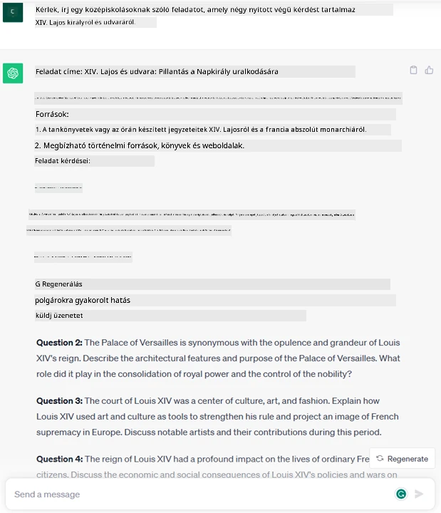
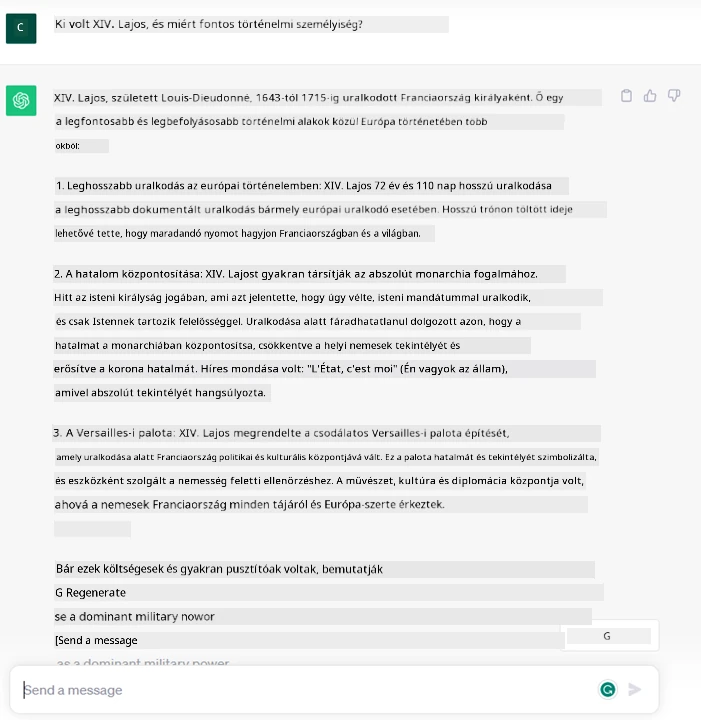
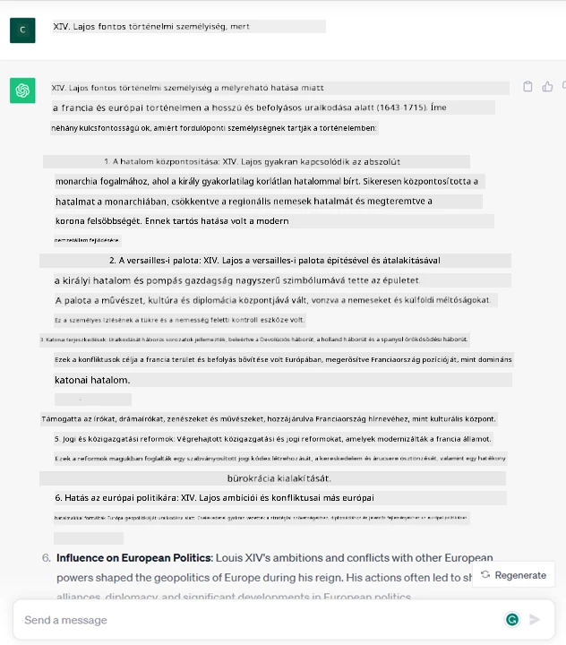
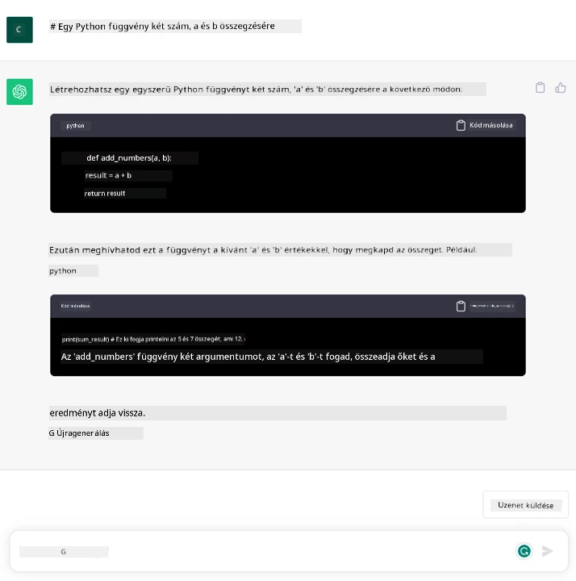

# Bevezetés a Generatív MI-be és a Nagy Nyelvi Modellekbe

_(Kattints a fenti képre a tanóra videójának megtekintéséhez)_

A generatív MI olyan mesterséges intelligencia, amely képes szövegek, képek és más típusú tartalmak generálására. Azért fantasztikus technológia, mert demokratizálja az MI használatát, bárki használhatja egy egyszerű szöveges parancssal, egy természetes nyelven írt mondattal. Nem kell megtanulnod olyan nyelveket, mint a Java vagy az SQL ahhoz, hogy értékes dolgot érj el, csak a saját nyelvedet kell használnod, meg kell mondanod, mit szeretnél, és az MI modell javaslatot tesz rá. Az alkalmazások és hatások óriásiak lehetnek, írhat vagy érthet meg beszámolókat, írhat alkalmazásokat és még sok mást, mindez másodpercek alatt.

Ebben a tananyagban megvizsgáljuk, hogyan használja a startupunk a generatív MI-t, hogy új forgatókönyveket nyisson meg az oktatás világában, és hogyan kezeljük az alkalmazás szociális hatásaival és a technológiai korlátokkal kapcsolatos elkerülhetetlen kihívásokat.

## Bevezetés

Ez az óra a következőket fogja bemutatni:

- Bevezetés az üzleti helyzetbe: a startupunk ötlete és missziója.
- A generatív MI és hogyan jutottunk el a jelenlegi technológiai helyzethez.
- Egy nagy nyelvi modell belső működése.
- A nagy nyelvi modellek fő képességei és gyakorlati felhasználási esetei.

## Tanulási célok

Az óra elvégzése után érteni fogod:

- Mi az a generatív MI, és hogyan működnek a nagy nyelvi modellek.
- Hogyan használhatod a nagy nyelvi modelleket különböző feladatokra, különös tekintettel az oktatási helyzetekre.

## Forgatókönyv: az oktatási startupunk

A generatív mesterséges intelligencia (MI) az MI-technológia csúcsa, amely átlépi korábbi határait. A generatív MI modellek számos képességgel és alkalmazással rendelkeznek, de ebben a tananyagban azt mutatjuk be, hogyan forradalmasítja az oktatást egy fiktív startupon keresztül. Ezt a startupot _startupunknak_ nevezzük. A startupunk az oktatási területen dolgozik, ambiciózus misszióval,

> _a tanuláshoz való hozzáférés javítása globális szinten, az oktatáshoz való egyenlő hozzáférés biztosítása, valamint személyre szabott tanulási élmények nyújtása minden tanulónak az igényei szerint_.

Csapatunk tisztában van azzal, hogy ezt a célt csak a modern idők egyik legerősebb eszközének – a nagy nyelvi modelleknek (LLM-eknek) – az alkalmazásával érhetjük el.

A generatív MI várhatóan forradalmasítja majd a tanulást és az oktatást, hiszen a diákok egész nap virtuális tanárokat használhatnak, akik rengeteg információt és példát szolgáltatnak, míg a tanárok innovatív eszközökkel értékelhetik diákjaikat és visszajelzést adhatnak.

Először is definiáljunk néhány alapfogalmat és terminológiát, amelyeket a tananyag során fogunk használni.

## Hogyan jutottunk el a Generatív MI-hez?

Annak ellenére, hogy az utóbbi időben óriási _hype_ alakult ki a generatív MI modellek körül, ez a technológia évtizedek óta fejlődik, az első kutatási erőfeszítések az 1960-as évekre nyúlnak vissza. Ma már ott tartunk, hogy az MI rendelkezik emberi kognitív képességekkel, mint például a beszélgetés, amint azt például az [OpenAI ChatGPT](https://openai.com/chatgpt) vagy a [Microsoft Copilot](https://copilot.microsoft.com/?WT.mc_id=academic-105485-koreyst) példája is mutatja, amely GPT modellt is használ a beszélgetős webes keresési élményhez.

Egy kicsit visszalépve az időben, az első MI prototípusok típusírt chatbotok voltak, amelyek szakértőcsoportok tudásbázisára épültek, és ezt számítógépen reprezentálták. A tudásbázisban lévő válaszokat a bemeneti szövegben megjelenő kulcsszavak váltották ki.
Azonban hamar kiderült, hogy az ilyen típusú chatbotok nem skálázhatók jól.

### Statisztikai megközelítés az MI-ben: gépi tanulás

A 90-es években fordulópont következett, amikor a szövegelemzésben statisztikai megközelítést alkalmaztak. Ez új algoritmusok kifejlesztéséhez vezetett – melyeket gépi tanulásnak nevezünk –, amelyek képesek voltak mintákat tanulni az adatokból anélkül, hogy kifejezetten programoznák őket. Ez a megközelítés lehetővé teszi, hogy a gépek szimulálják az emberi nyelv megértését: egy statisztikai modellt szöveg-címkepárokon képeznek, amelynek segítségével a modell képes ismeretlen bemeneti szöveget előre definiált címkével kategorizálni, amely a szándékot jelöli.

### Neurális hálózatok és a modern virtuális asszisztensek

Az elmúlt években a hardver technológiai fejlődése, amely nagyobb mennyiségű adatot és összetettebb számításokat tudott kezelni, további kutatásokat ösztönzött az MI terén, ami fejlett gépi tanulási algoritmusok, úgynevezett neurális hálózatok vagy mélytanulási algoritmusok kifejlesztéséhez vezetett.

A neurális hálózatok (különösen a rekurzív neurális hálózatok - RNN-ek) jelentősen javították a természetes nyelvfeldolgozást, lehetővé téve a szöveg jelentésének értelmesebb reprezentálását, figyelembe véve a szó kontextusát a mondaton belül.

Ez a technológia hajtotta az új évezred első évtizedében született virtuális asszisztenseket, amelyek nagyon jól értették az emberi nyelvet, azonosították a szükségletet, és cselekedtek annak kielégítésére – például előre megírt válasszal vagy egy harmadik fél szolgáltatásának igénybevételével.

### Mai napig, Generatív MI

Így jutottunk el a mai generatív MI-hez, amely a mélytanulás egyik alfaja is.

Évtizednyi kutatás után az MI területén egy új modellarchitektúra – az úgynevezett _Transformer_ – leküzdötte az RNN-ek korlátait, és képes sokkal hosszabb szövegszekvenciákat befogadni bemenetként. A transzformerek az attention mechanizmusra épülnek, amely lehetővé teszi a modell számára, hogy különböző súlyt adjon a bemeneteknek, „több figyelmet szentelve” ott, ahol a legrelevánsabb információk koncentrálódnak, függetlenül attól, hogy milyen sorrendben vannak a szövegszekvenciában.

A legtöbb új generatív MI modell – más néven nagy nyelvi modellek (LLM-ek), mivel szöveges bemenetekkel és kimenetekkel dolgoznak – valóban ezen az architektúrán alapul. Ami érdekes ezekben a modellekben – amelyeket óriási mennyiségű, címkézetlen, különböző forrásokból származó adatból, például könyvekből, cikkekből, weboldalakból tanítottak – hogy könnyen alkalmazhatók számos feladatra, és képesek grammatikailag helyes, kreativitás látszatát keltő szöveget generálni. Tehát nem csak hihetetlenül megnövelték a gép képességét a bemeneti szöveg „megértésére”, de képessé tették a modell eredeti embernyelvű válasz generálására is.

## Hogyan működnek a nagy nyelvi modellek?

A következő fejezetben különféle generatív MI modelleket fogunk áttekinteni, de most nézzük meg, hogyan működnek a nagy nyelvi modellek, fókuszálva az OpenAI GPT (Generative Pre-trained Transformer) modellekre.

- **Tokenizáló, szöveg számokká**: A nagy nyelvi modellek szöveget kapnak bemenetként, és szöveget adnak ki. Azonban statisztikai modellek lévén sokkal jobban működnek számokkal, mint szövegszekvenciákkal. Ezért minden bemenetet egy tokenizáló dolgoz fel a magmodelltől való használat előtt. Egy token egy szövegrészlet – változó számú karakterből áll, így a tokenizáló fő feladata a bemenet feldarabolása tokenek tömbjére. Ezután minden tokenhöz hozzárendelnek egy tokenindexet, ami az eredeti szövegrészlet egész számú kódolása.

- **Kimeneti tokenek előrejelzése**: Adott n token bemenetként (maximális n modellfüggően változik), a modell képes egy token kimenetet előrejelezni. Ez a token beépítésre kerül a következő iteráció bemenetébe, egy bővülő ablak mintázatban, lehetővé téve, hogy a felhasználó egy (vagy több) mondatot kapjon válaszként. Ez magyarázza, hogy ha valaha játszottál a ChatGPT-vel, észrevehetted, hogy néha úgy tűnik, mintha egy mondat közepén megállna.

- **Kiválasztási folyamat, valószínűségi eloszlás**: A kimeneti token a modell által az aktuális szövegszekvencia utáni előfordulási valószínűség alapján kerül kiválasztásra. Ez azért van, mert a modell valószínűségi eloszlást jósol az összes lehetséges „következő tokenre”, amit a képzés alapján számol ki. Azonban nem mindig a legmagasabb valószínűségű tokent választják ki az eredményül kapott eloszlásból. Ebbe a választásba véletlenségi tényezőt is beépítenek, így a modell nem determinisztikus módon működik - nem kapjuk ugyanazt a pontos kimenetet ugyanarra a bemenetre. Ez a véletlenség a kreatív gondolkodás folyamatának utánzására készült, és egy, az ún. hőmérsékletnek nevezett modellparaméterrel szabályozható.

## Hogyan használhatja a startupunk a nagy nyelvi modelleket?

Most, hogy jobban értjük egy nagy nyelvi modell belső működését, nézzünk néhány gyakorlati példát a leggyakoribb feladatokról, amelyeket elég jól el tudnak látni, figyelembe véve az üzleti helyzetünket.
Azt mondtuk, hogy egy nagy nyelvi modell fő képessége _szöveg generálása a semmiből, egy természetes nyelven írt szöveges bemenet alapján_.

De milyen típusú szöveges bemenet és kimenet?
Egy nagy nyelvi modell bemenetét promptnak, kimenetét pedig completionnak (befejezésnek) nevezzük, amely a modell mechanizmusára utal, amivel következő tokent generál, hogy kiegészítse a jelenlegi bemenetet. Mélyebben megvizsgáljuk, mi az a prompt, és hogyan lehet úgy megtervezni, hogy a legtöbbet hozhassuk ki a modellből. De egyelőre csak annyit mondunk, hogy egy prompt tartalmazhat:

- Egy **utasítást**, amely meghatározza, milyen típusú kimenetet várunk a modelltől. Ez az utasítás néha tartalmazhat példákat vagy kiegészítő adatokat is.

  1. Egy cikk, könyv, termékértékelések összefoglalását, valamint betekintések kinyerését strukturálatlan adatokból.
    
    
  
  2. Kreatív ötletelés és egy cikk, esszé, házi feladat vagy más szöveg megtervezése.
      
     

- Egy **kérdést**, amelyet egy ügynökkel folytatott beszélgetés formájában teszünk fel.
  
  

- Egy **kiegészítendő szövegrészletet**, ami implicit módon írásbeli segítségkérés.
  
  

- Egy **kódrészletet**, amelyhez magyarázatot vagy dokumentációt kérnek, vagy egy megjegyzést, amely egy adott feladatot ellátó kód generálását kéri.
  
  

A fenti példák elég egyszerűek, és nem akarják teljes körűen bemutatni a nagy nyelvi modellek képességeit. Ezek arra szolgálnak, hogy megmutassák a generatív MI használatának potenciálját, különösen, de nem kizárólagosan oktatási környezetben.

Emellett egy generatív MI modell kimenete nem tökéletes, és néha a modell kreativitása ellene dolgozhat, olyasmi kimenetet eredményezve, amely szavak összekapcsolásából áll, amit az emberi felhasználó a valóság eltorzításaként vagy sértőnek értelmezhet. A generatív MI nem intelligens – legalábbis az intelligencia átfogóbb értelmezésében, amelybe beletartozik a kritikus és kreatív érvelés vagy az érzelmi intelligencia; nem determinisztikus, és nem megbízható, mivel az előállított kimenetben hibás hivatkozások, tartalmak és állítások keveredhetnek helyes információkkal, és kifejező és magabiztos módon jelenhetnek meg. A következő órákban ezekkel a korlátokkal foglalkozunk, és megnézzük, mit tehetünk ezek enyhítésére.

## Feladat

A feladatod, hogy olvass utána többet a [generatív MI-nek](https://en.wikipedia.org/wiki/Generative_artificial_intelligence?WT.mc_id=academic-105485-koreyst), és próbálj meg azonosítani egy területet, ahol ma még nincs generatív MI, de te bevezetnéd. Miben lenne más a hatás, mint a „régi módszerrel”? Tudnál olyasmit megtenni, amit előtte nem tudtál, vagy gyorsabb lennél? Írj egy 300 szavas összefoglalót arról, hogy milyen lenne az álom MI startupod, és tartalmazzon fejléceket, mint „Probléma”, „Hogyan használnám az MI-t”, „Hatás”, és opcionálisan egy üzleti tervet.

Ha ezt a feladatot elvégezted, akár már készen is állhatsz jelentkezni a Microsoft inkubátorába, a [Microsoft for Startups Founders Hubra](https://www.microsoft.com/startups?WT.mc_id=academic-105485-koreyst), ahol krediteket kínálunk az Azure-hoz, OpenAI-hoz, mentoráláshoz és még sok máshoz, nézd meg!

## Tudásellenőrzés

Mi igaz a nagy nyelvi modellekről?

1. Minden alkalommal pontosan ugyanazt a választ kapod.
1. Tökéletes dolgokat csinál, nagyszerű a számok összeadásában, működő kódot állít elő stb.
1. A válasz eltérhet, még ha ugyanazt a promptot használod is. Jól használható vázlat elkészítésére is, legyen az szöveg vagy kód. De a kapott eredményt javítani kell.

V: 3, egy LLM nem determinisztikus, a válasz változik, de szabályozhatod változékonyságát egy hőmérséklet beállítással. Nem szabad elvárni, hogy tökéletes legyen; arra van, hogy elvégezze a nehéz munkát, ami gyakran azt jelenti, hogy kapsz egy jó első kísérletet, amit fokozatosan fejlesztened kell.

## Nagyszerű munka! Folytasd az utat

Az óra elvégzése után nézd meg a [Generatív MI Tanulási gyűjteményünket](https://aka.ms/genai-collection?WT.mc_id=academic-105485-koreyst), hogy tovább fejleszd generatív MI tudásod!

Lépj tovább a 2. leckéhez, ahol megnézzük, hogyan lehet [felfedezni és összehasonlítani különböző LLM típusokat](../02-exploring-and-comparing-different-llms/README.md?WT.mc_id=academic-105485-koreyst)!

---

<!-- CO-OP TRANSLATOR DISCLAIMER START -->
**Jogi nyilatkozat**:
Ez a dokumentum az AI fordítási szolgáltatás, a [Co-op Translator](https://github.com/Azure/co-op-translator) segítségével készült. Bár az pontosságra törekszünk, kérjük, vegye figyelembe, hogy az automatikus fordítások hibákat vagy pontatlanságokat tartalmazhatnak. Az eredeti dokumentum az anyanyelvén tekintendő hiteles forrásnak. Fontos információk esetén professzionális emberi fordítást javasolunk. Nem vállalunk felelősséget semmilyen félreértésért vagy téves értelmezésért, amely ebből a fordításból ered.
<!-- CO-OP TRANSLATOR DISCLAIMER END -->