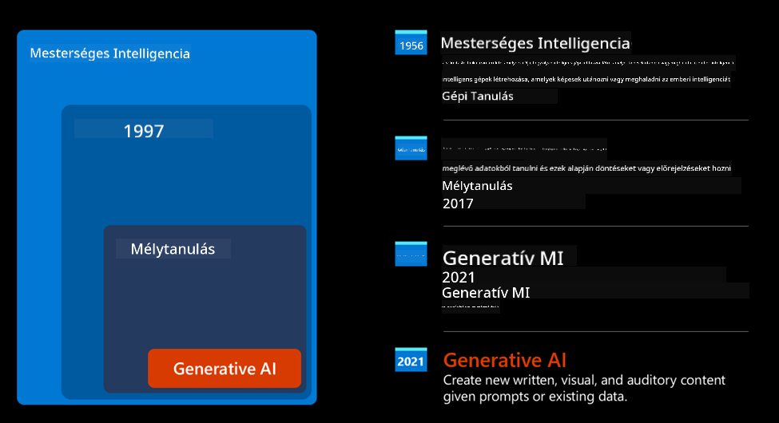
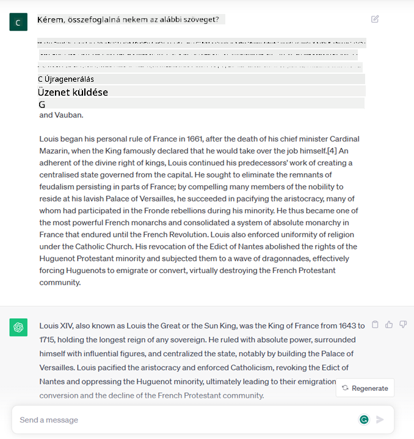
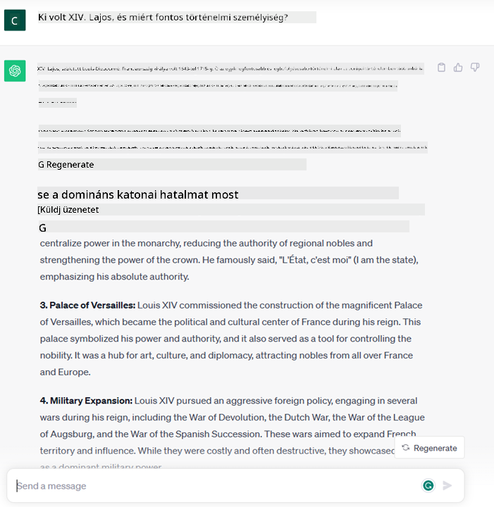
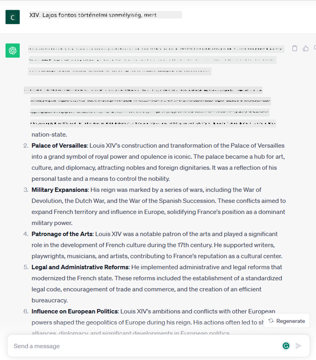

<!--
CO_OP_TRANSLATOR_METADATA:
{
  "original_hash": "bfb7901bdbece1ba3e9f35c400ca33e8",
  "translation_date": "2025-10-17T21:31:30+00:00",
  "source_file": "01-introduction-to-genai/README.md",
  "language_code": "hu"
}
-->
# Bevezetés a generatív mesterséges intelligenciába és a nagy nyelvi modellekbe

_(Kattints a fenti képre, hogy megnézd az óra videóját)_

A generatív mesterséges intelligencia olyan mesterséges intelligencia, amely képes szövegeket, képeket és más típusú tartalmakat létrehozni. Ami igazán lenyűgözővé teszi ezt a technológiát, az az, hogy demokratizálja az AI-t: bárki használhatja, akár egy egyszerű szöveges utasítással, egy természetes nyelven írt mondattal. Nem kell megtanulnod olyan programozási nyelveket, mint a Java vagy az SQL, hogy valami értékeset hozz létre; elég, ha a saját nyelveden megfogalmazod, mit szeretnél, és az AI modell máris javaslatot tesz. Ennek az alkalmazási lehetőségei és hatásai óriásiak: jelentéseket írhatsz vagy érthetsz meg, alkalmazásokat készíthetsz, és még sok minden mást, mindezt másodpercek alatt.

Ebben a tananyagban megvizsgáljuk, hogyan használja startupunk a generatív mesterséges intelligenciát új oktatási forgatókönyvek megvalósítására, valamint hogyan kezeljük az alkalmazás társadalmi vonatkozásaival és a technológiai korlátokkal kapcsolatos elkerülhetetlen kihívásokat.

## Bevezetés

Ez az óra az alábbiakat fogja tárgyalni:

- Üzleti forgatókönyv bemutatása: startup ötletünk és küldetésünk.
- Generatív mesterséges intelligencia és a jelenlegi technológiai környezet kialakulása.
- Nagy nyelvi modellek működése.
- Nagy nyelvi modellek fő képességei és gyakorlati felhasználási esetei.

## Tanulási célok

Az óra elvégzése után megérted:

- Mi a generatív mesterséges intelligencia, és hogyan működnek a nagy nyelvi modellek.
- Hogyan használhatod a nagy nyelvi modelleket különböző felhasználási esetekben, különös tekintettel az oktatási forgatókönyvekre.

## Forgatókönyv: oktatási startupunk

A generatív mesterséges intelligencia (AI) az AI technológia csúcspontját képviseli, és kitolja a határokat, amelyeket korábban lehetetlennek tartottunk. A generatív AI modellek számos képességgel és alkalmazási lehetőséggel rendelkeznek, de ebben a tananyagban azt vizsgáljuk meg, hogyan forradalmasítja az oktatást egy fiktív startup révén. Ezt a startupot _saját startupunknak_ fogjuk nevezni. Startupunk az oktatás területén tevékenykedik, ambiciózus küldetésnyilatkozattal:

> _a tanulás hozzáférhetőségének javítása globális szinten, az oktatáshoz való egyenlő hozzáférés biztosítása és személyre szabott tanulási élmények nyújtása minden tanulónak, az igényeiknek megfelelően_.

Startupunk csapata tisztában van azzal, hogy ezt a célt nem tudjuk elérni anélkül, hogy ne használnánk a modern kor egyik leghatékonyabb eszközét – a nagy nyelvi modelleket (LLM-eket).

A generatív mesterséges intelligencia várhatóan forradalmasítja a mai tanulás és tanítás módját, lehetővé téve a diákok számára, hogy 24 órás virtuális tanárok álljanak rendelkezésükre, akik hatalmas mennyiségű információt és példát nyújtanak, míg a tanárok innovatív eszközöket használhatnak diákjaik értékelésére és visszajelzés adására.

Kezdjük azzal, hogy meghatározunk néhány alapfogalmat és terminológiát, amelyeket a tananyag során használni fogunk.

## Hogyan jött létre a generatív mesterséges intelligencia?

Annak ellenére, hogy a generatív AI modellek bejelentése körüli rendkívüli _hype_ az utóbbi időben nagy figyelmet kapott, ez a technológia évtizedek óta fejlődik, az első kutatási erőfeszítések az 1960-as évekre nyúlnak vissza. Mostanra eljutottunk oda, hogy az AI emberi kognitív képességekkel rendelkezik, például képes beszélgetni, ahogy azt például az [OpenAI ChatGPT](https://openai.com/chatgpt) vagy a [Bing Chat](https://www.microsoft.com/edge/features/bing-chat?WT.mc_id=academic-105485-koreyst) mutatja, amely szintén GPT modellt használ a Bing kereső beszélgetéseihez.

Ha visszatekintünk, az AI legelső prototípusai gépírással működő chatbotok voltak, amelyek egy szakértői csoport által kinyert tudásbázisra támaszkodtak, és ezt számítógépen reprezentálták. A tudásbázis válaszait az input szövegben megjelenő kulcsszavak váltották ki. Azonban hamar világossá vált, hogy az ilyen megközelítés, amely gépírással működő chatbotokat használ, nem skálázható jól.

### Statisztikai megközelítés az AI-hoz: gépi tanulás

Fordulópontot jelentett az 1990-es években a szövegelemzés statisztikai megközelítésének alkalmazása. Ez új algoritmusok – gépi tanulás néven ismert – kifejlesztéséhez vezetett, amelyek képesek mintákat tanulni az adatokból anélkül, hogy kifejezetten programozva lennének. Ez a megközelítés lehetővé tette a gépek számára, hogy szimulálják az emberi nyelv megértését: egy statisztikai modellt szöveg-címke párokon képeznek ki, lehetővé téve a modell számára, hogy az ismeretlen bemeneti szöveget egy előre meghatározott címkével osztályozza, amely a szöveg szándékát képviseli.

### Neurális hálózatok és modern virtuális asszisztensek

Az utóbbi években a hardver technológiai fejlődése, amely nagyobb mennyiségű adat és összetettebb számítások kezelésére képes, ösztönözte az AI kutatását, ami fejlett gépi tanulási algoritmusok, például neurális hálózatok vagy mélytanulási algoritmusok kifejlesztéséhez vezetett.

A neurális hálózatok (különösen az ismétlődő neurális hálózatok – RNN-ek) jelentősen javították a természetes nyelvfeldolgozást, lehetővé téve a szöveg jelentésének értelmezését egy sokkal jelentőségteljesebb módon, figyelembe véve egy szó kontextusát egy mondatban.

Ez a technológia táplálta az első évtizedben született virtuális asszisztenseket, amelyek nagyon ügyesen értelmezték az emberi nyelvet, azonosították az igényeket, és végrehajtották azokat – például előre meghatározott szkripttel válaszolva vagy egy harmadik fél szolgáltatását használva.

### Napjaink, generatív mesterséges intelligencia

Így jutottunk el a mai generatív mesterséges intelligenciához, amely a mélytanulás egyik részhalmazának tekinthető.

Évtizedek AI kutatásai után egy új modellarchitektúra – _Transformer_ néven – leküzdötte az RNN-ek korlátait, és képes lett sokkal hosszabb szöveges sorozatokat fogadni bemenetként. A Transformerek az úgynevezett figyelemmechanizmuson alapulnak, amely lehetővé teszi a modell számára, hogy különböző súlyokat rendeljen a kapott bemenetekhez, „nagyobb figyelmet szentelve” azoknak a részeknek, ahol a legfontosabb információk koncentrálódnak, függetlenül azok sorrendjétől a szöveges sorozatban.

A legtöbb új generatív AI modell – más néven nagy nyelvi modellek (LLM-ek), mivel szöveges bemenetekkel és kimenetekkel dolgoznak – valójában ezen az architektúrán alapul. Ami érdekes ezekben a modellekben – amelyeket hatalmas mennyiségű címkézetlen adaton képeztek ki, különböző forrásokból, például könyvekből, cikkekből és weboldalakról – az az, hogy sokféle feladatra adaptálhatók, és grammatikailag helyes szöveget tudnak generálni, amelyben némi kreativitás is megjelenik. Tehát nemcsak hogy hihetetlenül javították a gépek képességét arra, hogy „megértsék” a bemeneti szöveget, hanem lehetővé tették számukra, hogy eredeti választ generáljanak emberi nyelven.

## Hogyan működnek a nagy nyelvi modellek?

A következő fejezetben különböző generatív AI modelleket fogunk megvizsgálni, de most nézzük meg, hogyan működnek a nagy nyelvi modellek, különös tekintettel az OpenAI GPT (Generative Pre-trained Transformer) modellekre.

- **Tokenizáló, szöveg számokká alakítása**: A nagy nyelvi modellek szöveget kapnak bemenetként, és szöveget generálnak kimenetként. Azonban, mivel statisztikai modellek, sokkal jobban működnek számokkal, mint szöveges sorozatokkal. Ezért minden bemenetet egy tokenizáló dolgoz fel, mielőtt a magmodell használná. Egy token egy szövegrészlet – amely változó számú karakterből áll, így a tokenizáló fő feladata a bemenet tokenek tömbjére való felosztása. Ezután minden tokenhez hozzárendelnek egy token indexet, amely az eredeti szövegrészlet egész számú kódolása.

- **Kimeneti tokenek előrejelzése**: Adott n token bemenetként (a max n modellről modellre változik), a modell képes egy token előrejelzésére kimenetként. Ez a token bekerül a következő iteráció bemenetébe, egy bővülő ablak mintázatban, lehetővé téve a felhasználói élményt, hogy egy (vagy több) mondatot kapjunk válaszként. Ez megmagyarázza, hogy ha valaha játszottál a ChatGPT-vel, észrevehetted, hogy néha úgy tűnik, mintha megállna egy mondat közepén.

- **Kiválasztási folyamat, valószínűségi eloszlás**: A kimeneti tokent a modell a jelenlegi szövegsorozat után való előfordulásának valószínűsége alapján választja ki. Ez azért van, mert a modell valószínűségi eloszlást jósol az összes lehetséges „következő token” felett, amelyet a képzése alapján számít ki. Azonban nem mindig választják ki a legmagasabb valószínűségű tokent az eredményül kapott eloszlásból. Egy bizonyos fokú véletlenszerűség kerül hozzáadásra ehhez a választáshoz, oly módon, hogy a modell nem-determinisztikus módon működik – nem kapjuk meg pontosan ugyanazt a kimenetet ugyanarra a bemenetre. Ez a véletlenszerűség mértéke a kreatív gondolkodás folyamatának szimulálására szolgál, és egy hőmérséklet nevű modellparaméterrel hangolható.

## Hogyan használhatja startupunk a nagy nyelvi modelleket?

Most, hogy jobban megértjük egy nagy nyelvi modell működését, nézzünk néhány gyakorlati példát a leggyakoribb feladatokra, amelyeket ezek a modellek nagyon jól el tudnak végezni, különös tekintettel üzleti forgatókönyvünkre.
Azt mondtuk, hogy egy nagy nyelvi modell fő képessége _szöveg létrehozása a semmiből, természetes nyelven írt szöveges bemenet alapján_.

De milyen típusú szöveges bemenet és kimenet?
A nagy nyelvi modell bemenetét promptnak nevezik, míg a kimenetet completionnek, amely a modell mechanizmusára utal, amely a következő token generálásával egészíti ki a jelenlegi bemenetet. Mélyebben fogunk belemenni abba, hogy mi az a prompt, és hogyan lehet úgy megtervezni, hogy a legtöbbet hozzuk ki a modellből. De most csak annyit mondjunk, hogy egy prompt tartalmazhat:

- Egy **utasítást**, amely meghatározza, milyen típusú kimenetet várunk a modelltől. Ez az utasítás néha tartalmazhat példákat vagy további adatokat.

  1. Cikk, könyv, termékértékelések összefoglalása és betekintések kinyerése strukturálatlan adatokból.
    
    
  
  2. Kreatív ötletelés és tervezés cikkhez, esszéhez, feladathoz vagy más tartalomhoz.
      
     

- Egy **kérdést**, amelyet egy ügynökkel folytatott beszélgetés formájában teszünk fel.
  
  

- Egy **szövegrészletet, amelyet ki kell egészíteni**, ami implicit módon írási segítséget kér.
  
  

- Egy **kódrészletet**, amelyhez magyarázatot és dokumentációt kérünk, vagy egy megjegyzést, amely egy adott feladatot végrehajtó kódrészlet generálását kéri.
  
  

A fenti példák meglehetősen egyszerűek, és nem céljuk, hogy kimerítően bemutassák a nagy nyelvi modellek képességeit. Céljuk, hogy megmutassák a generatív mesterséges intelligencia használatának lehetőségeit, különösen, de nem kizárólag oktatási kontextusban.

Ezenkívül a generatív AI modell kimenete nem tökéletes, és néha a modell kreativitása ellene dolgozhat, olyan kimenetet eredményezve, amely szavak kombinációja, amelyet az emberi felhasználó a valóság eltorzításaként értelmezhet, vagy sértő lehet. A generatív mesterséges intelligencia nem intelligens – legalábbis az intelligencia átfogóbb definíciója szerint, amely magában foglalja a kritikai és kreatív érvelést vagy az érzelmi intelligenciát; nem determinisztikus, és nem megbízható, mivel a helytelen hivatkozások, tartalmak és állítások kombinálódhatnak a helyes információkkal, és meggyőző és magabiztos módon kerülhetnek bemutatásra. A következő órákban foglalkozni fogunk ezekkel a korlátokkal, és megnézzük, mit tehetünk azok enyhítésére.

## Feladat

Olvass utána többet a [generatív mesterséges intelligenciának](https://en.wikipedia.org/wiki/Gener
Lépj tovább a 2. leckére, ahol megvizsgáljuk, hogyan lehet [felfedezni és összehasonlítani a különböző LLM típusokat](../02-exploring-and-comparing-different-llms/README.md?WT.mc_id=academic-105485-koreyst)!

---

**Felelősség kizárása**:  
Ez a dokumentum az [Co-op Translator](https://github.com/Azure/co-op-translator) AI fordítási szolgáltatás segítségével lett lefordítva. Bár törekszünk a pontosságra, kérjük, vegye figyelembe, hogy az automatikus fordítások hibákat vagy pontatlanságokat tartalmazhatnak. Az eredeti dokumentum az eredeti nyelven tekintendő hiteles forrásnak. Kritikus információk esetén javasolt professzionális emberi fordítást igénybe venni. Nem vállalunk felelősséget semmilyen félreértésért vagy téves értelmezésért, amely a fordítás használatából eredhet.