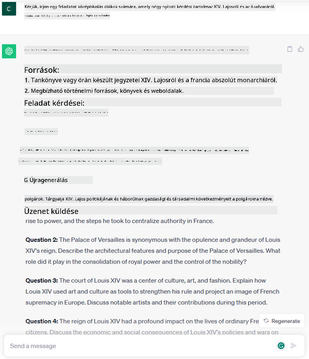

<!--
CO_OP_TRANSLATOR_METADATA:
{
  "original_hash": "f53ba0fa49164f9323043f1c6b11f2b1",
  "translation_date": "2025-07-09T08:00:10+00:00",
  "source_file": "01-introduction-to-genai/README.md",
  "language_code": "hu"
}
-->
# Bevezetés a generatív MI-be és a nagy nyelvi modellekbe

_(Kattints a fenti képre a lecke videójának megtekintéséhez)_

A generatív MI olyan mesterséges intelligencia, amely képes szöveget, képeket és más tartalomtípusokat létrehozni. Azért fantasztikus technológia, mert demokratizálja az MI-t: bárki használhatja egy egyszerű szöveges utasítással, egy természetes nyelven írt mondattal. Nem kell megtanulnod olyan nyelveket, mint a Java vagy az SQL, hogy értékes dolgot hozz létre, elég, ha a saját nyelveden megfogalmazod, mit szeretnél, és az MI modell javaslatot ad. Ennek alkalmazási területei és hatásai hatalmasak: percek alatt írhatunk vagy érthetünk meg jelentéseket, készíthetünk alkalmazásokat és még sok mást.

Ebben a tananyagban megvizsgáljuk, hogyan használja startupunk a generatív MI-t új lehetőségek megnyitására az oktatás világában, és hogyan kezeljük az ezzel járó társadalmi hatásokból és technológiai korlátokból fakadó kihívásokat.

## Bevezetés

Ez a lecke a következőket fogja lefedni:

- Üzleti helyzet bemutatása: startup ötletünk és küldetésünk.
- Generatív MI és a jelenlegi technológiai környezet áttekintése.
- Egy nagy nyelvi modell belső működése.
- A nagy nyelvi modellek fő képességei és gyakorlati alkalmazásai.

## Tanulási célok

A lecke elvégzése után meg fogod érteni:

- Mi az a generatív MI és hogyan működnek a nagy nyelvi modellek.
- Hogyan használhatod a nagy nyelvi modelleket különböző feladatokra, különös tekintettel az oktatási helyzetekre.

## Helyzet: oktatási startupunk

A generatív mesterséges intelligencia az MI technológia csúcsa, amely átlépi a korábban elképzelhetetlen határokat. A generatív MI modellek számos képességgel és alkalmazással rendelkeznek, de ebben a tananyagban azt vizsgáljuk meg, hogyan forradalmasítja az oktatást egy fiktív startup segítségével. Ezt a startupot _startupunknak_ nevezzük. Startupunk az oktatás területén tevékenykedik, ambiciózus küldetésünk:

> _a tanuláshoz való hozzáférés javítása globális szinten, az oktatáshoz való egyenlő esélyek biztosítása, valamint személyre szabott tanulási élmények nyújtása minden tanulónak az igényeik szerint_.

Csapatunk tisztában van vele, hogy ezt a célt nem érhetjük el a modern idők egyik legerősebb eszköze, a nagy nyelvi modellek (LLM-ek) használata nélkül.

A generatív MI várhatóan forradalmasítja a tanulás és tanítás módját, hiszen a diákoknak 24 órában elérhető virtuális tanáraik lesznek, akik hatalmas mennyiségű információt és példát szolgáltatnak, a tanárok pedig innovatív eszközöket használhatnak a diákok értékelésére és visszajelzés adására.

Kezdésként definiáljunk néhány alapfogalmat és terminológiát, amelyeket a tananyag során használni fogunk.

## Hogyan jutottunk el a generatív MI-hez?

Annak ellenére, hogy a generatív MI modellek bejelentése óriási _hype_-ot váltott ki, ez a technológia évtizedek óta fejlődik, az első kutatások az 1960-as évekre nyúlnak vissza. Ma már olyan MI-vel rendelkezünk, amely emberi kognitív képességekkel bír, például beszélgetésre, ahogy azt például az [OpenAI ChatGPT](https://openai.com/chatgpt) vagy a [Bing Chat](https://www.microsoft.com/edge/features/bing-chat?WT.mc_id=academic-105485-koreyst) is mutatja, amely szintén GPT modellt használ a Bing keresőbeszélgetéseihez.

Egy kis visszatekintés: az MI első prototípusai gépelt chatbotok voltak, amelyek egy szakértői csoport tudásbázisára épültek, és a válaszokat kulcsszavak alapján adták. Ez a megközelítés azonban hamar kiderült, hogy nem skálázható.

### Statisztikai megközelítés az MI-ben: gépi tanulás

Az 1990-es években fordulópontot jelentett a statisztikai szövegelemzés alkalmazása. Ez vezetett új algoritmusok – a gépi tanulás – kifejlesztéséhez, amelyek képesek voltak adatmintákból tanulni anélkül, hogy explicit módon programozták volna őket. Ez lehetővé tette, hogy a gépek szimulálják az emberi nyelv megértését: egy statisztikai modellt szöveg-címke párokon tanítottak, így az ismeretlen szövegeket előre definiált címkékkel tudta osztályozni, amelyek a mondanivaló szándékát jelzik.

### Neurális hálózatok és a modern virtuális asszisztensek

Az utóbbi években a hardverek fejlődése, amelyek nagyobb adatmennyiségek és összetettebb számítások kezelésére képesek, ösztönözte az MI-kutatást, ami fejlett gépi tanulási algoritmusok – neurális hálózatok vagy mélytanulási algoritmusok – kifejlesztéséhez vezetett.

A neurális hálózatok (különösen a visszatérő neurális hálózatok – RNN-ek) jelentősen javították a természetes nyelvfeldolgozást, lehetővé téve a szöveg jelentésének mélyebb megértését, figyelembe véve a szavak kontextusát a mondatban.

Ez a technológia hajtotta az első évtizedben született virtuális asszisztenseket, amelyek kiválóan értették az emberi nyelvet, felismertek egy igényt, és végrehajtottak egy műveletet annak kielégítésére – például előre megírt válaszokat adtak vagy harmadik fél szolgáltatását használták.

### Napjaink, generatív MI

Így jutottunk el a mai generatív MI-hez, amely a mélytanulás egyik ága.

Évtizedes kutatás után az MI területén egy új modellarchitektúra – az _Transformer_ – leküzdötte az RNN-ek korlátait, képes hosszabb szövegsorozatokat fogadni bemenetként. A Transformer az attention mechanizmusra épül, amely lehetővé teszi, hogy a modell különböző súlyokat adjon a bemeneteknek, „több figyelmet szentelve” a legfontosabb információknak, függetlenül azok sorrendjétől a szövegben.

A legtöbb mai generatív MI modell – más néven nagy nyelvi modellek (LLM-ek), mivel szöveges bemenetekkel és kimenetekkel dolgoznak – ezen az architektúrán alapul. Ezek a modellek hatalmas mennyiségű címkézetlen adatból – könyvekből, cikkekből, weboldalakból – tanulnak, és képesek sokféle feladatra alkalmazkodni, valamint nyelvtanilag helyes, kreativitásra emlékeztető szöveget generálni. Így nemcsak jelentősen javították a gép „megértő” képességét, hanem lehetővé tették, hogy eredeti, emberi nyelvű válaszokat hozzanak létre.

## Hogyan működnek a nagy nyelvi modellek?

A következő fejezetben különböző generatív MI modelleket fogunk megvizsgálni, de most nézzük meg, hogyan működnek a nagy nyelvi modellek, különös tekintettel az OpenAI GPT (Generative Pre-trained Transformer) modellekre.

- **Tokenizáló, szövegből számok**: A nagy nyelvi modellek szöveget kapnak bemenetként és szöveget adnak ki. Mivel statisztikai modellek, jobban működnek számokkal, mint szövegsorozatokkal. Ezért minden bemenetet egy tokenizáló dolgoz fel, mielőtt a magmodellhez kerülne. Egy token egy szövegrészlet – változó hosszúságú karakterekből áll –, így a tokenizáló fő feladata a bemenet feldarabolása tokenek tömbjére. Ezután minden tokenhez hozzárendel egy tokenindexet, ami az eredeti szövegrészlet egész számú kódolása.

- **Kimeneti tokenek előrejelzése**: Adott n token bemenetként (amelynek maximális hossza modelltől függően változik), a modell képes egy token kimenetet előrejelezni. Ez a token bekerül a következő iteráció bemenetébe, egy bővülő ablak mintázatban, ami jobb felhasználói élményt nyújt, hiszen egy vagy több mondatot kapunk válaszként. Ez magyarázza, hogy ha valaha játszottál a ChatGPT-vel, néha úgy tűnhet, mintha félbeszakadna egy mondat közepén.

- **Kiválasztási folyamat, valószínűségi eloszlás**: A kimeneti tokent a modell a valószínűsége alapján választja ki, hogy az adott szövegsorozat után milyen eséllyel következik. A modell egy valószínűségi eloszlást jósol az összes lehetséges „következő tokenre”, amelyet a tanítás alapján számít ki. Azonban nem mindig a legmagasabb valószínűségű token kerül kiválasztásra. Egyfajta véletlenszerűség is beépül a választásba, így a modell nem determinisztikus – ugyanarra a bemenetre nem mindig ugyanazt a választ kapjuk. Ezt a véletlenszerűséget a kreatív gondolkodás szimulálására használják, és egy hőmérséklet nevű paraméterrel szabályozható.

## Hogyan használhatja startupunk a nagy nyelvi modelleket?

Most, hogy jobban értjük egy nagy nyelvi modell belső működését, nézzünk néhány gyakorlati példát a leggyakoribb feladatokra, amelyeket jól el tudnak végezni, startupunk üzleti helyzetére fókuszálva.

Azt mondtuk, hogy egy nagy nyelvi modell fő képessége _szöveg generálása a semmiből, egy természetes nyelven írt szöveges bemenet alapján_.

De milyen szöveges bemenet és kimenet lehet ez?
A nagy nyelvi modell bemenetét promptnak, a kimenetét pedig completionnek nevezzük, ami arra utal, hogy a modell a következő tokent generálja a jelenlegi bemenet kiegészítésére. Mélyebben belemegyünk majd, mi az a prompt és hogyan tervezzük meg úgy, hogy a legtöbbet hozzuk ki a modellből. Egyelőre annyit mondhatunk, hogy egy prompt tartalmazhat:

- Egy **utasítást**, amely meghatározza, milyen típusú kimenetet várunk a modelltől. Ez az utasítás néha példákat vagy további adatokat is tartalmazhat.

  1. Cikk, könyv, termékértékelések összefoglalása, valamint betekintések kinyerése strukturálatlan adatokból.
    
    
  
  2. Kreatív ötletelés és cikk, esszé, beadandó vagy más írás megtervezése.
      
     

- Egy **kérdést**, amelyet egy ügynökkel folytatott beszélgetés formájában tesznek fel.
  
  

- Egy **kiegészítendő szövegrészt**, ami implicit módon írásbeli segítségkérés.
  
  

- Egy **kódrészletet**, amelyhez magyarázatot és dokumentációt kérnek, vagy egy kommentet, amely egy adott feladatot ellátó kód generálását kéri.
  
  

A fenti példák egyszerűek, és nem teljes körű bemutatói a nagy nyelvi modellek képességeinek. Inkább azt mutatják be, milyen potenciál rejlik a generatív MI használatában, különösen, de nem kizárólag oktatási környezetben.

Fontos megjegyezni, hogy egy generatív MI modell kimenete nem tökéletes, és néha a modell kreativitása hátrányára válhat, olyan kimenetet eredményezve, amelyet az emberi felhasználó valóságmágusításnak vagy sértőnek értelmezhet. A generatív MI nem intelligens – legalábbis nem a szélesebb értelemben vett intelligencia, amely magában foglalja a kritikus és kreatív gondolkodást vagy az érzelmi intelligenciát; nem determinisztikus, és nem megbízható, mivel téves hivatkozások, tartalmak és állítások keveredhetnek helyes információkkal, és meggyőző, magabiztos módon jelenhetnek meg. A következő leckékben ezekkel a korlátokkal foglalkozunk, és megnézzük, mit tehetünk a mérséklésük érdekében.

## Feladat

A feladatod, hogy olvass utána többet a [generatív MI-nek](https://en.wikipedia.org/wiki/Generative_artificial_intelligence?WT.mc_id=academic-105485-koreyst), és próbálj meg azonosítani egy olyan területet, ahol ma még nincs generatív MI, de bevezetnéd. Hogyan változna meg a hatás a „régi módszerhez” képest? Tudnál olyat csinálni, amit korábban nem, vagy gyorsabb lennél? Írj egy 300 szavas összefoglalót arról, milyen lenne az álom MI startupod, és használj címsorokat, mint „Probléma”, „Hogyan használnám az MI-t”, „Hatás”, és opcionálisan egy üzleti tervet.

Ha elvégzed ezt a feladatot, akár készen állhatsz arra is, hogy jelentkezz a Microsoft inkubátorába, a [Microsoft for Startups Founders Hub](https://www.microsoft.com/startups?WT.mc_id=academic-105485-koreyst) programba, ahol krediteket kínálunk Azure-ra, OpenAI-ra, mentorálásra és még sok másra, nézd meg!

## Tudásellenőrzés

Mi igaz a nagy nyelvi modellekről?

1. Minden alkalommal pontosan ugyanazt a választ kapod.
1. Tökéletesen végzi a feladatokat, jól számol, működő kódot generál stb.
1. A válasz változhat ugyanazzal a prompttal is. Nagyon jó első vázlatot ad szöveg vagy kód formájában, de a végeredményt fejleszteni kell.

Válasz: 3, egy LLM nem determinisztikus, a válasz változik, de a változékonyság szabályozható a hőmérséklet paraméterrel. Nem szabad elvárni, hogy tökéletes legyen, inkább a nehéz munk
Lépj tovább a 2. leckébe, ahol megnézzük, hogyan lehet [felfedezni és összehasonlítani különböző LLM típusokat](../02-exploring-and-comparing-different-llms/README.md?WT.mc_id=academic-105485-koreyst)!

**Jogi nyilatkozat**:  
Ez a dokumentum az AI fordító szolgáltatás, a [Co-op Translator](https://github.com/Azure/co-op-translator) segítségével készült. Bár a pontosságra törekszünk, kérjük, vegye figyelembe, hogy az automatikus fordítások hibákat vagy pontatlanságokat tartalmazhatnak. Az eredeti dokumentum az anyanyelvén tekintendő hiteles forrásnak. Fontos információk esetén szakmai, emberi fordítást javaslunk. Nem vállalunk felelősséget a fordítás használatából eredő félreértésekért vagy téves értelmezésekért.